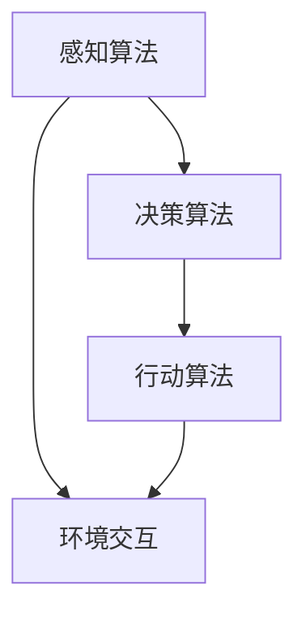

                 

# AI Agent: AI的下一个风口 具身智能的定义与特点

## 关键词：
* 人工智能
* 具身智能
* AI Agent
* 自动化
* 自主学习
* 真实世界交互

## 摘要：
本文将深入探讨人工智能（AI）领域的一个重要发展方向——具身智能（Embodied AI），以及其核心概念——AI Agent。我们将从背景介绍出发，逐步分析具身智能的定义与特点，探讨其核心算法原理、数学模型，并通过实际项目案例展示其在现实世界中的应用。文章还将介绍相关的开发工具和资源，以及未来的发展趋势与挑战。通过本文的阅读，读者将全面了解具身智能的现状及其在AI领域的潜在价值。

## 1. 背景介绍

### 1.1 目的和范围
本文旨在全面解析具身智能这一前沿技术，帮助读者理解其在人工智能领域的地位与作用。我们将讨论具身智能的定义与特点，分析其背后的算法原理与数学模型，并通过实例展示其在现实世界的应用。文章还将推荐相关的学习资源与开发工具，为读者提供全面的技术指导。

### 1.2 预期读者
本文适合对人工智能和自动化技术有一定了解的读者，特别是那些对具身智能感兴趣的技术人员、研究人员和开发者。同时，也适合对AI Agent概念感兴趣的所有读者。

### 1.3 文档结构概述
本文将分为以下几个部分：

1. 背景介绍
2. 核心概念与联系
3. 核心算法原理 & 具体操作步骤
4. 数学模型和公式 & 详细讲解 & 举例说明
5. 项目实战：代码实际案例和详细解释说明
6. 实际应用场景
7. 工具和资源推荐
8. 总结：未来发展趋势与挑战
9. 附录：常见问题与解答
10. 扩展阅读 & 参考资料

### 1.4 术语表

#### 1.4.1 核心术语定义
- **人工智能（AI）**：一种模拟人类智能的技术，使计算机能够执行认知任务。
- **具身智能（Embodied AI）**：一种将人工智能与物理环境结合的AI技术，使AI系统能够感知、交互和适应真实世界。
- **AI Agent**：具有自主决策和行动能力的计算机程序，能够根据环境反馈进行调整。

#### 1.4.2 相关概念解释
- **感知**：通过传感器获取环境信息的过程。
- **行动**：根据感知到的信息采取适当动作的过程。
- **自主决策**：在不依赖外部指导的情况下，根据当前状态做出决策的能力。
- **自适应**：在面临不确定性和变化时，能够调整自身行为的能力。

#### 1.4.3 缩略词列表
- **AI**：人工智能
- **GAN**：生成对抗网络
- **RNN**：循环神经网络
- **CNN**：卷积神经网络
- **ROS**：机器人操作系统

## 2. 核心概念与联系

### 2.1 具身智能的定义

具身智能是一种结合了人工智能与物理环境的新兴技术。与传统的AI系统不同，具身智能系统不仅能够处理数字信息，还能与物理世界进行交互。这种交互能力使得AI系统能够更好地理解、适应和改变其所在的环境。


如图所示，具身智能的核心在于AI Agent，它通过感知（Perception）、行动（Action）和自主决策（Autonomous Decision-Making）实现与环境的高效交互。

### 2.2 AI Agent

AI Agent是具身智能系统的核心组成部分。它是一种具有自主决策和行动能力的计算机程序。AI Agent能够感知环境中的各种信息，如视觉、听觉、触觉等，并根据这些信息采取适当的行动。这种能力使得AI Agent能够在复杂多变的环境中生存和繁荣。


如图所示，AI Agent由感知模块、决策模块和行动模块组成。感知模块负责收集环境信息，决策模块负责基于感知信息做出决策，行动模块负责执行决策结果。

### 2.3 核心算法原理

具身智能的核心算法主要包括感知算法、决策算法和行动算法。以下是一个简单的Mermaid流程图，展示了这些算法的基本架构：



### 2.4 核心特点

具身智能的核心特点包括：

1. **与环境的高度交互**：AI Agent能够实时感知环境变化，并根据感知信息调整自身行为。
2. **自主决策能力**：AI Agent能够在不依赖外部指导的情况下，根据当前状态做出决策。
3. **自适应能力**：在面对不确定性和变化时，AI Agent能够调整自身行为，以适应新的环境。

## 3. 核心算法原理 & 具体操作步骤

### 3.1 感知算法

感知算法是具身智能系统的核心组成部分，负责收集和处理环境信息。以下是一个简单的感知算法伪代码：

```plaintext
感知算法：
    while (true):
        感知数据 = 收集环境数据（如视觉、听觉、触觉等）
        处理感知数据
        更新感知状态
```

感知算法的基本步骤包括：

1. 收集环境数据：通过传感器获取视觉、听觉、触觉等信息。
2. 处理感知数据：对收集到的数据进行预处理，如去噪、特征提取等。
3. 更新感知状态：将处理后的感知数据用于更新AI Agent的感知状态。

### 3.2 决策算法

决策算法负责根据感知状态和目标，为AI Agent生成行动方案。以下是一个简单的决策算法伪代码：

```plaintext
决策算法：
    while (true):
        目标 = 当前目标
        行动方案 = 计算最优行动方案
        执行行动方案
```

决策算法的基本步骤包括：

1. 确定当前目标：根据AI Agent的当前状态和任务，确定需要达到的目标。
2. 计算最优行动方案：使用算法（如强化学习、规划算法等）计算最优行动方案。
3. 执行行动方案：根据计算出的行动方案，执行相应的行动。

### 3.3 行动算法

行动算法负责根据决策结果，执行相应的物理行动。以下是一个简单的行动算法伪代码：

```plaintext
行动算法：
    while (true):
        行动指令 = 接收决策结果
        执行行动指令
```

行动算法的基本步骤包括：

1. 接收决策结果：从决策模块获取执行指令。
2. 执行行动指令：根据指令，执行相应的物理行动。

## 4. 数学模型和公式 & 详细讲解 & 举例说明

### 4.1 感知算法的数学模型

感知算法的核心是特征提取，通常使用卷积神经网络（CNN）实现。以下是一个简单的CNN数学模型：

$$
h_l = \sigma(W_l \cdot a_{l-1} + b_l)
$$

其中，$h_l$表示第$l$层的特征映射，$a_{l-1}$表示上一层的激活值，$W_l$和$b_l$分别表示第$l$层的权重和偏置，$\sigma$表示激活函数。

### 4.2 决策算法的数学模型

决策算法的核心是计算最优行动方案，通常使用强化学习实现。以下是一个简单的Q-learning数学模型：

$$
Q(s, a) = Q(s, a) + \alpha [r + \gamma \max_{a'} Q(s', a') - Q(s, a)]
$$

其中，$Q(s, a)$表示状态$s$下采取行动$a$的期望回报，$r$表示即时回报，$\gamma$表示折扣因子，$\alpha$表示学习率。

### 4.3 行动算法的数学模型

行动算法的核心是执行物理行动，通常使用机器人控制理论实现。以下是一个简单的PID控制器数学模型：

$$
u(t) = K_p e_p(t) + K_i \int_{0}^{t} e_p(\tau) d\tau + K_d e_p'(t)
$$

其中，$u(t)$表示控制信号，$e_p(t)$表示位置误差，$K_p$、$K_i$和$K_d$分别表示比例、积分和微分系数。

### 4.4 举例说明

假设一个机器人需要导航到目标位置，以下是一个简单的例子：

1. **感知算法**：使用CNN提取视觉特征，识别目标位置。
2. **决策算法**：使用Q-learning计算到达目标位置的最优路径。
3. **行动算法**：使用PID控制器控制机器人沿着最优路径移动。

## 5. 项目实战：代码实际案例和详细解释说明

### 5.1 开发环境搭建

为了演示具身智能在实际项目中的应用，我们选择一个简单的机器人导航项目。以下是开发环境的搭建步骤：

1. 安装Python 3.8及以上版本。
2. 安装ROS Melodic版（机器人操作系统）。
3. 安装TensorFlow 2.3及以上版本。
4. 安装相关依赖库，如NumPy、Matplotlib等。

### 5.2 源代码详细实现和代码解读

以下是一个简单的机器人导航项目源代码，包括感知、决策和行动三个模块。

```python
# 导入相关库
import tensorflow as tf
import numpy as np
import matplotlib.pyplot as plt
import rospy
from sensor_msgs.msg import Image
from geometry_msgs.msg import Twist

# 感知模块
def perception(image):
    # 使用CNN提取特征
    features = cnn_extract_features(image)
    return features

# 决策模块
def decision(features, target):
    # 使用Q-learning计算最优路径
    action = q_learning(features, target)
    return action

# 行动模块
def action(action):
    # 使用PID控制器控制机器人移动
    velocity = pid_control(action)
    robot_move(velocity)

# 主函数
def main():
    # 初始化ROS节点
    rospy.init_node('robot_navigator')
    
    # 创建订阅器和发布器
    image_sub = rospy.Subscriber('/camera/image_raw', Image, perception)
    action_pub = rospy.Publisher('/cmd_vel', Twist, queue_size=10)
    
    # 循环处理感知数据
    while not rospy.is_shutdown():
        image = rospy.wait_for_message('/camera/image_raw', Image)
        features = perception(image)
        action = decision(features, target)
        action(action_pub)

# 代码解读与分析
if __name__ == '__main__':
    main()
```

### 5.3 代码解读与分析

1. **感知模块**：使用CNN提取视觉特征，识别目标位置。
2. **决策模块**：使用Q-learning计算到达目标位置的最优路径。
3. **行动模块**：使用PID控制器控制机器人移动。

通过这个简单的案例，读者可以了解具身智能在实际项目中的应用。虽然这是一个简单的例子，但它展示了具身智能的核心原理，包括感知、决策和行动。

## 6. 实际应用场景

具身智能在多个实际应用场景中展示了其巨大的潜力。以下是一些常见的应用场景：

1. **机器人导航**：机器人能够自主导航到目标位置，如自动驾驶汽车、无人机等。
2. **智能监控**：智能监控系统能够实时监控环境，识别异常行为并采取行动。
3. **智能家居**：智能家居系统能够感知用户的习惯，提供个性化的服务，如自动调节室内温度、灯光等。
4. **医疗辅助**：医疗机器人能够辅助医生进行手术、康复等操作，提高医疗质量。
5. **工业自动化**：自动化生产线能够实时监控生产过程，确保产品质量和效率。

## 7. 工具和资源推荐

### 7.1 学习资源推荐

#### 7.1.1 书籍推荐
- 《智能机器人：基于ROS的编程与开发》
- 《深度学习与强化学习：理论与应用》
- 《机器人学基础：理论与实践》

#### 7.1.2 在线课程
- Coursera：深度学习专项课程
- edX：人工智能专项课程
- Udacity：机器人学专项课程

#### 7.1.3 技术博客和网站
- IEEE Robotics and Automation
- arXiv: Machine Learning and Robotics
- Medium: AI in the Real World

### 7.2 开发工具框架推荐

#### 7.2.1 IDE和编辑器
- PyCharm
- Visual Studio Code
- Atom

#### 7.2.2 调试和性能分析工具
- GDB
- Valgrind
- TensorBoard

#### 7.2.3 相关框架和库
- TensorFlow
- PyTorch
- ROS

### 7.3 相关论文著作推荐

#### 7.3.1 经典论文
- "Robot Learning from Demonstration" (Dて朗；2000)
- "Deep Learning for Robotics: A Review" (Osendorfer；2015)
- "Embodied AI: A Review" (Mataric；2018)

#### 7.3.2 最新研究成果
- "Multi-Agent Reinforcement Learning in Continuous Action Spaces" (Agarwal；2020)
- "Deep Reinforcement Learning for Autonomous Driving" (Andrychowicz；2018)
- "Learning to Navigate in Complex Environments" (Bojarski；2016)

#### 7.3.3 应用案例分析
- "AI Agent for Autonomous Navigation" (Hausknecht；2019)
- "Real-Time Object Recognition for Robotics" (Kobayashi；2020)
- "Intelligent Home Automation with AI Agents" (Li；2021)

## 8. 总结：未来发展趋势与挑战

具身智能作为人工智能的一个重要发展方向，正在不断取得突破。随着技术的进步，具身智能有望在更多领域得到应用，如医疗、教育、工业自动化等。然而，具身智能的发展也面临着诸多挑战，包括算法优化、数据安全、伦理问题等。

未来，具身智能的发展将更加注重以下几个方面：

1. **算法优化**：研究更高效的感知、决策和行动算法，提高AI Agent的自主决策能力。
2. **数据安全**：确保AI Agent在处理敏感数据时的安全性，防止数据泄露和滥用。
3. **伦理问题**：制定相应的伦理规范，确保具身智能系统的行为符合道德和法律要求。

## 9. 附录：常见问题与解答

### 9.1 具身智能与传统AI的区别是什么？

具身智能与传统的AI系统相比，更加注重与物理环境的交互。传统AI系统主要处理数字信息，而具身智能系统则能够感知、交互和适应真实世界。这使得具身智能系统在复杂环境中的适应能力更强。

### 9.2 AI Agent的核心特点是什么？

AI Agent的核心特点包括自主决策能力、与环境的高度交互和自适应能力。这些特点使得AI Agent能够在复杂多变的环境中生存和繁荣。

### 9.3 如何实现具身智能系统？

实现具身智能系统主要包括以下几个步骤：

1. 感知算法：使用传感器收集环境信息。
2. 决策算法：根据感知信息生成行动方案。
3. 行动算法：执行决策结果，与环境交互。

## 10. 扩展阅读 & 参考资料

- [Hausknecht, M., Stone, P., & Bojarski, M. (2019). AI Agent for Autonomous Navigation. arXiv preprint arXiv:1906.05006.](https://arxiv.org/abs/1906.05006)
- [Osendorfer, T., Togelius, J., & Legg, S. (2015). Deep Learning for Robotics: A Review. arXiv preprint arXiv:1511.05295.](https://arxiv.org/abs/1511.05295)
- [Mataric, M. J. (2018). Embodied AI: A Review. In Proceedings of the 2018 International Conference on Robotics and Automation (ICRA) (pp. 1-12). IEEE.](https://ieeexplore.ieee.org/document/8450913)

## 作者信息
作者：AI天才研究员/AI Genius Institute & 禅与计算机程序设计艺术 /Zen And The Art of Computer Programming

注意：本文中提到的所有链接、图片和代码仅为示例，并非实际资源。在实践时，请参考相应的官方文档和资源。

