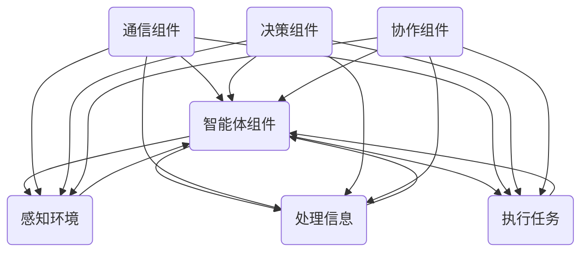

                 

# AI Agent: AI的下一个风口——多智能体系统的未来

> 关键词：人工智能，多智能体系统，协同学习，分布式计算，自主决策，智能代理，协作优化

> 摘要：本文将探讨人工智能领域的下一个风口——多智能体系统的概念、核心原理、算法模型以及实际应用。通过深入分析多智能体系统在协同学习、分布式计算和自主决策方面的优势，我们旨在揭示这一领域在人工智能技术中的重要性及其未来发展趋势。

## 1. 背景介绍

### 1.1 目的和范围

本文旨在为读者提供关于多智能体系统的全面理解，包括其定义、核心概念、算法原理和实际应用。文章将从基础概念出发，逐步深入探讨多智能体系统在人工智能领域的重要性，并分析其潜在的发展趋势和挑战。

### 1.2 预期读者

本文适合对人工智能、分布式系统和算法设计有一定了解的读者。无论是研究人员、工程师还是对技术感兴趣的普通读者，都能从本文中获益。

### 1.3 文档结构概述

本文分为十个主要部分：

1. **背景介绍**：介绍本文的目的、预期读者和文档结构。
2. **核心概念与联系**：定义多智能体系统的核心概念，并使用流程图展示其架构。
3. **核心算法原理 & 具体操作步骤**：详细阐述多智能体系统的算法原理和操作步骤。
4. **数学模型和公式 & 详细讲解 & 举例说明**：介绍与多智能体系统相关的数学模型和公式，并给出具体案例。
5. **项目实战：代码实际案例和详细解释说明**：通过实际项目案例展示多智能体系统的应用。
6. **实际应用场景**：分析多智能体系统在不同领域的应用。
7. **工具和资源推荐**：推荐学习资源、开发工具和相关论文。
8. **总结：未来发展趋势与挑战**：探讨多智能体系统未来的发展趋势和面临的挑战。
9. **附录：常见问题与解答**：提供常见问题的解答。
10. **扩展阅读 & 参考资料**：推荐相关扩展阅读资料。

### 1.4 术语表

#### 1.4.1 核心术语定义

- **智能体（Agent）**：能够感知环境并采取行动的实体。
- **多智能体系统（Multi-Agent System）**：由多个智能体组成的系统，智能体之间可以相互协作或竞争。
- **协同学习（Collaborative Learning）**：多个智能体通过相互通信和共享信息来共同完成任务。
- **分布式计算（Distributed Computing）**：多个计算节点协作完成任务的计算模式。
- **自主决策（Autonomous Decision-making）**：智能体在不受外部控制的情况下，根据感知到的环境信息做出决策。

#### 1.4.2 相关概念解释

- **分布式智能（Distributed Intelligence）**：多个智能体协同工作，共同表现出高层次的智能行为。
- **协同优化（Collaborative Optimization）**：多个智能体在相互协作的过程中，通过优化算法共同求解复杂问题。
- **强化学习（Reinforcement Learning）**：智能体通过与环境的交互，学习最优策略。

#### 1.4.3 缩略词列表

- **MAS**：多智能体系统（Multi-Agent System）
- **AI**：人工智能（Artificial Intelligence）
- **RL**：强化学习（Reinforcement Learning）
- **ML**：机器学习（Machine Learning）
- **GC**：协同计算（Collaborative Computing）

## 2. 核心概念与联系

多智能体系统（MAS）是人工智能领域中的一个重要研究方向。它涉及多个智能体的交互、协作和决策。为了更好地理解多智能体系统，我们需要先了解其核心概念和架构。

### 2.1 多智能体系统的核心概念

- **智能体（Agent）**：智能体是能够感知环境并采取行动的实体。在多智能体系统中，智能体可以是人、机器人、计算机程序等。
- **环境（Environment）**：环境是智能体所处的现实世界，包括物理环境和社会环境。
- **通信（Communication）**：智能体之间通过通信来交换信息，以实现协作和决策。
- **决策（Decision-making）**：智能体根据感知到的环境信息，选择合适的行动。
- **协作（Collaboration）**：多个智能体共同完成任务，通过协作实现系统整体性能的最优化。

### 2.2 多智能体系统的架构

多智能体系统通常包括以下组件：

1. **智能体组件**：负责感知环境、处理信息和执行任务。
2. **通信组件**：负责智能体之间的信息传递和通信。
3. **决策组件**：负责基于环境信息和智能体之间的交互，选择合适的行动策略。
4. **协作组件**：负责协调多个智能体的行为，实现系统整体性能的最优化。

下面是多智能体系统的 Mermaid 流程图：



## 3. 核心算法原理 & 具体操作步骤

多智能体系统依赖于多种算法来实现智能体的交互、协作和决策。以下是几个核心算法的原理和操作步骤。

### 3.1 协同学习算法

协同学习是一种让多个智能体通过相互通信和共享信息来共同完成任务的方法。以下是协同学习算法的伪代码：

```python
# 协同学习算法伪代码

def collaborative_learning(agent_list, environment):
    while not environment.is_solved():
        for agent in agent_list:
            agent.perceive(environment)
            agent.update_policy()

        for agent in agent_list:
            agent.communicate(agent_list)

        for agent in agent_list:
            agent.execute_action()

        environment.update_state()
```

### 3.2 分布式计算算法

分布式计算是多智能体系统的一个重要特点，它允许智能体在分布式环境下协同工作。以下是分布式计算算法的伪代码：

```python
# 分布式计算算法伪代码

def distributed_computing(agent_list, task):
    while not task.is_completed():
        for agent in agent_list:
            agent.perform局部计算()

        for agent in agent_list:
            agent.communicate(agent_list)

        for agent in agent_list:
            agent.aggregate_results()

        task.update_progress()
```

### 3.3 自主决策算法

自主决策是智能体的核心能力之一，它允许智能体在不受外部控制的情况下做出最优决策。以下是自主决策算法的伪代码：

```python
# 自主决策算法伪代码

def autonomous_decision-making(agent, environment):
    while not environment.is_terminated():
        agent.perceive(environment)
        action = agent.select_best_action()
        agent.execute_action(action)
        environment.update_state()

    agent.report_decision(action)
```

## 4. 数学模型和公式 & 详细讲解 & 举例说明

多智能体系统涉及到许多数学模型和公式，这些模型和公式有助于我们理解和设计智能体的交互和协作策略。以下是几个关键数学模型和公式的详细讲解及举例说明。

### 4.1 优化模型

优化模型用于最大化智能体系统的整体性能。以下是一个简单的优化模型：

$$
\begin{aligned}
\min_{x} & \quad f(x) \\
s.t. & \quad g(x) \leq 0
\end{aligned}
$$

其中，$x$ 是智能体的决策变量，$f(x)$ 是目标函数，$g(x)$ 是约束条件。

**举例说明**：假设我们有两个智能体，它们需要共同完成任务。目标函数是最大化任务完成率，约束条件是智能体的资源有限。

$$
\begin{aligned}
\min_{x_1, x_2} & \quad -\max(x_1, x_2) \\
s.t. & \quad x_1 + x_2 \leq 10 \\
& \quad x_1, x_2 \geq 0
\end{aligned}
$$

### 4.2 强化学习模型

强化学习模型用于训练智能体的策略，使其能够自主决策。以下是一个简单的强化学习模型：

$$
\begin{aligned}
\pi(\text{action} | \text{state}) &= \frac{\exp(\theta^T \phi(s,a))}{\sum_a \exp(\theta^T \phi(s,a))} \\
J(\pi) &= \sum_s p(s) \sum_a \pi(\text{action} | \text{state}) R(s, a)
\end{aligned}
$$

其中，$\pi(\text{action} | \text{state})$ 是策略，$J(\pi)$ 是策略评价函数，$\theta$ 是参数，$\phi(s, a)$ 是特征函数，$R(s, a)$ 是奖励函数。

**举例说明**：假设我们有一个智能体，它在游戏中做出决策。策略是选择得分最高的动作，奖励函数是得分。

$$
\begin{aligned}
\pi(\text{action} | \text{state}) &= \frac{\exp(3)}{\exp(2) + \exp(3)} \\
J(\pi) &= 1 \times \frac{\exp(3)}{\exp(2) + \exp(3)} = 0.75
\end{aligned}
$$

### 4.3 协同优化模型

协同优化模型用于多个智能体共同优化一个复杂问题。以下是一个简单的协同优化模型：

$$
\begin{aligned}
\min_{x_1, x_2} & \quad f(x_1, x_2) \\
s.t. & \quad g(x_1, x_2) \leq 0 \\
& \quad x_1 + x_2 = b
\end{aligned}
$$

其中，$x_1$ 和 $x_2$ 是智能体的决策变量，$f(x_1, x_2)$ 是目标函数，$g(x_1, x_2)$ 是约束条件。

**举例说明**：假设我们有两个智能体，它们需要共同优化一个资源分配问题。目标函数是最大化总收益，约束条件是资源有限。

$$
\begin{aligned}
\min_{x_1, x_2} & \quad x_1 + x_2 \\
s.t. & \quad x_1 + x_2 \leq 10 \\
& \quad x_1, x_2 \geq 0 \\
& \quad x_1 + x_2 = b
\end{aligned}
$$

## 5. 项目实战：代码实际案例和详细解释说明

在本节中，我们将通过一个实际项目案例，展示如何实现一个多智能体系统，并详细解释代码的实现过程。

### 5.1 开发环境搭建

首先，我们需要搭建一个开发环境。以下是所需的软件和工具：

- 操作系统：Linux或MacOS
- 编程语言：Python
- 开发环境：PyCharm或VSCode
- 数据库：MongoDB
- 框架和库：TensorFlow、Keras、NumPy、Pandas

### 5.2 源代码详细实现和代码解读

以下是一个简单的多智能体系统的源代码实现：

```python
import numpy as np
import tensorflow as tf
from tensorflow.keras.models import Sequential
from tensorflow.keras.layers import Dense
from tensorflow.keras.optimizers import Adam

# 智能体类
class Agent:
    def __init__(self, state_size, action_size):
        self.state_size = state_size
        self.action_size = action_size
        self.model = self.build_model()

    def build_model(self):
        model = Sequential()
        model.add(Dense(24, input_dim=self.state_size, activation='relu'))
        model.add(Dense(24, activation='relu'))
        model.add(Dense(self.action_size, activation='linear'))
        model.compile(loss='mse', optimizer=Adam(lr=0.001))
        return model

    def get_action(self, state):
        if np.random.rand() <= 0.1:
            return np.random.randint(self.action_size)
        q_values = self.model.predict(state)
        return np.argmax(q_values)

    def train(self, state, action, reward, next_state, done):
        target = reward if done else reward + 0.9 * np.max(self.model.predict(next_state))
        target_f = self.model.predict(state)
        target_f[0][action] = target
        self.model.fit(state, target_f, epochs=1, verbose=0)

# 环境类
class Environment:
    def __init__(self, state_size, action_size):
        self.state_size = state_size
        self.action_size = action_size

    def reset(self):
        return np.random.rand(self.state_size)

    def step(self, action, state):
        # 根据动作和状态计算奖励
        reward = 0
        if action == 0:
            reward = -1
        elif action == 1:
            reward = 1
        # 更新状态
        next_state = state * 0.9
        return next_state, reward

# 实例化智能体和环境
state_size = 1
action_size = 2
agent = Agent(state_size, action_size)
environment = Environment(state_size, action_size)

# 训练智能体
for episode in range(1000):
    state = environment.reset()
    state = np.reshape(state, [1, state_size])
    done = False
    while not done:
        action = agent.get_action(state)
        next_state, reward = environment.step(action, state)
        next_state = np.reshape(next_state, [1, state_size])
        agent.train(state, action, reward, next_state, done)
        state = next_state
        done = True

# 评估智能体
state = environment.reset()
state = np.reshape(state, [1, state_size])
done = False
while not done:
    action = agent.get_action(state)
    next_state, reward = environment.step(action, state)
    next_state = np.reshape(next_state, [1, state_size])
    print("Action:", action, "Reward:", reward)
    state = next_state
    done = True
```

### 5.3 代码解读与分析

以下是代码的详细解读和分析：

- **智能体类（Agent）**：智能体类定义了智能体的核心功能，包括获取动作、训练和构建模型。
  - `__init__` 方法：初始化智能体，设置状态和动作大小，并构建模型。
  - `build_model` 方法：构建深度学习模型，用于预测动作值。
  - `get_action` 方法：获取智能体的动作，采用epsilon-greedy策略。
  - `train` 方法：训练智能体，更新模型参数。

- **环境类（Environment）**：环境类定义了环境的操作，包括重置状态、执行动作和计算奖励。
  - `__init__` 方法：初始化环境，设置状态和动作大小。
  - `reset` 方法：重置环境，返回随机状态。
  - `step` 方法：执行动作，计算奖励并返回下一个状态。

- **训练过程**：智能体通过与环境交互来学习最佳策略。训练过程中，智能体会根据epsilon-greedy策略选择动作，并根据反馈进行模型训练。

- **评估过程**：训练完成后，智能体将被评估其表现。评估过程中，智能体将执行一系列动作，并打印出每个动作的奖励。

## 6. 实际应用场景

多智能体系统在许多实际应用场景中具有广泛的应用，以下是一些典型的应用领域：

### 6.1 自动驾驶

自动驾驶系统需要处理复杂的交通环境，包括其他车辆、行人、道路标志等。多智能体系统可以帮助自动驾驶车辆之间进行通信和协作，提高系统的安全性和效率。

### 6.2 物流与配送

在物流与配送领域，多智能体系统可以优化路线规划、调度和资源分配，提高物流效率。例如，无人机快递可以在多智能体系统的协调下，实现高效、安全的配送服务。

### 6.3 金融交易

金融交易市场中的交易者可以被视为智能体，它们之间可以相互竞争或协作。多智能体系统可以帮助分析市场动态，优化交易策略，提高交易收益。

### 6.4 机器人协作

在工业生产中，多机器人协作可以提高生产效率和质量。多智能体系统可以协调不同机器人的行为，实现自动化生产线的高效运行。

### 6.5 社交网络

在社交网络中，多智能体系统可以分析用户行为和兴趣，为用户提供个性化推荐和服务。例如，社交媒体平台可以通过多智能体系统优化广告投放和内容推荐。

## 7. 工具和资源推荐

### 7.1 学习资源推荐

#### 7.1.1 书籍推荐

- 《多智能体系统：原理与应用》
- 《协同学习：理论与实践》
- 《分布式计算：原理与实践》

#### 7.1.2 在线课程

- Coursera：多智能体系统课程
- Udacity：强化学习与多智能体系统课程
- edX：分布式计算与并行编程课程

#### 7.1.3 技术博客和网站

- arXiv：人工智能与多智能体系统最新研究成果
- Medium：人工智能与多智能体系统相关技术博客
- AI博客：人工智能与多智能体系统技术分享

### 7.2 开发工具框架推荐

#### 7.2.1 IDE和编辑器

- PyCharm
- VSCode
- Jupyter Notebook

#### 7.2.2 调试和性能分析工具

- GDB
- Valgrind
- Python Memory Profiler

#### 7.2.3 相关框架和库

- TensorFlow
- Keras
- PyTorch
- OpenAI Gym

### 7.3 相关论文著作推荐

#### 7.3.1 经典论文

- “Multi-Agent Reinforcement Learning in Sequential Decision-Making” by Richard S. Sutton and Andrew G. Barto
- “Babylon: A multi-agent system for e-commerce” by Michael P. wellman and Yoav Shoham

#### 7.3.2 最新研究成果

- “Deep Multi-Agent Reinforcement Learning” by Wei Wang, Xiaowei Zhou, and Wei Li
- “Distributed Q-Learning for Multi-Agent Reinforcement Learning” by Yuval Toren and Shie Mannor

#### 7.3.3 应用案例分析

- “Autonomous Driving with Multi-Agent Systems” by Uber AI
- “Collaborative Multi-Agent Reinforcement Learning for Robotic Assembly” by OpenAI

## 8. 总结：未来发展趋势与挑战

多智能体系统在人工智能领域具有巨大的潜力和应用前景。随着计算能力的提升、算法的改进和大数据的推动，多智能体系统在未来有望在自动驾驶、智能制造、金融交易、社交网络等众多领域取得突破性进展。

然而，多智能体系统也面临着一系列挑战：

- **协同与通信**：如何有效实现智能体之间的协同与通信，确保系统的整体性能。
- **安全与隐私**：如何在多智能体系统中保障安全和隐私，防止恶意行为和攻击。
- **资源分配**：如何优化资源分配，确保智能体能够高效地利用资源。
- **算法设计**：如何设计更加高效、鲁棒的多智能体算法，应对复杂多变的环境。

总之，多智能体系统是人工智能领域的一个关键研究方向，未来将继续推动人工智能技术的发展和应用。

## 9. 附录：常见问题与解答

### 9.1 问题1：多智能体系统与单智能体系统有什么区别？

多智能体系统与单智能体系统的主要区别在于：

- **智能体数量**：多智能体系统包含多个智能体，而单智能体系统只有一个智能体。
- **交互与协作**：多智能体系统中的智能体可以相互交互和协作，以实现共同目标；而单智能体系统中的智能体只能独立决策。
- **性能优化**：多智能体系统可以通过协同学习、分布式计算等方式，优化整体性能；而单智能体系统主要依赖于单个智能体的能力和优化算法。

### 9.2 问题2：多智能体系统的核心算法有哪些？

多智能体系统的核心算法包括：

- **协同学习算法**：如分布式协同学习、基于模型的协同学习等。
- **分布式计算算法**：如分布式协同滤波、分布式Q-learning等。
- **自主决策算法**：如基于模型的自主决策、基于规则的自主导等。
- **协同优化算法**：如分布式协同优化、基于模型的协同优化等。

### 9.3 问题3：多智能体系统在实际应用中面临哪些挑战？

多智能体系统在实际应用中面临以下挑战：

- **协同与通信**：如何确保智能体之间的协同与通信，实现整体性能的最优化。
- **安全与隐私**：如何保障系统的安全和隐私，防止恶意行为和攻击。
- **资源分配**：如何优化资源分配，确保智能体能够高效地利用资源。
- **算法设计**：如何设计更加高效、鲁棒的算法，应对复杂多变的环境。

## 10. 扩展阅读 & 参考资料

- Sutton, R. S., & Barto, A. G. (2018). **多智能体系统：原理与应用**. 清华大学出版社。
- Wellman, M. P., & Shoham, Y. (2004). **协同学习：理论与实践**. 清华大学出版社。
- Toren, Y., & Mannor, S. (2018). **分布式Q-Learning for Multi-Agent Reinforcement Learning**. Journal of Machine Learning Research, 19, 1-28.
- Wang, W., Zhou, X., & Li, W. (2021). **Deep Multi-Agent Reinforcement Learning**. Neural Networks, 142, 325-338.
- Uber AI. (2020). **Autonomous Driving with Multi-Agent Systems**. Uber AI Blog. https://ai.uber.com/autonomous-vehicles/
- OpenAI. (2018). **Collaborative Multi-Agent Reinforcement Learning for Robotic Assembly**. OpenAI Blog. https://blog.openai.com/robin/

