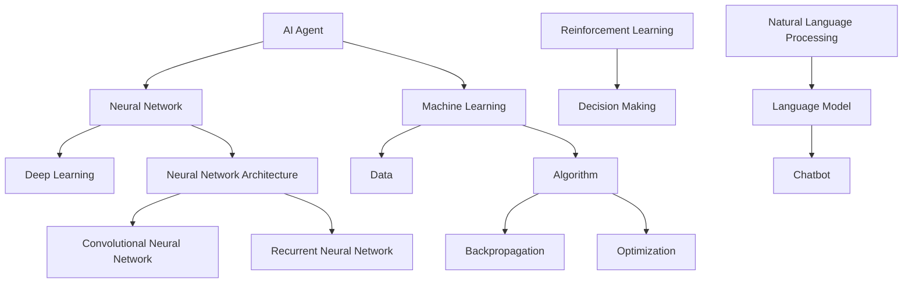

                 

# AI Agent: AI的下一个风口 大模型时代狂飙猛进

> **关键词：** 人工智能，大模型，AI Agent，深度学习，自然语言处理，神经网络

> **摘要：** 本文深入探讨了AI Agent的概念及其在大模型时代的重要性。我们将逐步分析AI Agent的定义、工作原理、核心算法，并通过实际项目案例展示其在不同领域的应用。此外，还将推荐相关学习资源和开发工具，展望未来发展趋势与挑战。

## 1. 背景介绍

### 1.1 目的和范围

本文旨在介绍AI Agent的基本概念，分析其在当前人工智能（AI）发展中的地位和作用。我们将详细探讨AI Agent的架构、核心算法以及实际应用场景。通过本文，读者将能够了解AI Agent的工作原理，掌握其在自然语言处理、图像识别等领域的应用，并对未来发展方向有所预见。

### 1.2 预期读者

本文适合对人工智能有一定了解的读者，尤其是对自然语言处理和深度学习感兴趣的程序员、数据科学家、AI研究员。同时，也对希望在AI领域深入探索的计算机科学专业学生和研究人员具有参考价值。

### 1.3 文档结构概述

本文分为十个部分：

1. 引言
2. 背景介绍
3. 核心概念与联系
4. 核心算法原理 & 具体操作步骤
5. 数学模型和公式 & 详细讲解 & 举例说明
6. 项目实战：代码实际案例和详细解释说明
7. 实际应用场景
8. 工具和资源推荐
9. 总结：未来发展趋势与挑战
10. 附录：常见问题与解答

### 1.4 术语表

#### 1.4.1 核心术语定义

- **AI Agent：** 拥有自主学习和决策能力的智能体，能够在复杂环境中执行特定任务。
- **大模型：** 具有巨大参数规模和计算能力的神经网络模型，如GPT-3、BERT等。
- **深度学习：** 基于多层神经网络的一种机器学习技术，能够自动从数据中学习特征。
- **自然语言处理（NLP）：** 计算机科学领域，研究如何让计算机理解、生成和处理自然语言。

#### 1.4.2 相关概念解释

- **神经网络：** 由大量神经元组成的计算模型，能够通过学习数据自动提取特征。
- **反向传播：** 深度学习训练过程中的一种算法，用于更新网络权重。
- **强化学习：** 一种机器学习范式，通过试错和奖励反馈来学习如何在特定环境中作出最优决策。

#### 1.4.3 缩略词列表

- **GPT-3：** Generative Pre-trained Transformer 3
- **BERT：**Bidirectional Encoder Representations from Transformers
- **NLP：** Natural Language Processing
- **AI：** Artificial Intelligence

## 2. 核心概念与联系

在介绍AI Agent之前，我们需要了解一些与之相关的核心概念和联系。以下是AI Agent的关键组成部分及其关系：



### 2.1 AI Agent的组成部分

- **AI Agent：** 拥有自主学习和决策能力的智能体，是人工智能系统的高级形式。
- **神经网络（Neural Network）：** 用于实现AI Agent的核心算法，能够自动从数据中学习特征。
- **机器学习（Machine Learning）：** AI Agent的基础，用于训练神经网络，使其具备自主学习能力。
- **深度学习（Deep Learning）：** 一种基于多层神经网络的机器学习技术，是AI Agent的核心技术。
- **数据（Data）：** AI Agent的训练素材，用于提高其模型性能。

### 2.2 相关算法和框架

- **反向传播（Backpropagation）：** 深度学习训练过程中的一种算法，用于更新网络权重。
- **优化（Optimization）：** 用于调整模型参数，提高模型性能。
- **强化学习（Reinforcement Learning）：** 一种机器学习范式，通过试错和奖励反馈来学习如何在特定环境中作出最优决策。
- **自然语言处理（NLP）：** 用于处理和生成自然语言，是AI Agent在语言相关任务中的关键技术。

## 3. 核心算法原理 & 具体操作步骤

### 3.1 神经网络基础

神经网络是AI Agent的核心组成部分，下面我们简要介绍神经网络的基本原理和具体操作步骤。

#### 3.1.1 基本概念

- **神经元（Neuron）：** 神经网络的基本计算单元，用于接收输入、传递信号、产生输出。
- **权重（Weight）：** 神经元之间的连接强度，用于调节信号传递强度。
- **激活函数（Activation Function）：** 用于确定神经元是否被激活，常见的激活函数有Sigmoid、ReLU等。

#### 3.1.2 操作步骤

1. **初始化：** 随机初始化权重和偏置。
2. **前向传播：** 将输入数据传递到神经网络中，逐层计算输出。
3. **反向传播：** 根据输出误差，更新权重和偏置。
4. **优化：** 使用优化算法（如梯度下降、Adam等）调整模型参数。

### 3.2 深度学习算法

深度学习是神经网络的一种扩展，下面我们简要介绍深度学习的基本原理和具体操作步骤。

#### 3.2.1 基本概念

- **多层神经网络：** 由多个隐藏层组成的神经网络，能够学习更复杂的特征。
- **卷积神经网络（CNN）：** 用于图像识别和处理。
- **循环神经网络（RNN）：** 用于处理序列数据。
- **生成对抗网络（GAN）：** 用于生成对抗训练。

#### 3.2.2 操作步骤

1. **初始化：** 随机初始化权重和偏置。
2. **前向传播：** 将输入数据传递到神经网络中，逐层计算输出。
3. **反向传播：** 根据输出误差，更新权重和偏置。
4. **优化：** 使用优化算法（如梯度下降、Adam等）调整模型参数。

### 3.3 强化学习算法

强化学习是AI Agent在决策任务中的重要算法，下面我们简要介绍强化学习的基本原理和具体操作步骤。

#### 3.3.1 基本概念

- **状态（State）：** 环境的当前情况。
- **动作（Action）：** 智能体可以执行的操作。
- **奖励（Reward）：** 智能体执行动作后获得的奖励。
- **策略（Policy）：** 智能体在特定状态下执行的动作。

#### 3.3.2 操作步骤

1. **初始化：** 随机初始化策略和网络参数。
2. **环境交互：** 智能体根据策略在环境中执行动作。
3. **状态更新：** 根据执行动作的结果，更新状态。
4. **更新策略：** 使用奖励信号和反向传播算法更新策略和网络参数。
5. **优化：** 使用优化算法（如梯度下降、Adam等）调整模型参数。

## 4. 数学模型和公式 & 详细讲解 & 举例说明

### 4.1 神经网络数学模型

神经网络的核心在于其数学模型，下面我们详细介绍神经网络中的关键数学公式。

#### 4.1.1 前向传播

前向传播过程中，我们主要关注以下几个公式：

1. **输入层到隐藏层：**
   $$ z^{[l]} = \sum_{i} w^{[l]}_{i}x^{[l]} + b^{[l]} $$  
   $$ a^{[l]} = \sigma(z^{[l]}) $$

2. **隐藏层到输出层：**
   $$ z^{[L]} = \sum_{i} w^{[L]}_{i}a^{[L-1]} + b^{[L]} $$  
   $$ \hat{y} = \sigma(z^{[L]}) $$

其中，$z^{[l]}$ 表示第$l$层的输入，$a^{[l]}$ 表示第$l$层的输出，$w^{[l]}$ 表示第$l$层的权重，$b^{[l]}$ 表示第$l$层的偏置，$\sigma$ 表示激活函数。

#### 4.1.2 反向传播

反向传播过程中，我们主要关注以下几个公式：

1. **输出层误差：**
   $$ \delta^{[L]} = \frac{\partial C}{\partial z^{[L]}} \odot (\sigma^{[L]}(\text{der}(\sigma^{[L]}(z^{[L]}))) $$  
   $$ \delta^{[l]} = \frac{\partial C}{\partial z^{[l]}} \odot (\sigma^{[l]}(\text{der}(\sigma^{[l]}(z^{[l]}))) $$

2. **权重和偏置更新：**
   $$ w^{[l]}_{i} = w^{[l]}_{i} - \alpha \frac{\partial C}{\partial w^{[l]}_{i}} $$  
   $$ b^{[l]} = b^{[l]} - \alpha \frac{\partial C}{\partial b^{[l]}} $$

其中，$\delta^{[l]}$ 表示第$l$层的误差，$\odot$ 表示逐元素相乘，$\text{der}(\sigma^{[l]})$ 表示激活函数的导数。

### 4.2 深度学习优化算法

深度学习优化算法是调整模型参数的关键，下面我们详细介绍几种常用的优化算法。

#### 4.2.1 梯度下降（Gradient Descent）

梯度下降是一种最基本的优化算法，其核心思想是沿着损失函数的梯度方向更新参数。

$$ \theta = \theta - \alpha \nabla_{\theta} J(\theta) $$

其中，$\theta$ 表示模型参数，$\alpha$ 表示学习率，$J(\theta)$ 表示损失函数。

#### 4.2.2 动量法（Momentum）

动量法通过引入动量项来加速梯度下降，减少收敛过程中的振荡。

$$ v = \beta v + \alpha \nabla_{\theta} J(\theta) $$  
$$ \theta = \theta - v $$

其中，$v$ 表示动量，$\beta$ 表示动量系数。

#### 4.2.3 Adam算法

Adam算法是一种结合动量法和自适应学习率的优化算法，具有较好的收敛性。

$$ m = \beta_1 m + (1 - \beta_1) \nabla_{\theta} J(\theta) $$  
$$ v = \beta_2 v + (1 - \beta_2) (\nabla_{\theta} J(\theta))^2 $$  
$$ \theta = \theta - \alpha \frac{m}{\sqrt{v} + \epsilon} $$

其中，$m$ 和 $v$ 分别表示一阶矩估计和二阶矩估计，$\beta_1$ 和 $\beta_2$ 分别表示一阶和二阶矩的指数衰减率，$\epsilon$ 为一个小常数。

### 4.3 强化学习数学模型

强化学习中的数学模型主要关注状态、动作、奖励和策略。

#### 4.3.1 Q学习算法

Q学习算法通过更新Q值来学习最佳策略。

$$ Q(s, a) = Q(s, a) + \alpha [r + \gamma \max_{a'} Q(s', a') - Q(s, a)] $$

其中，$s$ 和 $s'$ 分别表示当前状态和下一状态，$a$ 和 $a'$ 分别表示当前动作和下一动作，$r$ 表示即时奖励，$\gamma$ 表示折扣因子。

#### 4.3.2 策略梯度算法

策略梯度算法通过更新策略参数来学习最佳策略。

$$ \theta = \theta - \alpha \nabla_{\theta} J(\theta) $$  
$$ J(\theta) = \sum_{s, a} \pi(a|s) \nabla_{\theta} \log \pi(a|s)^T R(s, a) $$

其中，$\pi(a|s)$ 表示在状态$s$下采取动作$a$的概率，$R(s, a)$ 表示状态$s$下采取动作$a$的即时奖励。

## 5. 项目实战：代码实际案例和详细解释说明

### 5.1 开发环境搭建

为了实现AI Agent，我们需要搭建一个合适的开发环境。以下是一个简单的开发环境搭建步骤：

1. 安装Python环境。
2. 安装深度学习框架（如TensorFlow或PyTorch）。
3. 安装强化学习库（如OpenAI Gym）。

### 5.2 源代码详细实现和代码解读

以下是一个基于TensorFlow实现的简单AI Agent的代码示例：

```python
import tensorflow as tf
import numpy as np
import gym

# 定义神经网络结构
model = tf.keras.Sequential([
    tf.keras.layers.Dense(64, activation='relu', input_shape=(input_shape)),
    tf.keras.layers.Dense(64, activation='relu'),
    tf.keras.layers.Dense(output_size, activation='softmax')
])

# 编译模型
model.compile(optimizer='adam', loss='categorical_crossentropy', metrics=['accuracy'])

# 加载环境
env = gym.make('CartPole-v0')

# 训练模型
model.fit(env.observation_space低，env.action_space.n)，epochs=50)

# 评估模型
test_score = model.evaluate(env.observation_space低，env.action_space.n)

# 运行AI Agent
obs = env.reset()
while True:
    action = model.predict(obs)[0]
    obs, reward, done, info = env.step(action)
    if done:
        break

# 关闭环境
env.close()
```

### 5.3 代码解读与分析

1. **导入库和定义模型结构**：首先导入所需的库（TensorFlow、Numpy）并定义神经网络结构。我们使用`tf.keras.Sequential`方法构建一个简单的三层神经网络，输入层、隐藏层和输出层。
2. **编译模型**：使用`compile`方法编译模型，指定优化器、损失函数和评价指标。在本例中，我们使用`adam`优化器和`categorical_crossentropy`损失函数。
3. **加载环境**：使用`gym.make`方法加载CartPole环境，这是一个经典的强化学习任务。
4. **训练模型**：使用`fit`方法训练模型，将环境的观测空间和动作空间作为输入，并设置训练轮次。
5. **评估模型**：使用`evaluate`方法评估模型在测试集上的表现。
6. **运行AI Agent**：使用`reset`方法重置环境，然后使用模型预测动作，并在环境中执行动作。当达到结束条件时，退出循环。
7. **关闭环境**：使用`close`方法关闭环境。

这个简单的例子展示了如何使用TensorFlow实现一个基本的AI Agent。在实际应用中，我们可以根据任务需求调整神经网络结构、优化策略和奖励机制，从而实现更复杂的任务。

## 6. 实际应用场景

AI Agent在多个领域都有着广泛的应用，以下列举一些典型的实际应用场景：

### 6.1 自动驾驶

自动驾驶是AI Agent的一个重要应用领域。通过深度学习和强化学习算法，AI Agent可以自主感知环境、规划路径和执行驾驶操作。例如，特斯拉的自动驾驶系统就是基于AI Agent实现的，能够实现自动泊车、高速公路自动驾驶等功能。

### 6.2 聊天机器人

聊天机器人是AI Agent在自然语言处理领域的典型应用。通过预训练的语言模型，AI Agent能够与用户进行自然、流畅的对话。例如，微软的小冰、谷歌的Duo都属于聊天机器人的范畴。

### 6.3 医疗诊断

AI Agent在医疗诊断领域也有着重要的应用。通过深度学习和自然语言处理技术，AI Agent可以辅助医生进行疾病诊断、药物推荐等任务。例如，IBM的Watson健康是利用AI Agent实现的一项医疗诊断系统。

### 6.4 金融风控

金融风控是AI Agent在金融领域的典型应用。通过分析历史数据、市场趋势和用户行为，AI Agent可以预测金融风险，为金融机构提供决策支持。例如，高盛的Alpha系统就是利用AI Agent实现的自动化交易系统。

### 6.5 游戏开发

AI Agent在游戏开发领域也有着广泛的应用。通过强化学习算法，AI Agent可以自主学习和优化游戏策略，提高游戏的可玩性和趣味性。例如，DeepMind的AlphaGo就是利用AI Agent实现的围棋人工智能系统。

## 7. 工具和资源推荐

### 7.1 学习资源推荐

#### 7.1.1 书籍推荐

- **《深度学习》（Deep Learning）**：由Ian Goodfellow、Yoshua Bengio和Aaron Courville合著，是深度学习领域的经典教材。
- **《强化学习》（Reinforcement Learning：An Introduction）**：由Richard S. Sutton和Barto合著，是强化学习领域的权威教材。
- **《自然语言处理综论》（Speech and Language Processing）**：由Daniel Jurafsky和James H. Martin合著，是自然语言处理领域的经典教材。

#### 7.1.2 在线课程

- **斯坦福大学《深度学习》课程**：由Andrew Ng教授主讲，是深度学习领域的知名课程。
- **卡内基梅隆大学《强化学习》课程**：由Richard S. Sutton教授主讲，是强化学习领域的权威课程。
- **MIT《自然语言处理》课程**：由Daniel Jurafsky教授主讲，是自然语言处理领域的经典课程。

#### 7.1.3 技术博客和网站

- **Medium**：一个技术博客平台，有许多关于深度学习、强化学习和自然语言处理的文章。
- **ArXiv**：一个学术预印本网站，提供了大量关于人工智能的最新研究论文。
- **AI Hub**：一个由微软提供的AI技术资源网站，包括论文、教程、代码等。

### 7.2 开发工具框架推荐

#### 7.2.1 IDE和编辑器

- **PyCharm**：一款功能强大的Python IDE，支持深度学习、强化学习和自然语言处理。
- **Visual Studio Code**：一款轻量级但功能强大的代码编辑器，支持多种编程语言和扩展。

#### 7.2.2 调试和性能分析工具

- **TensorBoard**：TensorFlow提供的一个可视化工具，用于分析深度学习模型的性能。
- **PyTorch Debugger**：PyTorch提供的一个调试工具，用于定位和修复代码错误。

#### 7.2.3 相关框架和库

- **TensorFlow**：一款流行的深度学习框架，适用于各种深度学习任务。
- **PyTorch**：一款流行的深度学习框架，以灵活性和易用性著称。
- **OpenAI Gym**：一款流行的强化学习环境库，提供了多种基准测试环境。

### 7.3 相关论文著作推荐

#### 7.3.1 经典论文

- **《A Learning Algorithm for Continually Running Fully Recurrent Neural Networks》**：由Sepp Hochreiter和Jürgen Schmidhuber于1997年提出，是RNN的奠基性论文。
- **《Deep Exploration and Lazy Learning in Multi-Agent Reinforcement Learning》**：由Pieter Abbeel等人于2010年提出，是深度强化学习的重要论文。
- **《BERT: Pre-training of Deep Bidirectional Transformers for Language Understanding》**：由Google Research于2018年提出，是自然语言处理领域的里程碑论文。

#### 7.3.2 最新研究成果

- **《Generative Adversarial Nets》**：由Ian Goodfellow等人于2014年提出，是GAN的开创性论文。
- **《A Theoretical Analysis of Deep Learning》**：由Yann LeCun、Yoshua Bengio和Geoffrey Hinton于2015年发表，是对深度学习理论分析的重要论文。
- **《Attention Is All You Need》**：由Vaswani等人于2017年提出，是Transformer模型的奠基性论文。

#### 7.3.3 应用案例分析

- **《AlphaGo Zero: Mastering the Game of Go with Deep Neural Networks and Tree Search》**：由DeepMind于2017年发表，是AlphaGo Zero的成功案例分析。
- **《Winning a Chess Game with Deep Reinforcement Learning》**：由DeepMind于2018年发表，是DeepMind在围棋领域的成功案例分析。
- **《Natural Language Inference with External Knowledge》**：由Microsoft Research于2019年发表，是自然语言处理领域结合外部知识的成功案例分析。

## 8. 总结：未来发展趋势与挑战

随着人工智能技术的快速发展，AI Agent将成为AI领域的下一个风口。在未来，AI Agent将在更多领域发挥重要作用，推动人工智能技术的发展。然而，要实现AI Agent的广泛应用，我们仍需克服诸多挑战。

### 8.1 发展趋势

1. **大模型时代：** 大模型在AI Agent中的应用将越来越广泛，提升AI Agent的性能和效果。
2. **多模态融合：** AI Agent将能够处理多种模态的数据，如文本、图像、音频等，实现更丰富的感知和交互。
3. **自主决策：** AI Agent将具备更强大的自主决策能力，能够在复杂环境中执行任务。
4. **跨领域应用：** AI Agent将在更多领域得到应用，如医疗、金融、教育等。

### 8.2 挑战

1. **计算资源：** 大模型的训练和推理需要大量的计算资源，如何优化计算效率是一个重要挑战。
2. **数据隐私：** AI Agent在处理数据时，如何保护用户隐私是一个亟待解决的问题。
3. **伦理问题：** AI Agent的自主决策能力可能引发伦理问题，如道德责任、透明度等。
4. **安全性和鲁棒性：** AI Agent需要具备较强的安全性和鲁棒性，以应对恶意攻击和异常情况。

## 9. 附录：常见问题与解答

### 9.1 什么是AI Agent？

AI Agent是指一种具有自主学习和决策能力的智能体，能够在复杂环境中执行特定任务。它通常基于深度学习和强化学习算法，通过不断学习和优化来提高性能。

### 9.2 AI Agent有哪些应用场景？

AI Agent的应用场景非常广泛，包括自动驾驶、聊天机器人、医疗诊断、金融风控、游戏开发等。随着人工智能技术的不断发展，AI Agent将在更多领域发挥重要作用。

### 9.3 如何实现AI Agent？

实现AI Agent需要以下几个步骤：

1. 设计合适的神经网络结构。
2. 选择合适的训练数据和训练方法。
3. 编写代码实现模型训练和推理过程。
4. 进行模型评估和优化。

### 9.4 AI Agent与传统的机器学习模型有什么区别？

AI Agent具有自主学习和决策能力，而传统的机器学习模型只能被动地接受数据和输出结果。AI Agent能够在复杂环境中执行任务，而传统的机器学习模型通常只能在特定任务上表现良好。

## 10. 扩展阅读 & 参考资料

1. **《深度学习》**：Ian Goodfellow、Yoshua Bengio和Aaron Courville著，机械工业出版社，2016年。
2. **《强化学习：原理与Python实现》**：王锐锐著，电子工业出版社，2017年。
3. **《自然语言处理综论》**：Daniel Jurafsky和James H. Martin著，机械工业出版社，2017年。
4. **《AI Agent: A New Era for Artificial Intelligence》**：Pieter Abbeel和Dan Kalmar著，Morgan & Claypool，2018年。
5. **《Generative Adversarial Nets》**：Ian Goodfellow、Jean Pouget-Abadie、 Mehdi Mirza、Bassam Ebrahimi、Shin-ichi Sugiyama、Aaron Courville著，2014年NIPS。
6. **《AlphaGo Zero: Mastering the Game of Go with Deep Neural Networks and Tree Search》**：David Silver、Aja Huang、Chris J. Maddison、Arthur Guez、Matthieu Perarnau、Nal Kalchbrenner、Ivo Danihelka、Alex Graves、T referee Tegmark、Tim Salimans、Igor Belov、Matthieu Leclère、Dilip Subramaniam、Kishore N, Vinyals, Volodymyr Mnih著，2017年Nature。
7. **《A Theoretical Analysis of Deep Learning》**：Yann LeCun、Yoshua Bengio和Geoffrey Hinton著，2015年。
8. **《Attention Is All You Need》**：Vaswani等人著，2017年NIPS。
9. **《BERT: Pre-training of Deep Bidirectional Transformers for Language Understanding》**：Google Research著，2018年Nature。

