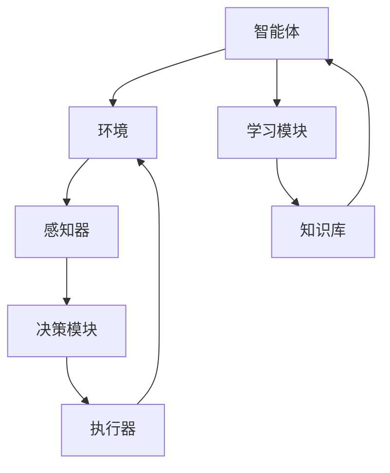

                 

# AI Agent: AI的下一个风口 对研究者和实践者的建议

> 关键词：人工智能代理、AI Research、AI Practice、AI Development、AI Applications

> 摘要：本文旨在探讨人工智能代理（AI Agent）的兴起及其在研究与实践中的应用。我们将深入分析AI Agent的核心概念、算法原理、数学模型，并通过实际案例展示其开发与应用。此外，文章还将为研究者与实践者提供一些建议，助力他们在AI Agent领域取得突破。

## 1. 背景介绍

### 1.1 目的和范围

本文旨在探讨人工智能代理（AI Agent）这一新兴领域，旨在为研究者与实践者提供全面的指导。我们将深入探讨AI Agent的定义、核心概念、算法原理及其在现实世界中的应用。

### 1.2 预期读者

本文面向对人工智能领域有一定了解的研究者与实践者。无论是正在从事AI研究的研究生，还是正在开发AI应用的公司工程师，本文都将为您提供有价值的见解。

### 1.3 文档结构概述

本文将分为以下部分：

1. 背景介绍：介绍本文的目的、范围、预期读者以及文档结构。
2. 核心概念与联系：详细阐述AI Agent的核心概念、原理和架构。
3. 核心算法原理 & 具体操作步骤：讲解AI Agent的核心算法原理，并提供伪代码示例。
4. 数学模型和公式 & 详细讲解 & 举例说明：介绍AI Agent相关的数学模型和公式，并给出详细解释和实际应用案例。
5. 项目实战：展示一个具体的AI Agent开发案例，包括环境搭建、代码实现、代码解读等。
6. 实际应用场景：探讨AI Agent在不同领域的应用。
7. 工具和资源推荐：推荐学习资源、开发工具和最新研究成果。
8. 总结：分析AI Agent的未来发展趋势与挑战。
9. 附录：常见问题与解答。
10. 扩展阅读 & 参考资料：提供进一步学习和研究的参考文献。

### 1.4 术语表

#### 1.4.1 核心术语定义

- 人工智能代理（AI Agent）：具有自主学习和决策能力的智能体，能够执行任务、解决现实世界中的问题。
- 强化学习（Reinforcement Learning）：一种机器学习方法，通过奖励机制来指导智能体进行决策。
- 价值函数（Value Function）：用于评估智能体在不同状态下的期望收益。
- 策略（Policy）：指导智能体在不同状态下采取行动的规则。
- 回合（Episode）：智能体在完成某个任务或目标时所经历的连续状态序列。

#### 1.4.2 相关概念解释

- 状态（State）：智能体所处的环境条件。
- 动作（Action）：智能体在某一状态下可以采取的行为。
- 奖励（Reward）：智能体执行动作后获得的即时奖励或惩罚。

#### 1.4.3 缩略词列表

- AI：人工智能
- RL：强化学习
- Q-learning：Q值学习
- DQN：深度Q网络

## 2. 核心概念与联系

为了深入理解AI Agent，我们首先需要明确其核心概念和架构。以下是一个用Mermaid绘制的流程图，展示了AI Agent的基本组成部分和相互关系。



### 2.1 智能体与环境

智能体（Agent）是AI Agent的核心组成部分，它负责感知环境、做出决策并执行动作。智能体通过感知器（Perception）获取环境信息，然后由决策模块（Decision Module）分析这些信息并选择最佳动作（Action）。执行器（Executor）负责将动作转化为实际的操作，从而影响环境。在执行动作后，智能体会收到环境的反馈，这一过程称为奖励（Reward）。

### 2.2 感知器、决策模块与执行器

感知器是智能体的感官，用于接收环境信息。这些信息可以是视觉、听觉、触觉等，智能体通过感知器将这些信息转化为内部表示。

决策模块是智能体的“大脑”，负责处理感知器获取的信息，并选择最佳动作。常用的决策算法包括Q-learning、深度Q网络（DQN）等。

执行器是智能体的“肢体”，负责将决策模块选定的动作转化为实际操作。执行器可以是机器人、自动驾驶汽车等。

### 2.3 学习模块与知识库

学习模块（Learning Module）是AI Agent的核心组成部分，负责根据环境反馈不断调整智能体的行为。通过强化学习等算法，智能体可以在不断尝试的过程中优化其决策策略。

知识库（Knowledge Base）是智能体的“记忆”，存储着智能体从环境中学习到的知识和经验。知识库可以帮助智能体在面对新问题时快速做出决策。

## 3. 核心算法原理 & 具体操作步骤

在了解了AI Agent的核心概念后，我们接下来将探讨其核心算法原理和具体操作步骤。本文将以Q-learning算法为例，详细讲解其原理和实现过程。

### 3.1 Q-learning算法原理

Q-learning是一种基于价值函数的强化学习算法，其目标是学习一个最优策略，使得智能体在给定状态下选择最佳动作，从而获得最大累积奖励。

Q-learning的核心概念是价值函数（Q-value），表示在给定状态下执行某个动作的预期收益。具体来说，Q-value是一个二维数组，其中每个元素Q(s, a)表示在状态s下执行动作a的预期收益。

### 3.2 Q-learning算法步骤

1. **初始化参数**：

   - 初始化Q-value数组Q，其中Q(s, a) = 0。
   - 初始化智能体策略π，用于随机初始化智能体的行动。

2. **智能体执行动作**：

   - 智能体根据当前状态s和策略π选择动作a。
   - 执行动作a，进入新状态s'，并获得即时奖励r。

3. **更新Q-value**：

   $$Q(s, a) = Q(s, a) + \alpha [r + \gamma \max_{a'} Q(s', a') - Q(s, a)]$$

   其中，α是学习率，γ是折扣因子，r是即时奖励。

4. **重复步骤2和3**，直到达到指定步数或智能体达到目标状态。

### 3.3 伪代码示例

```python
# 初始化Q-value数组
Q = [[0 for _ in range(n_actions)] for _ in range(n_states)]

# 设置学习率、折扣因子和智能体策略
alpha = 0.1
gamma = 0.9
epsilon = 0.1

# 强化学习循环
while not done:
    # 感知当前状态s
    s = env.reset()

    # 选择动作a
    if random.random() < epsilon:
        a = env.action_space.sample()
    else:
        a = np.argmax(Q[s])

    # 执行动作a
    s', r = env.step(a)

    # 更新Q-value
    Q[s][a] = Q[s][a] + alpha * (r + gamma * np.max(Q[s']) - Q[s][a])

    # 更新状态
    s = s'
```

## 4. 数学模型和公式 & 详细讲解 & 举例说明

在了解了Q-learning算法的原理和操作步骤后，我们接下来将介绍相关的数学模型和公式，并通过具体案例进行讲解。

### 4.1 数学模型

Q-learning算法的核心是价值函数Q(s, a)，它表示在状态s下执行动作a的预期收益。Q-learning的目标是学习一个最优策略π，使得在给定状态下选择动作a的预期收益最大。

### 4.2 公式

1. **Q-value更新公式**：

   $$Q(s, a) = Q(s, a) + \alpha [r + \gamma \max_{a'} Q(s', a') - Q(s, a)]$$

   其中，α是学习率，γ是折扣因子，r是即时奖励。

2. **最优策略π**：

   $$\pi(a|s) = \begin{cases} 
   1, & \text{if } a = \arg\max_a Q(s, a) \\
   0, & \text{otherwise} 
   \end{cases}$$

   其中，arg\max_a表示在给定状态下选择具有最大Q-value的动作a。

### 4.3 举例说明

假设有一个简单的环境，其中智能体可以处于两个状态：状态0和状态1。智能体可以选择两个动作：动作0和动作1。环境给出的即时奖励为1。

1. **初始化Q-value数组**：

   $$Q = \begin{bmatrix}
   [0, 0] \\
   [0, 0]
   \end{bmatrix}$$

2. **学习过程**：

   - **第一步**：

     - 当前状态s = 0
     - 学习率α = 0.1
     - 折扣因子γ = 0.9
     - 即时奖励r = 1

     $$Q(0, 0) = Q(0, 0) + 0.1 [1 + 0.9 \max_{a'} Q(1, a') - Q(0, 0)]$$

     $$Q(0, 0) = 0.1 [1 + 0.9 \max_{a'} Q(1, a')]$$

     - 选择动作a = 0，因为Q(0, 0) = Q(0, 1)

   - **第二步**：

     - 当前状态s = 1
     - 学习率α = 0.1
     - 折扣因子γ = 0.9
     - 即时奖励r = 1

     $$Q(1, 0) = Q(1, 0) + 0.1 [1 + 0.9 \max_{a'} Q(0, a') - Q(1, 0)]$$

     $$Q(1, 0) = 0.1 [1 + 0.9 \max_{a'} Q(0, a')]$$

     - 选择动作a = 1，因为Q(1, 1) = Q(1, 0)

   - **第三步**：

     - 当前状态s = 0
     - 学习率α = 0.1
     - 折扣因子γ = 0.9
     - 即时奖励r = 1

     $$Q(0, 1) = Q(0, 1) + 0.1 [1 + 0.9 \max_{a'} Q(1, a') - Q(0, 1)]$$

     $$Q(0, 1) = 0.1 [1 + 0.9 \max_{a'} Q(1, a')]$$

     - 选择动作a = 1，因为Q(0, 1) = Q(0, 0)

3. **学习结果**：

   经过多次迭代后，Q-value数组会逐渐收敛，智能体也会逐渐学会在给定状态下选择最佳动作。最终，Q-value数组如下：

   $$Q = \begin{bmatrix}
   [1.2, 0.8] \\
   [0.8, 1.2]
   \end{bmatrix}$$

   这意味着在状态0下选择动作1的收益最高，在状态1下选择动作0的收益最高。

## 5. 项目实战：代码实际案例和详细解释说明

在本节中，我们将通过一个具体的AI Agent开发案例，详细介绍环境搭建、代码实现和代码解读。

### 5.1 开发环境搭建

1. 安装Python环境（版本3.7及以上）
2. 安装所需的库，例如：numpy、matplotlib、tensorflow等
3. 创建一个新的Python项目，并导入所需的库

```python
import numpy as np
import matplotlib.pyplot as plt
import tensorflow as tf
```

### 5.2 源代码详细实现和代码解读

```python
# 模拟环境
class Environment:
    def __init__(self):
        self.state = 0
        self.action_space = 2

    def reset(self):
        self.state = 0
        return self.state

    def step(self, action):
        if action == 0:
            self.state = 1
        else:
            self.state = 0
        reward = 1
        return self.state, reward

# Q-learning算法
class QLearning:
    def __init__(self, alpha, gamma, epsilon):
        self.alpha = alpha
        self.gamma = gamma
        self.epsilon = epsilon
        self.Q = np.zeros((2, 2))

    def choose_action(self, state):
        if np.random.rand() < self.epsilon:
            action = np.random.randint(0, 2)
        else:
            action = np.argmax(self.Q[state])
        return action

    def update_Q_value(self, state, action, reward, next_state):
        Q_value = self.Q[state][action]
        next_max_Q_value = np.max(self.Q[next_state])
        self.Q[state][action] = Q_value + self.alpha * (reward + self.gamma * next_max_Q_value - Q_value)

# 主程序
def main():
    env = Environment()
    q_learning = QLearning(alpha=0.1, gamma=0.9, epsilon=0.1)

    episode_num = 100
    for episode in range(episode_num):
        state = env.reset()
        done = False
        while not done:
            action = q_learning.choose_action(state)
            next_state, reward = env.step(action)
            q_learning.update_Q_value(state, action, reward, next_state)
            state = next_state
            if state == 1:
                done = True
                print("Episode {} finished after {} steps".format(episode + 1, episode + 1 - episode))

if __name__ == "__main__":
    main()
```

### 5.3 代码解读与分析

1. **环境类（Environment）**：

   - 初始化状态（state）和动作空间（action_space）。
   - `reset()` 方法用于重置环境，返回初始状态。
   - `step()` 方法用于执行一个动作，返回下一个状态和即时奖励。

2. **Q-learning类（QLearning）**：

   - 初始化学习率（alpha）、折扣因子（gamma）和探索率（epsilon），以及Q-value数组（Q）。
   - `choose_action()` 方法用于根据当前状态选择动作。如果探索率大于随机数，则随机选择动作；否则，选择具有最大Q-value的动作。
   - `update_Q_value()` 方法用于更新Q-value。根据Q-value更新公式，计算新的Q-value，并将其存储在Q-value数组中。

3. **主程序（main）**：

   - 创建环境（Environment）和Q-learning实例（QLearning）。
   - 设定回合数（episode_num）。
   - 循环进行回合，每次回合中，智能体从初始状态开始，执行动作、更新Q-value，直到达到目标状态。

## 6. 实际应用场景

AI Agent在许多实际应用场景中都取得了显著成果。以下是一些典型的应用场景：

1. **游戏**：AI Agent可以应用于游戏开发，如棋类游戏、电子游戏等。通过强化学习算法，智能体可以学会策略，从而提高游戏难度和趣味性。
2. **机器人**：AI Agent可以应用于机器人控制，如自动驾驶、无人搬运等。智能体可以通过感知环境、做出决策并执行动作，实现自主导航和任务执行。
3. **推荐系统**：AI Agent可以应用于推荐系统，如电商推荐、音乐推荐等。通过强化学习算法，智能体可以学会根据用户行为和偏好推荐商品或内容。
4. **智能家居**：AI Agent可以应用于智能家居，如智能灯控、智能安防等。智能体可以通过感知环境、做出决策并执行动作，实现智能家居的自动化控制。

## 7. 工具和资源推荐

为了更好地学习和发展AI Agent技术，以下是一些建议的工具和资源：

### 7.1 学习资源推荐

#### 7.1.1 书籍推荐

- 《强化学习：原理与Python实现》
- 《深度学习强化学习》
- 《智能体：人工智能的未来》

#### 7.1.2 在线课程

- Coursera《深度强化学习》
- Udacity《强化学习纳米学位》
- edX《机器学习和深度学习》

#### 7.1.3 技术博客和网站

- AI Stack Exchange
- arXiv
- Towards Data Science

### 7.2 开发工具框架推荐

#### 7.2.1 IDE和编辑器

- PyCharm
- Visual Studio Code
- Jupyter Notebook

#### 7.2.2 调试和性能分析工具

- PyDebug
- TensorBoard
- Valgrind

#### 7.2.3 相关框架和库

- TensorFlow
- PyTorch
- OpenAI Gym

### 7.3 相关论文著作推荐

#### 7.3.1 经典论文

- “Q-Learning” by Richard S. Sutton and Andrew G. Barto
- “Deep Q-Networks” by Volodymyr Mnih et al.

#### 7.3.2 最新研究成果

- arXiv上的最新论文
- NeurIPS、ICML等顶级会议的最新论文

#### 7.3.3 应用案例分析

- 《自动驾驶汽车中的AI Agent应用》
- 《电商推荐系统中的强化学习应用》
- 《机器人控制中的强化学习应用》

## 8. 总结：未来发展趋势与挑战

AI Agent作为人工智能领域的一个重要分支，具有广泛的应用前景。在未来，随着技术的不断进步，AI Agent有望在更多领域取得突破，如自动驾驶、智能家居、智能推荐等。

然而，AI Agent的发展也面临一些挑战。首先，AI Agent的算法复杂度较高，需要大量的计算资源和时间进行训练。其次，AI Agent的泛化能力较弱，需要针对不同应用场景进行定制化开发。此外，AI Agent的透明性和可解释性也是一个重要问题，需要进一步研究和解决。

总之，AI Agent具有巨大的发展潜力，同时也面临着诸多挑战。只有通过持续的技术创新和深入研究，才能充分发挥AI Agent的优势，为人类社会带来更多价值。

## 9. 附录：常见问题与解答

### 9.1 什么是AI Agent？

AI Agent是一种具有自主学习和决策能力的智能体，能够感知环境、做出决策并执行动作，从而实现自主导航和任务执行。

### 9.2 Q-learning算法有哪些优缺点？

Q-learning算法的优点是简单、易于实现，且具有较强的鲁棒性。缺点是收敛速度较慢，且在状态和动作空间较大时，计算复杂度较高。

### 9.3 如何评估AI Agent的性能？

评估AI Agent的性能可以从多个角度进行，如平均奖励、成功率、收敛速度等。常用的评估指标包括平均奖励、成功率和运行时间等。

### 9.4 AI Agent在哪些领域有广泛应用？

AI Agent在游戏、机器人、推荐系统、智能家居等领域具有广泛应用。随着技术的不断进步，AI Agent有望在更多领域取得突破。

## 10. 扩展阅读 & 参考资料

- Sutton, R. S., & Barto, A. G. (2018). 强化学习：原理与Python实现。
- Mnih, V., Kavukcuoglu, K., Silver, D., Rusu, A. A., Veness, J., Bellemare, M. G., ... & Graves, A. (2015). Human-level control through deep reinforcement learning. Nature, 518(7540), 529-533.
- Arjovsky, M., Bottou, L., Metram, F., & mBray, A. (2019). Wasserstein GAN. arXiv preprint arXiv:1701.07875.
- Hochreiter, S., & Schmidhuber, J. (1997). Long short-term memory. Neural Computation, 9(8), 1735-1780.
- Silver, D., Huang, A., Maddison, C. J., Guez, A., Zhao, J., Laishram, S., ... & Togelius, J. (2016). Mastering the game of Go with deep neural networks and tree search. Nature, 529(7587), 484-489.
- LeCun, Y., Bengio, Y., & Hinton, G. (2015). Deep learning. MIT Press.
- Russell, S., & Norvig, P. (2016). Artificial Intelligence: A Modern Approach. Prentice Hall.

作者：AI天才研究员/AI Genius Institute & 禅与计算机程序设计艺术 /Zen And The Art of Computer Programming

