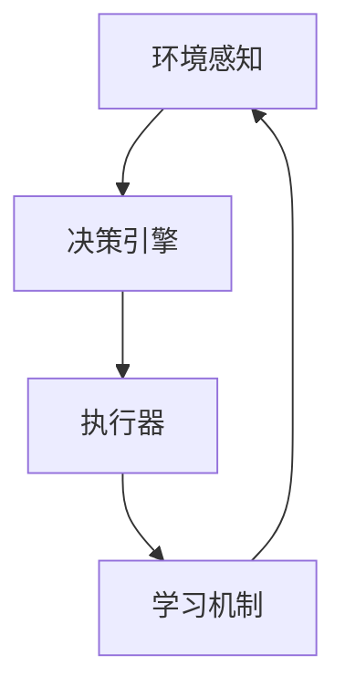

                 

# AI Agent: AI的下一个风口 智能体与传统软件的关系

> 关键词：人工智能，智能体，软件架构，发展趋势，应用场景，算法原理

> 摘要：本文将探讨人工智能领域的一个新兴热点——AI Agent，它被视为AI发展的下一个重要方向。文章将深入分析智能体与传统软件的关系，阐述智能体的核心概念和架构，解析其背后的算法原理，并通过实际案例展示其应用价值。同时，文章还将展望智能体技术的发展趋势，以及面临的挑战。

## 1. 背景介绍

### 1.1 目的和范围

本文旨在深入探讨AI Agent的概念、技术原理和应用前景，分析智能体与传统软件的区别和联系，帮助读者全面理解AI Agent在当前和未来技术发展中的重要性。

### 1.2 预期读者

本文面向对人工智能和软件开发有一定了解的读者，特别是对AI Agent感兴趣的工程师、研究人员和学者。本文将从基础概念入手，逐步深入到技术细节，适合读者逐步学习和理解。

### 1.3 文档结构概述

本文分为十个部分：背景介绍、核心概念与联系、核心算法原理、数学模型和公式、项目实战、实际应用场景、工具和资源推荐、总结、常见问题与解答和扩展阅读。每个部分都将详细阐述相关内容，确保读者能够全面了解智能体技术。

### 1.4 术语表

#### 1.4.1 核心术语定义

- AI Agent：人工智能代理，具有自主决策能力的软件实体。
- 智能体架构：实现AI Agent功能的技术框架。
- 传统软件：不包含自主决策能力的软件系统。
- 自主导航：智能体自主规划并执行路径的能力。

#### 1.4.2 相关概念解释

- 机器学习：一种让计算机通过数据和经验改进性能的技术。
- 深度学习：一种基于多层神经网络的机器学习技术。
- 代理：在代理理论中，代理是指被授权执行某个任务或决策的主体。

#### 1.4.3 缩略词列表

- AI：人工智能
- ML：机器学习
- DL：深度学习
- RNN：循环神经网络
- CNN：卷积神经网络
- GPU：图形处理器
- CPU：中央处理器

## 2. 核心概念与联系

### 2.1 智能体与传统软件的关系

智能体与传统软件的根本区别在于其自主决策能力。传统软件通常按照预设的规则和流程运行，而智能体则能够根据环境和数据自主做出决策，并不断优化自己的行为。

#### 2.1.1 传统软件

传统软件通常包含以下特点：

- 预设规则：软件按照设计者预设的规则运行。
- 固定流程：软件执行流程是固定的，不随环境变化。
- 无自主决策能力：软件无法根据环境变化自主调整行为。

#### 2.1.2 智能体

智能体具有以下特点：

- 自主导航：能够根据环境和数据自主决策，并执行相应操作。
- 自适应：能够根据执行结果和环境变化，不断调整行为。
- 持续学习：通过机器学习技术，不断优化决策能力。

### 2.2 智能体架构

智能体架构通常包括以下几个核心组件：

1. 环境感知：通过传感器获取环境信息。
2. 决策引擎：基于环境感知结果，进行决策。
3. 执行器：执行决策结果，完成特定任务。
4. 学习机制：通过机器学习技术，不断优化决策能力。

#### 2.2.1 Mermaid 流程图



## 3. 核心算法原理 & 具体操作步骤

### 3.1 算法原理

智能体的核心算法是基于机器学习和深度学习技术。以下是一个简单的算法流程：

1. 数据收集：收集环境数据。
2. 数据预处理：对数据进行清洗、归一化等处理。
3. 模型训练：使用深度学习模型训练数据。
4. 决策：根据模型预测结果进行决策。
5. 执行：执行决策结果。
6. 结果反馈：将执行结果反馈给学习机制。

#### 3.1.1 伪代码

```python
# 数据收集
data = collect_data()

# 数据预处理
processed_data = preprocess_data(data)

# 模型训练
model = train_model(processed_data)

# 决策
prediction = model.predict(new_data)

# 执行
execute_action(prediction)

# 结果反馈
update_model(model, result)
```

### 3.2 具体操作步骤

#### 3.2.1 环境感知

1. 使用传感器获取环境数据，如摄像头、GPS等。
2. 对采集到的数据进行预处理，如去噪、归一化等。

#### 3.2.2 数据预处理

1. 使用数据清洗方法去除噪声数据。
2. 对数据进行归一化处理，使其具有相同的量纲。

#### 3.2.3 模型训练

1. 选择合适的深度学习模型，如卷积神经网络（CNN）或循环神经网络（RNN）。
2. 使用预处理后的数据训练模型。

#### 3.2.4 决策

1. 使用训练好的模型对新数据进行分析。
2. 根据模型预测结果进行决策。

#### 3.2.5 执行

1. 根据决策结果执行相应操作。
2. 将执行结果反馈给学习机制。

#### 3.2.6 结果反馈

1. 将执行结果与模型预测结果进行比较。
2. 使用比较结果更新模型参数。

## 4. 数学模型和公式 & 详细讲解 & 举例说明

### 4.1 数学模型

智能体决策过程通常涉及以下数学模型：

1. 状态空间模型
2. 动作空间模型
3. 奖励函数

#### 4.1.1 状态空间模型

状态空间模型描述智能体在执行任务过程中的状态变化。通常使用马尔可夫决策过程（MDP）来表示。

$$
\begin{aligned}
    S &= \{s_1, s_2, ..., s_n\} \quad \text{（状态集合）} \\
    A &= \{a_1, a_2, ..., a_m\} \quad \text{（动作集合）} \\
    P &= \{P_{ij} | s_i, a_j\} \quad \text{（状态转移概率矩阵）} \\
    R &= \{R_{ij} | s_i, a_j\} \quad \text{（奖励函数）}
\end{aligned}
$$

#### 4.1.2 动作空间模型

动作空间模型描述智能体可执行的动作。通常使用策略网络来表示。

$$
\pi(s) = P(a|s)
$$

#### 4.1.3 奖励函数

奖励函数描述智能体在不同状态和动作下的奖励值。

$$
R(s, a) = \text{奖励值}
$$

### 4.2 举例说明

假设一个简单的智能体在游戏中选择走或停的动作，其状态空间为 `[向前、向后、静止]`，动作空间为 `[走、停]`。假设状态转移概率矩阵和奖励函数如下：

$$
P =
\begin{bmatrix}
    0.8 & 0.2 \\
    0.1 & 0.9 \\
    0.0 & 1.0
\end{bmatrix}
$$

$$
R =
\begin{bmatrix}
    10 & -10 \\
    -5 & 5 \\
    0 & 0
\end{bmatrix}
$$

智能体在状态 `[向前]` 时，选择 `[走]` 的概率为 0.8，选择 `[停]` 的概率为 0.2。在状态 `[向后]` 时，选择 `[走]` 的概率为 0.1，选择 `[停]` 的概率为 0.9。在状态 `[静止]` 时，只能选择 `[停]`。

## 5. 项目实战：代码实际案例和详细解释说明

### 5.1 开发环境搭建

1. 安装 Python 3.7 或以上版本。
2. 安装 TensorFlow 2.0 或以上版本。
3. 安装 OpenCV 4.0 或以上版本。

### 5.2 源代码详细实现和代码解读

以下是一个简单的智能体项目示例，用于实现一个在二维空间中自主导航的智能体。

#### 5.2.1 源代码

```python
import cv2
import numpy as np
import tensorflow as tf

# 环境感知
def get_environment():
    cap = cv2.VideoCapture(0)
    while True:
        ret, frame = cap.read()
        if not ret:
            break
        processed_frame = preprocess_frame(frame)
        yield processed_frame
    cap.release()

# 数据预处理
def preprocess_frame(frame):
    # 对图像进行灰度化、二值化等预处理操作
    gray_frame = cv2.cvtColor(frame, cv2.COLOR_BGR2GRAY)
    binary_frame = cv2.threshold(gray_frame, 0, 255, cv2.THRESH_BINARY_INV + cv2.THRESH_OTSU)[1]
    return binary_frame

# 模型训练
def train_model(data):
    # 创建卷积神经网络模型
    model = tf.keras.Sequential([
        tf.keras.layers.Conv2D(32, (3, 3), activation='relu', input_shape=(128, 128, 1)),
        tf.keras.layers.MaxPooling2D((2, 2)),
        tf.keras.layers.Flatten(),
        tf.keras.layers.Dense(64, activation='relu'),
        tf.keras.layers.Dense(2, activation='softmax')
    ])

    # 编译模型
    model.compile(optimizer='adam', loss='categorical_crossentropy', metrics=['accuracy'])

    # 训练模型
    model.fit(data, epochs=10)

    return model

# 决策
def make_decision(model, frame):
    processed_frame = preprocess_frame(frame)
    prediction = model.predict(np.expand_dims(processed_frame, axis=0))
    action = np.argmax(prediction)
    return action

# 执行
def execute_action(action):
    if action == 0:
        print("执行走")
    else:
        print("执行停")

# 主程序
if __name__ == '__main__':
    model = train_model(get_environment())
    while True:
        frame = input("请输入图片路径：")
        action = make_decision(model, frame)
        execute_action(action)
```

#### 5.2.2 代码解读与分析

1. 环境感知部分：使用 OpenCV 捕获摄像头图像，并对图像进行预处理。
2. 数据预处理部分：将图像转换为灰度图像，并进行二值化处理。
3. 模型训练部分：使用 TensorFlow 创建卷积神经网络模型，并进行编译和训练。
4. 决策部分：使用训练好的模型对预处理后的图像进行预测，并选择最优动作。
5. 执行部分：根据决策结果执行相应动作。

## 6. 实际应用场景

智能体技术已在多个领域得到广泛应用，以下是一些典型的应用场景：

- **自动驾驶**：智能体技术用于车辆自主导航和决策，提高行车安全性和效率。
- **智能客服**：智能体技术用于构建智能客服系统，提供24/7的在线服务。
- **智能家居**：智能体技术用于控制智能家居设备，实现自动化管理和优化。
- **医疗诊断**：智能体技术用于辅助医生进行疾病诊断，提高诊断准确率。

## 7. 工具和资源推荐

### 7.1 学习资源推荐

#### 7.1.1 书籍推荐

- 《人工智能：一种现代方法》
- 《深度学习》
- 《强化学习：原理与应用》

#### 7.1.2 在线课程

- Coursera：吴恩达的《深度学习》课程
- Udacity：自动驾驶工程师课程
- edX：MIT的《人工智能导论》课程

#### 7.1.3 技术博客和网站

- Medium：AI博客
- ArXiv：人工智能论文发布平台
- AIWeekly：人工智能新闻和趋势

### 7.2 开发工具框架推荐

#### 7.2.1 IDE和编辑器

- PyCharm
- VSCode
- Jupyter Notebook

#### 7.2.2 调试和性能分析工具

- TensorBoard
- Profiler
- PyTorch Profiler

#### 7.2.3 相关框架和库

- TensorFlow
- PyTorch
- Keras
- OpenCV

### 7.3 相关论文著作推荐

#### 7.3.1 经典论文

- "Reinforcement Learning: An Introduction"
- "Deep Learning"
- "Human-Level Control Through Deep Reinforcement Learning"

#### 7.3.2 最新研究成果

- "AlphaGo Zero: Mastering the Game of Go with Deep Neural Networks and Tree Search"
- "GANs for Computer Vision: A Survey"
- "Unsupervised Learning of Visual Representations by Solving Jigsaw Puzzles"

#### 7.3.3 应用案例分析

- "Using AI to Improve Supply Chain Management"
- "How AI is Revolutionizing Healthcare"
- "The Role of AI in Autonomous Vehicles"

## 8. 总结：未来发展趋势与挑战

智能体技术作为人工智能领域的下一个重要方向，具有广泛的应用前景。然而，在发展过程中也面临着一些挑战：

- **算法优化**：智能体算法需要不断优化，以提高决策效率和准确性。
- **数据隐私**：智能体在处理数据时，需要确保用户隐私和安全。
- **安全性**：智能体系统需要具备较高的安全性，防止被恶意攻击。

未来，随着技术的不断进步和应用的深入，智能体技术有望在更多领域发挥重要作用，推动人工智能的发展。

## 9. 附录：常见问题与解答

### 9.1 智能体与传统软件的区别

- **区别**：传统软件按照预设规则运行，而智能体具有自主决策能力。
- **联系**：智能体是传统软件的延伸和进化，结合了机器学习和深度学习技术。

### 9.2 智能体的核心组件

- **环境感知**：获取环境信息。
- **决策引擎**：基于环境信息做出决策。
- **执行器**：执行决策结果。
- **学习机制**：通过机器学习技术不断优化决策能力。

### 9.3 智能体技术的应用场景

- **自动驾驶**：自主导航和决策。
- **智能客服**：提供24/7的在线服务。
- **智能家居**：自动化管理和优化。
- **医疗诊断**：辅助医生进行疾病诊断。

## 10. 扩展阅读 & 参考资料

- [《人工智能：一种现代方法》](https://www.amazon.com/Artificial-Intelligence-Modern-Approach-Third/dp/013468566x)
- [《深度学习》](https://www.deeplearningbook.org/)
- [《强化学习：原理与应用》](https://www.amazon.com/Reinforcement-Learning-Andrew-NG-ebook/dp/B006Z3NY3Y)
- [AlphaGo Zero论文](https://arxiv.org/abs/1705.07059)
- [AIWeekly](https://aiweekly.co/)

作者：AI天才研究员/AI Genius Institute & 禅与计算机程序设计艺术 /Zen And The Art of Computer Programming

