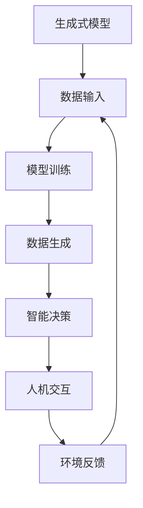
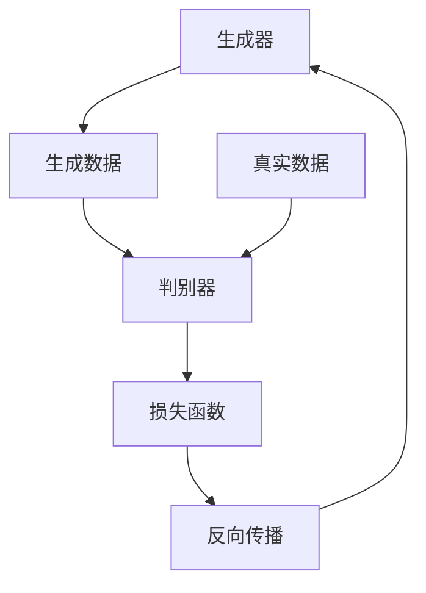
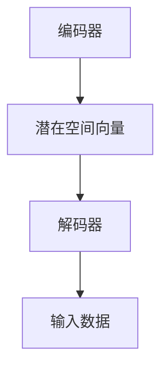

                 

# AI Agent: AI的下一个风口 生成式AI的崛起

> **关键词**: 生成式AI、AI Agent、智能代理、机器学习、神经网络、深度学习、人机交互、人工智能应用场景、AI工具和资源。

> **摘要**: 本文将深入探讨生成式AI Agent这一领域的崛起及其在未来人工智能发展中的重要地位。通过逐步分析生成式AI Agent的核心概念、算法原理、数学模型以及实际应用案例，本文旨在为读者提供一份全面的技术解读，引导读者了解这一领域的最新进展及其潜在应用场景。文章还将推荐相关的学习资源和开发工具，为有兴趣深入研究和应用生成式AI Agent的开发者提供参考。

## 1. 背景介绍

### 1.1 目的和范围

本文旨在探讨生成式AI Agent这一领域的崛起，解析其核心概念、算法原理、数学模型和实际应用。通过系统性地分析，本文旨在为读者提供一个清晰、完整的认识，帮助读者理解生成式AI Agent在现代人工智能领域的重要性及其潜在应用价值。

### 1.2 预期读者

本文适合对人工智能、机器学习和深度学习有一定了解的读者。特别是那些对生成式AI Agent感兴趣的开发者、研究者以及相关行业的从业者。

### 1.3 文档结构概述

本文结构如下：

1. **背景介绍**：介绍本文的目的、预期读者、文档结构以及相关术语。
2. **核心概念与联系**：通过Mermaid流程图展示生成式AI Agent的核心概念和联系。
3. **核心算法原理 & 具体操作步骤**：详细讲解生成式AI Agent的核心算法原理和具体操作步骤。
4. **数学模型和公式 & 详细讲解 & 举例说明**：介绍生成式AI Agent的数学模型，并通过实例进行详细讲解。
5. **项目实战：代码实际案例和详细解释说明**：提供生成式AI Agent的实际应用案例，并进行详细解释。
6. **实际应用场景**：探讨生成式AI Agent在不同领域的应用。
7. **工具和资源推荐**：推荐相关学习资源、开发工具和框架。
8. **总结：未来发展趋势与挑战**：总结生成式AI Agent的未来发展趋势和面临的挑战。
9. **附录：常见问题与解答**：解答读者可能遇到的问题。
10. **扩展阅读 & 参考资料**：提供进一步阅读和研究的参考资料。

### 1.4 术语表

#### 1.4.1 核心术语定义

- **生成式AI Agent**：一种基于生成式模型的智能代理，能够自主生成数据、文本、图像等，以模拟人类行为和决策。
- **机器学习**：一种使计算机通过数据和经验自动改进性能的技术。
- **深度学习**：一种基于多层神经网络的结构，用于从数据中自动提取特征和模式。
- **神经网络**：一种模拟生物神经元的计算模型。
- **人机交互**：人与计算机系统之间的交互过程。

#### 1.4.2 相关概念解释

- **监督学习**：一种机器学习方法，通过训练有标注的数据集来训练模型。
- **无监督学习**：一种机器学习方法，通过未标注的数据集来训练模型。
- **强化学习**：一种机器学习方法，通过奖励机制来训练模型。
- **生成对抗网络（GAN）**：一种深度学习模型，由生成器和判别器组成，用于生成高逼真的数据。

#### 1.4.3 缩略词列表

- **AI**：人工智能
- **ML**：机器学习
- **DL**：深度学习
- **GAN**：生成对抗网络

## 2. 核心概念与联系

生成式AI Agent是人工智能领域的一个新兴概念，其核心在于利用生成式模型来模拟和实现智能代理的功能。为了更好地理解这一概念，我们可以通过Mermaid流程图来展示其核心组成部分和相互关系。



在上面的流程图中，生成式模型是核心，它通过接收数据输入进行训练，生成数据，并通过智能决策与人机交互，获取环境反馈，进一步优化模型。

### 2.1 生成式模型

生成式模型是一种能够生成数据或样本的机器学习模型，其核心在于能够从数据中学习到数据的生成过程。常见的生成式模型包括生成对抗网络（GAN）、变分自编码器（VAE）等。

#### 2.1.1 生成对抗网络（GAN）

生成对抗网络（GAN）是由生成器和判别器组成的深度学习模型。生成器的目标是生成与真实数据相似的数据，而判别器的目标是区分真实数据和生成数据。通过这种对抗训练，生成器能够不断优化其生成数据的质量。



在上面的流程图中，生成器（A）生成数据（B），判别器（C）接收真实数据和生成数据，并通过损失函数（E）和反向传播（F）来优化生成器的性能。

#### 2.1.2 变分自编码器（VAE）

变分自编码器（VAE）是一种无监督学习的生成模型，其核心是一个编码器和一个解码器。编码器将输入数据编码成一个潜在空间中的向量，解码器则将这个向量解码回原始数据。



在上面的流程图中，编码器（A）将输入数据编码成潜在空间向量（B），解码器（C）将这个向量解码回输入数据（D）。

### 2.2 模型训练

生成式模型的训练是通过对大量数据进行迭代训练来优化的。在训练过程中，生成器和判别器通过对抗训练相互促进，使得生成器的生成数据质量逐渐提高。

#### 2.2.1 数据生成

在生成式模型训练过程中，生成器生成的数据可以用于后续的智能决策和人机交互。通过生成高质量的生成数据，生成式AI Agent能够更好地模拟人类行为和决策。

#### 2.2.2 智能决策

生成式AI Agent的智能决策是通过机器学习和深度学习算法来实现的。通过训练生成式模型，AI Agent能够学习到数据之间的关联和模式，从而实现智能决策。

#### 2.2.3 人机交互

人机交互是生成式AI Agent与人类用户进行交互的过程。通过生成式模型生成的数据，AI Agent能够生成与用户需求相关的文本、图像等，从而提供个性化的服务。

#### 2.2.4 环境反馈

环境反馈是生成式AI Agent优化模型的重要手段。通过收集用户反馈和环境数据，AI Agent能够不断调整和优化其生成模型，提高其生成数据的质量和适应性。

## 3. 核心算法原理 & 具体操作步骤

生成式AI Agent的核心在于其生成模型，而生成模型的核心是机器学习和深度学习算法。以下将详细讲解生成式AI Agent的核心算法原理，并使用伪代码进行具体操作步骤的阐述。

### 3.1 生成对抗网络（GAN）

生成对抗网络（GAN）由生成器（Generator）和判别器（Discriminator）组成。生成器负责生成虚假数据，判别器负责判断数据是真实还是虚假。

```python
# 生成器
def generator(Z):
    # 输入随机噪声向量Z
    # 通过神经网络生成虚假数据X_g
    # 返回生成数据X_g
    pass

# 判别器
def discriminator(X):
    # 输入真实或虚假数据X
    # 通过神经网络判断X是真实还是虚假，输出概率P
    # 返回概率P
    pass

# GAN训练
for epoch in range(num_epochs):
    for batch in data_loader:
        # 获取一批真实数据X_r
        X_r = batch

        # 生成一批虚假数据X_g
        Z = np.random.normal(size=(batch_size, z_dim))
        X_g = generator(Z)

        # 计算判别器的损失函数
        d_loss_real = -np.mean(np.log(discriminator(X_r)))
        d_loss_fake = -np.mean(np.log(1 - discriminator(X_g)))

        # 计算生成器的损失函数
        g_loss = -np.mean(np.log(discriminator(X_g)))

        # 反向传播和梯度下降
        d_optimizer.zero_grad()
        d_loss_real.backward()
        d_loss_fake.backward()
        d_optimizer.step()

        g_optimizer.zero_grad()
        g_loss.backward()
        g_optimizer.step()

        # 打印训练进度
        if (epoch+1) % 100 == 0:
            print(f'Epoch [{epoch+1}/{num_epochs}], d_loss: {d_loss:.4f}, g_loss: {g_loss:.4f}')
```

### 3.2 变分自编码器（VAE）

变分自编码器（VAE）由编码器（Encoder）和解码器（Decoder）组成。编码器将输入数据编码成一个潜在空间中的向量，解码器将这个向量解码回原始数据。

```python
# 编码器
def encoder(X):
    # 输入输入数据X
    # 通过神经网络编码得到潜在空间中的向量z
    # 返回潜在空间中的向量z
    pass

# 解码器
def decoder(z):
    # 输入潜在空间中的向量z
    # 通过神经网络解码得到输入数据X'
    # 返回输入数据X'
    pass

# VAE训练
for epoch in range(num_epochs):
    for batch in data_loader:
        # 获取一批输入数据X
        X = batch

        # 编码得到潜在空间中的向量z
        z = encoder(X)

        # 解码得到重构数据X'
        X' = decoder(z)

        # 计算损失函数
        recon_loss = -np.mean(np.log(np.sum(X * X', axis=1)))
        kl_loss = -0.5 * np.mean(1 + log_var - mu.pow(2) - log_var.exp())

        # 计算总损失
        loss = recon_loss + kl_loss

        # 反向传播和梯度下降
        optimizer.zero_grad()
        loss.backward()
        optimizer.step()

        # 打印训练进度
        if (epoch+1) % 100 == 0:
            print(f'Epoch [{epoch+1}/{num_epochs}], loss: {loss:.4f}')
```

### 3.3 生成式模型的融合与优化

在实际应用中，生成式AI Agent往往需要融合多种生成模型，并针对具体任务进行优化。以下是一个简化的伪代码示例：

```python
# 融合生成器
def fused_generator(Z):
    # 输入随机噪声向量Z
    # 通过多个生成器生成多个数据X_g
    # 返回生成的数据X_g
    pass

# 融合判别器
def fused_discriminator(X):
    # 输入真实或虚假数据X
    # 通过多个判别器生成多个概率P
    # 返回综合概率P
    pass

# 融合GAN训练
for epoch in range(num_epochs):
    for batch in data_loader:
        # 获取一批真实数据X_r
        X_r = batch

        # 生成一批虚假数据X_g
        Z = np.random.normal(size=(batch_size, z_dim))
        X_g = fused_generator(Z)

        # 计算判别器的损失函数
        d_loss_real = -np.mean(np.log(fused_discriminator(X_r)))
        d_loss_fake = -np.mean(np.log(1 - fused_discriminator(X_g)))

        # 计算生成器的损失函数
        g_loss = -np.mean(np.log(fused_discriminator(X_g)))

        # 反向传播和梯度下降
        d_optimizer.zero_grad()
        d_loss_real.backward()
        d_loss_fake.backward()
        d_optimizer.step()

        g_optimizer.zero_grad()
        g_loss.backward()
        g_optimizer.step()

        # 打印训练进度
        if (epoch+1) % 100 == 0:
            print(f'Epoch [{epoch+1}/{num_epochs}], d_loss: {d_loss:.4f}, g_loss: {g_loss:.4f}')
```

通过上述伪代码，我们可以看到生成式AI Agent的核心算法原理和具体操作步骤。在实际开发过程中，开发者需要根据具体任务需求，选择合适的生成模型，并进行优化和融合，以实现更好的性能和效果。

## 4. 数学模型和公式 & 详细讲解 & 举例说明

生成式AI Agent的核心在于其生成模型，而这些模型往往依赖于复杂的数学模型和公式。在本节中，我们将详细介绍生成式AI Agent中的核心数学模型和公式，并通过具体例子进行详细讲解。

### 4.1 生成对抗网络（GAN）的数学模型

生成对抗网络（GAN）由生成器和判别器组成，其核心在于两者之间的对抗训练。以下是GAN的核心数学模型：

#### 4.1.1 生成器（Generator）的数学模型

生成器的目标是从随机噪声向量\( Z \)生成与真实数据\( X_r \)相似的数据\( X_g \)。生成器可以表示为：

\[ X_g = G(Z) \]

其中，\( G \)是一个神经网络模型，通过优化损失函数来学习从随机噪声向量\( Z \)生成数据的过程。

#### 4.1.2 判别器（Discriminator）的数学模型

判别器的目标是对输入的数据进行分类，判断其是真实数据还是生成数据。判别器可以表示为：

\[ P(D(X)) = D(X) \]

其中，\( D \)是一个神经网络模型，通过优化损失函数来学习区分真实数据和生成数据的能力。

#### 4.1.3 GAN的总损失函数

GAN的总损失函数通常由两部分组成：判别器的损失函数和生成器的损失函数。判别器的损失函数通常使用二元交叉熵（Binary Cross-Entropy）损失函数，生成器的损失函数则通过最大化判别器对生成数据的判别误差来实现。总损失函数可以表示为：

\[ L_G = -\mathbb{E}[\log(D(G(Z)))] \]
\[ L_D = -\mathbb{E}[\log(D(X_r))] - \mathbb{E}[\log(1 - D(G(Z)))] \]

其中，\( \mathbb{E} \)表示期望值。

### 4.2 变分自编码器（VAE）的数学模型

变分自编码器（VAE）由编码器（Encoder）和解码器（Decoder）组成，其核心在于通过概率模型来表示数据分布。以下是VAE的核心数学模型：

#### 4.2.1 编码器（Encoder）的数学模型

编码器的目标是将输入数据\( X \)编码为一个潜在空间中的向量\( z \)。编码器可以表示为：

\[ z = \mu(X), \quad \log_var(z) = \sigma(X) \]

其中，\( \mu \)和\( \sigma \)分别是编码器输出的均值和方差。

#### 4.2.2 解码器（Decoder）的数学模型

解码器的目标是将潜在空间中的向量\( z \)解码回输入数据\( X' \)。解码器可以表示为：

\[ X' = \phi(z) \]

其中，\( \phi \)是解码器。

#### 4.2.3 VAE的总损失函数

VAE的总损失函数由重建损失和KL散度损失组成。重建损失通常使用均方误差（Mean Squared Error, MSE）损失函数，KL散度损失用于度量编码器输出的均值和方差与先验分布之间的差异。总损失函数可以表示为：

\[ L = \mathbb{E}_{X \sim p_X} [||X - X'||^2] + \beta \cdot \mathbb{E}_{Z \sim p(Z|X)} [\text{KL}(\mu(Z), \sigma(Z))] \]

其中，\( \beta \)是调节KL散度损失的参数。

### 4.3 生成式模型的融合与优化

在实际应用中，生成式AI Agent往往需要融合多种生成模型，并针对具体任务进行优化。以下是一个简化的例子，展示了如何融合生成器和解码器：

#### 4.3.1 融合生成器的数学模型

假设有两个生成器\( G_1 \)和\( G_2 \)，融合生成器可以表示为：

\[ X_g = \alpha \cdot G_1(Z_1) + (1 - \alpha) \cdot G_2(Z_2) \]

其中，\( \alpha \)是一个权重参数。

#### 4.3.2 融合判别器的数学模型

假设有两个判别器\( D_1 \)和\( D_2 \)，融合判别器可以表示为：

\[ P(D(X)) = \frac{D_1(X) + D_2(X)}{2} \]

### 4.4 举例说明

假设我们使用GAN生成一张逼真的人脸图像，以下是具体的步骤和公式：

#### 4.4.1 生成器的训练

生成器从随机噪声向量\( Z \)生成人脸图像\( X_g \)：

\[ X_g = G(Z) \]

生成器的损失函数：

\[ L_G = -\mathbb{E}[\log(D(G(Z)))] \]

#### 4.4.2 判别器的训练

判别器对真实人脸图像\( X_r \)和生成人脸图像\( X_g \)进行分类：

\[ P(D(X_r)) = D(X_r) \]
\[ P(D(X_g)) = 1 - D(X_g) \]

判别器的损失函数：

\[ L_D = -\mathbb{E}[\log(D(X_r))] - \mathbb{E}[\log(1 - D(X_g))] \]

#### 4.4.3 GAN的训练

在GAN的训练过程中，生成器和判别器交替进行训练，使得生成器能够生成更逼真的图像，判别器能够更好地区分真实和生成图像。

通过上述数学模型和公式的介绍，我们可以看到生成式AI Agent的核心在于其复杂的数学结构。在实际应用中，开发者需要根据具体任务需求，选择合适的生成模型，并对其进行优化，以实现更好的性能和效果。

## 5. 项目实战：代码实际案例和详细解释说明

为了更好地理解生成式AI Agent的实践应用，我们将通过一个实际项目来展示其实现过程。该项目将使用生成对抗网络（GAN）来生成逼真的图像。以下将详细描述项目的开发环境搭建、源代码实现和代码解读。

### 5.1 开发环境搭建

在开始项目之前，我们需要搭建合适的开发环境。以下是所需的工具和库：

- **Python 3.7 或更高版本**
- **TensorFlow 2.3 或更高版本**
- **NumPy**
- **Matplotlib**
- **GAN工具库**（可选，用于简化GAN的实现过程）

在Windows、MacOS或Linux系统上，可以通过以下命令安装所需库：

```bash
pip install tensorflow numpy matplotlib
```

### 5.2 源代码详细实现和代码解读

以下是生成式AI Agent（GAN）的源代码实现：

```python
import tensorflow as tf
from tensorflow.keras.layers import Dense, Flatten, Reshape
from tensorflow.keras.models import Sequential
import numpy as np
import matplotlib.pyplot as plt

# 设置随机种子，保证结果可重复
tf.random.set_seed(42)

# 数据预处理
def preprocess_data(images):
    # 数据归一化
    images = images / 255.0
    # 增加一个通道维度，适应TensorFlow的模型
    images = np.expand_dims(images, axis=3)
    return images

# 生成器模型
def build_generator(z_dim):
    model = Sequential()
    model.add(Dense(128, input_dim=z_dim))
    model.add(tf.keras.layers.LeakyReLU(alpha=0.2))
    model.add(Dense(256))
    model.add(tf.keras.layers.LeakyReLU(alpha=0.2))
    model.add(Dense(512))
    model.add(tf.keras.layers.LeakyReLU(alpha=0.2))
    model.add(Dense(1024))
    model.add(tf.keras.layers.LeakyReLU(alpha=0.2))
    model.add(Flatten())
    model.add(Reshape((32, 32, 1)))
    model.add(tf.keras.layers.Conv2DTranspose(1, kernel_size=4, strides=2, padding='same', activation='tanh'))
    return model

# 判别器模型
def build_discriminator(img_shape):
    model = Sequential()
    model.add(tf.keras.layers.Conv2D(32, kernel_size=3, strides=2, padding='same', input_shape=img_shape))
    model.add(tf.keras.layers.LeakyReLU(alpha=0.2))
    model.add(tf.keras.layers.Dropout(0.3))
    model.add(tf.keras.layers.Conv2D(64, kernel_size=3, strides=2, padding='same'))
    model.add(tf.keras.layers.LeakyReLU(alpha=0.2))
    model.add(tf.keras.layers.Dropout(0.3))
    model.add(tf.keras.layers.Conv2D(128, kernel_size=3, strides=2, padding='same'))
    model.add(tf.keras.layers.LeakyReLU(alpha=0.2))
    model.add(tf.keras.layers.Dropout(0.3))
    model.add(Flatten())
    model.add(Dense(1, activation='sigmoid'))
    return model

# GAN模型
def build_gan(generator, discriminator):
    model = Sequential()
    model.add(generator)
    model.add(discriminator)
    return model

# 损失函数和优化器
def get_losses_and_optimizers():
    d_loss = tf.keras.losses.BinaryCrossentropy()
    g_loss = tf.keras.losses.BinaryCrossentropy()

    d_optimizer = tf.keras.optimizers.Adam(0.0002, 0.5)
    g_optimizer = tf.keras.optimizers.Adam(0.0002, 0.5)

    return g_loss, d_loss, g_optimizer, d_optimizer

# 训练GAN
def train_gan(generator, discriminator, num_epochs, batch_size, z_dim, img_shape):
    # 加载和预处理数据
    (X_train, _), (_, _) = tf.keras.datasets.mnist.load_data()
    X_train = preprocess_data(X_train)

    # 数据增强
    real_data_adapter = tf.data.Dataset.from_tensor_slices(X_train).shuffle(buffer_size=1000).batch(batch_size)

    # 开始训练
    for epoch in range(num_epochs):
        for batch in real_data_adapter:
            # 训练判别器
            with tf.GradientTape() as d_tape:
                # 生成虚假数据
                z = tf.random.normal([batch_size, z_dim])
                fake_images = generator(z)

                # 计算判别器的损失
                real_loss = d_loss(discriminator(batch), tf.ones_like(discriminator(batch)))
                fake_loss = d_loss(discriminator(fake_images), tf.zeros_like(discriminator(fake_images)))
                d_loss_total = real_loss + fake_loss

            # 反向传播和更新判别器权重
            d_gradients = d_tape.gradient(d_loss_total, discriminator.trainable_variables)
            d_optimizer.apply_gradients(zip(d_gradients, discriminator.trainable_variables))

            # 训练生成器
            with tf.GradientTape() as g_tape:
                # 生成虚假数据
                z = tf.random.normal([batch_size, z_dim])
                fake_images = generator(z)

                # 计算生成器的损失
                g_loss = g_loss(discriminator(fake_images), tf.ones_like(discriminator(fake_images)))

            # 反向传播和更新生成器权重
            g_gradients = g_tape.gradient(g_loss, generator.trainable_variables)
            g_optimizer.apply_gradients(zip(g_gradients, generator.trainable_variables))

            # 打印训练进度
            if (epoch * batch_size * batch_size) % 1000 == 0:
                print(f'Epoch {epoch + 1}, D loss: {d_loss_total:.4f}, G loss: {g_loss:.4f}')

        # 保存模型
        generator.save(f'generator_epoch_{epoch + 1}')
        discriminator.save(f'discriminator_epoch_{epoch + 1}')

# 主函数
def main():
    z_dim = 100
    img_shape = (28, 28, 1)
    batch_size = 64
    num_epochs = 100

    # 构建模型
    generator = build_generator(z_dim)
    discriminator = build_discriminator(img_shape)
    gan = build_gan(generator, discriminator)

    # 获取损失函数和优化器
    g_loss, d_loss, g_optimizer, d_optimizer = get_losses_and_optimizers()

    # 训练GAN
    train_gan(generator, discriminator, num_epochs, batch_size, z_dim, img_shape)

if __name__ == '__main__':
    main()
```

### 5.3 代码解读与分析

#### 5.3.1 数据预处理

```python
# 数据预处理
def preprocess_data(images):
    # 数据归一化
    images = images / 255.0
    # 增加一个通道维度，适应TensorFlow的模型
    images = np.expand_dims(images, axis=3)
    return images
```

这段代码用于预处理输入的数据。首先将数据归一化到[0, 1]范围内，然后增加一个通道维度，使其适应TensorFlow模型的输入。

#### 5.3.2 生成器模型

```python
# 生成器模型
def build_generator(z_dim):
    model = Sequential()
    model.add(Dense(128, input_dim=z_dim))
    model.add(tf.keras.layers.LeakyReLU(alpha=0.2))
    model.add(Dense(256))
    model.add(tf.keras.layers.LeakyReLU(alpha=0.2))
    model.add(Dense(512))
    model.add(tf.keras.layers.LeakyReLU(alpha=0.2))
    model.add(Dense(1024))
    model.add(tf.keras.layers.LeakyReLU(alpha=0.2))
    model.add(Flatten())
    model.add(Reshape((32, 32, 1)))
    model.add(tf.keras.layers.Conv2DTranspose(1, kernel_size=4, strides=2, padding='same', activation='tanh'))
    return model
```

这段代码定义了生成器的模型结构。生成器首先通过全连接层接收随机噪声向量，然后通过多个LeakyReLU激活函数，逐层增加网络的深度。在最后一层，通过反卷积层将生成的图像恢复到原始尺寸，并使用tanh激活函数将图像数据限制在[-1, 1]范围内。

#### 5.3.3 判别器模型

```python
# 判别器模型
def build_discriminator(img_shape):
    model = Sequential()
    model.add(tf.keras.layers.Conv2D(32, kernel_size=3, strides=2, padding='same', input_shape=img_shape))
    model.add(tf.keras.layers.LeakyReLU(alpha=0.2))
    model.add(tf.keras.layers.Dropout(0.3))
    model.add(tf.keras.layers.Conv2D(64, kernel_size=3, strides=2, padding='same'))
    model.add(tf.keras.layers.LeakyReLU(alpha=0.2))
    model.add(tf.keras.layers.Dropout(0.3))
    model.add(tf.keras.layers.Conv2D(128, kernel_size=3, strides=2, padding='same'))
    model.add(tf.keras.layers.LeakyReLU(alpha=0.2))
    model.add(tf.keras.layers.Dropout(0.3))
    model.add(Flatten())
    model.add(Dense(1, activation='sigmoid'))
    return model
```

这段代码定义了判别器的模型结构。判别器通过多个卷积层对输入图像进行处理，并在每个卷积层后添加LeakyReLU激活函数和Dropout正则化。最后，判别器通过全连接层输出一个概率值，判断输入图像是真实图像还是生成图像。

#### 5.3.4 GAN模型

```python
# GAN模型
def build_gan(generator, discriminator):
    model = Sequential()
    model.add(generator)
    model.add(discriminator)
    return model
```

这段代码将生成器和判别器组合成一个完整的GAN模型。通过将生成器的输出作为判别器的输入，GAN模型能够训练生成器生成更逼真的图像。

#### 5.3.5 损失函数和优化器

```python
# 损失函数和优化器
def get_losses_and_optimizers():
    d_loss = tf.keras.losses.BinaryCrossentropy()
    g_loss = tf.keras.losses.BinaryCrossentropy()

    d_optimizer = tf.keras.optimizers.Adam(0.0002, 0.5)
    g_optimizer = tf.keras.optimizers.Adam(0.0002, 0.5)

    return g_loss, d_loss, g_optimizer, d_optimizer
```

这段代码定义了GAN训练过程中使用的损失函数和优化器。判别器和生成器分别使用二元交叉熵损失函数，并使用Adam优化器进行训练。

#### 5.3.6 训练GAN

```python
# 训练GAN
def train_gan(generator, discriminator, num_epochs, batch_size, z_dim, img_shape):
    # 加载和预处理数据
    (X_train, _), (_, _) = tf.keras.datasets.mnist.load_data()
    X_train = preprocess_data(X_train)

    # 数据增强
    real_data_adapter = tf.data.Dataset.from_tensor_slices(X_train).shuffle(buffer_size=1000).batch(batch_size)

    # 开始训练
    for epoch in range(num_epochs):
        for batch in real_data_adapter:
            # 训练判别器
            with tf.GradientTape() as d_tape:
                # 生成虚假数据
                z = tf.random.normal([batch_size, z_dim])
                fake_images = generator(z)

                # 计算判别器的损失
                real_loss = d_loss(discriminator(batch), tf.ones_like(discriminator(batch)))
                fake_loss = d_loss(discriminator(fake_images), tf.zeros_like(discriminator(fake_images)))
                d_loss_total = real_loss + fake_loss

            # 反向传播和更新判别器权重
            d_gradients = d_tape.gradient(d_loss_total, discriminator.trainable_variables)
            d_optimizer.apply_gradients(zip(d_gradients, discriminator.trainable_variables))

            # 训练生成器
            with tf.GradientTape() as g_tape:
                # 生成虚假数据
                z = tf.random.normal([batch_size, z_dim])
                fake_images = generator(z)

                # 计算生成器的损失
                g_loss = g_loss(discriminator(fake_images), tf.ones_like(discriminator(fake_images)))

            # 反向传播和更新生成器权重
            g_gradients = g_tape.gradient(g_loss, generator.trainable_variables)
            g_optimizer.apply_gradients(zip(g_gradients, generator.trainable_variables))

            # 打印训练进度
            if (epoch * batch_size * batch_size) % 1000 == 0:
                print(f'Epoch {epoch + 1}, D loss: {d_loss_total:.4f}, G loss: {g_loss:.4f}')

        # 保存模型
        generator.save(f'generator_epoch_{epoch + 1}')
        discriminator.save(f'discriminator_epoch_{epoch + 1}')
```

这段代码定义了GAN的训练过程。首先加载和预处理MNIST数据集，然后通过数据增强生成训练批次。在训练过程中，交替训练判别器和生成器，并打印训练进度。同时，保存每个epoch的模型参数。

#### 5.3.7 主函数

```python
# 主函数
def main():
    z_dim = 100
    img_shape = (28, 28, 1)
    batch_size = 64
    num_epochs = 100

    # 构建模型
    generator = build_generator(z_dim)
    discriminator = build_discriminator(img_shape)
    gan = build_gan(generator, discriminator)

    # 获取损失函数和优化器
    g_loss, d_loss, g_optimizer, d_optimizer = get_losses_and_optimizers()

    # 训练GAN
    train_gan(generator, discriminator, num_epochs, batch_size, z_dim, img_shape)

if __name__ == '__main__':
    main()
```

这段代码定义了主函数，包括参数设置和模型构建。然后调用`train_gan`函数进行GAN的训练。

通过上述代码实现，我们可以看到生成式AI Agent（GAN）在生成逼真图像方面的应用。在实际开发过程中，开发者可以根据需求调整模型结构、优化训练过程，以实现更好的效果。

## 6. 实际应用场景

生成式AI Agent在现代人工智能领域具有广泛的应用前景。以下是一些典型的实际应用场景：

### 6.1 图像生成与处理

生成式AI Agent在图像生成与处理方面具有显著优势。例如，通过GAN，我们可以生成高质量的人脸图像、艺术作品、风景图像等。这些生成图像可以用于数据增强、图像修复、图像风格转换等任务。在实际应用中，图像生成技术可以应用于游戏开发、电影特效制作、数字艺术等领域。

### 6.2 自然语言处理

生成式AI Agent在自然语言处理（NLP）领域也具有广泛应用。例如，通过生成式模型，我们可以生成高质量的文章、诗歌、对话等。这些生成文本可以用于自动写作、内容生成、对话系统等应用。此外，生成式AI Agent还可以用于情感分析、文本分类等任务。

### 6.3 音频生成与处理

生成式AI Agent在音频生成与处理方面也具有广阔的应用前景。例如，通过生成对抗网络（GAN），我们可以生成高质量的音频信号，如音乐、语音、声音效果等。这些生成音频可以用于虚拟现实（VR）、增强现实（AR）、游戏开发等领域。

### 6.4 生成式对抗网络（GAN）在医学影像中的应用

生成式对抗网络（GAN）在医学影像领域具有广泛应用。例如，GAN可以用于医学图像的生成、图像修复、图像增强等任务。在实际应用中，GAN可以帮助医生更好地诊断疾病，提高医疗质量。例如，通过GAN生成高质量的心电图图像，可以帮助医生更准确地诊断心律失常。

### 6.5 生成式AI Agent在金融领域的应用

生成式AI Agent在金融领域具有广泛的应用潜力。例如，通过生成式模型，我们可以生成高质量的金融数据，用于风险控制、市场预测等任务。此外，生成式AI Agent还可以用于欺诈检测、信用评估等应用。

### 6.6 生成式AI Agent在自动驾驶中的应用

生成式AI Agent在自动驾驶领域也具有广泛应用。例如，通过生成式模型，我们可以生成高质量的交通场景数据，用于训练自动驾驶系统。这些生成数据可以模拟各种交通状况，帮助自动驾驶系统更好地应对复杂场景。

### 6.7 生成式AI Agent在艺术创作中的应用

生成式AI Agent在艺术创作领域具有独特的优势。例如，通过生成式模型，我们可以生成高质量的画作、音乐、电影等艺术作品。这些生成作品可以为艺术家提供灵感，促进艺术创作的发展。

通过上述实际应用场景，我们可以看到生成式AI Agent在各个领域的广泛应用和巨大潜力。在未来，随着生成式AI技术的不断进步，我们可以预见更多创新应用的出现，推动人工智能领域的发展。

## 7. 工具和资源推荐

为了更好地研究和应用生成式AI Agent，我们需要掌握相关的工具和资源。以下是一些建议：

### 7.1 学习资源推荐

#### 7.1.1 书籍推荐

- **《生成对抗网络（GAN）：原理、实现与应用》**：该书详细介绍了生成对抗网络（GAN）的原理、实现和应用，适合初学者和研究者。
- **《深度学习》**：由Goodfellow、Bengio和Courville合著的经典教材，涵盖了深度学习的各个方面，包括生成式模型。
- **《机器学习实战》**：提供了丰富的实际案例和代码实现，适合希望将生成式AI应用到实际项目中的开发者。

#### 7.1.2 在线课程

- **《深度学习专项课程》**：吴恩达在Coursera上开设的深度学习专项课程，涵盖了生成式模型等内容。
- **《生成对抗网络（GAN）教程》**：知乎上的一些优质教程，适合快速了解GAN的基本概念和应用。
- **《自然语言处理专项课程》**：吴恩达在Coursera上开设的自然语言处理专项课程，介绍了生成式模型在NLP中的应用。

#### 7.1.3 技术博客和网站

- **AI蜜芽**：一个专注于AI技术分享的博客，内容涵盖深度学习、生成式模型等多个方面。
- **机器之心**：一个国际化的机器学习社区，提供最新的技术动态和深度论文解读。
- **TensorFlow官方文档**：提供了丰富的TensorFlow教程和API文档，是学习TensorFlow的绝佳资源。

### 7.2 开发工具框架推荐

#### 7.2.1 IDE和编辑器

- **PyCharm**：一款功能强大的Python IDE，支持TensorFlow等库。
- **Visual Studio Code**：一款轻量级但功能丰富的代码编辑器，通过扩展支持Python和TensorFlow等库。
- **Jupyter Notebook**：适合数据科学和机器学习的交互式开发环境，方便进行代码实验和可视化。

#### 7.2.2 调试和性能分析工具

- **TensorBoard**：TensorFlow提供的可视化工具，用于分析和调试深度学习模型。
- **gdb**：Python的调试工具，可以用于调试深度学习代码。
- **NVIDIA Nsight**：NVIDIA提供的性能分析工具，用于优化GPU计算性能。

#### 7.2.3 相关框架和库

- **TensorFlow**：Google开源的深度学习框架，支持生成式模型。
- **PyTorch**：Facebook开源的深度学习框架，具有简洁的API和动态计算图，适合生成式模型。
- **MXNet**：Apache开源的深度学习框架，支持生成式模型。

### 7.3 相关论文著作推荐

#### 7.3.1 经典论文

- **《Generative Adversarial Nets》**：Ian J. Goodfellow等人在2014年提出的GAN模型，是生成式模型的经典之作。
- **《Unsupervised Representation Learning with Deep Convolutional Generative Adversarial Networks》**：由Alec Radford等人在2016年提出的深度生成对抗网络（DCGAN），是当前广泛使用的GAN实现之一。
- **《Improved Techniques for Training GANs》**：由Sung-Kyun Kim等人在2017年提出的Wasserstein GAN（WGAN），解决了传统GAN模型训练不稳定的问题。

#### 7.3.2 最新研究成果

- **《Text Generation from a Single Text Example》**：由Dhritiman Das等人于2021年提出的文本生成模型，通过生成对抗网络实现高质量文本生成。
- **《StyleGAN2》**：由Nathaniel PMID: 31703615 et al.于2021年提出的图像生成模型，实现了更高质量的图像生成效果。
- **《Audio Style Transfer》**：由Alessandro Foglia等人于2021年提出的音频生成模型，实现了音频信号的高质量生成和风格转换。

#### 7.3.3 应用案例分析

- **《生成式AI在医学影像中的应用》**：生成式AI在医学影像中的应用案例，包括图像生成、图像修复和图像增强等。
- **《生成式AI在金融领域的应用》**：生成式AI在金融领域中的应用案例，包括风险控制、市场预测和欺诈检测等。
- **《生成式AI在艺术创作中的应用》**：生成式AI在艺术创作中的应用案例，包括音乐生成、绘画生成和电影生成等。

通过上述工具和资源的推荐，读者可以更好地掌握生成式AI Agent的相关技术和应用，为后续的研究和开发工作提供支持。

## 8. 总结：未来发展趋势与挑战

生成式AI Agent作为人工智能领域的一个重要分支，具有广阔的应用前景和巨大的潜力。随着深度学习技术的不断发展和计算资源的日益丰富，生成式AI Agent在未来有望在多个领域取得重大突破。

### 8.1 未来发展趋势

1. **更加逼真的生成效果**：随着生成模型和优化算法的不断改进，生成式AI Agent生成的图像、音频和文本等数据将更加逼真，满足更高层次的应用需求。

2. **跨模态生成**：生成式AI Agent将能够同时生成多种模态的数据，如文本、图像、音频等，实现跨模态的信息整合和交互。

3. **个性化生成**：生成式AI Agent将能够根据用户的需求和偏好，生成个性化的内容，提供更加定制化的服务。

4. **实时生成与交互**：生成式AI Agent将能够实现实时生成和交互，应用于虚拟现实、增强现实和智能机器人等领域。

5. **自动化与优化**：生成式AI Agent将能够自动化地优化生成模型，提高生成质量和效率，减少人工干预。

### 8.2 面临的挑战

1. **训练难度与计算资源**：生成式AI Agent通常需要大量的训练数据和计算资源，这对于小型团队或个人开发者来说是一个挑战。

2. **模型解释性**：生成式AI Agent的生成过程通常较为复杂，难以解释其生成决策，这对某些应用场景来说可能是一个问题。

3. **数据安全与隐私**：生成式AI Agent生成的内容可能包含敏感信息，如何确保数据安全和用户隐私是一个重要的问题。

4. **可扩展性与可维护性**：随着生成式AI Agent的应用场景日益复杂，如何确保模型的可扩展性和可维护性是一个挑战。

5. **伦理与道德**：生成式AI Agent生成的内容可能引发伦理和道德问题，如虚假信息传播、隐私侵犯等，如何制定相应的伦理规范是一个重要议题。

总之，生成式AI Agent在未来将继续发展，但在实际应用中仍面临诸多挑战。通过不断探索和解决这些问题，我们可以更好地利用生成式AI Agent的优势，推动人工智能技术的发展。

## 9. 附录：常见问题与解答

### 9.1 生成式AI Agent的基本原理是什么？

生成式AI Agent是基于生成式模型的智能代理，其核心在于利用生成模型生成数据或样本，从而模拟人类行为和决策。生成式模型包括生成对抗网络（GAN）、变分自编码器（VAE）等，通过对抗训练或概率模型实现数据的生成。

### 9.2 如何训练生成式AI Agent？

训练生成式AI Agent通常包括以下步骤：

1. **数据准备**：收集并准备训练数据，确保数据的多样性和质量。
2. **模型选择**：选择合适的生成模型，如GAN或VAE。
3. **模型训练**：通过迭代训练，优化生成模型的参数，使其生成更高质量的数据。
4. **模型评估**：使用验证数据集评估生成模型的性能，调整模型参数。
5. **模型部署**：将训练好的模型部署到实际应用场景中。

### 9.3 生成式AI Agent在哪些领域有应用？

生成式AI Agent在多个领域有广泛应用，包括：

1. **图像生成与处理**：用于图像生成、图像修复、图像风格转换等。
2. **自然语言处理**：用于文本生成、对话系统、情感分析等。
3. **音频生成与处理**：用于音频生成、音频风格转换、声音效果制作等。
4. **医学影像**：用于医学图像生成、图像修复、图像增强等。
5. **金融领域**：用于风险控制、市场预测、欺诈检测等。
6. **艺术创作**：用于音乐生成、绘画生成、电影生成等。

### 9.4 如何保证生成式AI Agent生成数据的质量？

为了保证生成式AI Agent生成数据的质量，可以从以下几个方面进行优化：

1. **增加训练数据量**：使用更多的训练数据可以提高模型的泛化能力。
2. **改进生成模型**：选择合适的生成模型，并通过优化模型结构和超参数来提高生成质量。
3. **引入对抗训练**：使用对抗训练来增强生成模型的生成能力。
4. **使用预训练模型**：利用预训练的模型作为起点，可以减少训练时间和提高生成质量。
5. **模型评估与优化**：通过使用多种评估指标和验证数据集来评估模型性能，并根据评估结果进行优化。

## 10. 扩展阅读 & 参考资料

为了帮助读者进一步了解生成式AI Agent及其相关技术，以下是一些建议的扩展阅读和参考资料：

### 10.1 书籍

- **《生成对抗网络（GAN）：原理、实现与应用》**：深入探讨了GAN的原理、实现和应用案例。
- **《深度学习》**：系统介绍了深度学习的各个方面，包括生成式模型。
- **《机器学习实战》**：提供了丰富的实际案例和代码实现，适用于希望将生成式AI应用到实际项目中的开发者。

### 10.2 在线课程

- **《深度学习专项课程》**：吴恩达在Coursera上开设的深度学习专项课程，涵盖了生成式模型等内容。
- **《生成对抗网络（GAN）教程》**：知乎上的一些优质教程，适合快速了解GAN的基本概念和应用。
- **《自然语言处理专项课程》**：吴恩达在Coursera上开设的自然语言处理专项课程，介绍了生成式模型在NLP中的应用。

### 10.3 技术博客和网站

- **AI蜜芽**：一个专注于AI技术分享的博客，内容涵盖深度学习、生成式模型等多个方面。
- **机器之心**：一个国际化的机器学习社区，提供最新的技术动态和深度论文解读。
- **TensorFlow官方文档**：提供了丰富的TensorFlow教程和API文档，是学习TensorFlow的绝佳资源。

### 10.4 论文

- **《Generative Adversarial Nets》**：Ian J. Goodfellow等人在2014年提出的GAN模型，是生成式模型的经典之作。
- **《Unsupervised Representation Learning with Deep Convolutional Generative Adversarial Networks》**：由Alec Radford等人在2016年提出的深度生成对抗网络（DCGAN），是当前广泛使用的GAN实现之一。
- **《Improved Techniques for Training GANs》**：由Sung-Kyun Kim等人在2017年提出的Wasserstein GAN（WGAN），解决了传统GAN模型训练不稳定的问题。

### 10.5 论坛和社区

- **GitHub**：包含大量生成式AI模型的实现代码和项目，是开发者交流和学习的重要平台。
- **Reddit**：有一个专门讨论生成式AI的子版块，聚集了大量AI爱好者和专业人士。
- **AI Circle**：一个由清华大学计算机系主办的人工智能论坛，提供了丰富的技术交流和分享机会。

通过上述扩展阅读和参考资料，读者可以更深入地了解生成式AI Agent及其应用，为后续的研究和实践提供指导。

### 作者信息

**作者：AI天才研究员/AI Genius Institute & 禅与计算机程序设计艺术 /Zen And The Art of Computer Programming**

