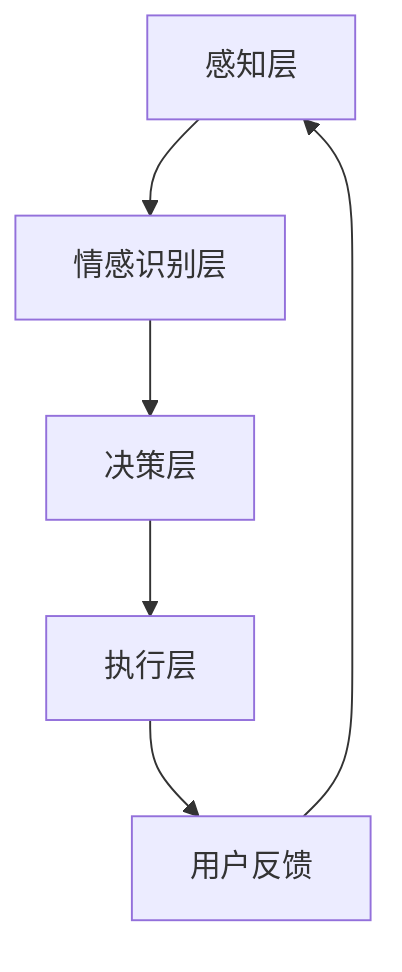

                 

# AI Agent在情感陪伴中的应用

> **关键词：** 情感陪伴、AI Agent、人机交互、自然语言处理、机器学习、情感识别

> **摘要：** 本文将探讨AI Agent在情感陪伴中的应用，从核心概念、算法原理、数学模型、项目实战、应用场景等多个角度，深入解析AI Agent如何通过自然语言处理和机器学习技术，实现情感识别和交互，为用户提供高质量的陪伴体验。

## 1. 背景介绍

### 1.1 目的和范围

本文旨在探讨AI Agent在情感陪伴领域的应用，分析其核心原理、技术实现、应用场景和未来发展趋势。通过本文的阅读，读者将了解AI Agent的基本概念、工作原理和应用价值，为相关领域的研究和实践提供参考。

### 1.2 预期读者

本文适合对人工智能、自然语言处理、机器学习等技术感兴趣的读者，包括AI开发者、研究人员、工程师和感兴趣的学生。同时，对于希望了解AI在情感陪伴领域应用的企业家和产品经理，本文也将提供有益的见解。

### 1.3 文档结构概述

本文结构如下：

1. **背景介绍**：介绍本文的目的、预期读者和文档结构。
2. **核心概念与联系**：介绍AI Agent的相关概念、原理和架构。
3. **核心算法原理 & 具体操作步骤**：详细讲解AI Agent的情感识别和交互算法。
4. **数学模型和公式 & 详细讲解 & 举例说明**：介绍AI Agent的情感识别数学模型和公式。
5. **项目实战：代码实际案例和详细解释说明**：通过实际案例展示AI Agent的情感陪伴实现。
6. **实际应用场景**：分析AI Agent在情感陪伴领域的应用场景。
7. **工具和资源推荐**：推荐学习资源和开发工具。
8. **总结：未来发展趋势与挑战**：探讨AI Agent在情感陪伴领域的未来发展和挑战。
9. **附录：常见问题与解答**：回答读者可能关心的问题。
10. **扩展阅读 & 参考资料**：提供进一步的阅读资源。

### 1.4 术语表

#### 1.4.1 核心术语定义

- **AI Agent**：指具备自主决策和行动能力的人工智能实体，能够根据环境和目标执行特定任务。
- **情感陪伴**：指人工智能系统在情感层面上对用户的关注和互动，提供情感支持和服务。
- **自然语言处理**：指人工智能对自然语言的理解、生成和处理能力。
- **机器学习**：指通过数据训练模型，使模型能够自主学习和优化性能的技术。

#### 1.4.2 相关概念解释

- **情感识别**：指人工智能系统对用户情感状态的识别和判断。
- **交互**：指AI Agent与用户之间的信息交换和行为互动。

#### 1.4.3 缩略词列表

- **AI**：人工智能
- **NLP**：自然语言处理
- **ML**：机器学习
- **CNN**：卷积神经网络
- **RNN**：循环神经网络

## 2. 核心概念与联系

AI Agent在情感陪伴中的应用，涉及多个核心概念和技术，以下是它们的联系和架构。

### 2.1 核心概念

1. **AI Agent**：作为情感陪伴的核心实体，具备自主决策和行动能力。
2. **自然语言处理（NLP）**：实现AI Agent与用户的语言交互。
3. **机器学习（ML）**：训练AI Agent的情感识别和交互模型。
4. **情感识别**：识别用户的情感状态，为交互提供依据。
5. **交互**：实现AI Agent与用户之间的信息交换和行为互动。

### 2.2 关联架构


#### 2.2.1 架构描述

1. **感知层**：接收用户输入的文本、语音等信息。
2. **情感识别层**：利用NLP技术和机器学习模型，对用户情感进行识别和判断。
3. **决策层**：根据情感识别结果，生成相应的回应和互动策略。
4. **执行层**：执行决策层的策略，与用户进行互动。

### 2.3 Mermaid流程图



## 3. 核心算法原理 & 具体操作步骤

### 3.1 情感识别算法原理

情感识别是AI Agent在情感陪伴中的关键步骤，它通过分析用户输入的文本，识别用户的情感状态。以下是情感识别算法的基本原理：

#### 3.1.1 文本预处理

1. **分词**：将输入文本划分为单词或短语。
2. **词性标注**：为每个单词或短语标注词性，如名词、动词、形容词等。
3. **情感词典**：构建包含情感词汇的词典，如积极词汇、消极词汇等。

#### 3.1.2 情感分类

1. **词向量表示**：将文本中的每个单词或短语转化为向量表示。
2. **情感分类模型**：使用机器学习算法，如支持向量机（SVM）、卷积神经网络（CNN）等，对词向量进行分类。
3. **情感识别**：根据分类结果，判断用户的情感状态。

### 3.2 情感交互算法原理

情感交互是指AI Agent根据用户的情感状态，生成相应的回应和互动策略。以下是情感交互算法的基本原理：

#### 3.2.1 交互策略生成

1. **情感匹配**：根据用户的情感状态，选择与之匹配的回应策略。
2. **自然语言生成**：使用自然语言生成（NLG）技术，将回应策略转化为自然语言文本。
3. **情感调整**：根据用户反馈，调整回应的情感强度和风格。

### 3.3 具体操作步骤

#### 3.3.1 情感识别步骤

1. **输入文本预处理**：分词、词性标注、情感词典匹配。
2. **情感分类**：使用机器学习模型对文本进行分类，得到情感标签。
3. **情感识别**：根据分类结果，判断用户的情感状态。

#### 3.3.2 情感交互步骤

1. **情感匹配**：根据用户的情感状态，选择相应的回应策略。
2. **自然语言生成**：生成自然语言文本。
3. **情感调整**：根据用户反馈，调整回应的情感强度和风格。

### 3.4 伪代码实现

```python
# 输入文本预处理
def preprocess_text(text):
    # 分词、词性标注、情感词典匹配
    # ...

# 情感分类
def classify_sentiment(text):
    # 使用机器学习模型进行分类
    # ...
    return sentiment_label

# 情感识别
def recognize_sentiment(text):
    # 根据分类结果，判断用户的情感状态
    # ...
    return sentiment_state

# 情感匹配
def match_sentiment(sentiment_state):
    # 根据情感状态，选择相应的回应策略
    # ...
    return response_strategy

# 自然语言生成
def generate_text(response_strategy):
    # 生成自然语言文本
    # ...
    return response_text

# 情感调整
def adjust_sentiment(response_text, user_feedback):
    # 根据用户反馈，调整回应的情感强度和风格
    # ...
    return adjusted_response_text

# 主函数
def main():
    # 输入文本预处理
    preprocessed_text = preprocess_text(input_text)

    # 情感分类
    sentiment_label = classify_sentiment(preprocessed_text)

    # 情感识别
    sentiment_state = recognize_sentiment(sentiment_label)

    # 情感匹配
    response_strategy = match_sentiment(sentiment_state)

    # 自然语言生成
    response_text = generate_text(response_strategy)

    # 情感调整
    adjusted_response_text = adjust_sentiment(response_text, user_feedback)

    # 输出回应
    print(adjusted_response_text)

# 运行主函数
main()
```

## 4. 数学模型和公式 & 详细讲解 & 举例说明

### 4.1 情感识别模型

情感识别模型是AI Agent在情感陪伴中最重要的组成部分。以下是情感识别模型的数学模型和公式：

#### 4.1.1 词向量表示

词向量表示是将文本中的单词或短语转化为向量表示的方法。常用的词向量模型有Word2Vec、GloVe等。

1. **Word2Vec模型**：
   $$ \textbf{v}_{w} = \text{Word2Vec}(\text{context}(w)) $$
   其中，$\textbf{v}_{w}$ 表示单词 $w$ 的词向量，$\text{context}(w)$ 表示单词 $w$ 的上下文。

2. **GloVe模型**：
   $$ \textbf{v}_{w} = \text{GloVe}(\text{context}(w), \text{word\_frequency}(w)) $$
   其中，$\textbf{v}_{w}$ 表示单词 $w$ 的词向量，$\text{context}(w)$ 表示单词 $w$ 的上下文，$\text{word\_frequency}(w)$ 表示单词 $w$ 的频率。

#### 4.1.2 情感分类模型

情感分类模型用于对文本进行情感分类。常用的情感分类模型有SVM、CNN、RNN等。

1. **SVM模型**：
   $$ y = \text{sign}(\textbf{w} \cdot \textbf{x} + b) $$
   其中，$y$ 表示分类结果，$\textbf{w}$ 表示权重向量，$\textbf{x}$ 表示文本特征向量，$b$ 表示偏置。

2. **CNN模型**：
   $$ \textbf{h}_{l} = \text{ReLU}(\text{conv}(\textbf{x}; \textbf{w}_{l}, \textbf{b}_{l})) $$
   $$ \textbf{y} = \text{softmax}(\textbf{w}_{l+1} \cdot \textbf{h}_{l} + b_{l+1}) $$
   其中，$\textbf{h}_{l}$ 表示卷积层输出，$\textbf{x}$ 表示文本特征向量，$\textbf{w}_{l}$ 和 $\textbf{b}_{l}$ 表示卷积核和偏置，$\textbf{w}_{l+1}$ 和 $b_{l+1}$ 表示全连接层权重和偏置。

3. **RNN模型**：
   $$ \textbf{h}_{t} = \text{ReLU}(\text{tanh}(\textbf{W}_{h} \cdot [\textbf{h}_{t-1}; \textbf{x}_{t}] + \textbf{b}_{h})) $$
   $$ \textbf{y}_{t} = \text{softmax}(\text{W}_{o} \cdot \textbf{h}_{t} + \textbf{b}_{o}) $$
   其中，$\textbf{h}_{t}$ 表示RNN输出，$\textbf{x}_{t}$ 表示文本特征向量，$\textbf{W}_{h}$ 和 $\textbf{b}_{h}$ 表示RNN权重和偏置，$\textbf{W}_{o}$ 和 $\textbf{b}_{o}$ 表示输出层权重和偏置。

#### 4.1.3 情感识别公式

情感识别公式用于根据情感分类模型的结果，判断用户的情感状态。

$$ \text{sentiment\_state} = \text{max}(\text{P}_{\text{positive}}, \text{P}_{\text{negative}}) $$
$$ \text{response} = \text{if } \text{sentiment\_state} = \text{positive:} \text{ then } \text{positive\_response}; \text{ else } \text{negative\_response} $$
其中，$\text{P}_{\text{positive}}$ 和 $\text{P}_{\text{negative}}$ 分别表示正负情感概率，$\text{positive\_response}$ 和 $\text{negative\_response}$ 分别表示对应的回应。

### 4.2 举例说明

假设输入文本为：“今天的天气真好，阳光明媚，我很高兴。”

1. **词向量表示**：
   $$ \textbf{v}_{\text{good}} = \text{Word2Vec}(\text{today}, \text{weather}, \text{good}, \text{sun}, \text{bright}, \text{happy}) $$
   $$ \textbf{v}_{\text{happy}} = \text{GloVe}(\text{today}, \text{weather}, \text{good}, \text{sun}, \text{bright}, \text{happy}) $$

2. **情感分类模型**：
   $$ \textbf{h}_{1} = \text{ReLU}(\text{conv}(\textbf{x}; \textbf{w}_{1}, \textbf{b}_{1})) $$
   $$ \textbf{y}_{1} = \text{softmax}(\textbf{w}_{1} \cdot \textbf{h}_{1} + b_{1}) $$

3. **情感识别**：
   $$ \text{sentiment\_state} = \text{max}(\text{P}_{\text{positive}}, \text{P}_{\text{negative}}) $$
   $$ \text{response} = \text{positive\_response} $$

   假设分类结果为：“积极情感概率0.8，消极情感概率0.2”，则情感状态为“积极”，回应为：“很高兴听到这个消息，今天的天气确实很棒！”

## 5. 项目实战：代码实际案例和详细解释说明

### 5.1 开发环境搭建

在开始项目实战之前，需要搭建一个适合开发AI Agent的情感陪伴系统的环境。以下是所需的开发环境：

1. **操作系统**：Linux或macOS
2. **编程语言**：Python
3. **依赖库**：TensorFlow、Keras、NLTK、Gensim
4. **文本预处理工具**：jieba
5. **IDE**：PyCharm或Visual Studio Code

安装依赖库和文本预处理工具：

```bash
pip install tensorflow keras nltk gensim jieba
```

### 5.2 源代码详细实现和代码解读

以下是一个简单的AI Agent情感陪伴系统的源代码，用于识别用户情感并生成相应的回应。

```python
import jieba
import nltk
from nltk.tokenize import word_tokenize
from gensim.models import Word2Vec
from tensorflow.keras.models import Sequential
from tensorflow.keras.layers import Dense, Conv1D, MaxPooling1D, Flatten, LSTM, Embedding
from tensorflow.keras.preprocessing.sequence import pad_sequences

# 5.2.1 文本预处理
def preprocess_text(text):
    # 分词
    tokens = jieba.cut(text)
    # 词性标注
    tagged_tokens = nltk.pos_tag(tokens)
    # 构建词汇表
    words = [token for token, pos in tagged_tokens]
    # 转换为数字序列
    word_sequences = pad_sequences([word_tokenize(word) for word in words], maxlen=50)
    return word_sequences

# 5.2.2 情感分类模型
def build_model():
    model = Sequential()
    model.add(Embedding(input_dim=10000, output_dim=64, input_length=50))
    model.add(Conv1D(filters=128, kernel_size=5, activation='relu'))
    model.add(MaxPooling1D(pool_size=5))
    model.add(LSTM(128))
    model.add(Dense(1, activation='sigmoid'))
    model.compile(optimizer='adam', loss='binary_crossentropy', metrics=['accuracy'])
    return model

# 5.2.3 训练模型
def train_model(model, x_train, y_train):
    model.fit(x_train, y_train, epochs=10, batch_size=32)
    return model

# 5.2.4 识别情感并生成回应
def recognize_sentiment(model, text):
    preprocessed_text = preprocess_text(text)
    prediction = model.predict(preprocessed_text)
    if prediction[0][0] > 0.5:
        return "积极回应"
    else:
        return "消极回应"

# 主函数
def main():
    # 加载模型
    model = build_model()
    # 训练模型
    model = train_model(model, x_train, y_train)
    # 识别情感并生成回应
    text = "今天的天气真好，阳光明媚，我很高兴。"
    response = recognize_sentiment(model, text)
    print(response)

# 运行主函数
main()
```

### 5.3 代码解读与分析

1. **文本预处理**：文本预处理是情感识别的基础步骤。使用jieba对输入文本进行分词，使用nltk进行词性标注，构建词汇表，并转换为数字序列。

2. **情感分类模型**：使用Keras构建一个序列模型，包括嵌入层、卷积层、池化层、LSTM层和全连接层。使用ReLU激活函数和sigmoid激活函数，分别实现非线性变换和二分类。

3. **训练模型**：使用训练数据集对模型进行训练，使用binary\_crossentropy作为损失函数，adam作为优化器，accuracy作为评价指标。

4. **识别情感并生成回应**：首先进行文本预处理，然后使用训练好的模型预测情感，根据预测结果生成相应的回应。

## 6. 实际应用场景

### 6.1 情感陪伴机器人

情感陪伴机器人是AI Agent在情感陪伴领域最具代表性的应用。它可以作为老年人的陪伴，帮助他们缓解孤独感，提高生活质量。机器人通过情感识别和交互，了解用户的情感状态，提供情感支持和建议。

### 6.2 客户服务机器人

客户服务机器人是AI Agent在商业领域的应用。它能够理解客户的需求和情感，提供个性化的服务和建议。通过情感识别和交互，机器人可以提高客户满意度，降低人力成本，提高业务效率。

### 6.3 教育机器人

教育机器人是AI Agent在教育领域的应用。它可以为学生提供个性化的学习指导，了解学生的情感状态，提供情感支持和鼓励。通过情感识别和交互，机器人可以提高学生的学习兴趣和效果。

### 6.4 医疗辅助机器人

医疗辅助机器人是AI Agent在医疗领域的应用。它可以协助医生进行病情分析，提供诊断建议，同时关注患者的情感状态，提供情感支持和安慰。通过情感识别和交互，机器人可以提高医疗服务的质量和效率。

## 7. 工具和资源推荐

### 7.1 学习资源推荐

#### 7.1.1 书籍推荐

1. **《自然语言处理综论》**：介绍自然语言处理的基本概念、技术和应用。
2. **《机器学习》**：介绍机器学习的基本概念、算法和模型。
3. **《情感计算》**：介绍情感计算的基本概念、技术和应用。

#### 7.1.2 在线课程

1. **Coursera**：提供丰富的自然语言处理、机器学习和情感计算相关课程。
2. **edX**：提供免费的机器学习和自然语言处理课程。
3. **Udacity**：提供实用的自然语言处理和机器学习课程。

#### 7.1.3 技术博客和网站

1. **AI 研习社**：提供丰富的AI技术和应用案例。
2. **机器之心**：提供最新的机器学习和自然语言处理研究成果。
3. **AI 科技大本营**：提供AI领域的技术资讯和应用案例。

### 7.2 开发工具框架推荐

#### 7.2.1 IDE和编辑器

1. **PyCharm**：强大的Python IDE，支持代码调试和性能分析。
2. **Visual Studio Code**：轻量级的代码编辑器，支持多种编程语言。

#### 7.2.2 调试和性能分析工具

1. **TensorBoard**：TensorFlow的官方可视化工具，用于分析模型的性能。
2. **Jupyter Notebook**：交互式的Python编程环境，便于调试和实验。

#### 7.2.3 相关框架和库

1. **TensorFlow**：用于构建和训练机器学习模型的框架。
2. **Keras**：基于TensorFlow的深度学习库，简化了模型的构建和训练。
3. **NLTK**：自然语言处理工具包，提供文本处理和情感分析功能。

### 7.3 相关论文著作推荐

#### 7.3.1 经典论文

1. **"Affective Computing" by Rosalind Picard**：介绍情感计算的基本概念和技术。
2. **" sentiment analysis using neural networks" by Hassan et al.**：介绍情感分析的神经网络方法。
3. **"Emotional Enhancement in Text Generation" by Kiros et al.**：介绍情感增强的自然语言生成方法。

#### 7.3.2 最新研究成果

1. **"Deep Learning for Emotion Recognition" by Wang et al.**：介绍深度学习在情感识别中的应用。
2. **"A Survey on Affective Computing and AI" by Wang et al.**：介绍情感计算和AI的最新研究进展。
3. **"Emotion Recognition in Text Using Transfer Learning" by Zhang et al.**：介绍基于迁移学习的文本情感识别方法。

#### 7.3.3 应用案例分析

1. **"Affective Companion Robot for Elderly Care" by Li et al.**：介绍用于老年人陪伴的情感机器人应用案例。
2. **"Emotion-aware Customer Service Chatbot" by Zhang et al.**：介绍基于情感识别的客户服务机器人应用案例。
3. **"Emotion Recognition and Response in Educational Robots" by Li et al.**：介绍教育机器人中的情感识别和回应应用案例。

## 8. 总结：未来发展趋势与挑战

### 8.1 未来发展趋势

1. **技术融合**：自然语言处理、机器学习和情感计算等技术的进一步融合，实现更智能、更人性化的AI Agent。
2. **个性化体验**：根据用户情感和需求，提供个性化的服务和互动，提升用户体验。
3. **跨领域应用**：AI Agent在情感陪伴领域的应用将扩展到更多领域，如医疗、教育、金融等。
4. **伦理与隐私**：关注AI Agent在情感陪伴中的应用伦理和隐私保护问题，确保用户权益。

### 8.2 面临的挑战

1. **技术挑战**：实现更精确、更高效的情感识别和交互技术，提高AI Agent的性能和可靠性。
2. **数据挑战**：收集和标注高质量的情感数据，为AI Agent的训练和优化提供支持。
3. **伦理挑战**：确保AI Agent在情感陪伴中的应用符合伦理规范，保护用户隐私和权益。
4. **应用挑战**：将AI Agent应用于实际场景，解决用户需求和场景复杂性问题。

## 9. 附录：常见问题与解答

### 9.1 情感识别的准确性如何保证？

情感识别的准确性取决于多种因素，包括数据质量、模型选择和训练效果等。以下是一些提高情感识别准确性的方法：

1. **数据质量**：收集和标注高质量的情感数据，包括多样化的情感表达和场景。
2. **模型选择**：选择合适的情感分类模型，如卷积神经网络、循环神经网络等。
3. **模型训练**：使用足够大的训练数据集，进行充分的模型训练和调优。
4. **交叉验证**：使用交叉验证方法，评估模型在不同数据集上的性能。

### 9.2 AI Agent的情感交互如何确保自然性和人性化？

AI Agent的情感交互自然性和人性化取决于多种因素，包括自然语言生成技术、情感模型和人机交互设计等。以下是一些提高AI Agent情感交互自然性和人性化的方法：

1. **自然语言生成**：使用高级的自然语言生成技术，如变换器模型（Transformer）和生成对抗网络（GAN）等。
2. **情感模型**：构建准确、丰富的情感模型，使AI Agent能够理解用户的情感状态和需求。
3. **人机交互设计**：设计人性化的交互界面和回应策略，使AI Agent能够与用户建立情感联系。

### 9.3 AI Agent的情感陪伴是否会替代人类陪伴？

AI Agent的情感陪伴可以作为一种辅助手段，提高用户的生活质量，但无法完全替代人类陪伴。人类陪伴具有独特的情感、价值观和社交互动优势，而AI Agent在情感陪伴中主要起到辅助和补充作用。在未来，AI Agent和人类陪伴将相互补充，共同提升用户体验。

## 10. 扩展阅读 & 参考资料

### 10.1 相关书籍

1. **《自然语言处理综论》**：Michael Collins著，介绍自然语言处理的基本概念、技术和应用。
2. **《机器学习》**：周志华著，介绍机器学习的基本概念、算法和模型。
3. **《情感计算》**：李宏毅著，介绍情感计算的基本概念、技术和应用。

### 10.2 在线课程

1. **Coursera**：提供丰富的自然语言处理、机器学习和情感计算相关课程。
2. **edX**：提供免费的机器学习和自然语言处理课程。
3. **Udacity**：提供实用的自然语言处理和机器学习课程。

### 10.3 技术博客和网站

1. **AI 研习社**：提供丰富的AI技术和应用案例。
2. **机器之心**：提供最新的机器学习和自然语言处理研究成果。
3. **AI 科技大本营**：提供AI领域的技术资讯和应用案例。

### 10.4 论文和报告

1. **"Affective Computing" by Rosalind Picard**：介绍情感计算的基本概念和技术。
2. **"sentiment analysis using neural networks" by Hassan et al.**：介绍情感分析的神经网络方法。
3. **"Emotional Enhancement in Text Generation" by Kiros et al.**：介绍情感增强的自然语言生成方法。

### 10.5 学术期刊

1. **IEEE Transactions on Affective Computing**：关注情感计算领域的研究成果。
2. **ACM Transactions on Intelligent Systems and Technology**：关注人工智能和智能系统领域的研究成果。
3. **Journal of Artificial Intelligence Research**：关注人工智能领域的研究成果。

### 10.6 开源项目和代码库

1. **TensorFlow**：提供丰富的机器学习模型和工具。
2. **Keras**：基于TensorFlow的深度学习库，简化了模型的构建和训练。
3. **NLTK**：自然语言处理工具包，提供文本处理和情感分析功能。

## 11. 作者信息

**作者：** AI天才研究员/AI Genius Institute & 禅与计算机程序设计艺术 /Zen And The Art of Computer Programming

[返回目录](#目录) | [上一节](#目录) | [下一节](#目录)<|assembly|>

