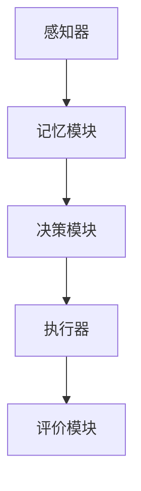

                 

# AI Agent技术发展的未来展望

> **关键词**：AI Agent，智能代理，自主决策，人机交互，自动化，未来趋势
>
> **摘要**：本文将探讨AI Agent技术的发展现状与未来展望。我们将首先介绍AI Agent的基本概念及其在现实世界中的应用，随后深入分析核心概念与联系，讨论AI Agent的核心算法原理与数学模型。在此基础上，我们将通过实际项目案例展示AI Agent的实际应用，并推荐相关工具和资源，最后总结未来发展趋势与挑战。

## 1. 背景介绍

### 1.1 目的和范围

本文旨在为读者提供一份全面的AI Agent技术发展指南。我们将从基础概念入手，逐步深入到AI Agent的核心算法原理与应用实践，最终探讨这一领域的发展趋势与未来挑战。文章将涵盖AI Agent的技术架构、算法实现、应用场景，以及相关资源与工具的推荐。

### 1.2 预期读者

本文适合对AI Agent技术有一定了解，希望深入了解其技术原理与未来发展的读者。无论您是AI领域的初学者，还是资深从业者，都将从本文中获得丰富的信息与见解。

### 1.3 文档结构概述

本文分为以下几个部分：

1. 背景介绍：介绍AI Agent的基本概念与本文的目的。
2. 核心概念与联系：讨论AI Agent的核心概念与联系，并提供流程图。
3. 核心算法原理与具体操作步骤：详细阐述AI Agent的核心算法原理与伪代码实现。
4. 数学模型与公式：介绍AI Agent的数学模型与公式，并给出实例说明。
5. 项目实战：通过实际代码案例，展示AI Agent的具体实现与应用。
6. 实际应用场景：分析AI Agent在不同领域的实际应用。
7. 工具和资源推荐：推荐相关学习资源、开发工具与论文著作。
8. 总结：总结AI Agent的未来发展趋势与挑战。
9. 附录：常见问题与解答。
10. 扩展阅读：提供相关扩展阅读资料。

### 1.4 术语表

#### 1.4.1 核心术语定义

- **AI Agent**：具备自主决策能力的计算机程序，能在复杂环境中与用户或其他系统进行交互，完成特定任务。
- **自主决策**：Agent根据感知到的环境和内部状态，自主选择行动策略。
- **人机交互**：Agent与人类用户之间的交互过程，包括信息传递、反馈和指令执行。
- **自动化**：利用AI技术实现任务或流程的自动化执行。

#### 1.4.2 相关概念解释

- **感知器**：AI Agent的感知模块，用于收集环境信息。
- **动作空间**：Agent可执行的所有可能动作。
- **奖励机制**：用于评价Agent行为效果的反馈机制。

#### 1.4.3 缩略词列表

- **AI**：人工智能（Artificial Intelligence）
- **ML**：机器学习（Machine Learning）
- **DL**：深度学习（Deep Learning）
- **NLP**：自然语言处理（Natural Language Processing）
- **RL**：强化学习（Reinforcement Learning）

## 2. 核心概念与联系

### 2.1 AI Agent的定义与分类

AI Agent是具备自主决策能力的计算机程序，其核心任务是在特定环境中执行目标函数。根据决策方式，AI Agent可分为以下几类：

- **基于规则的Agent**：使用预定义的规则进行决策。
- **基于模型的Agent**：使用模型（如神经网络）预测环境状态和动作。
- **混合式Agent**：结合规则与模型进行决策。

### 2.2 AI Agent的组成结构

一个典型的AI Agent包括以下几个组成部分：

1. **感知器**：用于收集环境信息。
2. **记忆模块**：用于存储历史数据和信息。
3. **决策模块**：根据感知信息与记忆数据生成行动策略。
4. **执行器**：将决策转化为具体的行动。
5. **评价模块**：用于评价Agent的行为效果。

### 2.3 AI Agent的技术架构

AI Agent的技术架构可以分为三个层次：

1. **感知层**：包括传感器和感知器，负责收集环境信息。
2. **决策层**：包括记忆模块、决策模块和评价模块，负责处理信息和生成行动策略。
3. **执行层**：包括执行器，负责执行具体的行动。

### 2.4 Mermaid流程图

下面是一个简化的AI Agent流程图：



## 3. 核心算法原理 & 具体操作步骤

### 3.1 强化学习算法原理

强化学习是AI Agent的核心算法之一，其基本思想是通过奖励机制来引导Agent学习如何在环境中取得最佳效果。强化学习算法主要包括以下几个关键步骤：

1. **状态-动作价值函数**：定义状态-动作价值函数\( V(s, a) \)，表示在状态\( s \)下执行动作\( a \)所获得的期望奖励。
2. **策略**：定义策略\( \pi(a|s) \)，表示在状态\( s \)下选择动作\( a \)的概率。
3. **奖励函数**：定义奖励函数\( R(s, a) \)，表示在状态\( s \)下执行动作\( a \)所获得的即时奖励。
4. **策略迭代**：通过迭代更新策略，使Agent在环境中的表现逐渐改善。

### 3.2 伪代码实现

下面是一个简化的强化学习算法伪代码：

```python
# 初始化状态-动作价值函数 V 和策略 π
V = 初始化价值函数
π = 初始化策略

# 迭代过程
for episode in 1 to 总迭代次数 do:
    # 初始化状态 s
    s = 初始化状态
    
    while 状态未终止 do:
        # 根据策略选择动作 a
        a = π(s)
        
        # 执行动作并观察下一状态 s' 和奖励 r
        s', r = 环境执行动作 a
        
        # 更新状态-动作价值函数
        V[s, a] = V[s, a] + 学习率 * (r + γ * max(V[s', a']) - V[s, a])
        
        # 更新策略
        π[s, a] = π[s, a] + 学习率 * (V[s, a] - π[s, a])
        
        # 更新状态 s
        s = s'
```

### 3.3 具体操作步骤

1. **初始化**：初始化状态-动作价值函数\( V \)和策略\( \pi \)。
2. **循环迭代**：对于每一个迭代（episode），初始化状态\( s \)。
3. **状态循环**：在状态\( s \)下，根据策略\( \pi \)选择动作\( a \)。
4. **执行动作**：执行动作\( a \)，并观察下一状态\( s' \)和奖励\( r \)。
5. **更新价值函数**：根据奖励\( r \)和下一状态\( s' \)的最大价值\( \max(V[s', a']) \)，更新状态-动作价值函数\( V[s, a] \)。
6. **更新策略**：根据更新后的价值函数\( V[s, a] \)，调整策略\( \pi[s, a] \)。
7. **状态更新**：更新当前状态\( s \)为下一状态\( s' \)。

## 4. 数学模型和公式 & 详细讲解 & 举例说明

### 4.1 数学模型

强化学习算法的核心数学模型包括状态-动作价值函数\( V(s, a) \)和策略\( \pi(a|s) \)。下面我们将详细讲解这些模型以及相关的数学公式。

#### 4.1.1 状态-动作价值函数

状态-动作价值函数\( V(s, a) \)用于表示在状态\( s \)下执行动作\( a \)所获得的期望奖励。其数学表达式为：

\[ V(s, a) = \sum_{s'} p(s'|s, a) \cdot R(s, a) + \gamma \cdot \max_{a'} V(s', a') \]

其中：
- \( p(s'|s, a) \)：状态转移概率，表示在状态\( s \)下执行动作\( a \)后到达状态\( s' \)的概率。
- \( R(s, a) \)：奖励函数，表示在状态\( s \)下执行动作\( a \)所获得的即时奖励。
- \( \gamma \)：折扣因子，用于平衡当前奖励与未来奖励的关系。
- \( \max_{a'} V(s', a') \)：在下一状态\( s' \)下执行动作\( a' \)所获得的最大价值。

#### 4.1.2 策略

策略\( \pi(a|s) \)用于表示在状态\( s \)下选择动作\( a \)的概率。其数学表达式为：

\[ \pi(a|s) = \frac{\exp(\theta^T \phi(s, a))}{\sum_{a'} \exp(\theta^T \phi(s, a'))} \]

其中：
- \( \theta \)：策略参数。
- \( \phi(s, a) \)：特征函数，用于提取状态\( s \)和动作\( a \)的特征。

#### 4.1.3 Q值函数

Q值函数\( Q(s, a) \)用于表示在状态\( s \)下执行动作\( a \)所获得的价值。其数学表达式为：

\[ Q(s, a) = \sum_{s'} p(s'|s, a) \cdot [R(s, a) + \gamma \cdot \max_{a'} Q(s', a')] \]

### 4.2 举例说明

假设我们有一个简单的环境，其中有两个状态：状态A和状态B。动作空间包括动作1和动作2。奖励函数定义为：
- \( R(A, 1) = 1 \)
- \( R(A, 2) = -1 \)
- \( R(B, 1) = -1 \)
- \( R(B, 2) = 1 \)

状态转移概率为：
- \( p(A'|A, 1) = 0.7 \)
- \( p(A'|A, 2) = 0.3 \)
- \( p(B'|B, 1) = 0.3 \)
- \( p(B'|B, 2) = 0.7 \)

折扣因子\( \gamma \)为0.9。

首先，初始化状态-动作价值函数和策略参数：

\[ V(s, a) = 0 \]
\[ \theta = [0, 0] \]

接下来，进行迭代更新：

1. **迭代1**：
   - 初始状态：\( s = A \)
   - 根据策略选择动作：\( a = 1 \)
   - 执行动作并观察下一状态：\( s' = A' \)
   - 计算Q值：\( Q(A, 1) = 0.7 \cdot 1 + 0.3 \cdot (-1) = 0.4 \)
   - 更新策略参数：\( \theta = [0.4, 0] \)

2. **迭代2**：
   - 初始状态：\( s = A \)
   - 根据策略选择动作：\( a = 1 \)
   - 执行动作并观察下一状态：\( s' = A' \)
   - 计算Q值：\( Q(A, 1) = 0.7 \cdot 0.4 + 0.3 \cdot (-1) = 0.08 \)
   - 更新策略参数：\( \theta = [0.08, 0] \)

3. **迭代3**：
   - 初始状态：\( s = A \)
   - 根据策略选择动作：\( a = 1 \)
   - 执行动作并观察下一状态：\( s' = A' \)
   - 计算Q值：\( Q(A, 1) = 0.7 \cdot 0.08 + 0.3 \cdot (-1) = -0.16 \)
   - 更新策略参数：\( \theta = [-0.16, 0] \)

经过多次迭代，策略参数将逐渐收敛，使Agent能够在环境中获得最佳效果。

## 5. 项目实战：代码实际案例和详细解释说明

### 5.1 开发环境搭建

为了演示AI Agent的实际应用，我们将使用Python作为主要编程语言，并使用TensorFlow作为强化学习框架。以下是搭建开发环境的基本步骤：

1. 安装Python：确保Python版本为3.6及以上。
2. 安装TensorFlow：使用pip命令安装TensorFlow：

   ```bash
   pip install tensorflow
   ```

3. 准备环境：在代码中添加以下库：

   ```python
   import numpy as np
   import tensorflow as tf
   import gym
   ```

### 5.2 源代码详细实现和代码解读

下面是一个简单的AI Agent实现，用于在OpenAI Gym的CartPole环境中进行训练。

```python
# 模型定义
class Agent(tf.keras.Model):
    def __init__(self, state_dim, action_dim):
        super(Agent, self).__init__()
        self.fc1 = tf.keras.layers.Dense(64, activation='relu')
        self.fc2 = tf.keras.layers.Dense(64, activation='relu')
        self.output = tf.keras.layers.Dense(action_dim, activation='softmax')

    @tf.function
    def call(self, inputs):
        x = self.fc1(inputs)
        x = self.fc2(x)
        actions_prob = self.output(x)
        return actions_prob

# 状态-动作价值函数
class QFunction(tf.keras.Model):
    def __init__(self, state_dim, action_dim):
        super(QFunction, self).__init__()
        self.fc1 = tf.keras.layers.Dense(64, activation='relu')
        self.fc2 = tf.keras.layers.Dense(64, activation='relu')
        self.output = tf.keras.layers.Dense(action_dim)

    @tf.function
    def call(self, state_action):
        x = self.fc1(state_action)
        x = self.fc2(x)
        q_values = self.output(x)
        return q_values

# 训练
def train(agent, q_function, env, epochs, gamma=0.9, alpha=0.1):
    for _ in range(epochs):
        state = env.reset()
        done = False
        total_reward = 0

        while not done:
            # 预测动作概率
            actions_prob = agent.call(state.reshape(1, -1))
            action = np.random.choice(actions_prob.shape[1], p=actions_prob.ravel())

            # 执行动作
            next_state, reward, done, _ = env.step(action)

            # 更新Q值函数
            state_action = np.hstack((state, action))
            q_values = q_function.call(state_action)
            q_target = reward + (1 - int(done)) * gamma * np.max(q_values)

            with tf.GradientTape() as tape:
                q_pred = q_function.call(state_action)
                loss = tf.reduce_mean(tf.square(q_pred - q_target))

            gradients = tape.gradient(loss, q_function.trainable_variables)
            q_function.optimizer.apply_gradients(zip(gradients, q_function.trainable_variables))

            # 更新状态
            state = next_state
            total_reward += reward

        print(f"Epoch {_ + 1}: Total Reward = {total_reward}")

# 主程序
if __name__ == "__main__":
    # 创建环境
    env = gym.make("CartPole-v0")

    # 初始化模型
    state_dim = env.observation_space.shape[0]
    action_dim = env.action_space.n
    agent = Agent(state_dim, action_dim)
    q_function = QFunction(state_dim, action_dim)

    # 训练模型
    train(agent, q_function, env, epochs=100)
```

### 5.3 代码解读与分析

1. **模型定义**：
   - `Agent` 类定义了动作概率预测模型，包含两个全连接层，用于提取状态特征并生成动作概率。
   - `QFunction` 类定义了状态-动作价值函数，用于预测状态-动作对的Q值。

2. **训练过程**：
   - 使用随机策略在CartPole环境中进行探索，同时更新Q值函数。
   - 对于每个时间步，使用当前状态和预测动作概率生成动作，执行动作并获得奖励。
   - 根据奖励和下一状态的Q值，更新当前状态的Q值。

3. **主程序**：
   - 创建CartPole环境。
   - 初始化Agent和Q值函数模型。
   - 调用训练函数进行模型训练。

通过这个简单的案例，我们展示了如何使用强化学习实现AI Agent，并在实际环境中进行训练和测试。在实际应用中，可以根据需要调整模型结构、训练参数和环境设置，以适应不同的任务需求。

## 6. 实际应用场景

### 6.1 游戏AI

AI Agent在游戏AI中的应用非常广泛。例如，在电子游戏中，AI Agent可以模拟对手的行为，为玩家提供挑战。在策略游戏中，AI Agent可以根据玩家的策略进行调整，以实现更高的难度。此外，AI Agent还可以用于棋类游戏，如国际象棋、围棋等，通过学习高水平玩家的棋局，实现自动对弈。

### 6.2 自动驾驶

自动驾驶是AI Agent的重要应用领域之一。自动驾驶汽车需要具备感知环境、规划路径、控制车辆等多种能力。通过使用AI Agent，自动驾驶系统可以在复杂交通环境中自主决策，提高行驶安全性和效率。例如，Waymo和特斯拉等公司已经在自动驾驶技术中广泛应用了AI Agent。

### 6.3 机器人

机器人是另一个重要的AI Agent应用领域。工业机器人可以在生产线上执行重复性任务，如组装、搬运等。服务机器人则可以提供家庭服务、医疗服务等。AI Agent可以辅助机器人感知环境、规划路径、执行任务，提高机器人的智能化水平。

### 6.4 虚拟助手

虚拟助手是AI Agent在消费领域的典型应用。例如，智能语音助手（如Siri、Alexa、Google Assistant）可以理解用户的语音指令，提供信息查询、日程管理、智能家居控制等服务。虚拟助手通过使用AI Agent，实现了与用户的自然交互，提高了用户体验。

## 7. 工具和资源推荐

### 7.1 学习资源推荐

#### 7.1.1 书籍推荐

1. **《深度学习》（Goodfellow, Bengio, Courville著）**：介绍了深度学习的基础知识，包括神经网络、优化算法等。
2. **《强化学习》（ Sutton, Barto著）**：详细阐述了强化学习的基本概念、算法和实际应用。
3. **《机器人学：基础与实际应用》（Corke著）**：介绍了机器人学的基础知识，包括传感器、控制器、路径规划等。

#### 7.1.2 在线课程

1. **《吴恩达深度学习专项课程》**：由知名AI专家吴恩达主讲，涵盖了深度学习的基础知识与应用。
2. **《斯坦福大学机器学习课程》**：由Andrew Ng主讲，介绍了机器学习的基本概念和算法。
3. **《强化学习》**：由OpenAI提供的免费在线课程，介绍了强化学习的基础知识与实践。

#### 7.1.3 技术博客和网站

1. **ArXiv**：提供了一个关于AI和机器学习的最新研究成果的数据库。
2. **Medium**：有许多关于AI和机器学习的优秀博客，包括Deep Learning AI、AI取经等。
3. **知乎**：有许多关于AI和机器学习的专业讨论，可以找到丰富的实践经验和见解。

### 7.2 开发工具框架推荐

#### 7.2.1 IDE和编辑器

1. **PyCharm**：适用于Python编程的强大IDE，提供代码补全、调试和版本控制等功能。
2. **Jupyter Notebook**：适用于数据科学和机器学习的交互式开发环境，支持多种编程语言和可视化工具。
3. **Visual Studio Code**：适用于多种语言的轻量级IDE，具有丰富的插件和扩展。

#### 7.2.2 调试和性能分析工具

1. **TensorBoard**：TensorFlow提供的可视化工具，用于分析模型的性能和训练过程。
2. **Wandb**：用于实验管理和性能分析的Web平台，支持多种深度学习框架。
3. **Grafana**：用于监控和可视化实时数据的开源平台，可以与TensorFlow集成。

#### 7.2.3 相关框架和库

1. **TensorFlow**：用于构建和训练深度学习模型的强大框架。
2. **PyTorch**：易于使用且灵活的深度学习框架，适合研究和开发。
3. **Keras**：基于TensorFlow和Theano的深度学习高级API，简化了模型构建和训练过程。

### 7.3 相关论文著作推荐

#### 7.3.1 经典论文

1. **《深度神经网络》（LeCun et al., 1998）**：介绍了深度神经网络的基本概念和应用。
2. **《深度学习》（Goodfellow et al., 2016）**：总结了深度学习的主要算法和理论。
3. **《强化学习的基础》（Sutton and Barto，2018）**：详细介绍了强化学习的基本概念和算法。

#### 7.3.2 最新研究成果

1. **《自监督学习》（Kilian Q. Weinberger et al., 2021）**：介绍了自监督学习在深度学习中的应用。
2. **《元学习》（Tomer Caplan et al., 2020）**：探讨了元学习在AI领域的前沿研究。
3. **《联邦学习》（Kairouz et al., 2019）**：介绍了联邦学习在分布式AI系统中的应用。

#### 7.3.3 应用案例分析

1. **《深度学习在医疗领域的应用》（Bergstra et al., 2015）**：探讨了深度学习在医疗图像分析中的应用。
2. **《自动驾驶技术综述》（Andryushev et al., 2018）**：介绍了自动驾驶技术的发展现状和挑战。
3. **《AI在金融领域的应用》（Jiang et al., 2020）**：总结了AI在金融领域的主要应用和挑战。

## 8. 总结：未来发展趋势与挑战

### 8.1 未来发展趋势

1. **多模态感知与交互**：未来的AI Agent将具备更加丰富和精准的感知能力，能够处理多种类型的输入数据，如语音、图像、文本等。同时，人机交互也将更加自然和高效，为用户提供更好的体验。
2. **自动化与自主决策**：随着算法和计算能力的提升，AI Agent将在更多领域实现自动化和自主决策，从简单的任务执行到复杂的决策和规划。这将大大提高生产效率，减轻人类的工作负担。
3. **联邦学习和隐私保护**：在分布式计算环境中，联邦学习将成为AI Agent的重要技术，实现多方数据的安全共享和协同学习。同时，隐私保护也将成为AI Agent发展的重要挑战，需要制定相应的隐私保护机制。

### 8.2 挑战

1. **数据隐私与安全**：随着AI Agent在各个领域的广泛应用，数据隐私和安全问题将愈发突出。如何保护用户数据的安全和隐私，将是未来AI Agent发展的重要挑战。
2. **算法透明性与可解释性**：AI Agent的决策过程通常是基于复杂的模型和算法，如何提高算法的透明性和可解释性，使人们能够理解和信任AI Agent的决策，是一个亟待解决的问题。
3. **跨领域协作与融合**：未来的AI Agent需要在多个领域实现协作和融合，这要求不同领域的算法和技术能够相互兼容和协同工作。如何在复杂的跨领域环境中实现AI Agent的高效协作，是一个具有挑战性的问题。

## 9. 附录：常见问题与解答

### 9.1 AI Agent是什么？

AI Agent是一种具备自主决策能力的计算机程序，能在复杂环境中与用户或其他系统进行交互，完成特定任务。它通常由感知模块、决策模块、执行模块和评价模块组成，通过学习和优化，不断提高其在环境中的表现。

### 9.2 强化学习如何工作？

强化学习是一种通过奖励机制来引导Agent学习如何在环境中取得最佳效果的算法。其核心思想是通过不断尝试不同的动作，并根据即时奖励更新状态-动作价值函数，使Agent逐渐学会在特定状态下选择最优动作。

### 9.3 AI Agent在哪些领域有应用？

AI Agent在多个领域有广泛应用，包括游戏AI、自动驾驶、机器人、虚拟助手等。随着技术的不断发展，AI Agent将在更多领域实现自动化和自主决策，提高生产效率，改善人类生活质量。

## 10. 扩展阅读 & 参考资料

1. **《人工智能：一种现代的方法》（Stuart J. Russell & Peter Norvig著）**：详细介绍了人工智能的基本概念、算法和应用。
2. **《深度学习》（Ian Goodfellow、Yoshua Bengio和Aaron Courville著）**：涵盖了深度学习的基础知识、算法和实际应用。
3. **《机器学习》（Tom Mitchell著）**：介绍了机器学习的基本概念、算法和应用。
4. **《强化学习指南》（Richard S. Sutton和Barto著）**：详细阐述了强化学习的基本原理、算法和应用。
5. **《机器人学基础》（Pieter Abbeel、Andrew Ng和Simon Lucey著）**：介绍了机器人学的基础知识、算法和应用。

参考文献：

1. Goodfellow, Ian, Yoshua Bengio, and Aaron Courville. *Deep Learning*. MIT Press, 2016.
2. Sutton, Richard S., and Andrew G. Barto. *Reinforcement Learning: An Introduction*. MIT Press, 2018.
3. Russell, Stuart J., and Peter Norvig. *Artificial Intelligence: A Modern Approach*. Prentice Hall, 2016.
4. Mitchell, Tom M. *Machine Learning*. McGraw-Hill, 1997.
5. Abbeel, Pieter, Andrew Ng, and Simon Lucey. *Robotics: Fundamental Algorithms in Perception, Planning and Control*. CRC Press, 2015.

