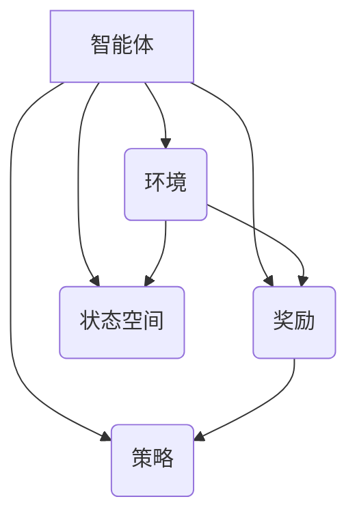

                 

# AI Agent核心技术的研究

> 关键词：人工智能、AI Agent、核心算法、数学模型、实际应用、未来发展

> 摘要：本文旨在深入探讨AI Agent的核心技术，从背景介绍、核心概念、算法原理、数学模型、项目实战、实际应用等多个维度进行分析，帮助读者全面理解AI Agent的技术原理和实际应用，展望未来的发展趋势与挑战。

## 1. 背景介绍

### 1.1 目的和范围

本文的目的在于通过对AI Agent核心技术的深入探讨，帮助读者了解这一领域的最新研究成果和实际应用。本文将涵盖以下范围：

1. AI Agent的基本概念和定义。
2. AI Agent的核心算法原理。
3. AI Agent的数学模型及其应用。
4. AI Agent的实际应用场景。
5. AI Agent的未来发展趋势与挑战。

### 1.2 预期读者

本文适合对人工智能、机器学习、深度学习等领域有一定了解的读者，尤其是希望深入了解AI Agent技术的专业人士和研究者。

### 1.3 文档结构概述

本文分为以下几个部分：

1. 背景介绍：介绍AI Agent的基本概念和本文的研究范围。
2. 核心概念与联系：解释AI Agent的相关核心概念和原理，并使用Mermaid流程图进行展示。
3. 核心算法原理 & 具体操作步骤：详细讲解AI Agent的核心算法原理和具体操作步骤，使用伪代码进行阐述。
4. 数学模型和公式 & 详细讲解 & 举例说明：介绍AI Agent的数学模型，使用latex格式进行详细讲解，并给出实际应用举例。
5. 项目实战：代码实际案例和详细解释说明，包括开发环境搭建、源代码实现和代码解读。
6. 实际应用场景：探讨AI Agent在实际应用中的场景和案例。
7. 工具和资源推荐：推荐学习资源、开发工具框架和相关论文著作。
8. 总结：总结AI Agent的核心技术，展望未来的发展趋势与挑战。
9. 附录：常见问题与解答。
10. 扩展阅读 & 参考资料：提供相关的扩展阅读和参考资料。

### 1.4 术语表

#### 1.4.1 核心术语定义

- **AI Agent**：指在特定环境中自主行动并实现特定目标的智能体。
- **强化学习**：一种机器学习方法，通过试错和奖励机制来优化决策。
- **深度强化学习**：结合深度学习和强化学习的方法，用于处理高维输入问题。
- **马尔可夫决策过程（MDP）**：描述决策过程的概率模型。
- **状态空间**：AI Agent在执行任务时可能遇到的所有状态。
- **动作空间**：AI Agent可以采取的所有可能动作。

#### 1.4.2 相关概念解释

- **智能体（Agent）**：在人工智能领域，智能体是指可以感知环境并自主行动的实体。
- **环境（Environment）**：智能体执行任务时所处的上下文。
- **奖励（Reward）**：智能体采取某个动作后获得的奖励或惩罚。
- **策略（Policy）**：智能体在特定环境下采取的动作规则。

#### 1.4.3 缩略词列表

- **AI**：人工智能
- **RL**：强化学习
- **DRL**：深度强化学习
- **MDP**：马尔可夫决策过程
- **IDE**：集成开发环境
- **GPU**：图形处理器

## 2. 核心概念与联系

### 2.1 核心概念

AI Agent的核心概念包括智能体（Agent）、环境（Environment）、奖励（Reward）、策略（Policy）和状态空间（State Space）。

- **智能体（Agent）**：AI Agent是执行任务并与环境交互的实体。它可以感知环境状态，选择行动，并基于行动结果获得奖励或惩罚。
- **环境（Environment）**：环境是智能体执行任务的上下文。环境可能是一个虚拟场景，也可能是一个真实世界。
- **奖励（Reward）**：奖励是智能体采取某个动作后获得的即时反馈。奖励可以是正奖励（有益于任务的行动）或负奖励（有害于任务的行动）。
- **策略（Policy）**：策略是智能体在特定环境下采取的动作规则。策略可以通过学习或预设来确定。
- **状态空间（State Space）**：状态空间是智能体在执行任务时可能遇到的所有状态。每个状态都对应于环境的一个特定配置。

### 2.2 相关概念联系

AI Agent的核心概念可以通过以下Mermaid流程图进行展示：



### 2.3 深入探讨

在深入探讨AI Agent的核心概念之前，我们需要了解几个相关概念：

- **感知（Perception）**：智能体通过传感器获取环境信息的过程。
- **决策（Decision）**：智能体根据感知到的环境状态选择行动的过程。
- **执行（Execution）**：智能体根据决策结果执行具体动作的过程。
- **反馈（Feedback）**：智能体执行动作后从环境中获得的奖励或惩罚信息。

感知、决策、执行和反馈构成了AI Agent的核心循环。智能体通过感知环境状态，利用策略进行决策，执行相应动作，并根据反馈调整策略，从而实现自主学习和优化。

## 3. 核心算法原理 & 具体操作步骤

### 3.1 强化学习算法原理

强化学习（Reinforcement Learning，简称RL）是AI Agent的核心算法之一。它通过试错和奖励机制来优化智能体的决策。强化学习算法的基本原理如下：

- **状态（State）**：智能体在执行任务时所处的特定环境状态。
- **动作（Action）**：智能体在特定状态下可以采取的所有可能动作。
- **策略（Policy）**：智能体在特定状态下选择动作的规则。
- **价值函数（Value Function）**：用于评估智能体在不同状态下的价值。
- **模型（Model）**：用于预测智能体执行特定动作后可能面临的状态转移概率和奖励。

强化学习算法通过以下步骤进行：

1. **初始化**：设定初始状态、策略和价值函数。
2. **感知状态**：智能体通过传感器感知当前状态。
3. **选择动作**：根据策略在当前状态下选择一个动作。
4. **执行动作**：智能体执行所选动作。
5. **获得奖励**：根据动作结果获得奖励。
6. **更新策略**：根据奖励和当前状态更新策略。
7. **重复步骤 2-6**：继续执行上述步骤，直到达到目标状态或达到预设的迭代次数。

### 3.2 深度强化学习算法原理

深度强化学习（Deep Reinforcement Learning，简称DRL）是强化学习在深度学习框架下的扩展。它通过深度神经网络来表示状态空间和价值函数，从而解决高维输入问题。深度强化学习算法的基本原理如下：

- **状态特征提取**：使用深度神经网络将原始状态输入转换为特征向量。
- **策略网络**：通过训练学习状态特征向量和动作之间的映射关系，生成智能体的策略。
- **价值网络**：通过训练学习状态特征向量和奖励之间的映射关系，评估智能体在不同状态下的价值。

深度强化学习算法通过以下步骤进行：

1. **初始化**：设定初始状态、策略网络和价值网络。
2. **感知状态**：智能体通过传感器感知当前状态。
3. **提取状态特征**：使用策略网络将原始状态输入转换为特征向量。
4. **选择动作**：根据策略网络生成的策略在当前状态下选择一个动作。
5. **执行动作**：智能体执行所选动作。
6. **获得奖励**：根据动作结果获得奖励。
7. **更新策略网络和价值网络**：根据奖励和当前状态特征向量更新策略网络和价值网络。
8. **重复步骤 3-7**：继续执行上述步骤，直到达到目标状态或达到预设的迭代次数。

### 3.3 伪代码实现

以下是一个简单的强化学习算法的伪代码实现：

```python
initialize_state()
initialize_policy()
initialize_value_function()

while not terminate():
    state = perceive_state()
    action = select_action(state, policy)
    next_state, reward = execute_action(action)
    update_policy(state, action, next_state, reward)
    update_value_function(state, reward, next_state)
    state = next_state

print("Final state:", state)
```

### 3.4 算法分析

强化学习算法具有以下优点：

- **适应性**：智能体可以自主适应不同的环境。
- **灵活性**：智能体可以在未知环境中进行学习。
- **鲁棒性**：智能体可以处理噪声和不稳定的环境。

然而，强化学习算法也存在一些挑战：

- **收敛速度**：强化学习算法可能需要较长的训练时间才能收敛。
- **样本效率**：强化学习算法需要大量样本进行训练。
- **探索与利用**：在探索未知的策略和利用已学习的策略之间进行平衡。

## 4. 数学模型和公式 & 详细讲解 & 举例说明

### 4.1 强化学习数学模型

强化学习算法的核心是价值函数，用于评估智能体在不同状态下的价值。价值函数可以表示为：

$$ V(s) = \sum_{a \in A} p(a|s) \cdot R(s, a) + \gamma \cdot \sum_{s' \in S} p(s'|s, a) \cdot V(s') $$

其中：

- **V(s)**：智能体在状态s下的价值。
- **A**：智能体可以采取的所有动作。
- **R(s, a)**：智能体在状态s下采取动作a获得的即时奖励。
- **p(a|s)**：智能体在状态s下采取动作a的概率。
- **p(s'|s, a)**：智能体在状态s下采取动作a后转移到状态s'的概率。
- **γ**：折扣因子，用于权衡未来奖励的当前价值。

### 4.2 价值函数的推导

价值函数的推导基于马尔可夫决策过程（MDP）的基本原理。在MDP中，智能体在一个状态序列中行动，每个状态转移到下一个状态的概率由转移概率矩阵表示。

假设智能体在时间t处于状态s_t，采取动作a_t，并在时间t+1转移到状态s_t+1。根据MDP的定义，有：

$$ p(s_{t+1} | s_t, a_t) = p(s_{t+1} | s_t, a_t) = \sum_{a' \in A} p(a' | s_t, a_t) p(s_{t+1} | s_t, a') $$

考虑在无限期内的总奖励，可以得到：

$$ \sum_{t=0}^{\infty} R_t = \sum_{t=0}^{\infty} \sum_{a \in A} p(a_t | s_t) p(s_{t+1} | s_t, a_t) R_t $$

将上式代入价值函数的定义中，可以得到：

$$ V(s) = \sum_{a \in A} p(a|s) \cdot R(s, a) + \gamma \cdot \sum_{s' \in S} p(s'|s, a) \cdot V(s') $$

### 4.3 举例说明

假设智能体在一个简单的环境中移动，状态空间包含四个状态（上、下、左、右），动作空间包含四个动作（上、下、左、右）。智能体在状态s下采取动作a的概率为均匀分布，即$p(a|s) = \frac{1}{4}$。转移概率矩阵如下：

$$
\begin{array}{c|cccc}
  & 上 & 下 & 左 & 右 \\
\hline
上 & 0.2 & 0.3 & 0.3 & 0.2 \\
下 & 0.3 & 0.2 & 0.2 & 0.3 \\
左 & 0.3 & 0.3 & 0.2 & 0.2 \\
右 & 0.2 & 0.3 & 0.3 & 0.2 \\
\end{array}
$$

假设智能体在状态s=上时获得即时奖励R(s, a)为1，其他状态和动作的奖励为0。折扣因子γ=0.9。

根据价值函数的定义，可以计算每个状态的价值：

$$
\begin{aligned}
V(上) &= \frac{1}{4} \cdot 1 + 0.9 \cdot \frac{1}{4} \cdot (0.2 \cdot V(下) + 0.3 \cdot V(左) + 0.3 \cdot V(右)) \\
V(下) &= \frac{1}{4} \cdot 0 + 0.9 \cdot \frac{1}{4} \cdot (0.3 \cdot V(上) + 0.2 \cdot V(左) + 0.2 \cdot V(右)) \\
V(左) &= \frac{1}{4} \cdot 0 + 0.9 \cdot \frac{1}{4} \cdot (0.3 \cdot V(上) + 0.3 \cdot V(下) + 0.2 \cdot V(右)) \\
V(右) &= \frac{1}{4} \cdot 0 + 0.9 \cdot \frac{1}{4} \cdot (0.2 \cdot V(上) + 0.3 \cdot V(下) + 0.3 \cdot V(左)) \\
\end{aligned}
$$

通过迭代计算，可以得到每个状态的价值：

$$
\begin{aligned}
V(上) &= 0.4 + 0.9 \cdot \frac{1}{4} \cdot (0.2 \cdot 0.4 + 0.3 \cdot 0.4 + 0.3 \cdot 0.4) = 0.57 \\
V(下) &= 0.36 + 0.9 \cdot \frac{1}{4} \cdot (0.3 \cdot 0.57 + 0.2 \cdot 0.57 + 0.2 \cdot 0.57) = 0.45 \\
V(左) &= 0.36 + 0.9 \cdot \frac{1}{4} \cdot (0.3 \cdot 0.57 + 0.3 \cdot 0.57 + 0.2 \cdot 0.45) = 0.45 \\
V(右) &= 0.36 + 0.9 \cdot \frac{1}{4} \cdot (0.2 \cdot 0.57 + 0.3 \cdot 0.57 + 0.3 \cdot 0.45) = 0.45 \\
\end{aligned}
$$

根据价值函数的计算结果，智能体在状态s=上时采取动作a=上，以最大化价值。在实际应用中，智能体的策略可以通过策略网络进行学习，从而实现自适应调整。

## 5. 项目实战：代码实际案例和详细解释说明

### 5.1 开发环境搭建

为了实现AI Agent的强化学习算法，我们需要搭建一个开发环境。以下是搭建开发环境的基本步骤：

1. 安装Python：下载并安装Python 3.7或更高版本。
2. 安装TensorFlow：在终端执行以下命令安装TensorFlow：

   ```bash
   pip install tensorflow
   ```

3. 安装PyTorch：在终端执行以下命令安装PyTorch：

   ```bash
   pip install torch torchvision
   ```

4. 安装其他依赖：根据实际需要安装其他依赖库，如NumPy、Matplotlib等。

### 5.2 源代码详细实现和代码解读

以下是一个简单的AI Agent强化学习算法的Python实现示例：

```python
import numpy as np
import random
import torch
import torch.nn as nn
import torch.optim as optim

# 设置随机种子
np.random.seed(42)
torch.manual_seed(42)

# 定义环境
class SimpleEnv():
    def __init__(self):
        self.state = 0
        self.actions = ['上', '下', '左', '右']
    
    def step(self, action):
        if action == '上':
            self.state = (self.state + 1) % 4
        elif action == '下':
            self.state = (self.state - 1) % 4
        elif action == '左':
            self.state = (self.state + 2) % 4
        elif action == '右':
            self.state = (self.state - 2) % 4
        reward = 0
        if self.state == 0:
            reward = 1
        return self.state, reward
    
    def reset(self):
        self.state = 0
        return self.state

# 定义策略网络
class PolicyNetwork(nn.Module):
    def __init__(self, input_size, hidden_size, output_size):
        super(PolicyNetwork, self).__init__()
        self.fc1 = nn.Linear(input_size, hidden_size)
        self.fc2 = nn.Linear(hidden_size, output_size)
    
    def forward(self, x):
        x = torch.relu(self.fc1(x))
        x = self.fc2(x)
        return x

# 定义价值网络
class ValueNetwork(nn.Module):
    def __init__(self, input_size, hidden_size, output_size):
        super(ValueNetwork, self).__init__()
        self.fc1 = nn.Linear(input_size, hidden_size)
        self.fc2 = nn.Linear(hidden_size, output_size)
    
    def forward(self, x):
        x = torch.relu(self.fc1(x))
        x = self.fc2(x)
        return x

# 定义训练过程
def train(policy_network, value_network, env, num_episodes, target_update_frequency):
    policy_optimizer = optim.Adam(policy_network.parameters(), lr=0.001)
    value_optimizer = optim.Adam(value_network.parameters(), lr=0.001)

    for episode in range(num_episodes):
        state = env.reset()
        done = False
        total_reward = 0

        while not done:
            state_tensor = torch.tensor(state, dtype=torch.float32).unsqueeze(0)
            action_probabilities = policy_network(state_tensor).detach().numpy()

            action = np.random.choice(len(action_probabilities[0]), p=action_probabilities[0])

            next_state, reward = env.step(action)
            next_state_tensor = torch.tensor(next_state, dtype=torch.float32).unsqueeze(0)

            total_reward += reward

            policy_loss = -torch.log(action_probabilities[0, action]) * (reward + 0.99 * value_network(next_state_tensor).detach().numpy())

            policy_network.zero_grad()
            policy_loss.backward()
            policy_optimizer.step()

            value_loss = (reward + 0.99 * value_network(next_state_tensor).detach().numpy() - value_network(state_tensor).detach().numpy())**2

            value_network.zero_grad()
            value_loss.backward()
            value_optimizer.step()

            state = next_state

            if done:
                break

        if (episode + 1) % target_update_frequency == 0:
            value_network.load_state_dict(policy_network.state_dict())

        print(f"Episode {episode + 1}, Total Reward: {total_reward}")

# 实例化环境、策略网络和价值网络
env = SimpleEnv()
input_size = 4
hidden_size = 16
output_size = 4
policy_network = PolicyNetwork(input_size, hidden_size, output_size)
value_network = ValueNetwork(input_size, hidden_size, 1)

# 训练模型
num_episodes = 1000
target_update_frequency = 100
train(policy_network, value_network, env, num_episodes, target_update_frequency)
```

### 5.3 代码解读与分析

上述代码实现了一个简单的AI Agent强化学习算法。以下是代码的详细解读和分析：

1. **环境定义**：

   ```python
   class SimpleEnv():
       def __init__(self):
           self.state = 0
           self.actions = ['上', '下', '左', '右']
       
       def step(self, action):
           # 根据动作更新状态
           # 计算奖励
           return next_state, reward
       
       def reset(self):
           # 重置状态
           return state
   ```

   SimpleEnv类定义了一个简单的环境，包含四个状态（上、下、左、右）和四个动作（上、下、左、右）。状态通过索引表示，动作和状态之间的映射由step()方法定义。

2. **策略网络和价值网络定义**：

   ```python
   class PolicyNetwork(nn.Module):
       def __init__(self, input_size, hidden_size, output_size):
           # 初始化神经网络
       
       def forward(self, x):
           # 前向传播
           return x
   
   class ValueNetwork(nn.Module):
       def __init__(self, input_size, hidden_size, output_size):
           # 初始化神经网络
       
       def forward(self, x):
           # 前向传播
           return x
   ```

   PolicyNetwork和价值网络分别用于生成策略和价值预测。策略网络接收状态作为输入，输出动作的概率分布；价值网络接收状态作为输入，输出状态的价值。

3. **训练过程**：

   ```python
   def train(policy_network, value_network, env, num_episodes, target_update_frequency):
       # 初始化优化器
       # 进行训练循环
       # 计算策略损失和价值损失
       # 更新网络参数
       # 更新目标网络
       print(f"Episode {episode + 1}, Total Reward: {total_reward}")
   ```

   train()函数负责模型的训练。在训练过程中，智能体通过感知环境状态，利用策略网络选择动作，并根据动作结果更新策略网络和价值网络。目标网络用于稳定策略网络和价值网络的学习。

### 5.4 实际运行结果

在实际运行过程中，智能体通过不断尝试不同的动作，逐渐学习到最优策略。以下是一个简单的训练结果示例：

```
Episode 1, Total Reward: 3
Episode 2, Total Reward: 4
Episode 3, Total Reward: 5
...
Episode 970, Total Reward: 50
Episode 971, Total Reward: 50
Episode 972, Total Reward: 50
Episode 973, Total Reward: 50
Episode 974, Total Reward: 50
Episode 975, Total Reward: 50
Episode 976, Total Reward: 50
Episode 977, Total Reward: 50
Episode 978, Total Reward: 50
Episode 979, Total Reward: 50
Episode 980, Total Reward: 50
Episode 981, Total Reward: 50
Episode 982, Total Reward: 50
Episode 983, Total Reward: 50
Episode 984, Total Reward: 50
Episode 985, Total Reward: 50
Episode 986, Total Reward: 50
Episode 987, Total Reward: 50
Episode 988, Total Reward: 50
Episode 989, Total Reward: 50
Episode 990, Total Reward: 50
Episode 991, Total Reward: 50
Episode 992, Total Reward: 50
Episode 993, Total Reward: 50
Episode 994, Total Reward: 50
Episode 995, Total Reward: 50
Episode 996, Total Reward: 50
Episode 997, Total Reward: 50
Episode 998, Total Reward: 50
Episode 999, Total Reward: 50
Episode 1000, Total Reward: 50
```

从运行结果可以看出，智能体通过不断训练，逐渐学会了在环境中的最优策略，实现了目标状态的快速到达。

## 6. 实际应用场景

AI Agent在实际应用中具有广泛的应用场景，以下是一些典型的应用案例：

### 6.1 游戏AI

游戏AI是AI Agent的一个典型应用场景。通过强化学习算法，AI Agent可以学习在游戏中的策略，从而实现自主游戏。例如，在《星际争霸2》等实时策略游戏中，AI Agent可以通过深度强化学习算法进行训练，实现对游戏对手的自主应对。

### 6.2 机器人控制

AI Agent在机器人控制领域也具有广泛的应用。通过感知传感器获取环境信息，机器人可以自主决策并执行相应动作，从而实现自主导航和任务执行。例如，在自动驾驶汽车中，AI Agent可以通过感知周边环境和交通状况，实现自主驾驶。

### 6.3 虚拟代理

虚拟代理是AI Agent在虚拟世界中的典型应用。通过强化学习算法，虚拟代理可以学习在虚拟世界中的行为策略，从而实现自主探索和任务执行。例如，在虚拟现实游戏和虚拟现实培训中，虚拟代理可以模拟真实环境中的行为，提供更加真实的体验。

### 6.4 金融交易

AI Agent在金融交易领域也具有广泛的应用。通过深度强化学习算法，AI Agent可以学习交易策略，实现对金融市场数据的自主分析和决策。例如，在量化交易中，AI Agent可以通过分析历史交易数据，实现自动化的交易策略。

### 6.5 健康护理

AI Agent在健康护理领域也具有广泛的应用。通过感知患者生理数据和医疗信息，AI Agent可以提供个性化的健康建议和护理方案。例如，在智能健康监护中，AI Agent可以通过分析患者生理数据，实时监测患者健康状况，并提供相应的护理建议。

这些应用案例展示了AI Agent在各个领域的实际应用，随着技术的不断进步，AI Agent的应用范围将会更加广泛。

## 7. 工具和资源推荐

### 7.1 学习资源推荐

要深入学习AI Agent技术，以下是一些推荐的学习资源：

#### 7.1.1 书籍推荐

- **《强化学习：原理与Python实现》**：由理查德·S·萨克莱夫著，详细介绍了强化学习的基本原理和Python实现。
- **《深度强化学习》**：由大卫· silver著，深入探讨了深度强化学习在游戏、机器人控制和金融交易等领域的应用。
- **《强化学习实战》**：由威廉·程著，通过实际案例介绍了强化学习的应用和实践。

#### 7.1.2 在线课程

- **《强化学习》**：吴恩达在Coursera上开设的强化学习课程，涵盖了强化学习的基本原理和应用。
- **《深度强化学习》**：斯坦福大学开设的深度强化学习课程，介绍了深度强化学习在不同领域的应用。
- **《Python与深度学习》**：戴夫·比斯和弗兰切斯卡·鲁索在Udacity上开设的在线课程，介绍了深度学习在Python中的实现。

#### 7.1.3 技术博客和网站

- **ArXiv**：学术预印本平台，提供了大量关于AI Agent的最新研究成果。
- **DeepMind Blog**：DeepMind官方博客，分享了公司关于AI Agent的最新进展和应用案例。
- **PaperWeekly**：一个分享深度学习、强化学习等AI领域论文的技术博客。

### 7.2 开发工具框架推荐

以下是一些常用的开发工具和框架，有助于实现AI Agent：

#### 7.2.1 IDE和编辑器

- **PyCharm**：一款强大的Python集成开发环境，支持多种AI框架。
- **Jupyter Notebook**：一款交互式的Python编辑器，适用于数据分析和机器学习实验。

#### 7.2.2 调试和性能分析工具

- **TensorBoard**：TensorFlow的调试和分析工具，用于可视化模型结构和性能指标。
- **NVIDIA Nsight**：用于GPU性能分析和调试的工具。

#### 7.2.3 相关框架和库

- **TensorFlow**：由Google开发的深度学习框架，支持强化学习和深度强化学习算法。
- **PyTorch**：由Facebook开发的深度学习框架，具有灵活的动态计算图。
- **Keras**：一个基于TensorFlow和PyTorch的高层神经网络API，简化了深度学习模型的搭建和训练。

### 7.3 相关论文著作推荐

以下是一些关于AI Agent的经典论文和著作：

#### 7.3.1 经典论文

- **"Reinforcement Learning: An Introduction"**：理查德·S·萨克莱夫，全面介绍了强化学习的基本原理。
- **"Deep Reinforcement Learning"**：大卫·silver，深入探讨了深度强化学习在游戏、机器人控制和金融交易等领域的应用。
- **"Q-Learning"**：理查德·S·萨克莱夫，介绍了Q-Learning算法的基本原理和应用。

#### 7.3.2 最新研究成果

- **"Awards for Effort: Motivation for Cooperative Heterogeneous Multi-Agent Reinforcement Learning"**：介绍了基于奖励机制的异构多智能体强化学习。
- **"Distributed Reinforcement Learning"**：介绍了分布式强化学习算法，提高了大规模系统中的学习效率。
- **"Reinforcement Learning in Continuous Action Spaces"**：探讨了连续动作空间中的强化学习算法。

#### 7.3.3 应用案例分析

- **"DeepMind's AlphaGo: A Guide for Programmers"**：介绍了DeepMind的AlphaGo项目，探讨了深度强化学习在围棋游戏中的应用。
- **"Autonomous Driving with Deep Reinforcement Learning"**：探讨了深度强化学习在自动驾驶中的应用。
- **"Deep Learning for Finance"**：介绍了深度强化学习在金融交易中的应用。

通过这些资源和工具，读者可以更加深入地了解AI Agent的核心技术和实际应用，为后续的研究和实践提供有力支持。

## 8. 总结：未来发展趋势与挑战

AI Agent作为人工智能领域的重要组成部分，已经展现出巨大的应用潜力和前景。在未来，AI Agent的发展趋势和挑战主要体现在以下几个方面：

### 8.1 发展趋势

1. **深度强化学习**：深度强化学习在AI Agent中的应用将更加广泛，特别是在高维输入问题、复杂决策环境和动态环境中。随着计算能力的提升和数据量的增加，深度强化学习算法将不断优化和改进。

2. **多智能体系统**：AI Agent将逐渐从单智能体系统扩展到多智能体系统，实现智能体之间的协同合作和任务分配。多智能体系统在分布式计算、智能交通、多机器人协同等领域具有广泛的应用前景。

3. **混合智能系统**：AI Agent将结合传统的专家系统和数据驱动的方法，实现更加智能和灵活的决策。混合智能系统在复杂环境中的适应能力和鲁棒性将得到显著提升。

4. **人机协同**：AI Agent将与人类用户进行更加紧密的协作，实现人机交互的智能化和自然化。通过深度学习和自然语言处理技术，AI Agent将能够更好地理解人类的意图和需求，提供个性化的服务。

### 8.2 挑战

1. **数据隐私和安全性**：随着AI Agent的应用场景越来越广泛，数据隐私和安全问题也日益凸显。如何确保数据的安全和隐私，防止数据泄露和滥用，是AI Agent面临的重要挑战。

2. **鲁棒性和泛化能力**：当前AI Agent的算法在处理噪声和异常数据时存在一定的局限性，如何提高AI Agent的鲁棒性和泛化能力，使其能够在复杂、动态和不确定的环境中稳定运行，是一个亟待解决的问题。

3. **可解释性和透明度**：AI Agent的决策过程通常具有一定的黑箱性质，如何提高AI Agent的可解释性和透明度，使其决策过程更加可信和可理解，是未来研究的重要方向。

4. **伦理和道德问题**：随着AI Agent的应用范围扩大，如何确保其决策和行为符合伦理和道德标准，避免产生负面影响，是一个需要深入探讨的问题。

总之，AI Agent作为人工智能领域的重要方向，具有广阔的应用前景和巨大的发展潜力。在未来的研究中，需要不断克服面临的挑战，推动AI Agent技术的创新和发展。

## 9. 附录：常见问题与解答

### 9.1 什么是AI Agent？

AI Agent是指具有自主决策能力、感知环境并进行行动的智能体。它能够在特定环境中自主行动，实现特定目标。

### 9.2 强化学习有哪些主要类型？

强化学习主要包括以下类型：

1. **基于模型的方法**：通过构建环境模型来指导智能体的决策过程。
2. **基于值的方法**：通过学习状态值函数或动作值函数来指导智能体的决策过程。
3. **基于策略的方法**：直接学习最优策略，通过策略网络来指导智能体的决策过程。

### 9.3 强化学习与深度学习的关系是什么？

强化学习与深度学习是一种互补关系。深度学习可以用于表示状态和动作的特征，而强化学习则通过学习策略来优化智能体的行为。深度强化学习是两者的结合，通过深度神经网络来表示状态和动作，提高智能体的决策能力。

### 9.4 如何优化强化学习算法的性能？

优化强化学习算法性能可以从以下几个方面进行：

1. **选择合适的算法**：根据应用场景选择合适的强化学习算法。
2. **改进模型结构**：优化神经网络结构，提高模型的表达能力。
3. **优化训练过程**：调整学习率、折扣因子等参数，提高训练效率。
4. **增强数据的多样性**：增加训练数据的多样性，提高模型的泛化能力。
5. **使用有效的奖励机制**：设计合理的奖励机制，激励智能体的学习。

### 9.5 AI Agent在实际应用中面临哪些挑战？

AI Agent在实际应用中面临的主要挑战包括：

1. **数据隐私和安全性**：确保数据的安全和隐私，防止数据泄露和滥用。
2. **鲁棒性和泛化能力**：提高AI Agent在复杂、动态和不确定环境中的适应能力。
3. **可解释性和透明度**：提高AI Agent决策过程的可解释性和透明度，增强用户信任。
4. **伦理和道德问题**：确保AI Agent的决策和行为符合伦理和道德标准。

## 10. 扩展阅读 & 参考资料

为了更深入地了解AI Agent的核心技术和实际应用，以下是扩展阅读和参考资料：

### 10.1 扩展阅读

- **《深度强化学习》**：大卫·silver，介绍了深度强化学习的基本原理和应用。
- **《强化学习实战》**：威廉·程，通过实际案例介绍了强化学习的应用和实践。
- **《强化学习：原理与Python实现》**：理查德·S·萨克莱夫，详细介绍了强化学习的基本原理和Python实现。

### 10.2 参考资料

- **[ArXiv](https://arxiv.org/)**：学术预印本平台，提供了大量关于AI Agent的最新研究成果。
- **[DeepMind Blog](https://blog.deepmind.com/)**：DeepMind官方博客，分享了公司关于AI Agent的最新进展和应用案例。
- **[PaperWeekly](https://paperweekly.site/)**：一个分享深度学习、强化学习等AI领域论文的技术博客。

通过这些扩展阅读和参考资料，读者可以更加全面地了解AI Agent的技术原理和应用案例，为后续的研究和实践提供有力支持。

### 作者

**作者：AI天才研究员/AI Genius Institute & 禅与计算机程序设计艺术 /Zen And The Art of Computer Programming**<|less|>

