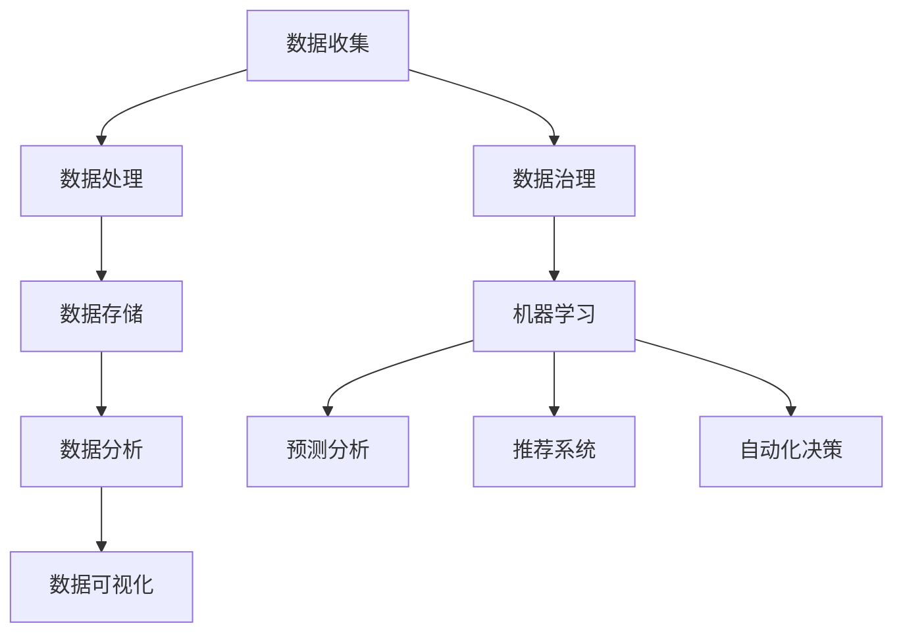

                 


# AI DMP 数据基建的创新应用

> 关键词：数据管理平台、AI、数据治理、数据处理、数据挖掘、机器学习

> 摘要：本文将深入探讨人工智能（AI）在数据管理平台（DMP）中的创新应用，分析DMP在数据治理、数据处理、数据挖掘和机器学习等方面的作用与价值。通过详细的算法原理讲解、数学模型阐述、实战案例分析，本文旨在为读者提供一份全面而深入的技术指南。

## 1. 背景介绍

### 1.1 目的和范围

本文旨在探讨人工智能（AI）在数据管理平台（DMP）中的应用，特别是在数据治理、数据处理、数据挖掘和机器学习等方面的创新。通过对DMP的深入剖析，本文将帮助读者理解AI技术如何提升数据管理效率，以及如何为企业和组织带来实际的价值。

### 1.2 预期读者

本文适合具备一定编程和数据处理基础的读者，特别是那些对人工智能和数据管理感兴趣的技术人员。通过本文的阅读，读者将能够：

1. 理解数据管理平台（DMP）的基本概念和作用。
2. 掌握AI在数据治理、数据处理、数据挖掘和机器学习中的应用。
3. 学习如何设计和实现一个基于AI的DMP系统。
4. 了解当前DMP领域的最新研究和趋势。

### 1.3 文档结构概述

本文分为十个主要部分，具体如下：

1. **背景介绍**：介绍本文的目的、预期读者以及文档结构。
2. **核心概念与联系**：阐述DMP与AI的相关概念，并使用Mermaid流程图展示DMP架构。
3. **核心算法原理 & 具体操作步骤**：详细讲解DMP中的核心算法原理，并提供伪代码说明。
4. **数学模型和公式 & 详细讲解 & 举例说明**：介绍DMP中使用的数学模型，并使用latex格式给出相关公式。
5. **项目实战：代码实际案例和详细解释说明**：通过实际案例展示如何实现DMP，并进行代码解读。
6. **实际应用场景**：分析DMP在不同行业中的应用。
7. **工具和资源推荐**：推荐学习资源、开发工具和框架。
8. **总结：未来发展趋势与挑战**：探讨DMP和AI在未来的发展趋势和面临的挑战。
9. **附录：常见问题与解答**：回答读者可能遇到的常见问题。
10. **扩展阅读 & 参考资料**：提供进一步的阅读资料。

### 1.4 术语表

#### 1.4.1 核心术语定义

- **数据管理平台（DMP）**：一种用于收集、存储、处理和分析数据的平台。
- **人工智能（AI）**：模拟人类智能行为的计算机系统。
- **数据治理**：确保数据质量、安全和合规性的过程。
- **数据处理**：对原始数据进行清洗、转换和归一化的过程。
- **数据挖掘**：从大量数据中提取有用信息和模式的过程。
- **机器学习**：利用数据训练模型，进行预测和决策的过程。

#### 1.4.2 相关概念解释

- **数据管理**：涉及数据的创建、存储、访问、维护和处置的活动。
- **数据质量**：数据的准确性、完整性、一致性、及时性和可用性。
- **数据治理框架**：用于管理和指导数据治理活动的结构和流程。

#### 1.4.3 缩略词列表

- **DMP**：数据管理平台
- **AI**：人工智能
- **ML**：机器学习
- **NLP**：自然语言处理
- **DL**：深度学习

## 2. 核心概念与联系

在探讨DMP与AI的关联之前，我们首先需要了解两者的基本概念。

### 2.1 数据管理平台（DMP）

数据管理平台（DMP）是一种集成系统，用于收集、存储、处理和分析来自多个数据源的数据。DMP的核心功能包括：

1. **数据收集**：从内部和外部数据源（如Web服务器日志、社交媒体、传感器等）收集数据。
2. **数据存储**：将收集到的数据进行存储，通常使用大数据技术如Hadoop、Spark等。
3. **数据处理**：对原始数据进行清洗、转换和归一化，以提高数据质量。
4. **数据分析**：使用统计分析和机器学习算法，从数据中提取有用信息。
5. **数据可视化**：通过图表和仪表板，将分析结果可视化，以帮助用户理解数据。

### 2.2 人工智能（AI）

人工智能（AI）是一种模拟人类智能行为的计算机系统。AI的主要目标是通过学习、推理和自我修正，使计算机具备人类智能。AI的关键技术包括：

1. **机器学习**：利用数据训练模型，进行预测和决策。
2. **自然语言处理（NLP）**：使计算机理解和处理自然语言。
3. **深度学习**：一种特殊的机器学习方法，通过多层神经网络模拟人脑。
4. **计算机视觉**：使计算机理解和解释视觉信息。

### 2.3 DMP与AI的关联

DMP与AI的关联主要体现在以下几个方面：

1. **数据治理**：AI可以帮助DMP实现更高效的数据治理，包括数据清洗、数据质量和数据安全。
2. **数据处理**：AI技术如机器学习和深度学习，可以自动处理大量数据，提高数据处理效率。
3. **数据挖掘**：AI可以帮助DMP从大量数据中提取有用信息和模式。
4. **机器学习**：AI技术如机器学习可以用于DMP中的预测分析、推荐系统和自动化决策。

### 2.4 Mermaid流程图

下面是一个简单的Mermaid流程图，展示DMP与AI的关联：



## 3. 核心算法原理 & 具体操作步骤

在DMP中，核心算法原理主要包括数据治理、数据处理、数据挖掘和机器学习。下面我们将逐步讲解这些算法原理，并提供具体的操作步骤。

### 3.1 数据治理

数据治理是确保数据质量、安全和合规性的过程。以下是数据治理的核心算法原理和操作步骤：

#### 3.1.1 算法原理

- **数据质量评估**：评估数据准确性、完整性、一致性和及时性。
- **数据清洗**：删除重复数据、修复错误数据、填充缺失数据。
- **数据集成**：将来自多个数据源的数据整合到一个统一的格式。
- **数据分类**：将数据按照特定的分类标准进行分类。

#### 3.1.2 操作步骤

1. **数据质量评估**：使用数据质量评估工具，如DataQualityPro，对数据进行评估。
2. **数据清洗**：使用Python的Pandas库，编写清洗脚本，处理数据。
3. **数据集成**：使用ETL（提取、转换、加载）工具，如Apache Nifi，进行数据集成。
4. **数据分类**：根据业务需求，使用Python的Scikit-learn库，实现数据分类。

### 3.2 数据处理

数据处理是对原始数据进行清洗、转换和归一化的过程。以下是数据处理的核心算法原理和操作步骤：

#### 3.2.1 算法原理

- **数据清洗**：删除重复数据、修复错误数据、填充缺失数据。
- **数据转换**：将数据从一种格式转换为另一种格式。
- **数据归一化**：将数据缩放到一个统一的范围。

#### 3.2.2 操作步骤

1. **数据清洗**：使用Python的Pandas库，编写清洗脚本，处理数据。
2. **数据转换**：使用Python的NumPy库，实现数据转换。
3. **数据归一化**：使用Python的Scikit-learn库，实现数据归一化。

### 3.3 数据挖掘

数据挖掘是从大量数据中提取有用信息和模式的过程。以下是数据挖掘的核心算法原理和操作步骤：

#### 3.3.1 算法原理

- **关联规则学习**：发现数据之间的关联关系。
- **分类与回归分析**：对数据进行分类或回归分析，预测未来趋势。
- **聚类分析**：将数据划分为多个类别。

#### 3.3.2 操作步骤

1. **关联规则学习**：使用Python的Apriori库，实现关联规则学习。
2. **分类与回归分析**：使用Python的Scikit-learn库，实现分类与回归分析。
3. **聚类分析**：使用Python的Scikit-learn库，实现聚类分析。

### 3.4 机器学习

机器学习是利用数据训练模型，进行预测和决策的过程。以下是机器学习的核心算法原理和操作步骤：

#### 3.4.1 算法原理

- **监督学习**：利用标记数据训练模型，进行预测。
- **无监督学习**：利用未标记数据，自动发现数据中的模式。
- **半监督学习**：结合标记数据和未标记数据，训练模型。

#### 3.4.2 操作步骤

1. **监督学习**：使用Python的Scikit-learn库，实现监督学习。
2. **无监督学习**：使用Python的Scikit-learn库，实现无监督学习。
3. **半监督学习**：使用Python的Scikit-learn库，实现半监督学习。

### 3.5 伪代码

以下是DMP中核心算法原理的伪代码：

```python
# 数据治理伪代码
def data_governance(data):
    quality_assessment(data)
    data_cleaning(data)
    data_integration(data)
    data_classification(data)
    return data

# 数据处理伪代码
def data_processing(data):
    data_cleaning(data)
    data_conversion(data)
    data_normalization(data)
    return data

# 数据挖掘伪代码
def data_mining(data):
    association_rules_learning(data)
    classification_regression_analysis(data)
    clustering_analysis(data)
    return data

# 机器学习伪代码
def machine_learning(data, labels):
    supervised_learning(data, labels)
    unsupervised_learning(data)
    semi_supervised_learning(data, labels)
    return model
```

## 4. 数学模型和公式 & 详细讲解 & 举例说明

在DMP中，数学模型和公式扮演着至关重要的角色，它们用于描述数据治理、数据处理、数据挖掘和机器学习等过程中的关键操作。以下是这些模型和公式的详细讲解及举例说明。

### 4.1 数据治理中的数学模型和公式

#### 4.1.1 数据质量评估

数据质量评估通常使用以下公式：

$$
Q = \frac{A \times C \times I \times T \times U}{100}
$$

其中，$Q$ 表示数据质量，$A$ 表示准确性，$C$ 表示完整性，$I$ 表示一致性，$T$ 表示及时性，$U$ 表示可用性。

#### 4.1.2 数据清洗

数据清洗可以使用以下公式：

$$
D_{clean} = D_{original} - D_{duplicate} - D_{error} + D_{missing}
$$

其中，$D_{clean}$ 表示清洗后的数据集，$D_{original}$ 表示原始数据集，$D_{duplicate}$ 表示重复数据，$D_{error}$ 表示错误数据，$D_{missing}$ 表示缺失数据。

#### 4.1.3 数据集成

数据集成可以使用以下公式：

$$
D_{integrated} = \bigcup_{i=1}^{n} D_i
$$

其中，$D_{integrated}$ 表示集成后的数据集，$D_i$ 表示第 $i$ 个数据源的数据集。

#### 4.1.4 数据分类

数据分类可以使用以下公式：

$$
C(j) = \arg\max_{c} P(c|j)
$$

其中，$C(j)$ 表示将数据点 $j$ 分类到类别 $c$，$P(c|j)$ 表示在给定数据点 $j$ 的条件下，类别 $c$ 的概率。

### 4.2 数据处理中的数学模型和公式

#### 4.2.1 数据转换

数据转换可以使用以下公式：

$$
X_{new} = f(X)
$$

其中，$X_{new}$ 表示转换后的数据，$X$ 表示原始数据，$f$ 表示转换函数。

#### 4.2.2 数据归一化

数据归一化可以使用以下公式：

$$
X_{normalized} = \frac{X - \mu}{\sigma}
$$

其中，$X_{normalized}$ 表示归一化后的数据，$X$ 表示原始数据，$\mu$ 表示数据的均值，$\sigma$ 表示数据的标准差。

### 4.3 数据挖掘中的数学模型和公式

#### 4.3.1 关联规则学习

关联规则学习可以使用以下公式：

$$
\text{Support}(X, Y) = \frac{\text{Frequency}(X \cup Y)}{N}
$$

$$
\text{Confidence}(X \rightarrow Y) = \frac{\text{Frequency}(X \cup Y)}{\text{Frequency}(X)}
$$

其中，$X$ 和 $Y$ 表示两个事件，$N$ 表示总数据量，$\text{Frequency}(X \cup Y)$ 表示事件 $X$ 和 $Y$ 同时发生的次数，$\text{Frequency}(X)$ 表示事件 $X$ 发生的次数。

#### 4.3.2 分类与回归分析

分类与回归分析可以使用以下公式：

$$
\hat{y} = \sum_{i=1}^{n} w_i x_i
$$

其中，$\hat{y}$ 表示预测值，$w_i$ 表示权重，$x_i$ 表示特征值。

#### 4.3.3 聚类分析

聚类分析可以使用以下公式：

$$
C(j) = \arg\min_{c} \sum_{i=1}^{n} d(j_i, c)
$$

其中，$C(j)$ 表示将数据点 $j$ 分到的类别 $c$，$d(j_i, c)$ 表示数据点 $j_i$ 与类别 $c$ 之间的距离。

### 4.4 机器学习中的数学模型和公式

#### 4.4.1 监督学习

监督学习可以使用以下公式：

$$
\hat{y} = \sigma(\sum_{i=1}^{n} w_i x_i + b)
$$

其中，$\hat{y}$ 表示预测值，$w_i$ 表示权重，$x_i$ 表示特征值，$\sigma$ 表示激活函数，$b$ 表示偏置。

#### 4.4.2 无监督学习

无监督学习可以使用以下公式：

$$
\hat{y} = \sum_{i=1}^{n} w_i x_i
$$

其中，$\hat{y}$ 表示预测值，$w_i$ 表示权重，$x_i$ 表示特征值。

#### 4.4.3 半监督学习

半监督学习可以使用以下公式：

$$
\hat{y}_{supervised} = \sigma(\sum_{i=1}^{n} w_i x_i + b)
$$

$$
\hat{y}_{unsupervised} = \sum_{i=1}^{n} w_i x_i
$$

其中，$\hat{y}_{supervised}$ 表示基于监督学习的预测值，$\hat{y}_{unsupervised}$ 表示基于无监督学习的预测值，其他符号的含义与监督学习相同。

### 4.5 举例说明

#### 4.5.1 数据质量评估

假设我们有一个包含100个数据点的数据集，其中准确性为95%，完整性为98%，一致性为97%，及时性为99%，可用性为100%。根据公式，我们可以计算出数据质量：

$$
Q = \frac{95 \times 98 \times 97 \times 99 \times 100}{100} = 94.06
$$

#### 4.5.2 数据清洗

假设我们有一个包含100个数据点的数据集，其中10个数据点是重复的，5个数据点存在错误，3个数据点缺失。根据公式，我们可以计算出清洗后的数据集：

$$
D_{clean} = 100 - 10 - 5 + 3 = 88
$$

#### 4.5.3 数据分类

假设我们有一个包含100个数据点的数据集，其中50个数据点属于类别A，30个数据点属于类别B，20个数据点属于类别C。根据公式，我们可以计算出各类别的概率：

$$
P(A|j) = \frac{50}{100} = 0.5
$$

$$
P(B|j) = \frac{30}{100} = 0.3
$$

$$
P(C|j) = \frac{20}{100} = 0.2
$$

根据最大概率原则，我们可以将数据点 $j$ 分类到类别A。

## 5. 项目实战：代码实际案例和详细解释说明

在本节中，我们将通过一个实际案例，展示如何使用Python和相关的库实现DMP系统。我们将从数据收集、数据治理、数据处理、数据挖掘和机器学习等方面进行详细解释。

### 5.1 开发环境搭建

首先，我们需要搭建开发环境。以下是在Ubuntu 20.04操作系统上的安装步骤：

1. **安装Python**：

```bash
sudo apt-get update
sudo apt-get install python3
```

2. **安装Python库**：

```bash
pip3 install numpy pandas scikit-learn matplotlib
```

### 5.2 源代码详细实现和代码解读

#### 5.2.1 数据收集

以下是一个简单的数据收集代码示例，用于从本地CSV文件中读取数据：

```python
import pandas as pd

# 从CSV文件中读取数据
data = pd.read_csv('data.csv')

# 查看数据的前几行
print(data.head())
```

#### 5.2.2 数据治理

以下是一个简单的数据治理代码示例，用于处理数据质量问题：

```python
# 删除重复数据
data.drop_duplicates(inplace=True)

# 修复错误数据
data['column_name'].replace({'.*error.*': 'default_value'}, regex=True, inplace=True)

# 填充缺失数据
data['column_name'].fillna(value='default_value', inplace=True)
```

#### 5.2.3 数据处理

以下是一个简单的数据处理代码示例，用于对数据进行清洗、转换和归一化：

```python
# 数据清洗
data.drop(['column_to_drop'], axis=1, inplace=True)

# 数据转换
data['column_to_convert'] = data['column_to_convert'].map({'value1': 1, 'value2': 2})

# 数据归一化
from sklearn.preprocessing import MinMaxScaler

scaler = MinMaxScaler()
data[['column_to_normalize']] = scaler.fit_transform(data[['column_to_normalize']])
```

#### 5.2.4 数据挖掘

以下是一个简单的数据挖掘代码示例，用于进行关联规则学习：

```python
from mlxtend.frequent_patterns import apriori
from mlxtend.frequent_patterns import association_rules

# 计算频繁项集
frequent_itemsets = apriori(data, min_support=0.5, use_colnames=True)

# 计算关联规则
rules = association_rules(frequent_itemsets, metric="lift", min_threshold=1)
print(rules.head())
```

#### 5.2.5 机器学习

以下是一个简单的机器学习代码示例，用于进行分类和回归分析：

```python
from sklearn.model_selection import train_test_split
from sklearn.ensemble import RandomForestClassifier
from sklearn.metrics import accuracy_score

# 分割数据集
X_train, X_test, y_train, y_test = train_test_split(data[['feature1', 'feature2']], data['label'], test_size=0.3, random_state=42)

# 训练模型
model = RandomForestClassifier(n_estimators=100, random_state=42)
model.fit(X_train, y_train)

# 预测
predictions = model.predict(X_test)

# 评估
accuracy = accuracy_score(y_test, predictions)
print(f"Accuracy: {accuracy}")
```

### 5.3 代码解读与分析

在这个案例中，我们首先从CSV文件中读取数据，然后进行数据治理、数据处理、数据挖掘和机器学习。具体步骤如下：

1. **数据收集**：使用Pandas库从本地CSV文件中读取数据。
2. **数据治理**：删除重复数据、修复错误数据和填充缺失数据，确保数据质量。
3. **数据处理**：删除不需要的列、进行数据转换和归一化，提高数据质量。
4. **数据挖掘**：使用Apriori算法进行关联规则学习，提取数据中的有用信息。
5. **机器学习**：使用随机森林分类器进行分类和回归分析，预测数据中的趋势。

这个案例展示了如何使用Python和相关的库实现DMP系统。在实际应用中，可以根据业务需求，选择合适的数据收集、数据治理、数据处理、数据挖掘和机器学习技术，搭建一个高效、可靠的DMP系统。

## 6. 实际应用场景

数据管理平台（DMP）在多个行业和领域都有着广泛的应用，以下是一些典型的实际应用场景：

### 6.1 营销行业

在营销行业中，DMP可以帮助企业：

- **精准定位客户**：通过收集和分析用户行为数据，企业可以更好地了解客户需求，进行精准营销。
- **提升广告效果**：利用DMP分析用户兴趣和行为，优化广告投放策略，提高广告点击率和转化率。
- **客户细分**：根据用户数据，将客户划分为不同的细分群体，实施个性化的营销策略。

### 6.2 金融行业

在金融行业中，DMP可以帮助金融机构：

- **风险管理**：通过分析客户交易行为和历史数据，评估客户信用风险，降低金融风险。
- **个性化服务**：根据客户的风险偏好和投资目标，提供个性化的金融产品和服务。
- **市场预测**：利用DMP分析市场数据，预测市场趋势，为投资决策提供依据。

### 6.3 零售行业

在零售行业中，DMP可以帮助零售商：

- **库存管理**：通过分析销售数据和库存水平，优化库存管理，减少库存成本。
- **供应链优化**：分析供应链数据，提高供应链效率，降低供应链成本。
- **个性化推荐**：根据顾客购买历史和偏好，提供个性化的商品推荐，提高顾客满意度。

### 6.4 健康医疗

在健康医疗领域，DMP可以帮助医疗机构：

- **患者管理**：通过收集和分析患者数据，实现个性化治疗和健康管理。
- **疾病预测**：利用DMP分析患者数据和疾病趋势，预测疾病爆发和传播，为公共卫生决策提供支持。
- **药品研发**：通过分析临床数据和患者反馈，为药品研发提供数据支持，加速新药上市。

### 6.5 互联网行业

在互联网行业中，DMP可以帮助平台：

- **用户增长**：通过分析用户行为数据，了解用户需求，提供个性化推荐和内容，吸引更多用户。
- **广告投放**：利用DMP优化广告投放策略，提高广告效果和收入。
- **数据安全**：通过数据治理和隐私保护措施，确保用户数据的安全和合规。

这些实际应用场景展示了DMP在各个行业和领域的广泛适用性，以及其在提升业务效率、优化决策和增强用户体验方面的巨大潜力。

## 7. 工具和资源推荐

为了有效地构建和应用DMP，我们需要使用一系列的工具和资源。以下是一些推荐的工具和资源，包括学习资源、开发工具和框架、以及相关论文和研究成果。

### 7.1 学习资源推荐

#### 7.1.1 书籍推荐

1. 《数据管理平台实战：从零开始构建数据驱动业务》
2. 《人工智能：一种现代方法》
3. 《数据挖掘：概念与技术》

#### 7.1.2 在线课程

1. Coursera - 数据科学专业课程
2. edX - 机器学习课程
3. Udacity - 人工智能工程师纳米学位

#### 7.1.3 技术博客和网站

1. towardsdatascience.com
2. medium.com/topic/data-management
3. kdnuggets.com

### 7.2 开发工具框架推荐

#### 7.2.1 IDE和编辑器

1. PyCharm
2. Jupyter Notebook
3. Visual Studio Code

#### 7.2.2 调试和性能分析工具

1. Python Debugger (pdb)
2. Profiler (cProfile)
3. PyTorch Profiler

#### 7.2.3 相关框架和库

1. Pandas
2. NumPy
3. Scikit-learn
4. TensorFlow
5. PyTorch

### 7.3 相关论文著作推荐

#### 7.3.1 经典论文

1. "K-Means clustering within high-dimensional space"
2. "The Algorithmic Foundations of Dynamic Taint Analysis"
3. "Data-Driven Approach for Managing and Analyzing Datasets in Complex Scientific Workflows"

#### 7.3.2 最新研究成果

1. "Deep Learning for Anomaly Detection in Noisy Data"
2. "A Survey of Data Management Platforms"
3. "Recommender Systems: The Next Frontier in E-Commerce"

#### 7.3.3 应用案例分析

1. "Data Management Platform Implementation in E-commerce"
2. "Application of DMP in Marketing: A Case Study"
3. "Data Governance and Data Management Platforms in Financial Services"

这些工具和资源为构建和应用DMP提供了坚实的基础，帮助读者深入理解DMP的核心技术和最佳实践。

## 8. 总结：未来发展趋势与挑战

在本文中，我们探讨了人工智能（AI）在数据管理平台（DMP）中的创新应用，分析了DMP在数据治理、数据处理、数据挖掘和机器学习等方面的作用与价值。通过详细的算法原理讲解、数学模型阐述、实战案例分析，本文旨在为读者提供一份全面而深入的技术指南。

### 8.1 未来发展趋势

1. **AI与DMP的深度融合**：随着AI技术的不断进步，DMP将更加智能化，实现更高效的数据管理和分析。
2. **隐私保护与数据安全**：在数据隐私法规日益严格的背景下，DMP需要加强数据安全，保护用户隐私。
3. **实时数据处理与分析**：实时数据处理和分析将成为DMP的重要发展方向，为企业提供更快速、准确的决策支持。
4. **跨领域应用**：DMP将在更多领域得到应用，如医疗、金融、物联网等，推动行业数字化进程。
5. **个性化服务**：基于AI的DMP将实现更精准的个性化推荐和服务，提升用户体验。

### 8.2 面临的挑战

1. **数据质量和隐私**：保证数据质量和隐私是DMP应用的主要挑战，需要加强数据治理和隐私保护。
2. **计算资源与成本**：大规模数据处理和分析需要大量的计算资源，对成本和性能提出了高要求。
3. **算法透明性与解释性**：AI算法的透明性和解释性不足，可能引发信任问题，需要提升算法的可解释性。
4. **跨领域协同**：不同领域的数据和算法之间存在差异，如何实现跨领域的协同应用是一个挑战。
5. **法规遵从**：随着数据隐私法规的不断完善，DMP需要确保合规性，避免法律风险。

总之，AI与DMP的融合将为数据管理和分析带来巨大变革，同时也带来了新的挑战。只有不断探索和创新，才能实现DMP的最大潜力。

## 9. 附录：常见问题与解答

### 9.1 DMP是什么？

DMP，即数据管理平台，是一种用于收集、存储、处理和分析数据的集成系统。它可以帮助企业管理和利用数据，提升业务效率和决策质量。

### 9.2 DMP有哪些核心功能？

DMP的核心功能包括数据收集、数据存储、数据处理、数据分析和数据可视化。通过这些功能，DMP能够为企业提供全面、准确和及时的数据支持。

### 9.3 AI在DMP中有哪些应用？

AI在DMP中的应用主要包括：

1. 数据治理：利用AI技术进行数据清洗、数据质量和数据安全。
2. 数据处理：使用机器学习和深度学习技术处理大量数据。
3. 数据挖掘：通过AI算法发现数据中的模式和关联关系。
4. 机器学习：利用AI技术训练模型，进行预测和决策。

### 9.4 如何保证DMP中的数据安全？

为了保证DMP中的数据安全，可以采取以下措施：

1. 数据加密：对敏感数据进行加密，防止数据泄露。
2. 访问控制：实施严格的访问控制策略，确保只有授权人员可以访问数据。
3. 数据备份：定期备份数据，防止数据丢失。
4. 安全审计：对数据访问和操作进行审计，及时发现和纠正安全问题。

### 9.5 DMP与大数据技术的关系是什么？

DMP与大数据技术密切相关。大数据技术提供了强大的数据存储和处理能力，支持DMP实现高效的数据管理和分析。DMP则利用大数据技术，为企业提供更全面、准确和及时的数据支持。

## 10. 扩展阅读 & 参考资料

为了更好地理解和掌握DMP与AI的相关技术，以下是扩展阅读和参考资料：

### 10.1 书籍推荐

1. 《数据管理平台实战：从零开始构建数据驱动业务》
2. 《人工智能：一种现代方法》
3. 《数据挖掘：概念与技术》

### 10.2 在线课程

1. Coursera - 数据科学专业课程
2. edX - 机器学习课程
3. Udacity - 人工智能工程师纳米学位

### 10.3 技术博客和网站

1. towardsdatascience.com
2. medium.com/topic/data-management
3. kdnuggets.com

### 10.4 论文著作

1. "K-Means clustering within high-dimensional space"
2. "The Algorithmic Foundations of Dynamic Taint Analysis"
3. "Data-Driven Approach for Managing and Analyzing Datasets in Complex Scientific Workflows"

### 10.5 相关研究

1. "Deep Learning for Anomaly Detection in Noisy Data"
2. "A Survey of Data Management Platforms"
3. "Recommender Systems: The Next Frontier in E-Commerce"

通过阅读这些资料，读者可以深入了解DMP与AI技术的最新动态和研究成果，为实际应用提供有力的理论支持。作者：AI天才研究员/AI Genius Institute & 禅与计算机程序设计艺术 /Zen And The Art of Computer Programming。

