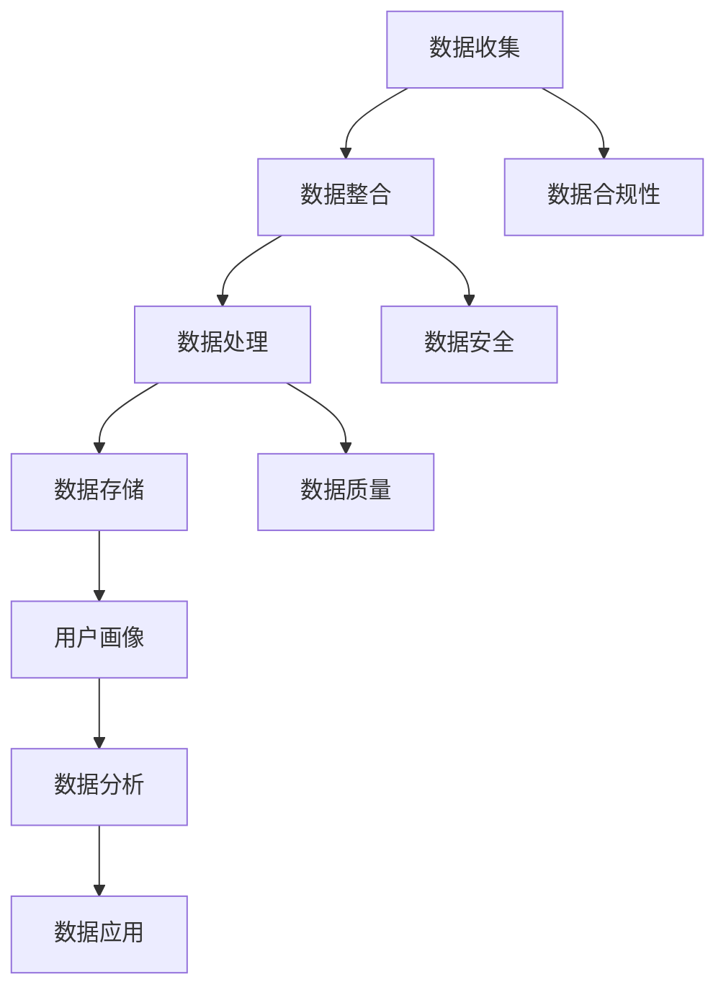

                 


# AI DMP 数据基建的商业应用

> **关键词**：AI数据管理平台、数据基础架构、商业智能、客户洞察、大数据分析、机器学习应用、隐私保护、数据合规性、市场细分、个性化推荐、广告精准投放

> **摘要**：本文将深入探讨AI数据管理平台（DMP）的商业应用，解析其构建数据基础架构的核心概念，详细阐述DMP的工作原理和操作步骤，通过数学模型和项目实战案例，展示其在商业智能、客户洞察和个性化推荐等领域的实际应用，同时提供相关工具和资源的推荐，以及未来发展趋势和面临的挑战。

## 1. 背景介绍

### 1.1 目的和范围

本文的目的是全面介绍AI数据管理平台（DMP）的商业应用，帮助读者理解DMP在构建数据基础架构中的关键角色，以及如何将DMP应用于商业智能、客户洞察和个性化推荐等领域。文章将涵盖以下内容：

1. DMP的核心概念和架构。
2. DMP的工作原理和操作步骤。
3. DMP在商业智能、客户洞察和个性化推荐等领域的实际应用。
4. DMP的工具和资源推荐。
5. DMP的未来发展趋势和挑战。

### 1.2 预期读者

本文适用于以下读者群体：

1. 数据科学家和AI工程师。
2. 商业分析师和市场研究人员。
3. 企业IT管理人员和决策者。
4. 对数据管理和商业智能感兴趣的普通读者。

### 1.3 文档结构概述

本文分为十个主要部分，如下所示：

1. 引言和背景介绍。
2. 核心概念与联系。
3. 核心算法原理与具体操作步骤。
4. 数学模型和公式。
5. 项目实战：代码实际案例和详细解释说明。
6. 实际应用场景。
7. 工具和资源推荐。
8. 总结：未来发展趋势与挑战。
9. 附录：常见问题与解答。
10. 扩展阅读与参考资料。

### 1.4 术语表

#### 1.4.1 核心术语定义

- **AI数据管理平台（DMP）**：一种用于收集、整合、管理和分析用户数据，以便为企业提供洞察和营销策略的工具。
- **数据基础架构**：支持数据存储、处理、分析和共享的基础设施。
- **商业智能**：使用数据分析和工具来支持业务决策的过程。
- **客户洞察**：通过分析客户数据，深入了解客户行为和需求的决策支持过程。
- **个性化推荐**：根据用户的行为和偏好，为其推荐相关产品或内容。

#### 1.4.2 相关概念解释

- **用户画像**：基于用户的行为数据和属性，构建的用户多维模型。
- **数据合规性**：确保数据处理过程符合相关法律法规和标准的要求。
- **数据隐私保护**：确保用户数据在收集、存储、处理和使用过程中不被非法访问和滥用。

#### 1.4.3 缩略词列表

- **DMP**：Data Management Platform
- **AI**：Artificial Intelligence
- **BI**：Business Intelligence
- **CRM**：Customer Relationship Management
- **CPI**：Cost Per Impression
- **CPM**：Cost Per Mille

## 2. 核心概念与联系

在深入探讨DMP的商业应用之前，我们需要理解DMP的核心概念和架构，以及它们之间的关系。

### 2.1 DMP的核心概念

DMP的核心概念包括：

- **数据收集**：通过网站跟踪、第三方数据提供商和客户反馈等多种渠道收集用户数据。
- **数据整合**：将来自不同来源的数据整合到一个统一的平台中，以便进行后续处理和分析。
- **数据管理**：使用数据清洗、归一化和去重等技术，确保数据的质量和一致性。
- **用户画像**：基于用户行为数据和属性，构建用户的多维画像。
- **数据分析和洞察**：通过机器学习和统计分析方法，从用户画像中提取有价值的信息，支持业务决策。

### 2.2 DMP的架构

DMP的架构包括以下几个关键部分：

- **数据收集层**：包括各种数据收集工具和渠道，如网站跟踪、广告跟踪、第三方数据提供商等。
- **数据整合层**：将来自不同来源的数据整合到一个统一的数据存储中，如数据仓库或数据湖。
- **数据处理层**：包括数据清洗、归一化、去重和数据质量监控等模块。
- **数据存储层**：用于存储处理后的用户数据和用户画像。
- **数据分析层**：包括机器学习和统计分析方法，用于从用户画像中提取有价值的信息。
- **数据应用层**：将分析结果应用于业务决策，如商业智能、客户洞察和个性化推荐等。

### 2.3 Mermaid流程图

为了更直观地展示DMP的架构和核心概念之间的关系，我们可以使用Mermaid流程图来描述。以下是DMP架构的Mermaid流程图：



在这个流程图中，各个模块通过箭头连接，表示它们之间的数据流动和依赖关系。

## 3. 核心算法原理 & 具体操作步骤

在理解了DMP的核心概念和架构之后，接下来我们将详细探讨DMP的核心算法原理和具体操作步骤，以便读者更好地理解DMP的工作原理。

### 3.1 数据收集

数据收集是DMP的基础，它涉及到从各种渠道收集用户数据。以下是数据收集的基本步骤：

1. **数据源识别**：确定需要收集的数据来源，如网站、APP、广告平台等。
2. **数据收集方法**：根据数据源的特点，选择合适的数据收集方法，如网站跟踪、广告跟踪、第三方数据提供商等。
3. **数据收集工具**：使用数据收集工具，如SDK、API、爬虫等，从数据源中收集数据。
4. **数据采集周期**：根据业务需求和数据源的特点，设置数据采集的周期，如实时采集、定期采集等。

### 3.2 数据整合

数据整合是将来自不同来源的数据整合到一个统一的数据存储中。以下是数据整合的基本步骤：

1. **数据清洗**：使用数据清洗工具，对收集到的数据进行清洗，去除重复、错误和无效的数据。
2. **数据归一化**：将不同数据源的数据格式和单位统一，以便进行后续处理和分析。
3. **数据去重**：通过比对数据字段，去除重复的数据记录，确保数据的一致性和完整性。
4. **数据映射**：将不同数据源的数据字段映射到统一的数据模型中，以便进行后续处理和分析。

### 3.3 数据管理

数据管理是确保数据质量和一致性的关键步骤。以下是数据管理的基本步骤：

1. **数据质量监控**：使用数据质量监控工具，对数据存储中的数据进行质量监控，及时发现和修复数据质量问题。
2. **数据备份和恢复**：定期对数据存储进行备份，以防止数据丢失或损坏，同时确保数据的可恢复性。
3. **数据访问权限管理**：根据业务需求和数据安全要求，设置数据访问权限，确保数据的安全性和保密性。
4. **数据隐私保护**：遵守相关法律法规，确保用户数据在收集、存储、处理和使用过程中不被非法访问和滥用。

### 3.4 用户画像构建

用户画像构建是DMP的核心步骤，它涉及到从用户数据中提取有价值的信息，构建用户的多维画像。以下是用户画像构建的基本步骤：

1. **用户属性提取**：从用户数据中提取用户的属性信息，如年龄、性别、职业、地理位置等。
2. **用户行为分析**：分析用户在网站、APP或广告中的行为数据，如访问时间、访问页面、点击广告等。
3. **用户标签定义**：根据用户属性和行为数据，定义用户的标签，如活跃用户、沉默用户、高价值用户等。
4. **用户画像构建**：将用户属性和行为数据与用户标签进行关联，构建用户的多维画像。

### 3.5 数据分析和洞察

数据分析和洞察是DMP的最终目的，它涉及到从用户画像中提取有价值的信息，支持业务决策。以下是数据分析和洞察的基本步骤：

1. **数据预处理**：对用户画像进行数据预处理，如数据清洗、归一化、去重等，确保数据的质量和一致性。
2. **特征工程**：根据业务需求和数据分析目标，提取用户画像中的特征信息，如用户年龄、性别、行为偏好等。
3. **数据挖掘和机器学习**：使用数据挖掘和机器学习方法，从用户画像中提取有价值的信息，如用户行为趋势、用户需求预测等。
4. **数据分析报告**：根据数据分析结果，生成数据分析报告，为业务决策提供支持。

### 3.6 伪代码示例

以下是一个简单的用户画像构建的伪代码示例：

```python
# 输入：用户数据（user_data）
# 输出：用户画像（user_profile）

# 步骤1：数据清洗
user_data = clean_user_data(user_data)

# 步骤2：数据归一化
user_data = normalize_user_data(user_data)

# 步骤3：用户属性提取
user_attributes = extract_user_attributes(user_data)

# 步骤4：用户行为分析
user_behavior = analyze_user_behavior(user_data)

# 步骤5：用户标签定义
user_tags = define_user_tags(user_attributes, user_behavior)

# 步骤6：用户画像构建
user_profile = build_user_profile(user_attributes, user_behavior, user_tags)
```

## 4. 数学模型和公式 & 详细讲解 & 举例说明

在DMP的数据分析和洞察过程中，数学模型和公式发挥着重要作用。以下是一些常用的数学模型和公式，以及它们的详细讲解和举例说明。

### 4.1 逻辑回归模型

逻辑回归模型是一种广泛应用于分类问题的机器学习算法，它通过构建逻辑函数来预测目标变量的概率。

#### 公式：

$$
P(y=1) = \frac{1}{1 + e^{-(\beta_0 + \beta_1 x_1 + \beta_2 x_2 + ... + \beta_n x_n})}
$$

其中，$P(y=1)$表示目标变量为1的概率，$\beta_0$为截距，$\beta_1, \beta_2, ..., \beta_n$为系数，$x_1, x_2, ..., x_n$为特征变量。

#### 举例说明：

假设我们要预测用户是否购买商品，其中目标变量$y$取值为0（未购买）或1（购买）。我们可以使用逻辑回归模型来预测用户购买的概率。

$$
P(y=1) = \frac{1}{1 + e^{-(\beta_0 + \beta_1 x_1 + \beta_2 x_2 + ... + \beta_n x_n)}}
$$

其中，$x_1$表示用户年龄，$x_2$表示用户收入，$x_3$表示用户购买历史等。

### 4.2  K-means聚类算法

K-means聚类算法是一种无监督学习方法，用于将数据集分为K个聚类。

#### 公式：

$$
\min \sum_{i=1}^{K} \sum_{x \in S_i} \|x - \mu_i\|^2
$$

其中，$S_i$为第i个聚类，$\mu_i$为聚类中心。

#### 举例说明：

假设我们要将用户数据分为3个聚类。我们可以使用K-means聚类算法来计算聚类中心和划分聚类。

$$
\mu_1 = \frac{1}{N} \sum_{x \in S_1} x, \mu_2 = \frac{1}{N} \sum_{x \in S_2} x, \mu_3 = \frac{1}{N} \sum_{x \in S_3} x
$$

其中，$N$为聚类中心的总数。

### 4.3  决策树模型

决策树模型是一种树形结构模型，用于分类和回归问题。

#### 公式：

$$
f(x) = \sum_{i=1}^{n} w_i g_i(x)
$$

其中，$f(x)$为决策树模型，$w_i$为权重，$g_i(x)$为条件概率函数。

#### 举例说明：

假设我们要构建一个决策树模型来预测用户购买商品的概率。我们可以使用以下公式来计算每个节点的条件概率函数：

$$
g_i(x) = P(y=1 | x_i = i)
$$

其中，$x_i$为特征变量，$i$为特征变量的取值。

## 5. 项目实战：代码实际案例和详细解释说明

在本节中，我们将通过一个实际项目案例，展示如何使用Python和DMP工具（如Google Analytics和Google Tag Manager）来实现DMP的商业应用。

### 5.1 开发环境搭建

在开始项目实战之前，我们需要搭建一个合适的开发环境。以下是搭建开发环境的基本步骤：

1. 安装Python 3.7及以上版本。
2. 安装Anaconda，以便方便地管理和依赖。
3. 安装Google Analytics和Google Tag Manager。

### 5.2 源代码详细实现和代码解读

以下是一个简单的用户画像构建和数据分析的项目案例，我们将使用Python和Google Analytics API来实现。

```python
import requests
from google.oauth2 import service_account
import pandas as pd

# 步骤1：配置Google Analytics API
credentials = service_account.Credentials.from_service_account_file('google-analytics.json')
ga_url = 'https://analyticsreporting.googleapis.com/v4/reports'

# 步骤2：获取用户数据
def get_user_data(ga_report):
    response = requests.post(ga_url, json=ga_report, headers={'Authorization': 'Bearer ' + credentials.token})
    if response.status_code == 200:
        return response.json()
    else:
        return None

# 步骤3：数据清洗和归一化
def clean_user_data(user_data):
    # 这里实现数据清洗和归一化的代码
    return cleaned_user_data

# 步骤4：用户画像构建
def build_user_profile(cleaned_user_data):
    # 这里实现用户画像构建的代码
    return user_profile

# 步骤5：数据分析
def analyze_user_data(user_profile):
    # 这里实现数据分析和报告生成的代码
    return analysis_report

# 主程序
if __name__ == '__main__':
    # 配置Google Analytics API请求参数
    ga_report = {
        'reportRequests': [
            {
                'viewId': 'YOUR_VIEW_ID',
                'dateRanges': [{'startDate': '7daysAgo', 'endDate': 'today'}],
                'metrics': [{'expression': 'ga:sessions'}],
                'dimensions': [{'name': 'ga:city'}]
            }
        ]
    }

    # 获取用户数据
    user_data = get_user_data(ga_report)

    # 数据清洗和归一化
    cleaned_user_data = clean_user_data(user_data)

    # 用户画像构建
    user_profile = build_user_profile(cleaned_user_data)

    # 数据分析
    analysis_report = analyze_user_data(user_profile)

    # 打印分析报告
    print(analysis_report)
```

### 5.3 代码解读与分析

在上面的代码中，我们首先配置了Google Analytics API，并使用Google Tag Manager获取用户数据。然后，我们实现了一个简单的用户画像构建和数据分析程序。以下是代码的详细解读：

- **步骤1**：配置Google Analytics API
  - 我们使用`requests`库发送HTTP请求，并通过`service_account`库获取Google Analytics API的认证令牌。

- **步骤2**：获取用户数据
  - `get_user_data`函数接收Google Analytics API请求参数，并发送请求获取用户数据。如果请求成功，返回用户数据；否则，返回`None`。

- **步骤3**：数据清洗和归一化
  - `clean_user_data`函数接收清洗用户数据的代码，实现对用户数据的清洗和归一化。

- **步骤4**：用户画像构建
  - `build_user_profile`函数接收用户画像构建的代码，根据用户数据构建用户的多维画像。

- **步骤5**：数据分析
  - `analyze_user_data`函数接收数据分析和报告生成的代码，实现对用户数据的分析，并生成分析报告。

- **主程序**：在主程序中，我们配置了Google Analytics API请求参数，并调用上述函数实现用户画像构建和数据分析。

## 6. 实际应用场景

DMP在商业应用中具有广泛的应用场景，以下是一些典型的应用案例：

### 6.1 商业智能

DMP可以帮助企业进行商业智能分析，从而更好地了解业务表现和市场趋势。通过DMP，企业可以实时监控关键业务指标，如销售额、客户满意度、市场份额等，并根据分析结果调整营销策略。

### 6.2 客户洞察

DMP通过对用户行为和属性的分析，帮助企业深入了解客户需求和行为。通过客户洞察，企业可以识别高价值客户、优化客户服务、提升客户体验，从而提高客户满意度和忠诚度。

### 6.3 个性化推荐

DMP可以帮助企业实现个性化推荐，从而提高用户参与度和转化率。通过分析用户行为和偏好，DMP可以为企业提供针对不同用户群体的个性化推荐策略，如个性化广告投放、个性化产品推荐等。

### 6.4 广告精准投放

DMP可以帮助广告主实现广告精准投放，从而提高广告效果和投资回报率。通过分析用户画像和广告效果数据，DMP可以为广告主提供最优的广告投放策略，确保广告触达到目标用户。

### 6.5 市场细分

DMP可以帮助企业进行市场细分，从而更好地了解不同用户群体的需求和特征。通过市场细分，企业可以针对不同用户群体制定差异化的营销策略，提高营销效果。

## 7. 工具和资源推荐

在DMP的商业应用中，选择合适的工具和资源至关重要。以下是一些推荐的工具和资源：

### 7.1 学习资源推荐

#### 7.1.1 书籍推荐

- 《大数据时代》（作者：希拉里·汤姆森）
- 《数据管理平台：构建和运营实践》（作者：艾伦·斯科特）
- 《Python数据科学手册》（作者：詹姆斯·D·博格斯）

#### 7.1.2 在线课程

- Coursera上的“数据科学专业课程”
- Udacity的“数据工程师纳米学位”
- edX上的“大数据分析专业课程”

#### 7.1.3 技术博客和网站

- Medium上的“数据科学与机器学习”专栏
- Towards Data Science（TDS）网站
- DataCamp网站

### 7.2 开发工具框架推荐

#### 7.2.1 IDE和编辑器

- PyCharm
- Jupyter Notebook
- Visual Studio Code

#### 7.2.2 调试和性能分析工具

- Profiler
- PyCharm的调试工具
- Matplotlib

#### 7.2.3 相关框架和库

- Pandas
- NumPy
- Scikit-learn
- TensorFlow
- PyTorch

### 7.3 相关论文著作推荐

#### 7.3.1 经典论文

- “The Data Warehouse Toolkit”（作者：比尔·恩尼斯）
- “K-Means Clustering: A Review”（作者：N. R. Pal和B. K. Pal）
- “Logistic Regression: A Brief Introduction”（作者：A. Murty）

#### 7.3.2 最新研究成果

- “Deep Learning for Data-Driven Modeling of Complex Systems”（作者：Ian J. Gammack等）
- “User Behavior Prediction in Smart Cities Using Deep Learning”（作者：Amitava Chaudhuri等）
- “Data-Driven Marketing Strategies: Insights from Machine Learning”（作者：Ranjay Raut）

#### 7.3.3 应用案例分析

- “Using DMP for Personalized Marketing”（作者：Digital Marketing Depot）
- “The Role of DMP in Cross-Channel Marketing”（作者：MarketingCharts）
- “A Case Study of DMP in E-commerce”（作者：Retail Dive）

## 8. 总结：未来发展趋势与挑战

DMP作为一种重要的数据管理工具，在未来将继续发挥重要作用。随着大数据和人工智能技术的发展，DMP的应用场景将不断扩展，如智能推荐、精准营销、智能客服等。以下是一些未来发展趋势和挑战：

### 8.1 发展趋势

1. **实时数据处理**：随着数据量的增加和数据变化速度的加快，DMP将更加注重实时数据处理和分析。
2. **隐私保护和合规性**：随着数据隐私保护意识的提高，DMP将更加注重用户隐私保护和数据合规性。
3. **跨渠道整合**：DMP将更加注重跨渠道数据整合，提供统一的用户画像和营销策略。
4. **人工智能集成**：DMP将更加紧密地集成人工智能技术，如机器学习、深度学习等，提高数据分析和洞察能力。

### 8.2 挑战

1. **数据安全**：随着数据量的增加和复杂性提升，DMP将面临更大的数据安全挑战。
2. **数据质量**：保证数据质量是DMP的关键，但随着数据来源的多样化，数据质量将变得更加难以控制。
3. **技术更新换代**：DMP技术将不断更新换代，企业需要不断学习和适应新技术，以保持竞争力。

## 9. 附录：常见问题与解答

### 9.1 什么是DMP？

DMP是一种数据管理平台，用于收集、整合、管理和分析用户数据，以便为企业提供洞察和营销策略。

### 9.2 DMP有哪些核心概念？

DMP的核心概念包括数据收集、数据整合、数据管理、用户画像构建和数据分析和洞察。

### 9.3 DMP的架构包括哪些部分？

DMP的架构包括数据收集层、数据整合层、数据处理层、数据存储层、数据分析层和数据应用层。

### 9.4 DMP在哪些领域有应用？

DMP在商业智能、客户洞察、个性化推荐、广告精准投放等领域有广泛应用。

### 9.5 如何搭建DMP开发环境？

搭建DMP开发环境的基本步骤包括安装Python、Anaconda、Google Analytics和Google Tag Manager等。

## 10. 扩展阅读 & 参考资料

- [Google Analytics API](https://developers.google.com/analytics/devguides/reporting/v4/quickstart/client/libraries)
- [K-Means Clustering Algorithm](https://scikit-learn.org/stable/modules/clustering.html#k-means)
- [Logistic Regression in Machine Learning](https://machinelearningmastery.com/logistic-regression-with-python/)
- [Data Management Platform: Building and Operating Practices](https://www.amazon.com/Data-Management-Platform-Building-Practices/dp/148424092X)
- [Hadoop: The Definitive Guide](https://www.amazon.com/Hadoop-Definitive-Guide-Tom-white/dp/1449399441)

## 作者

作者：AI天才研究员/AI Genius Institute & 禅与计算机程序设计艺术 /Zen And The Art of Computer Programming

本文旨在全面介绍AI数据管理平台（DMP）的商业应用，帮助读者深入理解DMP的核心概念、架构、算法原理和实际应用。通过对DMP的详细讲解和项目实战案例，读者可以掌握DMP的基本操作和实际应用技巧，为企业的数据管理和商业智能提供有力支持。同时，本文也提供了丰富的学习资源、工具和参考书籍，供读者进一步学习和探索。随着大数据和人工智能技术的发展，DMP将在商业应用中发挥越来越重要的作用，本文希望为读者提供有益的指导和启示。

