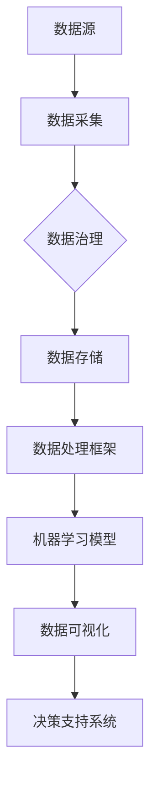
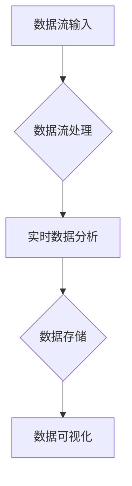

                 

# AI DMP 数据基建的技术创新

> **关键词：** AI DMP，数据管理平台，数据治理，数据流处理，机器学习，分布式系统，数据处理框架，大数据技术，云计算，实时分析，数据可视化。

> **摘要：** 本文将深入探讨AI驱动的数据管理平台（DMP）的技术创新，涵盖核心概念、算法原理、数学模型、项目实战、应用场景以及未来发展。通过系统性的分析和具体实例，帮助读者全面理解DMP的技术架构与实现。

## 1. 背景介绍

### 1.1 目的和范围

本文旨在探讨AI驱动的数据管理平台（DMP）的技术创新，旨在为读者提供一个全面的技术解析，帮助理解DMP在当前大数据和人工智能时代的核心作用。文章将覆盖以下主要范围：

- DMP的基本概念和架构设计。
- 数据治理和流处理的核心算法原理。
- 实用的数学模型和公式，以及其具体应用。
- 项目实战案例，展示DMP的实际应用场景。
- 未来发展趋势与面临的挑战。

### 1.2 预期读者

本文适合以下读者群体：

- 数据工程师和分析师，对DMP技术有初步了解。
- 数据科学家和AI开发者，希望掌握DMP的深度应用。
- 系统架构师和技术经理，需要理解和评估DMP的技术架构。
- 高级IT专业人员和研究人员，对大数据和AI领域有深入研究。

### 1.3 文档结构概述

本文采用结构化的文档结构，分为以下几部分：

- 引言：介绍DMP的基本概念和重要性。
- 核心概念与联系：阐述DMP的技术架构和核心算法。
- 核心算法原理 & 具体操作步骤：详细讲解数据处理算法。
- 数学模型和公式 & 详细讲解 & 举例说明：介绍DMP的数学基础。
- 项目实战：实际代码案例和解读。
- 实际应用场景：分析DMP在不同领域的应用。
- 工具和资源推荐：推荐学习资源和开发工具。
- 总结：总结DMP的未来发展趋势与挑战。
- 附录：常见问题与解答。
- 扩展阅读 & 参考资料：提供进一步学习的资料。

### 1.4 术语表

#### 1.4.1 核心术语定义

- **DMP（Data Management Platform）**：数据管理平台，用于集中管理和处理数据的软件系统。
- **数据治理**：确保数据质量、合规性和有效性的过程。
- **数据流处理**：实时处理大量数据的技术。
- **机器学习**：利用数据构建模型的自动化方法。
- **分布式系统**：跨越多个计算节点的系统。
- **数据处理框架**：如Apache Hadoop、Apache Spark，用于大规模数据处理。
- **大数据技术**：处理海量数据的方法和工具。

#### 1.4.2 相关概念解释

- **云计算**：通过互联网提供计算资源的服务。
- **实时分析**：对数据流进行实时处理和分析的技术。
- **数据可视化**：将数据以图形化形式展示的技术。

#### 1.4.3 缩略词列表

- **HDFS**：Hadoop分布式文件系统。
- **YARN**：资源调度框架。
- **Spark**：分布式数据处理框架。
- **MLlib**：Spark的机器学习库。

## 2. 核心概念与联系

在探讨DMP的技术创新之前，首先需要了解其核心概念和相互联系。以下是一个简化的Mermaid流程图，展示了DMP的关键组成部分和它们之间的交互关系。



### 2.1 数据源

数据源是DMP的基础，它们可以是内部数据库、外部API、日志文件或其他任何数据产生者。数据源的多样性使得DMP能够收集和处理不同格式和结构的数据。

### 2.2 数据采集

数据采集是DMP的第一步，涉及将数据从不同来源导入到DMP中。这一过程需要处理数据格式转换、数据清洗和初步解析等问题。

### 2.3 数据治理

数据治理确保数据的准确性、完整性、可用性和合规性。它包括数据质量评估、数据分类、数据安全性和隐私保护等。

### 2.4 数据存储

数据存储是将处理后的数据保存到持久化存储系统的过程。常见的存储系统包括关系型数据库、NoSQL数据库和分布式文件系统。

### 2.5 数据处理框架

数据处理框架如Apache Hadoop和Apache Spark，用于大规模数据的分布式处理。它们提供了高效的数据存储和处理能力，支持批处理和实时处理。

### 2.6 机器学习模型

机器学习模型是DMP的核心，它们通过分析大量数据来提取模式和洞察。这些模型可以用于预测、分类、聚类和推荐等任务。

### 2.7 数据可视化

数据可视化是将数据分析结果以图形化形式展示的过程。它帮助用户直观地理解和解释数据，支持业务决策。

### 2.8 决策支持系统

决策支持系统（DSS）利用DMP中的数据分析结果，为用户提供业务洞察和决策建议。DSS可以集成到企业现有的业务流程中，提高决策效率。

## 3. 核心算法原理 & 具体操作步骤

DMP的核心在于其数据处理能力和机器学习模型的构建。以下将详细解释DMP中关键算法的原理和具体操作步骤。

### 3.1 数据预处理

```python
# 数据预处理伪代码
def preprocess_data(data):
    # 数据清洗
    clean_data = clean_data(data)
    # 数据转换
    transformed_data = transform_data(clean_data)
    # 数据标准化
    normalized_data = normalize_data(transformed_data)
    return normalized_data
```

- **数据清洗**：去除无效、错误或重复的数据。
- **数据转换**：将数据从一种格式转换为另一种格式，如文本到数值。
- **数据标准化**：调整数据范围，使数据具有可比性。

### 3.2 数据流处理

数据流处理是DMP中的关键环节，用于实时处理和分析数据流。



- **实时数据分析**：使用流处理框架（如Apache Kafka、Apache Flink）处理实时数据。
- **数据存储**：将处理后的数据存储到数据库或分布式文件系统。
- **数据可视化**：通过图表、仪表盘等可视化工具展示分析结果。

### 3.3 机器学习模型构建

机器学习模型是DMP的核心，用于从数据中提取模式和洞察。

```python
# 机器学习模型构建伪代码
def build_model(data, target_variable):
    # 特征提取
    features = extract_features(data)
    # 模型训练
    model = train_model(features, target_variable)
    # 模型评估
    evaluate_model(model, data)
    return model
```

- **特征提取**：从数据中提取有用的特征。
- **模型训练**：使用训练数据构建模型。
- **模型评估**：评估模型的准确性和泛化能力。

### 3.4 预测与推荐

基于训练好的模型，可以进行预测和推荐。

```python
# 预测与推荐伪代码
def predict(data, model):
    predictions = model.predict(data)
    return predictions

def recommend(data, model, top_n):
    recommendations = model.recommend(data, top_n)
    return recommendations
```

- **预测**：预测未来的数据趋势或事件。
- **推荐**：基于用户行为或偏好提供个性化推荐。

## 4. 数学模型和公式 & 详细讲解 & 举例说明

DMP中的数学模型和公式用于描述数据之间的关系和机器学习算法的运行机制。以下将详细介绍几个关键模型和公式的含义及应用。

### 4.1 数据降维

数据降维是减少数据维度以简化数据集的过程，常用的降维算法包括主成分分析（PCA）和线性判别分析（LDA）。

- **主成分分析（PCA）**：

  $$ Z = \frac{(X - \mu)}{\sigma} $$

  其中，\( X \) 是原始数据，\( \mu \) 是均值，\( \sigma \) 是标准差。

  PCA通过计算数据的主成分，将数据转换到新的正交坐标系中，以降低数据维度。

- **线性判别分析（LDA）**：

  $$ \omega = \arg \max_{\omega} W^{T} S_{\text{B}} W $$

  其中，\( \omega \) 是判别向量，\( W \) 是特征矩阵，\( S_{\text{B}} \) 是类间散布矩阵。

  LDA通过最大化类间散布和最小化类内散布，将数据投影到最优的线性判别空间中。

### 4.2 机器学习算法

- **决策树**：

  决策树是一种基于特征划分数据集的算法，其核心公式是信息增益。

  $$ IG(D, A) = H(D) - \sum_{v \in A} p(v) H(D_v) $$

  其中，\( D \) 是数据集，\( A \) 是特征集合，\( p(v) \) 是特征 \( v \) 的概率，\( H(D_v) \) 是条件熵。

- **支持向量机（SVM）**：

  SVM的核心公式是最优化问题：

  $$ \min_{w, b} \frac{1}{2} ||w||^2 + C \sum_{i=1}^{n} \xi_i $$

  $$ s.t. y^{(i)} (w \cdot x^{(i)} + b) \geq 1 - \xi_i $$

  其中，\( w \) 是权重向量，\( b \) 是偏置项，\( C \) 是惩罚参数，\( \xi_i \) 是松弛变量。

### 4.3 举例说明

假设我们有一个包含用户行为数据的DMP，我们需要预测用户的购买意向。以下是具体的数学模型和算法应用：

- **数据预处理**：

  $$ Z = \frac{(X - \mu)}{\sigma} $$

  对用户行为数据进行标准化处理。

- **特征提取**：

  使用PCA提取用户行为数据的主要特征。

- **模型训练**：

  使用SVM算法训练分类模型。

  $$ \min_{w, b} \frac{1}{2} ||w||^2 + C \sum_{i=1}^{n} \xi_i $$

  $$ s.t. y^{(i)} (w \cdot x^{(i)} + b) \geq 1 - \xi_i $$

- **预测**：

  对新的用户行为数据进行预测。

  $$ \hat{y} = \text{sign}(\omega \cdot x + b) $$

  其中，\( \omega \) 和 \( b \) 是训练得到的权重和偏置项。

## 5. 项目实战：代码实际案例和详细解释说明

为了更好地展示DMP的实际应用，我们将通过一个简单的项目实战来演示DMP的核心功能和实现步骤。

### 5.1 开发环境搭建

在开始之前，我们需要搭建一个合适的开发环境。以下是我们推荐的开发工具和框架：

- **操作系统**：Linux（如Ubuntu 18.04）
- **编程语言**：Python 3.8+
- **数据处理框架**：Apache Spark 3.0+
- **机器学习库**：Scikit-learn 0.23+
- **可视化工具**：Matplotlib 3.4+

安装必要的依赖：

```bash
pip install pyspark scikit-learn matplotlib
```

### 5.2 源代码详细实现和代码解读

以下是一个简单的DMP项目，包括数据预处理、特征提取、模型训练和预测等步骤。

```python
from pyspark.sql import SparkSession
from pyspark.ml import Pipeline
from pyspark.ml.feature import VectorAssembler
from pyspark.ml.classification import LinearSVC
from pyspark.ml.evaluation import MulticlassClassificationEvaluator

# 初始化Spark会话
spark = SparkSession.builder.appName("DMPExample").getOrCreate()

# 读取数据
data = spark.read.csv("path/to/user_behavior_data.csv", header=True, inferSchema=True)

# 数据预处理
data = data.na.fill(0)  # 填充缺失值
data = data.select("user_id", "age", "income", "clicks", "purchases")

# 特征提取
assembler = VectorAssembler(inputCols=["age", "income", "clicks"], outputCol="features")

# 模型训练
model = LinearSVC(maxIter=10, regParam=0.1)

# 创建Pipeline
pipeline = Pipeline(stages=[assembler, model])

# 模型训练
model = pipeline.fit(data)

# 预测
predictions = model.transform(data)

# 评估模型
evaluator = MulticlassClassificationEvaluator(labelCol="purchases", predictionCol="prediction", metricName="accuracy")
accuracy = evaluator.evaluate(predictions)
print(f"Model accuracy: {accuracy:.2f}")

# 数据可视化
predictions.select("user_id", "purchases", "prediction").show()

# 关闭Spark会话
spark.stop()
```

### 5.3 代码解读与分析

以下是对代码的详细解读：

- **初始化Spark会话**：创建一个Spark会话，指定应用程序名称。
- **读取数据**：使用Spark读取CSV文件，并将数据转换为DataFrame格式。
- **数据预处理**：填充缺失值，选择需要的列。
- **特征提取**：使用VectorAssembler将多个特征组合成一个特征向量。
- **模型训练**：使用LinearSVC算法训练分类模型。
- **创建Pipeline**：将特征提取和模型训练封装在Pipeline中，简化模型训练和评估过程。
- **模型训练**：使用fit方法对数据进行训练。
- **预测**：使用transform方法对数据进行预测。
- **评估模型**：使用MulticlassClassificationEvaluator评估模型准确性。
- **数据可视化**：将预测结果以表格形式展示。

这个简单的项目展示了DMP的基本实现流程，包括数据处理、特征提取、模型训练和预测等步骤。实际应用中，DMP会包含更多的数据处理和模型训练步骤，以及更复杂的特征工程和模型优化过程。

## 6. 实际应用场景

DMP（Data Management Platform）在现代商业和科技领域中具有广泛的应用。以下列举几个典型的应用场景：

### 6.1 广告营销

在广告营销领域，DMP被广泛应用于用户行为分析和个性化广告投放。广告平台可以利用DMP收集的用户数据，包括浏览历史、搜索记录、点击行为等，来构建用户画像，并进行精准广告投放。通过机器学习算法，DMP能够识别用户的兴趣和行为模式，从而提高广告的点击率和转化率。

### 6.2 客户关系管理

企业可以利用DMP对客户行为数据进行分析，优化客户关系管理策略。通过分析客户的购买历史、反馈信息和互动行为，DMP可以帮助企业更好地理解客户需求，提供个性化的产品推荐和营销活动，提高客户满意度和忠诚度。

### 6.3 零售电商

在零售电商领域，DMP可以帮助电商平台实时分析用户的购买行为和偏好，提供个性化的商品推荐。通过机器学习算法，DMP可以预测用户的购买意向，并在用户浏览或搜索特定商品时，实时推送相关的促销信息或替代商品，提高销售额和用户留存率。

### 6.4 金融风控

金融行业可以利用DMP对用户交易行为进行分析，识别潜在的风险和欺诈行为。通过实时数据流处理和机器学习算法，DMP可以监控用户的交易活动，检测异常交易模式和异常行为，从而提高金融风控的准确性和效率。

### 6.5 健康医疗

在健康医疗领域，DMP可以用于患者数据分析和管理。通过收集和分析患者的医疗记录、病史和基因数据，DMP可以帮助医生进行个性化诊断和治疗推荐，提高医疗服务的质量和效率。

这些实际应用场景展示了DMP的多样性和灵活性，使其成为企业数字化转型和智能化决策的重要工具。

## 7. 工具和资源推荐

为了更好地理解和实现DMP，以下推荐一些学习和开发资源。

### 7.1 学习资源推荐

#### 7.1.1 书籍推荐

1. 《大数据技术导论》
2. 《机器学习实战》
3. 《数据挖掘：实用工具和技术》
4. 《数据管理平台：理论与实践》

#### 7.1.2 在线课程

1. Coursera上的“大数据分析专业课程”
2. edX上的“机器学习专业课程”
3. Udacity的“数据工程师纳米学位”

#### 7.1.3 技术博客和网站

1. Medium上的“大数据和机器学习”专题
2. towardsdatascience.com
3. blog.kaggle.com

### 7.2 开发工具框架推荐

#### 7.2.1 IDE和编辑器

1. IntelliJ IDEA
2. PyCharm
3. VS Code

#### 7.2.2 调试和性能分析工具

1. Spark Studio
2. Jupyter Notebook
3. Databricks

#### 7.2.3 相关框架和库

1. Apache Spark
2. Scikit-learn
3. TensorFlow

### 7.3 相关论文著作推荐

#### 7.3.1 经典论文

1. "The Google File System"（谷歌文件系统）
2. "MapReduce: Simplified Data Processing on Large Clusters"（MapReduce：大规模集群的简化数据处理）
3. "Large Scale Online Learning"（大规模在线学习）

#### 7.3.2 最新研究成果

1. "Deep Learning for Data Management"（数据管理的深度学习）
2. "Data Management Platforms: Past, Present, and Future"（数据管理平台：过去、现在和未来）
3. "Privacy-Preserving Data Mining"（隐私保护数据挖掘）

#### 7.3.3 应用案例分析

1. "Case Study: Using DMP for Personalized Advertising"（案例分析：使用DMP进行个性化广告）
2. "Implementing DMP in Retail: A Success Story"（零售业中的DMP实现：一个成功案例）
3. "DMP in Healthcare: Improving Patient Care and Outcomes"（医疗保健领域的DMP：提高患者护理和效果）

## 8. 总结：未来发展趋势与挑战

随着大数据和人工智能技术的不断发展，DMP在数据管理和智能分析领域的重要性日益凸显。未来，DMP的发展趋势和面临的挑战如下：

### 8.1 发展趋势

1. **实时数据处理**：随着数据量的增加和实时性需求的提高，DMP将更加注重实时数据处理和实时分析能力的提升。
2. **隐私保护**：随着数据隐私法规的加强，DMP需要更好地处理数据隐私问题，确保用户数据的安全性和合规性。
3. **跨平台集成**：DMP将更加集成到各种业务平台和应用程序中，实现跨平台的数据管理和智能分析。
4. **自动化与智能化**：通过自动化和智能化的技术，DMP将减少人工干预，提高数据处理和模型构建的效率。

### 8.2 面临的挑战

1. **数据质量**：保证数据质量是DMP面临的首要挑战，包括数据完整性、一致性和准确性。
2. **数据隐私**：如何在保证数据隐私的同时进行数据分析和挖掘，是DMP面临的重要挑战。
3. **处理能力**：随着数据量的持续增长，DMP需要不断提升处理能力和性能，以满足大规模数据处理的需求。
4. **人才短缺**：DMP的开发和应用需要专业的数据工程师和机器学习工程师，但当前市场存在人才短缺的问题。

总之，DMP在未来将继续发挥重要作用，但其发展需要克服一系列技术和社会挑战。

## 9. 附录：常见问题与解答

### 9.1 什么是DMP？

DMP（Data Management Platform）是一种数据管理工具，用于集中管理和处理大量数据。它可以帮助企业收集、整合、分析和利用数据，以支持业务决策和营销策略。

### 9.2 DMP有哪些核心功能？

DMP的核心功能包括数据采集、数据治理、数据存储、数据处理、机器学习模型构建、数据可视化以及决策支持系统。

### 9.3 DMP如何保障数据隐私？

DMP通过加密技术、访问控制和隐私保护算法等方式，确保用户数据的安全性和合规性。同时，DMP需要遵循相关的数据隐私法规，如GDPR等。

### 9.4 DMP与数据仓库有何区别？

数据仓库主要用于存储和查询大量历史数据，而DMP则侧重于实时数据处理和数据分析。此外，DMP通常集成多种数据源，提供更广泛的数据整合和分析能力。

### 9.5 如何评估DMP的效果？

评估DMP的效果可以从多个维度进行，包括数据质量、数据处理速度、模型准确性、用户满意度等。常用的评估指标包括数据完整性、响应时间、准确率等。

## 10. 扩展阅读 & 参考资料

为了更深入地了解DMP的技术创新和应用，以下推荐一些扩展阅读和参考资料：

1. "Data Management Platforms: From Data Collection to Insights"（数据管理平台：从数据收集到洞察）
2. "The Role of Data Management Platforms in Digital Transformation"（数据管理平台在数字化转型中的作用）
3. "Implementing a Data Management Platform: Best Practices and Case Studies"（实施数据管理平台：最佳实践和案例分析）

此外，以下网站和技术博客也提供了丰富的DMP相关资源和最新动态：

1. data-management-platform.com
2. towardsdatascience.com
3. blog.kaggle.com

## 作者

**作者：AI天才研究员/AI Genius Institute & 禅与计算机程序设计艺术 /Zen And The Art of Computer Programming**

