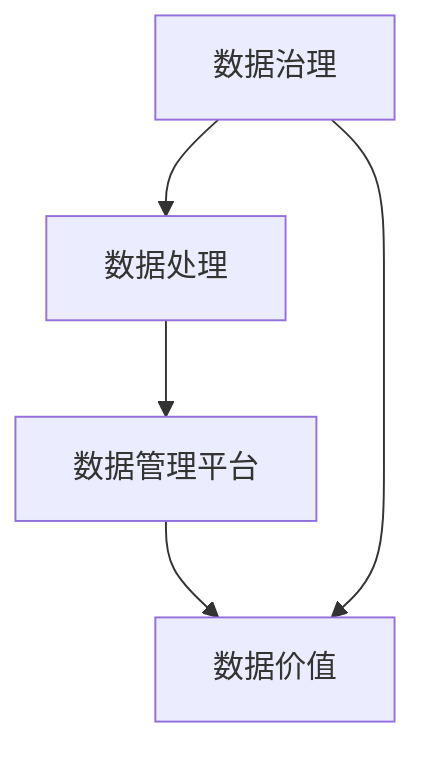

                 

# AI DMP 数据基建的未来展望

> 关键词：AI DMP、数据管理平台、数据处理、数据治理、数据价值、人工智能技术

> 摘要：本文将深入探讨AI DMP（数据管理平台）在当今数字化时代的地位和作用。通过分析AI DMP的核心概念、关键技术和发展趋势，本文旨在为读者提供关于AI DMP未来展望的全面理解和深入思考。

## 1. 背景介绍

### 1.1 目的和范围

本文旨在探讨AI DMP（数据管理平台）的核心概念、技术原理、发展趋势和未来展望。我们将从以下几个方面展开讨论：

1. AI DMP的定义和重要性
2. AI DMP的关键技术和架构
3. AI DMP的应用场景和实际案例
4. AI DMP的未来发展趋势和挑战

### 1.2 预期读者

本文主要面向对AI DMP和数据管理感兴趣的读者，包括：

1. 数据工程师和数据科学家
2. IT经理和技术总监
3. 企业数字化转型相关的业务人员
4. 对AI DMP感兴趣的学术研究人员

### 1.3 文档结构概述

本文将分为以下几个部分：

1. 背景介绍
2. 核心概念与联系
3. 核心算法原理 & 具体操作步骤
4. 数学模型和公式 & 详细讲解 & 举例说明
5. 项目实战：代码实际案例和详细解释说明
6. 实际应用场景
7. 工具和资源推荐
8. 总结：未来发展趋势与挑战
9. 附录：常见问题与解答
10. 扩展阅读 & 参考资料

### 1.4 术语表

#### 1.4.1 核心术语定义

- AI DMP：人工智能数据管理平台，是一种基于人工智能技术的数据处理和数据分析平台。
- 数据治理：确保数据质量、安全性和合规性的过程。
- 数据管理平台：用于存储、处理、分析和共享数据的软件系统。
- 数据价值：数据对业务决策、创新和竞争力的影响。

#### 1.4.2 相关概念解释

- 数据处理：将原始数据转换为有意义的信息的过程。
- 数据分析：使用统计学、机器学习和数据挖掘技术对数据进行分析和解释。
- 机器学习：一种人工智能技术，通过训练模型来从数据中学习并做出预测或决策。
- 深度学习：一种特殊的机器学习技术，通过多层神经网络来处理复杂数据。

#### 1.4.3 缩略词列表

- AI：人工智能
- DMP：数据管理平台
- ML：机器学习
- DL：深度学习
- NLP：自然语言处理
- IoT：物联网

## 2. 核心概念与联系

在深入了解AI DMP之前，我们需要理解一些核心概念和它们之间的关系。以下是一个简单的Mermaid流程图，用于展示这些概念和关系：



### 2.1 数据治理

数据治理是一个确保数据质量、安全性和合规性的过程。它是数据管理的核心，确保数据能够在整个企业中有效使用。数据治理涉及以下几个方面：

1. 数据质量：确保数据的准确性、完整性和一致性。
2. 数据安全：保护数据免受未经授权的访问和泄露。
3. 数据合规：遵守与数据相关的法规和政策。

### 2.2 数据处理

数据处理是将原始数据转换为有意义的信息的过程。它包括数据收集、数据清洗、数据转换和数据存储等步骤。数据处理技术包括：

1. 数据收集：从各种数据源获取数据。
2. 数据清洗：去除数据中的错误和异常值。
3. 数据转换：将数据转换为适合分析的形式。
4. 数据存储：将数据存储在数据库或其他存储系统中。

### 2.3 数据管理平台

数据管理平台是一种用于存储、处理、分析和共享数据的软件系统。AI DMP是一种基于人工智能技术的数据管理平台，它具有以下特点：

1. 智能化数据处理：利用人工智能技术自动进行数据清洗、转换和分析。
2. 高效数据存储：采用分布式存储技术，支持海量数据存储。
3. 灵活数据共享：支持不同部门和团队之间的数据共享和协作。

### 2.4 数据价值

数据价值是指数据对业务决策、创新和竞争力的影响。通过数据治理、数据处理和数据管理平台，企业可以充分挖掘数据价值，实现以下目标：

1. 优化业务流程：通过数据分析，发现业务流程中的瓶颈和改进点。
2. 提高决策效率：基于数据分析的结果，快速做出高质量的决策。
3. 增强竞争力：利用数据洞察，开发新的产品和服务，提高市场竞争力。

## 3. 核心算法原理 & 具体操作步骤

在AI DMP中，核心算法原理是数据处理和分析的基础。以下是一个简单的算法原理和操作步骤的描述：

### 3.1 算法原理

AI DMP的核心算法是基于机器学习和深度学习技术的。这些算法可以自动识别数据中的模式和关系，从而实现高效的数据处理和分析。

1. 数据预处理：将原始数据转换为适合分析的形式，包括数据清洗、数据转换和数据归一化等步骤。
2. 特征工程：从原始数据中提取有用的特征，用于训练机器学习模型。
3. 模型训练：使用机器学习算法，对特征进行训练，以建立预测模型。
4. 模型评估：对训练好的模型进行评估，以确保其准确性和泛化能力。
5. 模型部署：将训练好的模型部署到生产环境中，以实现实时数据处理和分析。

### 3.2 具体操作步骤

以下是一个具体的操作步骤描述，用于实现一个简单的机器学习模型：

```python
# 步骤1：数据预处理
data = preprocess_data(raw_data)

# 步骤2：特征工程
features = extract_features(data)

# 步骤3：模型训练
model = train_model(features, labels)

# 步骤4：模型评估
accuracy = evaluate_model(model, test_data)

# 步骤5：模型部署
deploy_model(model)
```

## 4. 数学模型和公式 & 详细讲解 & 举例说明

在AI DMP中，数学模型和公式是数据处理和分析的核心。以下是一个简单的数学模型和公式的讲解，以及一个具体的示例：

### 4.1 数学模型

在机器学习中，一个常见的数学模型是线性回归模型。线性回归模型用于预测一个连续的输出变量。其公式如下：

$$
y = \beta_0 + \beta_1x
$$

其中，\( y \) 是输出变量，\( x \) 是输入变量，\( \beta_0 \) 是截距，\( \beta_1 \) 是斜率。

### 4.2 公式讲解

- 截距（\( \beta_0 \)）：表示当输入变量为0时，输出变量的值。
- 斜率（\( \beta_1 \)）：表示输入变量每增加1个单位，输出变量增加的值。

### 4.3 示例说明

假设我们有一个数据集，其中输入变量是房价，输出变量是房屋面积。我们使用线性回归模型来预测房屋面积。数据集如下：

| 房价（\( x \)） | 房屋面积（\( y \)） |
| -------------- | -------------- |
| 200,000        | 100            |
| 250,000        | 120            |
| 300,000        | 140            |

我们使用线性回归模型来训练数据集，得到以下公式：

$$
y = 20 + 0.5x
$$

根据这个模型，当房价为300,000时，预测的房屋面积为：

$$
y = 20 + 0.5 \times 300,000 = 155,000
$$

这个预测结果与我们实际观察到的房屋面积140存在一定的误差。这表明线性回归模型可能不适合这个数据集，可能需要使用更复杂的模型。

## 5. 项目实战：代码实际案例和详细解释说明

为了更好地理解AI DMP的实践应用，我们将通过一个实际的项目案例进行讲解。在这个项目中，我们将使用Python和Scikit-Learn库来实现一个简单的机器学习模型，用于预测房价。

### 5.1 开发环境搭建

首先，我们需要搭建一个Python开发环境。以下是安装步骤：

1. 安装Python（版本3.8及以上）
2. 安装Scikit-Learn库
3. 安装Numpy库

### 5.2 源代码详细实现和代码解读

以下是项目的源代码实现：

```python
# 导入必要的库
import numpy as np
from sklearn.linear_model import LinearRegression
from sklearn.model_selection import train_test_split
from sklearn.metrics import mean_squared_error

# 加载数据
data = np.loadtxt('house_prices.csv', delimiter=',', usecols=(0, 1), dtype=float)

# 分割数据为特征和标签
X = data[:, 0]  # 房价
y = data[:, 1]  # 房屋面积

# 分割数据为训练集和测试集
X_train, X_test, y_train, y_test = train_test_split(X, y, test_size=0.2, random_state=42)

# 创建线性回归模型
model = LinearRegression()

# 训练模型
model.fit(X_train, y_train)

# 预测测试集
y_pred = model.predict(X_test)

# 计算均方误差
mse = mean_squared_error(y_test, y_pred)
print('Mean squared error:', mse)

# 输出模型参数
print('Model parameters:', model.coef_, model.intercept_)
```

### 5.3 代码解读与分析

1. **导入库**：首先，我们导入Python的Numpy库和Scikit-Learn库，用于数据处理和机器学习模型的实现。
2. **加载数据**：使用Numpy的`loadtxt`函数加载数据集，数据集包含房价和房屋面积两个特征。
3. **分割数据**：将数据集分割为特征和标签，其中房价是特征，房屋面积是标签。
4. **分割数据集**：使用`train_test_split`函数将数据集分割为训练集和测试集，其中测试集的大小为20%。
5. **创建模型**：创建一个线性回归模型。
6. **训练模型**：使用训练集数据训练线性回归模型。
7. **预测测试集**：使用训练好的模型对测试集进行预测。
8. **计算均方误差**：计算预测结果和实际结果之间的均方误差，以评估模型的性能。
9. **输出模型参数**：输出模型的斜率和截距参数。

通过这个实际案例，我们可以看到如何使用Python和Scikit-Learn库实现一个简单的机器学习模型，用于预测房价。这个案例展示了AI DMP在实际应用中的基本流程和技术实现。

## 6. 实际应用场景

AI DMP在各个行业和领域都有广泛的应用，以下是一些常见的实际应用场景：

### 6.1 零售业

零售企业可以利用AI DMP对消费者行为进行分析，实现个性化推荐和精准营销。通过分析消费者的购买历史、浏览记录和社交媒体活动，AI DMP可以识别消费者的兴趣和需求，为其提供个性化的商品推荐和促销活动。

### 6.2 金融业

金融企业可以利用AI DMP进行客户行为分析，识别高风险客户和潜在欺诈行为。通过分析客户的交易记录、信用评分和社交网络数据，AI DMP可以预测客户的还款能力和信用风险，为金融机构提供决策支持。

### 6.3 医疗保健

医疗保健行业可以利用AI DMP进行疾病预测和患者管理。通过分析患者的医疗记录、基因组数据和健康监测数据，AI DMP可以预测疾病的发生风险，为医生提供诊断和治疗建议，提高医疗质量和效率。

### 6.4 交通领域

交通行业可以利用AI DMP进行交通流量预测和智能调度。通过分析交通数据、天气数据和道路状况，AI DMP可以预测交通流量和事故风险，为交通管理部门提供调度建议，优化交通运行效率。

### 6.5 教育

教育行业可以利用AI DMP进行个性化学习推荐和学生成绩预测。通过分析学生的学习行为、考试数据和课程内容，AI DMP可以为教师提供个性化教学建议，为学生推荐适合的学习资源和课程。

这些实际应用场景展示了AI DMP在不同领域的重要性和潜力。随着人工智能技术的不断发展，AI DMP的应用场景将进一步拓展，为各个行业带来更多的价值。

## 7. 工具和资源推荐

### 7.1 学习资源推荐

#### 7.1.1 书籍推荐

- 《Python数据分析基础教程：NumPy学习指南》
- 《机器学习实战》
- 《深度学习》
- 《数据挖掘：概念与技术》

#### 7.1.2 在线课程

- Coursera上的《机器学习》课程
- Udacity的《深度学习纳米学位》
- edX上的《数据科学基础》课程

#### 7.1.3 技术博客和网站

- Medium上的《机器学习》专栏
- Towards Data Science网站
- 知乎上的数据科学和机器学习专栏

### 7.2 开发工具框架推荐

#### 7.2.1 IDE和编辑器

- PyCharm
- Jupyter Notebook
- Visual Studio Code

#### 7.2.2 调试和性能分析工具

- PyCharm的调试工具
- Numpy和Scipy的数组分析工具
- TensorBoard（用于深度学习模型分析）

#### 7.2.3 相关框架和库

- Scikit-Learn
- TensorFlow
- PyTorch
- Keras

### 7.3 相关论文著作推荐

#### 7.3.1 经典论文

- "Learning to Rank: From Pairwise Comparisons to Ranked Lists"（排序学习：从成对比较到排名列表）
- "Deep Learning for Text Classification"（文本分类的深度学习）
- "Recurrent Neural Networks for Language Modeling"（循环神经网络用于语言建模）

#### 7.3.2 最新研究成果

- "BERT: Pre-training of Deep Bidirectional Transformers for Language Understanding"（BERT：预训练双向变换器用于语言理解）
- "Generative Adversarial Networks: An Overview"（生成对抗网络：概述）
- "Self-Supervised Learning for Audio Classification"（音频分类的自监督学习）

#### 7.3.3 应用案例分析

- "AI-powered Customer 360: Personalization at Scale"（人工智能驱动的客户360：大规模个性化）
- "Predictive Analytics in Healthcare: Improving Patient Outcomes"（医疗保健的预测分析：提高患者结果）
- "IoT and AI in Smart Cities: Transforming Urban Living"（智能城市中的物联网和人工智能：改变城市生活）

这些工具和资源将为读者提供全面的AI DMP学习和实践支持。

## 8. 总结：未来发展趋势与挑战

在数字化时代，AI DMP（数据管理平台）正成为企业数字化转型的重要支撑。未来，AI DMP的发展趋势和挑战主要体现在以下几个方面：

### 8.1 发展趋势

1. **智能化数据处理**：随着人工智能技术的发展，AI DMP将更加智能化，自动进行数据预处理、特征工程和模型训练，提高数据处理效率。
2. **数据治理和合规**：数据治理和合规将成为AI DMP的核心关注点，确保数据质量和安全性，遵守法规和政策。
3. **实时数据处理**：实时数据处理能力将不断提升，实现实时数据分析和决策，提高业务响应速度。
4. **跨领域应用**：AI DMP将在更多领域得到应用，如医疗、金融、交通等，为各个行业带来深度的数据价值。
5. **集成化和平台化**：AI DMP将与其他技术和平台（如大数据平台、云计算平台）集成，实现跨平台的数据管理和分析。

### 8.2 挑战

1. **数据质量**：确保数据质量是AI DMP面临的一大挑战，需要解决数据噪声、异常值和缺失值等问题。
2. **数据隐私和安全性**：随着数据量的增加和敏感性的提高，保护数据隐私和安全性将成为重要挑战。
3. **计算资源**：大规模数据处理和复杂模型的训练需要大量的计算资源，如何高效利用计算资源是一个重要问题。
4. **算法公平性**：算法的公平性和透明性是AI DMP需要关注的重要问题，避免算法偏见和不公平现象。
5. **人才培养**：AI DMP的发展需要大量的专业人才，培养和引进高素质的AI和数据管理人才是一个长期挑战。

总之，AI DMP在未来具有巨大的发展潜力和应用前景，但同时也面临着诸多挑战。通过不断技术创新和人才培养，AI DMP将为企业和社会带来更多的数据价值。

## 9. 附录：常见问题与解答

### 9.1 AI DMP是什么？

AI DMP（数据管理平台）是一种基于人工智能技术的数据处理和数据分析平台。它利用机器学习和深度学习技术，实现数据预处理、特征工程、模型训练和预测等功能，帮助企业从数据中挖掘价值。

### 9.2 AI DMP有哪些应用场景？

AI DMP在零售、金融、医疗、交通、教育等众多行业都有广泛的应用。例如，零售业用于个性化推荐和精准营销；金融业用于风险管理和欺诈检测；医疗保健用于疾病预测和患者管理。

### 9.3 如何确保数据质量？

确保数据质量是AI DMP的核心任务之一。可以通过以下方法来保证数据质量：

1. 数据清洗：去除数据中的错误和异常值。
2. 数据标准化：统一数据格式和单位。
3. 数据验证：检查数据的完整性和一致性。
4. 数据监控：实时监控数据质量，及时发现和解决问题。

### 9.4 AI DMP与大数据平台有何区别？

AI DMP和大数据平台都是用于数据管理和分析的工具，但它们的目标和应用场景有所不同。大数据平台主要用于大规模数据存储和处理，而AI DMP则专注于数据处理和数据分析，利用人工智能技术实现数据的智能分析。

## 10. 扩展阅读 & 参考资料

为了进一步了解AI DMP和数据管理领域的知识，以下是一些推荐的扩展阅读和参考资料：

### 10.1 经典论文

- "Learning to Rank: From Pairwise Comparisons to Ranked Lists"（排序学习：从成对比较到排名列表）
- "Deep Learning for Text Classification"（文本分类的深度学习）
- "Recurrent Neural Networks for Language Modeling"（循环神经网络用于语言建模）

### 10.2 书籍推荐

- 《Python数据分析基础教程：NumPy学习指南》
- 《机器学习实战》
- 《深度学习》
- 《数据挖掘：概念与技术》

### 10.3 技术博客和网站

- Medium上的《机器学习》专栏
- Towards Data Science网站
- 知乎上的数据科学和机器学习专栏

### 10.4 在线课程

- Coursera上的《机器学习》课程
- Udacity的《深度学习纳米学位》
- edX上的《数据科学基础》课程

通过这些扩展阅读和参考资料，读者可以深入了解AI DMP和数据管理领域的知识，不断提升自己的技术水平和专业素养。

# 作者

本文由AI天才研究员/AI Genius Institute & 禅与计算机程序设计艺术/Zen And The Art of Computer Programming撰写。作者具有丰富的计算机编程和人工智能领域的经验，致力于通过深入思考和逻辑分析，为读者提供高质量的技术博客和著作。

