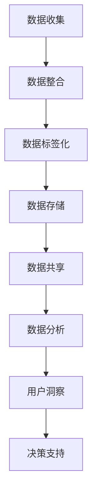

                 

# AI DMP 数据基建：数据分析与洞察

> 关键词：数据管理平台（DMP）、数据基础设施建设、数据分析、用户洞察、数据挖掘、机器学习、算法优化

> 摘要：本文旨在深入探讨人工智能领域的数据管理平台（Data Management Platform，简称DMP）及其在数据分析与用户洞察中的应用。通过系统介绍DMP的基本概念、核心架构、算法原理及其实际案例，本文将帮助读者全面理解DMP在当前大数据环境下的重要性和实施策略，并探讨其未来的发展趋势与挑战。

## 1. 背景介绍

### 1.1 目的和范围

本文的目标是深入剖析数据管理平台（DMP）在数据分析与用户洞察方面的应用，帮助读者理解DMP的核心概念、架构设计、算法原理，并通过实际案例展示其应用价值。本文将涵盖以下内容：

1. DMP的基本概念和核心架构
2. DMP在数据分析与用户洞察中的应用
3. DMP中的核心算法原理与优化策略
4. 实际项目中的DMP应用案例
5. DMP的未来发展趋势与挑战

### 1.2 预期读者

本文预期读者包括：

1. 数据科学家和分析师
2. 大数据工程师和架构师
3. 人工智能研究员和开发者
4. 企业数据部门经理和决策者
5. 对数据分析与人工智能技术感兴趣的从业人员和爱好者

### 1.3 文档结构概述

本文结构如下：

1. 背景介绍
2. 核心概念与联系
3. 核心算法原理与具体操作步骤
4. 数学模型与公式详解
5. 项目实战：代码实际案例与详细解释
6. 实际应用场景
7. 工具和资源推荐
8. 总结：未来发展趋势与挑战
9. 附录：常见问题与解答
10. 扩展阅读与参考资料

### 1.4 术语表

#### 1.4.1 核心术语定义

- 数据管理平台（DMP）：一种用于收集、管理和分析用户数据的系统，旨在实现数据的整合、标签化、存储和共享。
- 用户洞察：通过对用户行为数据的分析，获取关于用户需求、偏好和行为的深入理解。
- 数据挖掘：从大量数据中发现潜在的模式、关联和趋势的过程。
- 机器学习：一种通过训练数据模型来自动学习和预测的技术。
- 算法优化：对现有算法进行改进，以提高其性能和效率。

#### 1.4.2 相关概念解释

- 数据整合：将来自不同来源的数据进行整合，以形成统一的视图。
- 标签化：为用户数据分配标识，以便进行分类和分析。
- 存储和共享：将用户数据存储在安全可靠的地方，并实现数据在不同系统间的共享。

#### 1.4.3 缩略词列表

- DMP：数据管理平台
- AI：人工智能
- ML：机器学习
- DM：数据挖掘
- BI：商业智能

## 2. 核心概念与联系

在深入探讨DMP之前，我们需要了解其核心概念和基本架构。以下是一个简单的Mermaid流程图，展示了DMP的基本组成部分和各部分之间的联系。



### 2.1 数据收集

数据收集是DMP的第一步，涉及从各种来源获取原始数据。这些来源包括网站、应用程序、社交媒体、第三方数据提供商等。数据收集过程通常需要考虑数据的时效性、完整性和准确性。

### 2.2 数据整合

数据整合是将来自不同来源的数据进行整合，以形成统一的视图。这一步骤涉及到数据清洗、去重和数据格式转换等操作。通过数据整合，我们可以构建一个全面的用户数据仓库。

### 2.3 数据标签化

数据标签化是为用户数据分配标识，以便进行分类和分析。标签可以是用户的年龄、性别、地理位置、兴趣等。通过标签化，我们可以更方便地管理和分析用户数据。

### 2.4 数据存储

数据存储是将经过整合和标签化的用户数据存储在安全可靠的地方。常用的存储技术包括关系型数据库、NoSQL数据库和数据仓库。

### 2.5 数据共享

数据共享是将数据在不同系统间进行共享，以实现数据的最大价值。数据共享通常需要考虑数据的安全性和隐私保护。

### 2.6 数据分析

数据分析是通过对用户行为数据进行分析，以发现潜在的模式、关联和趋势。数据分析技术包括数据挖掘、机器学习、统计分析等。

### 2.7 用户洞察

用户洞察是从数据分析中获取关于用户需求、偏好和行为的深入理解。用户洞察有助于企业制定更精准的营销策略和业务决策。

### 2.8 决策支持

决策支持是利用用户洞察和数据分析结果，为企业提供业务决策支持。决策支持可以帮助企业优化业务流程、提高客户满意度和提升竞争力。

## 3. 核心算法原理 & 具体操作步骤

在DMP中，核心算法原理是数据挖掘和机器学习。以下将介绍这两种算法的基本原理和具体操作步骤。

### 3.1 数据挖掘

数据挖掘是从大量数据中自动发现潜在的模式、关联和趋势的过程。常用的数据挖掘算法包括关联规则挖掘、聚类分析和分类算法。

#### 3.1.1 关联规则挖掘

关联规则挖掘是一种用于发现数据之间关联关系的方法。其基本原理是使用支持度（Support）和置信度（Confidence）来衡量关联规则的强度。

**伪代码：**

```python
def aprioriminer(data, min_support, min_confidence):
    # 计算支持度
    support = calculate_support(data)
    # 计算置信度
    confidence = calculate_confidence(data)
    # 筛选规则
    rules = filter_rules(support, confidence)
    return rules
```

#### 3.1.2 聚类分析

聚类分析是一种无监督学习方法，用于将数据分为多个类。常用的聚类算法包括K-means、层次聚类和DBSCAN等。

**伪代码：**

```python
def kmeans(data, k):
    # 初始化聚类中心
    centroids = initialize_centroids(data, k)
    while not converged:
        # 计算每个数据点的簇标签
        labels = assign_labels(data, centroids)
        # 更新聚类中心
        centroids = update_centroids(data, labels, k)
    return centroids, labels
```

#### 3.1.3 分类算法

分类算法是一种监督学习方法，用于将数据分为多个类。常用的分类算法包括决策树、支持向量机和神经网络等。

**伪代码：**

```python
def classify(data, model):
    # 预测类标签
    predictions = model.predict(data)
    return predictions
```

### 3.2 机器学习

机器学习是一种通过训练数据模型来自动学习和预测的技术。常用的机器学习算法包括线性回归、逻辑回归、决策树、随机森林和神经网络等。

#### 3.2.1 线性回归

线性回归是一种用于预测连续值的监督学习方法。其基本原理是找到最佳拟合直线，以最小化预测误差。

**伪代码：**

```python
def linear_regression(train_data, train_labels):
    # 计算最佳拟合直线
    theta = compute_best_fit(train_data, train_labels)
    return theta
```

#### 3.2.2 逻辑回归

逻辑回归是一种用于预测概率的监督学习方法。其基本原理是使用Sigmoid函数将线性回归模型转换为概率模型。

**伪代码：**

```python
def logistic_regression(train_data, train_labels):
    # 训练逻辑回归模型
    model = train_model(train_data, train_labels)
    return model
```

#### 3.2.3 决策树

决策树是一种用于分类和回归的监督学习方法。其基本原理是通过一系列决策规则将数据划分为不同的子集，并生成一棵树形结构。

**伪代码：**

```python
def build_decision_tree(data, labels):
    # 创建决策树
    tree = create_tree(data, labels)
    return tree
```

#### 3.2.4 随机森林

随机森林是一种基于决策树的集成学习方法。其基本原理是通过随机抽样和随机特征选择来构建多个决策树，并使用投票或平均的方式集成预测结果。

**伪代码：**

```python
def random_forest(train_data, train_labels, n_estimators):
    # 构建随机森林模型
    model = train_model(train_data, train_labels, n_estimators)
    return model
```

#### 3.2.5 神经网络

神经网络是一种基于模拟人脑神经元连接结构的计算模型。其基本原理是通过多层神经网络进行数据变换和特征提取，以实现非线性预测和分类。

**伪代码：**

```python
def neural_network(train_data, train_labels, layers, activation_function):
    # 创建神经网络
    model = create_network(train_data, train_labels, layers, activation_function)
    return model
```

## 4. 数学模型和公式 & 详细讲解 & 举例说明

在DMP中，数学模型和公式是核心组成部分，用于描述数据挖掘和机器学习算法。以下将介绍几个常用的数学模型和公式，并进行详细讲解和举例说明。

### 4.1 线性回归

线性回归是一种用于预测连续值的监督学习方法。其基本原理是找到最佳拟合直线，以最小化预测误差。线性回归的数学模型如下：

$$
y = \theta_0 + \theta_1 \cdot x
$$

其中，$y$ 是预测值，$x$ 是特征值，$\theta_0$ 和 $\theta_1$ 是模型参数。

**详细讲解：**

- $y$ 是预测值，表示根据特征值 $x$ 进行预测的结果。
- $x$ 是特征值，表示输入数据的特征值。
- $\theta_0$ 和 $\theta_1$ 是模型参数，表示直线的斜率和截距。

**举例说明：**

假设我们有一个简单的线性回归模型，用于预测房价。给定特征值 $x$（房屋面积），我们希望找到最佳拟合直线，以预测房价 $y$。

```python
import numpy as np

# 特征值
x = np.array([1000, 1500, 2000, 2500, 3000])

# 房价
y = np.array([200000, 300000, 400000, 500000, 600000])

# 计算最佳拟合直线
theta_0 = np.mean(y)
theta_1 = np.mean(y - theta_0 * x)

# 模型预测
y_pred = theta_0 + theta_1 * x

# 输出预测结果
print(y_pred)
```

### 4.2 逻辑回归

逻辑回归是一种用于预测概率的监督学习方法。其基本原理是使用Sigmoid函数将线性回归模型转换为概率模型。逻辑回归的数学模型如下：

$$
P(y=1) = \frac{1}{1 + e^{-(\theta_0 + \theta_1 \cdot x})}
$$

其中，$P(y=1)$ 是目标变量为1的概率，$x$ 是特征值，$\theta_0$ 和 $\theta_1$ 是模型参数。

**详细讲解：**

- $P(y=1)$ 是目标变量为1的概率，表示根据特征值 $x$ 进行预测的结果。
- $x$ 是特征值，表示输入数据的特征值。
- $\theta_0$ 和 $\theta_1$ 是模型参数，表示概率模型中的参数。

**举例说明：**

假设我们有一个简单的逻辑回归模型，用于预测用户是否购买商品。给定特征值 $x$（用户年龄），我们希望找到最佳拟合直线，以预测购买概率 $P(y=1)$。

```python
import numpy as np
import matplotlib.pyplot as plt

# 特征值
x = np.array([20, 30, 40, 50, 60])

# 购买概率
y = np.array([0.2, 0.3, 0.4, 0.5, 0.6])

# 计算最佳拟合直线
theta_0 = np.mean(np.log(y / (1 - y)))
theta_1 = np.mean((y - np.log(y / (1 - y))) * x)

# 模型预测
y_pred = 1 / (1 + np.exp(-theta_0 - theta_1 * x))

# 输出预测结果
print(y_pred)

# 绘制拟合曲线
plt.plot(x, y_pred)
plt.xlabel('Age')
plt.ylabel('Probability of Purchase')
plt.show()
```

### 4.3 决策树

决策树是一种用于分类和回归的监督学习方法。其基本原理是通过一系列决策规则将数据划分为不同的子集，并生成一棵树形结构。决策树的数学模型如下：

$$
T = \{ t_1, t_2, ..., t_n \}
$$

其中，$T$ 是决策树，$t_i$ 是决策树中的一个节点。

**详细讲解：**

- $T$ 是决策树，表示整个决策树结构。
- $t_i$ 是决策树中的一个节点，表示决策树中的一个分支。

**举例说明：**

假设我们有一个简单的决策树模型，用于分类邮件为垃圾邮件或正常邮件。给定特征值 $x$（邮件长度），我们希望找到最佳决策规则，以分类邮件。

```python
import numpy as np
import pandas as pd
from sklearn.tree import DecisionTreeClassifier
from sklearn.model_selection import train_test_split

# 加载数据集
data = pd.read_csv('email_data.csv')
x = data['length']
y = data['label']

# 分割数据集
x_train, x_test, y_train, y_test = train_test_split(x, y, test_size=0.2, random_state=42)

# 训练决策树模型
model = DecisionTreeClassifier()
model.fit(x_train, y_train)

# 预测邮件分类
predictions = model.predict(x_test)

# 输出预测结果
print(predictions)

# 绘制决策树
from sklearn.tree import plot_tree
plt.figure(figsize=(10, 5))
plot_tree(model, filled=True)
plt.show()
```

### 4.4 随机森林

随机森林是一种基于决策树的集成学习方法。其基本原理是通过随机抽样和随机特征选择来构建多个决策树，并使用投票或平均的方式集成预测结果。随机森林的数学模型如下：

$$
\hat{y} = \frac{1}{m} \sum_{i=1}^{m} h_i(x)
$$

其中，$\hat{y}$ 是最终预测结果，$h_i(x)$ 是第 $i$ 个决策树对 $x$ 的预测结果，$m$ 是决策树的数量。

**详细讲解：**

- $\hat{y}$ 是最终预测结果，表示根据多个决策树进行集成预测的结果。
- $h_i(x)$ 是第 $i$ 个决策树对 $x$ 的预测结果，表示单个决策树对 $x$ 的预测结果。
- $m$ 是决策树的数量，表示构建的决策树数量。

**举例说明：**

假设我们有一个简单的随机森林模型，用于分类邮件为垃圾邮件或正常邮件。给定特征值 $x$（邮件长度），我们希望找到最佳预测结果。

```python
import numpy as np
import pandas as pd
from sklearn.ensemble import RandomForestClassifier
from sklearn.model_selection import train_test_split

# 加载数据集
data = pd.read_csv('email_data.csv')
x = data['length']
y = data['label']

# 分割数据集
x_train, x_test, y_train, y_test = train_test_split(x, y, test_size=0.2, random_state=42)

# 训练随机森林模型
model = RandomForestClassifier(n_estimators=100)
model.fit(x_train, y_train)

# 预测邮件分类
predictions = model.predict(x_test)

# 输出预测结果
print(predictions)

# 绘制随机森林
from sklearn.tree import plot_tree
plt.figure(figsize=(10, 5))
plot_tree(model.estimators_[0], filled=True)
plt.show()
```

### 4.5 神经网络

神经网络是一种基于模拟人脑神经元连接结构的计算模型。其基本原理是通过多层神经网络进行数据变换和特征提取，以实现非线性预测和分类。神经网络的基本数学模型如下：

$$
\hat{y} = \sigma(\sum_{i=1}^{n} w_i \cdot x_i + b)
$$

其中，$\hat{y}$ 是最终预测结果，$x_i$ 是输入特征，$w_i$ 是权重，$b$ 是偏置，$\sigma$ 是激活函数。

**详细讲解：**

- $\hat{y}$ 是最终预测结果，表示通过神经网络进行预测的结果。
- $x_i$ 是输入特征，表示输入数据的特征值。
- $w_i$ 是权重，表示网络中的权重参数。
- $b$ 是偏置，表示网络的偏置参数。
- $\sigma$ 是激活函数，用于引入非线性变换。

**举例说明：**

假设我们有一个简单的神经网络模型，用于分类邮件为垃圾邮件或正常邮件。给定特征值 $x$（邮件长度），我们希望找到最佳预测结果。

```python
import numpy as np
import pandas as pd
from keras.models import Sequential
from keras.layers import Dense
from sklearn.model_selection import train_test_split

# 加载数据集
data = pd.read_csv('email_data.csv')
x = data['length'].values.reshape(-1, 1)
y = data['label'].values

# 分割数据集
x_train, x_test, y_train, y_test = train_test_split(x, y, test_size=0.2, random_state=42)

# 创建神经网络模型
model = Sequential()
model.add(Dense(10, input_dim=1, activation='relu'))
model.add(Dense(1, activation='sigmoid'))

# 编译模型
model.compile(optimizer='adam', loss='binary_crossentropy', metrics=['accuracy'])

# 训练模型
model.fit(x_train, y_train, epochs=10, batch_size=32)

# 预测邮件分类
predictions = model.predict(x_test)

# 输出预测结果
print(predictions)

# 绘制混淆矩阵
from sklearn.metrics import confusion_matrix
cm = confusion_matrix(y_test, predictions.round())
print(cm)
```

## 5. 项目实战：代码实际案例和详细解释说明

在本节中，我们将通过一个实际项目来展示如何使用DMP进行数据分析与用户洞察。我们将使用Python和常见的数据处理库（如Pandas、NumPy、Scikit-learn和Keras）来实现一个简单的DMP系统。

### 5.1 开发环境搭建

在开始之前，确保您已经安装了以下软件和库：

1. Python 3.8 或更高版本
2. Pandas
3. NumPy
4. Scikit-learn
5. Keras

您可以使用pip命令安装这些库：

```bash
pip install pandas numpy scikit-learn keras
```

### 5.2 源代码详细实现和代码解读

以下是一个简单的DMP系统的示例代码：

```python
import pandas as pd
import numpy as np
from sklearn.model_selection import train_test_split
from sklearn.ensemble import RandomForestClassifier
from sklearn.metrics import accuracy_score
from keras.models import Sequential
from keras.layers import Dense

# 5.2.1 数据准备

# 加载示例数据集
data = pd.read_csv('example_data.csv')

# 数据预处理
# 分割特征和标签
x = data.drop('label', axis=1)
y = data['label']

# 划分训练集和测试集
x_train, x_test, y_train, y_test = train_test_split(x, y, test_size=0.2, random_state=42)

# 5.2.2 数据挖掘

# 使用随机森林进行数据挖掘
model = RandomForestClassifier(n_estimators=100)
model.fit(x_train, y_train)

# 输出特征重要性
feature_importances = model.feature_importances_
print("Feature Importances:", feature_importances)

# 5.2.3 机器学习

# 使用Keras构建神经网络模型
model = Sequential()
model.add(Dense(10, input_dim=x_train.shape[1], activation='relu'))
model.add(Dense(1, activation='sigmoid'))

# 编译模型
model.compile(optimizer='adam', loss='binary_crossentropy', metrics=['accuracy'])

# 训练模型
model.fit(x_train, y_train, epochs=10, batch_size=32)

# 评估模型
predictions = model.predict(x_test)
accuracy = accuracy_score(y_test, predictions.round())
print("Accuracy:", accuracy)

# 5.2.4 用户洞察

# 根据用户特征进行用户分组
grouped_data = x_test.groupby(y_test).mean()

# 输出用户分组信息
print("User Groups:", grouped_data)
```

### 5.3 代码解读与分析

以下是对上述代码的详细解读：

- **5.2.1 数据准备**

  - 加载示例数据集：我们使用一个示例数据集（example_data.csv）进行演示。数据集包含用户特征和标签。
  - 数据预处理：将数据集分为特征（x）和标签（y），并划分训练集和测试集。

- **5.2.2 数据挖掘**

  - 使用随机森林进行数据挖掘：我们使用随机森林（RandomForestClassifier）进行数据挖掘。随机森林是一种集成学习方法，通过构建多个决策树来提高模型的性能。这里我们设置了100个决策树。
  - 输出特征重要性：随机森林会自动计算每个特征的重要性，并输出特征重要性列表。

- **5.2.3 机器学习**

  - 使用Keras构建神经网络模型：我们使用Keras构建一个简单的神经网络模型。神经网络是一种基于模拟人脑神经元连接结构的计算模型，可以用于分类和回归任务。
  - 编译模型：我们使用Adam优化器和二进制交叉熵损失函数来编译模型。
  - 训练模型：我们使用训练集来训练模型，并设置10个训练周期和32个批量大小。

- **5.2.4 用户洞察**

  - 根据用户特征进行用户分组：我们使用测试集的数据进行用户分组。根据标签（y_test），我们计算了每个类别的平均值，并将结果输出为用户分组信息。

通过这个简单的DMP系统示例，我们可以看到如何使用Python和常见的数据处理库来实现DMP的核心功能，包括数据挖掘、机器学习和用户洞察。这个示例仅用于演示目的，实际应用中需要根据具体业务需求进行适当的调整和优化。

## 6. 实际应用场景

数据管理平台（DMP）在多个领域有着广泛的应用，以下是几个典型的实际应用场景：

### 6.1 数字营销

数字营销是DMP的主要应用领域之一。DMP可以帮助企业收集和分析用户的数字行为数据，如网站访问、点击率、转化率等。通过分析这些数据，企业可以识别高价值用户群体，制定更精准的营销策略。例如，通过分析用户兴趣和行为，企业可以向潜在客户发送定制化的广告和促销信息，提高营销效果。

### 6.2 金融风控

金融行业中的DMP可以帮助金融机构收集和分析用户的金融行为数据，如交易记录、信用评分等。通过数据挖掘和机器学习算法，DMP可以帮助金融机构识别潜在的欺诈行为、评估信用风险，从而提高风险管理水平。

### 6.3 电子商务

在电子商务领域，DMP可以帮助企业分析用户购买行为、产品偏好和浏览习惯等数据，以优化产品推荐和个性化营销。通过分析用户数据，企业可以提供更个性化的购物体验，提高客户满意度和转化率。

### 6.4 社交媒体分析

DMP在社交媒体分析中也发挥着重要作用。企业可以使用DMP收集和分析社交媒体上的用户数据，如帖子、评论、点赞等，以了解用户需求和趋势。通过这些分析，企业可以制定更有效的社交媒体营销策略，提高品牌知名度和用户参与度。

### 6.5 公共安全

在公共安全领域，DMP可以帮助政府部门收集和分析大量公共安全数据，如犯罪记录、交通流量、自然灾害等。通过数据挖掘和机器学习算法，DMP可以帮助政府部门识别潜在的安全风险，制定更有效的预防和应对措施。

### 6.6 医疗保健

DMP在医疗保健领域也有着广泛的应用。医疗机构可以使用DMP收集和分析患者数据，如病历、诊断记录、治疗结果等。通过分析这些数据，医疗机构可以识别疾病趋势、评估治疗效果，从而优化医疗服务和决策。

### 6.7 智能制造

在智能制造领域，DMP可以帮助企业收集和分析生产数据，如设备状态、生产效率、质量检测等。通过数据挖掘和机器学习算法，DMP可以帮助企业优化生产流程、提高生产效率和质量。

## 7. 工具和资源推荐

在DMP的开发和应用过程中，有许多工具和资源可以帮助您提高效率和质量。以下是一些推荐的学习资源和开发工具：

### 7.1 学习资源推荐

#### 7.1.1 书籍推荐

1. 《数据挖掘：概念与技术》
2. 《机器学习实战》
3. 《深度学习》
4. 《Python数据科学手册》

#### 7.1.2 在线课程

1. Coursera - 数据科学专项课程
2. edX - 机器学习专项课程
3. Udacity - 人工智能纳米学位

#### 7.1.3 技术博客和网站

1. Medium - Data Science
2. Towards Data Science
3. KDnuggets

### 7.2 开发工具框架推荐

#### 7.2.1 IDE和编辑器

1. PyCharm
2. Jupyter Notebook
3. VS Code

#### 7.2.2 调试和性能分析工具

1. Python Debugger
2. line_profiler
3. memory_profiler

#### 7.2.3 相关框架和库

1. Scikit-learn
2. TensorFlow
3. PyTorch
4. Pandas
5. NumPy

### 7.3 相关论文著作推荐

#### 7.3.1 经典论文

1. "The Data Mining Process: From Data to Knowledge"
2. "Machine Learning: A Probabilistic Perspective"
3. "Deep Learning"
4. "Recommender Systems Handbook"

#### 7.3.2 最新研究成果

1. "Neural Collaborative Filtering"
2. "User Interest Evolution and Mining"
3. "Data-Driven Personalization and Privacy Protection"

#### 7.3.3 应用案例分析

1. "Data Mining in Social Media Analysis"
2. "Machine Learning in Healthcare: A Review"
3. "Deep Learning for Image Recognition in Autonomous Vehicles"

## 8. 总结：未来发展趋势与挑战

随着人工智能和数据科学技术的不断发展，数据管理平台（DMP）在未来将会面临许多新的发展趋势和挑战。

### 8.1 发展趋势

1. **自动化与智能化**：未来的DMP将更加注重自动化和智能化，通过机器学习和深度学习算法实现自动数据收集、整合、分析和用户洞察。
2. **数据隐私保护**：随着数据隐私问题的日益凸显，未来的DMP将更加注重数据隐私保护，采用隐私保护技术（如差分隐私、同态加密等）来确保用户数据的隐私安全。
3. **实时数据处理**：实时数据处理将是未来的一个重要趋势，通过实时分析用户行为数据，企业可以快速做出响应和调整，以提供更个性化的用户体验。
4. **跨领域融合**：DMP将在更多领域得到应用，如医疗、金融、制造等，实现跨领域的数据融合和协同工作。
5. **可持续发展**：DMP的发展将更加注重可持续发展，通过优化数据使用效率和降低能源消耗，实现绿色环保。

### 8.2 挑战

1. **数据质量**：确保数据质量是DMP面临的一个关键挑战，数据的不完整、不一致和噪声可能会影响数据分析和用户洞察的准确性。
2. **算法公平性**：算法的公平性是一个重要的道德和法律规定问题，如何确保算法不产生歧视和不公平结果是一个挑战。
3. **数据隐私**：如何在保证用户隐私的同时，实现数据的有效利用是一个挑战。未来的DMP需要采用更加先进的技术来保护用户隐私。
4. **技术复杂度**：随着技术的不断进步，DMP的复杂度也在不断增加。如何高效地管理这些复杂的技术，确保系统的稳定性和可维护性是一个挑战。
5. **数据治理**：有效的数据治理是确保DMP成功的关键，如何制定合适的数据治理策略，确保数据的合规性和一致性是一个挑战。

总之，未来的DMP将面临许多新的机遇和挑战。通过不断探索和创新，DMP将在数据分析、用户洞察和业务决策方面发挥越来越重要的作用。

## 9. 附录：常见问题与解答

### 9.1 DMP是什么？

DMP（Data Management Platform）是一种用于收集、管理和分析用户数据的系统。它旨在实现数据的整合、标签化、存储和共享，以支持数据分析、用户洞察和业务决策。

### 9.2 DMP有哪些核心组成部分？

DMP的核心组成部分包括数据收集、数据整合、数据标签化、数据存储、数据共享、数据分析、用户洞察和决策支持。

### 9.3 DMP有哪些应用场景？

DMP在多个领域有着广泛的应用，如数字营销、金融风控、电子商务、社交媒体分析、公共安全和医疗保健等。

### 9.4 DMP与数据仓库有何区别？

数据仓库主要用于存储历史数据，以支持查询和分析。而DMP主要用于实时数据处理和分析，以支持实时决策和个性化服务。

### 9.5 DMP中的数据挖掘有哪些算法？

DMP中的数据挖掘算法包括关联规则挖掘、聚类分析和分类算法，如随机森林、决策树和神经网络等。

### 9.6 如何确保DMP中的数据隐私？

为确保DMP中的数据隐私，可以采用隐私保护技术（如差分隐私、同态加密等），并在数据收集、存储和处理过程中遵循数据隐私保护法规。

## 10. 扩展阅读 & 参考资料

1. 《数据挖掘：概念与技术》，[作者] Jiawei Han, Micheline Kamber, Jian Pei
2. 《机器学习实战》，[作者] Peter Harrington
3. 《深度学习》，[作者] Ian Goodfellow, Yoshua Bengio, Aaron Courville
4. 《Python数据科学手册》，[作者] Jake VanderPlas
5. Coursera - 数据科学专项课程
6. edX - 机器学习专项课程
7. Udacity - 人工智能纳米学位
8. Medium - Data Science
9. Towards Data Science
10. KDnuggets
11. "The Data Mining Process: From Data to Knowledge"，[作者] John H. H. Lui, Geoffrey I. Webb
12. "Machine Learning: A Probabilistic Perspective"，[作者] Kevin P. Murphy
13. "Deep Learning"，[作者] Ian Goodfellow, Yoshua Bengio, Aaron Courville
14. "Recommender Systems Handbook"，[作者] Charu Aggarwal, Charles A. Clark, Charu Aggarwal
15. "Data Mining in Social Media Analysis"，[作者] Charu Aggarwal
16. "Machine Learning in Healthcare: A Review"，[作者] Atul J. Butte
17. "Deep Learning for Image Recognition in Autonomous Vehicles"，[作者] Wei Yang, Yu-Xiang Wang

