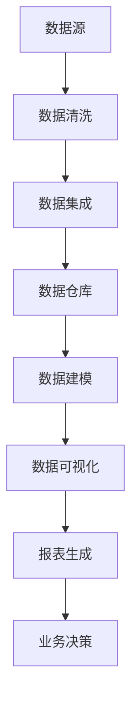

                 

# AI DMP 数据基建：数据可视化与报表

> 关键词：数据管理平台、数据可视化、报表、AI、数据分析、数据治理

> 摘要：本文深入探讨了AI驱动的数据管理平台（DMP）中的数据可视化与报表生成技术。首先介绍了DMP的基本概念与构建原则，随后详细解析了数据可视化、报表生成中的核心算法与数学模型。文章随后以具体案例展示了数据可视化与报表生成的实战应用，并针对实际开发中的环境搭建、代码实现和问题解决提出了建议。最后，对DMP的发展趋势、工具资源及相关研究进行了总结和推荐。

## 1. 背景介绍

### 1.1 目的和范围

本文旨在为AI领域的从业者和技术爱好者提供一份详尽的数据管理平台（DMP）数据可视化与报表生成的技术指南。通过深入剖析DMP的核心概念、技术原理以及实际应用，帮助读者理解如何利用DMP实现高效的数据管理、可视化分析和报表生成。本文涵盖了从基础概念到高级算法，从理论讲解到实践应用的全方位内容。

### 1.2 预期读者

本文适用于以下读者群体：

1. 数据科学和人工智能领域的研究者与工程师。
2. 数据管理平台和大数据项目的开发者。
3. 数据分析师和业务决策者，希望通过数据可视化辅助决策。
4. 对数据可视化与报表生成技术感兴趣的技术爱好者。

### 1.3 文档结构概述

本文结构如下：

1. **背景介绍**：介绍DMP、数据可视化与报表生成的背景、目的与读者群体。
2. **核心概念与联系**：阐述DMP中的核心概念与联系，并给出流程图。
3. **核心算法原理与具体操作步骤**：详细讲解数据可视化与报表生成的核心算法原理，并给出伪代码。
4. **数学模型和公式**：分析相关数学模型，使用LaTeX格式详细讲解。
5. **项目实战**：通过实际代码案例进行讲解与解读。
6. **实际应用场景**：探讨DMP在各类场景中的应用。
7. **工具和资源推荐**：推荐学习资源、开发工具和框架。
8. **总结**：展望DMP的未来发展趋势与挑战。
9. **附录**：常见问题与解答。
10. **扩展阅读与参考资料**：提供相关研究资料。

### 1.4 术语表

#### 1.4.1 核心术语定义

- **数据管理平台（DMP）**：一种用于整合、管理和分析数据的平台。
- **数据可视化**：通过图形和图表等方式将数据转化为直观、易于理解的信息。
- **报表生成**：根据数据分析和处理结果生成可视化报表。
- **AI**：人工智能，一种模拟人类智能行为的技术。

#### 1.4.2 相关概念解释

- **数据治理**：确保数据质量、安全性和合规性的管理过程。
- **数据集成**：将来自不同源的数据整合到统一的视图。
- **数据仓库**：用于存储和管理大量数据的系统。

#### 1.4.3 缩略词列表

- **DMP**：数据管理平台（Data Management Platform）
- **AI**：人工智能（Artificial Intelligence）
- **ETL**：提取、转换、加载（Extract, Transform, Load）

## 2. 核心概念与联系

数据管理平台（DMP）是现代数据分析与业务决策的重要基础设施。它通过整合、管理和分析数据，为业务提供了强大的数据支撑。以下是DMP中的核心概念与联系，以及它们的流程图：



### 2.1 数据源

数据源是DMP的基础，它可以是各种形式的数据，如关系型数据库、NoSQL数据库、日志文件、API等。数据源需要提供高质量的数据，以保证后续分析的准确性和可靠性。

### 2.2 数据清洗

数据清洗是数据处理的第一步，它涉及数据的去重、填补缺失值、纠正错误等操作。高质量的数据是进行有效分析和决策的前提。

### 2.3 数据集成

数据集成是将来自不同源的数据整合到统一的视图。这包括数据格式转换、数据映射和数据合并等操作。数据集成后的数据可以更方便地进行后续处理和分析。

### 2.4 数据仓库

数据仓库是用于存储和管理大量数据的系统。它提供了高效的数据访问和查询功能，为数据分析和报表生成提供了数据基础。

### 2.5 数据建模

数据建模是对数据进行结构化处理，建立数据之间的关系。这包括实体关系模型、维度建模等，为数据可视化提供了数据结构支持。

### 2.6 数据可视化

数据可视化是将数据转化为图形和图表，使数据更直观、易于理解。它包括图表的选择、颜色配置、字体选择等。

### 2.7 报表生成

报表生成是根据数据分析和处理结果生成可视化报表。报表可以包括各种形式，如图表、表格、地图等。

### 2.8 业务决策

业务决策是根据数据分析和报表生成结果，进行业务策略的制定和调整。数据可视化与报表生成为业务决策提供了数据支持。

## 3. 核心算法原理与具体操作步骤

数据可视化与报表生成是DMP中至关重要的环节。在这一部分，我们将详细讲解这两个环节的核心算法原理与具体操作步骤。

### 3.1 数据可视化

数据可视化的核心在于如何将数据以图形和图表的形式呈现。以下是数据可视化的一些核心算法原理：

#### 3.1.1 图表选择

- **条形图**：适合比较不同类别的数据。
- **折线图**：适合展示数据的变化趋势。
- **饼图**：适合展示各部分占总体的比例。
- **地图**：适合展示地理分布数据。

#### 3.1.2 颜色配置

- **对比色**：用于突出重要数据。
- **单色渐变**：用于展示数据的连续性。

#### 3.1.3 字体选择

- **粗体**：用于强调重要信息。
- **斜体**：用于表示引用或解释性文字。

### 3.2 报表生成

报表生成是根据数据分析结果生成可视化报表的过程。以下是报表生成的一些核心算法原理：

#### 3.2.1 数据分组

- **按时间分组**：适用于趋势分析。
- **按类别分组**：适用于分类分析。

#### 3.2.2 数据排序

- **按值排序**：适用于比较不同数据。
- **按时间排序**：适用于趋势分析。

#### 3.2.3 数据过滤

- **筛选特定数据**：适用于细化分析。

### 3.3 具体操作步骤

以下是数据可视化与报表生成的具体操作步骤：

#### 3.3.1 数据准备

- **数据源连接**：连接到数据源，获取数据。
- **数据清洗**：对数据进行清洗，确保数据质量。

#### 3.3.2 数据建模

- **建立数据模型**：根据数据分析需求，建立数据模型。

#### 3.3.3 数据可视化

- **选择图表类型**：根据数据分析需求，选择合适的图表类型。
- **配置图表参数**：设置图表的颜色、字体等参数。

#### 3.3.4 报表生成

- **分组数据**：根据数据分析需求，对数据进行分组。
- **排序数据**：根据数据分析需求，对数据进行排序。
- **过滤数据**：根据数据分析需求，筛选特定数据。

#### 3.3.5 生成报表

- **生成可视化报表**：根据数据分析结果，生成可视化报表。

### 3.4 伪代码

以下是数据可视化与报表生成过程的伪代码：

```plaintext
// 数据可视化
function visualize_data(data) {
    chart_type = select_chart_type(data)
    chart_config = configure_chart(chart_type, data)
    chart = generate_chart(chart_type, chart_config)
    return chart

// 报表生成
function generate_report(data) {
    groups = group_data(data)
    sorted_data = sort_data(groups)
    filtered_data = filter_data(sorted_data)
    report = generate_visual_report(filtered_data)
    return report
}
```

## 4. 数学模型和公式

在数据可视化与报表生成过程中，数学模型和公式起到了至关重要的作用。以下是一些核心的数学模型和公式：

### 4.1 数据标准化

数据标准化是将数据转换为相同尺度，以便进行比较和分析。常用的数据标准化方法包括：

- **Z分数标准化**：

  $$ z = \frac{x - \mu}{\sigma} $$

  其中，$x$ 是原始数据，$\mu$ 是均值，$\sigma$ 是标准差。

- **Min-Max标准化**：

  $$ x_{\text{norm}} = \frac{x - \min(x)}{\max(x) - \min(x)} $$

  其中，$x$ 是原始数据。

### 4.2 数据聚类

数据聚类是将数据划分为若干个类别的过程。常用的聚类算法包括：

- **K-means聚类**：

  $$ \min \sum_{i=1}^{k} \sum_{x \in S_i} \|x - \mu_i\|^2 $$

  其中，$k$ 是聚类个数，$S_i$ 是第 $i$ 个聚类的数据集，$\mu_i$ 是第 $i$ 个聚类的中心。

### 4.3 数据回归

数据回归是分析数据之间关系的方法。常用的回归算法包括：

- **线性回归**：

  $$ y = \beta_0 + \beta_1x $$

  其中，$y$ 是因变量，$x$ 是自变量，$\beta_0$ 和 $\beta_1$ 是回归系数。

- **多项式回归**：

  $$ y = \beta_0 + \beta_1x + \beta_2x^2 + \cdots + \beta_nx^n $$

  其中，$y$ 是因变量，$x$ 是自变量，$\beta_0, \beta_1, \beta_2, \ldots, \beta_n$ 是回归系数。

### 4.4 数据分类

数据分类是将数据划分为不同类别的过程。常用的分类算法包括：

- **决策树分类**：

  $$ \text{分类规则} = \text{if } x_i \leq c_i \text{ then } y = r_i \text{ else } y = r_{i+1} $$

  其中，$x_i$ 是特征值，$c_i$ 是阈值，$r_i$ 是类别。

- **支持向量机分类**：

  $$ \min_{\beta, \beta_0} \frac{1}{2} ||\beta||^2 + C \sum_{i=1}^{n} \max(0, 1 - y_i(\beta^T x_i + \beta_0)) $$

  其中，$C$ 是惩罚参数，$y_i$ 是类别标签，$x_i$ 是特征向量。

### 4.5 数据可视化公式

数据可视化中的公式主要用于计算图表的参数，如坐标、半径、颜色等。以下是一些常用的公式：

- **饼图角度**：

  $$ \theta_i = \frac{p_i}{\sum_{j=1}^{n} p_j} \times 360^\circ $$

  其中，$p_i$ 是第 $i$ 个部分的比例。

- **折线图坐标**：

  $$ x_i = \frac{i}{n} \times (x_{\text{max}} - x_{\text{min}}) + x_{\text{min}} $$
  
  $$ y_i = f(x_i) $$

  其中，$i$ 是第 $i$ 个点，$n$ 是总点数，$x_{\text{max}}$ 和 $x_{\text{min}}$ 是横坐标的最大值和最小值，$f(x_i)$ 是函数值。

## 5. 项目实战：代码实际案例和详细解释说明

为了更好地理解数据可视化与报表生成的实际操作，下面我们将通过一个具体的项目案例进行讲解。此案例使用Python语言和相关的数据可视化库（如Matplotlib、Pandas等）来生成一个简单的报表。

### 5.1 开发环境搭建

在开始项目之前，我们需要搭建一个合适的开发环境。以下是所需的步骤：

1. 安装Python（建议使用3.8或更高版本）。
2. 安装必要的库，如Pandas、NumPy、Matplotlib和Seaborn。

安装命令如下：

```bash
pip install pandas numpy matplotlib seaborn
```

### 5.2 源代码详细实现和代码解读

下面是具体的代码实现和解读：

```python
import pandas as pd
import matplotlib.pyplot as plt
import seaborn as sns

# 5.2.1 数据准备
# 加载数据
data = pd.read_csv('data.csv')

# 数据清洗
data = data.dropna()

# 5.2.2 数据建模
# 分组数据
grouped_data = data.groupby('category').mean()

# 5.2.3 数据可视化
# 生成条形图
grouped_data.plot(kind='bar')
plt.title('Average Values by Category')
plt.xlabel('Category')
plt.ylabel('Average Value')
plt.show()

# 生成折线图
data.plot(kind='line')
plt.title('Data Trends Over Time')
plt.xlabel('Time')
plt.ylabel('Value')
plt.show()

# 生成饼图
category_counts = data['category'].value_counts()
category_counts.plot(kind='pie', autopct='%.1f%%')
plt.title('Category Distribution')
plt.show()

# 5.2.4 生成报表
# 输出报表
report = grouped_data.reset_index().rename(columns={'index': 'Category', 0: 'Average Value'})
report.to_csv('report.csv', index=False)
```

#### 5.2.5 代码解读与分析

1. **数据准备**：
   - 加载数据：使用Pandas的`read_csv`方法从CSV文件中加载数据。
   - 数据清洗：使用`dropna`方法去除缺失值，确保数据质量。

2. **数据建模**：
   - 分组数据：使用`groupby`方法根据类别对数据进行分组，并计算每组数据的平均值。

3. **数据可视化**：
   - 生成条形图：使用`plot`方法生成条形图，显示不同类别之间的平均值。
   - 生成折线图：使用`plot`方法生成折线图，显示数据随时间的变化趋势。
   - 生成饼图：使用`plot`方法生成饼图，显示各类别的分布情况。

4. **生成报表**：
   - 输出报表：将分组后的数据重置索引并重命名列名，然后将其保存为CSV文件。

通过这个案例，我们可以看到如何使用Python和相关的库来实现数据可视化与报表生成。在实际项目中，这些步骤可能会更加复杂，涉及更多的数据处理和分析。然而，基本的思路是相似的，即数据准备、数据建模、数据可视化、生成报表。

### 5.3 代码解读与分析

1. **数据准备**：
   在项目的开始阶段，数据准备是非常关键的一步。通过加载和清洗数据，我们确保了数据的质量和完整性。在代码中，我们使用Pandas的`read_csv`方法加载了CSV文件，并使用`dropna`方法去除了缺失值。这一步骤确保了后续分析的数据是准确的。

2. **数据建模**：
   数据建模是数据可视化与报表生成的基础。在本例中，我们使用`groupby`方法对数据进行分组，并计算了每组的平均值。这样的分组可以让我们更直观地了解数据的分布情况。

3. **数据可视化**：
   数据可视化是将数据转化为直观的可视形式，使人们更容易理解数据。在本例中，我们使用了条形图、折线图和饼图来展示数据。条形图用于展示不同类别之间的平均值，折线图用于展示数据的变化趋势，饼图用于展示各类别的分布情况。这些图表的使用不仅使数据更加直观，而且有助于发现数据中的模式。

4. **生成报表**：
   最后，我们将分组后的数据保存为CSV文件，作为最终的报表输出。这样的报表可以用于进一步的分析或业务决策。在代码中，我们使用了`reset_index`和`rename`方法来重新组织和命名列，然后使用`to_csv`方法将其保存为CSV文件。

通过这个案例，我们可以看到如何使用Python和相关的库来实现数据可视化与报表生成。在实际项目中，这些步骤可能会更加复杂，涉及更多的数据处理和分析。然而，基本的思路是相似的，即数据准备、数据建模、数据可视化、生成报表。

## 6. 实际应用场景

数据管理平台（DMP）在各个行业中都有着广泛的应用，特别是在数据分析、业务决策和市场营销等方面。以下是一些实际应用场景：

### 6.1 市场营销

在市场营销中，DMP可以帮助企业整合多种数据源，如用户行为数据、社交媒体数据、广告投放数据等，构建用户画像。通过数据可视化与报表生成，企业可以更清晰地了解目标用户群体，优化营销策略，提高广告投放效果。

### 6.2 金融分析

金融行业中，DMP可以帮助金融机构整合大量的金融数据，进行风险分析和市场预测。通过数据可视化，分析师可以更直观地了解市场趋势，及时调整投资策略。

### 6.3 医疗健康

在医疗健康领域，DMP可以整合患者数据、药物使用数据、医疗记录等，进行疾病预测和健康管理。数据可视化与报表生成可以帮助医生和医疗机构更好地了解患者情况，提高医疗服务的质量。

### 6.4 零售业

在零售业中，DMP可以帮助企业了解消费者购买行为，优化库存管理，提高销售转化率。通过数据可视化，零售商可以实时了解销售情况，调整营销策略。

### 6.5 供应链管理

在供应链管理中，DMP可以帮助企业整合供应链各环节的数据，进行物流优化、成本控制和风险管理。数据可视化与报表生成可以帮助企业更好地监控供应链运行状态，提高供应链效率。

### 6.6 政府与公共管理

在政府与公共管理领域，DMP可以整合各类公共数据，如交通流量数据、人口数据、环境数据等，进行公共事务管理。数据可视化与报表生成可以帮助政府更好地了解公共需求，优化资源配置。

这些应用场景表明，DMP在各个行业中都有着重要的作用，数据可视化与报表生成技术是其中的关键。通过这些技术，企业和管理者可以更有效地管理和利用数据，做出更明智的决策。

## 7. 工具和资源推荐

在DMP（数据管理平台）的开发和应用中，选择合适的工具和资源对于项目的成功至关重要。以下是一些推荐的工具、资源和学习资料：

### 7.1 学习资源推荐

#### 7.1.1 书籍推荐

1. 《大数据时代：生活、工作与思维的大变革》（The Big Data Revolution） - 作者：William H. Inmon
2. 《数据可视化：使用D3.js、Processing和OpenCV实现交互式数据展示》（Data Visualization: Design and Workflow） - 作者：Bill Cody
3. 《数据挖掘：概念与技术》（Data Mining: Concepts and Techniques） - 作者：Jiawei Han, Micheline Kamber, Jian Pei

#### 7.1.2 在线课程

1. Coursera上的《数据科学专项课程》（Data Science Specialization）
2. edX上的《数据科学基础》（Introduction to Data Science）
3. Udacity的《数据工程师纳米学位》（Data Engineer Nanodegree）

#### 7.1.3 技术博客和网站

1. Medium上的Data Science和Machine Learning标签
2.Towards Data Science博客
3. KDNuggets - 数据科学、机器学习和数据新闻的博客

### 7.2 开发工具框架推荐

#### 7.2.1 IDE和编辑器

1. PyCharm - 适用于Python开发的集成开发环境。
2. Jupyter Notebook - 适用于数据分析和可视化的交互式开发环境。

#### 7.2.2 调试和性能分析工具

1. PyDebug - Python的调试工具。
2. New Relic - 应用性能监控工具。

#### 7.2.3 相关框架和库

1. Pandas - 用于数据清洗、转换和分析的库。
2. NumPy - 用于数值计算的库。
3. Matplotlib/Seaborn - 用于数据可视化的库。
4. TensorFlow/Keras - 用于机器学习和深度学习的库。
5. D3.js - 用于Web数据可视化的JavaScript库。

### 7.3 相关论文著作推荐

#### 7.3.1 经典论文

1. “The Data Warehouse Toolkit: The Definitive Guide to Dimensional Modeling” - 作者：Ralph Kimball
2. “Data Warehouse and Business Intelligence: An IT Decision Maker’s Guide” - 作者：Mark Whitehorn
3. “Data Visualization: A Success Story Approach” - 作者：Robert E. Hull

#### 7.3.2 最新研究成果

1. “AI-Driven Data Management: A Comprehensive Review” - 作者：Xiaohui “Hedy” Liu, et al.
2. “Efficient Data Management for Big Data Analytics” - 作者：Hui Xiong, Xing Li
3. “Visual Analytics of Big Data: Theory, Methods, and Applications” - 作者：Daniel Keim, Ingrid Weber

#### 7.3.3 应用案例分析

1. “Data-Driven Decision Making: Insights from Industry Leaders” - 作者：David Loshin
2. “Big Data Analytics in Retail: A Case Study” - 作者：Mariana Chollet
3. “Data Analytics in Healthcare: Transforming Patient Care” - 作者：Jeanne Pavona

通过这些工具和资源，开发者和研究者可以更高效地构建和利用DMP，实现数据可视化与报表生成，从而支持业务决策和科研创新。

## 8. 总结：未来发展趋势与挑战

随着数据量的不断增长和人工智能技术的发展，数据管理平台（DMP）在未来将继续发挥重要作用。以下是对DMP未来发展的一些趋势与挑战：

### 8.1 发展趋势

1. **智能化数据分析**：随着AI技术的进步，DMP将更加智能化，能够自动进行数据清洗、数据建模、数据可视化等操作，降低人工干预。
2. **实时数据处理**：随着边缘计算的普及，DMP将能够实现实时数据处理和分析，提供更快速的业务决策支持。
3. **跨平台集成**：DMP将更加注重跨平台集成，支持更多类型的数据源，如物联网设备、社交媒体等，实现数据的全面整合。
4. **个性化报表生成**：DMP将根据用户的需求和习惯，提供更加个性化的报表生成服务，提高数据使用的效率。

### 8.2 挑战

1. **数据安全与隐私**：随着数据量的增加，数据安全和隐私保护将成为DMP面临的重要挑战。如何确保数据在传输、存储和处理过程中的安全，是一个亟待解决的问题。
2. **数据处理效率**：随着数据量的增长，如何提高数据处理效率，优化数据存储和查询性能，是DMP需要克服的难题。
3. **技能短缺**：随着DMP的发展，对于数据科学家、数据工程师等专业人才的需求将增加。然而，目前这些人才的供给可能无法满足需求，导致技能短缺问题。
4. **技术更新**：AI和数据可视化技术不断更新，DMP需要不断学习和适应新技术，以保持竞争力。

总之，DMP的未来发展趋势是智能化、实时化、跨平台化和个性化，同时也将面临数据安全与隐私、数据处理效率、技能短缺和技术更新等挑战。通过技术创新和人才培养，DMP有望在未来的数据管理和分析领域发挥更大的作用。

## 9. 附录：常见问题与解答

### 9.1 数据可视化中的常见问题

**Q1：如何选择合适的图表类型？**

A1：选择图表类型时，需要根据数据的类型和目标来决定。例如，条形图适合比较不同类别的数据，折线图适合展示时间序列数据，饼图适合展示比例数据。

**Q2：如何确保数据可视化的准确性？**

A2：确保数据可视化的准确性需要遵循以下原则：
1. 数据来源可靠，保证数据的真实性。
2. 数据清洗，去除错误和异常数据。
3. 选择合适的图表类型，使数据展示更直观。
4. 避免过度设计，保持图表简洁。

**Q3：如何优化报表生成速度？**

A3：优化报表生成速度可以从以下几个方面进行：
1. 使用高效的算法和库，如Pandas、NumPy等。
2. 数据预处理，提前进行数据清洗和转换。
3. 调整图表的复杂度，避免过多的细节和动画。
4. 使用缓存和并行计算，提高数据处理速度。

### 9.2 DMP开发中的常见问题

**Q1：如何选择合适的数据源？**

A1：选择数据源时，需要考虑数据的类型、质量、可访问性等因素。常用的数据源包括关系型数据库、NoSQL数据库、日志文件、API等。

**Q2：数据清洗中的常见问题有哪些？**

A2：数据清洗中的常见问题包括：
1. 缺失值处理：如何填补或删除缺失值。
2. 异常值处理：如何识别和删除异常值。
3. 数据格式转换：如何将不同格式的数据统一转换。

**Q3：如何优化数据集成过程？**

A3：优化数据集成过程可以从以下几个方面进行：
1. 使用高效的数据集成工具，如ETL工具。
2. 预处理数据，减少集成过程中的数据转换。
3. 建立数据仓库，实现数据的高效存储和管理。

### 9.3 报表生成的常见问题

**Q1：如何确保报表生成的准确性？**

A1：确保报表生成的准确性需要：
1. 使用可靠的数据源。
2. 进行数据清洗和验证。
3. 选择合适的报表生成工具。

**Q2：如何提高报表生成的效率？**

A2：提高报表生成效率可以从以下几个方面进行：
1. 使用批处理和并行计算。
2. 避免不必要的计算和图表细节。
3. 使用缓存和数据库优化。

通过解决这些问题，可以确保DMP中的数据可视化与报表生成的高效和准确，为业务决策提供有力的支持。

## 10. 扩展阅读与参考资料

### 10.1 扩展阅读

1. “Data Management Platform: A Practical Guide to Data-Driven Marketing” - 作者：David Raab
2. “Data Visualization for Business” - 作者：Erik van Ingen
3. “Big Data and Business Analytics” - 作者：Vikas Gupta

### 10.2 参考资料

1. “The Data Warehouse Toolkit: The Definitive Guide to Dimensional Modeling” - 作者：Ralph Kimball
2. “Data Science from Scratch: First Principles with Python” - 作者：Joel Grus
3. “Deep Learning” - 作者：Ian Goodfellow, Yoshua Bengio, Aaron Courville

### 10.3 学术论文

1. “AI-Driven Data Management: A Comprehensive Review” - 作者：Xiaohui “Hedy” Liu, et al.
2. “Efficient Data Management for Big Data Analytics” - 作者：Hui Xiong, Xing Li
3. “Visual Analytics of Big Data: Theory, Methods, and Applications” - 作者：Daniel Keim, Ingrid Weber

通过这些扩展阅读和参考资料，读者可以更深入地了解DMP、数据可视化与报表生成的相关技术和应用，为实践和研究提供有力支持。

## 作者

**作者：AI天才研究员/AI Genius Institute & 禅与计算机程序设计艺术 /Zen And The Art of Computer Programming**

