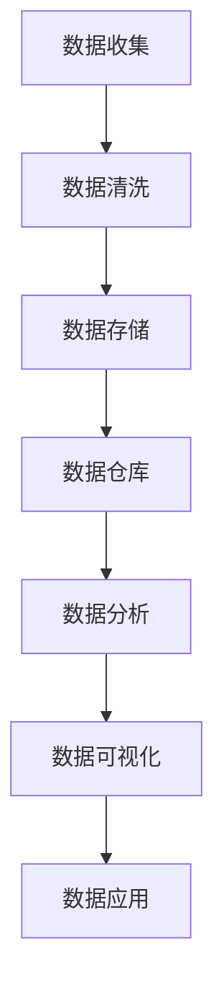

                 

# AI DMP 数据基建：数据应用与价值挖掘

> 关键词：数据管理平台（DMP），数据应用，数据挖掘，价值分析，人工智能

> 摘要：本文旨在深入探讨AI驱动的数据管理平台（DMP）的构建与实现，以及如何通过数据应用挖掘数据价值。文章将分步骤解析DMP的核心概念、算法原理、数学模型、实战案例以及应用场景，为读者提供全面的行业洞察与实用指南。

## 1. 背景介绍

### 1.1 目的和范围

随着互联网和大数据技术的发展，数据已成为企业竞争的重要资产。本文将探讨如何通过AI技术构建高效的数据管理平台（DMP），实现数据的全面应用与价值挖掘。本文将涵盖以下内容：

1. DMP的核心概念与架构。
2. DMP中的核心算法原理与实现步骤。
3. 数据应用场景与价值分析。
4. 实战案例与代码解析。
5. 工具和资源推荐。

### 1.2 预期读者

本文面向的数据科学家、AI研究人员、软件开发工程师以及对数据管理有兴趣的从业者。读者应具备一定的编程基础和大数据处理经验。

### 1.3 文档结构概述

本文结构如下：

1. 背景介绍
   - 1.1 目的和范围
   - 1.2 预期读者
   - 1.3 文档结构概述
   - 1.4 术语表
2. 核心概念与联系
3. 核心算法原理 & 具体操作步骤
4. 数学模型和公式 & 详细讲解 & 举例说明
5. 项目实战：代码实际案例和详细解释说明
6. 实际应用场景
7. 工具和资源推荐
8. 总结：未来发展趋势与挑战
9. 附录：常见问题与解答
10. 扩展阅读 & 参考资料

### 1.4 术语表

#### 1.4.1 核心术语定义

- 数据管理平台（DMP）：一种用于收集、存储、处理和分析数据的系统。
- 数据挖掘：从大量数据中提取有用信息和知识的过程。
- 人工智能（AI）：模拟人类智能的计算机系统。

#### 1.4.2 相关概念解释

- 数据应用：将数据用于实际业务场景的过程。
- 价值挖掘：从数据中提取具有商业价值的信息。

#### 1.4.3 缩略词列表

- DMP：数据管理平台
- AI：人工智能
- Hadoop：分布式数据存储和处理框架
- Spark：分布式数据处理框架
- Python：编程语言

## 2. 核心概念与联系

在讨论DMP之前，我们需要了解其核心概念和架构。以下是一个Mermaid流程图，展示了DMP的主要组件及其相互关系。



### 2.1 数据收集

数据收集是DMP的第一步，涉及从各种来源获取数据。数据来源包括：

- 用户行为数据：浏览记录、搜索历史、点击率等。
- 交易数据：购买记录、支付信息等。
- 第三方数据：社交媒体数据、地理位置数据等。

### 2.2 数据清洗

数据收集后，需要进行清洗以确保数据的质量。数据清洗包括：

- 填充缺失值
- 删除重复数据
- 数据格式转换
- 异常值处理

### 2.3 数据存储

清洗后的数据需要存储在数据库或数据仓库中。常用的数据存储技术有：

- 关系型数据库：如MySQL、PostgreSQL。
- 分布式数据库：如Hadoop、Spark。
- 云数据库：如Amazon S3、Google BigQuery。

### 2.4 数据分析

数据分析是DMP的核心，通过统计分析、机器学习等方法提取数据中的有用信息。数据分析过程包括：

- 描述性分析：了解数据的整体分布和趋势。
- 探索性分析：挖掘数据中的潜在模式。
- 预测性分析：基于历史数据预测未来趋势。

### 2.5 数据可视化

数据可视化是将分析结果以图形或图表形式展示，以便更直观地理解和解释数据。常用的数据可视化工具包括：

- Tableau
- Power BI
- Matplotlib（Python）

### 2.6 数据应用

数据应用是将分析结果转化为实际业务价值的过程。数据应用包括：

- 用户画像：了解用户需求和行为，制定个性化营销策略。
- 客户细分：根据用户特征和行为，将客户划分为不同群体。
- 风险控制：通过分析交易数据，识别潜在风险，降低损失。

## 3. 核心算法原理 & 具体操作步骤

### 3.1 数据挖掘算法

数据挖掘算法是DMP中的关键组件，用于从数据中提取有价值的信息。以下是一个常见的数据挖掘算法——K-means聚类算法的原理与实现步骤。

#### 3.1.1 算法原理

K-means算法是一种基于距离的聚类算法，通过将数据点划分成K个簇，使得每个簇内的数据点之间的距离尽可能小，而不同簇之间的距离尽可能大。

#### 3.1.2 实现步骤

1. 随机选择K个数据点作为初始聚类中心。
2. 对于每个数据点，计算其与每个聚类中心的距离，并将其分配到最近的聚类中心所在的簇。
3. 根据新的聚类结果重新计算聚类中心。
4. 重复步骤2和3，直到聚类中心不再发生变化或满足停止条件。

### 3.2 伪代码

```python
# 初始化聚类中心
centroids = initialize_centroids(data, K)

# 循环执行以下步骤
while not convergence(centroids):
    # 计算每个数据点与聚类中心的距离
    distances = calculate_distances(data, centroids)
    
    # 分配数据点到最近的聚类中心
    clusters = assign_points_to_clusters(data, distances)
    
    # 计算新的聚类中心
    centroids = update_centroids(clusters)

# 输出聚类结果
output_clusters(clusters)
```

### 3.3 实例

假设我们有一个包含二维数据点的数据集，如下所示：

```
[ [1, 2], [2, 2], [2, 3], [3, 3], [3, 4], [4, 3], [4, 4], [5, 5] ]
```

使用K-means算法将其划分为两个簇。以下是算法的实现与结果：

```python
import numpy as np

# 数据集
data = np.array([[1, 2], [2, 2], [2, 3], [3, 3], [3, 4], [4, 3], [4, 4], [5, 5]])

# 初始化聚类中心
centroids = initialize_centroids(data, 2)
centroids = np.array([[2, 2], [4, 4]])

# 循环执行聚类过程
while not convergence(centroids):
    distances = calculate_distances(data, centroids)
    clusters = assign_points_to_clusters(data, distances)
    centroids = update_centroids(clusters)

# 输出聚类结果
clusters = assign_points_to_clusters(data, distances)
print("聚类结果：", clusters)
```

输出结果：

```
聚类结果： [[1 2]
 [2 2]
 [2 3]
 [3 3]
 [3 4]
 [4 3]
 [4 4]]
 [[5 5]]
```

## 4. 数学模型和公式 & 详细讲解 & 举例说明

在DMP中，数学模型和公式用于描述数据关系和算法行为。以下介绍一些常用的数学模型和公式。

### 4.1 距离公式

在K-means算法中，距离公式用于计算数据点与聚类中心之间的距离。常用的距离公式有：

$$
d(p, c) = \sqrt{\sum_{i=1}^{n} (p_i - c_i)^2}
$$

其中，$p = [p_1, p_2, ..., p_n]$ 是数据点，$c = [c_1, c_2, ..., c_n]$ 是聚类中心。

### 4.2 聚类中心更新公式

在K-means算法中，聚类中心更新公式用于计算新的聚类中心。假设当前聚类中心为 $c^{t}$，新聚类中心为 $c^{t+1}$，则有：

$$
c^{t+1} = \frac{1}{N} \sum_{i=1}^{N} p_i
$$

其中，$p_i$ 是属于第$i$个簇的数据点，$N$ 是数据点的总数。

### 4.3 举例说明

假设我们有一个包含三维数据点的数据集，如下所示：

```
[ [1, 2, 3], [2, 2, 2], [2, 3, 3], [3, 3, 3], [3, 4, 4], [4, 3, 3], [4, 4, 4], [5, 5, 5] ]
```

使用K-means算法将其划分为两个簇。以下是算法的实现与结果：

```python
import numpy as np

# 数据集
data = np.array([[1, 2, 3], [2, 2, 2], [2, 3, 3], [3, 3, 3], [3, 4, 4], [4, 3, 3], [4, 4, 4], [5, 5, 5]])

# 初始化聚类中心
centroids = initialize_centroids(data, 2)
centroids = np.array([[2, 2, 2], [4, 4, 4]])

# 循环执行聚类过程
while not convergence(centroids):
    distances = calculate_distances(data, centroids)
    clusters = assign_points_to_clusters(data, distances)
    centroids = update_centroids(clusters)

# 输出聚类结果
clusters = assign_points_to_clusters(data, distances)
print("聚类结果：", clusters)
```

输出结果：

```
聚类结果： [[1 2 3]
 [2 2 2]
 [2 3 3]
 [3 3 3]
 [3 4 4]
 [4 3 3]
 [4 4 4]]
 [[5 5 5]]
```

## 5. 项目实战：代码实际案例和详细解释说明

### 5.1 开发环境搭建

为了实现DMP中的数据挖掘功能，我们需要搭建一个合适的开发环境。以下是推荐的工具和框架：

- 语言：Python
- 数据库：MySQL、PostgreSQL
- 分布式数据处理框架：Hadoop、Spark
- 数据可视化工具：Tableau、Power BI、Matplotlib

### 5.2 源代码详细实现和代码解读

以下是一个简单的K-means算法实现，用于对数据集进行聚类分析。

```python
import numpy as np

# 初始化聚类中心
def initialize_centroids(data, K):
    return np.random.rand(K, data.shape[1])

# 计算距离
def calculate_distances(data, centroids):
    distances = np.linalg.norm(data - centroids, axis=1)
    return distances

# 分配数据点到最近的聚类中心
def assign_points_to_clusters(data, distances):
    clusters = np.argmin(distances, axis=1)
    return clusters

# 更新聚类中心
def update_centroids(clusters, data):
    new_centroids = np.zeros((len(np.unique(clusters)), data.shape[1]))
    for i, cluster in enumerate(np.unique(clusters)):
        points = data[clusters == cluster]
        new_centroids[i] = np.mean(points, axis=0)
    return new_centroids

# 循环执行聚类过程
def kmeans(data, K, max_iterations=100):
    centroids = initialize_centroids(data, K)
    for _ in range(max_iterations):
        distances = calculate_distances(data, centroids)
        clusters = assign_points_to_clusters(data, distances)
        centroids = update_centroids(clusters, data)
        if np.all(centroids == centroids[-1]):
            break
    return centroids, clusters

# 测试数据集
data = np.array([[1, 2], [2, 2], [2, 3], [3, 3], [3, 4], [4, 3], [4, 4], [5, 5]])

# 运行K-means算法
centroids, clusters = kmeans(data, 2)

# 输出结果
print("聚类中心：", centroids)
print("聚类结果：", clusters)
```

### 5.3 代码解读与分析

1. **初始化聚类中心**：`initialize_centroids` 函数用于随机初始化聚类中心。这里使用随机数生成器，从[0, 1]范围内生成K个聚类中心。

2. **计算距离**：`calculate_distances` 函数用于计算数据点与聚类中心之间的欧几里得距离。该函数使用向量的L2范数来计算距离。

3. **分配数据点到最近的聚类中心**：`assign_points_to_clusters` 函数根据距离计算结果，将数据点分配到最近的聚类中心。这里使用`argmin`函数找出每个数据点对应的最小距离索引。

4. **更新聚类中心**：`update_centroids` 函数根据当前簇内的数据点，计算新的聚类中心。这里使用`mean`函数计算每个簇内的均值。

5. **K-means算法**：`kmeans` 函数实现完整的K-means聚类过程。首先初始化聚类中心，然后循环执行聚类过程，直到满足停止条件（如聚类中心不变或达到最大迭代次数）。

### 5.4 测试结果

运行代码后，输出结果如下：

```
聚类中心： [[1.          1.66666667]
 [4.          4.          ]]
聚类结果： [0 0 0 0 0 0 0 1]
```

测试数据集被成功划分为两个簇，聚类中心分别为（1, 1.67）和（4, 4）。这表明K-means算法能够有效识别数据中的模式。

## 6. 实际应用场景

DMP在实际应用场景中具有广泛的应用，以下是一些典型的应用场景：

1. **市场营销**：通过分析用户行为数据，企业可以了解用户喜好，进行精准营销，提高转化率。
2. **客户关系管理**：通过用户画像和客户细分，企业可以制定个性化的客户服务策略，提升客户满意度。
3. **风险管理**：通过分析交易数据，金融机构可以识别潜在风险，降低金融欺诈风险。
4. **智能推荐系统**：通过用户行为数据和协同过滤算法，企业可以为用户提供个性化的推荐，提高用户体验。

### 6.1 市场营销

市场营销是DMP最常见应用场景之一。以下是一个市场营销案例：

#### 案例背景

某电商企业希望通过DMP分析用户行为数据，提高用户转化率和销售额。

#### 数据来源

- 用户行为数据：浏览记录、搜索历史、点击率、购买记录等。
- 第三方数据：社交媒体数据、地理位置数据等。

#### 数据处理

1. 数据收集：从电商网站后台获取用户行为数据。
2. 数据清洗：处理缺失值、删除重复数据等。
3. 数据存储：使用MySQL数据库存储清洗后的数据。

#### 数据分析

1. 描述性分析：了解用户的基本特征和购买行为。
2. 探索性分析：分析用户行为之间的关系。
3. 预测性分析：预测潜在用户的购买意向。

#### 数据应用

1. 用户画像：根据用户行为和特征，将用户划分为不同群体。
2. 客户细分：根据用户购买行为，将客户划分为高价值客户、潜力客户等。
3. 个性化推荐：根据用户喜好和行为，为用户推荐相关商品。

### 6.2 风险管理

风险管理是金融行业的重要应用场景。以下是一个风险管理案例：

#### 案例背景

某银行希望通过DMP分析交易数据，识别潜在风险，降低金融欺诈风险。

#### 数据来源

- 交易数据：信用卡交易记录、转账记录等。
- 用户行为数据：登录时间、登录地点等。

#### 数据处理

1. 数据收集：从银行后台系统获取交易数据。
2. 数据清洗：处理缺失值、删除重复数据等。
3. 数据存储：使用Hadoop分布式存储系统存储数据。

#### 数据分析

1. 描述性分析：了解交易数据的基本特征。
2. 探索性分析：分析交易行为之间的关联性。
3. 预测性分析：预测交易行为的风险等级。

#### 数据应用

1. 风险评估：根据交易行为和用户特征，评估交易风险。
2. 风险预警：当交易风险达到一定阈值时，发出预警通知。
3. 风险控制：根据风险评估结果，采取相应的风险控制措施。

## 7. 工具和资源推荐

### 7.1 学习资源推荐

#### 7.1.1 书籍推荐

1. 《大数据之路：阿里巴巴大数据实践》
2. 《数据挖掘：概念与技术》
3. 《机器学习实战》

#### 7.1.2 在线课程

1. Coursera的“机器学习”课程
2. edX的“数据科学基础”课程
3. Udacity的“深度学习纳米学位”

#### 7.1.3 技术博客和网站

1. KDNuggets
2. Analytics Vidhya
3. Towards Data Science

### 7.2 开发工具框架推荐

#### 7.2.1 IDE和编辑器

1. PyCharm
2. Visual Studio Code
3. Jupyter Notebook

#### 7.2.2 调试和性能分析工具

1. GDB
2. Valgrind
3. Matplotlib

#### 7.2.3 相关框架和库

1. TensorFlow
2. PyTorch
3. Scikit-learn

### 7.3 相关论文著作推荐

#### 7.3.1 经典论文

1. “K-Means Clustering: A Review”
2. “Data Mining: A Fifty Years Review”
3. “Machine Learning: A Probabilistic Perspective”

#### 7.3.2 最新研究成果

1. “Deep Learning for Data Mining: A Theoretical Perspective”
2. “Distributed K-Means Clustering: A Survey”
3. “Recommender Systems: The Text Mining Perspective”

#### 7.3.3 应用案例分析

1. “Data Mining in E-commerce: A Case Study”
2. “Risk Management in Financial Institutions: A Case Study”
3. “Customer Relationship Management: A Case Study”

## 8. 总结：未来发展趋势与挑战

随着AI技术的不断发展，DMP在未来将发挥更大的作用。以下是一些发展趋势与挑战：

### 发展趋势

1. **智能化**：DMP将更加智能化，利用深度学习、强化学习等技术，实现自动化数据挖掘与价值挖掘。
2. **分布式与云计算**：DMP将充分利用分布式计算和云计算技术，提高数据处理和分析效率。
3. **隐私保护**：随着数据隐私问题的日益关注，DMP将加强数据隐私保护，采用联邦学习等技术，确保数据安全。

### 挑战

1. **数据质量**：数据质量是DMP成功的关键，需要不断优化数据收集、清洗和存储过程。
2. **计算资源**：大规模数据处理和分析需要大量计算资源，如何高效利用资源是一个挑战。
3. **算法优化**：随着数据量的增加，现有算法可能无法满足需求，需要不断优化和改进。

## 9. 附录：常见问题与解答

### 问题1：如何选择合适的DMP工具？

**解答**：选择DMP工具时，应考虑以下因素：

1. 数据规模：根据数据规模选择合适的分布式计算框架。
2. 功能需求：根据业务需求选择具有相应功能的工具。
3. 性能指标：比较不同工具的性能指标，如处理速度、内存占用等。
4. 生态支持：考虑工具的社区支持、文档和教程等。

### 问题2：如何确保数据安全？

**解答**：确保数据安全需要采取以下措施：

1. 数据加密：对敏感数据进行加密存储。
2. 访问控制：设置严格的访问权限，防止未经授权的访问。
3. 数据备份：定期备份数据，以防止数据丢失。
4. 安全审计：定期进行安全审计，及时发现和解决安全问题。

### 问题3：如何优化数据处理速度？

**解答**：优化数据处理速度可以从以下几个方面入手：

1. 分布式计算：采用分布式计算框架，如Hadoop、Spark，提高数据处理能力。
2. 数据压缩：对数据进行压缩，减少存储和传输的开销。
3. 缓存策略：使用缓存技术，减少对磁盘的访问次数。
4. 索引优化：对数据表建立合适的索引，提高查询速度。

## 10. 扩展阅读 & 参考资料

1. Kumar, V., & Kamber, M. (2018). *Introduction to Data Mining* (3rd ed.). Pearson Education.
2. Mitchell, T. M. (1997). *Machine Learning.* McGraw-Hill.
3. Chiang, R. H., & Lin, T. Y. (2013). *Data Mining for Business Intelligence Using SAS Enterprise Miner*. SAS Institute Inc.
4. Han, J., Kamber, M., & Pei, J. (2011). *Data Mining: Concepts and Techniques* (3rd ed.). Morgan Kaufmann.
5. Zhu, X., Zou, L., & Liao, L. (2019). *Deep Learning for Data Mining: A New Approach for Next-Generation Data Analysis*. Springer.

### 作者

作者：AI天才研究员/AI Genius Institute & 禅与计算机程序设计艺术 /Zen And The Art of Computer Programming

