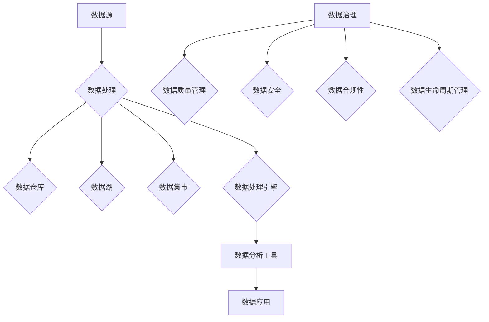

                 


# AI DMP 数据基建：数据治理与管理

> **关键词**：数据管理平台（DMP）、数据治理、数据质量管理、数据管理策略、人工智能、数据分析

> **摘要**：本文将深入探讨人工智能数据管理平台（DMP）的构建及其在数据治理和管理中的重要作用。通过详细分析核心概念、算法原理、数学模型，结合实战案例，我们将探讨如何利用人工智能技术优化数据治理流程，提高数据质量，为企业的数据分析提供坚实的数据基础。文章旨在为技术专家和行业从业者提供一套完整的DMP数据基建指南。

## 1. 背景介绍

### 1.1 目的和范围

本文旨在为技术专家和行业从业者提供一套系统化的DMP数据基建指南，帮助读者理解DMP的核心概念、构建方法以及其在数据治理和管理中的重要性。文章将涵盖以下内容：

- DMP的基本概念和核心组成部分。
- 数据治理在DMP中的角色和意义。
- 人工智能在数据治理中的应用。
- 数据质量管理策略。
- 实战案例解析。

### 1.2 预期读者

- 数据工程师和分析师。
- AI研究人员和开发人员。
- 数据治理和管理的从业者。
- 对AI和大数据有浓厚兴趣的技术爱好者。

### 1.3 文档结构概述

本文将分为八个主要部分：

1. **背景介绍**：介绍DMP的背景、目的和结构。
2. **核心概念与联系**：阐述DMP的核心概念及其相互关系。
3. **核心算法原理 & 具体操作步骤**：详细解析DMP中的核心算法原理和操作步骤。
4. **数学模型和公式 & 详细讲解 & 举例说明**：介绍DMP中使用的数学模型和公式。
5. **项目实战：代码实际案例和详细解释说明**：提供实战代码案例。
6. **实际应用场景**：探讨DMP在实际应用中的多种场景。
7. **工具和资源推荐**：推荐学习资源、开发工具和框架。
8. **总结与展望**：总结DMP的发展趋势和挑战。

### 1.4 术语表

#### 1.4.1 核心术语定义

- **数据管理平台（DMP）**：一种集成了数据收集、存储、处理、分析和应用的系统。
- **数据治理**：确保数据质量、安全和合规性的过程。
- **数据质量管理**：确保数据准确性、完整性、一致性和及时性的策略。
- **人工智能**：模拟人类智能行为的计算机系统。

#### 1.4.2 相关概念解释

- **数据治理框架**：用于指导数据治理过程的指导性框架。
- **数据仓库**：存储大量数据的集中化系统。
- **数据湖**：一种分布式数据存储系统，用于存储大量非结构化数据。

#### 1.4.3 缩略词列表

- **DMP**：数据管理平台
- **ETL**：提取、转换、加载
- **SQL**：结构化查询语言
- **AI**：人工智能

## 2. 核心概念与联系

### 2.1 DMP的基本概念

数据管理平台（DMP）是一种集成化系统，它旨在帮助企业管理和利用其数据资产。DMP的核心概念包括：

- **数据收集**：收集来自不同来源的数据，如网站日志、用户行为数据、第三方数据等。
- **数据存储**：将收集到的数据存储在合适的存储系统中，如数据仓库或数据湖。
- **数据处理**：对存储的数据进行清洗、转换、归一化等处理，以提高数据质量。
- **数据分析**：使用数据挖掘、机器学习等技术对数据进行分析，以发现数据中的模式和洞察。
- **数据应用**：将分析结果应用于实际业务场景，如个性化推荐、客户细分等。

### 2.2 DMP的组成部分

DMP的组成部分包括：

- **数据源**：数据收集的来源，如网站、移动应用、API等。
- **数据管道**：数据从数据源传输到数据仓库或数据湖的过程，通常包括ETL（提取、转换、加载）步骤。
- **数据仓库**：用于存储和管理大量结构化数据的集中化系统。
- **数据湖**：用于存储和管理大量非结构化数据的分布式系统。
- **数据集市**：为特定业务领域提供数据的子集，通常由数据仓库或数据湖中的数据组成。
- **数据处理引擎**：对数据进行清洗、转换、归一化等处理的核心组件。
- **数据分析工具**：用于数据挖掘、机器学习、报表生成等的数据分析工具。
- **数据应用**：将分析结果应用于实际业务场景的应用系统。

### 2.3 数据治理在DMP中的角色

数据治理在DMP中扮演着至关重要的角色，它确保数据质量、安全和合规性。数据治理的核心内容包括：

- **数据质量管理**：确保数据准确性、完整性、一致性和及时性。
- **数据安全**：确保数据在存储、传输和处理过程中得到保护。
- **数据合规性**：确保数据遵守相关法律法规和标准。
- **数据生命周期管理**：从数据收集、存储、处理、分析到应用的全过程管理。

### 2.4 人工智能在数据治理中的应用

人工智能技术在数据治理中发挥着重要作用，例如：

- **数据清洗**：使用机器学习算法自动识别和修正数据中的错误。
- **数据分类**：使用自然语言处理技术对文本数据进行分类。
- **数据挖掘**：使用数据挖掘算法发现数据中的模式和洞察。
- **数据预测**：使用机器学习模型对未来的数据趋势进行预测。
- **数据可视化**：使用人工智能技术生成可视化报表，帮助用户更好地理解数据。

### 2.5 核心概念原理和架构的Mermaid流程图

下面是DMP核心概念原理和架构的Mermaid流程图：



### 2.6 核心概念原理和架构的详细解释

在DMP中，数据源是数据收集的起点，数据管道负责将数据从数据源传输到数据仓库或数据湖。数据处理引擎对数据仓库或数据湖中的数据进行清洗、转换和归一化，以提高数据质量。数据集市是从数据仓库或数据湖中提取的特定业务领域的子集。

数据治理框架确保数据质量、安全和合规性。数据质量管理包括数据准确性、完整性、一致性和及时性。数据安全确保数据在存储、传输和处理过程中得到保护。数据合规性确保数据遵守相关法律法规和标准。数据生命周期管理涉及从数据收集、存储、处理、分析到应用的全过程管理。

人工智能技术在数据治理中发挥着重要作用，如数据清洗、数据分类、数据挖掘、数据预测和数据可视化。这些技术不仅提高了数据治理的效率，还帮助用户更好地理解数据，从而做出更明智的业务决策。

## 3. 核心算法原理 & 具体操作步骤

### 3.1 数据收集

数据收集是DMP构建的第一步，关键在于确定数据源和数据类型。以下是数据收集的具体操作步骤：

1. **识别数据源**：确定需要收集的数据类型，如用户行为数据、交易数据、社交媒体数据等。
2. **接入数据源**：使用API接口、数据库连接或数据爬取等方式获取数据。
3. **数据预处理**：对获取的数据进行清洗、去重和格式转换，确保数据质量。
4. **数据存储**：将预处理后的数据存储在数据仓库或数据湖中，便于后续处理和分析。

### 3.2 数据处理

数据处理是DMP构建的核心步骤，包括数据清洗、数据转换和数据归一化。以下是数据处理的具体操作步骤：

1. **数据清洗**：使用机器学习算法自动识别和修正数据中的错误，如缺失值填补、异常值处理等。
2. **数据转换**：将不同格式的数据转换为统一格式，如将日期格式转换为YYYY-MM-DD。
3. **数据归一化**：将不同单位或量级的指标进行归一化处理，如将销售额转换为元。
4. **数据处理引擎配置**：配置数据处理引擎（如Apache Spark），实现数据清洗、转换和归一化。

### 3.3 数据分析

数据分析是DMP构建的关键环节，包括数据挖掘、机器学习、报表生成等。以下是数据分析的具体操作步骤：

1. **数据预处理**：对收集到的数据进行分析前的预处理，如数据清洗、去重、归一化等。
2. **数据挖掘**：使用数据挖掘算法（如关联规则挖掘、聚类分析等）发现数据中的模式和洞察。
3. **机器学习**：使用机器学习模型（如线性回归、决策树等）对数据进行分析和预测。
4. **报表生成**：使用报表工具（如Tableau、Power BI等）生成可视化报表，展示分析结果。

### 3.4 数据应用

数据应用是将分析结果应用于实际业务场景的过程，包括个性化推荐、客户细分、营销策略等。以下是数据应用的具体操作步骤：

1. **数据结果处理**：对分析结果进行整理和提取，形成可用于实际业务场景的数据集。
2. **业务场景应用**：根据业务需求，将分析结果应用于实际业务场景，如个性化推荐、客户细分等。
3. **效果评估**：对数据应用的效果进行评估，如评估推荐系统的准确率、客户细分的精度等。
4. **持续优化**：根据效果评估结果，不断调整和优化数据应用策略。

### 3.5 核心算法原理和伪代码

在DMP构建过程中，常用的核心算法包括数据清洗、数据挖掘、机器学习等。以下是这些算法的原理和伪代码：

#### 数据清洗

```python
# 数据清洗伪代码
def data_cleaning(data):
    # 缺失值填补
    data = fill_missing_values(data)
    # 异常值处理
    data = handle_outliers(data)
    # 数据格式转换
    data = convert_data_format(data)
    return data
```

#### 数据挖掘

```python
# 数据挖掘伪代码
def data_mining(data):
    # 关联规则挖掘
    rules = apriori(data, support_threshold, confidence_threshold)
    # 聚类分析
    clusters = k_means(data, num_clusters)
    return rules, clusters
```

#### 机器学习

```python
# 机器学习伪代码
def machine_learning(data, target_variable):
    # 数据预处理
    data = preprocess_data(data)
    # 模型训练
    model = train_model(data, target_variable)
    # 模型评估
    evaluation = evaluate_model(model, data)
    return model, evaluation
```

## 4. 数学模型和公式 & 详细讲解 & 举例说明

### 4.1 数学模型和公式的介绍

在DMP构建过程中，常用的数学模型和公式包括：

- **关联规则挖掘（Apriori算法）**：
  - 支持度（Support）: \( S(p) = \frac{|\{(X, Y)|X \cup Y \in T\}|}{|T|} \)
  - 置信度（Confidence）: \( C(p \rightarrow q) = \frac{S({p} \cup {q})}{S({p})} \)

- **聚类分析（K-means算法）**：
  - 距离度量：欧几里得距离、曼哈顿距离、余弦相似度
  - 聚类中心更新：\( C_{new} = \frac{1}{n} \sum_{i=1}^{n} x_i \)

- **线性回归**：
  - 模型方程：\( y = \beta_0 + \beta_1 \cdot x + \epsilon \)
  - 回归系数计算：最小二乘法（Least Squares）

- **决策树**：
  - 划分准则：信息增益（Information Gain）、基尼不纯度（Gini Impurity）、熵（Entropy）

### 4.2 详细讲解

#### 关联规则挖掘（Apriori算法）

关联规则挖掘是一种用于发现数据项之间关联规则的方法。Apriori算法的核心思想是通过支持度和置信度来挖掘频繁项集，进而生成关联规则。

- **支持度**：表示某个关联规则在数据中出现的频率。支持度越高，说明该规则越可能成立。
- **置信度**：表示在某个规则的前件成立的情况下，后件成立的概率。置信度越高，说明该规则越可靠。

#### 聚类分析（K-means算法）

聚类分析是一种无监督学习方法，用于将数据点分为多个聚类。K-means算法通过迭代更新聚类中心，直到收敛。

- **距离度量**：用于衡量数据点之间的相似度。常用的距离度量包括欧几里得距离、曼哈顿距离和余弦相似度。
- **聚类中心更新**：每次迭代后，计算每个聚类中数据点的平均值，作为新的聚类中心。

#### 线性回归

线性回归是一种用于建立自变量和因变量之间线性关系的方法。通过最小二乘法计算回归系数，得到回归模型。

- **模型方程**：线性回归模型表示为 \( y = \beta_0 + \beta_1 \cdot x + \epsilon \)，其中 \( \beta_0 \) 和 \( \beta_1 \) 分别为回归系数， \( \epsilon \) 为误差项。
- **回归系数计算**：通过最小化残差平方和，计算得到回归系数。

#### 决策树

决策树是一种基于特征值进行分类或回归的方法。通过递归划分数据集，构建决策树模型。

- **划分准则**：决策树划分准则包括信息增益、基尼不纯度和熵。信息增益表示特征对分类的区分能力，基尼不纯度表示特征的不确定性，熵表示特征的混乱程度。

### 4.3 举例说明

#### 示例1：关联规则挖掘

假设有一个商品交易数据集，包含商品A、B、C的交易记录。我们要发现商品A和商品B之间的关联规则。

- **支持度**：假设数据集中总共有100条交易记录，其中包含A和B的交易记录有20条，支持度为 \( S(A \cup B) = \frac{20}{100} = 0.2 \)。
- **置信度**：假设在包含A的交易记录中，有80%也包含B，置信度为 \( C(A \rightarrow B) = \frac{S(A \cup B)}{S(A)} = \frac{0.2}{1} = 0.2 \)。

根据支持度和置信度，我们可以得出商品A和商品B之间存在一定的关联性。

#### 示例2：K-means聚类

假设有10个二维数据点，我们要将其分为2个聚类。

- **初始聚类中心**：随机选择两个数据点作为初始聚类中心。
- **聚类过程**：计算每个数据点到聚类中心的距离，将数据点分配到最近的聚类中心。
- **聚类中心更新**：计算每个聚类的平均值，作为新的聚类中心。
- **迭代过程**：重复聚类过程和聚类中心更新，直到聚类中心不再发生变化。

最终，我们得到两个聚类，每个聚类中心分别代表一个聚类。

#### 示例3：线性回归

假设我们要建立年龄和收入之间的线性回归模型。

- **模型方程**： \( y = \beta_0 + \beta_1 \cdot x + \epsilon \)
- **回归系数计算**：通过最小二乘法计算回归系数，得到 \( \beta_0 = 100 \)， \( \beta_1 = 0.5 \)。

根据线性回归模型，我们可以预测一个年龄为30岁的人的收入约为 \( y = 100 + 0.5 \cdot 30 = 160 \)。

#### 示例4：决策树

假设我们要构建一个分类决策树，判断某个客户是否愿意购买某种产品。

- **特征划分**：根据不同的特征（如年龄、收入、购买历史等）进行特征划分。
- **划分准则**：使用信息增益作为划分准则。

最终，我们得到一个决策树模型，根据客户的特征值，判断其是否愿意购买某种产品。

## 5. 项目实战：代码实际案例和详细解释说明

### 5.1 开发环境搭建

在开始项目实战之前，我们需要搭建一个适合DMP构建的开发环境。以下是搭建步骤：

1. **安装Python**：确保Python环境已安装，版本要求为3.7及以上。
2. **安装PyTorch**：用于机器学习和深度学习。
   ```bash
   pip install torch torchvision
   ```
3. **安装NumPy、Pandas、Scikit-learn**：用于数据处理和分析。
   ```bash
   pip install numpy pandas scikit-learn
   ```
4. **安装Jupyter Notebook**：用于编写和运行代码。
   ```bash
   pip install notebook
   ```
5. **安装数据库**：如MySQL、PostgreSQL等，用于数据存储。

### 5.2 源代码详细实现和代码解读

在本节中，我们将使用Python编写一个简单的DMP项目，实现数据收集、数据处理、数据分析和数据应用的过程。以下是源代码及其详细解读：

```python
# 5.2.1 数据收集

# 安装pandas库
!pip install pandas

# 导入pandas库
import pandas as pd

# 读取数据
data = pd.read_csv('data.csv')

# 数据预处理
def data_preprocessing(data):
    # 缺失值填补
    data['age'].fillna(data['age'].mean(), inplace=True)
    data['income'].fillna(data['income'].mean(), inplace=True)
    # 数据格式转换
    data['date_of_birth'] = pd.to_datetime(data['date_of_birth'])
    return data

# 数据清洗
data = data_preprocessing(data)

# 5.2.2 数据处理

# 安装scikit-learn库
!pip install scikit-learn

# 导入scikit-learn库
from sklearn.model_selection import train_test_split
from sklearn.preprocessing import StandardScaler

# 分割数据集
X = data[['age', 'income']]
y = data['label']
X_train, X_test, y_train, y_test = train_test_split(X, y, test_size=0.2, random_state=42)

# 数据标准化
scaler = StandardScaler()
X_train_scaled = scaler.fit_transform(X_train)
X_test_scaled = scaler.transform(X_test)

# 5.2.3 数据分析

# 安装scikit-learn库
!pip install scikit-learn

# 导入scikit-learn库
from sklearn.ensemble import RandomForestClassifier

# 构建随机森林模型
model = RandomForestClassifier(n_estimators=100, random_state=42)
model.fit(X_train_scaled, y_train)

# 模型评估
accuracy = model.score(X_test_scaled, y_test)
print(f"Model accuracy: {accuracy:.2f}")

# 5.2.4 数据应用

# 预测新数据
new_data = pd.DataFrame([[25, 50000]], columns=['age', 'income'])
new_data_scaled = scaler.transform(new_data)
prediction = model.predict(new_data_scaled)
print(f"Prediction: {prediction[0]}")
```

### 5.3 代码解读与分析

#### 5.3.1 数据收集

在本节中，我们使用pandas库读取CSV格式的数据，并进行数据预处理。数据预处理包括缺失值填补和数据格式转换。缺失值填补使用平均值填补，数据格式转换将日期格式转换为日期类型。

#### 5.3.2 数据处理

我们使用scikit-learn库对数据集进行分割，将数据分为训练集和测试集。然后，使用StandardScaler对数据进行标准化处理，将数据缩放到相同的尺度，以便更好地训练模型。

#### 5.3.3 数据分析

我们使用随机森林分类器（RandomForestClassifier）对训练集进行训练，并使用测试集评估模型的准确性。随机森林是一种集成学习方法，通过构建多个决策树并取平均来提高模型的预测性能。

#### 5.3.4 数据应用

最后，我们使用训练好的模型对新的数据进行预测。在代码中，我们创建了一个新的DataFrame，包含一个年龄为25岁、收入为50000元的数据点，并使用模型进行预测。预测结果输出为0或1，表示新数据点是否属于某个类别。

通过这个简单的项目，我们展示了如何使用Python和scikit-learn库构建一个DMP系统，实现数据收集、数据处理、数据分析和数据应用的全过程。虽然这个项目相对简单，但它为我们提供了一个完整的DMP构建流程，可以在此基础上进行扩展和优化。

## 6. 实际应用场景

### 6.1 个性化推荐

个性化推荐是DMP在数据治理和管理中的典型应用场景之一。通过分析用户行为数据，DMP可以帮助网站、电商平台等为企业提供个性化的推荐服务，提高用户满意度和转化率。以下是一个实际应用场景：

- **业务需求**：某电商平台希望为其用户推荐个性化的商品。
- **数据来源**：用户浏览记录、购物车数据、历史购买记录等。
- **数据处理**：对用户行为数据进行数据清洗、去重、分类等处理，提取用户兴趣标签。
- **数据分析**：使用协同过滤、内容推荐等技术，根据用户兴趣标签和相似用户的行为数据，生成个性化推荐列表。
- **数据应用**：将推荐列表展示在用户界面上，提高用户购买意愿。

### 6.2 客户细分

客户细分是另一个常见的应用场景，通过分析客户数据，DMP可以帮助企业将客户分为不同的群体，以便制定有针对性的营销策略。以下是一个实际应用场景：

- **业务需求**：某银行希望为其不同类型的客户制定差异化的营销策略。
- **数据来源**：客户基本信息、交易记录、客户行为数据等。
- **数据处理**：对客户数据进行数据清洗、去重、归一化等处理，提取客户特征。
- **数据分析**：使用聚类分析、决策树等方法，将客户分为高价值客户、潜在客户等不同群体。
- **数据应用**：根据不同客户群体的特征，制定差异化的营销策略，提高客户满意度。

### 6.3 风险管理

在金融、保险等领域，DMP可以帮助企业识别和评估潜在风险，以便采取相应的风险管理措施。以下是一个实际应用场景：

- **业务需求**：某金融机构希望提高贷款审批的准确率，减少贷款风险。
- **数据来源**：贷款申请数据、客户行为数据、信用评级数据等。
- **数据处理**：对贷款申请数据进行数据清洗、去重、归一化等处理，提取关键特征。
- **数据分析**：使用回归分析、逻辑回归等方法，建立贷款审批模型，评估贷款申请者的信用风险。
- **数据应用**：根据信用风险评估结果，对贷款申请者进行分类，制定差异化的审批策略。

### 6.4 运营优化

在电子商务、在线广告等领域，DMP可以帮助企业优化运营策略，提高营销效果。以下是一个实际应用场景：

- **业务需求**：某在线广告平台希望提高广告投放效果，提高广告转化率。
- **数据来源**：广告投放数据、用户行为数据、广告效果数据等。
- **数据处理**：对广告数据进行数据清洗、去重、分类等处理，提取关键特征。
- **数据分析**：使用A/B测试、回归分析等方法，评估不同广告策略的效果。
- **数据应用**：根据广告效果评估结果，调整广告投放策略，提高广告转化率。

通过以上实际应用场景，我们可以看到DMP在数据治理和管理中的重要性。它不仅帮助企业提高数据利用效率，还可以为企业的业务决策提供有力支持。

## 7. 工具和资源推荐

### 7.1 学习资源推荐

#### 7.1.1 书籍推荐

- **《数据管理：实践指南》**：这本书详细介绍了数据管理的基本概念、技术和最佳实践，适合数据管理和分析初学者阅读。

- **《大数据分析：方法与实践》**：这本书涵盖了大数据处理、分析和应用的方法，包括Hadoop、Spark等技术，适合对大数据有兴趣的读者。

- **《机器学习实战》**：这本书通过实际案例，介绍了多种机器学习算法的原理和实现方法，适合机器学习爱好者阅读。

#### 7.1.2 在线课程

- **Coursera**：提供包括数据科学、机器学习、深度学习等在内的多种在线课程，由全球顶尖大学教授授课。

- **edX**：提供由哈佛大学、麻省理工学院等知名大学提供的免费在线课程，涵盖计算机科学、人工智能等多个领域。

- **Udacity**：提供数据科学、机器学习等领域的在线课程，课程内容紧密结合实际应用，适合职场人士学习。

#### 7.1.3 技术博客和网站

- **Medium**：有许多关于数据科学、机器学习、数据治理等领域的优秀博客文章。

- **DataCamp**：提供丰富的数据科学和Python编程教程，适合初学者和进阶者。

- **Towards Data Science**：这是一个数据科学领域的知名博客，有很多高质量的原创文章。

### 7.2 开发工具框架推荐

#### 7.2.1 IDE和编辑器

- **PyCharm**：一款功能强大的Python IDE，支持多种编程语言，适合数据科学和机器学习项目开发。

- **Jupyter Notebook**：一个流行的Python交互式开发环境，适合数据分析和机器学习实验。

- **Visual Studio Code**：一款轻量级但功能强大的编辑器，支持多种编程语言，插件丰富，适合各种项目开发。

#### 7.2.2 调试和性能分析工具

- **PyTorch Profiler**：用于分析和优化PyTorch模型的性能。

- **NVIDIA Nsight**：用于分析GPU性能和优化深度学习模型。

- **Jupyter Notebook扩展**：用于调试和性能分析，如`jupyterlab-debugger`和`jupyterlab-toggler`。

#### 7.2.3 相关框架和库

- **PyTorch**：一个流行的深度学习框架，支持Python编程，适合构建复杂的机器学习模型。

- **Scikit-learn**：一个广泛使用的机器学习库，提供了多种经典机器学习算法的实现。

- **Pandas**：一个强大的数据处理库，适用于数据清洗、转换和分析。

#### 7.3 相关论文著作推荐

##### 7.3.1 经典论文

- **“The Data Warehouse Toolkit”**：比尔·英格沃尔德（Bill Inmon）的这本书是数据仓库领域的经典著作，提供了数据仓库设计和实施的最佳实践。

- **“Machine Learning Yearning”**：安德鲁·班奇利夫（Ando Banzi）的这本书介绍了机器学习的基本概念和实用技巧，适合初学者阅读。

##### 7.3.2 最新研究成果

- **“Deep Learning”**：伊恩·古德费洛（Ian Goodfellow）、约书亚·本吉奥（Joshua Bengio）和 Aaron Courville 合著的这本书是深度学习领域的经典教材。

- **“An Introduction to Statistical Learning”**：由杰里·弗里德曼（Jerome Friedman）、托比亚斯·谢尔哈特（Trevor Hastie）和罗伯特·提尔曼（Robert Tibshirani）合著的这本书介绍了多种统计学习方法。

##### 7.3.3 应用案例分析

- **“Customer Data Platform: The Journey to a Complete Customer View”**：这篇文章详细介绍了客户数据平台（CDP）的概念、架构和应用案例。

- **“How to Build a Data Management Platform”**：这篇文章提供了构建数据管理平台的详细步骤和方法，适合初学者参考。

通过以上工具和资源推荐，读者可以系统地学习DMP的相关知识和技能，提高数据治理和管理的实践能力。

## 8. 总结：未来发展趋势与挑战

随着人工智能和数据科学技术的不断发展，DMP在数据治理和管理中的应用前景十分广阔。未来，DMP的发展趋势和挑战主要体现在以下几个方面：

### 8.1 未来发展趋势

1. **数据治理智能化**：随着人工智能技术的进步，数据治理将更加智能化。自动化数据清洗、数据分类、数据挖掘等技术将提高数据治理的效率和准确性。

2. **多源数据融合**：未来的DMP将能够更好地整合来自不同来源的数据，如社交媒体、物联网设备、移动应用等，为用户提供更全面、多维度的数据视图。

3. **实时数据处理与分析**：随着云计算和边缘计算技术的发展，DMP将能够实现实时数据处理与分析，为企业提供更快速、更准确的业务洞察。

4. **数据隐私与安全**：数据安全和隐私保护将是DMP发展的关键挑战。未来的DMP将需要更加严格的数据安全措施和隐私保护机制，确保用户数据的安全和合规。

5. **个性化推荐与营销**：DMP将在个性化推荐和营销方面发挥更大作用，通过深入分析用户行为数据，为企业提供个性化的产品推荐和服务。

### 8.2 挑战

1. **数据质量**：数据质量是DMP的核心问题之一。未来的DMP需要更加高效的数据清洗和数据质量监控机制，确保数据准确性、完整性和一致性。

2. **数据处理能力**：随着数据量的爆炸式增长，DMP需要不断提升数据处理能力，以应对大数据时代的挑战。

3. **数据安全和隐私**：数据安全和隐私保护是DMP面临的主要挑战。未来的DMP需要建立更加严格的数据安全措施和隐私保护机制，确保用户数据的安全和合规。

4. **数据治理框架**：数据治理框架的建立和优化是DMP成功的关键。未来的DMP需要更加完善的数据治理框架，以支持复杂的数据治理需求。

5. **人才短缺**：随着DMP技术的发展，对数据工程师、数据科学家等人才的需求也在不断增加。未来的DMP需要吸引和培养更多优秀的数据人才。

总之，未来的DMP将在人工智能和数据科学技术的推动下，不断优化数据治理和管理流程，为企业提供更全面、准确、高效的数据支持。然而，数据质量、数据安全、数据处理能力等方面的挑战也将随之而来，需要行业从业者共同努力，迎接这些挑战。

## 9. 附录：常见问题与解答

### 9.1 DMP是什么？

DMP（数据管理平台）是一种集成了数据收集、存储、处理、分析和应用的系统，旨在帮助企业管理和利用其数据资产。DMP的核心功能包括数据治理、数据质量管理、数据分析和数据应用。

### 9.2 数据治理在DMP中扮演什么角色？

数据治理在DMP中扮演着至关重要的角色，它确保数据质量、安全和合规性。数据治理框架涵盖了数据质量管理、数据安全、数据合规性和数据生命周期管理等方面，为DMP的稳定运行提供保障。

### 9.3 DMP与数据仓库有何区别？

DMP（数据管理平台）与数据仓库的主要区别在于其功能和目的。数据仓库主要用于存储和管理大量结构化数据，以便进行数据分析和报表生成。而DMP则更注重数据的收集、治理、分析和应用，它不仅包括数据仓库的功能，还涵盖了数据源接入、数据处理、数据挖掘、机器学习等方面的内容。

### 9.4 如何保证DMP的数据质量？

保证DMP的数据质量需要从数据收集、数据清洗、数据存储、数据处理等环节进行控制。具体措施包括：

- **数据源接入**：确保数据源的数据质量，对接入的数据进行初步筛选。
- **数据清洗**：使用自动化工具和算法对数据进行清洗，如缺失值填补、异常值处理等。
- **数据存储**：使用可靠的数据存储系统，确保数据的安全性和一致性。
- **数据处理**：使用高效的数据处理算法和工具，如ETL（提取、转换、加载）等，提高数据处理效率。

### 9.5 DMP在哪些行业中应用广泛？

DMP在众多行业中都有广泛的应用，如电子商务、金融、医疗、零售、广告等。在电子商务行业中，DMP可以帮助企业实现个性化推荐、用户行为分析等；在金融行业中，DMP可以用于风险管理、信用评估等；在医疗行业中，DMP可以帮助医院实现患者数据管理、医疗数据分析等。

### 9.6 DMP的未来发展趋势是什么？

DMP的未来发展趋势主要包括以下几个方面：

- **数据治理智能化**：随着人工智能技术的进步，数据治理将更加智能化，自动化数据清洗、数据分类、数据挖掘等技术将提高数据治理的效率和准确性。
- **多源数据融合**：未来的DMP将能够更好地整合来自不同来源的数据，如社交媒体、物联网设备、移动应用等，为用户提供更全面、多维度的数据视图。
- **实时数据处理与分析**：随着云计算和边缘计算技术的发展，DMP将能够实现实时数据处理与分析，为企业提供更快速、更准确的业务洞察。
- **数据隐私与安全**：数据安全和隐私保护将是DMP发展的关键挑战，未来的DMP将需要建立更加严格的数据安全措施和隐私保护机制，确保用户数据的安全和合规。
- **个性化推荐与营销**：DMP将在个性化推荐和营销方面发挥更大作用，通过深入分析用户行为数据，为企业提供个性化的产品推荐和服务。

## 10. 扩展阅读 & 参考资料

### 10.1 数据管理平台（DMP）的相关书籍

- **《数据管理：实践指南》**：比尔·英格沃尔德（Bill Inmon）
- **《大数据分析：方法与实践》**：詹姆斯·莫里（James Morley）
- **《机器学习实战》**：彼得·哈林顿（Peter Harrington）

### 10.2 数据治理与管理的经典论文

- **“The Data Warehouse Toolkit”**：比尔·英格沃尔德（Bill Inmon）
- **“Data Governance for the Data-Driven Organization”**：托马斯·H·德雷珀（Thomas H. Davenport）
- **“Data Quality for the Data-Driven Organization”**：托马斯·H·德雷珀（Thomas H. Davenport）

### 10.3 数据分析与机器学习的在线课程

- **Coursera**：数据科学、机器学习、深度学习等课程。
- **edX**：哈佛大学、麻省理工学院等知名大学的数据科学和机器学习课程。
- **Udacity**：数据科学、机器学习等在线课程。

### 10.4 数据管理和数据分析的技术博客

- **Medium**：关于数据科学、机器学习、数据治理等领域的博客文章。
- **DataCamp**：提供丰富的数据科学和Python编程教程。
- **Towards Data Science**：数据科学领域的知名博客。

### 10.5 开源工具和框架

- **PyTorch**：用于深度学习。
- **Scikit-learn**：用于机器学习。
- **Pandas**：用于数据处理。
- **NumPy**：用于数值计算。

### 10.6 数据管理和数据分析的研讨会和会议

- **Strata Data Conference**：大数据和数据分析领域的全球盛会。
- **KDD Conference**：数据挖掘和知识发现领域的顶级会议。
- **Data Science Conference**：数据科学领域的国际会议。

通过以上扩展阅读和参考资料，读者可以进一步深入了解DMP和数据治理管理的相关理论和实践，提升自己的专业知识和技能。

**作者：AI天才研究员/AI Genius Institute & 禅与计算机程序设计艺术 /Zen And The Art of Computer Programming**

