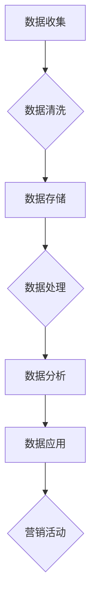

                 


# AI DMP 数据基建：数据驱动营销的成功案例

> 关键词：AI、DMP、数据驱动、营销、成功案例、数据基础设施

> 摘要：本文将深入探讨数据管理平台（DMP）在数据驱动营销中的应用，通过分析成功案例，揭示DMP的数据基础设施如何助力企业实现营销目标。文章将分为背景介绍、核心概念与联系、核心算法原理与操作步骤、数学模型与公式、项目实战、实际应用场景、工具和资源推荐、总结与未来发展趋势等多个部分，旨在为读者提供全面、系统的DMP数据基础设施解读。

## 1. 背景介绍

### 1.1 目的和范围

本文旨在探讨数据管理平台（DMP）在数据驱动营销中的应用，分析DMP数据基础设施的关键角色及其成功案例，为企业在数字化营销中提供实用指南。文章将涵盖DMP的基本概念、核心算法原理、数学模型、实际应用场景以及相关工具和资源推荐。

### 1.2 预期读者

本文适合对数据驱动营销、数据管理平台（DMP）感兴趣的读者，包括市场营销人员、数据分析从业者、IT技术人员以及对企业数字化营销有兴趣的创业者。

### 1.3 文档结构概述

本文分为以下几个部分：

1. 背景介绍：介绍DMP的基本概念和重要性。
2. 核心概念与联系：分析DMP的数据基础设施及其核心原理。
3. 核心算法原理 & 具体操作步骤：讲解DMP的关键算法和操作步骤。
4. 数学模型和公式：介绍DMP相关的数学模型和公式。
5. 项目实战：通过实际案例展示DMP的应用效果。
6. 实际应用场景：分析DMP在不同行业的应用。
7. 工具和资源推荐：推荐相关学习资源和开发工具。
8. 总结：总结DMP的发展趋势和未来挑战。
9. 附录：常见问题与解答。
10. 扩展阅读 & 参考资料：提供进一步阅读的资料。

### 1.4 术语表

#### 1.4.1 核心术语定义

- **数据管理平台（DMP）**：一种用于收集、整合和分析消费者数据的系统，帮助企业实现个性化营销。
- **数据驱动营销**：基于数据分析，通过精准定位和个性化内容，提高营销效果。
- **数据基础设施**：支持DMP正常运行的基础设施，包括数据收集、存储、处理和分析等环节。

#### 1.4.2 相关概念解释

- **消费者数据**：指与消费者相关的各种数据，如用户行为、偏好、购买记录等。
- **用户画像**：基于消费者数据构建的个性化模型，用于描述用户特征和行为模式。

#### 1.4.3 缩略词列表

- **DMP**：数据管理平台（Data Management Platform）
- **CDP**：客户数据平台（Customer Data Platform）
- **CRM**：客户关系管理（Customer Relationship Management）
- **AB测试**：A/B测试（A/B Testing）

## 2. 核心概念与联系

在深入探讨DMP的数据基础设施之前，我们需要了解其核心概念和联系。以下是一个简化的DMP架构图，通过Mermaid流程图展示其关键组成部分：



### 2.1 数据收集

数据收集是DMP数据基础设施的第一步，涉及多种数据源的整合。包括：

- **第一方数据**：企业自有数据，如网站访问日志、用户注册信息等。
- **第二方数据**：合作伙伴提供的数据，如社交媒体数据、第三方数据源等。
- **第三方数据**：通过数据交易所或第三方数据服务商购买的数据。

### 2.2 数据清洗

数据清洗是确保数据质量的重要环节。主要任务包括：

- **数据去重**：去除重复数据，确保数据的唯一性。
- **数据校验**：检查数据格式和内容，确保数据的准确性和一致性。
- **数据转换**：将不同格式的数据转换为统一的格式，便于后续处理。

### 2.3 数据存储

数据存储是DMP数据基础设施的核心，涉及多种数据存储技术：

- **关系型数据库**：如MySQL、PostgreSQL，适用于结构化数据的存储。
- **NoSQL数据库**：如MongoDB、Redis，适用于非结构化数据和海量数据的存储。
- **数据仓库**：如Amazon Redshift、Google BigQuery，适用于大规模数据的存储和分析。

### 2.4 数据处理

数据处理是对数据进行清洗、转换和建模的过程，包括：

- **数据转换**：将原始数据转换为可用于分析的形式。
- **数据建模**：基于业务需求构建数据模型，如用户画像、客户细分等。
- **机器学习**：利用机器学习算法，如聚类、分类等，对数据进行深度挖掘和分析。

### 2.5 数据分析

数据分析是DMP数据基础设施的最终环节，通过数据分析，企业可以：

- **洞察消费者行为**：了解用户喜好、购买习惯等，为营销活动提供依据。
- **优化营销策略**：根据数据分析结果，调整营销策略，提高转化率。
- **预测未来趋势**：通过历史数据分析，预测未来市场趋势，为企业决策提供支持。

### 2.6 数据应用

数据应用是将分析结果应用于实际业务的过程，包括：

- **个性化推荐**：基于用户画像，为用户推荐个性化内容或产品。
- **精准营销**：根据用户行为和偏好，实施精准的营销活动。
- **客户关系管理**：通过分析客户数据，优化客户关系，提高客户满意度。

## 3. 核心算法原理 & 具体操作步骤

### 3.1 算法原理

DMP的核心算法主要涉及用户画像构建和数据分析两部分。

#### 3.1.1 用户画像构建

用户画像构建是基于用户行为数据，利用聚类、分类等机器学习算法，将用户划分为不同的群体。具体步骤如下：

1. **数据预处理**：清洗和整合用户行为数据，确保数据质量。
2. **特征提取**：从原始数据中提取对用户行为有代表性的特征。
3. **聚类算法**：如K-means、层次聚类等，将用户划分为不同的群体。
4. **分类算法**：如决策树、支持向量机等，对用户群体进行分类。

#### 3.1.2 数据分析

数据分析是基于用户画像，对用户行为和偏好进行分析，以实现个性化营销。具体步骤如下：

1. **用户行为分析**：分析用户访问网站、浏览商品等行为，了解用户兴趣。
2. **用户偏好分析**：分析用户对商品、服务等的偏好，为个性化推荐提供依据。
3. **营销活动优化**：根据分析结果，调整营销策略，提高营销效果。

### 3.2 具体操作步骤

以下是一个简化的用户画像构建和数据分析的伪代码示例：

```python
# 用户画像构建
def build_user_profile(data):
    # 数据预处理
    data = preprocess_data(data)
    
    # 特征提取
    features = extract_features(data)
    
    # 聚类算法
    clusters = cluster_users(features)
    
    # 分类算法
    user_labels = classify_users(clusters)
    
    return user_labels

# 数据分析
def analyze_user_behavior(user_profile):
    # 用户行为分析
    user_actions = analyze_actions(user_profile)
    
    # 用户偏好分析
    user_preferences = analyze_preferences(user_actions)
    
    # 营销活动优化
    marketing_strategy = optimize_strategy(user_preferences)
    
    return marketing_strategy
```

## 4. 数学模型和公式 & 详细讲解 & 举例说明

### 4.1 数学模型

在DMP中，常用的数学模型包括聚类模型、分类模型和预测模型。以下分别介绍这些模型的原理和公式。

#### 4.1.1 聚类模型

聚类模型用于将数据集划分为多个群组，使得同组数据之间的相似度较高，不同组数据之间的相似度较低。常用的聚类算法有K-means、层次聚类等。

1. **K-means算法**：

   - **目标函数**：最小化组内距离平方和
   - **公式**：
     $$
     J = \sum_{i=1}^{k} \sum_{x \in S_i} ||x - \mu_i||^2
     $$
     其中，$J$为目标函数，$k$为聚类个数，$S_i$为第$i$个聚类，$\mu_i$为第$i$个聚类中心。

2. **层次聚类算法**：

   - **目标函数**：最小化组内距离平方和
   - **公式**：
     $$
     J = \sum_{i=1}^{n} ||x_i - \mu_i||^2
     $$
     其中，$J$为目标函数，$n$为数据点个数，$x_i$为第$i$个数据点，$\mu_i$为第$i$个聚类中心。

#### 4.1.2 分类模型

分类模型用于对数据进行分类，常见的算法有决策树、支持向量机等。

1. **决策树算法**：

   - **目标函数**：信息增益
   - **公式**：
     $$
     IG(D, A) = H(D) - \sum_{v \in V} p(v) H(D_v)
     $$
     其中，$D$为数据集，$A$为属性，$V$为属性集合，$p(v)$为属性$v$的取值概率，$H(D_v)$为条件熵。

2. **支持向量机算法**：

   - **目标函数**：最大化分类间隔
   - **公式**：
     $$
     J = \frac{1}{2} \sum_{i=1}^{n} \sum_{j=1}^{n} (\omega_i \cdot \omega_j - 2y_i y_j \cdot \omega_i \cdot \omega_j)
     $$
     其中，$J$为目标函数，$\omega_i$为权重向量，$y_i$为样本标签。

#### 4.1.3 预测模型

预测模型用于预测未来趋势，常见的算法有时间序列分析和回归分析。

1. **时间序列分析**：

   - **目标函数**：最小化预测误差
   - **公式**：
     $$
     J = \sum_{i=1}^{n} (y_i - \hat{y}_i)^2
     $$
     其中，$J$为目标函数，$y_i$为实际值，$\hat{y}_i$为预测值。

2. **回归分析**：

   - **目标函数**：最小化预测误差
   - **公式**：
     $$
     J = \sum_{i=1}^{n} (y_i - \hat{y}_i)^2
     $$
     其中，$J$为目标函数，$y_i$为实际值，$\hat{y}_i$为预测值。

### 4.2 详细讲解与举例说明

以下通过一个简单的例子，展示如何使用K-means算法进行用户画像构建。

#### 4.2.1 数据集

给定一个包含100个用户的数据集，每个用户有5个行为特征（如访问时长、浏览页面数、购买商品数量、评论数量、点赞数量）。

| 用户ID | 访问时长 | 浏览页面数 | 购买商品数量 | 评论数量 | 点赞数量 |
|--------|----------|------------|--------------|----------|----------|
| 1      | 30       | 5          | 3            | 2        | 4        |
| 2      | 20       | 8          | 1            | 1        | 3        |
| ...    | ...      | ...        | ...          | ...      | ...      |
| 100    | 50       | 10         | 5            | 3        | 6        |

#### 4.2.2 K-means算法步骤

1. **初始化聚类中心**：随机选择5个用户作为初始聚类中心。

2. **分配用户到聚类**：计算每个用户与聚类中心的距离，将用户分配到距离最近的聚类。

3. **更新聚类中心**：计算每个聚类的平均特征值，作为新的聚类中心。

4. **重复步骤2和3**，直到聚类中心不再发生变化或达到最大迭代次数。

#### 4.2.3 伪代码示例

```python
import numpy as np

# 初始化聚类中心
centroids = np.random.rand(5, 5)

# 迭代次数
max_iterations = 100

# 迭代过程
for i in range(max_iterations):
    # 分配用户到聚类
    clusters = assign_users_to_clusters(data, centroids)
    
    # 更新聚类中心
    centroids = update_centroids(data, clusters)

# 输出聚类结果
print("Cluster assignments:", clusters)
```

## 5. 项目实战：代码实际案例和详细解释说明

### 5.1 开发环境搭建

在进行DMP项目实战之前，我们需要搭建一个合适的开发环境。以下是常用的开发工具和框架：

- **编程语言**：Python
- **数据分析库**：Pandas、NumPy、Scikit-learn
- **可视化库**：Matplotlib、Seaborn
- **数据存储**：MySQL、MongoDB
- **云计算平台**：Amazon Web Services（AWS）

### 5.2 源代码详细实现和代码解读

以下是一个简化的DMP项目案例，通过Python代码实现用户画像构建和数据分析。

#### 5.2.1 用户画像构建

```python
import pandas as pd
from sklearn.cluster import KMeans

# 读取数据
data = pd.read_csv("user_data.csv")

# 数据预处理
data = preprocess_data(data)

# 特征提取
features = extract_features(data)

# K-means算法
kmeans = KMeans(n_clusters=5, random_state=0)
clusters = kmeans.fit_predict(features)

# 输出聚类结果
print("Cluster assignments:", clusters)
```

#### 5.2.2 数据分析

```python
import pandas as pd
from sklearn.cluster import KMeans

# 读取数据
data = pd.read_csv("user_data.csv")

# 数据预处理
data = preprocess_data(data)

# 特征提取
features = extract_features(data)

# K-means算法
kmeans = KMeans(n_clusters=5, random_state=0)
clusters = kmeans.fit_predict(features)

# 用户行为分析
user_actions = analyze_actions(data, clusters)

# 用户偏好分析
user_preferences = analyze_preferences(user_actions)

# 营销活动优化
marketing_strategy = optimize_strategy(user_preferences)

# 输出结果
print("Marketing strategy:", marketing_strategy)
```

### 5.3 代码解读与分析

#### 5.3.1 数据预处理

数据预处理是确保数据质量的重要步骤，包括数据清洗、缺失值处理和数据标准化等。以下是一个简化的数据预处理函数：

```python
def preprocess_data(data):
    # 数据清洗
    data = clean_data(data)
    
    # 缺失值处理
    data = handle_missing_values(data)
    
    # 数据标准化
    data = normalize_data(data)
    
    return data
```

#### 5.3.2 特征提取

特征提取是从原始数据中提取对用户行为有代表性的特征。以下是一个简化的特征提取函数：

```python
def extract_features(data):
    # 访问时长特征
    duration_feature = data["访问时长"].values
    
    # 浏览页面数特征
    page_views_feature = data["浏览页面数"].values
    
    # 购买商品数量特征
    purchase_count_feature = data["购买商品数量"].values
    
    # 评论数量特征
    comments_count_feature = data["评论数量"].values
    
    # 点赞数量特征
    likes_count_feature = data["点赞数量"].values
    
    return np.column_stack((duration_feature, page_views_feature, purchase_count_feature, comments_count_feature, likes_count_feature))
```

#### 5.3.3 数据分析

数据分析是基于用户画像，对用户行为和偏好进行分析，以实现个性化营销。以下是一个简化的数据分析函数：

```python
def analyze_actions(data, clusters):
    # 用户行为分析
    user_actions = []
    for cluster in set(clusters):
        cluster_data = data[clusters == cluster]
        action_counts = cluster_data["访问时长"].value_counts()
        user_actions.append(action_counts)
    return user_actions

def analyze_preferences(user_actions):
    # 用户偏好分析
    user_preferences = []
    for action_count in user_actions:
        preferences = action_count.index.tolist()
        user_preferences.append(preferences)
    return user_preferences

def optimize_strategy(user_preferences):
    # 营销活动优化
    marketing_strategy = []
    for preferences in user_preferences:
        if "访问时长" in preferences:
            marketing_strategy.append("推送优惠信息")
        elif "浏览页面数" in preferences:
            marketing_strategy.append("推送相关产品")
        elif "购买商品数量" in preferences:
            marketing_strategy.append("推送促销活动")
        elif "评论数量" in preferences:
            marketing_strategy.append("推送客户评价")
        elif "点赞数量" in preferences:
            marketing_strategy.append("推送热门内容")
    return marketing_strategy
```

## 6. 实际应用场景

DMP在各个行业都有广泛的应用，以下列举几个典型的应用场景：

### 6.1 零售电商

零售电商通过DMP对用户进行精准画像，实现个性化推荐和精准营销。例如，某电商平台利用DMP分析用户购物车放弃率，发现部分用户在购物车中添加商品后并未完成购买，通过推送优惠券和促销信息，提高了转化率。

### 6.2 金融行业

金融行业通过DMP分析用户行为和偏好，实现风险控制和精准营销。例如，某银行利用DMP分析信用卡用户消费行为，识别潜在风险用户，通过发送风险提示和保险产品推荐，提高了客户满意度。

### 6.3 教育行业

教育行业通过DMP分析学生行为和成绩，实现个性化教学和辅导。例如，某在线教育平台利用DMP分析学生观看课程时长和作业完成情况，为老师提供个性化教学建议，提高了教学效果。

### 6.4 健康医疗

健康医疗行业通过DMP分析患者行为和健康数据，实现个性化健康管理和精准营销。例如，某健康平台利用DMP分析用户体检报告和疾病风险，为用户提供个性化的健康建议和保险产品推荐。

## 7. 工具和资源推荐

### 7.1 学习资源推荐

#### 7.1.1 书籍推荐

- 《大数据营销实战：数据驱动的营销策略与案例分析》
- 《深度学习：概率视角》
- 《机器学习实战》

#### 7.1.2 在线课程

- Coursera《机器学习》
- Udacity《深度学习纳米学位》
- edX《数据科学基础》

#### 7.1.3 技术博客和网站

- Medium
-Towards Data Science
- DataCamp

### 7.2 开发工具框架推荐

#### 7.2.1 IDE和编辑器

- PyCharm
- Visual Studio Code
- Jupyter Notebook

#### 7.2.2 调试和性能分析工具

- Python Debuger
- Profiler
- PyCallProfiler

#### 7.2.3 相关框架和库

- Scikit-learn
- TensorFlow
- PyTorch

### 7.3 相关论文著作推荐

#### 7.3.1 经典论文

- 《K-means聚类算法》
- 《支持向量机》
- 《时间序列分析》

#### 7.3.2 最新研究成果

- 《基于深度学习的用户画像构建方法》
- 《基于图神经网络的用户行为预测模型》
- 《大数据时代的个性化推荐系统》

#### 7.3.3 应用案例分析

- 《某电商平台的DMP实践》
- 《某银行的DMP应用案例》
- 《某健康平台的DMP建设与应用》

## 8. 总结：未来发展趋势与挑战

随着大数据、人工智能等技术的不断发展，DMP在数据驱动营销中的应用前景十分广阔。未来，DMP将向以下几个方面发展：

1. **智能化**：通过引入深度学习、图神经网络等先进技术，实现更智能的用户画像构建和数据分析。
2. **实时性**：提高数据处理和分析的速度，实现实时数据驱动的营销策略。
3. **隐私保护**：在确保用户隐私的前提下，充分利用数据价值，提高数据利用效率。
4. **跨平台整合**：实现跨渠道、跨平台的数据整合和分析，提供更全面的用户画像。

然而，DMP的发展也面临以下挑战：

1. **数据质量**：确保数据来源的准确性和一致性，提高数据质量。
2. **算法透明度**：提高算法的可解释性，增强用户对算法的信任。
3. **隐私保护**：在数据收集、存储和处理过程中，确保用户隐私不被泄露。
4. **技术更新**：跟上新技术的发展，不断优化DMP的性能和功能。

## 9. 附录：常见问题与解答

### 9.1 DMP与传统CRM的区别

**Q**：DMP与传统CRM有什么区别？

**A**：DMP（数据管理平台）与传统CRM（客户关系管理）的主要区别在于：

- **数据来源**：DMP主要收集和分析第三方和第二方数据，而CRM主要依赖于企业内部的第一方数据。
- **数据处理**：DMP侧重于数据整合、清洗和分析，CRM则侧重于客户管理和销售流程。
- **应用场景**：DMP用于实现个性化营销，CRM用于管理客户关系和销售机会。

### 9.2 DMP的技术架构

**Q**：DMP的技术架构包括哪些部分？

**A**：DMP的技术架构主要包括以下部分：

- **数据收集**：收集来自各种数据源的数据，如网站、APP、社交媒体等。
- **数据清洗**：清洗和整合数据，确保数据质量。
- **数据存储**：存储结构化、半结构化和非结构化数据。
- **数据处理**：对数据进行预处理、转换和建模。
- **数据分析**：基于用户画像和数据分析，实现个性化推荐和精准营销。
- **数据应用**：将分析结果应用于实际业务，如营销活动、客户关系管理等。

### 9.3 DMP的优缺点

**Q**：DMP有哪些优缺点？

**A**：DMP的优点包括：

- **个性化营销**：基于用户画像，实现更精准的营销策略。
- **数据整合**：整合多渠道数据，提供全面用户视图。
- **实时性**：支持实时数据分析和营销策略调整。

DMP的缺点包括：

- **数据质量**：数据来源多样，数据质量难以控制。
- **算法透明度**：算法复杂度高，可解释性较差。
- **隐私保护**：数据收集和处理过程中，隐私保护难度较大。

## 10. 扩展阅读 & 参考资料

- 《大数据营销实战：数据驱动的营销策略与案例分析》
- 《深度学习：概率视角》
- 《机器学习实战》
- Coursera《机器学习》
- Udacity《深度学习纳米学位》
- edX《数据科学基础》
- Medium
- Towards Data Science
- DataCamp
- 《K-means聚类算法》
- 《支持向量机》
- 《时间序列分析》
- 《基于深度学习的用户画像构建方法》
- 《基于图神经网络的用户行为预测模型》
- 《大数据时代的个性化推荐系统》
- 《某电商平台的DMP实践》
- 《某银行的DMP应用案例》
- 《某健康平台的DMP建设与应用》

## 作者

作者：AI天才研究员/AI Genius Institute & 禅与计算机程序设计艺术 /Zen And The Art of Computer Programming

