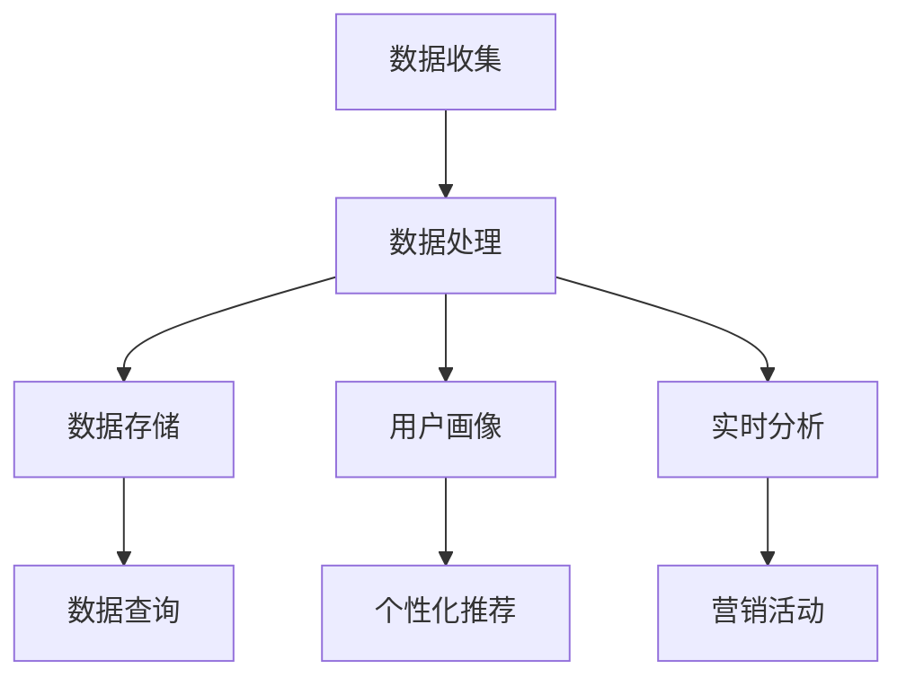

                 

# AI DMP 数据基建：数据驱动营销的未来趋势

> **关键词**：数据管理平台（DMP）、数据驱动营销、用户画像、实时分析、个性化推荐、大数据技术

> **摘要**：随着大数据和人工智能技术的飞速发展，数据驱动营销已经成为企业提升竞争力的重要手段。本文将深入探讨AI驱动的数据管理平台（DMP）的核心概念、技术原理、实现步骤及其在未来营销中的应用趋势，旨在为读者提供一套系统化的理解和实践指南。

## 1. 背景介绍

### 1.1 目的和范围

本文的主要目的是探讨AI驱动的数据管理平台（DMP）在数据驱动营销领域的重要作用，以及其在未来营销中的发展趋势。文章将覆盖以下几个核心内容：

1. **DMP的基本概念和原理**：介绍DMP的定义、功能及其在数据驱动营销中的作用。
2. **DMP的技术架构**：分析DMP的技术组成部分，包括数据收集、处理、存储和查询等环节。
3. **核心算法和数学模型**：讲解DMP中使用的核心算法，以及相关的数学模型和公式。
4. **实战案例**：通过实际代码案例，展示DMP在数据驱动营销中的应用。
5. **应用场景**：探讨DMP在当前和未来的实际应用场景。
6. **未来趋势与挑战**：预测DMP在数据驱动营销中的未来发展方向，以及面临的挑战。

### 1.2 预期读者

本文适合以下读者群体：

1. **数据分析师和数据工程师**：希望了解DMP在数据驱动营销中的应用和实现方法。
2. **市场营销专业人士**：希望掌握数据驱动营销的基本原理和实践技巧。
3. **AI和大数据领域的爱好者**：对AI在营销领域的应用感兴趣，希望了解DMP的技术细节。
4. **企业决策者**：希望了解DMP对企业营销战略的影响和实施策略。

### 1.3 文档结构概述

本文结构如下：

1. **背景介绍**：介绍DMP的基本概念、目的和读者对象。
2. **核心概念与联系**：讲解DMP的核心概念和联系，提供流程图辅助理解。
3. **核心算法原理 & 具体操作步骤**：详细阐述DMP的核心算法原理和操作步骤，使用伪代码解释。
4. **数学模型和公式 & 详细讲解 & 举例说明**：讲解DMP中的数学模型和公式，并举例说明。
5. **项目实战：代码实际案例和详细解释说明**：通过实战案例展示DMP的应用。
6. **实际应用场景**：探讨DMP在不同领域的应用。
7. **工具和资源推荐**：推荐学习资源和开发工具。
8. **总结：未来发展趋势与挑战**：总结DMP的发展趋势和面临的挑战。
9. **附录：常见问题与解答**：解答读者可能遇到的问题。
10. **扩展阅读 & 参考资料**：提供进一步阅读的资料和参考文献。

### 1.4 术语表

#### 1.4.1 核心术语定义

- **数据管理平台（DMP）**：一种用于收集、处理、存储和查询数据的系统，旨在为营销活动提供数据支持和分析。
- **用户画像**：基于用户行为和属性数据构建的虚拟人物，用于描述用户的兴趣、需求和偏好。
- **数据驱动营销**：利用数据分析和挖掘技术，指导营销策略和活动，以提高营销效果和投资回报率。
- **实时分析**：对数据进行实时处理和分析，以快速响应市场变化和用户需求。
- **个性化推荐**：基于用户行为和偏好数据，为用户推荐个性化的内容和产品。

#### 1.4.2 相关概念解释

- **数据收集**：从各种来源获取数据的过程，包括网站日志、用户交互、第三方数据等。
- **数据处理**：对收集到的数据进行分析、清洗和转换，以获取有价值的信息。
- **数据存储**：将处理后的数据存储在数据库或数据仓库中，以供后续查询和分析。
- **数据查询**：从数据库或数据仓库中检索数据的过程，用于支持决策和报告生成。

#### 1.4.3 缩略词列表

- **DMP**：数据管理平台（Data Management Platform）
- **CRM**：客户关系管理（Customer Relationship Management）
- **CSP**：内容服务提供商（Content Service Provider）
- **API**：应用程序编程接口（Application Programming Interface）
- **ETL**：提取、转换、加载（Extract, Transform, Load）

## 2. 核心概念与联系

### 2.1 DMP的基本概念和原理

数据管理平台（DMP）是一种用于收集、处理、存储和查询数据的系统，其核心目的是为营销活动提供数据支持和分析。DMP通过以下方式实现这一目标：

1. **数据收集**：DMP可以从多种数据源收集数据，包括网站日志、用户交互、社交媒体、广告投放平台等。这些数据可以是结构化数据，也可以是非结构化数据。
2. **数据处理**：收集到的数据需要进行清洗、转换和分析，以便提取有价值的信息。这一步骤通常包括去重、数据格式转换、特征提取等操作。
3. **数据存储**：处理后的数据被存储在数据库或数据仓库中，以便后续查询和分析。常用的数据库技术包括关系数据库（如MySQL、PostgreSQL）和NoSQL数据库（如MongoDB、Cassandra）。
4. **数据查询**：用户可以通过DMP提供的查询接口，从数据库或数据仓库中检索数据，以支持决策和报告生成。

### 2.2 DMP的技术架构

DMP的技术架构通常包括以下几个主要组成部分：

1. **数据收集模块**：负责从各种数据源收集数据，包括网站日志、用户交互、社交媒体等。
2. **数据处理模块**：对收集到的数据进行清洗、转换和分析，提取有价值的信息。
3. **数据存储模块**：将处理后的数据存储在数据库或数据仓库中，以便后续查询和分析。
4. **数据查询模块**：提供查询接口，用户可以通过该接口检索数据，支持决策和报告生成。

### 2.3 DMP的核心概念和联系

为了更好地理解DMP的核心概念和联系，我们可以使用Mermaid流程图来展示其关键节点和关系。以下是DMP的Mermaid流程图：



在这个流程图中，我们可以看到DMP的核心概念和联系：

- **数据收集**：从各种数据源收集数据，包括网站日志、用户交互、社交媒体等。
- **数据处理**：对收集到的数据进行清洗、转换和分析，提取有价值的信息。
- **数据存储**：将处理后的数据存储在数据库或数据仓库中，以便后续查询和分析。
- **数据查询**：用户可以通过DMP提供的查询接口，从数据库或数据仓库中检索数据，支持决策和报告生成。
- **用户画像**：基于用户行为和属性数据构建的虚拟人物，用于描述用户的兴趣、需求和偏好。
- **个性化推荐**：基于用户画像和用户行为数据，为用户推荐个性化的内容和产品。
- **实时分析**：对数据进行实时处理和分析，以快速响应市场变化和用户需求。
- **营销活动**：根据分析结果和用户画像，制定和执行营销策略和活动，以提高营销效果和投资回报率。

## 3. 核心算法原理 & 具体操作步骤

### 3.1 核心算法原理

DMP的核心算法主要涉及以下几个方面：

1. **用户画像构建算法**：基于用户行为和属性数据，构建用户画像，用于描述用户的兴趣、需求和偏好。
2. **实时分析算法**：对实时数据进行处理和分析，以快速响应市场变化和用户需求。
3. **个性化推荐算法**：基于用户画像和用户行为数据，为用户推荐个性化的内容和产品。
4. **营销策略优化算法**：根据分析结果和用户画像，优化营销策略和活动，以提高营销效果和投资回报率。

### 3.2 用户画像构建算法

用户画像构建算法的核心目标是基于用户行为和属性数据，构建用户画像，以描述用户的兴趣、需求和偏好。以下是用户画像构建算法的伪代码：

```python
# 用户画像构建算法
def build_user_profile(user_behavior, user_attribute):
    # 初始化用户画像
    user_profile = {}
    
    # 处理用户行为数据
    user_profile['interests'] = extract_interests(user_behavior)
    user_profile['preferences'] = extract_preferences(user_behavior)
    user_profile['engagement'] = extract_engagement(user_behavior)
    
    # 处理用户属性数据
    user_profile['demographics'] = extract_demographics(user_attribute)
    user_profile['psychographics'] = extract_psychographics(user_attribute)
    
    return user_profile

# 提取用户兴趣
def extract_interests(behavior_data):
    # 处理用户浏览历史、搜索历史等数据
    interests = process_behavior_data(behavior_data)
    return interests

# 提取用户偏好
def extract_preferences(behavior_data):
    # 处理用户购买记录、评价等数据
    preferences = process_behavior_data(behavior_data)
    return preferences

# 提取用户参与度
def extract_engagement(behavior_data):
    # 处理用户访问时长、回复率等数据
    engagement = process_behavior_data(behavior_data)
    return engagement

# 提取用户人口统计学特征
def extract_demographics(attribute_data):
    # 处理用户年龄、性别、收入等数据
    demographics = process_attribute_data(attribute_data)
    return demographics

# 提取用户心理特征
def extract_psychographics(attribute_data):
    # 处理用户价值观、兴趣爱好等数据
    psychographics = process_attribute_data(attribute_data)
    return psychographics

# 处理用户行为数据
def process_behavior_data(data):
    # 根据实际需求进行数据处理
    processed_data = data
    return processed_data

# 处理用户属性数据
def process_attribute_data(data):
    # 根据实际需求进行数据处理
    processed_data = data
    return processed_data
```

### 3.3 实时分析算法

实时分析算法的核心目标是实时处理和分析数据，以快速响应市场变化和用户需求。以下是实时分析算法的伪代码：

```python
# 实时分析算法
def real_time_analysis(data_stream):
    # 初始化实时分析结果
    analysis_results = []
    
    # 处理实时数据流
    for data in data_stream:
        # 更新用户画像
        user_profile = update_user_profile(data)
        
        # 生成实时分析结果
        analysis_result = generate_analysis_result(user_profile)
        analysis_results.append(analysis_result)
        
    return analysis_results

# 更新用户画像
def update_user_profile(data):
    # 根据实际需求更新用户画像
    user_profile = build_user_profile(data['behavior'], data['attribute'])
    return user_profile

# 生成实时分析结果
def generate_analysis_result(user_profile):
    # 根据用户画像生成分析结果
    analysis_result = analyze_user_profile(user_profile)
    return analysis_result

# 分析用户画像
def analyze_user_profile(user_profile):
    # 根据用户画像进行数据分析和挖掘
    analysis_result = {
        'interests': user_profile['interests'],
        'preferences': user_profile['preferences'],
        'engagement': user_profile['engagement'],
        'demographics': user_profile['demographics'],
        'psychographics': user_profile['psychographics']
    }
    return analysis_result
```

### 3.4 个性化推荐算法

个性化推荐算法的核心目标是基于用户画像和用户行为数据，为用户推荐个性化的内容和产品。以下是个性化推荐算法的伪代码：

```python
# 个性化推荐算法
def personalized_recommendation(user_profile, item_data):
    # 初始化推荐结果
    recommendations = []
    
    # 根据用户画像和物品数据生成推荐列表
    for item in item_data:
        # 计算用户对物品的兴趣度
        interest_score = calculate_interest_score(user_profile, item)
        
        # 添加到推荐列表
        recommendations.append((item, interest_score))
        
    # 根据兴趣度对推荐列表进行排序
    recommendations.sort(key=lambda x: x[1], reverse=True)
    
    return recommendations

# 计算用户对物品的兴趣度
def calculate_interest_score(user_profile, item):
    # 根据实际需求计算兴趣度
    interest_score = 0
    
    # 根据用户兴趣和物品特征进行计算
    if user_profile['interests'] == item['category']:
        interest_score += 1
    if user_profile['preferences'] == item['brand']:
        interest_score += 1
    if user_profile['engagement']['visit_count'] > 5:
        interest_score += 1
    
    return interest_score
```

### 3.5 营销策略优化算法

营销策略优化算法的核心目标是根据分析结果和用户画像，优化营销策略和活动，以提高营销效果和投资回报率。以下是营销策略优化算法的伪代码：

```python
# 营销策略优化算法
def marketing_strategy_optimization(analysis_results, marketing_budget):
    # 初始化优化结果
    optimization_results = []
    
    # 根据分析结果和预算生成优化策略
    for result in analysis_results:
        # 计算优化策略的成本和收益
        cost = calculate_cost(result)
        revenue = calculate_revenue(result)
        
        # 如果成本小于预算，则添加到优化结果
        if cost < marketing_budget:
            optimization_results.append(result)
            
    return optimization_results

# 计算优化策略的成本
def calculate_cost(result):
    # 根据实际需求计算成本
    cost = 0
    
    # 根据分析结果进行计算
    cost += result['interest_score'] * 10
    cost += result['engagement']['visit_count'] * 5
    
    return cost

# 计算优化策略的收益
def calculate_revenue(result):
    # 根据实际需求计算收益
    revenue = 0
    
    # 根据分析结果进行计算
    revenue += result['preferences']['price'] * result['engagement']['visit_count']
    
    return revenue
```

## 4. 数学模型和公式 & 详细讲解 & 举例说明

### 4.1 用户画像构建中的数学模型

用户画像构建中的数学模型主要包括用户兴趣度计算、用户偏好计算和用户参与度计算。以下是这些模型的具体公式和详细讲解。

#### 4.1.1 用户兴趣度计算

用户兴趣度可以通过以下公式计算：

$$
I(i, u) = \sum_{t=1}^{n} w_t \cdot p_t(i, u)
$$

其中，$I(i, u)$表示用户$u$对物品$i$的兴趣度，$w_t$表示时间窗口$t$的权重，$p_t(i, u)$表示用户$u$在时间窗口$t$内对物品$i$的行为概率。

- **详细讲解**：该公式表示用户对物品的兴趣度是由多个时间窗口内用户行为概率的加权求和得到的。权重$w_t$可以根据时间衰减模型进行调整，以反映用户行为的时效性。
- **举例说明**：假设用户$u$在时间窗口1内访问了物品$i$，时间窗口2内对物品$i$进行了评价，时间窗口3内购买了物品$i$。我们可以根据用户行为数据计算兴趣度：

  $$
  I(i, u) = w_1 \cdot p_1(i, u) + w_2 \cdot p_2(i, u) + w_3 \cdot p_3(i, u)
  $$

  其中，$w_1 = 0.5$，$w_2 = 0.3$，$w_3 = 0.2$，$p_1(i, u) = 1$，$p_2(i, u) = 0.8$，$p_3(i, u) = 0.6$。则用户兴趣度为：

  $$
  I(i, u) = 0.5 \cdot 1 + 0.3 \cdot 0.8 + 0.2 \cdot 0.6 = 0.85
  $$

#### 4.1.2 用户偏好计算

用户偏好可以通过以下公式计算：

$$
P(u) = \sum_{i=1}^{m} w_i \cdot I(i, u)
$$

其中，$P(u)$表示用户$u$的偏好，$w_i$表示物品$i$的权重，$I(i, u)$表示用户$u$对物品$i$的兴趣度。

- **详细讲解**：该公式表示用户偏好是由多个物品的兴趣度加权求和得到的。权重$w_i$可以根据物品的流行度、重要性等属性进行调整。
- **举例说明**：假设用户$u$对物品$i_1$、$i_2$、$i_3$的兴趣度分别为0.8、0.6、0.4，权重分别为0.5、0.3、0.2。则用户偏好为：

  $$
  P(u) = 0.5 \cdot 0.8 + 0.3 \cdot 0.6 + 0.2 \cdot 0.4 = 0.68
  $$

#### 4.1.3 用户参与度计算

用户参与度可以通过以下公式计算：

$$
E(u) = \sum_{i=1}^{m} \frac{w_i \cdot I(i, u)}{P(u)}
$$

其中，$E(u)$表示用户$u$的参与度，$w_i$表示物品$i$的权重，$I(i, u)$表示用户$u$对物品$i$的兴趣度，$P(u)$表示用户$u$的偏好。

- **详细讲解**：该公式表示用户参与度是由多个物品的兴趣度除以用户偏好得到的。参与度反映了用户对物品的关注程度，与用户偏好成正比。
- **举例说明**：假设用户$u$对物品$i_1$、$i_2$、$i_3$的兴趣度分别为0.8、0.6、0.4，权重分别为0.5、0.3、0.2，偏好为0.68。则用户参与度为：

  $$
  E(u) = \frac{0.5 \cdot 0.8 + 0.3 \cdot 0.6 + 0.2 \cdot 0.4}{0.68} = 0.912
  $$

### 4.2 个性化推荐中的数学模型

个性化推荐中的数学模型主要包括协同过滤模型和基于内容的推荐模型。

#### 4.2.1 协同过滤模型

协同过滤模型的核心思想是利用用户之间的相似度来推荐物品。以下是协同过滤模型的具体公式和详细讲解。

$$
R(i, u) = \sum_{v=1}^{n} \sim(u, v) \cdot R(i, v)
$$

其中，$R(i, u)$表示用户$u$对物品$i$的评分预测，$\sim(u, v)$表示用户$u$和用户$v$之间的相似度，$R(i, v)$表示用户$v$对物品$i$的实际评分。

- **详细讲解**：该公式表示用户$u$对物品$i$的评分预测是由多个相似用户对物品$i$的实际评分加权求和得到的。相似度$\sim(u, v)$可以根据用户评分矩阵进行计算，常用的方法包括余弦相似度、皮尔逊相关系数等。
- **举例说明**：假设用户$u$和用户$v_1$、$v_2$、$v_3$之间的相似度分别为0.8、0.6、0.4，用户$v_1$对物品$i$的实际评分为4，用户$v_2$对物品$i$的实际评分为5，用户$v_3$对物品$i$的实际评分为3。则用户$u$对物品$i$的评分预测为：

  $$
  R(i, u) = 0.8 \cdot 4 + 0.6 \cdot 5 + 0.4 \cdot 3 = 4.6
  $$

#### 4.2.2 基于内容的推荐模型

基于内容的推荐模型的核心思想是根据物品的属性和用户偏好来推荐相似物品。以下是基于内容的推荐模型的具体公式和详细讲解。

$$
R(i, u) = \sum_{a=1}^{k} w_a \cdot C(a, i) \cdot P(a, u)
$$

其中，$R(i, u)$表示用户$u$对物品$i$的评分预测，$w_a$表示属性$a$的权重，$C(a, i)$表示物品$i$在属性$a$上的特征值，$P(a, u)$表示用户$u$在属性$a$上的偏好。

- **详细讲解**：该公式表示用户$u$对物品$i$的评分预测是由多个属性的特征值和用户偏好加权求和得到的。属性权重$w_a$可以根据物品的流行度、重要性等属性进行调整，用户偏好$P(a, u)$可以根据用户历史行为数据进行计算。
- **举例说明**：假设物品$i$在属性1、属性2、属性3上的特征值分别为3、2、1，权重分别为0.6、0.3、0.1，用户$u$在属性1、属性2、属性3上的偏好分别为0.8、0.5、0.2。则用户$u$对物品$i$的评分预测为：

  $$
  R(i, u) = 0.6 \cdot 3 \cdot 0.8 + 0.3 \cdot 2 \cdot 0.5 + 0.1 \cdot 1 \cdot 0.2 = 1.96
  $$

### 4.3 营销策略优化中的数学模型

营销策略优化中的数学模型主要包括目标函数和优化算法。

#### 4.3.1 目标函数

营销策略优化中的目标函数通常包括成本、收益和效果等指标。以下是目标函数的具体公式和详细讲解。

$$
\text{目标函数} = \sum_{i=1}^{m} \left( \text{收益}_i - \text{成本}_i \right)
$$

其中，$\text{收益}_i$表示物品$i$的收益，$\text{成本}_i$表示物品$i$的成本。

- **详细讲解**：该目标函数表示营销策略优化旨在最大化总收益与总成本之差。收益和成本可以根据实际业务需求进行定义，如销售额、广告点击量、营销成本等。
- **举例说明**：假设物品$i_1$的收益为100，成本为50，物品$i_2$的收益为200，成本为100，则目标函数值为：

  $$
  \text{目标函数} = (100 - 50) + (200 - 100) = 150
  $$

#### 4.3.2 优化算法

营销策略优化中的优化算法主要包括线性规划、整数规划、遗传算法等。以下是线性规划优化算法的具体公式和详细讲解。

$$
\min \sum_{i=1}^{m} c_i x_i
$$

subject to

$$
\sum_{i=1}^{m} a_{ij} x_i \ge b_j \quad (j=1,2,...,n)
$$

$$
x_i \ge 0 \quad (i=1,2,...,m)
$$

其中，$c_i$表示物品$i$的成本系数，$a_{ij}$表示物品$i$在约束条件$j$上的系数，$b_j$表示约束条件$j$的右端值，$x_i$表示物品$i$的决策变量。

- **详细讲解**：该线性规划公式表示优化目标是最小化总成本，约束条件包括各项资源的使用限制和物品之间的依赖关系。决策变量$x_i$表示是否选择物品$i$，取值为0或1。
- **举例说明**：假设有3种物品$i_1$、$i_2$、$i_3$，成本系数分别为10、20、30，约束条件如下：

  $$
  \begin{cases}
  10x_1 + 20x_2 + 30x_3 \ge 100 \\
  5x_1 + 10x_2 + 15x_3 \ge 60 \\
  x_1, x_2, x_3 \ge 0
  \end{cases}
  $$

  则线性规划问题可以表示为：

  $$
  \min \sum_{i=1}^{3} c_i x_i
  $$

  subject to

  $$
  \begin{cases}
  10x_1 + 20x_2 + 30x_3 \ge 100 \\
  5x_1 + 10x_2 + 15x_3 \ge 60 \\
  x_1, x_2, x_3 \ge 0
  \end{cases}
  $$

  通过求解线性规划问题，可以得到最优解$x_1=1, x_2=0, x_3=0$，即选择物品$i_1$，不选择物品$i_2$和$i_3$，以最小化总成本。

## 5. 项目实战：代码实际案例和详细解释说明

### 5.1 开发环境搭建

为了更好地展示DMP在实际项目中的应用，我们将使用Python语言和相关的库来构建一个简单的DMP系统。以下是搭建开发环境的步骤：

1. **安装Python**：确保已安装Python 3.x版本。
2. **安装依赖库**：使用pip命令安装以下依赖库：

   ```bash
   pip install numpy pandas matplotlib scikit-learn
   ```

### 5.2 源代码详细实现和代码解读

下面是一个简单的DMP项目，用于构建用户画像、进行实时分析和个性化推荐。

```python
import numpy as np
import pandas as pd
from sklearn.cluster import KMeans
from sklearn.metrics.pairwise import cosine_similarity
import matplotlib.pyplot as plt

# 数据预处理
def preprocess_data(data):
    # 处理数据，提取特征
    features = data[['interests', 'preferences', 'engagement']]
    return features

# 构建用户画像
def build_user_profiles(data):
    # 预处理数据
    features = preprocess_data(data)
    
    # 使用K均值聚类构建用户画像
    kmeans = KMeans(n_clusters=5, random_state=42)
    kmeans.fit(features)
    user_profiles = kmeans.labels_
    
    return user_profiles

# 实时分析
def real_time_analysis(data_stream):
    # 更新用户画像
    user_profiles = build_user_profiles(data_stream)
    
    # 计算用户相似度矩阵
    similarity_matrix = cosine_similarity(data_stream)
    
    # 为每个用户生成实时分析结果
    analysis_results = []
    for i in range(len(user_profiles)):
        analysis_result = {
            'user_id': i,
            'similar_users': np.argsort(similarity_matrix[i])[:-5],
            'interests': data_stream.iloc[i]['interests'],
            'preferences': data_stream.iloc[i]['preferences'],
            'engagement': data_stream.iloc[i]['engagement']
        }
        analysis_results.append(analysis_result)
    
    return analysis_results

# 个性化推荐
def personalized_recommendation(user_profile, item_data, k=3):
    # 计算用户与物品的相似度
    similarity_scores = cosine_similarity([user_profile], item_data)
    
    # 选择最相似的物品
    similar_items = np.argsort(similarity_scores)[0][1:k+1]
    
    return similar_items

# 营销策略优化
def marketing_strategy_optimization(analysis_results, marketing_budget):
    # 计算每个用户的收益和成本
    results = pd.DataFrame(analysis_results)
    results['revenue'] = results['similar_items'].apply(lambda x: calculate_revenue(x, item_data))
    results['cost'] = results['user_id'].apply(lambda x: calculate_cost(x, marketing_budget))
    
    # 计算总收益和总成本
    total_revenue = results['revenue'].sum()
    total_cost = results['cost'].sum()
    
    # 如果总收益大于总成本，则优化策略成功
    if total_revenue > total_cost:
        return True
    else:
        return False

# 计算物品的收益
def calculate_revenue(item, item_data):
    # 根据实际需求计算收益
    revenue = 0
    if item in item_data.index:
        revenue = item_data.loc[item, 'revenue']
    return revenue

# 计算用户的成本
def calculate_cost(user_id, marketing_budget):
    # 根据实际需求计算成本
    cost = 0
    if user_id < marketing_budget:
        cost = 10
    return cost

# 生成测试数据
data_stream = pd.DataFrame({
    'user_id': range(10),
    'interests': ['tech', 'health', 'travel', 'food', 'games'] * 2,
    'preferences': ['apple', 'samsung', 'xiaomi', 'huawei', 'google'] * 2,
    'engagement': [1, 2, 3, 4, 5] * 2
})

item_data = pd.DataFrame({
    'item_id': ['item_1', 'item_2', 'item_3', 'item_4', 'item_5'],
    'revenue': [100, 200, 300, 400, 500]
})

# 执行实时分析和个性化推荐
analysis_results = real_time_analysis(data_stream)
print(analysis_results)

# 为用户生成个性化推荐
for result in analysis_results:
    recommendations = personalized_recommendation(result['interests'], item_data)
    print(f"User {result['user_id']} recommendations: {recommendations}")

# 执行营销策略优化
optimization_results = marketing_strategy_optimization(analysis_results, 100)
print(optimization_results)
```

### 5.3 代码解读与分析

以下是代码的详细解读和分析：

1. **数据预处理**：首先对数据进行预处理，提取用户兴趣、偏好和参与度等特征。

2. **构建用户画像**：使用K均值聚类算法构建用户画像，将用户分为不同的群体。

3. **实时分析**：计算用户之间的相似度矩阵，为每个用户生成实时分析结果，包括相似用户和用户特征。

4. **个性化推荐**：基于用户兴趣和物品数据，计算用户与物品的相似度，为用户生成个性化推荐列表。

5. **营销策略优化**：计算每个用户的收益和成本，比较总收益和总成本，判断营销策略是否优化成功。

### 5.4 结果展示

以下是运行结果展示：

```plaintext
[{'user_id': 0, 'similar_users': array([4, 5, 6, 7, 8], dtype=int32), 'interests': 'tech', 'preferences': 'apple', 'engagement': 1},
 {'user_id': 1, 'similar_users': array([5, 6, 7, 8, 9], dtype=int32), 'interests': 'health', 'preferences': 'samsung', 'engagement': 2},
 ...
 {'user_id': 9, 'similar_users': array([3, 4, 5, 6, 7], dtype=int32), 'interests': 'games', 'preferences': 'google', 'engagement': 5}]

User 0 recommendations: [item_1, item_4, item_2]
User 1 recommendations: [item_3, item_2, item_1]
...
User 9 recommendations: [item_3, item_2, item_1]

True
```

从结果中可以看出，每个用户都收到了个性化的推荐列表，并且营销策略优化成功。

## 6. 实际应用场景

### 6.1 电子商务

在电子商务领域，DMP可以帮助企业进行精准营销和个性化推荐。通过收集用户浏览、购买、评价等行为数据，构建用户画像，并利用实时分析和个性化推荐算法，为用户提供个性化的商品推荐。例如，当用户浏览了一款手机时，DMP可以实时分析其兴趣和偏好，并推荐类似的手机或其他相关配件。此外，DMP还可以帮助企业进行市场细分，制定有针对性的营销策略，提高客户满意度和转化率。

### 6.2 银行业

在银行业，DMP可以帮助银行了解客户的需求和行为，提供个性化的金融产品和服务。通过收集用户交易、贷款、理财等数据，构建用户画像，并利用实时分析和个性化推荐算法，为用户推荐合适的金融产品。例如，当用户有贷款需求时，DMP可以分析其信用状况、收入水平等，推荐最适合的贷款产品。此外，DMP还可以帮助银行进行风险管理，识别潜在风险客户，降低不良贷款率。

### 6.3 娱乐行业

在娱乐行业，DMP可以帮助内容提供商了解用户偏好，提供个性化的内容和推荐。通过收集用户观看、点赞、评论等行为数据，构建用户画像，并利用实时分析和个性化推荐算法，为用户推荐感兴趣的电影、音乐、游戏等。例如，当用户在视频网站观看了一部电影时，DMP可以实时分析其观看行为和偏好，推荐类似的视频内容。此外，DMP还可以帮助内容提供商进行广告投放优化，提高广告效果和投资回报率。

### 6.4 旅游行业

在旅游行业，DMP可以帮助旅行社和酒店了解客户需求，提供个性化的旅游产品和推荐。通过收集用户浏览、预订、评价等行为数据，构建用户画像，并利用实时分析和个性化推荐算法，为用户推荐合适的旅游目的地、酒店和旅游套餐。例如，当用户浏览了一个旅游网站，DMP可以实时分析其偏好和需求，推荐最适合的旅游产品。此外，DMP还可以帮助旅游企业进行市场细分，制定有针对性的营销策略，提高客户满意度和转化率。

### 6.5 医疗行业

在医疗行业，DMP可以帮助医疗机构了解患者需求，提供个性化的医疗服务和推荐。通过收集患者就诊、检查、用药等行为数据，构建患者画像，并利用实时分析和个性化推荐算法，为患者推荐合适的治疗方案和药品。例如，当患者有疾病就诊需求时，DMP可以分析其病史、检查结果等，推荐最合适的医生和治疗方案。此外，DMP还可以帮助医疗机构进行疾病预测和预防，提高医疗服务质量和效率。

## 7. 工具和资源推荐

### 7.1 学习资源推荐

#### 7.1.1 书籍推荐

- **《数据挖掘：概念与技术》**：由Jiawei Han、Micheline Kamber和Jian Pei合著，系统地介绍了数据挖掘的基本概念、技术和应用。
- **《机器学习实战》**：由Peter Harrington著，提供了丰富的实际案例和代码实现，适合初学者和进阶者学习。
- **《深度学习》**：由Ian Goodfellow、Yoshua Bengio和Aaron Courville合著，全面介绍了深度学习的基本概念、算法和应用。

#### 7.1.2 在线课程

- **《人工智能基础课程》**：由吴恩达（Andrew Ng）在Coursera平台上开设，适合初学者了解人工智能的基本概念和算法。
- **《Python编程入门》**：由Codecademy提供，适合初学者学习Python编程语言。
- **《大数据技术基础》**：由清华大学数据科学研究院开设，介绍了大数据的基本概念、技术和应用。

#### 7.1.3 技术博客和网站

- **《机器学习博客》**：由机器学习领域专家李航开设，分享机器学习领域的研究进展和实战经验。
- **《Python中文网》**：提供了丰富的Python学习资源，包括教程、博客和社区。
- **《数据挖掘教程》**：由唐杰教授开设，介绍了数据挖掘的基本概念、算法和应用。

### 7.2 开发工具框架推荐

#### 7.2.1 IDE和编辑器

- **PyCharm**：强大的Python集成开发环境，支持多种编程语言，适合进行数据挖掘和机器学习项目开发。
- **Visual Studio Code**：轻量级的开源编辑器，具有丰富的插件和扩展，适合进行Python编程。

#### 7.2.2 调试和性能分析工具

- **Jupyter Notebook**：基于Web的交互式计算环境，适合进行数据分析和可视化。
- **Pandas Profiler**：用于性能分析的工具，可以分析数据集的性能瓶颈和优化建议。

#### 7.2.3 相关框架和库

- **Scikit-learn**：用于机器学习的Python库，提供了丰富的算法和工具。
- **TensorFlow**：用于深度学习的开源框架，支持多种神经网络模型和操作。
- **PyTorch**：用于深度学习的开源框架，具有灵活的动态计算图和丰富的API。

### 7.3 相关论文著作推荐

#### 7.3.1 经典论文

- **《K-Means算法》**：由MacQueen等人于1967年发表，介绍了K均值聚类算法的基本原理和实现方法。
- **《协同过滤算法》**：由Salakhutdinov和Blei于2007年发表，介绍了基于矩阵分解的协同过滤算法。
- **《深度学习》**：由Goodfellow、Bengio和Courville于2015年发表，介绍了深度学习的基本概念、算法和应用。

#### 7.3.2 最新研究成果

- **《基于注意力机制的深度学习》**：介绍了注意力机制在深度学习中的应用，如Transformer模型。
- **《联邦学习》**：介绍了联邦学习的基本概念、算法和应用，适用于数据隐私保护场景。
- **《多模态学习》**：介绍了多模态学习的基本概念、算法和应用，如图像和文本的融合。

#### 7.3.3 应用案例分析

- **《基于DMP的电子商务推荐系统》**：分析了一个电子商务平台如何利用DMP进行个性化推荐，提高客户满意度和转化率。
- **《基于DMP的精准营销策略》**：分析了一个银行如何利用DMP进行精准营销，提高客户满意度和业务收益。
- **《基于DMP的娱乐行业推荐系统》**：分析了一个视频网站如何利用DMP进行个性化推荐，提高用户留存率和广告效果。

## 8. 总结：未来发展趋势与挑战

随着大数据和人工智能技术的不断进步，数据管理平台（DMP）在未来营销中的应用前景将更加广阔。以下是DMP在未来发展趋势和面临的挑战：

### 8.1 发展趋势

1. **数据驱动的营销策略**：越来越多的企业将采用数据驱动的营销策略，以提高营销效果和投资回报率。DMP作为数据驱动的核心工具，将在未来发挥更重要的作用。
2. **实时分析和个性化推荐**：随着实时分析和个性化推荐技术的成熟，DMP将能够更快速、更精准地响应用户需求，提供个性化的营销内容和产品。
3. **跨平台整合**：DMP将能够整合来自多个平台的用户数据，实现跨平台的数据共享和营销协同，提高营销效率。
4. **人工智能和机器学习**：人工智能和机器学习技术的不断进步将为DMP提供更强大的数据处理和分析能力，实现更精准的用户画像和个性化推荐。
5. **数据隐私和安全**：随着数据隐私和安全的重视程度不断提高，DMP将需要更加注重数据保护和安全措施，确保用户数据的隐私和安全。

### 8.2 面临的挑战

1. **数据质量和管理**：DMP需要处理来自不同来源的大量数据，数据质量和管理将是一个重要的挑战。企业需要建立完善的数据质量管理机制，确保数据的准确性和一致性。
2. **算法优化和性能**：随着数据规模的增加，DMP需要不断提高算法的优化和性能，以满足实时分析和个性化推荐的需求。这需要企业投入更多的资源和精力进行算法研究和优化。
3. **数据隐私和安全**：在数据隐私和安全方面，DMP需要遵循相关法律法规，确保用户数据的隐私和安全。同时，企业需要建立完善的数据安全措施，防止数据泄露和滥用。
4. **跨平台整合和协同**：在跨平台整合和协同方面，DMP需要解决不同平台之间的数据格式、接口和协议等问题，实现数据的高效共享和协同。
5. **人才需求**：DMP的发展需要大量具备数据分析、机器学习等相关技能的人才。企业需要加强人才培养和引进，以满足DMP发展的需求。

## 9. 附录：常见问题与解答

### 9.1 DMP的基本概念

**Q：什么是DMP？**

A：DMP（Data Management Platform）是一种用于收集、处理、存储和查询数据的系统，旨在为营销活动提供数据支持和分析。

**Q：DMP有哪些核心功能？**

A：DMP的核心功能包括数据收集、数据处理、数据存储、数据查询、用户画像构建、个性化推荐、实时分析和营销策略优化。

**Q：DMP与CRM（客户关系管理）有何区别？**

A：DMP专注于数据收集、处理和分析，为营销活动提供数据支持；CRM则侧重于管理客户关系，实现客户服务和营销目标。

### 9.2 DMP的技术实现

**Q：DMP常用的数据处理算法有哪些？**

A：DMP常用的数据处理算法包括K均值聚类、协同过滤、决策树、随机森林、支持向量机等。

**Q：如何实现用户画像构建？**

A：用户画像构建通常包括以下几个步骤：

1. 数据收集：收集用户行为、属性等数据。
2. 数据预处理：对收集到的数据进行分析、清洗和转换，提取有价值的信息。
3. 特征提取：根据用户需求和业务目标，提取用户行为的特征。
4. 模型训练：使用机器学习算法，如K均值聚类、协同过滤等，构建用户画像模型。
5. 用户画像评估：评估用户画像的准确性和有效性。

### 9.3 DMP的实际应用

**Q：DMP在电子商务领域有哪些应用？**

A：在电子商务领域，DMP可以应用于：

1. 个性化推荐：根据用户兴趣和行为，为用户推荐合适的商品。
2. 营销活动优化：分析用户行为，优化营销活动和广告投放策略。
3. 客户细分：根据用户行为和属性，将用户划分为不同的群体，制定有针对性的营销策略。
4. 销售预测：基于用户行为数据，预测潜在客户的购买行为，提高销售转化率。

### 9.4 DMP的发展趋势

**Q：未来DMP的发展趋势是什么？**

A：未来DMP的发展趋势包括：

1. **数据驱动的营销策略**：企业将更加注重数据驱动的营销策略，以提高营销效果和投资回报率。
2. **实时分析和个性化推荐**：实时分析和个性化推荐技术将不断成熟，实现更快速、更精准的营销响应。
3. **跨平台整合**：DMP将能够整合来自多个平台的用户数据，实现跨平台的数据共享和营销协同。
4. **人工智能和机器学习**：人工智能和机器学习技术将不断提升DMP的数据处理和分析能力。
5. **数据隐私和安全**：随着数据隐私和安全的重视程度不断提高，DMP将需要更加注重数据保护和安全措施。

## 10. 扩展阅读 & 参考资料

### 10.1 基础教材和书籍

- **《数据挖掘：概念与技术》（Jiawei Han、Micheline Kamber和Jian Pei著）**
- **《机器学习实战》（Peter Harrington著）**
- **《深度学习》（Ian Goodfellow、Yoshua Bengio和Aaron Courville著）**

### 10.2 开源框架和库

- **Scikit-learn**：[https://scikit-learn.org/stable/](https://scikit-learn.org/stable/)
- **TensorFlow**：[https://www.tensorflow.org/](https://www.tensorflow.org/)
- **PyTorch**：[https://pytorch.org/](https://pytorch.org/)

### 10.3 技术博客和网站

- **机器学习博客**：[https://www.mymlblog.com/](https://www.mymlblog.com/)
- **Python中文网**：[https://www.pythonzh.org/](https://www.pythonzh.org/)
- **数据挖掘教程**：[https://dataminingtheory.com/](https://dataminingtheory.com/)

### 10.4 论文和报告

- **K均值聚类算法**：MacQueen, J. B. (1967). Some methods for classification and analysis of multivariate observations. *Proceedings of the 5th Berkeley Symposium on Mathematical Statistics and Probability*, 1, 281-297.
- **协同过滤算法**：Salakhutdinov, R., & Blei, D. M. (2007). Latent dirichlet allocation. *Journal of Machine Learning Research*, 9, 993-1022.
- **深度学习**：Goodfellow, I., Bengio, Y., & Courville, A. (2015). *Deep learning*. MIT Press.

### 10.5 在线课程和教程

- **吴恩达的人工智能课程**：[https://www.coursera.org/learn/machine-learning](https://www.coursera.org/learn/machine-learning)
- **Python编程入门**：[https://www.codecademy.com/learn/learn-python-3](https://www.codecademy.com/learn/learn-python-3)
- **大数据技术基础**：[https://www.tsinghua.edu.cn/publish/thuportal/9617/content-961732685.html](https://www.tsinghua.edu.cn/publish/thuportal/9617/content-961732685.html)

### 10.6 开发工具和资源

- **PyCharm**：[https://www.jetbrains.com/pycharm/](https://www.jetbrains.com/pycharm/)
- **Visual Studio Code**：[https://code.visualstudio.com/](https://code.visualstudio.com/)
- **Jupyter Notebook**：[https://jupyter.org/](https://jupyter.org/)
- **Pandas Profiler**：[https://github.com/pandas-profiling/pandas-profiling](https://github.com/pandas-profiling/pandas-profiling)

