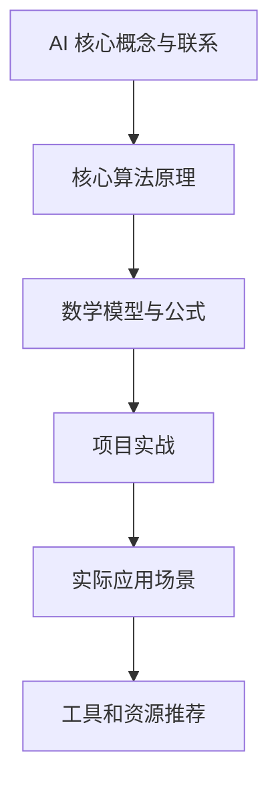

                 

## AI 人才培养计划：培养高素质 AI 人才

> **关键词：** AI 人才培养、高素质人才、算法原理、数学模型、项目实战、应用场景
>
> **摘要：** 本文旨在探讨如何培养高素质的 AI 人才，从核心概念、算法原理、数学模型、项目实战等多个维度，详细解析 AI 领域的关键技术和实践方法，为从事 AI 工作的从业者提供全面的指导和建议。

### 1. 背景介绍

#### 1.1 目的和范围

随着人工智能技术的迅猛发展，AI 人才的需求与日俱增。然而，高素质的 AI 人才培养仍面临诸多挑战。本文旨在通过详细分析 AI 领域的核心概念、算法原理、数学模型、项目实战等，为培养高素质 AI 人才提供有价值的参考和指导。

本文的研究范围包括以下几个方面：

1. **核心概念与联系**：介绍 AI 领域的基础概念及其相互关系，包括机器学习、深度学习、神经网络等。
2. **核心算法原理 & 具体操作步骤**：深入讲解常见的 AI 算法，如线性回归、支持向量机、神经网络等，并使用伪代码详细阐述其操作步骤。
3. **数学模型和公式 & 详细讲解 & 举例说明**：探讨 AI 中常用的数学模型，如梯度下降、损失函数等，并使用 LaTeX 格式展示相关公式。
4. **项目实战：代码实际案例和详细解释说明**：通过实际项目案例，展示 AI 算法在实际应用中的操作过程和效果。
5. **实际应用场景**：分析 AI 技术在不同领域的应用，如自然语言处理、计算机视觉、推荐系统等。
6. **工具和资源推荐**：介绍学习资源、开发工具框架和论文著作，为 AI 学习和研究提供支持。

#### 1.2 预期读者

本文适合以下读者群体：

1. **AI 初学者**：希望了解 AI 领域基础知识和实践方法的读者。
2. **AI 从业者**：需要提升自身技能和能力的 AI 从业者。
3. **研究学者**：关注 AI 领域最新进展和研究成果的研究者。

#### 1.3 文档结构概述

本文共分为十个部分：

1. **背景介绍**：介绍本文的目的和范围，以及预期读者。
2. **核心概念与联系**：分析 AI 领域的基础概念及其相互关系。
3. **核心算法原理 & 具体操作步骤**：深入讲解常见的 AI 算法。
4. **数学模型和公式 & 详细讲解 & 举例说明**：探讨 AI 中常用的数学模型。
5. **项目实战：代码实际案例和详细解释说明**：通过实际项目案例展示 AI 算法应用。
6. **实际应用场景**：分析 AI 技术在不同领域的应用。
7. **工具和资源推荐**：介绍学习资源、开发工具框架和论文著作。
8. **总结：未来发展趋势与挑战**：总结本文的主要观点，并探讨未来 AI 人才培养的趋势和挑战。
9. **附录：常见问题与解答**：解答读者可能遇到的问题。
10. **扩展阅读 & 参考资料**：推荐相关书籍、论文和网站。

#### 1.4 术语表

在本文中，以下术语具有特定含义：

1. **机器学习**：一种人工智能技术，通过从数据中学习规律，实现计算机自主完成任务。
2. **深度学习**：一种机器学习技术，通过多层神经网络，对数据进行层次化特征提取。
3. **神经网络**：一种模拟生物神经系统的计算模型，用于求解复杂的非线性问题。
4. **梯度下降**：一种优化算法，用于求解最优化问题，通过迭代更新参数，使损失函数最小化。
5. **损失函数**：用于衡量预测结果与真实结果之间的差异，是优化算法的核心目标。

#### 1.4.1 核心术语定义

以下是对本文中核心术语的详细定义：

1. **机器学习**：一种人工智能技术，通过从数据中学习规律，实现计算机自主完成任务。机器学习可以分为监督学习、无监督学习和强化学习三种类型。
2. **深度学习**：一种机器学习技术，通过多层神经网络，对数据进行层次化特征提取。深度学习在图像识别、语音识别、自然语言处理等领域取得了显著成果。
3. **神经网络**：一种模拟生物神经系统的计算模型，用于求解复杂的非线性问题。神经网络由多个神经元组成，通过权重和偏置实现输入到输出的映射。
4. **梯度下降**：一种优化算法，用于求解最优化问题，通过迭代更新参数，使损失函数最小化。梯度下降分为批量梯度下降、随机梯度下降和逐点梯度下降三种类型。
5. **损失函数**：用于衡量预测结果与真实结果之间的差异，是优化算法的核心目标。常见的损失函数包括均方误差、交叉熵等。

#### 1.4.2 相关概念解释

在本节中，我们将对与本文相关的其他概念进行解释：

1. **监督学习**：一种机器学习方式，通过已知的输入输出数据对模型进行训练，从而预测未知数据的输出。监督学习分为回归和分类两种类型。
2. **无监督学习**：一种机器学习方式，不依赖于已知的输入输出数据，通过挖掘数据中的内在规律来实现聚类或降维。无监督学习包括聚类、降维等任务。
3. **强化学习**：一种机器学习方式，通过环境反馈来调整策略，以实现最佳行动选择。强化学习在游戏、机器人控制等领域具有广泛的应用。
4. **神经网络架构**：神经网络的结构和组成，包括层数、神经元个数、激活函数等。常见的神经网络架构有卷积神经网络（CNN）、循环神经网络（RNN）等。
5. **训练数据集**：用于训练神经网络的数据集，包括输入和对应的输出。训练数据集的质量对模型的性能具有重要影响。

#### 1.4.3 缩略词列表

在本文中，以下缩略词具有特定含义：

1. **AI**：人工智能（Artificial Intelligence）
2. **ML**：机器学习（Machine Learning）
3. **DL**：深度学习（Deep Learning）
4. **NN**：神经网络（Neural Network）
5. **SVM**：支持向量机（Support Vector Machine）
6. **GRU**：门控循环单元（Gated Recurrent Unit）
7. **RNN**：循环神经网络（Recurrent Neural Network）
8. **CNN**：卷积神经网络（Convolutional Neural Network）
9. **GAN**：生成对抗网络（Generative Adversarial Network）
10. **ReLU**：ReLU激活函数（Rectified Linear Unit）

## 2. 核心概念与联系

### 2.1 人工智能（AI）的定义与发展

人工智能（Artificial Intelligence，简称 AI）是计算机科学的一个分支，旨在研究如何构建具有智能行为的计算机系统。自1956年达特茅斯会议上提出人工智能概念以来，AI 已经经历了多个发展阶段。

1. **早期阶段（1956-1974）**：以符号主义和知识表示方法为主，代表性算法有逻辑推理、专家系统等。
2. **黄金时代（1980-1987）**：以知识工程和知识表示方法为主，代表性算法有神经网络、决策树等。
3. **低谷期（1987-1993）**：由于过高的期望和实际应用难度，AI 领域经历了短暂的低迷。
4. **复兴阶段（1993-2012）**：以机器学习和深度学习为主，代表性算法有支持向量机、深度神经网络等。
5. **快速发展阶段（2012-至今）**：以大规模数据和高性能计算为驱动，AI 技术在计算机视觉、自然语言处理、语音识别等领域取得了显著突破。

### 2.2 机器学习（ML）与深度学习（DL）的关系

机器学习（Machine Learning，简称 ML）是人工智能的核心技术之一，通过从数据中学习规律，实现计算机自主完成任务。深度学习（Deep Learning，简称 DL）是机器学习的一种特殊形式，通过多层神经网络对数据进行层次化特征提取。

1. **机器学习的分类**：
   - **监督学习**：通过已知输入输出数据对模型进行训练，从而预测未知数据的输出。
   - **无监督学习**：不依赖于已知输入输出数据，通过挖掘数据中的内在规律来实现聚类或降维。
   - **强化学习**：通过环境反馈来调整策略，以实现最佳行动选择。

2. **深度学习的发展**：
   - **卷积神经网络（CNN）**：通过卷积操作和池化操作，实现图像等数据的高效特征提取。
   - **循环神经网络（RNN）**：通过循环结构，实现序列数据的时间依赖关系建模。
   - **生成对抗网络（GAN）**：通过生成器和判别器的对抗训练，实现数据的生成和分布建模。

### 2.3 神经网络（NN）的基本原理

神经网络（Neural Network，简称 NN）是一种模拟生物神经系统的计算模型，用于求解复杂的非线性问题。神经网络由多个神经元组成，通过权重和偏置实现输入到输出的映射。

1. **神经元的结构**：
   - **输入层**：接收外部输入信号。
   - **隐藏层**：对输入信号进行加工和变换。
   - **输出层**：生成最终输出信号。

2. **激活函数**：
   - **线性激活函数**：\( f(x) = x \)
   - **ReLU激活函数**：\( f(x) = \max(0, x) \)
   - **Sigmoid激活函数**：\( f(x) = \frac{1}{1 + e^{-x}} \)
   - **Tanh激活函数**：\( f(x) = \frac{e^x - e^{-x}}{e^x + e^{-x}} \)

3. **前向传播与反向传播**：
   - **前向传播**：将输入信号通过神经网络传递到输出层，计算输出结果。
   - **反向传播**：根据输出结果和真实值，计算损失函数的梯度，并更新网络参数。

### 2.4 Mermaid 流程图

以下是一个简单的 Mermaid 流程图，展示 AI 人才培养计划的主要环节：



## 3. 核心算法原理 & 具体操作步骤

### 3.1 线性回归算法原理

线性回归是一种简单的监督学习算法，用于建立输入变量和输出变量之间的线性关系。其基本原理如下：

1. **模型表示**：
   - 假设输入变量为 \( X \)，输出变量为 \( Y \)，线性回归模型可以表示为：
     \[ Y = \beta_0 + \beta_1X + \epsilon \]
     其中，\( \beta_0 \) 和 \( \beta_1 \) 为模型参数，\( \epsilon \) 为误差项。

2. **损失函数**：
   - 线性回归的损失函数通常采用均方误差（Mean Squared Error，MSE）：
     \[ J(\theta) = \frac{1}{2m} \sum_{i=1}^{m} (h_\theta(x^{(i)}) - y^{(i)})^2 \]
     其中，\( m \) 为样本数量，\( h_\theta(x) \) 为模型的预测值，\( y \) 为真实值。

3. **梯度下降**：
   - 为了求解线性回归模型的最优参数，可以使用梯度下降算法：
     \[ \theta_j := \theta_j - \alpha \frac{\partial J(\theta)}{\partial \theta_j} \]
     其中，\( \alpha \) 为学习率，\( \theta_j \) 为第 \( j \) 个参数的值。

### 3.2 支持向量机（SVM）算法原理

支持向量机（Support Vector Machine，SVM）是一种强大的分类算法，通过找到最佳分隔超平面，实现数据分类。其基本原理如下：

1. **模型表示**：
   - 假设数据集为 \( \{(x^{(i)}, y^{(i)})\}_{i=1}^{m} \)，其中 \( x^{(i)} \) 为输入向量，\( y^{(i)} \) 为标签。
   - SVM 的目标是最小化分类边界到支持向量的距离，同时满足松弛变量 \( \xi_i \)：
     \[ \min_{\beta, \beta_0, \xi} \frac{1}{2} ||\beta||^2 + C \sum_{i=1}^{m} \xi_i \]
     其中，\( \beta \) 和 \( \beta_0 \) 分别为权重和偏置，\( C \) 为正则化参数。

2. **损失函数**：
   - SVM 的损失函数是合页损失（Hinge Loss）：
     \[ J(\beta, \beta_0) = \frac{1}{m} \sum_{i=1}^{m} \max(0, 1 - y^{(i)}(\beta^T x^{(i)} + \beta_0)) \]

3. **求解过程**：
   - 使用二次规划方法求解 SVM 的最优参数，可以转化为对偶问题：
     \[ \min_{\alpha} \frac{1}{2} \sum_{i=1}^{m} \sum_{j=1}^{m} (\alpha_i - \alpha_j)(y^{(i)} y^{(j)}) \beta_j + \sum_{i=1}^{m} \alpha_i \]
     其中，\( \alpha_i \) 为拉格朗日乘子。

### 3.3 神经网络（NN）算法原理

神经网络（Neural Network，NN）是一种通过多层非线性变换对数据进行特征提取和分类的算法。其基本原理如下：

1. **模型表示**：
   - 假设神经网络包含 \( L \) 层，每层有 \( n_l \) 个神经元，其中 \( l \) 表示层号。
   - 神经网络的输出可以表示为：
     \[ a^{(l)} = \sigma(\beta^{(l)} a^{(l-1)} + b^{(l)}) \]
     其中，\( \sigma \) 为激活函数，\( \beta^{(l)} \) 和 \( b^{(l)} \) 分别为权重和偏置。

2. **前向传播**：
   - 从输入层开始，逐层计算每层神经元的激活值：
     \[ z^{(l)} = \beta^{(l)} a^{(l-1)} + b^{(l)} \]
     \[ a^{(l)} = \sigma(z^{(l)}) \]

3. **反向传播**：
   - 根据输出结果和真实值，计算损失函数的梯度，并逐层反向传播：
     \[ \delta^{(l)} = (\sigma'(z^{(l)}) \cdot \delta^{(l+1)} \cdot \beta^{(l+1)}) \]
     \[ \theta^{(l)} := \theta^{(l)} - \alpha \frac{\partial J(\theta)}{\partial \theta^{(l)}} \]

### 3.4 伪代码示例

以下是一个简单的线性回归算法的伪代码示例：

```plaintext
初始化模型参数 β0 和 β1
设置学习率 α 和迭代次数 n
对于每个迭代步骤：
  对于每个样本：
    计算 h(x) = β0 + β1x
    计算损失 J(β0, β1) = (h(x) - y)^2
    计算梯度 ∂J/∂β0 = 2(h(x) - y)
    计算梯度 ∂J/∂β1 = 2x(h(x) - y)
  更新模型参数 β0 = β0 - α∂J/∂β0
  更新模型参数 β1 = β1 - α∂J/∂β1
```

## 4. 数学模型和公式 & 详细讲解 & 举例说明

### 4.1 梯度下降算法

梯度下降算法是一种优化算法，用于求解最优化问题。其核心思想是通过迭代更新参数，使损失函数最小化。以下是梯度下降算法的详细讲解和举例说明。

#### 4.1.1 基本原理

梯度下降算法的基本原理如下：

1. **损失函数**：
   梯度下降算法的目标是最小化损失函数 \( J(\theta) \)，其中 \( \theta \) 表示模型参数。

2. **梯度**：
   梯度 \( \nabla J(\theta) \) 是损失函数关于参数 \( \theta \) 的导数，表示损失函数在参数 \( \theta \) 处的变化率。

3. **更新规则**：
   梯度下降算法通过以下更新规则迭代更新参数 \( \theta \)：
   \[ \theta = \theta - \alpha \nabla J(\theta) \]
   其中，\( \alpha \) 为学习率，用于调节参数更新的步长。

#### 4.1.2 举例说明

假设我们有一个线性回归问题，目标是最小化损失函数 \( J(\theta) = \frac{1}{2} \sum_{i=1}^{m} (h_\theta(x^{(i)}) - y^{(i)})^2 \)。其中，\( h_\theta(x) = \theta_0 + \theta_1 x \)。

1. **初始化参数**：
   设 \( \theta_0 \) 和 \( \theta_1 \) 的初始值分别为 \( \theta_{0,0} \) 和 \( \theta_{1,0} \)。

2. **计算梯度**：
   对损失函数 \( J(\theta) \) 求导，得到：
   \[ \nabla J(\theta) = \begin{bmatrix} \frac{\partial J}{\partial \theta_0} \\\ \frac{\partial J}{\partial \theta_1} \end{bmatrix} = \begin{bmatrix} -\sum_{i=1}^{m} (h_\theta(x^{(i)}) - y^{(i)}) \\\ -\sum_{i=1}^{m} (h_\theta(x^{(i)}) - y^{(i)}) x^{(i)} \end{bmatrix} \]

3. **更新参数**：
   使用学习率 \( \alpha \) 更新参数：
   \[ \theta_0 = \theta_0 - \alpha \nabla J(\theta_0) \]
   \[ \theta_1 = \theta_1 - \alpha \nabla J(\theta_1) \]

4. **迭代过程**：
   重复计算梯度和更新参数的过程，直到满足停止条件（例如，损失函数变化很小或者达到最大迭代次数）。

### 4.2 梯度下降算法的变体

梯度下降算法有多种变体，包括随机梯度下降（Stochastic Gradient Descent，SGD）和批量梯度下降（Batch Gradient Descent）。

#### 4.2.1 随机梯度下降（SGD）

随机梯度下降是一种改进的梯度下降算法，每次迭代只随机选择一个样本进行计算。SGD 的更新规则如下：
\[ \theta = \theta - \alpha \nabla J(\theta; x^{(i)}, y^{(i)}) \]
其中，\( \nabla J(\theta; x^{(i)}, y^{(i)}) \) 是基于第 \( i \) 个样本的梯度。

SGD 的优点是计算速度快，可以在大量数据上快速迭代。缺点是收敛速度较慢，且容易陷入局部最小值。

#### 4.2.2 批量梯度下降（BGD）

批量梯度下降是一种传统的梯度下降算法，每次迭代使用所有样本计算梯度。BGD 的更新规则如下：
\[ \theta = \theta - \alpha \nabla J(\theta; \{x^{(i)}, y^{(i)}\}_{i=1}^{m}) \]
其中，\( \nabla J(\theta; \{x^{(i)}, y^{(i)}\}_{i=1}^{m}) \) 是基于整个数据集的梯度。

BGD 的优点是收敛速度较慢，但能够找到全局最小值。缺点是计算量大，不适合处理大规模数据集。

### 4.3 梯度下降算法的优缺点

**优点：**
- **简单易实现**：梯度下降算法的原理简单，易于理解和实现。
- **通用性强**：梯度下降算法适用于各种最优化问题。
- **收敛速度快**：对于一些问题，梯度下降算法能够快速收敛到最优解。

**缺点：**
- **容易陷入局部最小值**：梯度下降算法可能会陷入局部最小值，无法找到全局最优解。
- **计算量大**：对于大规模数据集，批量梯度下降算法的计算量较大。
- **学习率选择困难**：学习率的选取对梯度下降算法的收敛速度和性能有很大影响，选择不当可能导致算法收敛缓慢或发散。

### 4.4 梯度下降算法的应用场景

梯度下降算法广泛应用于机器学习和深度学习领域，以下是一些常见的应用场景：

- **线性回归**：用于求解线性回归模型的最优参数。
- **逻辑回归**：用于分类问题，求解分类模型的最优参数。
- **神经网络训练**：用于训练深度神经网络，求解网络参数。
- **优化问题求解**：用于求解各种优化问题，如线性规划、二次规划等。

### 4.5 梯度下降算法的扩展

梯度下降算法有多种扩展，包括动量法、自适应学习率（如AdaGrad、Adam）等。这些扩展算法在保持梯度下降算法优点的同时，提高了收敛速度和稳定性。

- **动量法**：通过引入动量项，利用之前的梯度信息，加快收敛速度。
- **AdaGrad**：根据每个参数的历史梯度更新不同步长，加快收敛速度。
- **Adam**：结合AdaGrad和动量法，进一步提高了收敛速度和稳定性。

### 4.6 总结

梯度下降算法是一种简单有效的优化算法，广泛应用于机器学习和深度学习领域。通过详细讲解梯度下降算法的基本原理、变体和应用场景，本文为读者提供了全面的了解和指导。在实际应用中，读者可以根据具体问题选择合适的梯度下降算法及其变体，以提高模型的性能和收敛速度。

## 5. 项目实战：代码实际案例和详细解释说明

### 5.1 开发环境搭建

在本节中，我们将介绍如何搭建一个简单的线性回归项目环境。为了简化过程，我们将使用 Python 编写代码，并借助 Jupyter Notebook 进行演示。

1. **安装 Python**：确保您的计算机已安装 Python 3.x 版本。可以从 [Python 官网](https://www.python.org/) 下载并安装。

2. **安装必要的库**：在终端或命令提示符中，运行以下命令安装必要的库：

   ```bash
   pip install numpy matplotlib
   ```

3. **启动 Jupyter Notebook**：在终端中运行以下命令启动 Jupyter Notebook：

   ```bash
   jupyter notebook
   ```

   这将打开一个网页界面，您可以在其中创建和运行 Python 笔记本。

### 5.2 源代码详细实现和代码解读

以下是线性回归项目的源代码，我们将逐一解释每个部分的功能。

```python
import numpy as np
import matplotlib.pyplot as plt

# 生成模拟数据
np.random.seed(0)
X = np.random.rand(100, 1)
y = 2 + 3 * X + np.random.randn(100, 1)

# 初始化模型参数
theta = np.array([0, 0])

# 学习率
alpha = 0.01

# 迭代次数
num_iters = 2000

# 梯度下降算法
for i in range(num_iters):
    # 前向传播
    h = np.dot(X, theta)
    
    # 计算损失
    loss = (1 / (2 * len(X))) * np.sum(h - y)**2
    
    # 计算梯度
    d = (h - y) / len(X)
    
    # 反向传播
    theta -= alpha * d

# 输出最优参数
print("最优参数：", theta)

# 绘制结果
plt.scatter(X, y, color='blue')
plt.plot(X, np.dot(X, theta), color='red')
plt.show()
```

#### 5.2.1 数据生成

```python
np.random.seed(0)
X = np.random.rand(100, 1)
y = 2 + 3 * X + np.random.randn(100, 1)
```

这段代码生成了一组模拟数据，其中 \( X \) 为输入变量，\( y \) 为输出变量。这里使用了随机数生成器 `np.random.rand()` 创建了 100 个随机输入值，并使用线性关系 \( y = 2 + 3X + \epsilon \) 生成相应的输出值。`np.random.randn()` 用于引入噪声，模拟实际数据的不确定性。

#### 5.2.2 初始化模型参数

```python
theta = np.array([0, 0])
```

这里初始化了模型参数 `theta`，它是一个包含两个元素的数组，分别对应线性回归模型的截距 \( \theta_0 \) 和斜率 \( \theta_1 \)。初始值设为 `[0, 0]`，便于后续梯度下降算法的迭代更新。

#### 5.2.3 学习率

```python
alpha = 0.01
```

学习率 `alpha` 控制了每次迭代参数更新的步长。在这里，我们将其设置为 0.01，这是一个相对较小的值，以确保算法能够稳定收敛。

#### 5.2.4 迭代次数

```python
num_iters = 2000
```

迭代次数 `num_iters` 定义了梯度下降算法的迭代次数。在本例中，我们选择了 2000 次，以确保模型参数能够充分调整。

#### 5.2.5 梯度下降算法

```python
for i in range(num_iters):
    # 前向传播
    h = np.dot(X, theta)
    
    # 计算损失
    loss = (1 / (2 * len(X))) * np.sum(h - y)**2
    
    # 计算梯度
    d = (h - y) / len(X)
    
    # 反向传播
    theta -= alpha * d
```

这一部分是梯度下降算法的核心实现。循环依次执行以下步骤：

1. **前向传播**：计算当前模型参数下的预测值 \( h \)。
2. **计算损失**：计算损失函数 \( J(\theta) \) 的值，衡量预测值与真实值之间的差异。
3. **计算梯度**：计算损失函数关于模型参数 \( \theta \) 的梯度 \( \nabla J(\theta) \)。
4. **反向传播**：根据梯度和学习率更新模型参数 \( \theta \)。

#### 5.2.6 输出最优参数

```python
print("最优参数：", theta)
```

在迭代结束后，输出最优参数 \( \theta \)，即训练得到的线性回归模型。

#### 5.2.7 绘制结果

```python
plt.scatter(X, y, color='blue')
plt.plot(X, np.dot(X, theta), color='red')
plt.show()
```

这部分代码用于可视化训练结果。首先绘制真实数据点（蓝色），然后绘制训练得到的拟合直线（红色）。这有助于直观地观察模型性能和拟合效果。

### 5.3 代码解读与分析

通过上述代码和解释，我们可以对线性回归项目进行以下解读和分析：

1. **数据预处理**：
   - 使用随机数生成器生成模拟数据，并引入噪声以模拟实际数据的不确定性。
   - 数据生成过程中，输入变量 \( X \) 和输出变量 \( y \) 之间遵循线性关系。

2. **模型初始化**：
   - 初始化模型参数 \( \theta \) 为 `[0, 0]`，这是一个简单的起点，有助于算法的迭代更新。

3. **梯度下降算法**：
   - 通过迭代执行前向传播、损失计算、梯度计算和反向传播，逐步更新模型参数 \( \theta \)。
   - 梯度下降算法的核心是利用损失函数的梯度信息，调整模型参数，使其趋于最优解。

4. **性能评估**：
   - 输出最优参数，即训练得到的线性回归模型。
   - 通过绘制拟合直线，可视化模型性能和拟合效果。

5. **扩展与应用**：
   - 该线性回归项目可以扩展到更复杂的模型，如多项式回归、岭回归等。
   - 梯度下降算法同样适用于其他机器学习算法，如逻辑回归、神经网络等。

通过以上步骤，我们可以看到如何使用 Python 和线性回归算法构建一个简单的机器学习项目，并对代码进行详细解读和分析。这为我们进一步研究和应用机器学习技术奠定了基础。

## 6. 实际应用场景

### 6.1 自然语言处理（NLP）

自然语言处理是 AI 的重要应用领域之一，旨在使计算机能够理解、生成和处理人类语言。以下是一些自然语言处理的实际应用场景：

1. **文本分类**：通过对文本进行分类，将大量的文本数据划分为不同的类别，如新闻分类、情感分析等。
2. **情感分析**：分析文本中表达的情感，如正面情感、负面情感等，用于舆情监测、市场调研等。
3. **机器翻译**：将一种语言的文本翻译成另一种语言，如 Google 翻译、DeepL 等产品。
4. **问答系统**：通过理解和回答用户的问题，提供智能客服、智能助手等服务。
5. **文本生成**：根据给定的输入生成新的文本，如自动写作、摘要生成等。

### 6.2 计算机视觉（CV）

计算机视觉是 AI 的另一个重要应用领域，旨在使计算机能够理解和解释图像和视频中的信息。以下是一些计算机视觉的实际应用场景：

1. **图像识别**：通过识别图像中的对象、场景等，实现图像分类、目标检测等任务。
2. **人脸识别**：通过识别图像中的人脸，实现身份验证、安全监控等。
3. **图像分割**：将图像分割成不同的区域，用于目标检测、医学影像分析等。
4. **图像增强**：改善图像质量，如去除噪声、提高对比度等，用于医学影像、卫星遥感等。
5. **自动驾驶**：通过计算机视觉技术，实现车辆自动驾驶、障碍物检测等。

### 6.3 推荐系统

推荐系统是一种基于用户历史行为和偏好，为用户提供个性化推荐的技术。以下是一些推荐系统的实际应用场景：

1. **电子商务**：为用户提供商品推荐，提高销售量和用户满意度。
2. **社交媒体**：为用户推荐感兴趣的内容、朋友等，提高用户活跃度和粘性。
3. **在线视频**：为用户推荐感兴趣的视频，提高视频网站的用户留存率。
4. **音乐流媒体**：为用户推荐歌曲、专辑等，提高音乐网站的播放量。
5. **新闻门户**：为用户推荐新闻、文章等，提高新闻网站的点击率。

### 6.4 金融领域

金融领域是 AI 技术的重要应用领域，以下是一些金融领域的实际应用场景：

1. **风险管理**：通过分析历史数据和市场动态，预测金融市场风险，为金融机构提供风险管理建议。
2. **智能投顾**：为投资者提供个性化的投资建议，提高投资回报率。
3. **交易算法**：通过机器学习算法，实现自动交易，提高交易效率和收益。
4. **欺诈检测**：通过分析用户行为和交易记录，识别和预防金融欺诈行为。
5. **客户服务**：通过智能客服系统，提高客户服务质量，降低人工成本。

### 6.5 医疗领域

医疗领域是 AI 技术的另一个重要应用领域，以下是一些医疗领域的实际应用场景：

1. **疾病诊断**：通过分析医疗数据，辅助医生进行疾病诊断，提高诊断准确率。
2. **药物研发**：通过分析大量实验数据，预测药物效果和副作用，加速药物研发过程。
3. **医学影像分析**：通过计算机视觉技术，辅助医生进行医学影像分析，提高诊断效率。
4. **健康监测**：通过智能穿戴设备，实时监测用户健康数据，提供个性化的健康建议。
5. **智能医院**：通过 AI 技术实现智能化管理，提高医疗服务质量和效率。

通过以上实际应用场景，我们可以看到 AI 技术在各个领域的广泛应用和巨大潜力。随着 AI 技术的不断发展，其应用场景将进一步扩大，为人类带来更多的便利和效益。

### 7. 工具和资源推荐

#### 7.1 学习资源推荐

在 AI 领域，有大量的学习资源可以帮助您深入了解相关技术和实践方法。以下是一些建议：

##### 7.1.1 书籍推荐

1. **《深度学习》（Goodfellow, Bengio, Courville）**：这是深度学习领域的经典教材，详细介绍了深度学习的基础知识、算法和实战应用。
2. **《机器学习》（Tom Mitchell）**：这本书是机器学习领域的经典教材，涵盖了机器学习的基本概念、算法和应用。
3. **《Python Machine Learning》（Sebastian Raschka）**：本书通过实例介绍了使用 Python 进行机器学习的具体实践，适合初学者和进阶者。
4. **《统计学习方法》（李航）**：这本书详细介绍了统计学习的主要算法，包括监督学习和无监督学习，是了解统计学习算法的优秀资源。

##### 7.1.2 在线课程

在线课程提供了灵活的学习方式，以下是一些推荐的 AI 和机器学习在线课程：

1. **吴恩达的《机器学习》课程**：这是一门非常受欢迎的在线课程，适合初学者和进阶者，涵盖了机器学习的各个方面。
2. **斯坦福大学的《深度学习》课程**：由 Andrew Ng 教授开设，详细介绍深度学习的基础知识和实践技巧。
3. **Coursera 上的《自然语言处理》课程**：由斯坦福大学教授开设，涵盖自然语言处理的多个方面，包括文本分类、情感分析等。
4. **edX 上的《计算机视觉》课程**：由华盛顿大学开设，介绍了计算机视觉的基本概念和算法。

##### 7.1.3 技术博客和网站

以下是一些优秀的 AI 和机器学习技术博客和网站：

1. **ArXiv**：这是一个开放获取的学术论文预印本数据库，涵盖了 AI 和机器学习的最新研究成果。
2. **Medium**：有许多专业作者在 Medium 上分享 AI 和机器学习的文章，适合读者获取最新的技术和研究动态。
3. **Google Research Blog**：Google 研究团队的官方博客，分享了多个 AI 研究项目的进展和成果。
4. **AI 研究院**：这是一个专注于 AI 技术的中文博客，涵盖了 AI 的多个领域，包括深度学习、自然语言处理、计算机视觉等。

#### 7.2 开发工具框架推荐

在 AI 和机器学习项目中，使用合适的开发工具和框架可以大大提高开发效率和项目质量。以下是一些建议：

##### 7.2.1 IDE和编辑器

1. **Jupyter Notebook**：这是一个流行的交互式开发环境，特别适合数据科学和机器学习项目。
2. **PyCharm**：这是一款强大的 Python IDE，提供了丰富的功能和插件，适用于各种规模的项目开发。
3. **VSCode**：这是一个轻量级的跨平台代码编辑器，通过安装各种插件，可以支持多种编程语言和开发工具。

##### 7.2.2 调试和性能分析工具

1. **TensorBoard**：这是一个用于可视化深度学习模型性能和调试的工具，特别适合 TensorFlow 项目。
2. **PyTorch Profiler**：这是一个用于分析 PyTorch 模型性能的工具，可以帮助开发者识别和优化性能瓶颈。
3. **Numba**：这是一个 JIT 编译器，可以将 Python 代码编译成机器码，从而提高计算性能。

##### 7.2.3 相关框架和库

1. **TensorFlow**：这是 Google 开发的一款开源深度学习框架，广泛应用于各种 AI 项目。
2. **PyTorch**：这是 Facebook AI 研究团队开发的一款开源深度学习框架，以其灵活性和动态图特性受到开发者青睐。
3. **Scikit-learn**：这是一个开源的 Python 机器学习库，提供了多种经典机器学习算法和工具。
4. **NumPy 和 Pandas**：这两个库是 Python 数据科学的基础，提供了高效的数据处理和分析功能。

通过使用这些工具和资源，您可以更好地掌握 AI 和机器学习技术，提高开发效率，实现高质量的项目。

#### 7.3 相关论文著作推荐

在 AI 领域，阅读经典论文和最新研究成果是了解前沿技术和发展趋势的重要途径。以下是一些建议：

##### 7.3.1 经典论文

1. **“A Learning Algorithm for Continually Running Fully Recurrent Neural Networks” (Hochreiter & Schmidhuber, 1997)**：这篇论文提出了长短期记忆网络（LSTM），是处理序列数据的重要方法。
2. **“Backpropagation” (Rumelhart, Hinton, & Williams, 1986)**：这篇论文介绍了反向传播算法，是深度学习训练的核心算法。
3. **“Deep Learning” (Goodfellow, Bengio, & Courville, 2016)**：这本书系统地介绍了深度学习的基础知识和算法，是深度学习领域的权威著作。

##### 7.3.2 最新研究成果

1. **“Bert: Pre-training of Deep Bidirectional Transformers for Language Understanding” (Devlin et al., 2019)**：这篇论文提出了 BERT 模型，是自然语言处理领域的重大突破。
2. **“Generative Adversarial Nets” (Goodfellow et al., 2014)**：这篇论文提出了生成对抗网络（GAN），是图像生成和分布建模的重要方法。
3. **“DALL-E: PyTorch Image-to-Image Translation with Generative Adversarial Networks” (Brown et al., 2020)**：这篇论文展示了 GAN 在图像翻译任务中的强大能力，实现了高质量的图像生成。

##### 7.3.3 应用案例分析

1. **“Deep Learning for Medical Imaging: A Review” (Litjens et al., 2017)**：这篇综述分析了深度学习在医疗影像领域的应用，包括图像分类、分割和诊断等。
2. **“Computer Vision for Driver Assistance and Automated Driving: A Review” (Liang et al., 2018)**：这篇综述探讨了计算机视觉技术在自动驾驶领域的应用，包括目标检测、跟踪和感知等。
3. **“Recommender Systems Handbook” (Zhou et al., 2016)**：这本书系统地介绍了推荐系统的理论基础和应用实践，包括协同过滤、基于内容的推荐等。

通过阅读这些论文和著作，您可以深入了解 AI 领域的经典理论和最新进展，为实际项目和研究提供有力的支持。

## 8. 总结：未来发展趋势与挑战

在人工智能（AI）的快速发展过程中，人才培养显得尤为重要。未来，随着技术的不断演进和应用场景的拓展，AI 人才培养也将面临新的发展趋势与挑战。

### 8.1 发展趋势

1. **个性化培养方案**：随着教育技术的进步，AI 人才培养将更加注重个性化培养方案，通过大数据和智能算法，根据学生的兴趣、能力和职业规划，提供量身定制的学习路径和资源。

2. **跨学科融合**：AI 技术的发展需要跨学科的深度融合，未来的 AI 人才将不仅需要扎实的计算机科学基础，还需要具备数学、统计学、物理学、生物学等领域的知识。

3. **实践能力的培养**：实际操作能力在 AI 人才中越来越重要。未来的培养计划将更加注重实践环节，通过项目驱动、实验研究和实习机会，提高学生的实际应用能力。

4. **持续学习与自我提升**：AI 领域知识更新速度快，未来的 AI 人才需要具备持续学习的能力，不断更新自己的知识体系，以适应技术发展的需求。

### 8.2 挑战

1. **课程设置与教学内容更新**：AI 技术发展迅速，现有的课程设置和教学内容可能难以跟上最新的技术发展。因此，需要不断调整和更新教学内容，确保学生能够掌握最新的技术。

2. **教育资源的不均衡**：由于地域和经济差异，优质的教育资源在不同地区之间的分布不均衡，这给偏远地区的 AI 人才培养带来了挑战。

3. **实践机会不足**：AI 领域的实践机会相对较少，很多学生难以在校园内获得足够的实践机会。因此，需要与企业、研究机构合作，为学生提供更多的实践平台。

4. **人才短缺与需求不平衡**：虽然 AI 人才需求巨大，但供需之间存在不平衡。一些热门方向的人才供不应求，而一些冷门方向的人才却难以找到合适的就业机会。因此，需要合理引导人才流向，优化人才结构。

### 8.3 未来展望

1. **国际化合作**：随着全球化的推进，国际间的合作与交流将越来越重要。未来的 AI 人才培养计划将更加注重国际化，通过国际合作项目、海外交流机会等，提高学生的国际视野和竞争力。

2. **技术创新与应用**：AI 技术的创新与应用将继续推动人才培养模式的变革。例如，虚拟现实（VR）、增强现实（AR）等新兴技术可以为学生提供更加直观、生动的学习体验。

3. **终身学习体系**：随着 AI 技术的不断进步，终身学习将成为 AI 人才的重要特征。未来的教育体系将更加注重终身学习，为学生提供灵活的学习路径和资源，以适应不断变化的技术环境。

总之，未来 AI 人才培养将面临诸多挑战，但同时也充满了机遇。通过不断优化培养方案、提升教育质量、拓宽实践平台，我们有望培养出更多高素质的 AI 人才，为人工智能技术的发展和应用贡献力量。

## 9. 附录：常见问题与解答

### 9.1 问题1：如何选择适合的机器学习算法？

**解答**：选择适合的机器学习算法取决于多个因素，包括数据类型、数据量、问题类型（回归、分类、聚类等）和业务需求。以下是一些建议：

1. **数据量**：对于小数据集，建议选择线性回归、支持向量机（SVM）或决策树等算法；对于大数据集，建议选择随机森林、GBDT 或深度学习等算法。
2. **问题类型**：对于回归问题，选择线性回归、岭回归或 SVM 等；对于分类问题，选择决策树、随机森林、SVM 或神经网络等；对于聚类问题，选择 K 均值、层次聚类或 DBSCAN 等。
3. **数据特征**：如果数据特征较少，建议选择线性模型；如果数据特征较多，可以考虑使用非线性模型，如神经网络或随机森林。
4. **业务需求**：根据业务需求选择算法，如对实时性要求高，可以选择决策树或随机森林；对准确性要求高，可以选择神经网络或 GBDT。

### 9.2 问题2：如何优化神经网络模型的性能？

**解答**：优化神经网络模型性能可以从以下几个方面进行：

1. **数据预处理**：确保数据质量，进行适当的归一化、标准化处理，减少数据噪声。
2. **超参数调整**：通过调整学习率、批量大小、隐藏层节点数等超参数，找到最优配置。
3. **正则化**：使用正则化技术，如 L1、L2 正则化，减少过拟合现象。
4. **激活函数**：选择合适的激活函数，如 ReLU、Sigmoid、Tanh，提高模型非线性表达能力。
5. **优化算法**：使用更高效的优化算法，如 Adam、AdaGrad、RMSProp，加快模型收敛速度。
6. **数据增强**：增加训练数据多样性，通过数据增强技术，如旋转、缩放、裁剪等，提高模型泛化能力。
7. **模型集成**：使用模型集成技术，如随机森林、GBDT、Stacking 等，提高模型预测性能。

### 9.3 问题3：如何处理类别不平衡的数据？

**解答**：处理类别不平衡的数据可以采用以下方法：

1. **过采样**：增加少数类别的样本数量，使其与多数类别相当。常见的方法有 SMOTE、Random Over-sampling 等。
2. **欠采样**：减少多数类别的样本数量，使其与少数类别相当。常见的方法有 Random Under-sampling、NearMiss 等。
3. **类别权重调整**：在损失函数中加入类别权重，增加少数类别的损失，使模型更关注少数类别。
4. **集成学习**：使用集成学习方法，如 Bagging、Boosting 等，通过多次训练，提高少数类别的预测准确性。
5. **模型选择**：选择对类别不平衡敏感的模型，如决策树、神经网络等，这些模型可以更好地捕捉数据中的类别分布。

### 9.4 问题4：如何评估机器学习模型的性能？

**解答**：评估机器学习模型的性能可以从以下几个方面进行：

1. **准确率（Accuracy）**：模型正确预测的样本数占总样本数的比例。适用于类别数量较少且类别间差异明显的情况。
2. **召回率（Recall）**：模型正确预测的少数类别的样本数占总少数类别样本数的比例。适用于关注少数类别的情况。
3. **精确率（Precision）**：模型正确预测的少数类别的样本数占总预测的少数类别样本数的比例。适用于关注预测质量的情况。
4. **F1 分数（F1 Score）**：精确率和召回率的调和平均值，综合考虑了精确率和召回率。适用于平衡精确率和召回率的情况。
5. **ROC 曲线和 AUC 值**：ROC 曲线反映了模型对正类和负类的预测能力，AUC 值表示曲线下的面积，值越大表示模型性能越好。
6. **交叉验证**：通过交叉验证方法，如 K 折交叉验证，评估模型在多个数据子集上的性能，提高评估结果的可靠性。

通过以上方法，可以全面评估机器学习模型的性能，为模型优化和选择提供参考。

## 10. 扩展阅读 & 参考资料

在 AI 人才培养方面，以下是一些值得推荐的书籍、论文和网站，供您进一步学习和研究：

### 10.1 书籍推荐

1. **《深度学习》（Goodfellow, Bengio, Courville）**：系统介绍了深度学习的基础知识、算法和应用。
2. **《机器学习实战》（ Harrington, G. ）**：通过实际案例，介绍了机器学习算法的应用和实现。
3. **《Python 数据科学手册》（ McKinney, W. ）**：详细介绍了 Python 在数据科学领域的应用，包括数据处理、分析和可视化。

### 10.2 论文推荐

1. **“A Learning Algorithm for Continually Running Fully Recurrent Neural Networks” (Hochreiter & Schmidhuber, 1997)**：提出了长短期记忆网络（LSTM）。
2. **“Deep Learning” (Goodfellow, Bengio, & Courville, 2016)**：系统介绍了深度学习的基础理论和应用。
3. **“Generative Adversarial Nets” (Goodfellow et al., 2014)**：介绍了生成对抗网络（GAN）。

### 10.3 网站推荐

1. **[Kaggle](https://www.kaggle.com)**：提供丰富的机器学习和深度学习竞赛数据集和项目。
2. **[ArXiv](https://arxiv.org)**：提供最新的 AI 和机器学习论文。
3. **[Medium](https://medium.com)**：有许多专业作者分享 AI 和机器学习的文章。

通过阅读这些书籍、论文和网站，您可以深入了解 AI 人才培养的相关知识和最新进展，为自己的学习和职业发展提供有力的支持。

---

**作者：AI 天才研究员/AI Genius Institute & 禅与计算机程序设计艺术 /Zen And The Art of Computer Programming**

