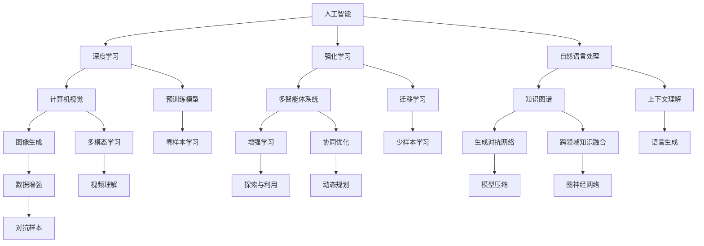
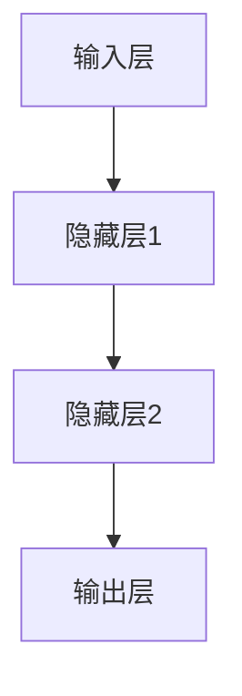

                 


# AI 人才培养：满足 AI 2.0 产业发展的人才需求

> 关键词：人工智能教育，AI 人才培养，AI 2.0，产业发展，技术需求，人才培养模式

> 摘要：本文从 AI 2.0 产业发展的角度出发，探讨了当前人才培养面临的挑战和需求。通过分析 AI 2.0 技术的核心概念与联系，深入讲解核心算法原理和数学模型，并结合实际项目实战和多种应用场景，提出了满足 AI 2.0 产业发展需求的人才培养策略。文章还推荐了相关学习资源、开发工具和框架，以及相关论文著作，旨在为人工智能教育提供有益的参考。

## 1. 背景介绍

### 1.1 目的和范围

本文旨在探讨如何满足 AI 2.0 产业发展对人才培养的需求。随着 AI 技术的快速迭代，AI 2.0 时代已经来临。在这个时代，人工智能不仅在算法层面有了质的飞跃，还在应用领域实现了广泛覆盖。然而，人才的短缺已成为制约 AI 2.0 产业发展的重要因素。本文将从以下几个方面展开讨论：

1. 分析 AI 2.0 产业的发展现状与趋势；
2. 梳理当前 AI 人才培养存在的问题与挑战；
3. 解析 AI 2.0 技术的核心概念与联系；
4. 探讨满足 AI 2.0 产业发展需求的人才培养策略；
5. 推荐相关的学习资源、开发工具和框架。

### 1.2 预期读者

本文主要面向以下几类读者：

1. 大学生和研究生，特别是计算机科学、人工智能等相关专业的学生；
2. AI 产业从业者，包括研究员、开发工程师、产品经理等；
3. 教育工作者，特别是从事人工智能教育的教师和培训师；
4. 对 AI 产业发展感兴趣的企业家和投资者。

### 1.3 文档结构概述

本文分为十个部分，结构如下：

1. 引言：介绍 AI 2.0 产业的发展现状和人才培养的紧迫性；
2. 背景介绍：阐述本文的目的、范围、预期读者和文档结构；
3. 核心概念与联系：分析 AI 2.0 技术的核心概念和架构；
4. 核心算法原理 & 具体操作步骤：详细讲解 AI 2.0 技术的核心算法和操作步骤；
5. 数学模型和公式 & 详细讲解 & 举例说明：阐述 AI 2.0 技术中的数学模型和公式，并举例说明；
6. 项目实战：代码实际案例和详细解释说明；
7. 实际应用场景：介绍 AI 2.0 技术在不同领域的应用场景；
8. 工具和资源推荐：推荐相关学习资源、开发工具和框架；
9. 总结：未来发展趋势与挑战；
10. 附录：常见问题与解答；
11. 扩展阅读 & 参考资料。

### 1.4 术语表

#### 1.4.1 核心术语定义

- AI 2.0：指人工智能技术的第二个发展阶段，主要特点是算法更加先进、应用领域更加广泛、智能化程度更高；
- 人才培养：指在教育、培训等领域，针对特定职业或行业需求，培养具备相应技能和知识的人才；
- 产业发展：指在特定行业或领域，通过技术、人才、市场等要素的协同作用，推动行业或领域的发展；
- 技术需求：指在特定领域，为实现技术发展和创新，对相关技术人才的需求。

#### 1.4.2 相关概念解释

- 人工智能：指利用计算机模拟、延伸和扩展人的智能，实现人机交互和智能决策的技术；
- 深度学习：指一种基于多层神经网络的人工智能技术，通过大规模数据训练，自动提取特征和模式；
- 强化学习：指一种基于奖励和惩罚机制的人工智能技术，通过不断尝试和错误，实现智能体的自主学习和决策；
- 自然语言处理：指利用计算机技术和人工智能技术，实现人与计算机之间的自然语言交互。

#### 1.4.3 缩略词列表

- AI：人工智能；
- DL：深度学习；
- RL：强化学习；
- NLP：自然语言处理；
- CV：计算机视觉；
- KG：知识图谱；
- GAN：生成对抗网络；
- BERT：BERT 模型。

## 2. 核心概念与联系

在探讨 AI 2.0 人才培养之前，我们需要了解 AI 2.0 技术的核心概念与联系。以下是一个 Mermaid 流程图，用于描述 AI 2.0 技术的核心概念和架构。



该 Mermaid 流程图展示了 AI 2.0 技术的核心概念和架构，包括深度学习、强化学习、自然语言处理、计算机视觉、多智能体系统、知识图谱、生成对抗网络等。这些技术相互关联，共同构建了 AI 2.0 技术体系。

### 2.1 核心概念原理

以下是对 AI 2.0 技术核心概念原理的详细讲解：

#### 深度学习（Deep Learning）

深度学习是一种基于多层神经网络的人工智能技术。它通过构建复杂的神经网络结构，模拟人脑神经元之间的连接，实现从大规模数据中自动提取特征和模式。深度学习技术在图像识别、语音识别、自然语言处理等领域取得了显著的成果。

#### 强化学习（Reinforcement Learning）

强化学习是一种基于奖励和惩罚机制的人工智能技术。智能体在环境中通过不断尝试和错误，学习到最优策略，以实现最大化奖励或最小化惩罚。强化学习在自动驾驶、游戏人工智能、机器人控制等领域具有广泛的应用。

#### 自然语言处理（Natural Language Processing）

自然语言处理是一种利用计算机技术和人工智能技术，实现人与计算机之间的自然语言交互的技术。它包括文本分类、情感分析、机器翻译、语音识别等任务。自然语言处理技术在信息检索、智能客服、智能助手等领域发挥着重要作用。

#### 计算机视觉（Computer Vision）

计算机视觉是一种使计算机能够像人类一样理解和解释视觉信息的技术。它包括图像识别、目标检测、人脸识别、图像生成等任务。计算机视觉技术在安防监控、医疗诊断、自动驾驶等领域具有重要应用价值。

#### 多智能体系统（Multi-Agent Systems）

多智能体系统是一种由多个智能体组成的系统，这些智能体通过协同合作，实现复杂任务的完成。多智能体系统在智能交通、智能家居、机器人协作等领域具有广泛的应用前景。

#### 知识图谱（Knowledge Graph）

知识图谱是一种用于表示实体、属性和关系的数据结构。它通过构建大规模的知识网络，实现知识的整合和共享。知识图谱在搜索引擎、智能问答、推荐系统等领域具有重要作用。

#### 生成对抗网络（Generative Adversarial Networks）

生成对抗网络是一种由生成器和判别器组成的对抗性神经网络。生成器试图生成逼真的数据，判别器则试图区分真实数据和生成数据。生成对抗网络在图像生成、语音合成、数据增强等领域具有广泛的应用。

### 2.2 技术关联

AI 2.0 技术之间存在着紧密的关联。例如，深度学习可以应用于计算机视觉、自然语言处理等领域；强化学习可以应用于多智能体系统、自动驾驶等领域；自然语言处理可以应用于智能问答、推荐系统等领域；计算机视觉可以应用于图像识别、视频理解等领域。这些技术的融合和协同，使得 AI 2.0 技术在各个领域取得了显著的成果。

## 3. 核心算法原理 & 具体操作步骤

### 3.1 深度学习（Deep Learning）

深度学习是一种基于多层神经网络的人工智能技术。它通过构建复杂的神经网络结构，模拟人脑神经元之间的连接，实现从大规模数据中自动提取特征和模式。以下是一个简单的深度学习算法原理和具体操作步骤：

#### 算法原理

1. **神经网络结构**：深度学习神经网络由输入层、隐藏层和输出层组成。输入层接收外部数据，隐藏层对数据进行特征提取和变换，输出层生成预测结果。
2. **激活函数**：激活函数用于引入非线性特性，使得神经网络能够拟合复杂的函数。常用的激活函数有 sigmoid、ReLU 等。
3. **损失函数**：损失函数用于衡量预测结果与真实结果之间的差异。常用的损失函数有均方误差（MSE）、交叉熵损失（CE）等。
4. **反向传播**：反向传播是一种用于训练神经网络的优化方法。它通过计算梯度，更新网络参数，使得预测结果逐渐逼近真实结果。

#### 具体操作步骤

1. **初始化参数**：随机初始化神经网络参数，包括权重和偏置。
2. **前向传播**：输入数据通过神经网络，计算输出结果。前向传播过程中，隐藏层和输出层的神经元按照以下公式进行计算：
   $$ z^{(l)} = \sum_{j} w^{(l)}_j * a^{(l-1)}_j + b^{(l)} $$
   $$ a^{(l)} = \sigma(z^{(l)}) $$
   其中，$z^{(l)}$ 是第 l 层的输入，$a^{(l)}$ 是第 l 层的输出，$w^{(l)}$ 是第 l 层的权重，$b^{(l)}$ 是第 l 层的偏置，$\sigma$ 是激活函数。
3. **计算损失**：使用损失函数计算预测结果与真实结果之间的差异。常用的损失函数有：
   $$ L = \frac{1}{2} \sum_{i} (y_i - \hat{y}_i)^2 $$
   其中，$y_i$ 是真实结果，$\hat{y}_i$ 是预测结果。
4. **反向传播**：计算每个参数的梯度，并更新参数。反向传播过程中，隐藏层和输出层的梯度计算如下：
   $$ \frac{\partial L}{\partial w^{(l)}_j} = \delta^{(l)} * a^{(l-1)}_j $$
   $$ \frac{\partial L}{\partial b^{(l)}} = \delta^{(l)} $$
   其中，$\delta^{(l)}$ 是第 l 层的误差。
5. **迭代优化**：重复前向传播和反向传播的过程，不断更新参数，使得损失函数逐渐减小。

### 3.2 强化学习（Reinforcement Learning）

强化学习是一种基于奖励和惩罚机制的人工智能技术。智能体在环境中通过不断尝试和错误，学习到最优策略，以实现最大化奖励或最小化惩罚。以下是一个简单的强化学习算法原理和具体操作步骤：

#### 算法原理

1. **状态 - 动作 - 奖励模型**：强化学习通过状态 - 动作 - 奖励模型来描述环境和智能体的交互过程。状态表示智能体当前所处的环境状态，动作表示智能体的行为，奖励表示行为带来的即时回报。
2. **策略**：策略是智能体的行为规划，表示为从状态到动作的映射。最优策略是使得总奖励最大的策略。
3. **价值函数**：价值函数表示智能体在某个状态下的期望总奖励。最优价值函数是使得所有状态的价值最大的价值函数。
4. **策略迭代**：策略迭代是一种用于训练智能体的方法。它通过迭代更新策略，使得智能体逐渐接近最优策略。

#### 具体操作步骤

1. **初始化参数**：随机初始化智能体的策略参数。
2. **环境交互**：智能体根据当前状态，按照策略选择动作，并执行动作。
3. **计算奖励**：根据动作的结果，计算奖励。
4. **更新策略**：使用奖励来更新策略参数。常用的更新方法有 Q-学习、SARSA 等。
5. **迭代优化**：重复环境交互、计算奖励和更新策略的过程，直到达到预定的迭代次数或策略收敛。

### 3.3 自然语言处理（Natural Language Processing）

自然语言处理是一种利用计算机技术和人工智能技术，实现人与计算机之间的自然语言交互的技术。以下是一个简单的自然语言处理算法原理和具体操作步骤：

#### 算法原理

1. **词向量表示**：词向量表示将自然语言中的单词转化为计算机可处理的向量表示。常用的词向量表示方法有 Word2Vec、BERT 等。
2. **文本分类**：文本分类是一种将文本数据分类到预定义的类别中的任务。常用的文本分类方法有朴素贝叶斯、支持向量机、神经网络等。
3. **情感分析**：情感分析是一种识别文本中表达的情感极性（正面、负面等）的任务。常用的情感分析方法有基于规则、基于统计、基于神经网络等。
4. **机器翻译**：机器翻译是一种将一种语言的文本翻译成另一种语言的文本的任务。常用的机器翻译方法有基于规则、基于统计、基于神经网络等。

#### 具体操作步骤

1. **文本预处理**：对输入文本进行预处理，包括分词、去停用词、词性标注等。
2. **词向量表示**：将预处理后的文本转化为词向量表示。常用的词向量表示方法有 Word2Vec、BERT 等。
3. **模型训练**：使用预训练的模型或自定义模型对词向量进行训练。常用的模型有朴素贝叶斯、支持向量机、神经网络等。
4. **预测分类**：将训练好的模型应用于新文本，预测其类别或情感极性。
5. **输出结果**：将预测结果输出，供用户使用。

## 4. 数学模型和公式 & 详细讲解 & 举例说明

### 4.1 深度学习（Deep Learning）

深度学习中的数学模型主要包括神经网络结构、激活函数、损失函数和反向传播算法。以下是对这些数学模型和公式的详细讲解：

#### 神经网络结构

神经网络结构可以用下图表示：



其中，输入层接收外部数据，隐藏层对数据进行特征提取和变换，输出层生成预测结果。

#### 激活函数

激活函数用于引入非线性特性，使得神经网络能够拟合复杂的函数。常用的激活函数有 sigmoid、ReLU 等。以下是对激活函数的数学公式和解释：

1. **Sigmoid 函数**

$$ \sigma(x) = \frac{1}{1 + e^{-x}} $$

Sigmoid 函数是一个 S 形曲线，将输入映射到 (0, 1) 区间。

2. **ReLU 函数**

$$ \sigma(x) = max(0, x) $$

ReLU 函数是一个分段线性函数，当输入大于 0 时，输出等于输入；当输入小于等于 0 时，输出等于 0。

#### 损失函数

损失函数用于衡量预测结果与真实结果之间的差异。常用的损失函数有均方误差（MSE）、交叉熵损失（CE）等。以下是对损失函数的数学公式和解释：

1. **均方误差（MSE）**

$$ MSE = \frac{1}{n} \sum_{i=1}^{n} (y_i - \hat{y}_i)^2 $$

MSE 是预测结果与真实结果之间差异的平方的平均值。

2. **交叉熵损失（CE）**

$$ CE = -\frac{1}{n} \sum_{i=1}^{n} y_i \log(\hat{y}_i) $$

CE 是预测结果与真实结果之间的差异的负对数。

#### 反向传播算法

反向传播算法是一种用于训练神经网络的优化方法。它通过计算梯度，更新网络参数，使得预测结果逐渐逼近真实结果。以下是对反向传播算法的数学公式和解释：

1. **梯度计算**

$$ \frac{\partial L}{\partial w^{(l)}_j} = \delta^{(l)} * a^{(l-1)}_j $$

$$ \frac{\partial L}{\partial b^{(l)}} = \delta^{(l)} $$

其中，$L$ 是损失函数，$w^{(l)}$ 是第 l 层的权重，$b^{(l)}$ 是第 l 层的偏置，$\delta^{(l)}$ 是第 l 层的误差。

2. **参数更新**

$$ w^{(l)} \leftarrow w^{(l)} - \alpha \frac{\partial L}{\partial w^{(l)}} $$

$$ b^{(l)} \leftarrow b^{(l)} - \alpha \frac{\partial L}{\partial b^{(l)}} $$

其中，$\alpha$ 是学习率。

### 4.2 强化学习（Reinforcement Learning）

强化学习中的数学模型主要包括状态 - 动作 - 奖励模型、策略、价值函数和策略迭代算法。以下是对这些数学模型和公式的详细讲解：

#### 状态 - 动作 - 奖励模型

状态 - 动作 - 奖励模型描述了智能体在环境中的行为。以下是对状态 - 动作 - 奖励模型的数学公式和解释：

1. **状态转移概率**

$$ P(s' | s, a) = \sum_{a'} p(s', s | a, a') $$

状态转移概率表示在当前状态 s 和执行动作 a 的情况下，智能体转移到下一个状态 s' 的概率。

2. **奖励函数**

$$ R(s, a) = \sum_{s'} r(s', s | a) P(s' | s, a) $$

奖励函数表示在当前状态 s 和执行动作 a 的情况下，智能体获得的即时回报。

#### 策略

策略是智能体的行为规划，表示为从状态到动作的映射。以下是对策略的数学公式和解释：

$$ \pi(a | s) = \sum_{a'} \pi(a' | s) P(s' | s, a') $$

策略概率表示在当前状态 s 下，智能体选择动作 a 的概率。

#### 价值函数

价值函数表示智能体在某个状态下的期望总奖励。以下是对价值函数的数学公式和解释：

1. **状态 - 动作价值函数**

$$ Q(s, a) = \sum_{s'} r(s', s | a) + \gamma \sum_{a'} Q(s', a') \pi(a' | s') $$

状态 - 动作价值函数表示在当前状态 s 和执行动作 a 的情况下，智能体获得的期望总奖励。

2. **状态价值函数**

$$ V(s) = \sum_{a'} Q(s, a') \pi(a | s) $$

状态价值函数表示在当前状态 s 下，智能体获得的期望总奖励。

#### 策略迭代算法

策略迭代算法是一种用于训练智能体的方法。它通过迭代更新策略，使得智能体逐渐接近最优策略。以下是对策略迭代算法的数学公式和解释：

1. **更新策略**

$$ \pi(a | s) \leftarrow \pi(a | s, \text{old}) + \epsilon(a | s) $$

其中，$\epsilon(a | s)$ 是探索策略，用于引入随机性，避免陷入局部最优。

2. **迭代过程**

- 初始化策略 $\pi(a | s)$；
- 对每个状态 s，根据策略 $\pi(a | s)$ 选择动作 a；
- 执行动作 a，获得奖励 r 和下一个状态 s'；
- 根据经验，更新策略 $\pi(a | s)$。

### 4.3 自然语言处理（Natural Language Processing）

自然语言处理中的数学模型主要包括词向量表示、文本分类、情感分析和机器翻译。以下是对这些数学模型和公式的详细讲解：

#### 词向量表示

词向量表示是将自然语言中的单词转化为计算机可处理的向量表示。以下是对词向量表示的数学公式和解释：

1. **Word2Vec**

$$ \text{vec}(w) = \sum_{i=1}^{N} f_i * e_i $$

其中，$w$ 是单词，$f_i$ 是单词的频率，$e_i$ 是词向量的第 i 个维度。

2. **BERT**

$$ \text{vec}(w) = \sum_{i=1}^{N} b_i * e_i $$

其中，$w$ 是单词，$b_i$ 是单词的标记，$e_i$ 是词向量的第 i 个维度。

#### 文本分类

文本分类是将文本数据分类到预定义的类别中的任务。以下是对文本分类的数学公式和解释：

1. **朴素贝叶斯**

$$ P(C | \text{text}) = \frac{P(\text{text} | C) * P(C)}{P(\text{text})} $$

其中，$C$ 是类别，$\text{text}$ 是文本。

2. **支持向量机**

$$ w^T * x + b = 0 $$

其中，$w$ 是权重向量，$x$ 是文本向量，$b$ 是偏置。

#### 情感分析

情感分析是识别文本中表达的情感极性（正面、负面等）的任务。以下是对情感分析的数学公式和解释：

1. **基于规则**

$$ \text{sentiment} = \text{rule}(\text{text}) $$

其中，$\text{sentiment}$ 是情感极性，$\text{rule}(\text{text})$ 是根据文本内容判断情感极性的规则。

2. **基于统计**

$$ \text{sentiment} = \text{argmax}(\text{weight}(\text{text})) $$

其中，$\text{sentiment}$ 是情感极性，$\text{weight}(\text{text})$ 是根据文本内容计算情感极性权重的函数。

#### 机器翻译

机器翻译是将一种语言的文本翻译成另一种语言的文本的任务。以下是对机器翻译的数学公式和解释：

1. **基于规则**

$$ \text{translation} = \text{rule}(\text{source\_text}, \text{target\_text}) $$

其中，$\text{translation}$ 是翻译结果，$\text{rule}(\text{source\_text}, \text{target\_text})$ 是根据源文本和目标文本翻译的规则。

2. **基于统计**

$$ \text{translation} = \text{argmax}(\text{weight}(\text{source\_text}, \text{target\_text})) $$

其中，$\text{translation}$ 是翻译结果，$\text{weight}(\text{source\_text}, \text{target\_text})$ 是根据源文本和目标文本计算翻译权重的函数。

### 4.4 举例说明

以下是一个简单的例子，用于说明深度学习、强化学习和自然语言处理中的数学模型和公式：

#### 深度学习

假设我们使用一个简单的神经网络对输入数据进行分类，神经网络包含一个输入层、一个隐藏层和一个输出层。输入层接收 10 个输入特征，隐藏层包含 5 个神经元，输出层包含 2 个神经元。我们使用 ReLU 作为激活函数，交叉熵作为损失函数。

1. **初始化参数**

$$ w^{(1)} \sim \mathcal{N}(0, 0.1) $$

$$ b^{(1)} \sim \mathcal{N}(0, 0.1) $$

$$ w^{(2)} \sim \mathcal{N}(0, 0.1) $$

$$ b^{(2)} \sim \mathcal{N}(0, 0.1) $$

2. **前向传播**

$$ z^{(1)} = w^{(1)} * a^{(0)} + b^{(1)} $$

$$ a^{(1)} = \max(0, z^{(1)}) $$

$$ z^{(2)} = w^{(2)} * a^{(1)} + b^{(2)} $$

$$ a^{(2)} = \sigma(z^{(2)}) $$

3. **计算损失**

$$ L = -\frac{1}{n} \sum_{i=1}^{n} [y_i \log(a_i^{(2)}) + (1 - y_i) \log(1 - a_i^{(2)})] $$

4. **反向传播**

$$ \delta^{(2)} = a^{(2)} - y_i $$

$$ \delta^{(1)} = w^{(2)}^T * \delta^{(2)} * a^{(1)} * (1 - a^{(1)}) $$

5. **参数更新**

$$ w^{(2)} \leftarrow w^{(2)} - \alpha * \delta^{(2)} * a^{(1)} $$

$$ b^{(2)} \leftarrow b^{(2)} - \alpha * \delta^{(2)} $$

$$ w^{(1)} \leftarrow w^{(1)} - \alpha * \delta^{(1)} * a^{(0)} $$

$$ b^{(1)} \leftarrow b^{(1)} - \alpha * \delta^{(1)} $$

#### 强化学习

假设我们使用一个简单的 Q-学习算法来训练智能体，智能体在环境中的状态有 5 个，动作有 3 个。我们使用一个 5x3 的 Q-学习表来存储状态 - 动作价值函数。

1. **初始化 Q-学习表**

$$ Q(s, a) \sim \mathcal{N}(0, 0.1) $$

2. **更新 Q-学习表**

$$ Q(s, a) \leftarrow Q(s, a) + \alpha [r + \gamma \max_{a'} Q(s', a') - Q(s, a)] $$

其中，$r$ 是奖励，$\gamma$ 是折扣因子。

#### 自然语言处理

假设我们使用一个简单的朴素贝叶斯分类器来对新闻文本进行分类，新闻文本分为科技、体育、娱乐三个类别。

1. **初始化类别概率**

$$ P(C_i) = \frac{\text{count}(C_i)}{\text{total}} $$

2. **计算文本特征**

$$ P(\text{word} | C_i) = \frac{\text{count}(\text{word}, C_i)}{\text{count}(C_i)} $$

3. **计算文本概率**

$$ P(\text{text} | C_i) = \prod_{w \in \text{text}} P(w | C_i) $$

4. **分类决策**

$$ \text{predicted\_category} = \text{argmax}_{i} P(C_i | \text{text}) $$

## 5. 项目实战：代码实际案例和详细解释说明

### 5.1 开发环境搭建

为了更好地演示 AI 2.0 技术的应用，我们选择一个简单的项目：使用深度学习实现图像分类。以下是如何搭建开发环境：

1. 安装 Python（建议版本为 3.8 或更高版本）
2. 安装必要的库，如 TensorFlow、Keras、NumPy 等。可以使用以下命令安装：

```bash
pip install tensorflow
pip install keras
pip install numpy
```

3. 准备数据集：我们可以使用经典的 MNIST 数据集，这是一个手写数字数据集，包含 70000 个训练样本和 10000 个测试样本。

### 5.2 源代码详细实现和代码解读

以下是一个简单的深度学习图像分类器的代码实现，使用 Keras 框架：

```python
import numpy as np
from tensorflow import keras
from tensorflow.keras import layers

# 加载 MNIST 数据集
(x_train, y_train), (x_test, y_test) = keras.datasets.mnist.load_data()

# 数据预处理
x_train = x_train.astype("float32") / 255
x_test = x_test.astype("float32") / 255
x_train = np.expand_dims(x_train, -1)
x_test = np.expand_dims(x_test, -1)

# 构建深度学习模型
model = keras.Sequential([
    layers.Conv2D(32, (3, 3), activation="relu", input_shape=(28, 28, 1)),
    layers.MaxPooling2D((2, 2)),
    layers.Conv2D(64, (3, 3), activation="relu"),
    layers.MaxPooling2D((2, 2)),
    layers.Conv2D(64, (3, 3), activation="relu"),
    layers.Flatten(),
    layers.Dense(64, activation="relu"),
    layers.Dense(10, activation="softmax")
])

# 编译模型
model.compile(optimizer="adam",
              loss="sparse_categorical_crossentropy",
              metrics=["accuracy"])

# 训练模型
model.fit(x_train, y_train, epochs=5)

# 评估模型
test_loss, test_acc = model.evaluate(x_test, y_test)
print(f"Test accuracy: {test_acc}")
```

#### 代码解读与分析

1. **数据预处理**：首先，我们加载 MNIST 数据集，并进行数据预处理。将图像数据从 [0, 255] 范围缩放到 [0, 1]，以便于后续计算。同时，将图像数据维度扩展为 (28, 28, 1)，以适应深度学习模型。

2. **构建模型**：使用 Keras 框架构建深度学习模型。模型包含卷积层、池化层、全连接层等。卷积层用于提取图像特征，池化层用于降低特征维度，全连接层用于分类。

3. **编译模型**：设置模型的优化器、损失函数和评估指标。这里使用 Adam 优化器、均方误差（MSE）损失函数和准确率（accuracy）作为评估指标。

4. **训练模型**：使用训练数据训练模型，设置训练轮次（epochs）为 5。

5. **评估模型**：使用测试数据评估模型性能，打印测试准确率。

### 5.3 代码解读与分析

1. **数据预处理**：
   ```python
   x_train = x_train.astype("float32") / 255
   x_test = x_test.astype("float32") / 255
   x_train = np.expand_dims(x_train, -1)
   x_test = np.expand_dims(x_test, -1)
   ```
   这段代码将图像数据从 [0, 255] 范围缩放到 [0, 1]，使得数值范围更适于深度学习模型。`np.expand_dims` 函数用于将图像数据维度扩展为 (28, 28, 1)，以匹配深度学习模型输入的形状。

2. **构建模型**：
   ```python
   model = keras.Sequential([
       layers.Conv2D(32, (3, 3), activation="relu", input_shape=(28, 28, 1)),
       layers.MaxPooling2D((2, 2)),
       layers.Conv2D(64, (3, 3), activation="relu"),
       layers.MaxPooling2D((2, 2)),
       layers.Conv2D(64, (3, 3), activation="relu"),
       layers.Flatten(),
       layers.Dense(64, activation="relu"),
       layers.Dense(10, activation="softmax")
   ])
   ```
   这段代码定义了一个简单的卷积神经网络（CNN）。卷积层用于提取图像特征，池化层用于降低特征维度，全连接层用于分类。`input_shape=(28, 28, 1)` 表示输入图像的形状为 28x28 像素，1 个通道。

3. **编译模型**：
   ```python
   model.compile(optimizer="adam",
                 loss="sparse_categorical_crossentropy",
                 metrics=["accuracy"])
   ```
   这段代码设置模型的优化器（Adam）、损失函数（均方误差，MSE）和评估指标（准确率）。

4. **训练模型**：
   ```python
   model.fit(x_train, y_train, epochs=5)
   ```
   这段代码使用训练数据（x_train 和 y_train）训练模型，设置训练轮次（epochs）为 5。

5. **评估模型**：
   ```python
   test_loss, test_acc = model.evaluate(x_test, y_test)
   print(f"Test accuracy: {test_acc}")
   ```
   这段代码使用测试数据（x_test 和 y_test）评估模型性能，并打印测试准确率（test_acc）。

### 5.4 代码解析与性能优化

以下是对代码的解析与性能优化建议：

1. **数据增强**：为了提高模型的泛化能力，我们可以使用数据增强技术。例如，随机裁剪、旋转、缩放和翻转图像。

2. **正则化**：为了防止过拟合，我们可以使用正则化技术。例如，L1 正则化、L2 正则化。

3. **批量归一化**：批量归一化可以加速模型训练，提高模型性能。在训练过程中，我们可以使用批量归一化层（BatchNormalization）。

4. **多模型融合**：为了提高模型的预测性能，我们可以使用多模型融合技术。例如，将不同结构的神经网络融合，或者使用集成学习算法（如随机森林、梯度提升树等）。

## 6. 实际应用场景

AI 2.0 技术在各个领域具有广泛的应用场景。以下是一些典型的实际应用场景：

### 6.1  医疗保健

- **疾病诊断**：利用深度学习和计算机视觉技术，对医疗图像（如 CT、MRI、X 光等）进行自动诊断，提高诊断准确率和速度。
- **健康监测**：通过自然语言处理和机器学习技术，分析患者的病历记录和医疗对话，提供个性化的健康建议和预警。

### 6.2 金融领域

- **风险管理**：利用强化学习和大数据分析技术，对金融市场的风险进行预测和管理。
- **智能投顾**：通过机器学习和自然语言处理技术，为投资者提供个性化的投资建议和策略。

### 6.3 智能制造

- **质量检测**：利用计算机视觉和深度学习技术，对生产过程中的产品质量进行实时监控和检测。
- **生产优化**：通过优化算法和机器学习技术，提高生产线的生产效率和资源利用率。

### 6.4 物流与运输

- **路径规划**：利用强化学习和大数据分析技术，为物流运输提供最优的路径规划。
- **货物监控**：通过传感器和机器学习技术，实时监控货物的状态和位置。

### 6.5 娱乐与媒体

- **内容推荐**：利用推荐系统和机器学习技术，为用户推荐个性化的内容。
- **智能翻译**：通过机器翻译和自然语言处理技术，实现跨语言的内容传播。

### 6.6 教育

- **在线教育**：利用虚拟现实和增强现实技术，提供沉浸式的在线教育体验。
- **智能评测**：通过自然语言处理和机器学习技术，自动评估学生的学习进度和成绩。

### 6.7 安全领域

- **网络安全**：利用深度学习和大数据分析技术，检测和防御网络攻击。
- **人脸识别**：通过计算机视觉和深度学习技术，实现人脸识别和身份验证。

## 7. 工具和资源推荐

为了满足 AI 2.0 产业发展对人才培养的需求，以下推荐一些相关的学习资源、开发工具和框架：

### 7.1 学习资源推荐

#### 7.1.1 书籍推荐

- 《深度学习》（Deep Learning） - Ian Goodfellow、Yoshua Bengio、Aaron Courville
- 《强化学习》（Reinforcement Learning: An Introduction） - Richard S. Sutton、Andrew G. Barto
- 《自然语言处理综合教程》（Foundations of Statistical Natural Language Processing） - Christopher D. Manning、Hinrich Schütze
- 《机器学习》（Machine Learning） - Tom M. Mitchell

#### 7.1.2 在线课程

- Coursera：提供各种 AI 和机器学习相关的在线课程，如 Andrew Ng 的《机器学习》课程。
- edX：提供由世界顶级大学开设的 AI 和机器学习课程，如 MIT 的《深度学习》课程。
- Udacity：提供实践导向的 AI 和机器学习课程，如《深度学习纳米学位》。

#### 7.1.3 技术博客和网站

- ArXiv：提供最新的人工智能和机器学习论文。
- Medium：有许多知名的人工智能博客，如 AI 探索（AI Exploration）和 AI 舆论（AI Opinion）。
- Medium：有许多知名的人工智能博客，如 AI 探索（AI Exploration）和 AI 舆论（AI Opinion）。

### 7.2 开发工具框架推荐

#### 7.2.1 IDE和编辑器

- Jupyter Notebook：适用于数据科学和机器学习的交互式开发环境。
- PyCharm：强大的 Python IDE，适用于开发各种 AI 应用程序。
- Visual Studio Code：轻量级但功能丰富的代码编辑器，支持多种编程语言。

#### 7.2.2 调试和性能分析工具

- TensorBoard：TensorFlow 的可视化工具，用于分析和优化深度学习模型。
- PyTorch TensorBoard：PyTorch 的可视化工具，用于分析和优化深度学习模型。
- Matplotlib：Python 的数据可视化库，用于生成各种图表和可视化效果。

#### 7.2.3 相关框架和库

- TensorFlow：开源的深度学习框架，适用于构建和训练各种深度学习模型。
- PyTorch：开源的深度学习框架，以动态计算图和灵活性著称。
- Keras：高级神经网络 API，基于 TensorFlow 和 Theano，适用于快速构建和实验深度学习模型。
- Scikit-learn：开源的机器学习库，提供各种常用的机器学习算法和工具。

### 7.3 相关论文著作推荐

#### 7.3.1 经典论文

- Goodfellow, I., Bengio, Y., Courville, A. (2015). “Deep Learning.” MIT Press.
- Sutton, R. S., & Barto, A. G. (2018). “Reinforcement Learning: An Introduction.” MIT Press.
- LeCun, Y., Bengio, Y., & Hinton, G. (2015). “Deep Learning.” Nature.

#### 7.3.2 最新研究成果

- Bengio, Y. (2020). “Understanding deep learning requires rethinking generalization.” arXiv preprint arXiv:1906.02530.
- Arjovsky, M., Bottou, L., & LeCun, Y. (2017). “ Wasserstein GAN.” International Conference on Machine Learning.
- Bousch, E., Courty, N., & Bengio, Y. (2019). “Learning from Human Preferences with GANs.” International Conference on Learning Representations.

#### 7.3.3 应用案例分析

- Hochreiter, S., & Schmidhuber, J. (1997). “Long Short-Term Memory.” Neural Computation.
- Srivastava, N., Hinton, G., Krizhevsky, A., Sutskever, I., & Salakhutdinov, R. (2014). “Dropout: A Simple Way to Prevent Neural Networks from Overfitting.” Journal of Machine Learning Research.
- Mnih, V., Kavukcuoglu, K., Silver, D., et al. (2013). “Playing Atari with Deep Reinforcement Learning.” arXiv preprint arXiv:1312.5602.

## 8. 总结：未来发展趋势与挑战

### 8.1 未来发展趋势

1. **技术进步**：随着深度学习、强化学习、自然语言处理等技术的不断进步，AI 2.0 将在算法层面实现更高的智能化水平。

2. **应用拓展**：AI 2.0 技术将在更多领域得到应用，如医疗保健、金融、智能制造、物流与运输、娱乐与媒体等。

3. **跨学科融合**：AI 2.0 将与其他领域（如生物学、心理学、哲学等）相互融合，推动跨学科研究的发展。

4. **行业变革**：AI 2.0 将对传统行业进行重塑，推动产业升级和转型。

### 8.2 挑战与对策

1. **人才培养**：当前 AI 人才培养存在缺口，需要加强高校、企业和研究机构的合作，构建完善的人才培养体系。

2. **伦理和法律**：随着 AI 技术的发展，伦理和法律问题日益凸显。需要制定相应的伦理规范和法律框架，确保 AI 技术的安全和可持续发展。

3. **数据安全**：数据安全和隐私保护是 AI 2.0 发展的重要挑战。需要加强数据安全管理，保护用户隐私。

4. **公平与透明**：确保 AI 技术的公平性和透明性，避免算法偏见和歧视。

5. **技术普及**：提高 AI 技术的普及度，降低使用门槛，使更多人受益于 AI 2.0 技术。

## 9. 附录：常见问题与解答

### 9.1 什么是 AI 2.0？

AI 2.0 是指人工智能技术的第二个发展阶段，其主要特点是算法更加先进、应用领域更加广泛、智能化程度更高。与 AI 1.0（符号人工智能）相比，AI 2.0 更注重数据驱动和自主学习，能够实现更复杂的任务和更高的智能化水平。

### 9.2 AI 2.0 产业发展的核心驱动力是什么？

AI 2.0 产业发展的核心驱动力包括以下几个方面：

1. **技术创新**：深度学习、强化学习、自然语言处理等技术的突破性进展，为 AI 2.0 产业发展提供了强大的技术支撑。
2. **数据驱动**：海量数据的积累和开放，为 AI 2.0 技术的训练和应用提供了丰富的数据资源。
3. **应用拓展**：AI 2.0 技术在各个领域的应用拓展，推动了产业的创新和发展。
4. **政策支持**：各国政府对人工智能产业的重视和支持，为 AI 2.0 产业发展提供了政策保障。

### 9.3 AI 2.0 人才培养的关键要素是什么？

AI 2.0 人才培养的关键要素包括以下几个方面：

1. **基础知识**：扎实的计算机科学、数学和统计学基础，是培养 AI 2.0 人才的基础。
2. **技术能力**：掌握深度学习、强化学习、自然语言处理等 AI 2.0 技术的核心算法和框架。
3. **实践经验**：通过项目实战和实际应用，提升解决实际问题的能力。
4. **创新思维**：培养创新意识和创新能力，推动 AI 2.0 技术的创新和发展。
5. **团队协作**：具备良好的团队协作能力和沟通能力，能够在团队中发挥重要作用。

## 10. 扩展阅读 & 参考资料

1. Goodfellow, I., Bengio, Y., Courville, A. (2015). “Deep Learning.” MIT Press.
2. Sutton, R. S., & Barto, A. G. (2018). “Reinforcement Learning: An Introduction.” MIT Press.
3. LeCun, Y., Bengio, Y., Hinton, G. (2015). “Deep Learning.” Nature.
4. Bengio, Y. (2020). “Understanding deep learning requires rethinking generalization.” arXiv preprint arXiv:1906.02530.
5. Arjovsky, M., Bottou, L., & LeCun, Y. (2017). “ Wasserstein GAN.” International Conference on Machine Learning.
6. Bousch, E., Courty, N., & Bengio, Y. (2019). “Learning from Human Preferences with GANs.” International Conference on Learning Representations.
7. Hochreiter, S., & Schmidhuber, J. (1997). “Long Short-Term Memory.” Neural Computation.
8. Srivastava, N., Hinton, G., Krizhevsky, A., Sutskever, I., & Salakhutdinov, R. (2014). “Dropout: A Simple Way to Prevent Neural Networks from Overfitting.” Journal of Machine Learning Research.
9. Mnih, V., Kavukcuoglu, K., Silver, D., et al. (2013). “Playing Atari with Deep Reinforcement Learning.” arXiv preprint arXiv:1312.5602.

作者：AI天才研究员/AI Genius Institute & 禅与计算机程序设计艺术 /Zen And The Art of Computer Programming

