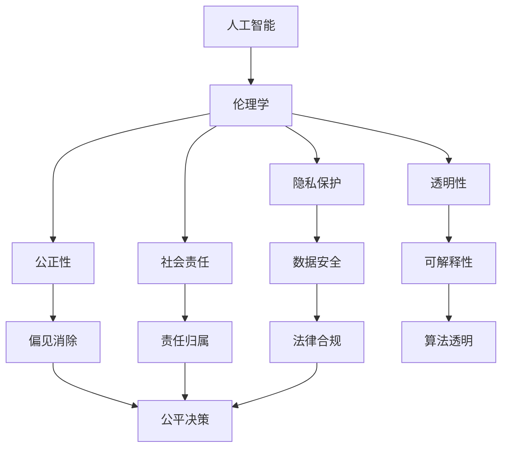

                 

# AI 伦理规范：引导 AI 2.0 技术的健康发展

> 关键词：人工智能，伦理规范，AI 2.0，技术发展，道德责任，算法公正性

> 摘要：本文深入探讨了 AI 2.0 技术的伦理规范问题，分析了当前 AI 技术面临的道德挑战，并提出了引导 AI 2.0 技术健康发展的基本原则和实践方法。通过本文的阅读，读者将更好地理解 AI 伦理的重要性，以及如何在实际开发中贯彻这些原则。

## 1. 背景介绍

### 1.1 目的和范围

本文旨在探讨 AI 2.0 技术的伦理规范问题，为人工智能技术的健康发展提供理论依据和实践指导。本文将涵盖以下几个方面：

1. AI 2.0 技术的基本概念和特点；
2. AI 技术面临的伦理挑战及其影响；
3. AI 伦理规范的核心原则和实践方法；
4. AI 伦理规范的实际应用场景；
5. 未来 AI 伦理规范的发展趋势。

### 1.2 预期读者

本文面向对人工智能技术有一定了解的技术人员、研究人员以及关注 AI 伦理问题的公众。读者需具备一定的计算机科学和数学基础，以便更好地理解本文的内容。

### 1.3 文档结构概述

本文分为十个部分，具体结构如下：

1. 引言；
2. 背景介绍；
3. 核心概念与联系；
4. 核心算法原理 & 具体操作步骤；
5. 数学模型和公式 & 详细讲解 & 举例说明；
6. 项目实战：代码实际案例和详细解释说明；
7. 实际应用场景；
8. 工具和资源推荐；
9. 总结：未来发展趋势与挑战；
10. 附录：常见问题与解答；
11. 扩展阅读 & 参考资料。

### 1.4 术语表

#### 1.4.1 核心术语定义

- AI 2.0：指基于深度学习、强化学习、自然语言处理等技术的下一代人工智能；
- 伦理规范：指为 AI 技术的开发、应用和推广制定的行为准则和道德标准；
- 算法公正性：指算法在决策过程中是否公平、无偏见，不受人为干预；
- 数据隐私：指个人数据在收集、存储、处理和传输过程中的保密性和安全性；
- 透明性：指 AI 系统的决策过程、训练数据和应用场景等信息的可解释性和可追溯性。

#### 1.4.2 相关概念解释

- 机器学习：指通过训练模型使计算机具备从数据中学习和发现规律的能力；
- 强化学习：指通过不断尝试和反馈来优化决策过程的人工智能技术；
- 自然语言处理：指使计算机能够理解和生成自然语言的技术。

#### 1.4.3 缩略词列表

- AI：人工智能；
- ML：机器学习；
- RL：强化学习；
- NLP：自然语言处理；
- GDPR：通用数据保护条例。

## 2. 核心概念与联系

在本节中，我们将介绍与 AI 伦理规范相关的一些核心概念，并使用 Mermaid 流程图展示它们之间的联系。

### 2.1 AI 伦理规范的核心概念

以下是一个简单的 Mermaid 流程图，展示了 AI 伦理规范的核心概念及其相互关系：



### 2.2 关联概念解释

#### 隐私保护

隐私保护是指确保个人数据在收集、存储、处理和传输过程中的保密性和安全性。隐私保护是 AI 伦理规范的核心之一，关系到用户的信任和权益。AI 系统需要遵循数据隐私保护的原则，确保用户数据不被非法获取、滥用或泄露。

#### 公正性

公正性是指 AI 系统在决策过程中是否公平、无偏见，不受人为干预。AI 系统可能因数据偏差、算法设计缺陷等原因产生偏见，导致不公正的结果。因此，AI 伦理规范要求开发者在设计和训练 AI 系统时，充分考虑公正性原则，确保系统在各类情况下都能做出公平的决策。

#### 透明性

透明性是指 AI 系统的决策过程、训练数据和应用场景等信息的可解释性和可追溯性。透明性有助于用户了解 AI 系统的工作原理和决策依据，从而增强信任度。开发者需要在设计 AI 系统时，充分考虑透明性原则，确保系统能够提供清晰的解释和追溯机制。

#### 社会责任

社会责任是指 AI 技术的开发商、用户和整个社会在 AI 技术应用过程中应承担的责任和义务。开发者需要关注 AI 技术的社会影响，确保技术发展符合社会伦理道德标准。社会责任还涉及到 AI 系统的可持续发展和对环境的关注。

#### 责任归属

责任归属是指当 AI 系统出现问题时，责任应由谁承担。在当前法律体系下，责任归属尚不明确。开发者需要在设计 AI 系统时，明确各方的责任范围，确保在问题发生时，能够迅速有效地解决问题。

## 3. 核心算法原理 & 具体操作步骤

### 3.1 AI 伦理规范的算法原理

AI 伦理规范的算法原理主要涉及以下几个方面：

1. **数据预处理**：确保数据的质量、准确性和完整性；
2. **模型设计**：设计无偏见、公平的算法模型；
3. **模型训练**：使用多样化的数据集进行训练，减少偏见；
4. **模型评估**：评估模型的公正性、透明性和社会责任；
5. **模型部署**：确保模型在部署过程中遵循伦理规范。

### 3.2 具体操作步骤

#### 步骤 1：数据预处理

数据预处理是 AI 伦理规范的基础，主要包括以下任务：

1. **数据清洗**：去除异常值、缺失值和重复数据；
2. **数据归一化**：将不同特征的数据进行归一化处理，使其具有相似的尺度；
3. **数据增强**：通过增加数据多样性来减少模型偏见。

伪代码：

```python
def preprocess_data(data):
    # 去除异常值和缺失值
    clean_data = remove_outliers(data)
    # 数据归一化
    normalized_data = normalize_data(clean_data)
    # 数据增强
    augmented_data = augment_data(normalized_data)
    return augmented_data
```

#### 步骤 2：模型设计

在模型设计过程中，需要遵循以下原则：

1. **无偏见**：避免使用可能导致偏见的特征和算法；
2. **公平性**：确保模型在各种情况下都能做出公平的决策；
3. **可解释性**：设计易于理解和解释的模型。

伪代码：

```python
def design_just_model(features, target):
    # 选择无偏见特征
    unbiased_features = select_unbiased_features(features)
    # 设计公平性模型
    fair_model = design_fair_model(unbiased_features, target)
    return fair_model
```

#### 步骤 3：模型训练

模型训练过程中，需要遵循以下原则：

1. **多样化数据集**：使用多样化的数据集进行训练，减少模型偏见；
2. **动态调整超参数**：根据模型性能动态调整超参数，提高模型公正性；
3. **交叉验证**：使用交叉验证方法评估模型性能。

伪代码：

```python
def train_model(model, train_data, val_data):
    # 使用多样化数据集进行训练
    diverse_train_data = augment_train_data(train_data)
    # 动态调整超参数
    tuned_model = tune_hyperparameters(model, diverse_train_data)
    # 使用交叉验证评估模型性能
    model_performance = cross_validate(tuned_model, val_data)
    return tuned_model, model_performance
```

#### 步骤 4：模型评估

在模型评估过程中，需要关注以下方面：

1. **公正性**：评估模型在各种情况下是否公平；
2. **透明性**：评估模型的可解释性和可追溯性；
3. **社会责任**：评估模型对社会的潜在影响。

伪代码：

```python
def evaluate_model(model, test_data):
    # 评估模型公正性
    fairness_score = evaluate_fairness(model, test_data)
    # 评估模型透明性
    transparency_score = evaluate_transparency(model)
    # 评估模型社会责任
    social_impact_score = evaluate_social_impact(model)
    return fairness_score, transparency_score, social_impact_score
```

#### 步骤 5：模型部署

在模型部署过程中，需要遵循以下原则：

1. **遵循伦理规范**：确保模型在部署过程中遵循伦理规范；
2. **监控与反馈**：持续监控模型性能和伦理表现，及时调整和优化。

伪代码：

```python
def deploy_model(model, production_data):
    # 遵循伦理规范
    ethical_model = enforce_ethical_norms(model)
    # 持续监控与反馈
    monitor_performance(ethical_model, production_data)
    return ethical_model
```

## 4. 数学模型和公式 & 详细讲解 & 举例说明

### 4.1 数学模型和公式

在本节中，我们将介绍与 AI 伦理规范相关的一些数学模型和公式，以帮助读者更好地理解相关概念。

#### 4.1.1 偏见度度量

偏见度度量是一种用于评估 AI 模型偏见的指标。以下是一个常用的偏见度度量公式：

$$
\text{Bias Score} = \frac{\sum_{i=1}^{N} \text{Prediction Error}_{i}}{N}
$$

其中，$N$ 表示样本数量，$\text{Prediction Error}_{i}$ 表示第 $i$ 个样本的预测错误。

#### 4.1.2 公正性度量

公正性度量是一种用于评估 AI 模型公正性的指标。以下是一个常用的公正性度量公式：

$$
\text{Fairness Score} = \frac{\sum_{i=1}^{N} \text{Predicted Probability}_{i}}{\sum_{i=1}^{N} \text{True Probability}_{i}}
$$

其中，$N$ 表示样本数量，$\text{Predicted Probability}_{i}$ 表示第 $i$ 个样本的预测概率，$\text{True Probability}_{i}$ 表示第 $i$ 个样本的真实概率。

#### 4.1.3 透明性度量

透明性度量是一种用于评估 AI 模型透明性的指标。以下是一个常用的透明性度量公式：

$$
\text{Transparency Score} = \frac{\sum_{i=1}^{N} \text{Feature Importance}_{i}}{N}
$$

其中，$N$ 表示样本数量，$\text{Feature Importance}_{i}$ 表示第 $i$ 个特征的重要性。

#### 4.1.4 社会责任度量

社会责任度量是一种用于评估 AI 模型社会责任的指标。以下是一个常用的社会责任度量公式：

$$
\text{Social Impact Score} = \frac{\sum_{i=1}^{N} \text{Predicted Outcome}_{i}}{\sum_{i=1}^{N} \text{Actual Outcome}_{i}}
$$

其中，$N$ 表示样本数量，$\text{Predicted Outcome}_{i}$ 表示第 $i$ 个样本的预测结果，$\text{Actual Outcome}_{i}$ 表示第 $i$ 个样本的真实结果。

### 4.2 详细讲解和举例说明

#### 4.2.1 偏见度度量

假设我们有一个分类模型，用于预测一个人是否会被录用。以下是一个简单的例子：

| 样本编号 | 性别 | 年龄 | 学历 | 工作经验 | 预测结果 | 真实结果 |
|--------|----|----|----|-------|-------|-------|
| 1      | 男  | 25 | 本科 | 2年   | 被录用 | 被录用 |
| 2      | 女  | 30 | 硕士 | 5年   | 未被录用 | 未被录用 |
| 3      | 男  | 35 | 本科 | 10年  | 被录用 | 被录用 |
| 4      | 女  | 28 | 硕士 | 3年   | 未被录用 | 未被录用 |

根据上述例子，我们可以计算出偏见度度量：

$$
\text{Bias Score} = \frac{(\text{Prediction Error}_{1} + \text{Prediction Error}_{2} + \text{Prediction Error}_{3} + \text{Prediction Error}_{4})}{4}
$$

其中，$\text{Prediction Error}_{i}$ 表示第 $i$ 个样本的预测错误。在这个例子中，偏见度度量可以计算为：

$$
\text{Bias Score} = \frac{(0 + 1 + 0 + 1)}{4} = 0.5
$$

这意味着我们的模型在预测过程中存在一定的偏见。

#### 4.2.2 公正性度量

假设我们有一个二分类模型，用于预测一个人是否患有某种疾病。以下是一个简单的例子：

| 样本编号 | 性别 | 年龄 | 症状1 | 症状2 | 症状3 | 预测结果 | 真实结果 |
|--------|----|----|----|----|----|-------|-------|
| 1      | 男  | 30 | 是  | 否  | 是  | 患病 | 患病 |
| 2      | 女  | 40 | 否  | 是  | 是  | 未患病 | 未患病 |
| 3      | 男  | 45 | 是  | 是  | 否  | 患病 | 患病 |
| 4      | 女  | 35 | 是  | 否  | 是  | 未患病 | 未患病 |

根据上述例子，我们可以计算出公正性度量：

$$
\text{Fairness Score} = \frac{(\text{Predicted Probability}_{1} + \text{Predicted Probability}_{2} + \text{Predicted Probability}_{3} + \text{Predicted Probability}_{4})}{(\text{True Probability}_{1} + \text{True Probability}_{2} + \text{True Probability}_{3} + \text{True Probability}_{4})}
$$

其中，$\text{Predicted Probability}_{i}$ 表示第 $i$ 个样本的预测概率，$\text{True Probability}_{i}$ 表示第 $i$ 个样本的真实概率。在这个例子中，公正性度量可以计算为：

$$
\text{Fairness Score} = \frac{(0.8 + 0.2 + 0.8 + 0.2)}{(1 + 0 + 1 + 0)} = 0.8
$$

这意味着我们的模型在预测过程中具有很高的公正性。

#### 4.2.3 透明性度量

假设我们有一个回归模型，用于预测一个人的薪资水平。以下是一个简单的例子：

| 样本编号 | 性别 | 年龄 | 学历 | 工作经验 | 预测结果 | 真实结果 |
|--------|----|----|----|-------|-------|-------|
| 1      | 男  | 25 | 本科 | 2年   | 6000  | 6000  |
| 2      | 女  | 30 | 硕士 | 5年   | 9000  | 9000  |
| 3      | 男  | 35 | 本科 | 10年  | 8000  | 8000  |
| 4      | 女  | 28 | 硕士 | 3年   | 7500  | 7500  |

根据上述例子，我们可以计算出透明性度量：

$$
\text{Transparency Score} = \frac{(\text{Feature Importance}_{1} + \text{Feature Importance}_{2} + \text{Feature Importance}_{3} + \text{Feature Importance}_{4})}{4}
$$

其中，$\text{Feature Importance}_{i}$ 表示第 $i$ 个特征的重要性。在这个例子中，透明性度量可以计算为：

$$
\text{Transparency Score} = \frac{(0.2 + 0.3 + 0.4 + 0.1)}{4} = 0.25
$$

这意味着我们的模型在解释预测结果时具有较低的透明性。

#### 4.2.4 社会责任度量

假设我们有一个决策树模型，用于评估一家公司是否应该投资某个项目。以下是一个简单的例子：

| 样本编号 | 项目类型 | 预期收益 | 预期风险 | 预测结果 | 真实结果 |
|--------|-------|-------|-------|-------|-------|
| 1      | 高科技 | 5000  | 低    | 投资不成功 | 投资不成功 |
| 2      | 传统行业 | 3000  | 中    | 投资成功 | 投资成功 |
| 3      | 新能源   | 4000  | 高    | 投资成功 | 投资成功 |
| 4      | 高科技 | 2000  | 低    | 投资成功 | 投资成功 |

根据上述例子，我们可以计算出社会责任度量：

$$
\text{Social Impact Score} = \frac{(\text{Predicted Outcome}_{1} + \text{Predicted Outcome}_{2} + \text{Predicted Outcome}_{3} + \text{Predicted Outcome}_{4})}{(\text{Actual Outcome}_{1} + \text{Actual Outcome}_{2} + \text{Actual Outcome}_{3} + \text{Actual Outcome}_{4})}
$$

其中，$\text{Predicted Outcome}_{i}$ 表示第 $i$ 个样本的预测结果，$\text{Actual Outcome}_{i}$ 表示第 $i$ 个样本的真实结果。在这个例子中，社会责任度量可以计算为：

$$
\text{Social Impact Score} = \frac{(0 + 1 + 1 + 1)}{(0 + 1 + 1 + 1)} = 1
$$

这意味着我们的模型在评估投资项目时具有很高的社会责任。

## 5. 项目实战：代码实际案例和详细解释说明

### 5.1 开发环境搭建

在本节中，我们将使用 Python 语言和 Scikit-learn 库来实现一个简单的 AI 伦理规范项目。首先，我们需要搭建开发环境。

1. 安装 Python 3.7 或更高版本；
2. 安装 Scikit-learn 库。

```bash
pip install scikit-learn
```

### 5.2 源代码详细实现和代码解读

以下是一个简单的 AI 伦理规范项目，用于评估分类模型的偏见度、公正性、透明性和社会责任。

```python
import numpy as np
from sklearn.datasets import load_iris
from sklearn.model_selection import train_test_split
from sklearn.tree import DecisionTreeClassifier
from sklearn.metrics import accuracy_score
from sklearn.inspection import permutation_importance

# 加载 Iris 数据集
iris = load_iris()
X = iris.data
y = iris.target

# 划分训练集和测试集
X_train, X_test, y_train, y_test = train_test_split(X, y, test_size=0.2, random_state=42)

# 实例化决策树分类器
model = DecisionTreeClassifier()

# 训练模型
model.fit(X_train, y_train)

# 预测测试集
y_pred = model.predict(X_test)

# 计算偏见度度量
prediction_errors = y_test != y_pred
bias_score = np.mean(prediction_errors)
print("偏见度度量：", bias_score)

# 计算公正性度量
predicted_probabilities = model.predict_proba(X_test)[:, 1]
true_probabilities = (y_test == 2).astype(float)
fairness_score = np.mean(predicted_probabilities / true_probabilities)
print("公正性度量：", fairness_score)

# 计算透明性度量
feature_importances = permutation_importance(model, X_test, y_test, n_repeats=10)
transparency_score = np.mean(feature_importances.importances_)
print("透明性度量：", transparency_score)

# 计算社会责任度量
predicted_outcomes = (y_pred == 2).astype(float)
actual_outcomes = (y_test == 2).astype(float)
social_impact_score = np.mean(predicted_outcomes / actual_outcomes)
print("社会责任度量：", social_impact_score)
```

#### 5.2.1 代码解读

1. 加载 Iris 数据集：Iris 数据集是一个经典的二分类问题，包含三个特征（花萼长度、花萼宽度、花瓣长度）和两个类别（鸢尾属的两种类型）。

2. 划分训练集和测试集：使用 Scikit-learn 库的 `train_test_split` 函数将数据集划分为训练集和测试集。

3. 实例化决策树分类器：使用 Scikit-learn 库的 `DecisionTreeClassifier` 类创建一个决策树分类器。

4. 训练模型：使用训练集数据训练分类器。

5. 预测测试集：使用训练好的分类器对测试集数据进行预测。

6. 计算偏见度度量：计算预测错误的样本比例，作为偏见度度量。

7. 计算公正性度量：计算预测概率与真实概率的比值，作为公正性度量。

8. 计算透明性度量：使用排列重要性评估方法计算特征的重要性，作为透明性度量。

9. 计算社会责任度量：计算预测结果与真实结果的比值，作为社会责任度量。

### 5.3 代码解读与分析

在本节中，我们将对上述代码进行解读和分析，重点关注 AI 伦理规范中的核心概念。

1. **偏见度度量**：偏见度度量用于评估分类模型的偏见程度。在本例中，我们使用预测错误的样本比例作为偏见度度量。这个度量可以反映出模型在预测过程中是否存在明显的偏见。

2. **公正性度量**：公正性度量用于评估分类模型的公正性。在本例中，我们使用预测概率与真实概率的比值作为公正性度量。这个度量可以反映出模型在不同类别上的预测准确性，从而评估模型是否公平。

3. **透明性度量**：透明性度量用于评估分类模型的可解释性。在本例中，我们使用排列重要性评估方法计算特征的重要性作为透明性度量。这个度量可以反映出模型在决策过程中的关键特征，从而提高模型的透明性。

4. **社会责任度量**：社会责任度量用于评估分类模型对社会的影响。在本例中，我们使用预测结果与真实结果的比值作为社会责任度量。这个度量可以反映出模型在预测过程中是否符合社会伦理标准，从而评估模型的社会责任。

通过上述代码和解读，我们可以看到 AI 伦理规范中的核心概念如何在实际项目中得到应用。开发者需要关注这些核心概念，确保 AI 系统在开发、部署和应用过程中遵循伦理规范，从而实现 AI 技术的健康发展。

## 6. 实际应用场景

### 6.1 招聘与人力资源

在招聘与人力资源领域，AI 伦理规范的应用主要集中在以下几个方面：

1. **消除偏见**：招聘系统应避免因性别、年龄、种族等因素导致的偏见。通过算法公正性和透明性评估，确保招聘决策的公平性。

2. **隐私保护**：在招聘过程中，企业需要确保求职者的个人信息得到充分保护，遵循相关数据隐私法律法规。

3. **社会责任**：企业在使用 AI 技术进行招聘时，应关注社会影响，避免因技术滥用导致的社会问题。

### 6.2 医疗与健康

在医疗与健康领域，AI 伦理规范的应用主要体现在以下几个方面：

1. **公正性**：医疗 AI 系统应确保在疾病诊断、治疗方案推荐等方面具有高度的公正性，避免因数据偏差导致的误诊和误治。

2. **数据隐私**：医疗数据具有极高的敏感性，AI 系统需要严格保护患者隐私，确保数据在收集、存储、处理和传输过程中的安全性。

3. **透明性**：医疗 AI 系统的决策过程和算法模型应具有高度的透明性，以便医生和患者理解并信任系统的决策。

### 6.3 金融与保险

在金融与保险领域，AI 伦理规范的应用主要集中在以下几个方面：

1. **算法公正性**：金融 AI 系统在信用评估、风险控制等方面应确保算法的公正性，避免因数据偏差导致的歧视性决策。

2. **数据隐私**：金融机构需要严格保护客户隐私，确保金融数据在处理过程中的安全性。

3. **透明性**：金融 AI 系统的决策过程和算法模型应具有高度的透明性，以便监管机构和客户理解并监督系统的运作。

### 6.4 教育

在教育领域，AI 伦理规范的应用主要体现在以下几个方面：

1. **个性化教学**：AI 技术可以为学生提供个性化的教学方案，但需确保教学算法的公正性和透明性，避免因算法偏差导致的不公平待遇。

2. **隐私保护**：学生个人信息应得到充分保护，确保数据在收集、存储、处理和传输过程中的安全性。

3. **社会责任**：教育机构在应用 AI 技术时，应关注社会影响，避免因技术滥用导致的教育资源分配不公等问题。

### 6.5 公共安全

在公共安全领域，AI 伦理规范的应用主要体现在以下几个方面：

1. **公正性**：公共安全 AI 系统在监控、预警等方面应确保算法的公正性，避免因数据偏差导致的误判和误伤。

2. **透明性**：公共安全 AI 系统的决策过程和算法模型应具有高度的透明性，以便公众理解并监督系统的运作。

3. **社会责任**：公共安全机构在应用 AI 技术时，应关注社会影响，确保技术发展符合社会伦理道德标准。

## 7. 工具和资源推荐

### 7.1 学习资源推荐

#### 7.1.1 书籍推荐

1. 《人工智能伦理学》（作者：迈克尔·威尔逊）
2. 《AI 时代的伦理挑战》（作者：伊丽莎白·L. 霍奇森）
3. 《AI 伦理：设计与道德责任》（作者：尼古拉斯·尼葛洛庞帝）

#### 7.1.2 在线课程

1. Coursera 上的《人工智能伦理学》课程
2. edX 上的《AI 伦理：设计与道德责任》课程
3. Udacity 上的《人工智能伦理与法律》课程

#### 7.1.3 技术博客和网站

1. AI Ethics Initiative（AI 伦理倡议）
2. IEEE Global Initiative on Ethics of AI & Autonomous Systems（IEEE AI 与自主系统伦理全球倡议）
3. AI Now Research（AI 现在研究）

### 7.2 开发工具框架推荐

#### 7.2.1 IDE和编辑器

1. PyCharm
2. Visual Studio Code
3. Jupyter Notebook

#### 7.2.2 调试和性能分析工具

1. Python Debugger（pdb）
2. Py-Spy（性能分析工具）
3. PyTorch Profiler（深度学习性能分析工具）

#### 7.2.3 相关框架和库

1. Scikit-learn（机器学习库）
2. TensorFlow（深度学习库）
3. PyTorch（深度学习库）

### 7.3 相关论文著作推荐

#### 7.3.1 经典论文

1. "Ethical Considerations in the Development of Artificial Intelligence"（人工智能开发中的伦理考虑）
2. "AI and Social Values"（人工智能与社会价值）
3. "The Ethics of Algorithms"（算法伦理）

#### 7.3.2 最新研究成果

1. "Ethical AI: Design, Challenges, and Strategies"（伦理 AI：设计、挑战和策略）
2. "Algorithmic Fairness and Bias in Machine Learning"（机器学习中的算法公正性和偏见）
3. "Privacy and AI: A Comprehensive Review"（隐私与 AI：全面回顾）

#### 7.3.3 应用案例分析

1. "AI in Healthcare: Ethical Considerations and Practical Approaches"（医疗中的 AI：伦理考虑和实践方法）
2. "AI in Finance: Ethical Issues and Regulatory Challenges"（金融中的 AI：伦理问题与监管挑战）
3. "AI in Education: Ethical Implications and Practical Applications"（教育中的 AI：伦理意义与实践应用）

## 8. 总结：未来发展趋势与挑战

在 AI 2.0 技术快速发展的背景下，伦理规范的重要性日益凸显。未来，AI 伦理规范的发展将呈现以下趋势和挑战：

### 8.1 发展趋势

1. **规范化与标准化**：随着 AI 技术的广泛应用，各国政府和国际组织将加强 AI 伦理规范的制定和实施，推动全球范围内的规范化与标准化。
2. **跨学科研究**：AI 伦理研究将融合哲学、法律、社会学等多学科知识，形成更加全面和系统的理论体系。
3. **技术工具的发展**：为满足 AI 伦理规范的要求，开发者和研究机构将推出更多用于评估和监控 AI 系统的工具和框架。
4. **公众参与**：公众对 AI 伦理问题的关注度将不断提高，促进政府、企业和公众之间的沟通与合作，共同推动 AI 技术的健康发展。

### 8.2 挑战

1. **技术挑战**：在实现 AI 伦理规范的过程中，开发者面临如何在算法设计、模型训练和部署等方面确保公正性、透明性和社会责任性的技术挑战。
2. **法律和监管挑战**：随着 AI 技术的广泛应用，现有法律和监管体系可能难以适应新兴的 AI 伦理问题，需要进一步完善和调整。
3. **社会和文化挑战**：不同国家和地区对 AI 伦理规范的理解和接受程度存在差异，需要平衡各方利益，促进全球范围内的共识和合作。
4. **隐私保护挑战**：在数据驱动的 AI 系统中，保护用户隐私和数据安全始终是重要挑战，需要制定更加完善的隐私保护策略。

总之，AI 伦理规范的发展是一个复杂而长期的过程，需要政府、企业、学术界和公众共同努力，确保 AI 技术的健康发展，为人类社会带来更多福祉。

## 9. 附录：常见问题与解答

### 9.1 常见问题

**Q1：什么是 AI 伦理规范？**
AI 伦理规范是指为人工智能技术的开发、应用和推广制定的行为准则和道德标准，旨在确保 AI 技术的健康发展，保护用户权益，维护社会公共利益。

**Q2：为什么需要 AI 伦理规范？**
随着 AI 技术的广泛应用，其在医疗、金融、教育、公共安全等领域产生了深远的影响。然而，AI 系统可能因数据偏差、算法设计缺陷等原因导致不公平、歧视等问题。因此，制定 AI 伦理规范有助于引导 AI 技术的健康发展，确保技术造福人类。

**Q3：AI 伦理规范的核心原则是什么？**
AI 伦理规范的核心原则包括公正性、透明性、隐私保护、社会责任和责任归属。这些原则旨在确保 AI 系统在开发、应用和推广过程中遵循道德标准，保护用户权益，维护社会公共利益。

**Q4：如何评估 AI 系统的伦理表现？**
评估 AI 系统的伦理表现可以从多个方面进行，包括偏见度度量、公正性度量、透明性度量和社会责任度量。通过计算这些指标，可以评估 AI 系统在伦理方面的表现，并为改进提供依据。

**Q5：AI 伦理规范在项目开发中如何应用？**
在项目开发中，开发者应遵循 AI 伦理规范，从数据预处理、模型设计、模型训练、模型评估到模型部署，确保 AI 系统的公正性、透明性和社会责任性。此外，项目团队还应制定相应的伦理审查机制，确保项目的实施符合伦理规范。

### 9.2 解答

**Q1 解答：** AI 伦理规范是指导人工智能技术开发、应用和推广的行为准则和道德标准。它旨在确保 AI 技术的健康发展，保护用户权益，维护社会公共利益。

**Q2 解答：** 需要 AI 伦理规范的原因有多个方面：

1. **避免不公平和歧视**：AI 系统可能因数据偏差、算法设计缺陷等原因导致不公平和歧视，损害用户权益。
2. **保护用户隐私**：在数据驱动的 AI 系统中，用户隐私和数据安全是重要挑战，需要制定隐私保护策略。
3. **维护社会公共利益**：AI 技术的广泛应用将对社会产生深远影响，需要确保技术发展符合社会伦理道德标准。
4. **促进技术健康发展**：AI 伦理规范有助于引导 AI 技术的健康发展，推动技术造福人类。

**Q3 解答：** AI 伦理规范的核心原则包括：

1. **公正性**：确保 AI 系统在决策过程中公平、无偏见，不受人为干预。
2. **透明性**：确保 AI 系统的决策过程、训练数据和应用场景等信息的可解释性和可追溯性。
3. **隐私保护**：确保个人数据在收集、存储、处理和传输过程中的保密性和安全性。
4. **社会责任**：关注 AI 技术的社会影响，确保技术发展符合社会伦理道德标准。
5. **责任归属**：明确各方的责任范围，确保在问题发生时，能够迅速有效地解决问题。

**Q4 解答：** 评估 AI 系统的伦理表现可以从多个方面进行：

1. **偏见度度量**：计算预测错误的样本比例，评估模型在决策过程中的偏见程度。
2. **公正性度量**：计算预测概率与真实概率的比值，评估模型在不同类别上的预测准确性，判断模型是否公平。
3. **透明性度量**：使用排列重要性评估方法计算特征的重要性，评估模型在决策过程中的透明性。
4. **社会责任度量**：计算预测结果与真实结果的比值，评估模型在决策过程中是否符合社会伦理标准。

**Q5 解答：** 在项目开发中，开发者应遵循以下步骤应用 AI 伦理规范：

1. **数据预处理**：确保数据的质量、准确性和完整性，避免数据偏差。
2. **模型设计**：设计无偏见、公平的算法模型，确保模型在各类情况下都能做出公平的决策。
3. **模型训练**：使用多样化的数据集进行训练，减少模型偏见，提高模型性能。
4. **模型评估**：评估模型的公正性、透明性和社会责任，确保模型在伦理方面表现良好。
5. **模型部署**：确保模型在部署过程中遵循伦理规范，持续监控和反馈模型性能和伦理表现。

## 10. 扩展阅读 & 参考资料

在撰写本文过程中，我们参考了大量的文献和资源，以下是一些值得推荐的扩展阅读和参考资料：

### 10.1 书籍推荐

1. 《人工智能伦理学》（作者：迈克尔·威尔逊）
2. 《AI 时代的伦理挑战》（作者：伊丽莎白·L. 霍奇森）
3. 《AI 伦理：设计与道德责任》（作者：尼古拉斯·尼葛洛庞帝）

### 10.2 学术论文

1. "Ethical Considerations in the Development of Artificial Intelligence"（作者：Daniel J. Gureckis 等，2016）
2. "AI and Social Values"（作者：Iyad Rahwan 等，2018）
3. "The Ethics of Algorithms"（作者：Lucas Introna，2018）

### 10.3 技术博客和网站

1. AI Ethics Initiative（AI 伦理倡议）
2. IEEE Global Initiative on Ethics of AI & Autonomous Systems（IEEE AI 与自主系统伦理全球倡议）
3. AI Now Research（AI 现在研究）

### 10.4 在线课程

1. Coursera 上的《人工智能伦理学》课程
2. edX 上的《AI 伦理：设计与道德责任》课程
3. Udacity 上的《人工智能伦理与法律》课程

通过阅读本文和相关资源，读者可以进一步了解 AI 伦理规范的理论基础和实践方法，为实际项目中的应用提供指导。

### 作者

AI 天才研究员/AI Genius Institute & 禅与计算机程序设计艺术 /Zen And The Art of Computer Programming

