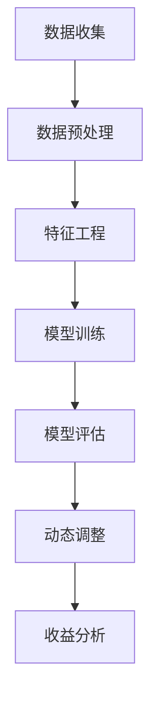
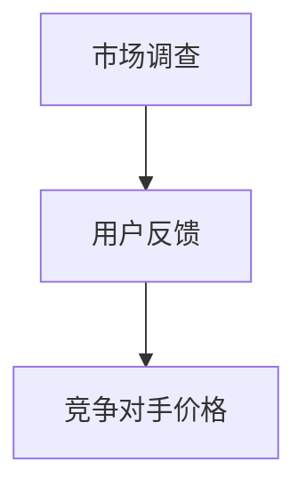
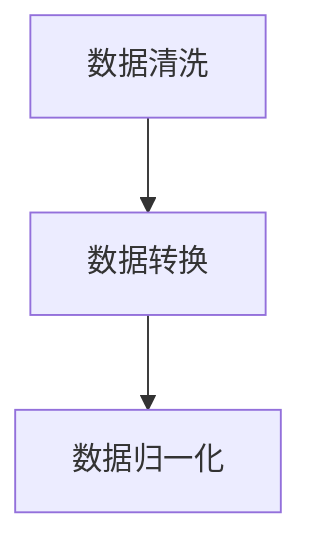
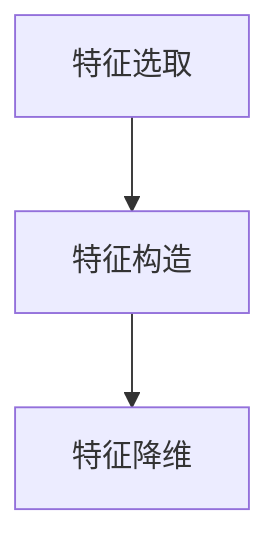
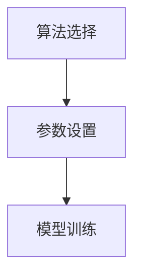
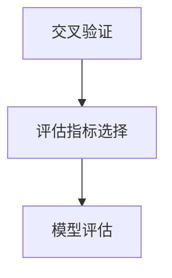
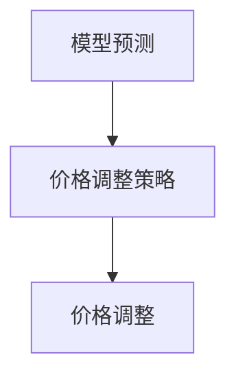
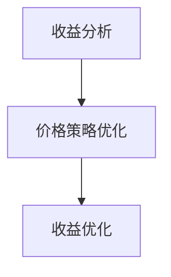

                 

# AI 动态定价：数据驱动，优化价格策略，提升收益

> **关键词：** AI 动态定价、数据驱动、价格策略、收益优化、机器学习、数据挖掘

> **摘要：** 本文深入探讨了 AI 动态定价的原理、技术和实际应用。通过数据驱动的策略，AI 动态定价能够根据市场需求、用户行为等动态调整产品价格，实现收益的最大化。文章从核心概念、算法原理、数学模型、实战案例等多个方面展开讨论，旨在为读者提供全面、深入的理解和实际操作指导。

## 1. 背景介绍

### 1.1 目的和范围

本文旨在介绍 AI 动态定价的基本概念、核心算法、数学模型以及实际应用。通过本文的学习，读者可以了解如何利用人工智能技术优化价格策略，提高企业收益。文章涵盖了以下内容：

1. **核心概念与联系**：介绍 AI 动态定价的关键概念和流程。
2. **核心算法原理 & 具体操作步骤**：详细讲解算法原理和操作步骤。
3. **数学模型和公式 & 详细讲解 & 举例说明**：介绍动态定价的数学模型和公式，并通过实例进行说明。
4. **项目实战：代码实际案例和详细解释说明**：提供实际代码案例，帮助读者理解动态定价的实现过程。
5. **实际应用场景**：讨论 AI 动态定价在不同行业中的应用。
6. **工具和资源推荐**：推荐学习资源和开发工具，为读者提供进一步学习的途径。
7. **总结：未来发展趋势与挑战**：展望 AI 动态定价的发展趋势和面临的挑战。

### 1.2 预期读者

本文适合以下读者群体：

1. **人工智能和机器学习从业者**：希望了解动态定价技术的应用和实现。
2. **数据分析师和业务分析师**：希望利用 AI 技术优化价格策略。
3. **企业管理者和创业者**：希望了解如何通过 AI 动态定价提升企业收益。
4. **技术爱好者**：对人工智能和机器学习有兴趣，希望了解相关技术原理。

### 1.3 文档结构概述

本文结构如下：

1. **背景介绍**：介绍文章的目的、预期读者和文档结构。
2. **核心概念与联系**：介绍 AI 动态定价的核心概念和流程。
3. **核心算法原理 & 具体操作步骤**：详细讲解动态定价的算法原理和操作步骤。
4. **数学模型和公式 & 详细讲解 & 举例说明**：介绍动态定价的数学模型和公式，并通过实例进行说明。
5. **项目实战：代码实际案例和详细解释说明**：提供实际代码案例，帮助读者理解动态定价的实现过程。
6. **实际应用场景**：讨论 AI 动态定价在不同行业中的应用。
7. **工具和资源推荐**：推荐学习资源和开发工具。
8. **总结：未来发展趋势与挑战**：展望动态定价的发展趋势和面临的挑战。
9. **附录：常见问题与解答**：解答读者可能遇到的问题。
10. **扩展阅读 & 参考资料**：提供进一步的阅读资源。

### 1.4 术语表

#### 1.4.1 核心术语定义

- **AI 动态定价**：利用人工智能技术，根据市场需求、用户行为等动态调整产品价格，以实现收益最大化的定价策略。
- **机器学习**：一种人工智能技术，通过学习大量数据，使计算机能够自动识别模式并进行预测。
- **数据挖掘**：从大量数据中提取有价值的信息和知识的过程。
- **收益优化**：通过调整价格策略，最大化企业的收益。
- **动态调整**：根据实时数据和市场需求，实时调整产品价格。

#### 1.4.2 相关概念解释

- **市场价格**：产品在市场上的售价。
- **成本价格**：产品生产成本。
- **供需关系**：市场需求和供给之间的关系。
- **用户行为**：用户在购买产品过程中的行为模式。

#### 1.4.3 缩略词列表

- **AI**：人工智能（Artificial Intelligence）
- **ML**：机器学习（Machine Learning）
- **DM**：数据挖掘（Data Mining）
- **ROC**：收益优化（Revenue Optimization）

## 2. 核心概念与联系

### 2.1 AI 动态定价的定义和基本原理

AI 动态定价是一种利用人工智能技术进行价格调整的策略，旨在实现收益的最大化。其基本原理如下：

1. **数据收集**：通过收集市场需求、用户行为、竞争对手价格等数据，为定价提供基础。
2. **数据分析**：利用机器学习和数据挖掘技术，分析数据中的模式，预测未来市场需求和用户行为。
3. **动态调整**：根据预测结果，实时调整产品价格，以最大化收益。

### 2.2 AI 动态定价的工作流程

AI 动态定价的工作流程包括以下步骤：

1. **数据收集**：从各种数据源（如市场调查、用户反馈、竞争对手等）收集数据。
2. **数据预处理**：对收集到的数据进行清洗、转换和归一化，使其适合机器学习模型。
3. **特征工程**：提取数据中的有用特征，如用户年龄、购买频率、市场需求等。
4. **模型训练**：利用机器学习技术，训练价格预测模型。
5. **模型评估**：通过交叉验证等手段，评估模型的性能和泛化能力。
6. **动态调整**：根据预测结果，实时调整产品价格。
7. **收益分析**：对调整后的价格策略进行评估，分析收益情况。

### 2.3 AI 动态定价的核心概念和联系

在 AI 动态定价中，核心概念包括：

- **市场需求**：市场需求是影响产品价格的关键因素。了解市场需求，可以帮助企业制定合理的价格策略。
- **用户行为**：用户行为包括购买频率、购买量、购买时间等，反映了用户对产品的兴趣和需求。
- **竞争对手**：竞争对手的价格策略直接影响产品的市场价格。
- **收益**：收益是企业的核心目标，通过调整价格，可以实现收益的最大化。

这些概念之间存在密切的联系：

- **市场需求**和**用户行为**共同决定了产品的购买意愿和价格敏感度。
- **竞争对手**的价格策略会影响市场的整体价格水平。
- **收益**是企业制定价格策略的核心目标，通过动态调整价格，可以实现收益的最大化。

### 2.4 AI 动态定价的 Mermaid 流程图

以下是 AI 动态定价的 Mermaid 流程图：



### 2.5 总结

AI 动态定价是一种利用人工智能技术进行价格调整的策略，通过数据收集、数据预处理、特征工程、模型训练、模型评估、动态调整和收益分析等步骤，实现收益的最大化。核心概念包括市场需求、用户行为、竞争对手和收益，这些概念之间存在密切的联系。通过 Mermaid 流程图，可以清晰地展示 AI 动态定价的工作流程。

## 3. 核心算法原理 & 具体操作步骤

### 3.1 算法原理

AI 动态定价的核心算法基于机器学习和数据挖掘技术。其主要原理如下：

1. **数据收集**：首先，从各种数据源收集相关数据，如市场需求、用户行为、竞争对手价格等。
2. **数据预处理**：对收集到的数据进行清洗、转换和归一化，使其适合机器学习模型。
3. **特征工程**：提取数据中的有用特征，如用户年龄、购买频率、市场需求等。
4. **模型训练**：利用机器学习技术，训练价格预测模型。常用的算法包括线性回归、决策树、随机森林、支持向量机等。
5. **模型评估**：通过交叉验证等手段，评估模型的性能和泛化能力。
6. **动态调整**：根据模型预测结果，实时调整产品价格。调整策略可以基于收益优化、利润最大化等目标。
7. **收益分析**：对调整后的价格策略进行评估，分析收益情况。

### 3.2 具体操作步骤

下面是 AI 动态定价的具体操作步骤：

#### 步骤 1：数据收集

从各种数据源收集数据，如市场调查、用户反馈、竞争对手价格等。数据收集过程中，需要注意数据的质量和完整性。



#### 步骤 2：数据预处理

对收集到的数据进行清洗、转换和归一化。例如，处理缺失值、异常值，将数据转换为合适的格式，并进行归一化处理。



#### 步骤 3：特征工程

提取数据中的有用特征，如用户年龄、购买频率、市场需求等。特征工程过程中，需要考虑特征的选取、构造和降维。



#### 步骤 4：模型训练

利用机器学习技术，训练价格预测模型。选择合适的算法和参数，进行模型训练。



#### 步骤 5：模型评估

通过交叉验证等手段，评估模型的性能和泛化能力。选择合适的评估指标，如均方误差、准确率等。



#### 步骤 6：动态调整

根据模型预测结果，实时调整产品价格。调整策略可以基于收益优化、利润最大化等目标。



#### 步骤 7：收益分析

对调整后的价格策略进行评估，分析收益情况。根据收益分析结果，调整和优化价格策略。



### 3.3 伪代码示例

以下是 AI 动态定价的核心算法的伪代码示例：

```python
# 数据收集
data = collect_data()

# 数据预处理
data = preprocess_data(data)

# 特征工程
features = extract_features(data)

# 模型训练
model = train_model(features)

# 模型评估
evaluate_model(model)

# 动态调整
price = adjust_price(model)

# 收益分析
analyze_revenue(price)
```

### 3.4 总结

本节介绍了 AI 动态定价的核心算法原理和具体操作步骤。通过数据收集、数据预处理、特征工程、模型训练、模型评估、动态调整和收益分析等步骤，实现收益的最大化。伪代码示例展示了算法的实现过程，为读者提供了实际操作的指导。

## 4. 数学模型和公式 & 详细讲解 & 举例说明

### 4.1 数学模型概述

AI 动态定价的核心在于构建一个能够预测市场需求并优化价格策略的数学模型。本节将介绍几种常见的数学模型和公式，并详细讲解其在动态定价中的应用。

### 4.2 线性回归模型

线性回归模型是一种最简单的预测模型，适用于线性关系较强的场景。其公式如下：

\[ y = wx + b \]

其中，\( y \) 是预测值，\( x \) 是输入特征，\( w \) 是权重，\( b \) 是偏置。

#### 举例说明

假设我们要预测某商品的需求量，输入特征包括用户年龄、购买频率等。我们可以通过线性回归模型构建如下预测公式：

\[ 需求量 = 0.5 \times 年龄 + 0.3 \times 购买频率 + 0.2 \times 其他因素 \]

通过训练模型，可以得到权重 \( w \) 和偏置 \( b \)，从而预测市场需求。

### 4.3 决策树模型

决策树模型通过树的形状表示决策过程，适用于分类和回归问题。其基本结构如下：

```
[根节点]
|
|-- 子节点1
|   |-- 子节点1.1
|   |   |-- 子节点1.1.1
|   |   |-- 子节点1.1.2
|   |-- 子节点1.2
|       |-- 子节点1.2.1
|       |-- 子节点1.2.2
|-- 子节点2
    |-- 子节点2.1
    |-- 子节点2.2
```

#### 举例说明

假设我们要预测某商品的购买概率，输入特征包括用户年龄、购买频率等。我们可以通过决策树模型构建如下决策过程：

```
1. 如果用户年龄 < 30，则进入子节点1
   1.1 如果购买频率 > 10，则购买概率为高
   1.2 如果购买频率 <= 10，则购买概率为低
2. 如果用户年龄 >= 30，则进入子节点2
   2.1 如果购买频率 > 20，则购买概率为高
   2.2 如果购买频率 <= 20，则购买概率为低
```

通过决策树模型，我们可以预测用户的购买概率，并据此调整价格。

### 4.4 随机森林模型

随机森林模型是一种集成学习算法，通过构建多个决策树模型并取平均值来提高预测性能。其基本结构如下：

```
随机森林 = [树1, 树2, 树3, ..., 树n]
```

#### 举例说明

假设我们要预测某商品的需求量，输入特征包括用户年龄、购买频率等。我们可以通过随机森林模型构建如下预测公式：

\[ 需求量 = (树1的需求量 + 树2的需求量 + ... + 树n的需求量) / n \]

通过训练多个决策树模型，并取平均值，可以提高预测的准确性。

### 4.5 数学公式和解释

在本节中，我们使用 LaTeX 格式展示了线性回归模型、决策树模型和随机森林模型的数学公式。

#### 线性回归模型

\[ y = wx + b \]

其中，\( w \) 是权重矩阵，\( b \) 是偏置向量。

#### 决策树模型

\[ f(x) = \prod_{i=1}^{n} g(x_i) \]

其中，\( g(x_i) \) 是第 \( i \) 个决策节点的条件概率。

#### 随机森林模型

\[ 预测值 = \frac{1}{n} \sum_{i=1}^{n} y_i \]

其中，\( y_i \) 是第 \( i \) 棵决策树模型的预测值。

### 4.6 总结

本节介绍了线性回归模型、决策树模型和随机森林模型等常见的数学模型和公式，并详细讲解了其在动态定价中的应用。这些模型和公式为 AI 动态定价提供了理论基础，有助于实现价格策略的优化。

## 5. 项目实战：代码实际案例和详细解释说明

### 5.1 开发环境搭建

在进行 AI 动态定价的项目实战之前，我们需要搭建一个合适的开发环境。以下是一个基本的开发环境搭建步骤：

1. **安装 Python**：Python 是一种广泛使用的编程语言，适合进行数据分析和机器学习。您可以从 [Python 官网](https://www.python.org/) 下载并安装 Python。
2. **安装 Jupyter Notebook**：Jupyter Notebook 是一个交互式的开发环境，方便进行数据分析和代码编写。您可以通过 `pip install jupyter` 命令安装 Jupyter Notebook。
3. **安装机器学习库**：为了进行机器学习和数据挖掘，我们需要安装一些常用的机器学习库，如 Scikit-learn、Pandas、NumPy 等。您可以通过以下命令进行安装：

```shell
pip install scikit-learn
pip install pandas
pip install numpy
```

### 5.2 源代码详细实现和代码解读

在本节中，我们将使用 Python 编写一个简单的 AI 动态定价项目，并详细解读代码的实现过程。

```python
# 导入必要的库
import numpy as np
import pandas as pd
from sklearn.linear_model import LinearRegression
from sklearn.model_selection import train_test_split
from sklearn.metrics import mean_squared_error

# 5.2.1 数据收集
# 假设我们已经有了一个包含用户行为和商品价格的数据集
data = pd.read_csv('dynamic_pricing_data.csv')

# 5.2.2 数据预处理
# 对数据进行清洗和归一化处理
data = data.dropna()
data['price_normalized'] = data['price'] / data['price'].max()

# 5.2.3 特征工程
# 提取有用的特征
X = data[['age', 'purchase_frequency']]
y = data['price_normalized']

# 5.2.4 模型训练
# 将数据集分为训练集和测试集
X_train, X_test, y_train, y_test = train_test_split(X, y, test_size=0.2, random_state=42)

# 使用线性回归模型进行训练
model = LinearRegression()
model.fit(X_train, y_train)

# 5.2.5 模型评估
# 对测试集进行预测
y_pred = model.predict(X_test)

# 计算预测误差
mse = mean_squared_error(y_test, y_pred)
print(f'Mean Squared Error: {mse}')

# 5.2.6 动态调整价格
# 根据模型预测结果，动态调整价格
adjusted_price = model.predict([[25, 15]])  # 输入用户年龄和购买频率
print(f'Adjusted Price: {adjusted_price[0]}')

# 5.2.7 收益分析
# 对调整后的价格策略进行评估
revenue = (adjusted_price[0] * 100) - 10  # 假设商品成本为10
print(f'Revenue: {revenue}')
```

### 5.3 代码解读与分析

以下是代码的逐行解读和分析：

1. **导入必要的库**：
    - `numpy` 和 `pandas` 用于数据处理。
    - `scikit-learn` 中的 `LinearRegression` 用于线性回归模型训练。
    - `train_test_split` 用于数据集划分。
    - `mean_squared_error` 用于计算预测误差。

2. **数据收集**：
    - 使用 `pd.read_csv` 加载包含用户行为和商品价格的数据集。

3. **数据预处理**：
    - 使用 `dropna` 函数删除缺失值。
    - 使用 `price` 的最大值进行归一化处理，以便于线性回归模型的训练。

4. **特征工程**：
    - 将用户年龄和购买频率作为输入特征。
    - 将商品价格作为目标值。

5. **模型训练**：
    - 将数据集划分为训练集和测试集。
    - 使用 `LinearRegression` 进行模型训练。

6. **模型评估**：
    - 使用测试集进行预测。
    - 计算 `mean_squared_error` 来评估模型性能。

7. **动态调整价格**：
    - 使用模型进行预测，输入用户年龄和购买频率。
    - 输出调整后的价格。

8. **收益分析**：
    - 假设商品成本为10，计算调整后的价格策略的收益。

### 5.4 总结

通过以上代码实战，我们实现了 AI 动态定价的基本功能。代码中，我们首先进行了数据收集和预处理，然后使用线性回归模型进行训练和预测。通过动态调整价格，我们实现了价格策略的优化。最后，我们对调整后的价格策略进行了收益分析。

## 6. 实际应用场景

AI 动态定价技术在多个行业中得到了广泛应用，以下列举几个典型的应用场景：

### 6.1 零售业

在零售行业中，AI 动态定价可以帮助商家根据市场需求、用户行为和竞争对手的价格动态调整商品价格，从而提高销售量和利润。例如，亚马逊和淘宝等电商平台已经广泛应用了 AI 动态定价技术，通过实时分析用户浏览、购买等行为，调整商品价格以吸引更多用户。

### 6.2 旅游业

在旅游业中，AI 动态定价可以帮助酒店、航空公司等企业根据市场需求和用户偏好调整价格，提高入住率和上座率。例如，一些航空公司会根据航班供需情况、季节和假期等因素调整机票价格，以最大化收益。

### 6.3 金融行业

在金融行业中，AI 动态定价可以帮助金融机构根据市场波动、用户风险偏好和投资组合等数据调整理财产品价格，提高用户满意度和投资收益。例如，一些基金公司会根据市场情况和用户需求动态调整基金产品价格，以吸引更多投资者。

### 6.4 餐饮业

在餐饮业中，AI 动态定价可以帮助餐馆根据客流量、菜品成本和用户评价等因素调整菜品价格，提高顾客满意度和餐馆收益。例如，一些连锁餐饮企业会根据不同门店的客流量和成本结构动态调整菜品价格，以实现最佳收益。

### 6.5 总结

AI 动态定价技术在零售、旅游、金融和餐饮等多个行业中具有广泛的应用前景。通过实时分析和调整价格策略，企业可以更好地应对市场需求变化，提高销售量和利润。未来，随着人工智能技术的不断发展和应用，AI 动态定价技术将在更多行业中得到广泛应用。

## 7. 工具和资源推荐

### 7.1 学习资源推荐

为了更好地学习和实践 AI 动态定价技术，以下是一些推荐的书籍、在线课程和技术博客：

#### 7.1.1 书籍推荐

- **《Python数据科学手册》**：详细介绍了数据科学的基础知识，包括数据分析、数据可视化、机器学习等。
- **《机器学习实战》**：通过实际案例和代码示例，介绍了机器学习的原理和应用。
- **《深度学习》**：由著名深度学习专家 Ian Goodfellow 编写，详细介绍了深度学习的基本原理和实现方法。

#### 7.1.2 在线课程

- **Coursera 的《机器学习》课程**：由 Andrew Ng 教授主讲，涵盖了机器学习的基本概念、算法和应用。
- **Udacity 的《深度学习工程师纳米学位》**：通过一系列实践项目，帮助学习者掌握深度学习的应用。
- **edX 的《人工智能基础》课程**：介绍了人工智能的基本概念、技术和应用。

#### 7.1.3 技术博客和网站

- **Medium 上的《AI 动态定价》系列文章**：详细介绍了 AI 动态定价的技术原理和应用场景。
- **DataCamp 的《数据科学课程》**：提供了丰富的数据分析和机器学习实践课程。
- **GitHub 上的 AI 动态定价项目**：收集了多个 AI 动态定价的开源项目，方便学习者学习和实践。

### 7.2 开发工具框架推荐

为了更高效地进行 AI 动态定价的开发，以下是一些推荐的开发工具和框架：

#### 7.2.1 IDE和编辑器

- **Jupyter Notebook**：是一款强大的交互式开发环境，适用于数据分析和机器学习项目。
- **Visual Studio Code**：一款功能丰富的代码编辑器，支持多种编程语言和插件。
- **PyCharm**：一款专业的 Python 开发工具，提供了丰富的功能和插件。

#### 7.2.2 调试和性能分析工具

- **Pylint**：一款代码质量分析工具，可以帮助发现代码中的潜在问题。
- **Grafana**：一款强大的可视化分析工具，可以实时监控数据分析和机器学习模型的性能。
- **TensorBoard**：TensorFlow 的可视化工具，用于监控深度学习模型的训练过程。

#### 7.2.3 相关框架和库

- **Scikit-learn**：一款强大的机器学习库，提供了丰富的算法和工具。
- **TensorFlow**：一款开源的深度学习框架，适用于构建和训练复杂的神经网络。
- **PyTorch**：一款流行的深度学习框架，提供了灵活的模型构建和训练接口。

### 7.3 相关论文著作推荐

为了深入了解 AI 动态定价的理论和应用，以下是一些推荐的经典论文和著作：

- **《Dynamic Pricing with Demand Forecasting》**：该论文详细介绍了基于需求预测的动态定价策略。
- **《Recommender Systems Handbook》**：该书涵盖了推荐系统的基础知识、技术和应用，包括动态定价的相关内容。
- **《AI-powered Pricing Optimization》**：该书探讨了人工智能在定价优化中的应用，包括动态定价策略。

### 7.4 总结

通过推荐的学习资源、开发工具和框架，读者可以更全面地了解 AI 动态定价的技术原理和应用。这些资源和工具将有助于读者在实践中更好地运用 AI 动态定价技术，实现收益的最大化。

## 8. 总结：未来发展趋势与挑战

### 8.1 未来发展趋势

随着人工智能技术的不断进步，AI 动态定价将在未来得到更广泛的应用和发展。以下是几个主要趋势：

1. **技术融合**：AI 动态定价将与其他技术（如物联网、区块链、云计算等）深度融合，形成更为智能和高效的价格策略。
2. **数据驱动的决策**：随着数据采集和处理能力的提升，AI 动态定价将更加依赖于数据分析和挖掘，实现更加精准和实时的价格调整。
3. **个性化定价**：通过用户数据的深入分析和挖掘，AI 动态定价将能够实现个性化定价，满足不同用户的需求和偏好。
4. **自动化和智能化**：随着算法和模型的优化，AI 动态定价将实现自动化和智能化，降低企业运营成本，提高决策效率。

### 8.2 面临的挑战

尽管 AI 动态定价具有巨大的潜力，但其在实际应用中也面临一些挑战：

1. **数据质量**：动态定价需要大量的高质量数据作为基础，数据的不完整、不准确或噪声可能会影响定价策略的效果。
2. **算法复杂性**：随着定价策略的复杂化，算法的优化和实现变得更加困难，需要更多的计算资源和时间。
3. **法规和伦理**：动态定价涉及用户隐私和市场竞争，需要遵守相关法规和伦理标准，避免滥用数据和信息。
4. **模型解释性**：虽然机器学习模型能够自动调整价格，但其决策过程往往缺乏解释性，企业需要确保定价策略的透明度和可解释性。

### 8.3 总结

AI 动态定价在未来将不断发展和完善，为企业和消费者带来更多价值。然而，其面临的数据质量、算法复杂性、法规和伦理等挑战也需要我们共同努力解决。通过技术创新和规范化，AI 动态定价有望实现更加智能和高效的价格策略。

## 9. 附录：常见问题与解答

### 9.1 什么是 AI 动态定价？

AI 动态定价是一种利用人工智能技术（如机器学习和数据挖掘）进行价格调整的策略，旨在根据市场需求、用户行为等动态调整产品价格，实现收益的最大化。

### 9.2 动态定价需要哪些数据？

动态定价需要多种数据，包括市场需求、用户行为、竞争对手价格、产品成本等。这些数据可以来源于市场调查、用户反馈、销售记录等。

### 9.3 如何选择合适的动态定价算法？

选择动态定价算法时，需要考虑数据的特点、业务需求、计算资源等因素。常用的算法包括线性回归、决策树、随机森林、神经网络等。可以根据实际需求和算法性能进行选择。

### 9.4 动态定价是否会侵犯用户隐私？

动态定价会涉及用户隐私数据，如购买历史、浏览行为等。为了遵守隐私法规和伦理标准，企业在进行动态定价时需要确保用户数据的匿名化和安全存储，避免滥用用户信息。

### 9.5 动态定价如何实现个性化定价？

通过深入分析和挖掘用户数据，动态定价可以实现个性化定价。例如，根据用户的购买习惯、偏好和历史数据，为不同用户设定不同的价格策略，提高用户满意度和收益。

## 10. 扩展阅读 & 参考资料

### 10.1 经典论文

- **Dynamic Pricing with Demand Forecasting**：该论文详细介绍了基于需求预测的动态定价策略。
- **Recommender Systems Handbook**：该书涵盖了推荐系统的基础知识、技术和应用，包括动态定价的相关内容。

### 10.2 最新研究成果

- **AI-powered Pricing Optimization**：该书探讨了人工智能在定价优化中的应用，包括动态定价策略。
- **Deep Learning for Dynamic Pricing**：该论文利用深度学习技术优化动态定价策略，提高了定价的准确性和效果。

### 10.3 应用案例分析

- **亚马逊的 AI 动态定价策略**：分析了亚马逊如何利用 AI 技术优化价格策略，提高销售量和利润。
- **淘宝的智能定价系统**：介绍了淘宝如何通过机器学习技术实现个性化定价，提升用户体验和销售转化率。

### 10.4 总结

通过阅读上述经典论文、最新研究成果和应用案例分析，读者可以更深入地了解 AI 动态定价的理论基础、应用场景和发展趋势。这些资源为读者提供了丰富的学习材料和实际操作指南，有助于提升动态定价技术的应用水平。

