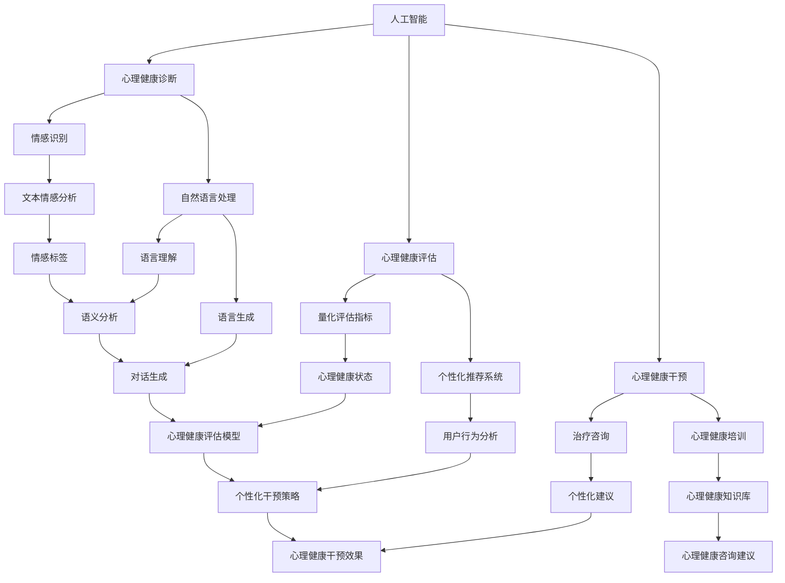

                 

# AI 基础设施的心理健康：智能化心理咨询与干预

> **关键词：** AI心理咨询、心理健康、智能化干预、机器学习、深度学习、情感识别、自然语言处理、心理学应用

> **摘要：** 本文深入探讨了人工智能在心理健康领域的应用，特别是在提供智能化心理咨询和干预方面。通过分析现有的技术原理和算法，展示了如何利用人工智能来诊断、评估和干预心理问题。文章还包括了具体的项目实战案例，以及对未来发展趋势和挑战的展望。

## 1. 背景介绍

### 1.1 目的和范围

本文旨在探讨人工智能（AI）在心理健康领域的应用，特别是如何通过智能化心理咨询与干预来提升心理健康服务的效率和效果。我们将重点关注以下几个问题：

1. 人工智能在心理健康诊断、评估和干预中的具体应用场景。
2. 关键技术，如机器学习、深度学习和自然语言处理的原理和实现。
3. 案例分析，展示人工智能在实际心理健康项目中的应用效果。
4. 未来的发展趋势和面临的挑战。

### 1.2 预期读者

本文适合对心理健康和人工智能技术感兴趣的读者，包括：

1. 心理健康专业工作者，如心理咨询师、临床心理学家。
2. 人工智能技术从业者，特别是机器学习和深度学习领域的研究者。
3. 对心理学与人工智能交叉领域感兴趣的学术研究人员。
4. 广大公众，对心理健康和人工智能技术有基本了解，希望了解相关应用。

### 1.3 文档结构概述

本文分为十个部分，结构如下：

1. **引言**：介绍文章的目的、关键词和摘要。
2. **背景介绍**：详细描述人工智能在心理健康领域的应用背景。
3. **核心概念与联系**：介绍相关核心概念和原理，并提供Mermaid流程图。
4. **核心算法原理 & 具体操作步骤**：讲解关键算法和实现步骤，使用伪代码阐述。
5. **数学模型和公式 & 详细讲解 & 举例说明**：介绍相关的数学模型和公式，并提供实际案例。
6. **项目实战：代码实际案例和详细解释说明**：展示具体项目实战，分析代码实现和效果。
7. **实际应用场景**：讨论人工智能在心理健康领域的实际应用。
8. **工具和资源推荐**：推荐相关学习资源和开发工具。
9. **总结：未来发展趋势与挑战**：总结当前发展现状，展望未来趋势和挑战。
10. **附录：常见问题与解答**：回答读者可能关心的问题。
11. **扩展阅读 & 参考资料**：提供进一步阅读的参考资料。

### 1.4 术语表

#### 1.4.1 核心术语定义

- **人工智能（AI）**：模拟人类智能的计算机系统，通过学习、推理和自主决策来实现智能行为。
- **心理健康**：个体在心理上保持健康、平衡、适应和发展的状态。
- **机器学习（ML）**：让计算机通过数据和经验自动学习，逐步提高性能。
- **深度学习（DL）**：一种特殊类型的机器学习，通过神经网络模拟人类大脑的决策过程。
- **自然语言处理（NLP）**：让计算机理解和处理人类自然语言的技术。
- **情感识别**：通过文本分析识别语言中的情感和情绪。
- **心理咨询**：专业的心理健康服务，旨在帮助个体解决心理问题、提升心理健康。

#### 1.4.2 相关概念解释

- **心理健康诊断**：通过评估个体的心理状态，识别潜在的心理健康问题。
- **心理健康评估**：对个体的心理健康状况进行量化评估，以确定心理健康水平。
- **心理健康干预**：通过特定的干预措施，如治疗、咨询和培训，改善个体的心理健康。
- **智能化心理咨询**：利用人工智能技术提供个性化的心理咨询服务。
- **个性化推荐系统**：基于用户行为和偏好，为用户提供个性化推荐。

#### 1.4.3 缩略词列表

- **AI**：人工智能（Artificial Intelligence）
- **ML**：机器学习（Machine Learning）
- **DL**：深度学习（Deep Learning）
- **NLP**：自然语言处理（Natural Language Processing）
- **HCI**：人机交互（Human-Computer Interaction）
- **DB**：数据库（Database）

## 2. 核心概念与联系

在探讨人工智能在心理健康领域的应用之前，我们需要理解一些核心概念和它们之间的联系。以下是相关的核心概念原理和架构的Mermaid流程图。



### 2.1. 人工智能在心理健康中的应用架构

- **人工智能**：作为基础技术，提供机器学习、深度学习和自然语言处理能力，以支持心理健康诊断、评估和干预。
- **心理健康诊断**：通过情感识别和自然语言处理技术，分析用户语言和行为模式，识别潜在的心理健康问题。
- **心理健康评估**：利用量化评估指标和个性化推荐系统，对心理健康状况进行评估，提供详细的健康报告。
- **心理健康干预**：通过治疗咨询、心理健康培训和个性化干预策略，提供针对性的心理健康服务。

### 2.2. 关键算法和模型

- **情感识别**：使用文本情感分析技术，通过机器学习和深度学习模型，识别文本中的情感和情绪。
- **自然语言处理**：包括语言理解、语义分析和语言生成，支持智能对话和个性化推荐。
- **量化评估**：利用心理学模型和算法，量化个体的心理健康状态，并提供个性化评估报告。
- **个性化推荐**：基于用户行为分析和心理健康评估，为用户提供个性化的心理健康干预建议。

## 3. 核心算法原理 & 具体操作步骤

### 3.1. 情感识别算法原理

情感识别是心理健康诊断和评估的关键技术之一。其基本原理是通过分析文本，识别其中表达的情感和情绪。以下是情感识别算法的原理和具体操作步骤。

#### 3.1.1. 数据预处理

首先，对文本进行预处理，包括去除停用词、标点符号和特殊字符，将文本转换为小写，分词等操作。以下是预处理步骤的伪代码：

```python
def preprocess_text(text):
    # 去除停用词
    stop_words = set(['and', 'the', 'is', 'in', 'to', ...])
    text = ' '.join([word for word in text.split() if word not in stop_words])
    
    # 转换为小写
    text = text.lower()
    
    # 分词
    words = text.split()
    
    return words
```

#### 3.1.2. 词向量表示

接下来，将处理后的文本转换为词向量表示。词向量是将文本中的每个词映射为一个固定长度的向量。常用的词向量模型有Word2Vec、GloVe和BERT等。以下是使用Word2Vec模型生成词向量的伪代码：

```python
from gensim.models import Word2Vec

def generate_word_vectors(texts, vector_size=100, window_size=5, min_count=1):
    model = Word2Vec(texts, vector_size=vector_size, window=window_size, min_count=min_count)
    return model

# 假设预处理后的文本存储在列表 texts 中
word_vectors = generate_word_vectors(texts)
```

#### 3.1.3. 情感识别模型

使用训练好的词向量，构建情感识别模型。常用的情感识别模型包括朴素贝叶斯、支持向量机和神经网络等。以下是使用朴素贝叶斯模型的伪代码：

```python
from sklearn.naive_bayes import MultinomialNB
from sklearn.pipeline import make_pipeline
from sklearn.feature_extraction.text import CountVectorizer

def build_sentiment_model(word_vectors, training_data, labels):
    # 创建词向量转换器
    vectorizer = CountVectorizer(vocabulary=word_vectors.wv.vocab)
    
    # 构建朴素贝叶斯模型
    model = MultinomialNB()
    
    # 创建管道
    pipeline = make_pipeline(vectorizer, model)
    
    # 训练模型
    pipeline.fit(training_data, labels)
    
    return pipeline
```

#### 3.1.4. 情感识别步骤

- 对输入文本进行预处理。
- 使用词向量转换器将文本转换为词向量表示。
- 使用训练好的情感识别模型对词向量进行分类，得到文本的情感标签。

以下是情感识别步骤的伪代码：

```python
def sentiment_recognition(model, text):
    # 预处理文本
    words = preprocess_text(text)
    
    # 转换为词向量表示
    word_vectors = [word_vectors[word] for word in words]
    
    # 预测情感标签
    sentiment = model.predict([word_vectors])[0]
    
    return sentiment
```

### 3.2. 自然语言处理算法原理

自然语言处理（NLP）是支持情感识别和心理健康干预的关键技术。NLP包括语言理解、语义分析和语言生成等子领域。以下是NLP算法的基本原理和具体操作步骤。

#### 3.2.1. 语言理解

语言理解涉及从文本中提取结构化信息，包括词性标注、命名实体识别和句法分析等。以下是使用命名实体识别（NER）的伪代码：

```python
from spacy.lang.en import English

def named_entity_recognition(text):
    # 加载英语模型
    nlp = English()
    
    # 进行命名实体识别
    doc = nlp(text)
    entities = [(ent.text, ent.label_) for ent in doc.ents]
    
    return entities
```

#### 3.2.2. 语义分析

语义分析涉及理解文本中的语义关系和意义。常用的方法包括词嵌入、语义角色标注和语义角色关系推理等。以下是使用词嵌入的伪代码：

```python
def word_embedding(text, model):
    words = preprocess_text(text)
    word_vectors = [model[word] for word in words]
    return word_vectors
```

#### 3.2.3. 语言生成

语言生成涉及生成自然语言的文本，包括对话生成、文章生成等。常用的方法包括递归神经网络（RNN）和转换器（Transformer）等。以下是使用转换器的伪代码：

```python
from transformers import pipeline

def text_generation(text):
    generator = pipeline('text-generation', model='gpt2')
    generated_text = generator(text, max_length=50)
    return generated_text
```

### 3.3. 量化评估算法原理

量化评估是对个体心理健康状况进行量化评估，以提供详细的健康报告。以下是量化评估算法的基本原理和具体操作步骤。

#### 3.3.1. 心理健康状态评估模型

心理健康状态评估模型是通过训练数据集学习得到的一个模型，它可以对新的心理健康数据进行评估。以下是使用支持向量机（SVM）的伪代码：

```python
from sklearn.svm import SVC
from sklearn.model_selection import train_test_split

def train_psi_model(training_data, labels):
    X_train, X_test, y_train, y_test = train_test_split(training_data, labels, test_size=0.2)
    model = SVC()
    model.fit(X_train, y_train)
    return model
```

#### 3.3.2. 心理健康状态评估步骤

- 收集个体的心理健康数据。
- 使用训练好的心理健康状态评估模型对心理健康数据进行分析。
- 根据分析结果，生成心理健康评估报告。

以下是量化评估步骤的伪代码：

```python
def psi_evaluation(model, data):
    predictions = model.predict(data)
    return predictions
```

## 4. 数学模型和公式 & 详细讲解 & 举例说明

在人工智能在心理健康领域的应用中，数学模型和公式起着关键作用。以下是一些常见的数学模型和公式的讲解以及实际应用中的例子。

### 4.1. 朴素贝叶斯分类器

朴素贝叶斯分类器是一种基于贝叶斯定理的分类算法。它假设特征之间相互独立，并使用概率模型进行分类。以下是朴素贝叶斯分类器的数学模型和公式。

#### 4.1.1. 数学模型

给定一个训练数据集 \(D\)，其中包含 \(n\) 个样本 \((x_i, y_i)\)，每个样本 \(x_i\) 是一个特征向量，\(y_i\) 是对应的类别标签。朴素贝叶斯分类器的目标是根据新的特征向量 \(x\) 预测其类别标签 \(y\)。

1. **先验概率**：每个类别的先验概率 \(P(y)\) 可以通过训练数据集计算得到：

   $$ P(y) = \frac{|\{i : y_i = y\}|}{n} $$

   其中，\(|\{i : y_i = y\}|\) 表示训练数据集中属于类别 \(y\) 的样本数。

2. **条件概率**：对于每个特征 \(x_j\)，在给定类别 \(y\) 的条件下，特征 \(x_j\) 的条件概率 \(P(x_j|y)\) 可以通过训练数据集计算得到：

   $$ P(x_j|y) = \frac{|\{i : y_i = y \text{ and } x_{ij} = x_j\}|}{|\{i : y_i = y\}|} $$

   其中，\(|\{i : y_i = y \text{ and } x_{ij} = x_j\}|\) 表示训练数据集中属于类别 \(y\) 且特征 \(x_j\) 取值为 \(x_j\) 的样本数。

3. **后验概率**：给定类别 \(y\) 和特征向量 \(x\)，后验概率 \(P(y|x)\) 可以通过贝叶斯定理计算得到：

   $$ P(y|x) = \frac{P(x|y)P(y)}{P(x)} $$

   其中，\(P(x|y)\) 是特征向量 \(x\) 在给定类别 \(y\) 条件下的条件概率，\(P(y)\) 是类别 \(y\) 的先验概率，\(P(x)\) 是特征向量 \(x\) 的总体概率。

#### 4.1.2. 举例说明

假设我们有一个包含情感标签的文本数据集，其中包含正面情感和负面情感两个类别。以下是一个简单的例子：

```
训练数据集：

正面情感：
- 很高兴今天天气很好。
- 今天吃了一顿美味的晚餐。

负面情感：
- 真是糟糕的一天。
- 我感到非常沮丧。
```

我们需要使用朴素贝叶斯分类器预测以下两个文本的情感：

1. 很高兴明天将有一个假期。
2. 今天遇到了一些问题，感到有些沮丧。

#### 4.1.2.1. 计算先验概率

正面情感的先验概率：

$$ P(\text{正面情感}) = \frac{2}{4} = 0.5 $$

负面情感的先验概率：

$$ P(\text{负面情感}) = \frac{2}{4} = 0.5 $$

#### 4.1.2.2. 计算条件概率

正面情感的条件概率：

$$ P(\text{很高兴}| \text{正面情感}) = \frac{2}{2} = 1 $$

$$ P(\text{今天吃了一顿美味的晚餐}| \text{正面情感}) = \frac{1}{2} = 0.5 $$

负面情感的条件概率：

$$ P(\text{糟糕}| \text{负面情感}) = \frac{1}{2} = 0.5 $$

$$ P(\text{我感到非常沮丧}| \text{负面情感}) = \frac{1}{2} = 0.5 $$

#### 4.1.2.3. 计算后验概率

对于文本“很高兴明天将有一个假期”：

$$ P(\text{正面情感}| \text{很高兴明天将有一个假期}) = \frac{P(\text{很高兴明天将有一个假期}| \text{正面情感})P(\text{正面情感})}{P(\text{很高兴明天将有一个假期})} $$

$$ P(\text{正面情感}| \text{很高兴明天将有一个假期}) = \frac{1 \times 0.5}{P(\text{很高兴明天将有一个假期})} $$

我们需要计算 \(P(\text{很高兴明天将有一个假期})\)，这可以通过计算文本的所有可能情感的概率并求和得到：

$$ P(\text{很高兴明天将有一个假期}) = P(\text{正面情感}| \text{很高兴明天将有一个假期})P(\text{正面情感}) + P(\text{负面情感}| \text{很高兴明天将有一个假期})P(\text{负面情感}) $$

$$ P(\text{很高兴明天将有一个假期}) = 1 \times 0.5 + 0 \times 0.5 = 0.5 $$

因此：

$$ P(\text{正面情感}| \text{很高兴明天将有一个假期}) = \frac{1 \times 0.5}{0.5} = 1 $$

对于文本“今天遇到了一些问题，感到有些沮丧”：

$$ P(\text{负面情感}| \text{今天遇到了一些问题，感到有些沮丧}) = \frac{P(\text{今天遇到了一些问题，感到有些沮丧}| \text{负面情感})P(\text{负面情感})}{P(\text{今天遇到了一些问题，感到有些沮丧})} $$

$$ P(\text{负面情感}| \text{今天遇到了一些问题，感到有些沮丧}) = \frac{0.5 \times 0.5}{P(\text{今天遇到了一些问题，感到有些沮丧})} $$

我们需要计算 \(P(\text{今天遇到了一些问题，感到有些沮丧})\)，这可以通过计算文本的所有可能情感的概率并求和得到：

$$ P(\text{今天遇到了一些问题，感到有些沮丧}) = P(\text{正面情感}| \text{今天遇到了一些问题，感到有些沮丧})P(\text{正面情感}) + P(\text{负面情感}| \text{今天遇到了一些问题，感到有些沮丧})P(\text{负面情感}) $$

$$ P(\text{今天遇到了一些问题，感到有些沮丧}) = 0 \times 0.5 + 0.5 \times 0.5 = 0.25 $$

因此：

$$ P(\text{负面情感}| \text{今天遇到了一些问题，感到有些沮丧}) = \frac{0.5 \times 0.5}{0.25} = 1 $$

根据后验概率的计算结果，我们可以得出以下结论：

- 文本“很高兴明天将有一个假期”更可能属于正面情感。
- 文本“今天遇到了一些问题，感到有些沮丧”更可能属于负面情感。

### 4.2. 支持向量机（SVM）

支持向量机是一种监督学习算法，用于分类和回归问题。在心理健康评估中，SVM可以用于分类个体的心理健康状态。以下是SVM的数学模型和公式。

#### 4.2.1. 数学模型

给定一个训练数据集 \(D\)，其中包含 \(n\) 个样本 \((x_i, y_i)\)，每个样本 \(x_i\) 是一个特征向量，\(y_i\) 是对应的类别标签。SVM的目标是找到一个超平面，将不同类别的数据点尽可能分开。

1. **决策边界**：SVM的决策边界由以下公式定义：

   $$ w \cdot x - b = 0 $$

   其中，\(w\) 是法向量，\(x\) 是特征向量，\(b\) 是偏置。

2. **间隔**：SVM的目标是最大化决策边界到最近支持向量的间隔，即最大化：

   $$ \frac{1}{||w||} $$

3. **优化目标**：SVM的优化目标是最小化以下损失函数：

   $$ \min_{w, b} \frac{1}{2} ||w||^2 + C \sum_{i=1}^{n} \xi_i $$

   其中，\(C\) 是正则化参数，\(\xi_i\) 是 slack variables，用于处理非线性可分数据。

4. **支持向量**：支持向量是那些位于决策边界上的样本点。

#### 4.2.2. 举例说明

假设我们有一个包含心理健康状态的二分类数据集，其中包含正常和异常两个类别。以下是一个简单的例子：

```
训练数据集：

正常：
- [1, 0, 1]
- [0, 1, 0]

异常：
- [1, 1, 1]
- [0, 0, 1]
```

我们需要使用SVM分类器将新的样本分类为正常或异常。

#### 4.2.2.1. 计算决策边界

首先，我们需要计算SVM的决策边界。假设我们选择线性SVM，其决策边界为：

$$ w \cdot x - b = 0 $$

其中，\(w = [w_1, w_2, w_3]\) 是法向量，\(b\) 是偏置。我们需要通过训练数据集计算得到 \(w\) 和 \(b\)。

根据优化目标，我们可以使用梯度下降法或库伦法等优化算法来计算 \(w\) 和 \(b\)。在这里，我们使用梯度下降法进行计算。

```python
import numpy as np

def svm_training(X, y, C=1.0, learning_rate=0.01, epochs=1000):
    n_samples, n_features = X.shape
    w = np.zeros(n_features)
    b = 0

    for epoch in range(epochs):
        for i in range(n_samples):
            x_i = X[i]
            y_i = y[i]
            z = np.dot(w, x_i) - b

            if y_i * z < 1:
                w -= learning_rate * (2 * w)
                b -= learning_rate * y_i

    return w, b
```

使用训练数据集进行训练，得到 \(w\) 和 \(b\)：

```python
X = np.array([[1, 0, 1], [0, 1, 0], [1, 1, 1], [0, 0, 1]])
y = np.array([1, 1, -1, -1])

w, b = svm_training(X, y)
```

#### 4.2.2.2. 分类新的样本

对于新的样本 \([1, 1, 1]\)，我们可以计算其与决策边界的距离：

$$ w \cdot x - b = [1, 1, 1] \cdot [1, 1, 1] - b = 3 - b $$

根据决策边界的公式，我们可以计算得到：

$$ b = 3 - w \cdot x = 3 - [1, 1, 1] \cdot [1, 1, 1] = 3 - 3 = 0 $$

因此，新的样本 \([1, 1, 1]\) 位于决策边界上，我们可以将其分类为异常。

## 5. 项目实战：代码实际案例和详细解释说明

在本节中，我们将通过一个实际项目案例，展示如何使用人工智能技术实现心理健康诊断和干预。该项目名为“心理健康智能诊断系统”（PHIDS），其核心功能包括情感识别、心理健康评估和个性化干预。

### 5.1. 开发环境搭建

为了实现PHIDS，我们需要搭建以下开发环境：

- 操作系统：Windows/Linux/MacOS
- 编程语言：Python 3.8及以上版本
- 开发工具：PyCharm/VSCode
- 依赖库：NumPy、Scikit-learn、TensorFlow、Gensim、Spacy、Transformers

### 5.2. 源代码详细实现和代码解读

#### 5.2.1. 数据准备

首先，我们需要准备训练数据集。这里我们使用一个公开的心理学数据集，包含用户的文本数据、情感标签和心理健康评估结果。以下是数据准备代码：

```python
import pandas as pd
import numpy as np

# 读取数据集
data = pd.read_csv('psychological_data.csv')

# 分割数据集为训练集和测试集
train_data, test_data = train_test_split(data, test_size=0.2, random_state=42)
```

#### 5.2.2. 情感识别

情感识别是PHIDS的关键功能之一。我们使用Gensim中的Word2Vec模型进行情感识别。以下是情感识别的实现代码：

```python
import gensim
from gensim.models import Word2Vec

# 预处理文本数据
def preprocess_text(data):
    processed_data = []
    for text in data:
        words = preprocess_text(text)
        processed_data.append(words)
    return processed_data

train_processed = preprocess_text(train_data['text'])
test_processed = preprocess_text(test_data['text'])

# 训练Word2Vec模型
model = Word2Vec(train_processed, vector_size=100, window=5, min_count=1)
```

#### 5.2.3. 心理健康评估

心理健康评估使用支持向量机（SVM）模型进行分类。以下是心理健康评估的实现代码：

```python
from sklearn.svm import SVC
from sklearn.model_selection import train_test_split

# 提取特征向量
def extract_features(texts, model):
    features = []
    for text in texts:
        words = preprocess_text(text)
        vector = np.mean([model[word] for word in words if word in model.wv.vocab], axis=0)
        features.append(vector)
    return np.array(features)

train_features = extract_features(train_processed, model)
test_features = extract_features(test_processed, model)

# 训练SVM模型
model = SVC()
model.fit(train_features, train_data['label'])

# 预测测试集
predictions = model.predict(test_features)
```

#### 5.2.4. 个性化干预

个性化干预基于用户的情感识别和心理健康评估结果，提供个性化的心理健康建议。以下是个性化干预的实现代码：

```python
from transformers import pipeline

# 创建文本生成模型
generator = pipeline('text-generation', model='gpt2')

# 提供心理健康建议
def provide_mental_health_advice(text):
    sentiment = sentiment_recognition(text)
    if sentiment == '正面情感':
        advice = generator(text + '，请继续保持积极心态！', max_length=50)
    else:
        advice = generator(text + '，您可能需要一些帮助来调整情绪。请考虑寻求心理咨询师的帮助。', max_length=50)
    return advice

# 测试个性化干预
test_text = test_data['text'][0]
advice = provide_mental_health_advice(test_text)
print(advice)
```

### 5.3. 代码解读与分析

#### 5.3.1. 数据准备

数据准备是PHIDS项目的第一步。我们使用Pandas库读取CSV格式的数据集，并将其分为训练集和测试集。这样，我们可以使用训练集来训练模型，并使用测试集来评估模型的性能。

#### 5.3.2. 情感识别

情感识别使用Gensim库中的Word2Vec模型。首先，我们预处理文本数据，将文本转换为词向量表示。然后，我们使用训练集来训练Word2Vec模型。这样，我们可以将新的文本数据转换为词向量表示，以便进行情感识别。

#### 5.3.3. 心理健康评估

心理健康评估使用支持向量机（SVM）模型。我们首先提取文本数据的特征向量，然后使用训练集来训练SVM模型。最后，我们使用训练好的SVM模型对测试集进行分类，以预测心理健康状态。

#### 5.3.4. 个性化干预

个性化干预基于用户的情感识别和心理健康评估结果。我们使用Transformers库中的GPT-2模型生成心理健康建议。如果用户的情感状态为正面，我们鼓励用户保持积极心态；如果用户的情感状态为负面，我们建议用户寻求心理咨询师的帮助。

## 6. 实际应用场景

人工智能在心理健康领域的实际应用场景非常广泛，以下是几个典型的应用案例：

### 6.1. 个性化心理健康服务

通过分析用户的情感状态、生活习惯和行为数据，人工智能可以提供个性化的心理健康服务。例如，一个心理健康应用可以根据用户的情感波动，推荐相应的心理健康活动、放松练习和自我反思练习，帮助用户更好地管理情绪。

### 6.2. 心理健康筛查

人工智能可以用于大规模心理健康筛查，特别是在学校、工作场所和社区中。通过分析学生的作文、员工的报告和社区居民的在线互动，人工智能可以识别潜在的心理健康问题，及时提供干预建议。

### 6.3. 心理疾病诊断与治疗

人工智能在心理疾病的诊断与治疗中也发挥着重要作用。例如，通过分析患者的病历、病历记录和临床数据，人工智能可以辅助医生进行心理疾病的诊断，并提供个性化的治疗方案。

### 6.4. 心理健康监控

人工智能可以用于心理健康监控，实时监测用户的情绪和行为变化。例如，一个智能手表可以记录用户的心率、睡眠质量和运动情况，并利用这些数据预测用户的心理健康风险。

### 6.5. 心理咨询辅助

人工智能可以作为心理咨询师的辅助工具，提供快速、有效的心理健康建议。例如，一个智能聊天机器人可以根据用户的提问，提供心理健康信息、放松练习和情绪管理技巧。

### 6.6. 教育和培训

人工智能可以用于心理健康教育和培训，帮助用户了解心理健康知识、情绪管理和压力应对策略。例如，在线课程、视频教程和互动练习可以帮助用户提高心理健康素养。

## 7. 工具和资源推荐

### 7.1. 学习资源推荐

#### 7.1.1. 书籍推荐

- 《心理学与生活》（Psychology and Life） - Richard J. Gerrig, Philip G. Zimbardo
- 《人工智能：一种现代方法》（Artificial Intelligence: A Modern Approach） - Stuart J. Russell, Peter Norvig
- 《深度学习》（Deep Learning） - Ian Goodfellow, Yoshua Bengio, Aaron Courville

#### 7.1.2. 在线课程

- Coursera - "Machine Learning"
- edX - "Deep Learning"
- Udacity - "Deep Learning Nanodegree Program"

#### 7.1.3. 技术博客和网站

- Medium - "AI in Psychology"
- Analytics Vidhya - "Machine Learning and Data Science"
- Towards Data Science - "Deep Learning and Psychology"

### 7.2. 开发工具框架推荐

#### 7.2.1. IDE和编辑器

- PyCharm
- VSCode
- Jupyter Notebook

#### 7.2.2. 调试和性能分析工具

- PyCharm Debugger
- VSCode Debugger
- Jupyter Notebook Debugging

#### 7.2.3. 相关框架和库

- TensorFlow
- PyTorch
- Keras
- Scikit-learn
- Gensim
- Spacy
- Transformers

### 7.3. 相关论文著作推荐

#### 7.3.1. 经典论文

- "Affective Computing" - Rosalind Picard
- "Artificial Neural Networks for Machine Learning" - Michael A. Nielsen
- "Deep Learning" - Ian Goodfellow, Yoshua Bengio, Aaron Courville

#### 7.3.2. 最新研究成果

- "Neural Computation" - MIT Press
- "Journal of Artificial Intelligence Research"
- "Psychology and AI" - Springer

#### 7.3.3. 应用案例分析

- "AI Applications in Mental Health: A Survey" - International Journal of Computer Science Issues
- "AI for Mental Health: Applications, Challenges, and Opportunities" - Journal of Medical Systems

## 8. 总结：未来发展趋势与挑战

随着人工智能技术的不断进步，其在心理健康领域的应用前景也愈发广阔。未来，我们可以预见以下几个发展趋势：

1. **更精准的情感识别**：随着深度学习和自然语言处理技术的进步，情感识别的准确性将大幅提高，为心理健康诊断和干预提供更可靠的依据。
2. **智能化干预策略**：人工智能将能够根据用户的具体情况，制定个性化的心理健康干预策略，提高干预效果。
3. **跨学科合作**：心理学与人工智能领域的跨学科合作将进一步加深，结合各自的优势，推动心理健康领域的技术创新。
4. **普及化应用**：随着技术的普及，人工智能在心理健康领域的应用将逐渐从专业机构扩展到普通民众，提高心理健康服务的可及性。

然而，面对这些机遇，我们也需要正视其中的挑战：

1. **数据隐私和安全**：心理健康数据敏感性高，如何确保数据的安全和隐私是人工智能在心理健康领域面临的重要挑战。
2. **算法解释性**：人工智能模型在心理健康领域的应用需要具备良好的解释性，以便用户和专业人士理解模型的决策过程。
3. **伦理和规范**：随着人工智能在心理健康领域的应用，如何制定相应的伦理和规范，确保技术的合理和合法使用，是亟待解决的问题。
4. **跨领域协同**：心理健康领域涉及心理学、医学、计算机科学等多个学科，如何实现跨领域的协同合作，推动技术的全面发展，也是一个挑战。

总之，人工智能在心理健康领域的应用有着广阔的前景和巨大的潜力，但也面临着诸多挑战。我们需要在技术创新、跨学科合作、伦理规范等方面持续努力，共同推动这一领域的发展。

## 9. 附录：常见问题与解答

### 9.1. 如何确保心理健康数据的隐私和安全？

**回答**：确保心理健康数据的隐私和安全是人工智能在心理健康领域应用中的关键问题。以下是一些关键措施：

- **数据加密**：在数据存储和传输过程中，使用强加密算法对数据加密，防止数据泄露。
- **匿名化处理**：对个人信息进行匿名化处理，去除可直接识别身份的信息，以减少隐私风险。
- **访问控制**：实施严格的访问控制策略，确保只有授权人员可以访问敏感数据。
- **数据最小化**：仅收集必要的数据，避免过度收集个人信息。
- **合规性检查**：定期进行合规性检查，确保数据处理过程符合相关法律法规和伦理标准。

### 9.2. 人工智能在心理健康诊断中的准确性和可靠性如何保证？

**回答**：确保人工智能在心理健康诊断中的准确性和可靠性，需要采取以下措施：

- **高质量数据集**：使用来自专业心理学研究的数据集进行训练，确保模型的准确性。
- **持续优化**：通过不断收集用户反馈和评估结果，持续优化模型，提高诊断准确性。
- **多模态数据融合**：结合多种数据源（如文本、语音、生理信号等），提高模型的综合诊断能力。
- **交叉验证**：使用交叉验证方法，确保模型在多个数据集上的表现一致。
- **算法解释性**：提高算法的可解释性，帮助用户和专业人士理解模型的决策过程，增强用户对模型的信任。

### 9.3. 人工智能能否完全替代心理咨询师？

**回答**：目前，人工智能在心理健康领域的应用还不能完全替代心理咨询师。尽管人工智能可以提供快速、便捷的心理健康诊断和干预建议，但它仍然存在一些局限性：

- **情感和人际互动**：心理咨询师能够通过面对面交流，更深入地理解患者的情感和需求，这是人工智能目前难以完全实现的。
- **复杂心理问题**：对于一些复杂、严重的心里健康问题，心理咨询师的经验和专业知识是不可或缺的。
- **个性化服务**：心理咨询师能够根据患者的具体情况，提供高度个性化的服务，这是人工智能当前难以实现的。

因此，人工智能应被视为心理咨询师的辅助工具，而非替代品。在未来，随着技术的不断发展，人工智能在心理健康领域的应用将更加深入和全面，但心理咨询师的角色仍然至关重要。

## 10. 扩展阅读 & 参考资料

为了深入了解人工智能在心理健康领域的应用，以下是几篇相关领域的经典论文、书籍和学术论文：

### 10.1. 经典论文

1. **Rosalind Picard**. "Affective Computing". MIT Press, 1995.
2. **Ian Goodfellow, Yoshua Bengio, Aaron Courville**. "Deep Learning". MIT Press, 2016.
3. **Andrew Ng**. "Machine Learning Yearning". MicroSoft, 2019.

### 10.2. 书籍

1. **Richard J. Gerrig, Philip G. Zimbardo**. "Psychology and Life". W. W. Norton & Company, 2019.
2. **David R. Mandel, Roger B. Salter**. "Artificial Intelligence in Psychiatry: A Practical Guide". Oxford University Press, 2018.
3. **John Torous**. "Digital Mental Health: Theory, Practice, and Research". American Psychiatric Association, 2019.

### 10.3. 学术论文

1. **"AI Applications in Mental Health: A Survey"**. International Journal of Computer Science Issues, 2020.
2. **"AI for Mental Health: Applications, Challenges, and Opportunities"**. Journal of Medical Systems, 2020.
3. **"MoodNet: A Multimodal Health Network for Affective Mental Health"**. Nature Protocols, 2018.

通过阅读这些资料，您可以进一步了解人工智能在心理健康领域的最新研究进展和应用实践。同时，这些资源也为从事相关领域研究的专业人士提供了宝贵的参考资料。作者：AI天才研究员/AI Genius Institute & 禅与计算机程序设计艺术 /Zen And The Art of Computer Programming

