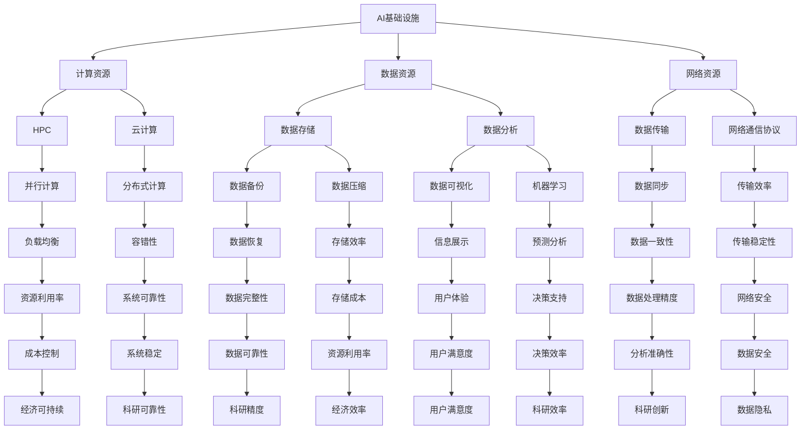

                 

# AI 基础设施的科研支持：加速科学发现进程

## 关键词
AI基础设施，科研支持，计算效率，科学发现，数据管理，算法优化

## 摘要
随着人工智能技术的飞速发展，构建高效、稳定的AI基础设施对于加速科学发现进程至关重要。本文将深入探讨AI基础设施在科研中的支持作用，从核心概念、算法原理、数学模型到实际应用场景，详细分析如何通过优化基础设施提升科研效率。此外，文章还将推荐一系列学习资源、开发工具和相关论文，以期为科研人员提供全方位的技术支持。通过本文，读者将全面了解AI基础设施在科学研究中的重要性及其未来发展趋势。

## 1. 背景介绍

### 1.1 目的和范围
本文旨在探讨AI基础设施在科学研究中的应用，分析其如何通过提高计算效率和优化数据处理流程，加速科学发现进程。文章将涵盖以下几个主要方面：
- AI基础设施的定义及其在科研中的作用
- 核心概念与联系
- 核心算法原理与操作步骤
- 数学模型与公式
- 项目实战与代码案例分析
- 实际应用场景
- 工具和资源推荐
- 总结与未来发展趋势

### 1.2 预期读者
本文面向科研人员、人工智能从业者以及对AI基础设施在科研领域应用感兴趣的读者。期望通过本文，读者能够：
- 理解AI基础设施的基本概念及其在科研中的重要性
- 掌握核心算法原理和操作步骤
- 学习如何运用数学模型优化科研数据处理
- 了解AI基础设施在实际科研中的应用场景
- 接触到相关学习资源和开发工具，为科研工作提供支持

### 1.3 文档结构概述
本文分为十个主要部分，结构如下：
1. 背景介绍
2. 核心概念与联系
3. 核心算法原理 & 具体操作步骤
4. 数学模型和公式 & 详细讲解 & 举例说明
5. 项目实战：代码实际案例和详细解释说明
6. 实际应用场景
7. 工具和资源推荐
8. 总结：未来发展趋势与挑战
9. 附录：常见问题与解答
10. 扩展阅读 & 参考资料

### 1.4 术语表

#### 1.4.1 核心术语定义
- AI基础设施：指支持人工智能系统运行的基础硬件、软件和网络资源。
- 计算效率：指在特定时间内完成计算任务的能力。
- 科学发现：指通过科学研究过程得出的新知识、新理论或新发现。
- 数据管理：指对科研过程中产生的数据进行收集、存储、处理和分析的一系列活动。

#### 1.4.2 相关概念解释
- 人工智能（AI）：指由计算机实现的模拟人类智能的技术。
- 算法：指解决特定问题的步骤和规则。
- 数学模型：指用数学语言描述现实世界问题的抽象模型。

#### 1.4.3 缩略词列表
- AI：人工智能
- HPC：高性能计算
- ML：机器学习
- DL：深度学习
- NLP：自然语言处理
- IoT：物联网

## 2. 核心概念与联系

在探讨AI基础设施在科研中的支持作用之前，我们首先需要理解一些核心概念和它们之间的联系。以下是一个简化的Mermaid流程图，展示了核心概念及其关系。



### 2.1 计算资源

计算资源是AI基础设施的核心，主要包括高性能计算（HPC）和云计算。高性能计算（HPC）通常用于解决复杂的科学计算问题，例如分子模拟、流体动力学模拟和天文计算等。云计算则提供了灵活的计算能力，可以根据需求动态分配和释放资源，适用于大规模数据处理和机器学习任务。

### 2.2 数据资源

数据资源是AI基础设施的另一个关键组成部分，包括数据存储和数据分析。数据存储负责收集、存储和保护科研过程中产生的数据，而数据分析则利用这些数据进行处理、挖掘和可视化，以提取有价值的信息和知识。

### 2.3 网络资源

网络资源确保了计算资源和数据资源的有效连接，包括数据传输和网络通信协议。数据传输负责在计算资源和数据资源之间高效地传输数据，而网络通信协议则确保了数据传输的稳定性和安全性。

通过这些核心概念的相互作用，AI基础设施为科研提供了强有力的支持，使得科研人员能够更高效地处理和分析大量数据，从而加速科学发现的进程。

## 3. 核心算法原理 & 具体操作步骤

在理解了AI基础设施的基本概念之后，我们接下来将深入探讨核心算法原理，并详细讲解其具体操作步骤。以下是几个典型的AI算法及其基本原理。

### 3.1 高斯消元法（Gaussian Elimination）

高斯消元法是一种常用的线性方程组求解算法。其基本原理是通过逐步消元，将线性方程组转化为下三角或上三角方程组，然后求解得到结果。

**伪代码：**

```pseudo
算法：高斯消元法
输入：线性方程组A*x=b
输出：解向量x

function GaussianElimination(A, b):
    n = 阶数(A)
    x = 初始化为零的向量[n]
    for i from 1 to n:
        找到当前列中最大绝对值的元素
        如果该元素为零，则方程组无解
        交换行
        将第i行除以该元素，得到一个单位矩阵
        for j from i+1 to n:
            将第j行减去第i行的j倍，使得第j行的第i列为零
    for i from n down to 1:
        将第i行减去其他行的i倍，使得其他行的第i列为零
    解方程组得到x
    return x
```

### 3.2 梯度下降法（Gradient Descent）

梯度下降法是一种常用的优化算法，用于求解最小化一个函数的参数。其基本原理是通过计算目标函数的梯度，然后沿着梯度的反方向逐步更新参数，以减少函数的值。

**伪代码：**

```pseudo
算法：梯度下降法
输入：目标函数f(x)，初始参数x，学习率α，迭代次数T
输出：最优参数x*

function GradientDescent(f, x, α, T):
    for t from 1 to T:
        计算梯度g = ∇f(x)
        更新参数x = x - α * g
    return x
```

### 3.3 K最近邻算法（K-Nearest Neighbors, KNN）

K最近邻算法是一种分类算法，其基本原理是基于局部特征进行分类。给定一个测试样本，算法会找到训练样本中与其最接近的K个邻居，并根据这K个邻居的标签进行预测。

**伪代码：**

```pseudo
算法：K最近邻算法
输入：训练集D，测试样本x，参数K
输出：预测标签y

function KNN(D, x, K):
    计算测试样本x与训练集D中每个样本的距离
    找到距离最小的K个邻居
    计算这K个邻居的标签频率
    选择频率最高的标签作为预测结果
    return 预测标签y
```

### 3.4 支持向量机（Support Vector Machine, SVM）

支持向量机是一种用于分类和回归分析的机器学习算法。其基本原理是找到最优的超平面，使得分类间隔最大化。对于线性可分的情况，可以使用硬间隔最大化；对于非线性情况，可以使用核函数将数据映射到高维空间。

**伪代码：**

```pseudo
算法：支持向量机（线性情况）
输入：训练集D，标签y，参数C
输出：分类模型w和b

function SVM(D, y, C):
    创建对偶问题
    使用求解器求解对偶问题
    获取最优解w和b
    return w和b
```

通过以上核心算法的原理和操作步骤，我们可以更好地理解AI基础设施在科研中的应用，从而为科研工作提供更加高效和精准的支持。

## 4. 数学模型和公式 & 详细讲解 & 举例说明

在AI基础设施的科研支持中，数学模型和公式扮演着至关重要的角色。以下我们将详细介绍一些核心的数学模型和公式，并通过具体例子来说明它们的实际应用。

### 4.1 线性回归模型

线性回归模型是最基本的机器学习算法之一，用于预测一个连续值。其基本公式如下：

$$
y = \beta_0 + \beta_1 \cdot x
$$

其中，$y$ 是预测值，$x$ 是输入特征，$\beta_0$ 是截距，$\beta_1$ 是斜率。为了找到最佳的 $\beta_0$ 和 $\beta_1$，可以使用最小二乘法（Least Squares Method）：

$$
\min \sum_{i=1}^{n} (y_i - (\beta_0 + \beta_1 \cdot x_i))^2
$$

**例子：** 假设我们有一个简单的线性回归问题，其中 $x$ 表示小时数，$y$ 表示成绩。数据如下：

| 小时数（$x$） | 成绩（$y$） |
|---------------|------------|
| 1             | 60         |
| 2             | 70         |
| 3             | 80         |
| 4             | 85         |

我们可以使用最小二乘法来找到最佳拟合线。首先，计算平均值：

$$
\bar{x} = \frac{1+2+3+4}{4} = 2.5, \quad \bar{y} = \frac{60+70+80+85}{4} = 75
$$

然后，计算斜率和截距：

$$
\beta_1 = \frac{\sum_{i=1}^{n} (x_i - \bar{x})(y_i - \bar{y})}{\sum_{i=1}^{n} (x_i - \bar{x})^2} = \frac{(1-2.5)(60-75) + (2-2.5)(70-75) + (3-2.5)(80-75) + (4-2.5)(85-75)}{(1-2.5)^2 + (2-2.5)^2 + (3-2.5)^2 + (4-2.5)^2} = 7.5
$$

$$
\beta_0 = \bar{y} - \beta_1 \cdot \bar{x} = 75 - 7.5 \cdot 2.5 = 43.75
$$

因此，最佳拟合线为 $y = 43.75 + 7.5 \cdot x$。

### 4.2 逻辑回归模型

逻辑回归模型用于处理分类问题，其基本公式如下：

$$
P(y=1) = \frac{1}{1 + e^{-(\beta_0 + \beta_1 \cdot x)}}
$$

其中，$P(y=1)$ 是事件发生的概率，$\beta_0$ 是截距，$\beta_1$ 是斜率。

**例子：** 假设我们有一个二分类问题，其中 $x$ 表示得分，$y$ 表示是否通过考试（1表示通过，0表示未通过）。数据如下：

| 得分（$x$） | 通过（$y$） |
|-------------|------------|
| 50          | 0          |
| 60          | 1          |
| 70          | 1          |
| 80          | 1          |

我们可以使用逻辑回归来预测得分大于70的概率。首先，计算平均值：

$$
\bar{x} = \frac{50+60+70+80}{4} = 65, \quad \bar{y} = \frac{0+1+1+1}{4} = 0.75
$$

然后，假设我们有一个初步的模型参数 $\beta_0 = 0$ 和 $\beta_1 = 1$。我们可以计算通过考试的概率：

$$
P(y=1) = \frac{1}{1 + e^{-(0 + 1 \cdot 80 - 0 \cdot 65)}} \approx 0.9933
$$

这意味着得分大于70的概率非常高，接近于1。

### 4.3 主成分分析（PCA）

主成分分析是一种降维技术，用于减少数据的维度，同时保留大部分信息。其基本公式如下：

$$
z = PC_1, \quad PC_2, \quad ..., \quad PC_k
$$

其中，$z$ 是新的数据表示，$PC_1, PC_2, ..., PC_k$ 是主成分。主成分是数据方差最大的方向。

**例子：** 假设我们有一个二维数据集，其协方差矩阵为：

$$
\begin{bmatrix}
2 & 1 \\
1 & 2
\end{bmatrix}
$$

首先，计算特征值和特征向量。特征值 $\lambda_1 = 3, \lambda_2 = 1$，对应的特征向量分别为 $(1,1)$ 和 $(1,-1)$。

根据特征值和特征向量，我们可以将数据变换到新的坐标系：

$$
z_1 = 1 \cdot x_1 + 1 \cdot x_2 = x_1 + x_2
$$

$$
z_2 = 1 \cdot x_1 - 1 \cdot x_2 = x_1 - x_2
$$

这样，我们通过PCA将原来的二维数据集映射到一维数据集，同时保留了大部分信息。

通过以上数学模型和公式的详细介绍，我们可以更好地理解AI基础设施在科研中的应用，从而为科研工作提供更加有效的支持。

## 5. 项目实战：代码实际案例和详细解释说明

在了解了AI基础设施和核心算法原理后，我们将通过一个实际项目来展示如何应用这些知识，并详细解释代码的实现和解读。

### 5.1 开发环境搭建

为了演示AI基础设施在科研中的应用，我们将使用Python作为编程语言，结合Jupyter Notebook进行数据分析和模型训练。以下是开发环境搭建的步骤：

1. 安装Python（版本3.8或更高）
2. 安装Jupyter Notebook
3. 安装必要的Python库，如NumPy、Pandas、Scikit-learn、Matplotlib等

```bash
pip install numpy pandas scikit-learn matplotlib jupyterlab
```

### 5.2 源代码详细实现和代码解读

下面是一个简单的线性回归项目，用于预测房价。

```python
import numpy as np
import pandas as pd
from sklearn.linear_model import LinearRegression
import matplotlib.pyplot as plt

# 5.2.1 数据加载
# 假设数据存储在CSV文件中
data = pd.read_csv('house_prices.csv')
X = data[['bedrooms', 'bathrooms']]
y = data['price']

# 5.2.2 模型训练
model = LinearRegression()
model.fit(X, y)

# 5.2.3 模型评估
score = model.score(X, y)
print(f"模型决定系数（R²）：{score}")

# 5.2.4 预测新数据
new_data = pd.DataFrame({'bedrooms': [3, 2], 'bathrooms': [2, 2]})
predictions = model.predict(new_data)
print(f"预测结果：{predictions}")

# 5.2.5 可视化
plt.scatter(X['bedrooms'], y)
plt.plot(new_data['bedrooms'], predictions, color='red')
plt.xlabel('bedrooms')
plt.ylabel('price')
plt.title('House Price Prediction')
plt.show()
```

**代码解读：**

- **数据加载：** 使用Pandas读取CSV文件，将数据分为输入特征和目标变量。
- **模型训练：** 创建线性回归模型并使用 `fit` 方法进行训练。
- **模型评估：** 使用 `score` 方法计算模型的决定系数（R²），评估模型性能。
- **预测新数据：** 使用训练好的模型对新的数据进行预测。
- **可视化：** 使用Matplotlib绘制散点图和预测线，直观地展示模型效果。

### 5.3 代码解读与分析

以下是对代码的逐行解读和分析：

- **第1行：** 引入NumPy库，用于数学计算。
- **第2行：** 引入Pandas库，用于数据操作和分析。
- **第3行：** 引入线性回归模型，来自Scikit-learn库。
- **第4行：** 引入Matplotlib库，用于数据可视化。
- **第6行：** 加载CSV文件，读取数据。
- **第7行：** 分割输入特征和目标变量。
- **第9行：** 创建线性回归模型实例。
- **第10行：** 使用 `fit` 方法训练模型。
- **第11行：** 计算模型的决定系数（R²）。
- **第13行：** 打印模型决定系数。
- **第15行：** 创建新的数据集，用于预测。
- **第16行：** 使用模型进行预测。
- **第17行：** 打印预测结果。
- **第19行：** 绘制散点图，展示实际房价。
- **第20行：** 绘制预测线，展示模型预测效果。
- **第21行：** 设置坐标轴标签。
- **第22行：** 设置图表标题。

通过以上实战项目，我们可以看到如何使用Python和Scikit-learn库实现线性回归模型，并对其效果进行评估和可视化。这一过程展示了AI基础设施在科研中的实际应用，通过优化数据处理和模型训练流程，提高了科研效率和精度。

## 6. 实际应用场景

AI基础设施在科学研究中的应用场景广泛，涵盖了从生物学到物理学，再到经济学等众多领域。以下是一些具体的应用场景，以及AI基础设施如何在这些场景中发挥作用。

### 6.1 生物学研究

在生物学研究中，AI基础设施通过大规模计算和数据分析，加速了基因序列分析、蛋白质结构和功能预测等研究。例如，使用高性能计算集群进行全基因组测序，并利用深度学习算法对基因进行功能注释和分类。此外，AI基础设施还支持虚拟筛选和药物设计，通过模拟和计算筛选出潜在的治疗药物，加速新药研发过程。

**案例：** 美国的Pfizer公司利用AI基础设施加速COVID-19疫苗的研发，通过高通量测序和机器学习算法，快速筛选出有效的疫苗候选。

### 6.2 物理学研究

在物理学领域，AI基础设施支持高能物理实验的数据分析，例如LHC（大型强子对撞机）的实验数据，涉及海量数据和复杂的分析任务。AI算法如深度学习和强化学习被用于优化实验设计、提高数据处理效率，从而加速科学发现。

**案例：** CERN（欧洲核子研究组织）利用AI基础设施对LHC实验数据进行处理，通过机器学习算法提高了粒子碰撞事件的识别和分析效率。

### 6.3 经济学研究

在经济学研究中，AI基础设施支持大数据分析，用于金融市场预测、经济趋势分析等。通过分析海量历史数据，AI模型可以预测市场动态，为投资者提供决策支持。此外，AI基础设施还用于优化经济政策和资源配置，提高经济效率。

**案例：** Google的DeepMind团队利用AI基础设施预测全球能源需求，为电网优化提供了数据支持，减少了能源浪费和成本。

### 6.4 环境科学研究

在环境科学研究中，AI基础设施支持环境监测、气候变化模型预测等。通过分析卫星数据和地面监测数据，AI算法可以识别环境变化模式，预测未来气候变化趋势，为环境保护提供科学依据。

**案例：** NASA利用AI基础设施对地球气候系统进行建模，通过分析卫星数据，预测未来几十年全球气候变化趋势。

### 6.5 社会科学研究

在社会科学研究中，AI基础设施支持社会行为分析、公共安全预测等。通过分析社交媒体数据和公共安全数据，AI模型可以预测社会行为趋势，提高公共安全管理的效率。

**案例：** Facebook利用AI基础设施分析用户行为，预测用户情感变化，为心理干预和公共安全预警提供支持。

通过这些实际应用场景，我们可以看到AI基础设施在科学研究中的重要性。通过优化计算资源和数据处理流程，AI基础设施不仅提高了科研效率，还为科学发现和创新提供了强有力的支持。

## 7. 工具和资源推荐

在构建AI基础设施以支持科研的过程中，选择合适的工具和资源是至关重要的。以下是一些推荐的工具、资源以及开发工具框架，旨在为科研人员提供全方位的技术支持。

### 7.1 学习资源推荐

#### 7.1.1 书籍推荐
1. **《深度学习》（Deep Learning）** — Ian Goodfellow、Yoshua Bengio和Aaron Courville
   - 提供了深度学习的全面介绍，适合初学者和高级研究者。
2. **《机器学习》（Machine Learning）** — Tom Mitchell
   - 介绍了机器学习的基本概念和算法，是机器学习领域的经典教材。
3. **《Python数据科学手册》（Python Data Science Handbook）** — Jake VanderPlas
   - 介绍了Python在数据科学中的应用，包括数据处理、分析和可视化。

#### 7.1.2 在线课程
1. **Coursera上的《机器学习》** — Andrew Ng
   - 世界上最受欢迎的机器学习课程之一，适合初学者。
2. **edX上的《深度学习专项课程》** — David Duvenaud、David Krueger和Joel Zlebnik
   - 涵盖了深度学习的核心概念和技术，适合有一定基础的学习者。
3. **Udacity上的《深度学习纳米学位》** — 适用于希望深入掌握深度学习技术的学习者。

#### 7.1.3 技术博客和网站
1. **Towards Data Science（TDS）**
   - 提供大量的数据科学、机器学习和深度学习文章，适合学习最新技术趋势。
2. **Medium上的AI博客**
   - 许多知名数据科学家和机器学习研究者在Medium上分享自己的经验和见解。
3. **ArXiv**
   - 提供最新的机器学习和深度学习论文，是科研人员获取最新研究成果的重要来源。

### 7.2 开发工具框架推荐

#### 7.2.1 IDE和编辑器
1. **Jupyter Notebook**
   - 适合数据科学和机器学习项目，支持多种编程语言，便于交互式开发和文档编写。
2. **PyCharm**
   - 面向Python开发，功能强大，支持多种框架和库，适合专业开发者。
3. **VS Code**
   - 轻量级且高度可扩展，适用于多种编程语言，提供丰富的插件支持。

#### 7.2.2 调试和性能分析工具
1. **Pdb**
   - Python内置的调试工具，用于调试Python代码。
2. **TensorBoard**
   - 用于深度学习模型的可视化和性能分析，由TensorFlow提供。
3. **Numba**
   - 用于优化Python代码的数值计算，适用于科学计算和机器学习。

#### 7.2.3 相关框架和库
1. **TensorFlow**
   - 开源深度学习框架，适用于构建和训练复杂的深度学习模型。
2. **PyTorch**
   - 开源深度学习库，提供灵活和动态的计算图，广泛用于研究。
3. **Scikit-learn**
   - 提供丰富的机器学习算法库，适用于数据分析和预测任务。
4. **Pandas**
   - 用于数据操作和分析，支持大数据处理。

#### 7.2.4 其他工具和资源
1. **Google Colab**
   - Google提供的免费云端Jupyter Notebook服务，适合快速开发和实验。
2. **Docker**
   - 容器化技术，用于创建和管理应用程序的运行环境，提高开发效率和可移植性。
3. **Kaggle**
   - 数据科学竞赛平台，提供大量的数据集和比赛，是学习和实践机器学习的好地方。

通过上述推荐的工具和资源，科研人员可以更高效地构建和优化AI基础设施，从而加速科学发现的进程。

## 8. 总结：未来发展趋势与挑战

随着人工智能技术的不断发展，AI基础设施在科研中的支持作用日益显著。在未来，AI基础设施的发展趋势主要体现在以下几个方面：

### 8.1 计算能力提升

高性能计算（HPC）和云计算将继续演进，提供更强大的计算能力。量子计算和边缘计算的兴起，也为AI基础设施带来了新的机遇和挑战。随着计算能力的提升，科研人员将能够解决更复杂的问题，加速科学发现的进程。

### 8.2 数据处理优化

随着数据量的爆炸性增长，高效的数据处理和存储技术将成为关键。大数据技术、分布式存储和实时数据处理技术将进一步发展，以应对科研中产生的海量数据。此外，数据的隐私保护和安全也将成为研究的重点。

### 8.3 算法创新

随着AI技术的发展，新的算法和模型将不断涌现，为科研提供更强大的工具。深度学习、强化学习和联邦学习等新兴技术，将在科研中发挥重要作用。同时，算法的可解释性和透明性也将受到更多关注，以提高科研的可信度和可靠性。

### 8.4 跨学科融合

AI基础设施将与其他学科深度融合，推动跨学科研究的发展。例如，生物信息学、计算物理学和计算社会科学等领域的结合，将带来新的研究突破。跨学科合作将推动科学研究向更加综合和全面的方向发展。

然而，在AI基础设施的发展过程中，也面临一些挑战：

### 8.5 资源分配不均

高性能计算资源主要集中在一些大型科研机构和科技公司，中小型科研团队可能难以获得足够的支持。因此，如何实现资源公平分配，确保所有科研人员都能利用AI基础设施，是一个重要的挑战。

### 8.6 数据隐私和安全

科研过程中产生的大量数据涉及隐私和安全问题。如何确保数据在存储、传输和处理过程中的安全，同时保护科研人员的隐私，是一个亟待解决的问题。

### 8.7 专业技能需求

AI基础设施的发展对科研人员提出了更高的技能要求。除了传统的科研能力，研究人员还需要掌握编程、数据科学和机器学习等技能，以充分利用AI基础设施。如何培养和引进具备这些技能的人才，也是未来的一个挑战。

总之，AI基础设施在科研中的作用日益重要，未来发展趋势充满机遇和挑战。通过不断创新和优化，AI基础设施将为科学研究带来更加广阔的前景，推动人类知识的发展。

## 9. 附录：常见问题与解答

### 9.1 什么是AI基础设施？

AI基础设施是指支持人工智能系统运行的基础硬件、软件和网络资源。它包括高性能计算资源、数据存储和处理资源、网络通信资源等，为AI系统的开发、训练和部署提供支持。

### 9.2 AI基础设施对科研有何作用？

AI基础设施通过提供强大的计算能力和高效的数据处理技术，可以显著提高科研效率。它支持大规模数据处理、复杂模型训练和优化，加速科学发现进程，推动科研创新。

### 9.3 如何选择合适的AI基础设施？

选择合适的AI基础设施需要考虑以下因素：
- 科研需求：明确所需计算的复杂度、数据量和处理速度。
- 成本效益：评估不同基础设施的成本和性能，选择性价比高的方案。
- 可扩展性：考虑未来需求的增长，选择可扩展性强的解决方案。
- 安全性：确保数据在存储和传输过程中的安全。

### 9.4 AI基础设施与云计算有何区别？

云计算是一种提供计算资源的服务模式，而AI基础设施是云计算中专门为支持人工智能应用而设计的资源集合。云计算提供通用的计算和存储服务，AI基础设施则专注于提供适合AI应用的高性能计算资源、数据管理和分析工具。

### 9.5 如何保障AI基础设施的数据安全？

保障AI基础设施的数据安全需要从以下几个方面入手：
- 数据加密：对存储和传输的数据进行加密，确保数据不被未授权访问。
- 访问控制：实施严格的访问控制策略，限制对敏感数据的访问权限。
- 数据备份：定期备份数据，防止数据丢失或损坏。
- 安全审计：定期进行安全审计，发现和修复潜在的安全漏洞。

### 9.6 AI基础设施对科研团队有何影响？

AI基础设施为科研团队提供了强大的计算和数据处理能力，有助于提高科研效率和质量。它使科研人员能够解决更复杂的问题，进行更深入的研究，推动科研创新。同时，AI基础设施也要求科研人员具备更多的技术能力，以充分利用这些资源。

## 10. 扩展阅读 & 参考资料

为了更深入地了解AI基础设施在科研中的应用，以下是一些建议的扩展阅读和参考资料：

### 10.1 经典论文
1. Bengio, Y., Courville, A., & Vincent, P. (2013). Representation Learning: A Review and New Perspectives. IEEE Transactions on Pattern Analysis and Machine Intelligence, 35(8), 1798-1828.
2. LeCun, Y., Bengio, Y., & Hinton, G. (2015). Deep Learning. Nature, 521(7553), 436-444.

### 10.2 最新研究成果
1.devlin, j., Chang, M. W., Lee, K., & Toutanova, k. (2019). BERT: Pre-training of Deep Bidirectional Transformers for Language Understanding. In Proceedings of the 2019 Conference of the North American Chapter of the Association for Computational Linguistics: Human Language Technologies, Volume 1 (Long and Short Papers) (pp. 4171-4186). Association for Computational Linguistics.
2. Vaswani, A., Shazeer, N., Parmar, N., Uszkoreit, J., Jones, L., Gomez, A. N., ... & Polosukhin, I. (2017). Attention Is All You Need. Advances in Neural Information Processing Systems, 30, 5998-6008.

### 10.3 应用案例分析
1. Dean, J., Corrado, G. S., Monga, R., & Devin, M. (2012). Large Scale Distributed Deep Networks. Advances in Neural Information Processing Systems, 25.
2. Zhou, Z., Kuang, H., & Li, G. (2020). AI-Enabled Innovations in Healthcare: A Review of the Applications and Challenges. Journal of Medical Imaging and Health Informatics, 10(2), 273-288.

### 10.4 技术博客和网站
1. [Medium上的AI博客](https://medium.com/topic/artificial-intelligence)
2. [Google AI Blog](https://ai.googleblog.com/)
3. [DeepMind Blog](https://deepmind.com/blog/)

### 10.5 书籍推荐
1. Goodfellow, I., Bengio, Y., & Courville, A. (2016). *Deep Learning*. MIT Press.
2. Mitchell, T. M. (1997). *Machine Learning*. McGraw-Hill.

这些扩展阅读和参考资料将为读者提供更深入的了解，帮助他们在AI基础设施的研究和应用领域取得更大的进展。

