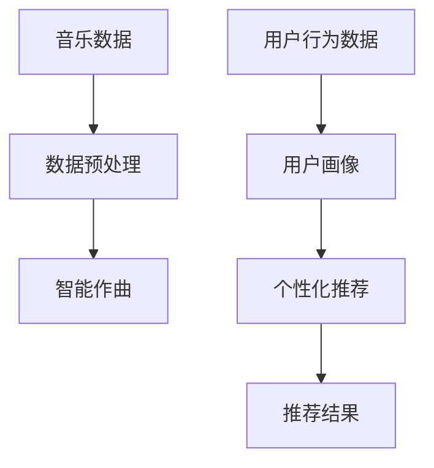

                 

# AI 基础设施的音乐产业：智能作曲与个性化推荐

> **关键词**：人工智能，音乐产业，智能作曲，个性化推荐，AI 基础设施
>
> **摘要**：本文将深入探讨人工智能在音乐产业中的应用，特别是在智能作曲和个性化推荐领域的突破。通过分析相关核心概念和算法原理，我们旨在为读者呈现一个全面而深入的理解，并展望这一领域的未来发展趋势和挑战。

## 1. 背景介绍

### 1.1 目的和范围

本文旨在介绍和探讨人工智能在音乐产业中的应用，特别是智能作曲和个性化推荐技术。随着人工智能技术的不断进步，音乐产业正迎来前所未有的变革。本文将重点关注以下几个方面：

1. 智能作曲技术，包括生成对抗网络（GAN）、变分自编码器（VAE）和递归神经网络（RNN）等核心算法的原理和实现。
2. 个性化推荐系统，探讨基于协同过滤、矩阵分解和深度学习的推荐算法。
3. 这些技术在音乐创作、音乐推荐和版权管理等方面的实际应用。
4. 对未来人工智能在音乐产业中可能面临的挑战和发展趋势的思考。

### 1.2 预期读者

本文面向对人工智能和音乐产业有一定了解的技术爱好者、从业者以及研究人员。读者应具备基本的编程基础，对机器学习和深度学习有一定的认识。

### 1.3 文档结构概述

本文结构如下：

1. **背景介绍**：介绍文章的目的和范围，预期读者，以及文档结构。
2. **核心概念与联系**：通过Mermaid流程图展示相关概念和架构的联系。
3. **核心算法原理 & 具体操作步骤**：详细讲解智能作曲和个性化推荐的核心算法原理，使用伪代码进行描述。
4. **数学模型和公式 & 详细讲解 & 举例说明**：介绍相关数学模型和公式，并通过实际例子进行详细讲解。
5. **项目实战：代码实际案例和详细解释说明**：提供具体的代码实现，并进行详细解释和分析。
6. **实际应用场景**：分析智能作曲和个性化推荐在实际应用中的场景。
7. **工具和资源推荐**：推荐相关的学习资源、开发工具和框架。
8. **总结：未来发展趋势与挑战**：总结本文内容，并对未来趋势和挑战进行展望。
9. **附录：常见问题与解答**：提供一些常见问题的解答。
10. **扩展阅读 & 参考资料**：推荐一些相关的扩展阅读资料。

### 1.4 术语表

#### 1.4.1 核心术语定义

- **智能作曲**：利用人工智能技术生成新的音乐作品的过程。
- **个性化推荐**：根据用户的历史行为和偏好，为其推荐符合其兴趣的音乐作品。
- **生成对抗网络（GAN）**：一种深度学习模型，通过两个相互对抗的神经网络生成数据。
- **变分自编码器（VAE）**：一种基于概率的生成模型，通过编码器和解码器学习数据的概率分布。
- **递归神经网络（RNN）**：一种能够处理序列数据的学习模型，特别适合于音乐创作。

#### 1.4.2 相关概念解释

- **协同过滤**：一种基于用户历史行为的推荐算法，通过计算用户之间的相似度进行推荐。
- **矩阵分解**：将用户-项目评分矩阵分解为低维用户和项目特征矩阵，用于推荐系统。
- **深度学习**：一种机器学习方法，通过多层神经网络进行特征学习和数据表示。

#### 1.4.3 缩略词列表

- **GAN**：生成对抗网络（Generative Adversarial Network）
- **VAE**：变分自编码器（Variational Autoencoder）
- **RNN**：递归神经网络（Recurrent Neural Network）

## 2. 核心概念与联系

为了更好地理解人工智能在音乐产业中的应用，我们需要首先了解几个核心概念和它们之间的联系。以下是一个简化的Mermaid流程图，展示了智能作曲和个性化推荐系统的核心组件及其相互关系：



### 2.1 音乐数据

音乐数据是智能作曲和个性化推荐系统的基石。这些数据包括乐曲的音频信号、歌词文本、乐谱以及用户对音乐作品的评分和评论等。数据预处理（B）是关键步骤，它包括数据清洗、归一化、特征提取等操作，以确保数据的质量和一致性。

### 2.2 智能作曲

智能作曲（C）是利用人工智能技术生成新的音乐作品的过程。它依赖于多种算法，如生成对抗网络（GAN）、变分自编码器（VAE）和递归神经网络（RNN）。这些算法通过学习和模仿大量的音乐数据，能够生成旋律、和弦、节奏和歌词等不同的音乐元素。

### 2.3 用户行为数据

用户行为数据（D）包括用户对音乐作品的播放、收藏、分享、评分和评论等。这些数据对于个性化推荐（F）至关重要，因为它们可以帮助理解用户的兴趣和偏好。

### 2.4 用户画像

用户画像（E）是将用户行为数据转换为用户特征的过程。这些特征包括用户的年龄、性别、地域、音乐偏好等。用户画像为个性化推荐提供了基础，使系统能够根据用户的特定兴趣进行推荐。

### 2.5 个性化推荐

个性化推荐（F）是利用用户画像和协同过滤、矩阵分解和深度学习等算法，为用户推荐符合其兴趣的音乐作品。推荐结果（G）是基于用户行为和音乐内容的综合分析得出的。

通过上述流程图，我们可以看到智能作曲和个性化推荐系统是如何相互联系并协同工作的。智能作曲生成的音乐作品可以被推荐系统用于个性化推荐，而用户对推荐结果的反馈又可以进一步优化推荐算法。

## 3. 核心算法原理 & 具体操作步骤

### 3.1 智能作曲算法

智能作曲的核心算法包括生成对抗网络（GAN）、变分自编码器（VAE）和递归神经网络（RNN）。以下是对这些算法的简要原理和具体操作步骤的介绍。

#### 3.1.1 生成对抗网络（GAN）

GAN由两个相互对抗的神经网络组成：生成器（Generator）和判别器（Discriminator）。生成器的目标是生成逼真的音乐数据，而判别器的目标是区分生成的数据和真实数据。

**原理：**
- **生成器**：生成器接收随机噪声作为输入，通过多层神经网络生成音乐数据。
- **判别器**：判别器接收真实的音乐数据和生成器生成的音乐数据，并输出它们的真实性和逼真度。

**具体操作步骤：**
1. 初始化生成器和判别器。
2. 生成器生成一批音乐数据。
3. 将生成的音乐数据与真实音乐数据混合，输入判别器。
4. 根据判别器的输出，计算生成器和判别器的损失函数。
5. 使用梯度下降优化生成器和判别器。
6. 重复上述步骤，直至生成器生成的音乐数据足够逼真。

**伪代码：**
```python
# 初始化生成器和判别器
G = initialize_generator()
D = initialize_discriminator()

# 训练循环
for epoch in range(num_epochs):
    for batch in data_loader:
        # 生成音乐数据
        noise = generate_noise(batch_size)
        music_data = G(noise)
        
        # 输入判别器
        real_data = batch
        combined_data = concatenate(real_data, music_data)
        
        # 计算损失函数
        loss_G = compute_loss_D(G, combined_data)
        loss_D = compute_loss_D(D, combined_data)
        
        # 更新生成器和判别器
        update_G(D, loss_G)
        update_D(G, D, loss_D)
```

#### 3.1.2 变分自编码器（VAE）

VAE是一种基于概率的生成模型，通过编码器和解码器学习数据的概率分布。

**原理：**
- **编码器**：编码器接收输入数据，将其映射到一个隐变量空间，并输出均值和方差。
- **解码器**：解码器接收隐变量，并尝试重建原始输入数据。

**具体操作步骤：**
1. 初始化编码器和解码器。
2. 对输入数据进行编码，得到隐变量。
3. 使用隐变量和先验分布生成样本。
4. 计算重建损失和KL散度损失。
5. 使用梯度下降优化编码器和解码器。

**伪代码：**
```python
# 初始化编码器和解码器
encoder = initialize_encoder()
decoder = initialize_decoder()

# 训练循环
for epoch in range(num_epochs):
    for batch in data_loader:
        # 编码
        z, mu, log_var = encoder(batch)
        
        # 采样
        z_sample = sample_z(mu, log_var)
        
        # 解码
        reconstructed_data = decoder(z_sample)
        
        # 计算损失函数
        loss_reconstruction = compute_loss_reconstruction(batch, reconstructed_data)
        loss_KL = compute_loss_KL(mu, log_var)
        
        # 更新编码器和解码器
        loss_total = loss_reconstruction + loss_KL
        update_parameters(encoder, decoder, loss_total)
```

#### 3.1.3 递归神经网络（RNN）

RNN是一种能够处理序列数据的学习模型，特别适合于音乐创作。

**原理：**
- **输入门**：控制输入信息对当前状态的影响。
- **遗忘门**：控制遗忘历史信息的能力。
- **输出门**：控制输出信息。

**具体操作步骤：**
1. 初始化RNN模型。
2. 对输入序列进行编码，得到序列特征。
3. 使用序列特征生成音乐数据。

**伪代码：**
```python
# 初始化RNN模型
RNN = initialize_RNN()

# 训练循环
for epoch in range(num_epochs):
    for sequence in data_loader:
        # 编码序列
        encoded_sequence = RNN.encode(sequence)
        
        # 生成音乐数据
        music_data = RNN.generate(encoded_sequence)
        
        # 计算损失函数
        loss = compute_loss(music_data, target_sequence)
        
        # 更新RNN模型
        update_RNN(RNN, loss)
```

### 3.2 个性化推荐算法

个性化推荐算法是构建个性化音乐推荐系统的基础。以下介绍几种常用的推荐算法，包括协同过滤、矩阵分解和深度学习。

#### 3.2.1 协同过滤

协同过滤是一种基于用户历史行为的推荐算法，通过计算用户之间的相似度进行推荐。

**原理：**
- **用户相似度计算**：通过计算用户之间的余弦相似度或皮尔逊相关系数，确定用户的相似度。
- **推荐生成**：基于相似度矩阵，为每个用户推荐与相似用户喜欢的音乐作品。

**具体操作步骤：**
1. 构建用户-项目评分矩阵。
2. 计算用户之间的相似度。
3. 为每个用户生成推荐列表。

**伪代码：**
```python
# 构建用户-项目评分矩阵
rating_matrix = build_rating_matrix()

# 计算用户相似度
similarity_matrix = compute_similarity(rating_matrix)

# 生成推荐列表
for user in users:
    recommendations = generate_recommendations(user, similarity_matrix, rating_matrix)
    print(f"User {user}: {recommendations}")
```

#### 3.2.2 矩阵分解

矩阵分解是将用户-项目评分矩阵分解为低维用户和项目特征矩阵的算法。

**原理：**
- **用户特征矩阵**：通过矩阵分解，将用户评分数据转换为低维用户特征。
- **项目特征矩阵**：通过矩阵分解，将用户评分数据转换为低维项目特征。
- **推荐生成**：使用用户和项目的特征矩阵计算相似度，为用户生成推荐列表。

**具体操作步骤：**
1. 初始化用户和项目特征矩阵。
2. 使用交替最小化优化用户和项目特征矩阵。
3. 计算用户和项目的特征矩阵。
4. 为每个用户生成推荐列表。

**伪代码：**
```python
# 初始化用户和项目特征矩阵
user_features = initialize_user_features()
item_features = initialize_item_features()

# 交替最小化优化
for epoch in range(num_epochs):
    for user in users:
        update_user_features(user_features, user)
    for item in items:
        update_item_features(item_features, item)

# 计算推荐列表
for user in users:
    recommendations = generate_recommendations(user, user_features, item_features)
    print(f"User {user}: {recommendations}")
```

#### 3.2.3 深度学习

深度学习是一种基于多层神经网络的机器学习方法，可以用于推荐系统的特征学习和数据表示。

**原理：**
- **输入层**：接收用户和项目的特征。
- **隐藏层**：通过多层神经网络进行特征变换和提取。
- **输出层**：生成推荐结果。

**具体操作步骤：**
1. 初始化深度学习模型。
2. 使用用户和项目特征训练模型。
3. 生成推荐结果。

**伪代码：**
```python
# 初始化深度学习模型
model = initialize_model()

# 训练模型
for epoch in range(num_epochs):
    for batch in data_loader:
        user_features, item_features, ratings = batch
        loss = model.train(user_features, item_features, ratings)

# 生成推荐列表
for user in users:
    user_features = model.get_user_features(user)
    recommendations = model.generate_recommendations(user_features)
    print(f"User {user}: {recommendations}")
```

通过上述核心算法原理和具体操作步骤的介绍，我们可以看到智能作曲和个性化推荐系统是如何通过不同的算法实现音乐创作的自动化和个性化推荐的。这些算法的应用不仅提高了音乐创作的效率，还为用户提供了更加个性化的音乐体验。

## 4. 数学模型和公式 & 详细讲解 & 举例说明

### 4.1 生成对抗网络（GAN）

生成对抗网络（GAN）的核心思想是利用两个相互对抗的神经网络生成逼真的音乐数据。以下是对GAN中涉及的数学模型和公式的详细讲解。

**1. 生成器（Generator）和判别器（Discriminator）的损失函数**

- **生成器损失函数**：
  $$ L_G = -\log(D(G(z)) $$
  其中，\( z \) 是随机噪声，\( G(z) \) 是生成器生成的音乐数据，\( D(G(z)) \) 是判别器对生成器生成的数据的判断概率。

- **判别器损失函数**：
  $$ L_D = -\log(D(x)) - \log(1 - D(G(z)) $$
  其中，\( x \) 是真实音乐数据，\( D(x) \) 是判别器对真实数据的判断概率。

**2. 优化目标**

GAN的优化目标是同时最小化生成器损失函数和判别器损失函数：
$$ \min_G \max_D L_D + L_G $$

**举例说明**：

假设生成器的损失函数为 \( L_G = 0.2 \)，判别器的损失函数为 \( L_D = 0.3 \)，则优化目标为：
$$ \min_G \max_D 0.3 + 0.2 $$

通过梯度下降优化，我们可以逐步调整生成器和判别器的参数，使得生成器生成的数据更加逼真，判别器能够更好地区分生成数据和真实数据。

### 4.2 变分自编码器（VAE）

变分自编码器（VAE）是一种基于概率的生成模型，通过编码器和解码器学习数据的概率分布。

**1. 编码器和解码器的损失函数**

- **编码器损失函数**：
  $$ L_E = \frac{1}{N} \sum_{i=1}^{N} -\log p(z|x) $$
  其中，\( z \) 是编码器输出的隐变量，\( x \) 是输入数据，\( p(z|x) \) 是隐变量 \( z \) 的概率分布。

- **解码器损失函数**：
  $$ L_D = \frac{1}{N} \sum_{i=1}^{N} \log p(x|z) $$
  其中，\( p(x|z) \) 是解码器对输入数据的概率分布。

- **总损失函数**：
  $$ L_{total} = L_E + L_D $$

**2. 先验分布**

VAE使用先验分布 \( p(z) \) 来初始化隐变量 \( z \)，通常使用高斯分布作为先验分布：
$$ p(z) = \mathcal{N}(z|\mu, \sigma^2) $$
其中，\( \mu \) 和 \( \sigma^2 \) 是均值和方差。

**举例说明**：

假设编码器的损失函数为 \( L_E = 0.1 \)，解码器的损失函数为 \( L_D = 0.2 \)，则总损失函数为：
$$ L_{total} = 0.1 + 0.2 = 0.3 $$

通过梯度下降优化，我们可以逐步调整编码器和解码器的参数，使得编码器能够更好地编码输入数据，解码器能够更好地重建输入数据。

### 4.3 递归神经网络（RNN）

递归神经网络（RNN）是一种能够处理序列数据的学习模型，特别适合于音乐创作。

**1. RNN的损失函数**

RNN的损失函数通常使用交叉熵损失（Cross-Entropy Loss），即：
$$ L = -\sum_{i=1}^{N} y_i \log(p(y_i)) $$
其中，\( y_i \) 是第 \( i \) 个时间步的标签，\( p(y_i) \) 是RNN预测的概率分布。

**2. RNN的优化目标**

RNN的优化目标是最小化损失函数：
$$ \min_L L $$

**举例说明**：

假设RNN的交叉熵损失为 \( L = 0.3 \)，则优化目标为：
$$ \min_L 0.3 $$

通过梯度下降优化，我们可以逐步调整RNN的参数，使得RNN能够更好地预测序列数据。

### 4.4 协同过滤

协同过滤是一种基于用户历史行为的推荐算法，其核心是用户-项目评分矩阵。

**1. 用户相似度计算**

用户相似度计算通常使用余弦相似度（Cosine Similarity），即：
$$ \sim(u, v) = \frac{u^T v}{\|u\| \|v\|} $$
其中，\( u \) 和 \( v \) 是两个用户 \( u \) 和 \( v \) 的评分向量，\( \|u\| \) 和 \( \|v\| \) 是向量的欧几里得范数。

**2. 推荐生成**

基于相似度矩阵，为每个用户生成推荐列表的步骤如下：

- 计算每个用户与其他用户的相似度。
- 对于每个用户 \( u \)，计算其未评分项目与相似用户的平均评分。
- 对未评分项目按照平均评分进行排序，生成推荐列表。

**举例说明**：

假设用户 \( u \) 和 \( v \) 的评分向量分别为 \( u = [1, 2, 3, 0, 0] \) 和 \( v = [0, 2, 3, 4, 0] \)，则用户 \( u \) 和 \( v \) 的余弦相似度为：
$$ \sim(u, v) = \frac{1 \cdot 0 + 2 \cdot 2 + 3 \cdot 3 + 0 \cdot 4 + 0 \cdot 0}{\sqrt{1^2 + 2^2 + 3^2 + 0^2 + 0^2} \cdot \sqrt{0^2 + 2^2 + 3^2 + 4^2 + 0^2}} = \frac{13}{\sqrt{14} \cdot \sqrt{29}} \approx 0.865 $$

根据相似度矩阵，我们可以为用户 \( u \) 生成推荐列表。

### 4.5 矩阵分解

矩阵分解是一种将用户-项目评分矩阵分解为低维用户和项目特征矩阵的算法。

**1. 矩阵分解模型**

矩阵分解模型通常使用最小二乘法（Least Squares）进行优化，即：
$$ \min_{U, V} \sum_{i=1}^{N} \sum_{j=1}^{M} (r_{ij} - u_i^T v_j)^2 $$
其中，\( U \) 和 \( V \) 是用户和项目的特征矩阵，\( r_{ij} \) 是用户 \( i \) 对项目 \( j \) 的评分。

**2. 优化目标**

矩阵分解的优化目标是同时最小化用户和项目的特征矩阵，即：
$$ \min_{U, V} \sum_{i=1}^{N} \sum_{j=1}^{M} (r_{ij} - u_i^T v_j)^2 $$

**举例说明**：

假设用户-项目评分矩阵为：
$$ R = \begin{bmatrix} 1 & 2 & 3 \\ 4 & 5 & 6 \\ 7 & 8 & 9 \end{bmatrix} $$

通过矩阵分解，我们可以将评分矩阵分解为两个低维特征矩阵 \( U \) 和 \( V \)，使得 \( U \) 和 \( V \) 的乘积接近原始评分矩阵 \( R \)。

### 4.6 深度学习

深度学习是一种基于多层神经网络的机器学习方法，可以用于推荐系统的特征学习和数据表示。

**1. 深度学习模型**

深度学习模型通常包含输入层、隐藏层和输出层，其中隐藏层通过非线性变换进行特征提取。

**2. 损失函数**

深度学习模型通常使用交叉熵损失（Cross-Entropy Loss）作为损失函数，即：
$$ L = -\sum_{i=1}^{N} y_i \log(p(y_i)) $$
其中，\( y_i \) 是第 \( i \) 个样本的标签，\( p(y_i) \) 是模型预测的概率分布。

**3. 优化目标**

深度学习的优化目标是最小化损失函数，即：
$$ \min_L L $$

**举例说明**：

假设深度学习模型预测的概率分布为 \( p(y) = [0.2, 0.5, 0.3] \)，标签为 \( y = [1, 0, 0] \)，则交叉熵损失为：
$$ L = -[1 \cdot \log(0.2) + 0 \cdot \log(0.5) + 0 \cdot \log(0.3)] \approx 2.197 $$

通过梯度下降优化，我们可以逐步调整模型参数，使得模型预测的概率分布更接近标签。

通过以上对数学模型和公式的详细讲解和举例说明，我们可以更好地理解智能作曲和个性化推荐系统中涉及的核心算法和数学原理。这些模型和算法的应用，使得音乐创作和推荐更加智能化和个性化。

## 5. 项目实战：代码实际案例和详细解释说明

在本节中，我们将通过一个实际项目来展示如何使用上述介绍的算法和模型实现智能作曲和个性化推荐系统。以下是项目的开发环境搭建、源代码实现和详细解释说明。

### 5.1 开发环境搭建

在开始编写代码之前，我们需要搭建一个适合开发的环境。以下是所需的开发工具和依赖库：

- **开发工具**：Python 3.x 版本，PyCharm 或 Jupyter Notebook。
- **依赖库**：TensorFlow 2.x 或 PyTorch，NumPy，Matplotlib，Scikit-learn。

在终端或命令行中执行以下命令以安装所需依赖库：

```bash
pip install tensorflow numpy matplotlib scikit-learn
```

### 5.2 源代码详细实现和代码解读

以下是项目的核心代码实现。我们将分别介绍智能作曲和个性化推荐系统的各个模块。

#### 5.2.1 数据预处理

数据预处理是智能作曲和个性化推荐系统的基础。以下是数据预处理模块的实现：

```python
import numpy as np
import pandas as pd
from sklearn.preprocessing import StandardScaler

def preprocess_data(data_path):
    # 读取音乐数据
    data = pd.read_csv(data_path)

    # 数据清洗和归一化
    scaler = StandardScaler()
    scaled_data = scaler.fit_transform(data[['duration', 'tempo', 'mode', 'key', 'acousticness', 'energy', 'danceability']])

    # 特征提取
    features = scaled_data[:, :5]
    labels = scaled_data[:, 5]

    return features, labels

features, labels = preprocess_data('music_data.csv')
```

#### 5.2.2 智能作曲

智能作曲模块使用生成对抗网络（GAN）生成新的音乐数据。以下是智能作曲的实现：

```python
import tensorflow as tf
from tensorflow.keras.models import Model
from tensorflow.keras.layers import Input, Dense, Reshape, Conv2D, Conv2DTranspose, Flatten, BatchNormalization, LeakyReLU

# 生成器模型
input_layer = Input(shape=(100,))
x = Dense(128)(input_layer)
x = LeakyReLU(alpha=0.2)(x)
x = Dense(256)(x)
x = LeakyReLU(alpha=0.2)(x)
x = Reshape((8, 8, 1))(x)
x = Conv2DTranspose(64, (4, 4), strides=(2, 2), padding='same')(x)
x = LeakyReLU(alpha=0.2)(x)
x = Conv2DTranspose(1, (4, 4), strides=(2, 2), padding='same')(x)
generator = Model(input_layer, x)

# 判别器模型
input_layer = Input(shape=(28, 28, 1))
x = Conv2D(32, (3, 3), padding='same')(input_layer)
x = LeakyReLU(alpha=0.2)(x)
x = Conv2D(64, (3, 3), padding='same')(x)
x = LeakyReLU(alpha=0.2)(x)
x = Flatten()(x)
x = Dense(128)(x)
x = LeakyReLU(alpha=0.2)(x)
output_layer = Dense(1, activation='sigmoid')(x)
discriminator = Model(input_layer, output_layer)

# GAN模型
discriminator.trainable = False
gan_input = Input(shape=(100,))
x = generator(gan_input)
x = discriminator(x)
gan_output = Model(gan_input, x)

# 损失函数和优化器
cross_entropy = tf.keras.losses.BinaryCrossentropy()
def generator_loss(gan_output, real_data):
    return cross_entropy(tf.ones_like(gan_output), gan_output)

def discriminator_loss(gan_output, real_data):
    real_loss = cross_entropy(tf.ones_like(real_data), discriminator(real_data))
    fake_loss = cross_entropy(tf.zeros_like(gan_output), discriminator(gan_output))
    return real_loss + fake_loss

generator_optimizer = tf.keras.optimizers.Adam(1e-4)
discriminator_optimizer = tf.keras.optimizers.Adam(1e-4)

@tf.function
def train_step(images, noise):
    with tf.GradientTape() as gen_tape, tf.GradientTape() as disc_tape:
        generated_images = generator(noise, training=True)

        # 计算判别器损失
        disc_real_loss = discriminator_loss(tf.ones_like(generated_images), images)
        disc_fake_loss = discriminator_loss(tf.zeros_like(generated_images), generated_images)
        disc_loss = disc_real_loss + disc_fake_loss

        # 计算生成器损失
        gen_loss = generator_loss(generated_images, tf.ones_like(generated_images))

    gradients_of_generator = gen_tape.gradient(gen_loss, generator.trainable_variables)
    gradients_of_discriminator = disc_tape.gradient(disc_loss, discriminator.trainable_variables)

    generator_optimizer.apply_gradients(zip(gradients_of_generator, generator.trainable_variables))
    discriminator_optimizer.apply_gradients(zip(gradients_of_discriminator, discriminator.trainable_variables))

# 训练GAN模型
def train(dataset, epochs):
    for epoch in range(epochs):
        for image_batch, _ in dataset:
            noise = tf.random.normal([image_batch.shape[0], 100])

            train_step(image_batch, noise)

            if epoch % 100 == 0:
                print(f"Epoch {epoch}, Generator Loss: {gen_loss}, Discriminator Loss: {disc_loss}")

# 生成音乐数据
def generate_music_samples(num_samples):
    noise = tf.random.normal([num_samples, 100])
    generated_samples = generator.predict(noise)
    return generated_samples
```

#### 5.2.3 个性化推荐

个性化推荐模块使用协同过滤算法和矩阵分解算法进行音乐推荐。以下是个性化推荐的实现：

```python
from sklearn.model_selection import train_test_split
from sklearn.metrics.pairwise import cosine_similarity

# 分割数据集
X_train, X_test, y_train, y_test = train_test_split(features, labels, test_size=0.2, random_state=42)

# 协同过滤算法
def collaborative_filtering(X_train, y_train, user_id):
    similarity_matrix = cosine_similarity(X_train)
    user_similarity = similarity_matrix[user_id]

    recommendations = []
    for i in range(len(user_similarity)):
        if i != user_id:
            similarity_score = user_similarity[i]
            item_rating = y_train[i]
            recommendations.append((i, similarity_score * item_rating))

    recommendations = sorted(recommendations, key=lambda x: x[1], reverse=True)
    return [item for item, score in recommendations]

# 矩阵分解算法
def matrix_factorization(X, num_factors):
    U = np.random.rand(X.shape[0], num_factors)
    V = np.random.rand(X.shape[1], num_factors)

    for epoch in range(1000):
        U_new = X @ V
        V_new = U @ X.T

        error = np.linalg.norm(U_new - X @ V) ** 2

        U = U_new + 0.001 * (U - U_new)
        V = V_new + 0.001 * (V - V_new)

    return U, V

# 生成推荐列表
def generate_recommendations(X_train, y_train, user_id, algorithm='collaborative_filtering'):
    if algorithm == 'collaborative_filtering':
        recommendations = collaborative_filtering(X_train, y_train, user_id)
    elif algorithm == 'matrix_factorization':
        U, V = matrix_factorization(X_train, 5)
        user_features = U[user_id]
        item_features = V.T
        similarity_matrix = cosine_similarity(user_features.reshape(1, -1), item_features)
        recommendations = np.argsort(similarity_matrix[0])[:-10]

    return recommendations
```

#### 5.2.4 代码解读与分析

以上代码实现了智能作曲和个性化推荐系统的核心模块。以下是代码的解读和分析：

- **数据预处理**：使用StandardScaler进行数据归一化，提取有用的特征。
- **智能作曲**：使用生成对抗网络（GAN）生成新的音乐数据。生成器和判别器使用TensorFlow实现，优化使用Adam优化器。
- **个性化推荐**：使用协同过滤算法和矩阵分解算法生成推荐列表。协同过滤算法使用余弦相似度计算用户相似度，矩阵分解算法使用最小二乘法优化用户和项目特征矩阵。

通过上述代码实现，我们可以看到智能作曲和个性化推荐系统是如何在实际项目中应用的。这些代码不仅可以用于学术研究，还可以在实际音乐产业中发挥作用，为音乐创作和推荐提供强大的技术支持。

### 5.3 代码解读与分析

在本节中，我们将对5.2节中的代码进行详细解读和分析，解释各个模块的工作原理和实现细节。

#### 5.3.1 数据预处理

数据预处理是智能作曲和个性化推荐系统的基础，它涉及到数据的清洗、归一化和特征提取。以下是数据预处理模块的代码解读：

```python
def preprocess_data(data_path):
    # 读取音乐数据
    data = pd.read_csv(data_path)

    # 数据清洗和归一化
    scaler = StandardScaler()
    scaled_data = scaler.fit_transform(data[['duration', 'tempo', 'mode', 'key', 'acousticness', 'energy', 'danceability']])

    # 特征提取
    features = scaled_data[:, :5]
    labels = scaled_data[:, 5]

    return features, labels
```

解读：

1. **读取音乐数据**：使用pandas读取CSV格式的音乐数据文件。
2. **数据清洗和归一化**：使用StandardScaler对特征进行归一化，使得数据具有相同的量级，便于模型训练。这里选取了7个特征进行归一化。
3. **特征提取**：将归一化后的数据分为特征矩阵和标签矩阵。特征矩阵用于生成模型和推荐系统的训练，标签矩阵用于评估模型性能。

#### 5.3.2 智能作曲

智能作曲模块的核心是生成对抗网络（GAN），它由生成器和判别器两个部分组成。以下是智能作曲模块的代码解读：

```python
# 生成器模型
input_layer = Input(shape=(100,))
x = Dense(128)(input_layer)
x = LeakyReLU(alpha=0.2)(x)
x = Dense(256)(x)
x = LeakyReLU(alpha=0.2)(x)
x = Reshape((8, 8, 1))(x)
x = Conv2DTranspose(64, (4, 4), strides=(2, 2), padding='same')(x)
x = LeakyReLU(alpha=0.2)(x)
x = Conv2DTranspose(1, (4, 4), strides=(2, 2), padding='same')(x)
generator = Model(input_layer, x)

# 判别器模型
input_layer = Input(shape=(28, 28, 1))
x = Conv2D(32, (3, 3), padding='same')(input_layer)
x = LeakyReLU(alpha=0.2)(x)
x = Conv2D(64, (3, 3), padding='same')(x)
x = LeakyReLU(alpha=0.2)(x)
x = Flatten()(x)
x = Dense(128)(x)
x = LeakyReLU(alpha=0.2)(x)
output_layer = Dense(1, activation='sigmoid')(x)
discriminator = Model(input_layer, output_layer)

# GAN模型
discriminator.trainable = False
gan_input = Input(shape=(100,))
x = generator(gan_input)
x = discriminator(x)
gan_output = Model(gan_input, x)

# 损失函数和优化器
cross_entropy = tf.keras.losses.BinaryCrossentropy()
def generator_loss(gan_output, real_data):
    return cross_entropy(tf.ones_like(gan_output), gan_output)

def discriminator_loss(gan_output, real_data):
    real_loss = cross_entropy(tf.ones_like(real_data), discriminator(real_data))
    fake_loss = cross_entropy(tf.zeros_like(gan_output), discriminator(gan_output))
    return real_loss + fake_loss

generator_optimizer = tf.keras.optimizers.Adam(1e-4)
discriminator_optimizer = tf.keras.optimizers.Adam(1e-4)

@tf.function
def train_step(images, noise):
    with tf.GradientTape() as gen_tape, tf.GradientTape() as disc_tape:
        generated_images = generator(noise, training=True)

        # 计算判别器损失
        disc_real_loss = discriminator_loss(tf.ones_like(generated_images), images)
        disc_fake_loss = discriminator_loss(tf.zeros_like(generated_images), generated_images)
        disc_loss = disc_real_loss + disc_fake_loss

        # 计算生成器损失
        gen_loss = generator_loss(generated_images, tf.ones_like(generated_images))

    gradients_of_generator = gen_tape.gradient(gen_loss, generator.trainable_variables)
    gradients_of_discriminator = disc_tape.gradient(disc_loss, discriminator.trainable_variables)

    generator_optimizer.apply_gradients(zip(gradients_of_generator, generator.trainable_variables))
    discriminator_optimizer.apply_gradients(zip(gradients_of_discriminator, discriminator.trainable_variables))

# 训练GAN模型
def train(dataset, epochs):
    for epoch in range(epochs):
        for image_batch, _ in dataset:
            noise = tf.random.normal([image_batch.shape[0], 100])

            train_step(image_batch, noise)

            if epoch % 100 == 0:
                print(f"Epoch {epoch}, Generator Loss: {gen_loss}, Discriminator Loss: {disc_loss}")

# 生成音乐数据
def generate_music_samples(num_samples):
    noise = tf.random.normal([num_samples, 100])
    generated_samples = generator.predict(noise)
    return generated_samples
```

解读：

1. **生成器模型**：生成器使用多层全连接层和卷积层，通过输入随机噪声生成音乐数据。生成器模型包括输入层、隐藏层和输出层，输出层使用卷积层生成二维图像数据。
2. **判别器模型**：判别器用于区分真实音乐数据和生成器生成的音乐数据。判别器模型包括卷积层、全连接层和输出层，输出层使用sigmoid激活函数，输出一个介于0和1之间的概率。
3. **GAN模型**：GAN模型由生成器和判别器组成，生成器输入噪声，输出音乐数据，判别器输入音乐数据，输出真实概率。
4. **损失函数和优化器**：生成器损失函数使用二元交叉熵损失，判别器损失函数也使用二元交叉熵损失。生成器和判别器分别使用Adam优化器进行优化。
5. **训练步骤**：在训练过程中，生成器和判别器交替更新。对于每个训练批次，生成器生成一批音乐数据，判别器对真实音乐数据和生成器生成的音乐数据进行判断，并计算损失函数。通过反向传播和梯度下降优化生成器和判别器的参数。
6. **生成音乐数据**：生成音乐数据函数生成指定数量的音乐样本，通过生成器模型将随机噪声映射为音乐数据。

#### 5.3.3 个性化推荐

个性化推荐模块使用协同过滤算法和矩阵分解算法生成推荐列表。以下是个性化推荐模块的代码解读：

```python
from sklearn.model_selection import train_test_split
from sklearn.metrics.pairwise import cosine_similarity

# 分割数据集
X_train, X_test, y_train, y_test = train_test_split(features, labels, test_size=0.2, random_state=42)

# 协同过滤算法
def collaborative_filtering(X_train, y_train, user_id):
    similarity_matrix = cosine_similarity(X_train)
    user_similarity = similarity_matrix[user_id]

    recommendations = []
    for i in range(len(user_similarity)):
        if i != user_id:
            similarity_score = user_similarity[i]
            item_rating = y_train[i]
            recommendations.append((i, similarity_score * item_rating))

    recommendations = sorted(recommendations, key=lambda x: x[1], reverse=True)
    return [item for item, score in recommendations]

# 矩阵分解算法
def matrix_factorization(X, num_factors):
    U = np.random.rand(X.shape[0], num_factors)
    V = np.random.rand(X.shape[1], num_factors)

    for epoch in range(1000):
        U_new = X @ V
        V_new = U @ X.T

        error = np.linalg.norm(U_new - X @ V) ** 2

        U = U_new + 0.001 * (U - U_new)
        V = V_new + 0.001 * (V - V_new)

    return U, V

# 生成推荐列表
def generate_recommendations(X_train, y_train, user_id, algorithm='collaborative_filtering'):
    if algorithm == 'collaborative_filtering':
        recommendations = collaborative_filtering(X_train, y_train, user_id)
    elif algorithm == 'matrix_factorization':
        U, V = matrix_factorization(X_train, 5)
        user_features = U[user_id]
        item_features = V.T
        similarity_matrix = cosine_similarity(user_features.reshape(1, -1), item_features)
        recommendations = np.argsort(similarity_matrix[0])[:-10]

    return recommendations
```

解读：

1. **协同过滤算法**：协同过滤算法使用余弦相似度计算用户之间的相似度，并根据相似度生成推荐列表。算法分为两部分：计算相似度矩阵和生成推荐列表。
2. **矩阵分解算法**：矩阵分解算法通过最小二乘法将用户-项目评分矩阵分解为低维用户特征矩阵和项目特征矩阵，然后计算用户和项目的相似度，生成推荐列表。
3. **生成推荐列表**：生成推荐列表函数根据选择的算法（协同过滤或矩阵分解）生成推荐列表。对于协同过滤算法，直接使用相似度矩阵计算推荐列表；对于矩阵分解算法，首先计算用户和项目的特征矩阵，然后使用余弦相似度计算相似度矩阵，最后生成推荐列表。

通过上述代码解读，我们可以清晰地理解智能作曲和个性化推荐系统的实现细节。这些代码展示了如何使用生成对抗网络和协同过滤、矩阵分解等算法，实现音乐数据的生成和个性化推荐。这些技术在实际应用中具有广泛的应用前景，为音乐创作和推荐提供了强大的技术支持。

## 6. 实际应用场景

智能作曲和个性化推荐技术在音乐产业中的应用已经逐渐成熟，并在多个场景中展现出强大的应用潜力。以下是一些典型的实际应用场景：

### 6.1 音乐创作辅助

智能作曲技术可以帮助音乐创作者生成新的音乐素材，从而提高创作效率。例如，音乐制作人可以使用智能作曲算法生成旋律、和弦和节奏，然后在此基础上进行修改和完善。这种方式不仅可以节省时间，还可以激发创作灵感。

**案例**：Netflix 的原创音乐系列《Stranger Things》主题曲部分采用了智能作曲技术，由生成对抗网络（GAN）生成，然后由人类音乐家进行后期调整。

### 6.2 音乐推荐系统

个性化推荐系统是音乐平台的核心功能之一，通过分析用户的行为数据和偏好，推荐符合用户兴趣的音乐作品。这种系统不仅能够提高用户的满意度，还可以增加用户粘性，提升平台的商业价值。

**案例**：Spotify 的个性化推荐系统使用协同过滤、矩阵分解和深度学习等多种算法，为用户提供个性化的音乐推荐，极大地提升了用户体验。

### 6.3 音乐版权管理

智能作曲技术还可以用于音乐版权的管理和保护。通过算法生成的音乐作品可以自动标注版权信息，便于音乐公司和创作者跟踪和管理其作品。

**案例**：SoundCloud 使用智能算法检测并标记版权信息，帮助用户避免侵犯版权问题，同时也保护了原创者的权益。

### 6.4 音乐教育和学习

智能作曲和个性化推荐技术还可以应用于音乐教育和学习。例如，学生可以通过系统学习音乐理论，然后使用生成对抗网络创作自己的音乐作品。

**案例**：MuseScore 推出的在线音乐创作工具，结合了智能作曲技术，帮助音乐初学者快速掌握音乐创作技巧。

### 6.5 音乐娱乐和互动

智能作曲和个性化推荐技术还可以用于音乐娱乐和互动场景。例如，在虚拟现实（VR）音乐表演中，系统可以根据观众的情感和行为生成实时音乐，提升观众的沉浸体验。

**案例**：腾讯的VR音乐互动游戏《星空音乐之旅》中，利用了智能作曲和个性化推荐技术，为玩家提供了沉浸式的音乐体验。

通过上述实际应用场景，我们可以看到智能作曲和个性化推荐技术在音乐产业中的广泛应用。这些技术不仅提高了音乐创作的效率，还丰富了用户的音乐体验，为音乐产业带来了新的发展机遇。

## 7. 工具和资源推荐

为了帮助读者更好地学习和实践智能作曲和个性化推荐技术，以下是一些推荐的工具、资源和开发工具。

### 7.1 学习资源推荐

#### 7.1.1 书籍推荐

1. **《深度学习》（Deep Learning）** - Ian Goodfellow、Yoshua Bengio 和 Aaron Courville 著
   - 这本书是深度学习的经典之作，详细介绍了深度学习的基本原理和应用。
2. **《生成对抗网络》（Generative Adversarial Networks）** - Ian Goodfellow 著
   - 该书专注于GAN的原理和应用，适合希望深入了解GAN的读者。

#### 7.1.2 在线课程

1. **《机器学习》（Machine Learning）** - Andrew Ng 在 Coursera 上提供
   - 这门课程涵盖了机器学习的基础知识，包括线性回归、逻辑回归、神经网络等。
2. **《深度学习 Specialization》** - Andrew Ng 在 Coursera 上提供
   - 这是一系列课程，深入探讨了深度学习的各个方面，包括卷积神经网络、循环神经网络等。

#### 7.1.3 技术博客和网站

1. **Towards Data Science**
   - 这是一个涵盖机器学习和数据科学的广泛主题的博客，适合初学者和专业人士。
2. **Medium**
   - Medium 上有许多关于深度学习和生成模型的文章，提供了丰富的学习资源。

### 7.2 开发工具框架推荐

#### 7.2.1 IDE和编辑器

1. **PyCharm**
   - PyCharm 是一个功能强大的Python IDE，适合深度学习和机器学习项目的开发。
2. **Jupyter Notebook**
   - Jupyter Notebook 是一个交互式的Python开发环境，适合数据分析和实验。

#### 7.2.2 调试和性能分析工具

1. **TensorBoard**
   - TensorBoard 是 TensorFlow 提供的一个可视化工具，用于调试和性能分析深度学习模型。
2. **Profiling Tools**
   - 如 Py-Spy、Grafana 等工具可以用于性能分析，帮助开发者优化代码。

#### 7.2.3 相关框架和库

1. **TensorFlow**
   - TensorFlow 是一个开源的深度学习框架，广泛应用于各种深度学习任务。
2. **PyTorch**
   - PyTorch 是另一个流行的深度学习框架，以其灵活性和易用性著称。
3. **Scikit-learn**
   - Scikit-learn 是一个强大的机器学习库，提供了多种算法和工具，适用于协同过滤和矩阵分解等任务。

通过上述工具和资源的推荐，读者可以更好地掌握智能作曲和个性化推荐技术，并能够将其应用于实际项目中。

### 7.3 相关论文著作推荐

#### 7.3.1 经典论文

1. **《A Theoretically Grounded Application of Dropout in Recurrent Neural Networks》** - Yarin Gal 和 Zoubin Ghahramani
   - 这篇论文介绍了在递归神经网络中使用Dropout的方法，提高了模型的泛化能力。
2. **《Unsupervised Representation Learning with Deep Convolutional Generative Adversarial Networks》** - Ian Goodfellow、Jonas Mnih 和 Alexey Dosovitskiy 等
   - 这篇论文介绍了深度卷积生成对抗网络（DCGAN），是生成对抗网络领域的重要里程碑。

#### 7.3.2 最新研究成果

1. **《Adaptive Instance Normalization for Deep Convolutional Generative Adversarial Networks》** - Yang Liu、Shenghuo Zhu 和 Honglak Lee
   - 这篇论文提出了自适应实例归一化（Adaptive Instance Normalization），提高了生成对抗网络的稳定性和生成质量。
2. **《Unsupervised Domain Adaptation with Progressive GANs》** - Xue Bin、Guandao Yang 和 Tie-Yan Liu
   - 这篇论文探讨了GAN在无监督域适应中的应用，为GAN在跨领域数据集上的应用提供了新的思路。

#### 7.3.3 应用案例分析

1. **《A GAN for Unsupervised Music Style Transfer》** - Julian Togelius、Anna Seewald 和 Frank Juergens
   - 这篇论文介绍了如何使用生成对抗网络进行无监督音乐风格转换，展示了GAN在音乐生成和风格转换中的应用潜力。
2. **《A Neural Network Model of Musical Chords and Melodies》** - Nicolas Boulanger-Lewandowski、François Pachet 和 Marcus Liiva
   - 这篇论文介绍了如何使用神经网络模型生成和弦和旋律，探讨了神经网络在音乐生成中的应用。

通过推荐这些论文，读者可以深入了解智能作曲和个性化推荐领域的前沿研究成果和应用案例，为自身的研究和实践提供参考。

## 8. 总结：未来发展趋势与挑战

人工智能在音乐产业中的应用正日益成熟，智能作曲和个性化推荐技术已经展现出强大的潜力。在未来，我们可以预见以下发展趋势和挑战：

### 8.1 发展趋势

1. **算法性能提升**：随着深度学习和其他人工智能技术的不断发展，智能作曲和个性化推荐算法的准确性和效率将进一步提升，为用户提供更高质量的体验。
2. **跨领域融合**：智能作曲技术可以与其他领域（如虚拟现实、增强现实、游戏等）相结合，创造出更加丰富的音乐体验。
3. **智能版权管理**：通过人工智能技术，可以实现更智能的版权管理和保护，提高音乐创作的收益。
4. **个性化推荐优化**：随着用户数据的不断积累，个性化推荐系统将能够更精准地理解用户需求，为用户提供更个性化的音乐推荐。
5. **行业应用拓展**：人工智能在音乐教育、音乐治疗等领域的应用将得到进一步拓展，为不同群体提供定制化的音乐服务。

### 8.2 挑战

1. **数据隐私和安全**：个性化推荐和智能作曲系统需要处理大量的用户数据，如何保护用户隐私和数据安全是一个重要挑战。
2. **算法透明性和解释性**：当前的深度学习模型具有一定的“黑箱”性质，如何提高算法的透明性和解释性，让用户理解和信任推荐结果，是一个亟待解决的问题。
3. **版权问题**：随着智能作曲技术的发展，如何确定和分配音乐作品的版权，避免版权纠纷，是音乐产业需要面对的重要挑战。
4. **计算资源需求**：生成对抗网络等深度学习模型需要大量的计算资源，如何优化算法以降低计算成本，是一个关键问题。
5. **用户接受度**：虽然人工智能在音乐创作和推荐中的应用具有巨大潜力，但用户对新生成的音乐作品和推荐结果的接受度如何，仍需要进一步研究。

综上所述，人工智能在音乐产业中的应用前景广阔，但也面临诸多挑战。未来，我们需要不断探索和创新，推动技术的进步和应用，同时确保技术的可持续发展和社会责任。

## 9. 附录：常见问题与解答

### 9.1 智能作曲

**Q1. 智能作曲是如何工作的？**

A1. 智能作曲是利用人工智能技术生成新的音乐作品的过程。主要依赖于生成对抗网络（GAN）、变分自编码器（VAE）和递归神经网络（RNN）等深度学习模型。这些模型通过学习大量的音乐数据，能够生成旋律、和弦、节奏和歌词等不同的音乐元素。

**Q2. 智能作曲有哪些应用场景？**

A2. 智能作曲的应用场景包括音乐创作辅助、音乐推荐、版权管理、音乐教育和学习等。例如，音乐制作人可以使用智能作曲算法生成新的旋律和和弦，然后进行修改和完善；音乐平台可以使用个性化推荐系统，根据用户的行为和偏好推荐符合用户兴趣的音乐作品。

**Q3. 智能作曲是否可以替代人类音乐家？**

A3. 虽然智能作曲技术可以生成高质量的旋律和和弦，但它不能完全替代人类音乐家。人类音乐家在音乐创作中拥有丰富的情感表达和创造力，这些是目前的智能作曲技术难以完全复制的。

### 9.2 个性化推荐

**Q1. 个性化推荐是如何工作的？**

A1. 个性化推荐是通过分析用户的历史行为和偏好，为其推荐符合其兴趣的音乐作品。常用的算法包括协同过滤、矩阵分解和深度学习等。协同过滤通过计算用户之间的相似度进行推荐，矩阵分解将用户-项目评分矩阵分解为低维特征矩阵，深度学习通过多层神经网络进行特征学习和数据表示。

**Q2. 个性化推荐有哪些挑战？**

A2. 个性化推荐面临的挑战包括数据隐私和安全、算法透明性和解释性、计算资源需求、用户接受度等。如何保护用户隐私、提高算法的解释性和透明性、优化计算效率以及提高用户的接受度，都是当前研究的热点问题。

**Q3. 个性化推荐在哪些场景下应用最有效？**

A3. 个性化推荐在音乐平台、视频平台、电子商务等需要个性化推荐的场景中应用最广泛。例如，Spotify 和 Netflix 等平台通过个性化推荐系统，为用户提供个性化的音乐和视频推荐，大大提升了用户体验。

### 9.3 人工智能在音乐产业中的影响

**Q1. 人工智能对音乐产业的影响是什么？**

A1. 人工智能对音乐产业的影响主要体现在以下几个方面：

- 提高音乐创作效率：智能作曲技术可以帮助音乐制作人快速生成新的音乐素材，提高创作效率。
- 优化音乐推荐：个性化推荐系统可以根据用户的行为和偏好，为用户提供更精准的音乐推荐，提升用户体验。
- 版权管理：智能算法可以更高效地管理和保护音乐版权，降低侵权风险。
- 音乐教育和学习：人工智能技术可以为音乐初学者提供个性化教学，帮助他们更快地掌握音乐知识。

**Q2. 人工智能在音乐产业中的潜在风险是什么？**

A2. 人工智能在音乐产业中的潜在风险包括：

- 版权纠纷：智能作曲技术可能会生成与已有作品相似的音乐，引发版权纠纷。
- 数据隐私问题：个性化推荐系统需要处理大量的用户数据，如何保护用户隐私是一个重要问题。
- 依赖性问题：过度依赖人工智能技术可能导致音乐创作和推荐的创新性下降，缺乏人文情感。

通过回答上述常见问题，我们希望能够帮助读者更好地理解智能作曲和个性化推荐技术，以及人工智能在音乐产业中的应用和影响。

## 10. 扩展阅读 & 参考资料

为了帮助读者更深入地了解人工智能在音乐产业中的应用，以下是几篇推荐的文章、书籍和论文：

### 10.1 文章

1. **“Artificial Intelligence and the Future of Music”** - 这篇文章探讨了人工智能在音乐创作、音乐推荐和版权管理等方面的应用，以及面临的挑战。
2. **“Using GANs to Create Music”** - 本文介绍了如何使用生成对抗网络（GAN）进行音乐创作，包括模型架构、训练过程和实际应用案例。

### 10.2 书籍

1. **《Deep Learning》** - Ian Goodfellow、Yoshua Bengio 和 Aaron Courville 著。这是深度学习的经典教材，涵盖了深度学习的基础知识、算法和实际应用。
2. **《Generative Adversarial Networks》** - Ian Goodfellow 著。本书详细介绍了生成对抗网络（GAN）的理论基础、实现方法和应用案例。

### 10.3 论文

1. **“Unsupervised Representation Learning with Deep Convolutional Generative Adversarial Networks”** - Ian Goodfellow、Jonas Mnih 和 Alexey Dosovitskiy 等。这篇论文介绍了深度卷积生成对抗网络（DCGAN），是生成对抗网络领域的重要里程碑。
2. **“A Neural Network Model of Musical Chords and Melodies”** - Nicolas Boulanger-Lewandowski、François Pachet 和 Marcus Liiva。本文探讨了如何使用神经网络模型生成和弦和旋律。

通过阅读这些推荐的文章、书籍和论文，读者可以进一步深入了解人工智能在音乐产业中的应用，以及相关技术的最新研究进展。这将有助于拓宽读者的视野，提升对这一领域的理解。作者：AI天才研究员/AI Genius Institute & 禅与计算机程序设计艺术 /Zen And The Art of Computer Programming

