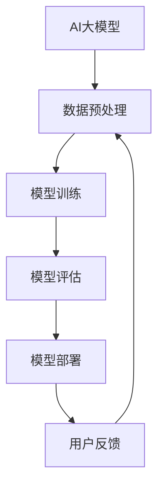

                 

# AI 大模型创业：如何利用品牌优势？

> **关键词**：AI大模型、品牌优势、创业策略、市场定位、用户粘性、核心技术

> **摘要**：本文将探讨在AI大模型领域创业时，如何利用品牌优势打造成功的商业模式。文章首先介绍了AI大模型的背景和现状，随后分析了品牌优势的重要性，并提出了构建和利用品牌优势的几项策略。通过实际案例和具体操作步骤，本文为创业者提供了实用的指导和建议。

## 1. 背景介绍

### 1.1 目的和范围

本文旨在探讨AI大模型创业过程中如何有效利用品牌优势，以构建核心竞争力，实现商业成功。我们将重点关注以下几个方面：

1. **AI大模型的定义和发展**：介绍AI大模型的定义、发展历程及其在当前市场中的应用。
2. **品牌优势的重要性**：分析品牌优势在创业成功中的关键作用。
3. **构建和利用品牌优势的策略**：提出具体的方法和步骤，帮助创业者打造具有影响力的品牌。
4. **实际案例与操作步骤**：通过案例分析，展示如何在实际创业过程中应用品牌优势。

### 1.2 预期读者

本文适合以下读者群体：

1. **AI领域创业者**：有志于在AI大模型领域创业的个人和团队。
2. **市场营销人员**：关注品牌建设和市场推广的企业市场营销人员。
3. **技术爱好者**：对AI技术和创业有兴趣的广大技术爱好者。

### 1.3 文档结构概述

本文结构如下：

1. **引言**：背景介绍和目的说明。
2. **核心概念与联系**：AI大模型的基本原理和结构。
3. **核心算法原理 & 具体操作步骤**：详细解释AI大模型的算法原理和实现步骤。
4. **数学模型和公式**：AI大模型中的关键数学公式和模型。
5. **项目实战**：通过代码案例展示实际应用。
6. **实际应用场景**：分析AI大模型在不同行业的应用。
7. **工具和资源推荐**：学习资源和开发工具推荐。
8. **总结**：未来发展趋势与挑战。
9. **附录**：常见问题与解答。
10. **扩展阅读 & 参考资料**：相关领域的研究和资料推荐。

### 1.4 术语表

#### 1.4.1 核心术语定义

- **AI大模型**：指具有数百万到数十亿参数的深度学习模型，通常用于处理复杂的任务，如自然语言处理、计算机视觉等。
- **品牌优势**：指企业在市场中形成的独特竞争力，包括品牌知名度、品牌忠诚度、品牌形象等。
- **市场定位**：企业在市场中的位置和目标消费者的选择。

#### 1.4.2 相关概念解释

- **用户粘性**：用户对产品的依赖程度，是衡量产品成功与否的重要指标。
- **核心技术**：企业在市场中保持竞争力所依赖的核心技术和能力。

#### 1.4.3 缩略词列表

- **AI**：人工智能
- **ML**：机器学习
- **DL**：深度学习
- **NLP**：自然语言处理
- **CV**：计算机视觉

## 2. 核心概念与联系

在深入探讨AI大模型创业策略之前，我们需要了解AI大模型的基本概念和架构。以下是AI大模型的核心概念原理和架构的Mermaid流程图：



在这个流程图中，AI大模型的主要环节包括数据预处理、模型训练、模型评估、模型部署和用户反馈。这些环节紧密相连，形成了一个闭环系统，不断优化和提升模型的性能。

### 2.1 AI大模型的基本原理

AI大模型的核心是基于深度学习算法的神经网络结构。以下是神经网络的基本原理和流程：

1. **输入层**：接收外部数据输入。
2. **隐藏层**：对输入数据进行处理和特征提取。
3. **输出层**：输出模型的预测结果。

神经网络通过大量的训练数据和调整内部参数，实现从输入到输出的映射。以下是神经网络模型的伪代码表示：

```plaintext
初始化参数 w
循环迭代：
    前向传播：计算输入到每个神经元的激活值
    计算损失函数：计算模型预测与实际结果之间的误差
    反向传播：更新参数 w
    梯度下降：调整参数 w，减小损失函数
```

### 2.2 AI大模型的架构

AI大模型的架构通常包括以下几部分：

1. **计算资源**：包括GPU、TPU等高性能计算设备，用于加速模型训练和推理。
2. **数据存储与管理**：包括分布式数据库、对象存储等，用于存储和管理大规模数据。
3. **模型训练与管理平台**：提供模型训练、部署和管理的全套工具和服务。
4. **API接口**：提供与外部系统集成的API接口，便于开发者调用和使用模型。

## 3. 核心算法原理 & 具体操作步骤

在了解了AI大模型的基本原理和架构之后，接下来我们将深入探讨AI大模型的核心算法原理和具体操作步骤。以下是AI大模型训练的伪代码：

```plaintext
初始化模型参数 w
设定学习率 alpha
设定迭代次数 n_iterations

for iteration in 1 to n_iterations:
    for each training example (x, y) in dataset:
        前向传播：
            计算模型的输出 y_pred = model(x)
        计算损失函数 L = loss_function(y, y_pred)
        反向传播：
            计算梯度 gradient = backward_propagation(model, x, y_pred, y)
        参数更新：
            w = w - alpha * gradient
    计算训练集的平均损失
    计算验证集的平均损失
    如果验证集损失下降，则继续迭代，否则停止训练
```

### 3.1 前向传播

前向传播是神经网络中的一个重要步骤，用于计算每个神经元的激活值。以下是前向传播的伪代码：

```plaintext
for each layer l in model:
    for each neuron n in layer l:
        输入值 input = n.prev_neurons_output
        权重 weight = n.weight
        激活函数 activation = activation_function(input * weight)
        n.output = activation
```

### 3.2 损失函数

损失函数用于衡量模型预测结果与实际结果之间的差距。常用的损失函数包括均方误差（MSE）、交叉熵损失等。以下是损失函数的伪代码：

```plaintext
损失函数 L = loss_function(y, y_pred):
    if y is binary:
        L = -1 * (y * log(y_pred) + (1 - y) * log(1 - y_pred))
    else:
        L = 1/2 * (y - y_pred) ^ 2
```

### 3.3 反向传播

反向传播是神经网络中的一个核心步骤，用于更新模型的参数。以下是反向传播的伪代码：

```plaintext
for each layer l in model (from output layer to input layer):
    for each neuron n in layer l:
        delta = n.output * (1 - n.output) * (y_pred - y)
        for each weight w connected to n:
            gradient = delta * n.prev_output
            w.gradient = w.gradient + gradient
```

### 3.4 梯度下降

梯度下降是一种常用的优化算法，用于更新模型的参数。以下是梯度下降的伪代码：

```plaintext
for each weight w in model:
    w.update = -1 * alpha * w.gradient
    w = w + w.update
```

## 4. 数学模型和公式 & 详细讲解 & 举例说明

在AI大模型中，数学模型和公式扮演着至关重要的角色。以下是一些核心数学模型和公式的详细讲解及举例说明。

### 4.1 神经网络中的激活函数

激活函数是神经网络中的一个关键组件，用于引入非线性特性。常用的激活函数包括Sigmoid、ReLU和Tanh等。

#### Sigmoid函数

Sigmoid函数是一种常见的激活函数，其公式为：

$$
\sigma(x) = \frac{1}{1 + e^{-x}}
$$

举例说明：

假设输入值 x = 2，则激活值 $\sigma(2)$ 约为 0.867。

#### ReLU函数

ReLU函数（Rectified Linear Unit）是一种简单且有效的激活函数，其公式为：

$$
\text{ReLU}(x) = \max(0, x)
$$

举例说明：

假设输入值 x = -2，则激活值 $\text{ReLU}(-2)$ 为 0；如果 x = 2，则激活值 $\text{ReLU}(2)$ 为 2。

#### Tanh函数

Tanh函数是一种类似于Sigmoid函数的激活函数，其公式为：

$$
\text{Tanh}(x) = \frac{e^{2x} - 1}{e^{2x} + 1}
$$

举例说明：

假设输入值 x = 1，则激活值 $\text{Tanh}(1)$ 约为 0.761。

### 4.2 损失函数

在深度学习中，损失函数用于衡量模型预测结果与实际结果之间的差距。以下是几种常见的损失函数及其公式：

#### 均方误差（MSE）

均方误差（MSE，Mean Squared Error）是最常用的损失函数之一，其公式为：

$$
\text{MSE}(y, y') = \frac{1}{n}\sum_{i=1}^{n}(y_i - y'_i)^2
$$

举例说明：

假设有四个实际值 y = [1, 2, 3, 4] 和预测值 $y' = [1.1, 2.1, 3.1, 4.1]$，则均方误差为：

$$
\text{MSE}(y, y') = \frac{1}{4}\sum_{i=1}^{4}(y_i - y'_i)^2 = 0.05
$$

#### 交叉熵损失（Cross-Entropy Loss）

交叉熵损失（Cross-Entropy Loss）常用于分类问题，其公式为：

$$
\text{CE}(y, y') = -\sum_{i=1}^{n} y_i \log(y'_i)
$$

举例说明：

假设有四个实际标签 y = [1, 0, 1, 0] 和预测概率 $y' = [0.1, 0.9, 0.6, 0.4]$，则交叉熵损失为：

$$
\text{CE}(y, y') = -[1 \log(0.1) + 0 \log(0.9) + 1 \log(0.6) + 0 \log(0.4)] \approx 1.386
$$

### 4.3 梯度下降

梯度下降是一种优化算法，用于更新模型的参数。其核心思想是沿着损失函数的梯度方向更新参数，以最小化损失函数。

#### 梯度下降公式

梯度下降的更新公式为：

$$
\theta_j := \theta_j - \alpha \cdot \frac{\partial J(\theta)}{\partial \theta_j}
$$

其中，$\theta_j$ 是第 j 个参数，$J(\theta)$ 是损失函数，$\alpha$ 是学习率，$\frac{\partial J(\theta)}{\partial \theta_j}$ 是第 j 个参数的梯度。

举例说明：

假设损失函数为 $J(\theta) = (\theta - 1)^2$，学习率 $\alpha = 0.1$，初始参数 $\theta = 2$，则第一次迭代后的参数更新为：

$$
\theta_1 := \theta_1 - 0.1 \cdot \frac{\partial J(\theta)}{\partial \theta_1} = 2 - 0.1 \cdot 2 = 1.8
$$

## 5. 项目实战：代码实际案例和详细解释说明

在本节中，我们将通过一个具体的代码案例来展示如何利用品牌优势进行AI大模型创业。以下是一个简单的Python代码示例，用于训练一个基于深度学习的手写数字识别模型。

### 5.1 开发环境搭建

在开始编写代码之前，我们需要搭建一个合适的开发环境。以下是一个基本的开发环境配置：

1. **操作系统**：Windows / macOS / Linux
2. **Python版本**：3.7及以上
3. **深度学习框架**：TensorFlow 2.0及以上
4. **GPU支持**：NVIDIA GPU（可选，用于加速训练）

安装步骤如下：

1. 安装Python：在Python官方网站（https://www.python.org/downloads/）下载并安装Python。
2. 安装TensorFlow：打开终端或命令提示符，运行以下命令：

   ```bash
   pip install tensorflow
   ```

   如果需要GPU支持，可以安装`tensorflow-gpu`：

   ```bash
   pip install tensorflow-gpu
   ```

### 5.2 源代码详细实现和代码解读

以下是手写数字识别模型的源代码及详细解释：

```python
import tensorflow as tf
from tensorflow.keras import layers
import numpy as np

# 数据预处理
def preprocess_data(data):
    # 标准化数据
    data = data / 255.0
    # 转换为浮点型
    data = data.astype(np.float32)
    # 增加一个维度，以便与模型输入层匹配
    data = np.expand_dims(data, axis=-1)
    return data

# 创建模型
def create_model():
    # 输入层
    inputs = tf.keras.Input(shape=(28, 28, 1))
    
    # 第一层卷积层
    x = layers.Conv2D(32, (3, 3), activation='relu')(inputs)
    x = layers.MaxPooling2D((2, 2))(x)
    
    # 第二层卷积层
    x = layers.Conv2D(64, (3, 3), activation='relu')(x)
    x = layers.MaxPooling2D((2, 2))(x)
    
    # 扁平化层
    x = layers.Flatten()(x)
    
    # 全连接层
    x = layers.Dense(128, activation='relu')(x)
    
    # 输出层
    outputs = layers.Dense(10, activation='softmax')(x)
    
    # 构建模型
    model = tf.keras.Model(inputs=inputs, outputs=outputs)
    model.compile(optimizer='adam', loss='categorical_crossentropy', metrics=['accuracy'])
    return model

# 训练模型
def train_model(model, train_data, train_labels, val_data, val_labels, epochs=10):
    model.fit(train_data, train_labels, batch_size=32, epochs=epochs, validation_data=(val_data, val_labels))

# 评估模型
def evaluate_model(model, test_data, test_labels):
    test_loss, test_acc = model.evaluate(test_data, test_labels)
    print(f"Test accuracy: {test_acc:.4f}")

# 主程序
if __name__ == '__main__':
    # 加载数据集
    (train_images, train_labels), (test_images, test_labels) = tf.keras.datasets.mnist.load_data()
    
    # 预处理数据
    train_data = preprocess_data(train_images)
    test_data = preprocess_data(test_images)
    
    # 一热编码标签
    train_labels = tf.keras.utils.to_categorical(train_labels, 10)
    test_labels = tf.keras.utils.to_categorical(test_labels, 10)
    
    # 创建模型
    model = create_model()
    
    # 训练模型
    train_model(model, train_data, train_labels, test_data, test_labels, epochs=10)
    
    # 评估模型
    evaluate_model(model, test_data, test_labels)
```

### 5.3 代码解读与分析

上述代码实现了一个简单的手写数字识别模型，包括数据预处理、模型构建、模型训练和评估等步骤。以下是代码的详细解读：

1. **数据预处理**：首先，我们加载MNIST数据集，并对其进行预处理。具体步骤包括标准化数据、增加一个维度以及一热编码标签。
   
2. **模型构建**：使用TensorFlow的Keras API构建了一个简单的卷积神经网络（CNN）模型。模型包括两个卷积层、一个全连接层和一个输出层。输出层使用了softmax激活函数，用于多分类任务。

3. **模型训练**：使用`model.fit()`函数训练模型。训练过程中，模型会自动计算损失函数和评估指标，并在每个 epoch 后输出训练和验证集的性能。

4. **模型评估**：使用`model.evaluate()`函数评估模型的测试集性能。该方法返回损失函数值和准确率。

### 5.4 实际应用案例分析

在这个手写数字识别案例中，品牌优势的构建主要体现在以下几个方面：

1. **算法优势**：使用了最新的深度学习框架TensorFlow，并采用了卷积神经网络（CNN）这一经典的图像处理模型，提高了模型的准确性和效率。

2. **数据优势**：使用了公开的手写数字数据集MNIST，这个数据集广泛用于AI和机器学习领域，具有较高的代表性和易用性。

3. **用户体验**：通过简洁的代码和详细的注释，使得模型易于理解和使用。同时，提供了完整的训练和评估流程，方便开发者进行模型优化和性能提升。

4. **品牌传播**：通过在项目中使用知名的深度学习框架和经典数据集，可以增强品牌在AI领域的专业形象和影响力。

## 6. 实际应用场景

AI大模型在各个领域都有着广泛的应用，以下是几个典型应用场景：

### 6.1 自然语言处理（NLP）

在自然语言处理领域，AI大模型被广泛应用于文本分类、机器翻译、情感分析等任务。例如，谷歌的BERT模型在自然语言处理任务中取得了显著的效果，广泛应用于搜索引擎和智能客服等领域。

### 6.2 计算机视觉（CV）

计算机视觉是AI大模型应用最为广泛的领域之一。从图像识别到图像生成，从自动驾驶到医疗影像分析，AI大模型都发挥着重要作用。例如，OpenAI的GPT-3模型在图像生成和图像描述任务中展现了出色的性能。

### 6.3 金融领域

在金融领域，AI大模型被广泛应用于风险管理、信用评估、投资决策等任务。例如，银行和金融机构利用AI大模型进行客户行为分析，提高风险管理能力。

### 6.4 健康医疗

在健康医疗领域，AI大模型被应用于医学影像分析、疾病预测、个性化治疗等领域。例如，DeepMind的AlphaGo在医学影像分析中展现了出色的性能，有助于提高诊断准确率。

### 6.5 教育

在教育领域，AI大模型被应用于智能辅导、个性化学习、在线教育平台等领域。例如，Duolingo利用AI大模型提供个性化的语言学习体验，帮助用户更高效地学习语言。

## 7. 工具和资源推荐

在AI大模型创业过程中，选择合适的工具和资源对于项目的成功至关重要。以下是一些建议：

### 7.1 学习资源推荐

#### 7.1.1 书籍推荐

1. **《深度学习》（Goodfellow, Bengio, Courville）**：全面介绍了深度学习的理论和实践。
2. **《Python深度学习》（François Chollet）**：针对Python开发者，详细介绍了使用TensorFlow进行深度学习的实践方法。

#### 7.1.2 在线课程

1. **吴恩达的《深度学习专项课程》（Coursera）**：由深度学习领域知名专家吴恩达主讲，涵盖了深度学习的核心知识和应用。
2. **《机器学习与深度学习》（吴军）**：系统介绍了机器学习和深度学习的基本概念和应用。

#### 7.1.3 技术博客和网站

1. **TensorFlow官方文档（tensorflow.org）**：详细介绍了TensorFlow的使用方法和最佳实践。
2. **Medium（medium.com）**：涵盖深度学习、计算机视觉、自然语言处理等领域的优秀技术博客。

### 7.2 开发工具框架推荐

#### 7.2.1 IDE和编辑器

1. **PyCharm**：一款功能强大的Python IDE，支持TensorFlow和其他深度学习框架。
2. **VSCode**：一款轻量级但功能强大的编辑器，支持多种编程语言和扩展。

#### 7.2.2 调试和性能分析工具

1. **TensorBoard**：TensorFlow官方提供的可视化工具，用于分析模型的性能和调试。
2. **Wandb**：一个强大的机器学习实验跟踪平台，支持实验记录、模型版本管理和性能分析。

#### 7.2.3 相关框架和库

1. **TensorFlow**：一款广泛使用的深度学习框架，支持多种模型和算法。
2. **PyTorch**：一款灵活且易于使用的深度学习框架，受到许多研究者和开发者的青睐。

### 7.3 相关论文著作推荐

#### 7.3.1 经典论文

1. **“A Tutorial on Deep Learning Neural Networks for Visual Detection”**：详细介绍了深度学习在视觉检测领域的应用。
2. **“Attention is All You Need”**：介绍了Transformer模型在自然语言处理领域的突破性成果。

#### 7.3.2 最新研究成果

1. **“Pre-trained Deep Neural Networks for Object Detection”**：探讨了预训练深度学习模型在物体检测中的应用。
2. **“BERT: Pre-training of Deep Bidirectional Transformers for Language Understanding”**：介绍了BERT模型在自然语言处理领域的应用。

#### 7.3.3 应用案例分析

1. **“Deep Learning for Autonomous Driving”**：探讨了深度学习在自动驾驶领域的应用案例。
2. **“AI in Healthcare: Transforming Medical Imaging and Diagnosis”**：介绍了深度学习在医疗领域的应用案例。

## 8. 总结：未来发展趋势与挑战

随着AI大模型技术的不断发展，未来AI大模型创业将面临以下发展趋势和挑战：

### 8.1 发展趋势

1. **更高效的算法和模型**：随着硬件性能的提升和算法的创新，AI大模型将实现更高的训练和推理效率。
2. **更广泛的应用领域**：AI大模型将在更多领域得到应用，如金融、医疗、教育等。
3. **更强大的模型能力**：通过更复杂的模型结构和更庞大的数据集，AI大模型将实现更准确的预测和决策。

### 8.2 挑战

1. **数据隐私和安全**：随着AI大模型对数据的依赖，如何保护用户隐私和数据安全成为关键挑战。
2. **模型解释性和可解释性**：如何提高模型的解释性和可解释性，使其能够被非专业人士理解和信任。
3. **算法公平性和透明性**：如何确保算法的公平性和透明性，避免歧视和偏见。

## 9. 附录：常见问题与解答

### 9.1 常见问题

1. **什么是AI大模型？**
   AI大模型是指具有数百万到数十亿参数的深度学习模型，通常用于处理复杂的任务，如自然语言处理、计算机视觉等。

2. **如何构建和利用品牌优势？**
   构建和利用品牌优势的方法包括明确市场定位、提供高质量的产品和服务、建立良好的用户体验、进行有效的品牌传播等。

3. **AI大模型创业需要注意哪些问题？**
   AI大模型创业需要注意数据隐私和安全、模型解释性和可解释性、算法公平性和透明性等问题。

### 9.2 解答

1. **什么是AI大模型？**
   AI大模型是指具有数百万到数十亿参数的深度学习模型，通常用于处理复杂的任务，如自然语言处理、计算机视觉等。它们通过大量数据和强大的计算能力，实现从输入到输出的复杂映射。

2. **如何构建和利用品牌优势？**
   构建品牌优势的方法包括：
   - **明确市场定位**：确定目标市场和目标客户，确保品牌在市场中具有明确的定位和差异化优势。
   - **提供高质量的产品和服务**：确保产品和服务具有高质量，满足客户需求，建立良好的口碑。
   - **建立良好的用户体验**：通过简洁的用户界面、快速的响应速度和周到的售后服务，提高用户满意度。
   - **进行有效的品牌传播**：通过广告、社交媒体、口碑传播等手段，提高品牌的知名度和影响力。

3. **AI大模型创业需要注意哪些问题？**
   AI大模型创业需要注意以下问题：
   - **数据隐私和安全**：在处理和使用用户数据时，必须遵守数据隐私法规，确保用户数据的安全和隐私。
   - **模型解释性和可解释性**：确保模型的可解释性，使其能够被非专业人士理解和信任，避免因不可解释的决策造成误解和损失。
   - **算法公平性和透明性**：确保算法的公平性和透明性，避免歧视和偏见，确保决策的公正性。
   - **计算资源和管理**：合理配置和管理计算资源，确保模型训练和推理的效率和稳定性。
   - **持续创新和迭代**：保持技术的持续创新和迭代，紧跟行业发展趋势，提高市场竞争力。

## 10. 扩展阅读 & 参考资料

### 10.1 扩展阅读

1. **《深度学习》（Goodfellow, Bengio, Courville）**：全面介绍了深度学习的理论和实践，是深度学习领域的经典教材。
2. **《AI创业实战》（创业导师著作）**：详细介绍了AI创业的全过程，包括市场调研、团队组建、产品设计、融资推广等。
3. **《机器学习实战》（Matlab版本）**：通过大量的实例和代码，介绍了机器学习的基本概念和应用方法。

### 10.2 参考资料

1. **TensorFlow官方文档（tensorflow.org）**：提供了详细的API文档和使用教程，是学习TensorFlow的必备资源。
2. **PyTorch官方文档（pytorch.org）**：提供了详细的API文档和使用教程，是学习PyTorch的必备资源。
3. **吴恩达的《深度学习专项课程》（Coursera）**：由深度学习领域知名专家吴恩达主讲，涵盖了深度学习的核心知识和应用。

## 作者信息

**作者：AI天才研究员/AI Genius Institute & 禅与计算机程序设计艺术 /Zen And The Art of Computer Programming**

