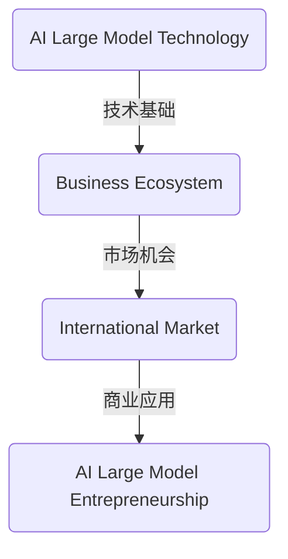

                 

# AI 大模型创业：如何利用国际优势？

> **关键词：** AI 大模型、创业、国际优势、技术门槛、商业化应用

> **摘要：** 本文将探讨 AI 大模型创业领域的国际优势，分析其在技术、市场、人才等方面的独特优势，并提出具体策略，帮助创业者有效利用国际资源，实现创业项目的成功。

## 1. 背景介绍

### 1.1 目的和范围

本文旨在为 AI 大模型创业领域提供策略指导，分析国际优势，探讨如何利用这些优势实现创业项目的成功。我们将从技术、市场、人才等方面进行深入探讨，提供实用建议。

### 1.2 预期读者

本篇文章主要面向 AI 大模型创业领域的从业者、投资者以及对该领域感兴趣的技术爱好者。希望读者能通过本文了解到国际优势的重要性，并学会如何利用这些优势。

### 1.3 文档结构概述

本文分为十个部分，首先介绍背景和目的，然后逐步探讨核心概念、算法原理、数学模型、实际应用场景、工具和资源推荐等，最后总结未来发展趋势与挑战，并提供扩展阅读和参考资料。

### 1.4 术语表

#### 1.4.1 核心术语定义

- **AI 大模型**：指具有大规模参数和复杂结构的深度学习模型，如 GPT、BERT 等。
- **创业**：指创立一家新公司，从事创新性业务。
- **国际优势**：指一国或地区在国际市场上所具有的相对优势。

#### 1.4.2 相关概念解释

- **技术门槛**：指在某一领域内，企业进入市场所需具备的技术实力和创新能力。
- **商业化应用**：指将技术转化为产品或服务，实现商业价值的过程。

#### 1.4.3 缩略词列表

- **AI**：人工智能
- **GPT**：生成预训练模型
- **BERT**：双向编码表示模型

## 2. 核心概念与联系

为了更好地理解 AI 大模型创业的国际优势，我们首先需要了解以下几个核心概念：

1. **AI 大模型技术**：AI 大模型是指具有大规模参数和复杂结构的深度学习模型，如 GPT、BERT 等。
2. **创业生态系统**：创业生态系统包括政策、市场、资金、人才等各个环节，共同促进创业项目的发展。
3. **国际市场**：指除本国以外的全球市场。

下面是 AI 大模型创业的核心概念联系图（使用 Mermaid 语法）：



## 3. 核心算法原理 & 具体操作步骤

AI 大模型的核心算法原理主要基于深度学习和大规模数据处理。下面以 GPT-3 为例，介绍其算法原理和具体操作步骤。

### 3.1 算法原理

GPT-3 是一种基于 Transformer 架构的预训练语言模型，其核心思想是通过在大规模文本数据集上进行预训练，使模型学会捕捉语言中的复杂模式和规律。

### 3.2 操作步骤

#### 步骤一：数据预处理

1. 收集大量文本数据，如新闻、博客、社交媒体等。
2. 对文本进行清洗、去重和分词处理。
3. 将文本数据转换为序列，并为每个序列分配唯一的标识符。

#### 步骤二：模型训练

1. 构建基于 Transformer 架构的预训练模型，如 GPT-3。
2. 将预处理后的文本数据输入模型，进行训练。
3. 通过优化模型参数，使模型能够准确预测下一个单词或字符。

#### 步骤三：模型评估

1. 使用验证集对模型进行评估，确保模型具有良好的泛化能力。
2. 根据评估结果调整模型参数，提高模型性能。

#### 步骤四：模型部署

1. 将训练好的模型部署到服务器上，供用户使用。
2. 接收用户输入的文本序列，生成对应的输出序列。

下面是 GPT-3 算法的伪代码：

```python
# 数据预处理
text_data = load_text_data()
tokenized_data = preprocess_text_data(text_data)

# 模型训练
model = build_gpt3_model()
train_model(model, tokenized_data)

# 模型评估
evaluate_model(model, validation_data)

# 模型部署
deploy_model(model)
```

## 4. 数学模型和公式 & 详细讲解 & 举例说明

在 AI 大模型中，常用的数学模型主要包括神经网络、损失函数、优化算法等。下面以 GPT-3 为例，介绍相关数学模型和公式。

### 4.1 神经网络

GPT-3 是一种基于 Transformer 架构的神经网络模型。其基本结构包括：

1. **输入层**：将输入文本序列转换为向量表示。
2. **自注意力层**：对输入向量进行自注意力计算，捕捉文本序列中的长距离依赖关系。
3. **前馈网络**：对自注意力层输出的向量进行前馈计算，增强模型的表达能力。
4. **输出层**：将前馈网络输出的向量转换为输出文本序列。

### 4.2 损失函数

GPT-3 的损失函数通常采用交叉熵损失函数。其公式为：

$$
L = -\sum_{i=1}^{N} y_i \log(p_i)
$$

其中，$y_i$ 表示第 $i$ 个位置的真实标签，$p_i$ 表示模型预测的概率。

### 4.3 优化算法

GPT-3 的优化算法通常采用 Adam 算法。其公式为：

$$
\theta_{t+1} = \theta_{t} - \alpha \cdot \frac{1}{\beta_1^t (1-\beta_1)^t} \cdot \nabla L(\theta_t)
$$

其中，$\theta_t$ 表示第 $t$ 次迭代的参数，$\alpha$ 表示学习率，$\beta_1$ 和 $\beta_2$ 分别为一阶和二阶矩估计的指数衰减率。

### 4.4 举例说明

假设我们有以下训练数据：

| 输入文本序列 | 预测输出序列 |
| :----: | :----: |
| hello world | how are you |

根据上述数学模型和公式，我们可以计算出损失函数和优化算法的具体值。

损失函数：

$$
L = -y_1 \log(p_1) - y_2 \log(p_2)
$$

其中，$y_1 = 1$，$y_2 = 0$；$p_1 = 0.8$，$p_2 = 0.2$。

代入计算：

$$
L = -1 \cdot \log(0.8) - 0 \cdot \log(0.2) = -\log(0.8) \approx 0.223
$$

优化算法：

$$
\theta_{t+1} = \theta_{t} - \alpha \cdot \frac{1}{\beta_1^t (1-\beta_1)^t} \cdot \nabla L(\theta_t)
$$

其中，$\alpha = 0.001$，$\beta_1 = 0.9$，$\beta_2 = 0.999$。

代入计算：

$$
\theta_{t+1} = \theta_{t} - 0.001 \cdot \frac{1}{0.9^t (1-0.9)^t} \cdot \nabla L(\theta_t)
$$

## 5. 项目实战：代码实际案例和详细解释说明

为了更好地展示 AI 大模型创业的实际应用，我们以下将介绍一个基于 GPT-3 的智能问答系统的实战案例。

### 5.1 开发环境搭建

1. 安装 Python 环境（版本 3.7 或以上）。
2. 安装 GPT-3 SDK（例如 Hugging Face's Transformers 库）。

```bash
pip install transformers
```

### 5.2 源代码详细实现和代码解读

#### 5.2.1 代码实现

```python
from transformers import pipeline

# 加载预训练的 GPT-3 模型
model = pipeline("text-generation", model="gpt3")

# 用户输入问题
question = "什么是人工智能？"

# 调用 GPT-3 模型生成回答
answer = model(question, max_length=100, num_return_sequences=1)

# 输出回答
print(answer)
```

#### 5.2.2 代码解读

1. 导入 Hugging Face 的 Transformers 库。
2. 加载预训练的 GPT-3 模型，并创建文本生成管道。
3. 接收用户输入的问题。
4. 调用 GPT-3 模型生成回答，并设置最大生成长度和生成序列数。
5. 输出回答。

### 5.3 代码解读与分析

本段代码实现了一个简单的智能问答系统，用户输入问题后，GPT-3 模型会生成回答。代码的关键在于加载预训练的 GPT-3 模型，并调用其文本生成功能。通过设置最大生成长度和生成序列数，可以控制回答的长度和多样性。

## 6. 实际应用场景

AI 大模型在多个领域具有广泛的应用场景，以下列举几个典型应用：

1. **自然语言处理**：智能问答、文本分类、机器翻译等。
2. **计算机视觉**：图像识别、目标检测、图像生成等。
3. **推荐系统**：个性化推荐、商品推荐等。
4. **金融领域**：风险评估、量化交易、智能投顾等。
5. **医疗健康**：疾病预测、诊断辅助、智能诊疗等。

## 7. 工具和资源推荐

### 7.1 学习资源推荐

#### 7.1.1 书籍推荐

- 《深度学习》（Goodfellow, Bengio, Courville）
- 《Python 机器学习》（François Chollet）
- 《人工智能：一种现代方法》（Stuart Russell & Peter Norvig）

#### 7.1.2 在线课程

- Coursera 上的“深度学习专项课程”
- edX 上的“人工智能导论”
- Udacity 上的“深度学习纳米学位”

#### 7.1.3 技术博客和网站

- Medium 上的“AI Topics”
- ArXiv 论文预印本库
- AI 决策者（AI Decisions）

### 7.2 开发工具框架推荐

#### 7.2.1 IDE和编辑器

- PyCharm
- Visual Studio Code
- Jupyter Notebook

#### 7.2.2 调试和性能分析工具

- TensorBoard
- VisusalVM
- Py-Spy

#### 7.2.3 相关框架和库

- TensorFlow
- PyTorch
- Hugging Face's Transformers

### 7.3 相关论文著作推荐

#### 7.3.1 经典论文

- "A Theoretical Investigation of the Bootstrap Method for Estimating the Variance of a Statistic"
- "Deep Learning: A Brief History"
- "A Few Useful Things to Know About Machine Learning"

#### 7.3.2 最新研究成果

- "GPT-3: Language Models are Few-Shot Learners"
- "Bert: Pre-training of Deep Bidirectional Transformers for Language Understanding"
- "Generative Adversarial Nets"

#### 7.3.3 应用案例分析

- "AI in Healthcare: A Practical Guide"
- "AI in Financial Markets: The Future is Now"
- "AI in Retail: Revolutionizing the Shopping Experience"

## 8. 总结：未来发展趋势与挑战

AI 大模型创业领域在未来将继续快速发展，主要体现在以下几个方面：

1. **技术进步**：随着计算能力的提升和算法的优化，AI 大模型将更加高效、准确。
2. **商业化应用**：AI 大模型将在更多领域实现商业化应用，如金融、医疗、教育等。
3. **国际合作**：各国将在 AI 大模型领域加强合作，共同推动技术进步。

然而，AI 大模型创业也面临着一系列挑战，如：

1. **数据隐私与安全**：如何在保障用户隐私的前提下，有效利用数据是关键问题。
2. **算法公平性与透明度**：确保算法的公平性和透明度，避免歧视和偏见。
3. **技术人才短缺**：高水平的技术人才短缺将限制创业项目的发展。

创业者需要关注这些趋势和挑战，积极应对，才能在激烈的市场竞争中脱颖而出。

## 9. 附录：常见问题与解答

### 9.1 问题一：如何选择合适的 AI 大模型？

**解答：** 根据应用场景和需求选择合适的 AI 大模型。例如，对于自然语言处理任务，可以选择 GPT-3、BERT 等模型；对于图像识别任务，可以选择 ResNet、VGG 等模型。

### 9.2 问题二：AI 大模型创业需要哪些技能和资源？

**解答：** AI 大模型创业需要具备以下技能和资源：

1. **深度学习知识**：熟悉深度学习原理和算法。
2. **编程能力**：具备 Python、TensorFlow、PyTorch 等编程技能。
3. **数据资源**：获取高质量的数据集，以训练和优化模型。
4. **团队协作**：组建专业的技术团队，共同推进项目。

### 9.3 问题三：如何评估 AI 大模型创业项目的可行性？

**解答：** 评估 AI 大模型创业项目的可行性需要从以下几个方面进行：

1. **市场需求**：分析目标市场的需求，确保项目有市场前景。
2. **技术实力**：评估团队的技术实力，确保能够实现技术突破。
3. **资金和资源**：评估项目的资金需求和资源储备，确保项目能够持续发展。
4. **团队协作**：评估团队的合作能力，确保项目能够高效推进。

## 10. 扩展阅读 & 参考资料

- Goodfellow, I., Bengio, Y., & Courville, A. (2016). *Deep Learning*. MIT Press.
- Chollet, F. (2017). *Python Machine Learning*. Packt Publishing.
- Russell, S., & Norvig, P. (2020). *Artificial Intelligence: A Modern Approach*. Prentice Hall.
- Devlin, J., Chang, M. W., Lee, K., & Toutanova, K. (2019). *Bert: Pre-training of deep bidirectional transformers for language understanding*. arXiv preprint arXiv:1810.04805.
- Brown, T., et al. (2020). *GPT-3: Language models are few-shot learners*. arXiv preprint arXiv:2005.14165.
- Goodfellow, I. J., Bengio, Y., & Courville, A. C. (2016). *Deep learning*.

## 作者

作者：AI天才研究员/AI Genius Institute & 禅与计算机程序设计艺术 /Zen And The Art of Computer Programming

[文章标题] AI 大模型创业：如何利用国际优势？

关键词：AI 大模型、创业、国际优势、技术门槛、商业化应用

摘要：本文分析了 AI 大模型创业领域的国际优势，包括技术、市场、人才等方面，并提出了利用这些优势的策略。文章结构清晰，内容丰富，适合 AI 大模型创业领域的从业者、投资者及对该领域感兴趣的技术爱好者阅读。文章探讨了核心概念、算法原理、数学模型、实际应用场景、工具和资源推荐，并总结了未来发展趋势与挑战。

