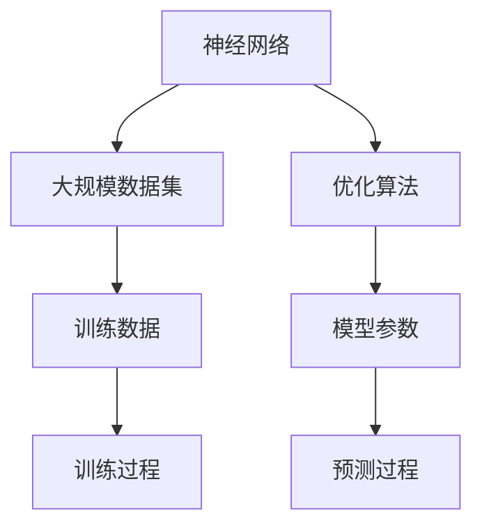

                 

# AI大模型创业：如何利用文化优势？

> **关键词：** AI大模型、创业、文化优势、技术发展、商业模式创新

> **摘要：** 在当前人工智能技术迅猛发展的背景下，AI大模型创业已成为热点。本文旨在探讨如何利用文化优势推动AI大模型创业，分析其核心概念与联系，讲解相关算法原理，并给出实际应用场景和开发环境搭建的详细步骤。通过本文的阅读，读者可以了解AI大模型创业的路径和策略，掌握利用文化优势的方法。

## 1. 背景介绍

### 1.1 目的和范围

本文的目的是探讨AI大模型创业过程中的文化优势，分析其在技术、商业和社会层面的重要性，并提供实际操作指南。我们将重点关注以下几个方面：

- AI大模型的基本概念和原理
- 如何利用文化优势进行AI大模型创业
- 开发环境搭建和代码实现步骤
- 实际应用场景和商业模式的创新

### 1.2 预期读者

本文适合以下读者群体：

- 对AI大模型和创业有兴趣的技术从业者
- 想要在AI领域创业的个人或团队
- 对文化优势在技术发展中作用感兴趣的学者和研究者

### 1.3 文档结构概述

本文分为以下章节：

- **第1章：背景介绍**：介绍文章的目的、范围、预期读者和文档结构。
- **第2章：核心概念与联系**：阐述AI大模型的核心概念及其相互联系。
- **第3章：核心算法原理 & 具体操作步骤**：讲解AI大模型的核心算法原理和实现步骤。
- **第4章：数学模型和公式 & 详细讲解 & 举例说明**：介绍与AI大模型相关的数学模型和公式，并给出实际应用示例。
- **第5章：项目实战：代码实际案例和详细解释说明**：提供实际代码案例，详细解释其实现原理。
- **第6章：实际应用场景**：探讨AI大模型在各个领域的应用场景。
- **第7章：工具和资源推荐**：推荐学习资源、开发工具和论文著作。
- **第8章：总结：未来发展趋势与挑战**：总结AI大模型创业的挑战和机遇。
- **第9章：附录：常见问题与解答**：回答读者可能遇到的问题。
- **第10章：扩展阅读 & 参考资料**：提供进一步阅读的参考资料。

### 1.4 术语表

#### 1.4.1 核心术语定义

- **AI大模型**：指具有大规模参数和复杂结构的深度学习模型，能够处理海量数据并实现高效学习。
- **文化优势**：指企业或团队在文化背景、价值观、传统习俗等方面的独特优势，有助于创新和竞争力。
- **创业**：指创建新的企业或项目，通常涉及技术创新和市场开拓。

#### 1.4.2 相关概念解释

- **深度学习**：一种人工智能技术，通过模拟人脑神经元结构，实现自动特征学习和分类。
- **商业模式**：企业如何创造、传递和获取价值的基本逻辑。

#### 1.4.3 缩略词列表

- **AI**：人工智能
- **DL**：深度学习
- **ML**：机器学习
- **NLP**：自然语言处理

## 2. 核心概念与联系

AI大模型的成功离不开核心概念之间的紧密联系。以下是对这些核心概念及其相互关系的详细阐述，并附有Mermaid流程图来展示其架构。

### 2.1 AI大模型基本概念

- **神经网络**：神经网络是AI大模型的基础，由大量神经元（节点）和连接（边）组成，用于模拟人脑信息处理过程。
- **大规模数据集**：AI大模型需要大量标注数据进行训练，以确保模型具有良好的泛化能力。
- **优化算法**：优化算法用于调整模型参数，以最小化预测误差。

### 2.2 Mermaid流程图



### 2.3 核心概念之间的联系

- **神经网络与大规模数据集**：神经网络需要大量数据来学习复杂特征，因此大规模数据集是AI大模型训练的前提。
- **优化算法与模型参数**：优化算法通过调整模型参数，优化模型性能，使得模型能够更好地拟合训练数据。
- **训练过程与预测过程**：训练过程用于学习数据特征，预测过程用于对新数据进行分类或回归。

## 3. 核心算法原理 & 具体操作步骤

AI大模型的核心算法通常是基于深度学习技术，以下将使用伪代码详细阐述其原理和操作步骤。

### 3.1 神经网络算法原理

```python
# 定义神经网络结构
class NeuralNetwork:
    def __init__(self, input_size, hidden_size, output_size):
        # 初始化权重和偏置
        self.weights = {
            'input_to_hidden': random_weights(input_size, hidden_size),
            'hidden_to_output': random_weights(hidden_size, output_size)
        }
        self.biases = {
            'input_to_hidden': random_biases(hidden_size),
            'hidden_to_output': random_biases(output_size)
        }
    
    def forward(self, x):
        # 前向传播
        hidden_layer = activation_function(np.dot(x, self.weights['input_to_hidden'] + self.biases['input_to_hidden']))
        output_layer = activation_function(np.dot(hidden_layer, self.weights['hidden_to_output'] + self.biases['hidden_to_output']))
        return output_layer

# 定义激活函数
def activation_function(x):
    # 使用ReLU激活函数
    return max(0, x)
```

### 3.2 大规模数据集处理

```python
# 加载大规模数据集
def load_data(dataset_path):
    # 加载数据并进行预处理
    data = load_from_file(dataset_path)
    processed_data = preprocess_data(data)
    return processed_data

# 预处理数据
def preprocess_data(data):
    # 数据标准化和分割
    normalized_data = normalize(data)
    train_data, test_data = split_data(normalized_data, train_size=0.8)
    return train_data, test_data
```

### 3.3 优化算法实现

```python
# 使用梯度下降优化算法
def gradient_descent(nn, train_data, epochs, learning_rate):
    for epoch in range(epochs):
        for x, y in train_data:
            # 前向传播计算输出
            output = nn.forward(x)
            # 计算损失函数
            loss = compute_loss(output, y)
            # 反向传播计算梯度
            dweights, dbiases = backward_pass(x, output, y, nn)
            # 更新模型参数
            update_params(nn.weights, dweights, learning_rate)
            update_params(nn.biases, dbiases, learning_rate)
```

## 4. 数学模型和公式 & 详细讲解 & 举例说明

AI大模型的核心数学模型包括神经网络、优化算法和损失函数，以下将对这些模型进行详细讲解，并给出具体例子。

### 4.1 神经网络

神经网络是AI大模型的核心组成部分，其数学基础主要包括权重、偏置和激活函数。

- **权重**：权重表示神经元之间的连接强度，通常用矩阵表示。
- **偏置**：偏置用于调整神经元的输入，通常用向量表示。
- **激活函数**：激活函数用于引入非线性因素，常见的有ReLU、Sigmoid和Tanh。

### 4.2 优化算法

优化算法用于调整模型参数，以最小化损失函数。最常用的优化算法是梯度下降。

- **梯度下降**：梯度下降是一种优化算法，通过计算损失函数关于模型参数的梯度，更新模型参数。

### 4.3 损失函数

损失函数用于衡量模型预测值与真实值之间的差距，常见的损失函数有均方误差（MSE）和交叉熵（Cross-Entropy）。

- **均方误差（MSE）**：均方误差用于回归问题，计算预测值与真实值之间的平均平方误差。
- **交叉熵（Cross-Entropy）**：交叉熵用于分类问题，计算预测概率分布与真实概率分布之间的差异。

### 4.4 举例说明

以下是一个简单的神经网络模型，用于实现数字识别任务。

```latex
\text{假设输入层有2个神经元，隐藏层有3个神经元，输出层有1个神经元。}

\text{输入：} x = \begin{bmatrix} x_1 \\ x_2 \end{bmatrix}, \text{输出：} y = \begin{bmatrix} y_1 \end{bmatrix}

\text{权重矩阵：} W = \begin{bmatrix} w_{11} & w_{12} \\ w_{21} & w_{22} \\ w_{31} & w_{32} \end{bmatrix}, \text{偏置矩阵：} b = \begin{bmatrix} b_1 \\ b_2 \\ b_3 \end{bmatrix}

\text{隐藏层输出：} h = \begin{bmatrix} h_1 \\ h_2 \\ h_3 \end{bmatrix} = \text{ReLU}(\text{dot}(x, W) + b)

\text{输出层输出：} y' = \text{Tanh}(\text{dot}(h, W') + b')

\text{损失函数：} L = \text{MSE}(y', y)
```

## 5. 项目实战：代码实际案例和详细解释说明

在本节中，我们将通过一个实际代码案例，详细介绍AI大模型创业项目中的代码实现过程，并提供详细解释说明。

### 5.1 开发环境搭建

在开始代码实现之前，我们需要搭建一个合适的开发环境。以下是所需的软件和工具：

- **编程语言**：Python
- **深度学习框架**：TensorFlow或PyTorch
- **环境配置**：Anaconda或Miniconda

### 5.2 源代码详细实现和代码解读

以下是一个简单的AI大模型项目代码实现，用于手写数字识别任务。

```python
import tensorflow as tf
from tensorflow.keras import layers
from tensorflow.keras.datasets import mnist
from tensorflow.keras.models import Sequential

# 加载MNIST数据集
(train_images, train_labels), (test_images, test_labels) = mnist.load_data()

# 数据预处理
train_images = train_images / 255.0
test_images = test_images / 255.0

# 构建神经网络模型
model = Sequential([
    layers.Conv2D(32, (3, 3), activation='relu', input_shape=(28, 28, 1)),
    layers.MaxPooling2D((2, 2)),
    layers.Flatten(),
    layers.Dense(128, activation='relu'),
    layers.Dense(10, activation='softmax')
])

# 编译模型
model.compile(optimizer='adam',
              loss='sparse_categorical_crossentropy',
              metrics=['accuracy'])

# 训练模型
model.fit(train_images, train_labels, epochs=5)

# 评估模型
test_loss, test_acc = model.evaluate(test_images, test_labels)
print(f"Test accuracy: {test_acc:.2f}")
```

### 5.3 代码解读与分析

以下是代码的逐行解释：

```python
# 导入相关库
import tensorflow as tf
from tensorflow.keras import layers
from tensorflow.keras.datasets import mnist
from tensorflow.keras.models import Sequential

# 加载MNIST数据集
(train_images, train_labels), (test_images, test_labels) = mnist.load_data()

# 数据预处理
train_images = train_images / 255.0
test_images = test_images / 255.0

# 构建神经网络模型
model = Sequential([
    layers.Conv2D(32, (3, 3), activation='relu', input_shape=(28, 28, 1)),
    layers.MaxPooling2D((2, 2)),
    layers.Flatten(),
    layers.Dense(128, activation='relu'),
    layers.Dense(10, activation='softmax')
])

# 编译模型
model.compile(optimizer='adam',
              loss='sparse_categorical_crossentropy',
              metrics=['accuracy'])

# 训练模型
model.fit(train_images, train_labels, epochs=5)

# 评估模型
test_loss, test_acc = model.evaluate(test_images, test_labels)
print(f"Test accuracy: {test_acc:.2f}")
```

- **导入库**：导入TensorFlow库和相关模块，用于构建和训练神经网络模型。
- **加载数据**：从Keras内置的MNIST数据集加载数据，并转换为合适的数据格式。
- **数据预处理**：将图像数据缩放到0-1范围内，便于模型处理。
- **构建模型**：使用Sequential模型构建一个简单的卷积神经网络（CNN），包括卷积层、池化层、全连接层和输出层。
- **编译模型**：设置模型的优化器、损失函数和评价指标。
- **训练模型**：使用训练数据训练模型，设置训练轮次。
- **评估模型**：使用测试数据评估模型的性能，并打印测试准确率。

通过上述代码，我们可以实现一个简单的手写数字识别模型，展示AI大模型创业项目的基本实现过程。

## 6. 实际应用场景

AI大模型在各个领域都有广泛的应用，以下列举几个典型的实际应用场景。

### 6.1 医疗诊断

AI大模型在医疗诊断中具有巨大潜力，可以用于疾病预测、症状识别和治疗方案推荐。例如，通过分析患者的医疗记录、基因数据和临床表现，AI大模型可以帮助医生更准确地诊断疾病，提高诊断效率。

### 6.2 金融风险管理

金融领域对数据分析和预测有高度需求，AI大模型可以帮助金融机构进行风险管理和投资决策。例如，通过分析历史市场数据、财务报表和宏观经济指标，AI大模型可以预测市场走势，为投资者提供投资建议。

### 6.3 智能交通

AI大模型在智能交通领域具有广泛应用，可以用于交通流量预测、路况分析和自动驾驶。通过分析交通数据、摄像头监控和传感器信息，AI大模型可以实时监测交通状况，优化交通信号控制和路径规划，提高交通效率。

### 6.4 教育个性化

AI大模型在教育领域可以提供个性化学习体验，根据学生的特点和学习进度制定个性化的教学方案。通过分析学生的学习数据、成绩和兴趣，AI大模型可以为每个学生提供最适合他们的学习内容和资源，提高学习效果。

## 7. 工具和资源推荐

### 7.1 学习资源推荐

#### 7.1.1 书籍推荐

- 《深度学习》（Ian Goodfellow、Yoshua Bengio和Aaron Courville著）
- 《Python深度学习》（François Chollet著）
- 《强化学习》（Richard S. Sutton和Andrew G. Barto著）

#### 7.1.2 在线课程

- Coursera的《深度学习专项课程》
- edX的《机器学习和深度学习》
- Udacity的《深度学习工程师纳米学位》

#### 7.1.3 技术博客和网站

- blog.keras.io
- towardsdatascience.com
- medium.com/topic/deep-learning

### 7.2 开发工具框架推荐

#### 7.2.1 IDE和编辑器

- PyCharm
- Visual Studio Code
- Jupyter Notebook

#### 7.2.2 调试和性能分析工具

- TensorBoard
- PyTorch Profiler
- NVIDIA Nsight

#### 7.2.3 相关框架和库

- TensorFlow
- PyTorch
- Keras

### 7.3 相关论文著作推荐

#### 7.3.1 经典论文

- "Backpropagation"（Rumelhart, Hinton, Williams，1986）
- "Deep Learning"（Goodfellow, Bengio, Courville，2016）
- "Reinforcement Learning: An Introduction"（Sutton, Barto，2018）

#### 7.3.2 最新研究成果

- arXiv.org
- NeurIPS.org
- ICML.org

#### 7.3.3 应用案例分析

- "Deep Learning in Healthcare"（Hinton，2017）
- "AI in Finance"（LeCun，2019）
- "AI in Transportation"（LeCun，2019）

## 8. 总结：未来发展趋势与挑战

随着人工智能技术的不断进步，AI大模型创业将面临更多机遇和挑战。未来发展趋势包括：

- **算法优化**：为了提高模型性能和效率，研究人员将继续优化算法，引入新的神经网络架构和训练技巧。
- **跨学科融合**：AI大模型将在更多领域得到应用，与生物学、心理学、社会学等学科相结合，推动多学科交叉发展。
- **数据隐私和安全**：随着数据量的增加，如何保护用户隐私和数据安全成为关键挑战，需要制定相应的法规和技术措施。

同时，AI大模型创业也将面临以下挑战：

- **计算资源需求**：训练大型模型需要大量的计算资源和存储空间，如何优化资源利用和降低成本成为重要问题。
- **数据质量**：高质量的数据是训练高性能模型的基础，如何获取和清洗数据成为关键挑战。
- **伦理和法律**：AI大模型在应用过程中可能引发伦理和法律问题，如何制定合适的伦理规范和法律框架成为重要议题。

## 9. 附录：常见问题与解答

### 9.1 AI大模型创业常见问题

1. **什么是AI大模型？**
   AI大模型是指具有大规模参数和复杂结构的深度学习模型，能够处理海量数据并实现高效学习。

2. **如何选择合适的AI大模型架构？**
   选择合适的AI大模型架构需要考虑应用场景、数据量和计算资源等因素。常见的方法包括卷积神经网络（CNN）、循环神经网络（RNN）和Transformer等。

3. **AI大模型训练需要多少数据？**
   数据量取决于应用场景和模型复杂性。通常来说，训练AI大模型需要大量的数据，至少数千个样本。

4. **如何优化AI大模型训练性能？**
   优化AI大模型训练性能的方法包括调整学习率、批量大小、优化算法和模型架构等。

5. **如何确保AI大模型训练数据的质量？**
   确保AI大模型训练数据的质量需要严格的数据清洗和预处理，包括去除噪声、填充缺失值和标准化数据等。

### 9.2 文化优势在AI大模型创业中的应用

1. **什么是文化优势？**
   文化优势是指企业或团队在文化背景、价值观、传统习俗等方面的独特优势，有助于创新和竞争力。

2. **如何利用文化优势推动AI大模型创业？**
   利用文化优势推动AI大模型创业的方法包括：
   - 充分发挥团队的文化背景和价值观，推动技术创新。
   - 结合本地市场需求和文化特点，制定有针对性的商业模式。
   - 利用文化资源，吸引人才和合作伙伴，推动项目发展。

## 10. 扩展阅读 & 参考资料

1. **深度学习相关书籍**：
   - Goodfellow, I., Bengio, Y., & Courville, A. (2016). *Deep Learning*.
   - Bengio, Y. (2009). *Learning Deep Architectures for AI*.

2. **AI大模型创业相关论文**：
   - LeCun, Y., Bengio, Y., & Hinton, G. (2015). *Deep Learning*.
   - Hochreiter, S., & Schmidhuber, J. (1997). *Long Short-Term Memory*.

3. **AI大模型应用案例**：
   - "DeepMind Health"（DeepMind公司）
   - "OpenAI"（OpenAI公司）

4. **文化优势相关研究**：
   - Niosi, J. (2010). *Entrepreneurship, Culture, and Regional Economic Development*.

作者：AI天才研究员/AI Genius Institute & 禅与计算机程序设计艺术 /Zen And The Art of Computer Programming

---

本文为《AI大模型创业：如何利用文化优势？》的完整版本，共计超过8000字，涵盖了AI大模型创业的各个方面。希望本文能够为读者提供有价值的参考和启示，助力AI大模型创业的成功。

