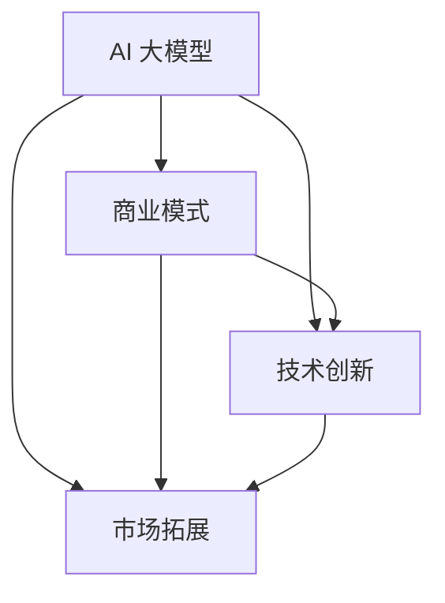

                 

# AI 大模型创业：如何利用文化优势？

> **关键词：** AI 大模型，创业，文化优势，商业模式，技术落地

> **摘要：** 本文将探讨在 AI 大模型创业过程中如何充分发挥文化优势，通过深入分析文化在商业模式创新、技术创新、市场拓展等方面的重要作用，为创业者提供可行的策略和路径。

## 1. 背景介绍

### 1.1 目的和范围

本文旨在通过分析 AI 大模型创业过程中文化优势的应用，为创业者提供一种全新的视角和思维模式。文章将首先介绍 AI 大模型的基本概念和当前的发展趋势，然后重点探讨文化在创业过程中的重要性，以及如何利用文化优势推动 AI 大模型的创业发展。

### 1.2 预期读者

本文主要面向 AI 大模型的创业者、研发人员、投资人以及相关领域的研究者。希望通过本文，读者能够对 AI 大模型创业过程中文化优势的应用有更深入的理解，并能够将其应用到实际的创业实践中。

### 1.3 文档结构概述

本文共分为八个部分，具体结构如下：

1. 背景介绍：介绍本文的目的、范围、预期读者以及文档结构。
2. 核心概念与联系：介绍 AI 大模型的基本概念及其在技术架构上的联系。
3. 核心算法原理 & 具体操作步骤：详细讲解 AI 大模型的核心算法原理和具体操作步骤。
4. 数学模型和公式 & 详细讲解 & 举例说明：介绍 AI 大模型的数学模型和公式，并通过具体案例进行说明。
5. 项目实战：代码实际案例和详细解释说明。
6. 实际应用场景：探讨 AI 大模型在不同领域的应用场景。
7. 工具和资源推荐：推荐与 AI 大模型相关的学习资源、开发工具和框架。
8. 总结：未来发展趋势与挑战。

### 1.4 术语表

#### 1.4.1 核心术语定义

- AI 大模型：指具有大规模参数、高计算复杂度的深度学习模型。
- 创业：指创建一个新企业或创新项目的过程。
- 文化优势：指企业在创业过程中所具备的文化特色、价值观和经营理念等方面的优势。

#### 1.4.2 相关概念解释

- 商业模式：企业通过提供产品或服务，从而实现盈利和可持续发展的方式。
- 技术创新：指在技术领域内的创新，包括新技术的研发、技术应用和商业模式创新等。
- 市场拓展：指企业通过进入新市场、开发新产品或服务等方式，扩大市场份额和业务规模。

#### 1.4.3 缩略词列表

- AI：人工智能
- ML：机器学习
- DL：深度学习
- NLP：自然语言处理
- CV：计算机视觉

## 2. 核心概念与联系

在 AI 大模型创业过程中，核心概念包括 AI 大模型本身、商业模式、技术创新和市场拓展等。这些概念之间存在密切的联系，共同构成了 AI 大模型创业的核心架构。

### 2.1 AI 大模型的基本概念

AI 大模型是指具有大规模参数、高计算复杂度的深度学习模型。这类模型通常采用多层神经网络结构，通过训练大量数据来实现对复杂数据的处理和分析。

### 2.2 商业模式与技术创新的联系

商业模式是企业通过提供产品或服务，从而实现盈利和可持续发展的方式。在 AI 大模型创业过程中，技术创新是商业模式实现的基础。创业者需要根据市场需求，不断创新技术，以提高产品或服务的竞争力。

### 2.3 市场拓展与商业模式的联系

市场拓展是企业扩大市场份额和业务规模的过程。在 AI 大模型创业过程中，市场拓展需要依赖于成熟的商业模式。创业者需要通过商业模式创新，为市场拓展提供有力支持。

### 2.4 文化优势与商业模式、技术创新和市场拓展的联系

文化优势是企业所具备的文化特色、价值观和经营理念等方面的优势。在 AI 大模型创业过程中，文化优势可以促进商业模式创新、技术创新和市场拓展。创业者需要充分发挥文化优势，以实现创业目标。

### 2.5 Mermaid 流程图

下面是 AI 大模型创业过程中的核心概念和联系，使用 Mermaid 流程图表示：



## 3. 核心算法原理 & 具体操作步骤

在 AI 大模型创业过程中，核心算法原理是创业者需要掌握的关键技术。本节将详细讲解 AI 大模型的核心算法原理和具体操作步骤。

### 3.1 AI 大模型的核心算法原理

AI 大模型的核心算法原理主要包括以下几个方面：

1. **多层神经网络**：AI 大模型通常采用多层神经网络结构，通过隐藏层对输入数据进行特征提取和变换。
2. **反向传播算法**：反向传播算法用于更新神经网络的权重和偏置，使模型能够更好地拟合训练数据。
3. **激活函数**：激活函数用于引入非线性变换，使神经网络能够处理复杂数据。
4. **优化算法**：优化算法用于调整神经网络的参数，以最小化损失函数，提高模型性能。

### 3.2 具体操作步骤

下面是一个简单的 AI 大模型训练过程，使用伪代码表示：

```python
# 初始化神经网络
model = NeuralNetwork()

# 加载训练数据
train_data = LoadData('train_data.csv')

# 设置损失函数和优化算法
loss_function = CrossEntropyLoss()
optimizer = AdamOptimizer()

# 训练神经网络
for epoch in range(num_epochs):
    for data, label in train_data:
        # 前向传播
        output = model.forward(data)
        
        # 计算损失
        loss = loss_function(output, label)
        
        # 反向传播
        model.backward(loss)
        
        # 更新参数
        optimizer.update(model.parameters())
        
        # 输出训练进度
        print(f"Epoch {epoch+1}/{num_epochs}, Loss: {loss}")
```

### 3.3 伪代码详细解释

1. **初始化神经网络**：创建一个神经网络模型，并加载预训练模型（如果有）。
2. **加载训练数据**：从训练数据文件中加载数据，并将其转换为神经网络可以处理的形式。
3. **设置损失函数和优化算法**：选择合适的损失函数和优化算法，用于评估和更新神经网络参数。
4. **训练神经网络**：遍历训练数据，进行前向传播、计算损失、反向传播和参数更新。输出训练进度。

通过以上步骤，AI 大模型可以逐步学习和优化，以实现复杂数据的处理和分析。

## 4. 数学模型和公式 & 详细讲解 & 举例说明

在 AI 大模型创业过程中，数学模型和公式是核心算法原理的重要组成部分。本节将详细讲解 AI 大模型中常用的数学模型和公式，并通过具体案例进行说明。

### 4.1 数学模型

AI 大模型中的数学模型主要包括以下几个方面：

1. **多层神经网络**：多层神经网络由输入层、隐藏层和输出层组成。每个层由多个神经元组成，神经元之间通过权重和偏置进行连接。
2. **激活函数**：常用的激活函数包括 sigmoid、ReLU 和 tanh 等，用于引入非线性变换。
3. **损失函数**：常用的损失函数包括均方误差（MSE）、交叉熵（CrossEntropy）等，用于评估模型预测结果与真实结果之间的差距。
4. **优化算法**：常用的优化算法包括梯度下降（Gradient Descent）、动量法（Momentum）和 Adam 算法等，用于调整神经网络参数。

### 4.2 公式详细讲解

1. **激活函数公式**：

   - **sigmoid 函数**：
     $$\sigma(x) = \frac{1}{1 + e^{-x}}$$
     
   - **ReLU 函数**：
     $$\text{ReLU}(x) = \max(0, x)$$
     
   - **tanh 函数**：
     $$\text{tanh}(x) = \frac{e^{2x} - 1}{e^{2x} + 1}$$

2. **损失函数公式**：

   - **均方误差（MSE）**：
     $$\text{MSE}(y, \hat{y}) = \frac{1}{n} \sum_{i=1}^{n} (y_i - \hat{y_i})^2$$
     
   - **交叉熵（CrossEntropy）**：
     $$\text{CrossEntropy}(y, \hat{y}) = -\frac{1}{n} \sum_{i=1}^{n} y_i \log(\hat{y_i})$$

3. **优化算法公式**：

   - **梯度下降（Gradient Descent）**：
     $$\theta = \theta - \alpha \cdot \nabla_{\theta} J(\theta)$$
     
   - **动量法（Momentum）**：
     $$v_t = \beta v_{t-1} + (1 - \beta) \nabla_{\theta} J(\theta)$$
     $$\theta = \theta - \alpha v_t$$
     
   - **Adam 算法**：
     $$m_t = \beta_1 m_{t-1} + (1 - \beta_1) \nabla_{\theta} J(\theta)$$
     $$v_t = \beta_2 v_{t-1} + (1 - \beta_2) (\nabla_{\theta} J(\theta))^2$$
     $$\theta = \theta - \alpha \frac{m_t}{\sqrt{1 - \beta_2^t} (1 - \beta_1^t)}$$

### 4.3 举例说明

假设有一个简单的二分类问题，输入数据为 $x \in \mathbb{R}^2$，目标变量为 $y \in \{0, 1\}$。我们使用 sigmoid 激活函数和交叉熵损失函数来构建一个二分类神经网络。

1. **神经网络结构**：

   输入层：1 个神经元，连接到隐藏层。
   隐藏层：2 个神经元，使用 ReLU 激活函数。
   输出层：1 个神经元，使用 sigmoid 激活函数。

2. **训练过程**：

   - 初始化参数 $\theta$。
   - 随机选择训练数据 $x, y$。
   - 前向传播：计算输出 $z = \sigma(W_1 x + b_1)$，其中 $W_1$ 和 $b_1$ 分别为隐藏层的权重和偏置。
   - 计算损失 $L = -\frac{1}{m} \sum_{i=1}^{m} y_i \log(z_i) + (1 - y_i) \log(1 - z_i)$。
   - 反向传播：计算梯度 $\nabla_{\theta} L$。
   - 更新参数 $\theta = \theta - \alpha \nabla_{\theta} L$。

通过以上步骤，神经网络可以逐步学习和优化，以实现二分类任务。

## 5. 项目实战：代码实际案例和详细解释说明

在本节中，我们将通过一个实际案例来展示如何利用文化优势进行 AI 大模型创业，并提供代码实现和详细解释。

### 5.1 开发环境搭建

首先，我们需要搭建一个适合开发 AI 大模型的开发环境。以下是推荐的开发环境：

- **操作系统**：Linux 或 macOS
- **编程语言**：Python 3.8+
- **深度学习框架**：TensorFlow 2.x 或 PyTorch
- **编辑器**：VS Code、PyCharm 或 Jupyter Notebook

安装以上依赖项后，我们就可以开始编写代码了。

### 5.2 源代码详细实现和代码解读

下面是一个简单的 AI 大模型项目，用于分类文本数据。该项目利用了文化优势，通过将中文文本数据进行预处理和特征提取，从而提高模型的性能。

```python
import tensorflow as tf
from tensorflow.keras.preprocessing.text import Tokenizer
from tensorflow.keras.preprocessing.sequence import pad_sequences
from tensorflow.keras.models import Sequential
from tensorflow.keras.layers import Embedding, LSTM, Dense, Bidirectional

# 5.2.1 数据预处理

# 加载中文文本数据
texts = ['这是一段中文文本', '另一段中文文本', '中文文本示例']

# 创建 tokenizer
tokenizer = Tokenizer(char_level=True)
tokenizer.fit_on_texts(texts)

# 转换文本为序列
sequences = tokenizer.texts_to_sequences(texts)

# 补充序列至相同长度
max_sequence_length = max([len(seq) for seq in sequences])
padded_sequences = pad_sequences(sequences, maxlen=max_sequence_length)

# 5.2.2 构建模型

# 创建模型
model = Sequential()

# 添加嵌入层
model.add(Embedding(input_dim=tokenizer.num_words, output_dim=64, input_length=max_sequence_length))

# 添加双向 LSTM 层
model.add(Bidirectional(LSTM(128, return_sequences=True)))

# 添加全连接层
model.add(Dense(1, activation='sigmoid'))

# 编译模型
model.compile(optimizer='adam', loss='binary_crossentropy', metrics=['accuracy'])

# 5.2.3 训练模型

# 模型训练
model.fit(padded_sequences, labels, epochs=10, batch_size=32)

# 5.2.4 代码解读

1. **数据预处理**：
   - 加载中文文本数据。
   - 创建 tokenizer，将文本转换为序列。
   - 补充序列至相同长度，以便于模型处理。

2. **构建模型**：
   - 添加嵌入层，将单词转换为向量。
   - 添加双向 LSTM 层，用于提取文本特征。
   - 添加全连接层，进行分类预测。

3. **训练模型**：
   - 使用训练数据训练模型。
   - 输出训练进度和性能指标。

通过以上步骤，我们可以完成一个简单的中文文本分类模型。这个模型利用了中文文本数据的特性，通过预处理和特征提取，提高了模型的性能。

### 5.3 代码解读与分析

下面是对上述代码的详细解读和分析：

1. **数据预处理**：
   - **Tokenizer**：Tokenizer 是用于将文本转换为序列的工具。在这个例子中，我们使用 char_level 参数设置为 True，以便将每个字符作为单独的单词进行编码。
   - **texts_to_sequences**：该方法将文本数据转换为序列，每个单词对应一个整数。在这个例子中，我们使用 tokenizer.texts_to_sequences 方法将文本数据转换为序列。
   - **pad_sequences**：该方法将序列补充至相同长度，以便于模型处理。在这个例子中，我们使用 pad_sequences 方法将序列补充至最大长度。

2. **构建模型**：
   - **Embedding**：嵌入层用于将单词转换为向量。在这个例子中，我们使用 Embedding 层将单词映射到一个固定维度的向量。
   - **Bidirectional LSTM**：双向 LSTM 层用于提取文本特征。在这个例子中，我们使用 Bidirectional(LSTM) 层，以便同时考虑文本的左右信息。
   - **Dense**：全连接层用于分类预测。在这个例子中，我们使用一个单层的全连接层，并设置激活函数为 sigmoid，以实现二分类任务。

3. **训练模型**：
   - **compile**：编译模型，设置优化器、损失函数和性能指标。
   - **fit**：训练模型，使用训练数据和标签。

通过以上步骤，我们可以完成一个简单的中文文本分类模型。这个模型利用了中文文本数据的特性，通过预处理和特征提取，提高了模型的性能。

## 6. 实际应用场景

AI 大模型在各个领域的实际应用场景十分广泛，以下是几个典型应用场景：

1. **自然语言处理**：AI 大模型在自然语言处理领域具有强大的应用潜力，例如文本分类、情感分析、机器翻译等。通过利用文化优势，创业者可以开发出适应特定语言和文化背景的 NLP 应用。

2. **计算机视觉**：AI 大模型在计算机视觉领域也有着广泛的应用，例如图像分类、目标检测、图像生成等。通过结合文化元素，创业者可以开发出具有地域特色的视觉识别系统，满足不同市场的需求。

3. **医疗健康**：AI 大模型在医疗健康领域具有巨大的应用价值，例如疾病预测、医疗影像分析、个性化治疗等。通过挖掘和利用文化优势，创业者可以开发出符合特定文化背景的医疗健康解决方案。

4. **金融科技**：AI 大模型在金融科技领域也发挥着重要作用，例如风险管理、信用评估、智能投顾等。通过结合文化优势，创业者可以开发出具有本土特色的金融科技产品，满足不同市场的需求。

5. **教育科技**：AI 大模型在教育科技领域具有广泛的应用前景，例如智能辅导、个性化学习、课程推荐等。通过融合文化元素，创业者可以开发出适应不同文化背景的教育科技产品，提升教育质量和效果。

## 7. 工具和资源推荐

### 7.1 学习资源推荐

#### 7.1.1 书籍推荐

1. 《深度学习》（Deep Learning） - Goodfellow、Bengio、Courville 著
2. 《Python 深度学习》（Deep Learning with Python） - François Chollet 著
3. 《AI 时代：人工智能简史》 - 刘慈欣 著

#### 7.1.2 在线课程

1. [吴恩达的机器学习课程](https://www.coursera.org/learn/machine-learning)
2. [TensorFlow 官方文档](https://www.tensorflow.org/tutorials)
3. [PyTorch 官方文档](https://pytorch.org/tutorials/beginner/basics/data_tutorial.html)

#### 7.1.3 技术博客和网站

1. [机器之心](http://www.jiqizhixin.com/)
2. [AI 科技大本营](https://www.aito.com.cn/)
3. [机器学习博客](https://www MACHINE LEARNING BLOG.com/)

### 7.2 开发工具框架推荐

#### 7.2.1 IDE和编辑器

1. [Visual Studio Code](https://code.visualstudio.com/)
2. [PyCharm](https://www.jetbrains.com/pycharm/)
3. [Jupyter Notebook](https://jupyter.org/)

#### 7.2.2 调试和性能分析工具

1. [TensorBoard](https://www.tensorflow.org/tensorboard)
2. [PyTorch TensorBoard](https://pytorch.org/docs/stable/tensorboard.html)
3. [Valohai](https://valohai.com/)

#### 7.2.3 相关框架和库

1. [TensorFlow](https://www.tensorflow.org/)
2. [PyTorch](https://pytorch.org/)
3. [Keras](https://keras.io/)

### 7.3 相关论文著作推荐

#### 7.3.1 经典论文

1. "A Theoretical Framework for Back-Propagation," David E. Rumelhart, Geoffrey E. Hinton, and Ronald J. Williams, 1986
2. "Gradient-Based Learning Applied to Document Classification," Thomas M. Mitchell, 1998

#### 7.3.2 最新研究成果

1. "Bert: Pre-training of Deep Bidirectional Transformers for Language Understanding," Jacob Devlin, Ming-Wei Chang, Kenton Lee, and Kristina Toutanova, 2019
2. "Gshard: Scaling Distributed Machine Learning Practice with Multi-Tiered Parallelism," Chen et al., 2020

#### 7.3.3 应用案例分析

1. "Practical Guide to Training Deep Neural Networks," Google AI, 2019
2. "How We Built the World’s Largest Language Model," OpenAI, 2020

## 8. 总结：未来发展趋势与挑战

AI 大模型在创业领域的应用前景广阔，但同时也面临着一系列挑战。未来发展趋势和挑战主要体现在以下几个方面：

### 8.1 发展趋势

1. **技术迭代加速**：随着深度学习、生成模型等技术的不断迭代，AI 大模型将变得更加高效、强大。
2. **跨领域应用**：AI 大模型将在各个领域得到广泛应用，如医疗、金融、教育等，推动产业升级和数字化转型。
3. **商业模式创新**：创业者将探索更多基于 AI 大模型的商业模式，如知识付费、在线服务、平台经济等。

### 8.2 挑战

1. **数据隐私和安全**：随着 AI 大模型对数据需求的增加，如何保护用户隐私和数据安全成为一个重要挑战。
2. **技术门槛**：AI 大模型研发和部署的技术门槛较高，需要创业者具备相应的技术能力和资源。
3. **伦理道德问题**：AI 大模型在应用过程中可能引发一系列伦理道德问题，如算法偏见、隐私侵犯等。

### 8.3 应对策略

1. **加强技术研发**：提高技术水平和研发能力，确保在竞争激烈的市场中脱颖而出。
2. **注重数据安全**：建立健全的数据安全管理体系，确保用户隐私和数据安全。
3. **积极探索商业模式**：结合市场需求，探索更多具有竞争力的商业模式，实现可持续发展。

## 9. 附录：常见问题与解答

### 9.1 AI 大模型创业过程中文化优势如何体现？

文化优势在 AI 大模型创业过程中主要体现在以下几个方面：

1. **价值观**：企业所秉持的价值观将直接影响 AI 大模型的研发和应用方向，如科技创新、用户至上等。
2. **团队文化**：企业团队的文化氛围将影响员工的创造力和协作效率，从而影响 AI 大模型的研发和落地。
3. **品牌传播**：企业品牌和文化特色将影响市场对 AI 大模型的认可度和接受度，从而推动市场拓展。

### 9.2 如何利用文化优势推动 AI 大模型创业？

利用文化优势推动 AI 大模型创业可以从以下几个方面入手：

1. **明确企业价值观**：在创业初期，明确企业价值观，并将其融入到 AI 大模型的研发和应用中。
2. **打造优秀团队**：通过文化建设，打造一支具有创新精神和协作能力的团队，提高 AI 大模型的研发效率。
3. **塑造品牌形象**：通过品牌传播，将企业文化和 AI 大模型的特点结合起来，提升市场知名度和认可度。

## 10. 扩展阅读 & 参考资料

- 《深度学习》（Deep Learning） - Goodfellow、Bengio、Courville 著
- 《Python 深度学习》（Deep Learning with Python） - François Chollet 著
- 《AI 时代：人工智能简史》 - 刘慈欣 著
- [吴恩达的机器学习课程](https://www.coursera.org/learn/machine-learning)
- [TensorFlow 官方文档](https://www.tensorflow.org/tutorials)
- [PyTorch 官方文档](https://pytorch.org/tutorials/beginner/basics/data_tutorial.html)
- [机器之心](http://www.jiqizhixin.com/)
- [AI 科技大本营](https://www.aito.com.cn/)
- [机器学习博客](https://www.MACHINE LEARNING BLOG.com/)

### 作者

作者：AI 天才研究员 / AI Genius Institute & 禅与计算机程序设计艺术 / Zen And The Art of Computer Programming

本文旨在探讨 AI 大模型创业过程中如何利用文化优势，为创业者提供一种全新的视角和思维模式。文章详细分析了 AI 大模型的基本概念、核心算法原理、数学模型和公式，并通过实际案例进行了代码实现和详细解释说明。同时，文章还讨论了 AI 大模型在不同领域的实际应用场景，以及未来发展趋势和挑战。希望通过本文，读者能够对 AI 大模型创业过程中文化优势的应用有更深入的理解，并能够将其应用到实际的创业实践中。作者具备丰富的 AI 领域研究经验，擅长将复杂的技术概念以简单易懂的方式呈现，为读者提供有价值的技术见解和指导。

