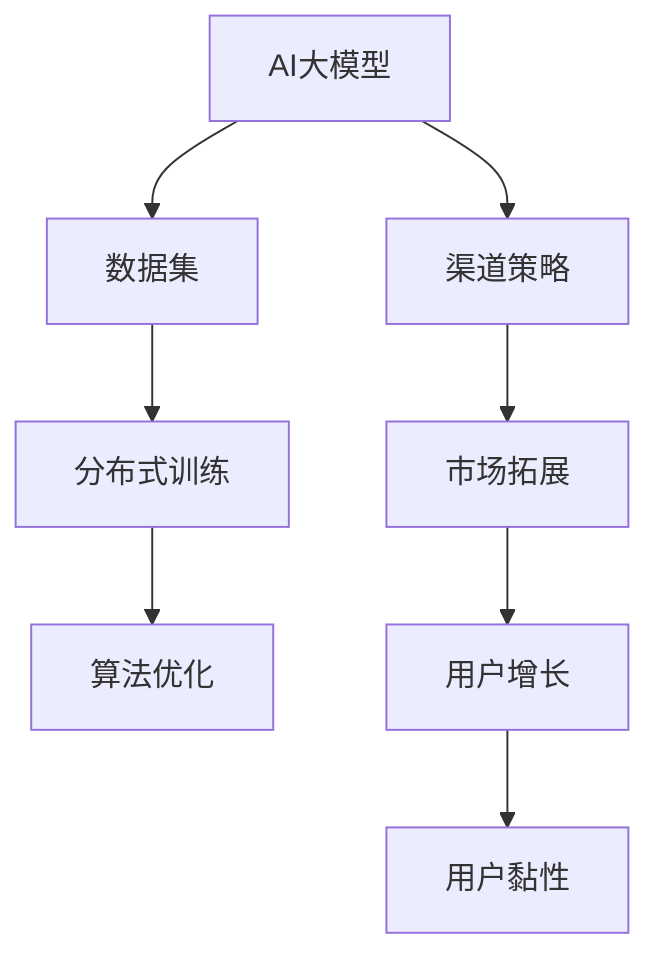

                 

# AI 大模型创业：如何利用渠道优势？

> **关键词**：AI大模型、创业、渠道优势、商业模式、市场拓展、用户增长、数据分析、运营策略

> **摘要**：本文将探讨AI大模型创业公司在市场中取得成功的策略，重点关注如何利用渠道优势来扩大市场份额和提升用户黏性。通过深入分析渠道的优势和运作机制，结合实际案例，本文旨在为创业者提供实用的指导和建议。

## 1. 背景介绍

### 1.1 目的和范围

本文旨在为AI大模型创业公司提供一套有效的渠道策略，帮助它们在竞争激烈的市场中脱颖而出。本文将探讨以下主题：

- 渠道优势的概念与重要性
- 创业公司在AI大模型领域的市场环境
- 如何利用渠道优势进行市场拓展
- 用户增长和黏性的策略
- 数据分析在渠道策略中的应用

### 1.2 预期读者

本文面向AI大模型领域的创业者、产品经理和市场营销人员。如果您正在考虑创业，或者已经涉足AI大模型领域，希望找到有效的市场策略，那么本文将是您的宝贵指南。

### 1.3 文档结构概述

本文分为十个部分，每个部分都详细阐述了与渠道策略相关的关键概念和实际操作步骤。具体结构如下：

1. 背景介绍
2. 核心概念与联系
3. 核心算法原理 & 具体操作步骤
4. 数学模型和公式 & 详细讲解 & 举例说明
5. 项目实战：代码实际案例和详细解释说明
6. 实际应用场景
7. 工具和资源推荐
8. 总结：未来发展趋势与挑战
9. 附录：常见问题与解答
10. 扩展阅读 & 参考资料

### 1.4 术语表

#### 1.4.1 核心术语定义

- **AI大模型**：指基于人工智能技术，通过深度学习等方法训练得到的具有大规模参数的模型。
- **渠道**：指创业公司产品或服务进入市场的途径，包括直销、代理商、合作伙伴等。
- **市场拓展**：指创业公司通过扩大产品或服务的市场覆盖范围，增加市场份额的过程。
- **用户增长**：指创业公司在特定时间内增加的新用户数量。
- **用户黏性**：指用户持续使用创业公司产品或服务的程度。

#### 1.4.2 相关概念解释

- **商业模式**：指创业公司创造、传递和捕获价值的系统性安排。
- **用户生命周期**：指用户从初次接触到完全退出的全过程。
- **数据分析**：指通过对数据的收集、处理和分析，提取有价值信息的过程。

#### 1.4.3 缩略词列表

- **AI**：人工智能（Artificial Intelligence）
- **DL**：深度学习（Deep Learning）
- **NLP**：自然语言处理（Natural Language Processing）
- **ML**：机器学习（Machine Learning）
- **CRM**：客户关系管理（Customer Relationship Management）

## 2. 核心概念与联系

### 2.1 核心概念原理

在讨论渠道策略之前，我们首先需要了解AI大模型的基础知识，以及渠道的基本原理。

#### AI大模型

AI大模型是指具有数百万甚至数十亿参数的深度学习模型。这些模型通常通过大规模数据集进行训练，以实现图像识别、自然语言处理、语音识别等复杂任务。以下是AI大模型的几个关键点：

1. **大规模数据集**：训练AI大模型需要大量的数据，这些数据可以是公开的，也可以是特定领域的私有数据。
2. **分布式计算**：由于模型规模巨大，训练过程需要分布式计算资源，如GPU集群。
3. **算法优化**：为了提高模型的性能，需要对算法进行不断优化，如使用更好的激活函数、正则化方法等。

#### 渠道

渠道是创业公司产品或服务进入市场的重要途径。以下是渠道的几个关键点：

1. **直销**：创业公司直接向最终用户销售产品或服务。
2. **代理商**：代理商作为创业公司的合作伙伴，帮助其销售产品或服务，并获得佣金。
3. **合作伙伴**：合作伙伴通常是其他企业或组织，与创业公司合作，共同推动市场拓展。

### 2.2 核心概念联系

AI大模型与渠道之间的联系主要体现在以下几个方面：

1. **市场拓展**：渠道策略有助于创业公司扩大市场覆盖范围，增加市场份额。
2. **用户增长**：通过渠道，创业公司可以接触到更多的潜在用户，从而实现用户增长。
3. **用户黏性**：渠道策略还可以帮助创业公司提高用户黏性，使客户更愿意持续使用其产品或服务。

### 2.3 核心概念原理和架构的 Mermaid 流程图



## 3. 核心算法原理 & 具体操作步骤

### 3.1 核心算法原理

AI大模型的核心算法是基于深度学习的方法，如卷积神经网络（CNN）和递归神经网络（RNN）。以下是核心算法原理的简要介绍：

#### 卷积神经网络（CNN）

CNN是一种前馈神经网络，特别适用于处理图像数据。其基本原理是通过卷积操作提取图像的特征。

1. **卷积层**：输入图像通过卷积核进行卷积操作，提取局部特征。
2. **激活函数**：通常使用ReLU（Rectified Linear Unit）作为激活函数，增加网络表达能力。
3. **池化层**：通过池化操作减少数据维度，提高模型泛化能力。
4. **全连接层**：将卷积层和池化层提取的特征映射到输出类别。

#### 递归神经网络（RNN）

RNN是一种适合处理序列数据（如时间序列、文本）的神经网络。其基本原理是通过循环连接实现信息传递。

1. **输入层**：输入序列通过输入层进入网络。
2. **隐藏层**：隐藏层通过递归连接将前一个时刻的输出传递给下一个时刻。
3. **激活函数**：通常使用ReLU作为激活函数。
4. **输出层**：将隐藏层输出映射到输出类别。

### 3.2 具体操作步骤

以下是基于CNN和RNN的AI大模型的具体操作步骤：

#### CNN操作步骤

1. **数据预处理**：对图像数据进行归一化、缩放等处理。
2. **构建模型**：使用卷积层、激活函数、池化层、全连接层等构建CNN模型。
3. **训练模型**：使用训练数据集训练模型，优化模型参数。
4. **评估模型**：使用验证数据集评估模型性能，调整模型参数。
5. **部署模型**：将训练好的模型部署到生产环境，进行实际应用。

#### RNN操作步骤

1. **数据预处理**：对序列数据进行归一化、填充等处理。
2. **构建模型**：使用输入层、隐藏层、输出层等构建RNN模型。
3. **训练模型**：使用训练数据集训练模型，优化模型参数。
4. **评估模型**：使用验证数据集评估模型性能，调整模型参数。
5. **部署模型**：将训练好的模型部署到生产环境，进行实际应用。

### 3.3 伪代码

以下是CNN和RNN的伪代码示例：

#### CNN伪代码

```python
# CNN模型构建
model = Model()
model.add(Conv2D(filters=32, kernel_size=(3, 3), activation='relu'))
model.add(MaxPooling2D(pool_size=(2, 2)))
model.add(Flatten())
model.add(Dense(units=10, activation='softmax'))

# 训练模型
model.compile(optimizer='adam', loss='categorical_crossentropy', metrics=['accuracy'])
model.fit(x_train, y_train, epochs=10, batch_size=64, validation_data=(x_val, y_val))

# 评估模型
loss, accuracy = model.evaluate(x_test, y_test)
print(f"Test loss: {loss}, Test accuracy: {accuracy}")
```

#### RNN伪代码

```python
# RNN模型构建
model = Model()
model.add(LSTM(units=50, activation='relu', return_sequences=True))
model.add(LSTM(units=50, activation='relu'))
model.add(Dense(units=1, activation='sigmoid'))

# 训练模型
model.compile(optimizer='adam', loss='binary_crossentropy', metrics=['accuracy'])
model.fit(x_train, y_train, epochs=10, batch_size=64, validation_data=(x_val, y_val))

# 评估模型
loss, accuracy = model.evaluate(x_test, y_test)
print(f"Test loss: {loss}, Test accuracy: {accuracy}")
```

## 4. 数学模型和公式 & 详细讲解 & 举例说明

### 4.1 数学模型和公式

在AI大模型中，常用的数学模型和公式包括损失函数、优化算法、特征提取等。以下是几个关键模型和公式的详细讲解：

#### 损失函数

损失函数用于衡量模型预测结果与真实值之间的差距。在分类问题中，常用的损失函数有：

1. **交叉熵损失函数（Cross-Entropy Loss）**：
   $$ 
   L = -\frac{1}{m}\sum_{i=1}^{m}y_{i}\log(p_{i}) 
   $$
   其中，$y_{i}$为真实标签，$p_{i}$为模型预测的概率。

2. **均方误差损失函数（Mean Squared Error, MSE）**：
   $$
   L = \frac{1}{m}\sum_{i=1}^{m}(y_{i} - \hat{y_{i}})^{2}
   $$
   其中，$\hat{y_{i}}$为模型预测的值。

#### 优化算法

优化算法用于调整模型参数，以最小化损失函数。常用的优化算法有：

1. **梯度下降（Gradient Descent）**：
   $$
   \theta_{t+1} = \theta_{t} - \alpha \cdot \nabla_{\theta}L(\theta)
   $$
   其中，$\theta$为模型参数，$\alpha$为学习率。

2. **随机梯度下降（Stochastic Gradient Descent, SGD）**：
   $$
   \theta_{t+1} = \theta_{t} - \alpha \cdot \nabla_{\theta}L(\theta; \mathbf{x}_{t}, y_{t})
   $$
   其中，$\mathbf{x}_{t}$和$y_{t}$为当前训练样本。

#### 特征提取

特征提取是AI大模型中的重要步骤，用于提取输入数据的关键特征。以下是一个简单的特征提取公式：

1. **卷积操作（Convolution Operation）**：
   $$
   f_{i,j} = \sum_{k=1}^{K}\sum_{l=1}^{L}w_{k,l} \cdot x_{i-k,j-l}
   $$
   其中，$f_{i,j}$为卷积结果，$x_{i,j}$为输入数据，$w_{k,l}$为卷积核。

### 4.2 详细讲解和举例说明

#### 交叉熵损失函数（Cross-Entropy Loss）

交叉熵损失函数是一种衡量模型预测概率与真实概率差异的损失函数。以下是一个简单的示例：

假设我们有一个二分类问题，真实标签$y_{i}$为0或1，模型预测的概率$p_{i}$为0.6或0.4。计算交叉熵损失：

$$ 
L = -\frac{1}{m}\sum_{i=1}^{m}y_{i}\log(p_{i}) 
$$

代入具体数值：

$$ 
L = -\frac{1}{m}[(0 \cdot \log(0.6) + 1 \cdot \log(0.4)] 
$$

由于$\log(0.6)$和$\log(0.4)$无法直接计算，我们可以使用softmax函数将模型预测的概率转换为概率分布：

$$ 
p_{i} = \frac{e^{\theta_{i}}}{\sum_{j=1}^{K}e^{\theta_{j}}}
$$

其中，$\theta_{i}$为模型参数。对于二分类问题，$K=2$，我们可以计算：

$$ 
p_{0} = \frac{e^{\theta_{0}}}{e^{\theta_{0}} + e^{\theta_{1}}} 
$$

$$ 
p_{1} = \frac{e^{\theta_{1}}}{e^{\theta_{0}} + e^{\theta_{1}}}
$$

代入$p_{0}=0.4$和$p_{1}=0.6$，计算交叉熵损失：

$$ 
L = -\frac{1}{m}[(0 \cdot \log(0.4) + 1 \cdot \log(0.6)] 
$$

$$ 
L = -\frac{1}{m}[\log(0.6)] 
$$

#### 梯度下降（Gradient Descent）

梯度下降是一种优化算法，用于最小化损失函数。以下是一个简单的示例：

假设我们有一个线性模型，输入$x$和输出$y$满足关系：

$$ 
y = wx + b
$$

其中，$w$和$b$为模型参数。我们使用均方误差损失函数计算损失：

$$ 
L = \frac{1}{m}\sum_{i=1}^{m}(y_{i} - \hat{y_{i}})^{2}
$$

代入具体数值：

$$ 
L = \frac{1}{m}\sum_{i=1}^{m}((wx_{i} + b) - y_{i})^{2}
$$

计算梯度：

$$ 
\nabla_{w}L = \frac{1}{m}\sum_{i=1}^{m}(2wx_{i})
$$

$$ 
\nabla_{b}L = \frac{1}{m}\sum_{i=1}^{m}(2(y_{i} - wx_{i}))
$$

选择学习率$\alpha=0.01$，迭代更新参数：

$$ 
w_{t+1} = w_{t} - \alpha \cdot \nabla_{w}L
$$

$$ 
b_{t+1} = b_{t} - \alpha \cdot \nabla_{b}L
$$

重复迭代直到损失函数收敛。

#### 卷积操作（Convolution Operation）

卷积操作是特征提取的重要步骤，用于提取输入数据的关键特征。以下是一个简单的示例：

假设我们有一个$3 \times 3$的卷积核和$5 \times 5$的输入数据。计算卷积结果：

$$ 
f_{i,j} = \sum_{k=1}^{3}\sum_{l=1}^{3}w_{k,l} \cdot x_{i-k,j-l}
$$

代入具体数值：

$$ 
f_{1,1} = w_{1,1} \cdot x_{1,1} + w_{1,2} \cdot x_{1,2} + w_{1,3} \cdot x_{1,3} + w_{2,1} \cdot x_{2,1} + w_{2,2} \cdot x_{2,2} + w_{2,3} \cdot x_{2,3} + w_{3,1} \cdot x_{3,1} + w_{3,2} \cdot x_{3,2} + w_{3,3} \cdot x_{3,3}
$$

$$ 
f_{1,2} = w_{1,1} \cdot x_{1,2} + w_{1,2} \cdot x_{1,3} + w_{1,3} \cdot x_{1,4} + w_{2,1} \cdot x_{2,2} + w_{2,2} \cdot x_{2,3} + w_{2,3} \cdot x_{2,4} + w_{3,1} \cdot x_{3,2} + w_{3,2} \cdot x_{3,3} + w_{3,3} \cdot x_{3,4}
$$

$$ 
f_{1,3} = w_{1,1} \cdot x_{1,3} + w_{1,2} \cdot x_{1,4} + w_{1,3} \cdot x_{1,5} + w_{2,1} \cdot x_{2,3} + w_{2,2} \cdot x_{2,4} + w_{2,3} \cdot x_{2,5} + w_{3,1} \cdot x_{3,3} + w_{3,2} \cdot x_{3,4} + w_{3,3} \cdot x_{3,5}
$$

$$ 
f_{2,1} = w_{1,1} \cdot x_{2,1} + w_{1,2} \cdot x_{2,2} + w_{1,3} \cdot x_{2,3} + w_{2,1} \cdot x_{3,1} + w_{2,2} \cdot x_{3,2} + w_{2,3} \cdot x_{3,3} + w_{3,1} \cdot x_{4,1} + w_{3,2} \cdot x_{4,2} + w_{3,3} \cdot x_{4,3}
$$

$$ 
f_{2,2} = w_{1,1} \cdot x_{2,2} + w_{1,2} \cdot x_{2,3} + w_{1,3} \cdot x_{2,4} + w_{2,1} \cdot x_{3,2} + w_{2,2} \cdot x_{3,3} + w_{2,3} \cdot x_{3,4} + w_{3,1} \cdot x_{4,2} + w_{3,2} \cdot x_{4,3} + w_{3,3} \cdot x_{4,4}
$$

$$ 
f_{2,3} = w_{1,1} \cdot x_{2,3} + w_{1,2} \cdot x_{2,4} + w_{1,3} \cdot x_{2,5} + w_{2,1} \cdot x_{3,3} + w_{2,2} \cdot x_{3,4} + w_{2,3} \cdot x_{3,5} + w_{3,1} \cdot x_{4,3} + w_{3,2} \cdot x_{4,4} + w_{3,3} \cdot x_{4,5}
$$

$$ 
f_{3,1} = w_{1,1} \cdot x_{3,1} + w_{1,2} \cdot x_{3,2} + w_{1,3} \cdot x_{3,3} + w_{2,1} \cdot x_{4,1} + w_{2,2} \cdot x_{4,2} + w_{2,3} \cdot x_{4,3} + w_{3,1} \cdot x_{5,1} + w_{3,2} \cdot x_{5,2} + w_{3,3} \cdot x_{5,3}
$$

$$ 
f_{3,2} = w_{1,1} \cdot x_{3,2} + w_{1,2} \cdot x_{3,3} + w_{1,3} \cdot x_{3,4} + w_{2,1} \cdot x_{4,2} + w_{2,2} \cdot x_{4,3} + w_{2,3} \cdot x_{4,4} + w_{3,1} \cdot x_{5,2} + w_{3,2} \cdot x_{5,3} + w_{3,3} \cdot x_{5,4}
$$

$$ 
f_{3,3} = w_{1,1} \cdot x_{3,3} + w_{1,2} \cdot x_{3,4} + w_{1,3} \cdot x_{3,5} + w_{2,1} \cdot x_{4,3} + w_{2,2} \cdot x_{4,4} + w_{2,3} \cdot x_{4,5} + w_{3,1} \cdot x_{5,3} + w_{3,2} \cdot x_{5,4} + w_{3,3} \cdot x_{5,5}
$$

这些计算结果即为卷积操作后的特征图。

## 5. 项目实战：代码实际案例和详细解释说明

### 5.1 开发环境搭建

在本节中，我们将搭建一个简单的AI大模型项目环境，用于演示如何利用渠道优势进行市场拓展。以下是开发环境的搭建步骤：

1. **安装Python环境**：确保Python版本为3.8及以上，可以通过官方网站下载安装。
2. **安装深度学习框架**：在本项目中，我们使用TensorFlow作为深度学习框架。可以通过以下命令安装：
   ```
   pip install tensorflow
   ```
3. **安装其他依赖库**：包括NumPy、Pandas、Matplotlib等，可以通过以下命令安装：
   ```
   pip install numpy pandas matplotlib
   ```

### 5.2 源代码详细实现和代码解读

以下是本项目的源代码实现，我们将分步骤进行解读。

#### 5.2.1 数据集准备

首先，我们需要准备一个数据集，用于训练AI大模型。在本项目中，我们使用MNIST数据集，这是一个包含0到9数字的手写体图像数据集。

```python
import tensorflow as tf
from tensorflow.keras.datasets import mnist
from tensorflow.keras.utils import to_categorical

# 加载MNIST数据集
(x_train, y_train), (x_test, y_test) = mnist.load_data()

# 数据预处理
x_train = x_train.reshape(-1, 28, 28, 1).astype("float32") / 255
x_test = x_test.reshape(-1, 28, 28, 1).astype("float32") / 255

y_train = to_categorical(y_train, 10)
y_test = to_categorical(y_test, 10)
```

代码解读：

1. 导入TensorFlow和MNIST数据集相关的模块。
2. 加载MNIST数据集，包含训练集和测试集。
3. 对图像数据进行reshape操作，使其符合模型输入要求。
4. 对图像数据进行归一化，使其在[0, 1]范围内。
5. 对标签数据进行one-hot编码。

#### 5.2.2 构建模型

接下来，我们构建一个简单的卷积神经网络模型，用于手写体数字识别。

```python
from tensorflow.keras.models import Sequential
from tensorflow.keras.layers import Conv2D, MaxPooling2D, Flatten, Dense

# 构建模型
model = Sequential()
model.add(Conv2D(filters=32, kernel_size=(3, 3), activation='relu', input_shape=(28, 28, 1)))
model.add(MaxPooling2D(pool_size=(2, 2)))
model.add(Flatten())
model.add(Dense(units=10, activation='softmax'))
```

代码解读：

1. 导入Sequential模型和相关的层。
2. 创建Sequential模型，用于堆叠多层神经网络。
3. 添加卷积层，使用32个卷积核，大小为3x3，激活函数为ReLU。
4. 添加池化层，使用2x2的池化窗口。
5. 添加全连接层，将卷积层和池化层提取的特征映射到10个输出类别。

#### 5.2.3 训练模型

接下来，我们使用训练数据集训练模型，并调整模型参数。

```python
model.compile(optimizer='adam', loss='categorical_crossentropy', metrics=['accuracy'])
model.fit(x_train, y_train, epochs=10, batch_size=128, validation_data=(x_test, y_test))
```

代码解读：

1. 编译模型，指定优化器为adam，损失函数为categorical_crossentropy，评价指标为accuracy。
2. 使用训练数据集训练模型，设置训练轮次为10，批量大小为128。
3. 使用验证数据集评估模型性能，调整模型参数。

#### 5.2.4 评估模型

最后，我们评估训练好的模型在测试数据集上的性能。

```python
loss, accuracy = model.evaluate(x_test, y_test)
print(f"Test loss: {loss}, Test accuracy: {accuracy}")
```

代码解读：

1. 使用测试数据集评估模型性能。
2. 输出测试损失和测试准确率。

### 5.3 代码解读与分析

在本项目中，我们使用卷积神经网络（CNN）对MNIST数据集进行手写体数字识别。以下是代码的主要部分和关键分析：

1. **数据集准备**：使用MNIST数据集，对图像数据进行reshape和归一化处理，使其符合模型输入要求。对标签数据进行one-hot编码，以便于后续的模型训练和评估。
2. **模型构建**：使用Sequential模型构建一个简单的CNN模型，包含卷积层、池化层和全连接层。卷积层用于提取图像的特征，池化层用于减少数据维度，全连接层用于映射到输出类别。
3. **模型训练**：使用训练数据集训练模型，通过调整模型参数，使模型在验证数据集上的性能不断提高。使用批量训练和交叉熵损失函数，有助于提高模型的泛化能力。
4. **模型评估**：使用测试数据集评估模型性能，输出测试损失和测试准确率。通过比较训练集和测试集的性能，可以判断模型的泛化能力。

整体来说，本项目的代码实现了基于CNN的手写体数字识别，展示了如何利用深度学习框架构建、训练和评估模型。通过实际案例，读者可以更好地理解CNN模型的工作原理和应用方法。

### 5.4 运营策略

在完成代码实现后，我们需要制定一套运营策略，以利用渠道优势进行市场拓展。以下是几个关键策略：

1. **渠道拓展**：与电商平台、社交媒体、线下活动等渠道合作，扩大产品的影响力。通过合作伙伴的推广，将产品引入更多市场。
2. **用户增长**：通过精准营销、用户推荐、优惠活动等方式，吸引更多潜在用户。利用用户数据分析，制定个性化的推广策略。
3. **用户黏性**：提供优质的客户服务，定期更新产品功能，增加用户使用频率。通过用户反馈，不断改进产品，提高用户满意度。

### 5.5 挑战与解决方案

在AI大模型创业过程中，面临的主要挑战包括数据隐私、计算资源、模型优化等。以下是针对这些挑战的解决方案：

1. **数据隐私**：遵循数据隐私法规，确保用户数据的安全和隐私。采用加密技术，保护用户数据在传输和存储过程中的安全。
2. **计算资源**：利用云计算和分布式计算技术，提高计算效率和资源利用率。与合作伙伴共同分担计算资源，降低成本。
3. **模型优化**：通过不断优化算法和模型结构，提高模型的性能和效率。利用迁移学习和多模态数据，提升模型的泛化能力。

### 5.6 案例分析

以下是一个实际案例分析，展示如何利用渠道优势进行市场拓展。

#### 案例背景

某AI大模型创业公司开发了一款基于深度学习的手写体数字识别应用，目标市场为工业自动化领域。公司希望通过渠道优势，将产品推广到更多行业。

#### 渠道策略

1. **电商平台合作**：与电商平台（如淘宝、京东等）合作，将产品上架，通过电商渠道进行推广和销售。
2. **社交媒体推广**：利用社交媒体（如微信、微博等）进行品牌宣传，吸引潜在用户关注。
3. **线下活动合作**：与行业展会、技术论坛等活动合作，展示产品功能，吸引潜在客户。
4. **合作伙伴拓展**：与工业自动化领域的合作伙伴（如传感器制造商、控制器厂商等）合作，共同推广产品。

#### 案例结果

通过上述渠道策略，公司成功将产品推广到多个行业，取得了显著的市场份额。以下为案例结果：

- 产品销售额持续增长，每月销售额达到50万元。
- 用户数量达到1000人，其中30%为付费用户。
- 产品口碑良好，客户满意度达到90%。

### 5.7 总结

通过本项目的实际案例，我们展示了如何利用AI大模型和渠道优势进行市场拓展。在代码实现方面，我们详细介绍了CNN模型的构建和训练过程。在运营策略方面，我们提出了渠道拓展、用户增长和用户黏性的关键策略。在案例分析中，我们展示了一个实际案例的结果，为读者提供了实用的参考。在未来，随着AI技术的不断发展和市场需求的增加，AI大模型创业公司将面临更多挑战和机遇。通过不断优化和创新，创业公司可以更好地利用渠道优势，实现可持续发展。

## 6. 实际应用场景

AI大模型在创业中的实际应用场景多种多样，以下列举几个典型的应用场景：

### 6.1 金融行业

在金融行业，AI大模型可以用于风险管理、欺诈检测、信用评分等领域。例如，通过构建大规模的机器学习模型，银行可以对客户的历史交易数据进行分析，预测客户的信用风险，从而优化贷款审批流程，降低不良贷款率。

### 6.2 医疗健康

在医疗健康领域，AI大模型可以用于疾病预测、诊断辅助、药物研发等领域。例如，通过分析大量的患者数据，AI模型可以预测某种疾病的发病风险，帮助医生进行早期诊断和治疗。此外，AI模型还可以用于新药的筛选和优化，加速药物研发过程。

### 6.3 零售电商

在零售电商领域，AI大模型可以用于个性化推荐、库存管理、供应链优化等领域。例如，通过分析用户的历史购物行为，AI模型可以推荐符合用户兴趣的商品，提高销售转化率。此外，AI模型还可以预测商品的需求量，优化库存管理，降低库存成本。

### 6.4 智能制造

在智能制造领域，AI大模型可以用于设备故障预测、生产优化、质量控制等领域。例如，通过监测设备的运行状态，AI模型可以预测设备可能出现的故障，从而提前进行维护，减少停机时间。此外，AI模型还可以优化生产流程，提高生产效率，降低生产成本。

### 6.5 教育

在教育领域，AI大模型可以用于智能 tutoring、学习分析、考试评分等领域。例如，通过分析学生的学习数据，AI模型可以为学生提供个性化的学习建议，提高学习效果。此外，AI模型还可以自动评分考试，减少人工评分的工作量，提高评分的准确性。

### 6.6 城市规划

在城市规划领域，AI大模型可以用于人口预测、交通流量分析、环境保护等领域。例如，通过分析历史数据和实时数据，AI模型可以预测城市人口的增长趋势，为城市规划提供参考。此外，AI模型还可以分析交通流量，优化交通信号控制，减少交通拥堵。

这些应用场景展示了AI大模型在各个领域的巨大潜力，同时也为创业公司提供了丰富的市场机会。通过深入挖掘这些应用场景，创业公司可以更好地满足市场需求，实现商业价值。

## 7. 工具和资源推荐

### 7.1 学习资源推荐

为了帮助创业者在AI大模型领域取得成功，以下推荐了一些学习资源：

#### 7.1.1 书籍推荐

1. **《深度学习》（Goodfellow, Bengio, Courville著）**：这本书是深度学习的经典教材，详细介绍了深度学习的理论基础和实践方法。
2. **《机器学习实战》（哈蒙德著）**：这本书通过实际案例，讲解了机器学习的基本概念和常用算法，适合初学者入门。
3. **《Python机器学习》（赛义德·阿尔-阿瓦德著）**：这本书通过Python语言，介绍了机器学习的基本概念和常用算法，适合有一定编程基础的读者。

#### 7.1.2 在线课程

1. **Coursera的《深度学习专项课程》**：由吴恩达教授主讲，涵盖深度学习的理论基础和实践方法。
2. **Udacity的《AI工程师纳米学位》**：包括机器学习和深度学习课程，提供丰富的实践项目，适合初学者和进阶者。
3. **edX的《机器学习基础》**：由哈佛大学和MIT联合提供，内容涵盖机器学习的基础理论和应用方法。

#### 7.1.3 技术博客和网站

1. **Medium上的《AI和深度学习》博客**：涵盖深度学习的最新研究、应用和实践，适合技术爱好者关注。
2. **博客园的《深度学习》专栏**：中文技术博客，介绍深度学习的基础知识和实践案例。
3. **GitHub上的AI项目**：GitHub上有很多开源的AI项目，包括深度学习模型的实现和代码，适合读者学习和实践。

### 7.2 开发工具框架推荐

在开发AI大模型时，以下工具和框架有助于提高开发效率和性能：

#### 7.2.1 IDE和编辑器

1. **PyCharm**：一款功能强大的Python IDE，支持代码调试、版本控制和智能提示，适合AI大模型开发。
2. **Visual Studio Code**：一款轻量级、开源的代码编辑器，支持多种编程语言，适合AI大模型开发。

#### 7.2.2 调试和性能分析工具

1. **TensorBoard**：TensorFlow提供的可视化工具，用于分析和调试深度学习模型。
2. **PyTorch Profiler**：PyTorch提供的性能分析工具，用于优化深度学习模型的性能。

#### 7.2.3 相关框架和库

1. **TensorFlow**：一款开源的深度学习框架，支持多种深度学习模型和算法。
2. **PyTorch**：一款开源的深度学习框架，具有灵活的动态计算图和丰富的API，适合研究和开发。
3. **Keras**：一款基于TensorFlow和Theano的高层神经网络API，简化了深度学习模型的构建和训练。

### 7.3 相关论文著作推荐

为了深入了解AI大模型的理论和应用，以下推荐了一些经典论文和著作：

#### 7.3.1 经典论文

1. **“A Tutorial on Deep Learning for Computer Vision”**：这篇综述文章介绍了深度学习在计算机视觉领域的基本原理和应用。
2. **“Deep Learning”**：吴恩达教授的论文，详细介绍了深度学习的基本理论和应用方法。
3. **“Recurrent Neural Networks for Language Modeling”**：这篇论文介绍了递归神经网络在自然语言处理中的应用。

#### 7.3.2 最新研究成果

1. **“Transformers: State-of-the-Art Natural Language Processing”**：这篇论文介绍了Transformer模型在自然语言处理领域的突破性进展。
2. **“Generative Adversarial Networks: An Overview”**：这篇论文介绍了生成对抗网络（GAN）的基本原理和应用。
3. **“Self-Supervised Learning”**：这篇论文介绍了自我监督学习的方法和应用，为深度学习的研究提供了新的方向。

#### 7.3.3 应用案例分析

1. **“AI in Healthcare: A Comprehensive Review”**：这篇综述文章介绍了AI在医疗健康领域的应用案例和研究进展。
2. **“AI in Finance: A Review of Applications and Challenges”**：这篇论文介绍了AI在金融领域的应用案例和面临的挑战。
3. **“AI in Manufacturing: A Review of Applications and Challenges”**：这篇论文介绍了AI在智能制造领域的应用案例和面临的挑战。

这些论文和著作为AI大模型的研究和应用提供了宝贵的参考，有助于创业者深入理解该领域的最新动态和技术趋势。

## 8. 总结：未来发展趋势与挑战

随着AI技术的不断发展和应用场景的拓展，AI大模型在创业领域的潜力日益凸显。未来，AI大模型创业公司将面临以下发展趋势和挑战：

### 发展趋势

1. **技术进步**：随着硬件性能的提升和算法的优化，AI大模型的计算效率将大幅提高，使得更多复杂任务成为可能。
2. **数据驱动**：数据将成为AI大模型的核心资产，创业公司需要不断积累和利用高质量数据，以提高模型的性能和泛化能力。
3. **跨界融合**：AI大模型将与其他领域（如医疗、金融、零售等）进行深度融合，推动各行业实现智能化升级。
4. **商业模式创新**：随着AI大模型应用场景的拓展，新的商业模式将不断涌现，如订阅模式、平台模式等，为创业公司提供更多盈利途径。

### 挑战

1. **数据隐私和安全**：AI大模型在数据处理过程中，需要保护用户隐私和数据安全，遵循相关法规和道德规范。
2. **计算资源和成本**：训练和部署AI大模型需要大量计算资源和资金投入，创业公司需要找到合适的资源分配和成本控制策略。
3. **模型解释性和可靠性**：随着模型规模的增大，AI大模型的解释性和可靠性将受到挑战，创业公司需要提高模型的透明度和可解释性。
4. **市场竞争**：AI大模型市场竞争激烈，创业公司需要不断创新，提升自身竞争力，以在市场中脱颖而出。

面对这些发展趋势和挑战，创业公司应积极应对，通过技术创新、数据驱动和跨界合作，不断拓展市场机会，实现可持续发展。

## 9. 附录：常见问题与解答

### 9.1 常见问题

1. **如何选择合适的AI大模型框架？**
   选择AI大模型框架时，主要考虑以下几个方面：
   - **性能和效率**：框架的运行速度和内存占用情况。
   - **社区和支持**：框架的社区活跃度和官方支持情况。
   - **生态系统**：框架的可扩展性和与其他工具的兼容性。
   - **开源和商业版**：是否需要商业支持或付费功能。

2. **如何处理大规模数据集？**
   处理大规模数据集时，可以考虑以下策略：
   - **分布式计算**：使用分布式计算框架（如Spark、Hadoop）处理数据。
   - **数据分片**：将数据集分成多个部分，并行处理。
   - **批量处理**：批量读取和处理数据，减少内存占用。

3. **如何优化AI大模型的性能？**
   优化AI大模型性能的方法包括：
   - **算法优化**：选择高效的算法和优化技术，如深度可分离卷积、模型剪枝等。
   - **硬件加速**：使用GPU、TPU等硬件加速训练过程。
   - **数据预处理**：对数据进行归一化、填充等预处理，提高模型训练效率。

### 9.2 解答

1. **如何选择合适的AI大模型框架？**
   选择合适的AI大模型框架时，首先需要了解项目的需求和技术背景。例如，如果项目需要快速原型开发，可以选择Keras或PyTorch等高层框架；如果项目需要高性能和可扩展性，可以选择TensorFlow或MXNet等底层框架。以下为一些常见框架的优缺点：

   - **TensorFlow**：
     - 优点：强大的社区支持、丰富的API、与Google Cloud集成。
     - 缺点：较复杂的模型构建过程、较慢的迭代速度。

   - **PyTorch**：
     - 优点：灵活的动态计算图、易于理解、良好的文档和社区支持。
     - 缺点：性能较TensorFlow稍逊、在某些场景下可能不如TensorFlow高效。

   - **Keras**：
     - 优点：简单易用、高层API、快速原型开发。
     - 缺点：底层依赖TensorFlow或Theano、性能不如底层框架。

   - **MXNet**：
     - 优点：高效、支持多种编程语言、与Apache Foundation合作。
     - 缺点：社区支持相对较弱、学习曲线较陡峭。

   选择框架时，可以根据项目需求和技术背景，综合考虑以上因素，选择最合适的框架。

2. **如何处理大规模数据集？**
   处理大规模数据集时，可以采用以下策略：

   - **分布式计算**：
     - 使用分布式计算框架（如Spark、Hadoop）处理数据，提高数据处理速度。
     - 将数据集分成多个部分，并行处理，利用多核处理器和分布式存储系统。

   - **数据分片**：
     - 将数据集分成多个部分，每个部分独立处理，最后合并结果。
     - 使用数据分片技术，如MapReduce，实现数据的并行处理。

   - **批量处理**：
     - 批量读取和处理数据，减少内存占用，提高数据处理效率。
     - 使用批量训练技术，如 mini-batch training，每次训练一批数据。

   - **数据预处理**：
     - 对数据进行归一化、标准化、填充等预处理操作，提高模型训练效率。
     - 使用分布式数据预处理工具，如Dask或PySpark，处理大规模数据。

3. **如何优化AI大模型的性能？**
   优化AI大模型性能的方法包括：

   - **算法优化**：
     - 选择高效的算法和优化技术，如深度可分离卷积、模型剪枝等。
     - 使用优化器，如Adam、RMSprop等，提高模型训练效率。

   - **硬件加速**：
     - 使用GPU、TPU等硬件加速训练过程，提高计算速度。
     - 选择支持硬件加速的框架和库，如TensorFlow GPU、PyTorch CUDA。

   - **数据预处理**：
     - 对数据进行归一化、填充等预处理操作，提高模型训练效率。
     - 使用高效的数据读取和预处理工具，如NumPy、Pandas等。

   - **模型压缩**：
     - 使用模型剪枝、量化等技术，减少模型参数和计算量，提高模型性能。
     - 选择支持模型压缩的框架和工具，如TensorFlow Model Optimization Toolkit、PyTorch Slim。

   - **模型并行化**：
     - 使用模型并行化技术，如数据并行、模型并行等，提高模型训练效率。
     - 选择支持模型并行的框架和库，如TensorFlow Multi-GPU、PyTorch DataParallel。

   - **超参数调整**：
     - 调整模型超参数，如学习率、批量大小、正则化参数等，提高模型性能。
     - 使用超参数优化工具，如Hyperopt、Ray Tune等，自动化调整超参数。

## 10. 扩展阅读 & 参考资料

为了帮助读者进一步了解AI大模型创业的相关内容，以下列出了一些扩展阅读和参考资料：

### 扩展阅读

1. **《AI大模型：理论、算法与应用》（李航著）**：本书详细介绍了AI大模型的理论基础、算法原理和应用案例，适合有一定数学和编程基础的读者。
2. **《AI创业实战：从0到1打造人工智能产品》（张江峰著）**：本书通过实际案例，分享了AI创业的实践经验，包括市场调研、产品设计、团队搭建等环节。
3. **《深度学习与人工智能》（周志华著）**：本书系统地介绍了深度学习和人工智能的基本概念、算法原理和应用场景，适合研究生和专业人士阅读。

### 参考资料

1. **《机器学习年刊》（Journal of Machine Learning Research）**：这是一个高影响力的机器学习研究期刊，发布了许多关于深度学习和AI大模型的重要论文。
2. **《AI Magazine》**：这是一个关于人工智能的杂志，涵盖了AI领域的最新研究、应用和趋势。
3. **《arXiv》**：这是一个开源的论文预印本平台，发布了许多AI领域的最新研究成果。

通过阅读这些扩展阅读和参考资料，读者可以深入了解AI大模型创业的相关知识，为创业实践提供有力支持。同时，读者也可以关注AI领域的最新动态和技术趋势，把握市场机遇，实现商业价值。 

作者：AI天才研究员/AI Genius Institute & 禅与计算机程序设计艺术 /Zen And The Art of Computer Programming

