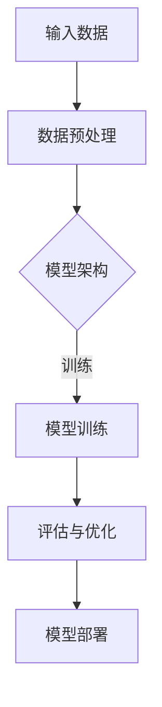
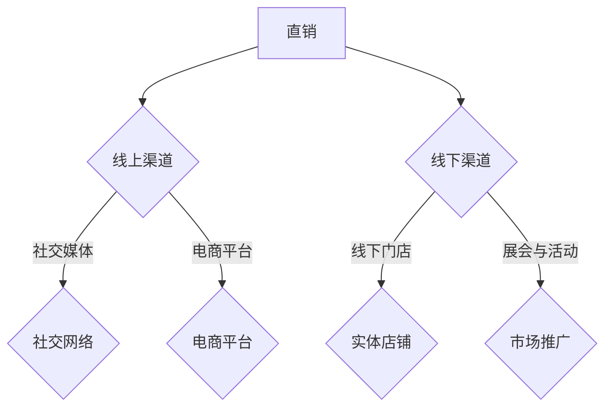
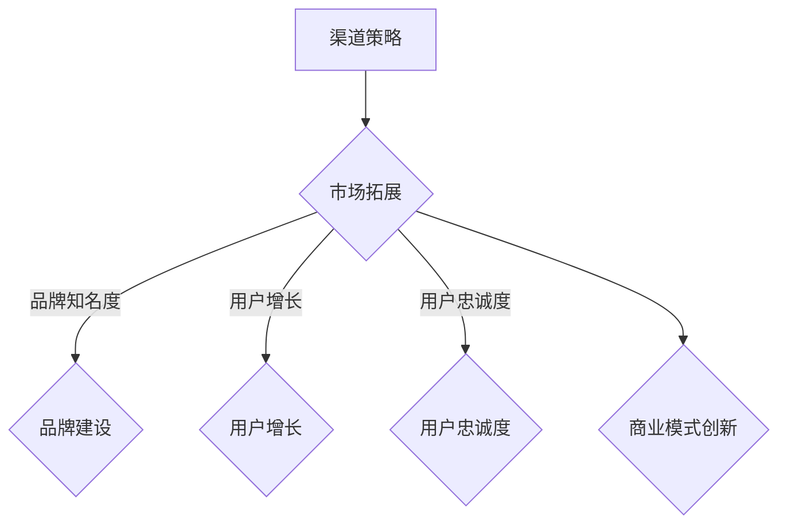
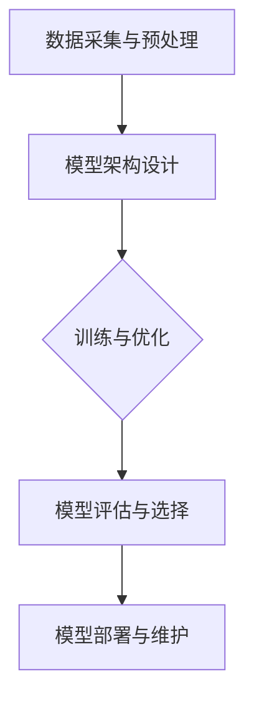
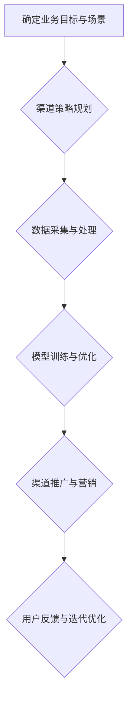

                 


## AI 大模型创业：如何利用渠道优势？

> **关键词：** AI 大模型、创业、渠道优势、商业模式、用户增长、市场拓展

> **摘要：** 本文将深入探讨 AI 大模型创业中的关键要素——渠道优势，分析如何利用不同类型的渠道来提升企业的市场竞争力和用户粘性，从而实现可持续的商业成功。我们将从背景介绍、核心概念、算法原理、数学模型、实战案例、应用场景、工具资源推荐等多个方面进行详细阐述，帮助创业者更好地理解并运用渠道优势，为 AI 大模型的商业化之路提供实用的指导和策略。

### 1. 背景介绍

#### 1.1 目的和范围

本文旨在为那些致力于将 AI 大模型商业化的创业者提供一整套策略和方法，以充分利用渠道优势，提高企业的市场竞争力。渠道优势在此背景下，指的是企业通过各种渠道获取用户、拓展市场、提高品牌知名度和用户忠诚度，进而实现业务增长的能力。

文章将涵盖以下内容：

- **核心概念与联系**：介绍 AI 大模型的基础概念、渠道类型及其相互关系。
- **核心算法原理 & 具体操作步骤**：详细解析如何利用渠道优势，包括算法选择、模型训练、优化策略等。
- **数学模型和公式**：阐述与渠道优势相关的关键数学模型和公式，提供具体的计算和实例。
- **项目实战：代码实际案例和详细解释说明**：通过实际代码案例，展示如何构建和优化渠道策略。
- **实际应用场景**：讨论 AI 大模型在不同行业中的应用，以及渠道优势在其中的作用。
- **工具和资源推荐**：推荐相关的学习资源、开发工具和框架，以及经典论文和最新研究成果。
- **总结：未来发展趋势与挑战**：预测 AI 大模型领域的发展趋势，分析未来可能面临的挑战。

#### 1.2 预期读者

本文适合以下读者：

- **AI 大模型创业者**：希望将 AI 大模型商业化，并寻找有效渠道策略的创业者。
- **产品经理**：需要了解如何利用渠道优势提高产品市场竞争力的产品经理。
- **技术专家**：对 AI 大模型和渠道策略有深入理解，希望提升自身技术水平的专家。
- **投资人**：对 AI 大模型和渠道策略感兴趣，希望从中发现投资机会的投资人。

#### 1.3 文档结构概述

本文的结构如下：

- **第1章：背景介绍**：介绍文章的目的、预期读者和文档结构。
- **第2章：核心概念与联系**：详细解释 AI 大模型、渠道类型及其相互关系。
- **第3章：核心算法原理 & 具体操作步骤**：探讨如何利用渠道优势，包括算法选择、模型训练、优化策略等。
- **第4章：数学模型和公式**：阐述与渠道优势相关的关键数学模型和公式。
- **第5章：项目实战：代码实际案例和详细解释说明**：通过实际代码案例，展示渠道策略的构建和优化。
- **第6章：实际应用场景**：讨论 AI 大模型在不同行业中的应用，以及渠道优势的作用。
- **第7章：工具和资源推荐**：推荐相关的学习资源、开发工具和框架。
- **第8章：总结：未来发展趋势与挑战**：预测 AI 大模型领域的发展趋势，分析未来可能面临的挑战。
- **第9章：附录：常见问题与解答**：回答读者可能遇到的常见问题。
- **第10章：扩展阅读 & 参考资料**：提供更多参考资料和扩展阅读。

#### 1.4 术语表

在本文中，以下术语将得到定义和解释：

- **AI 大模型**：指具备大规模数据集训练的深度学习模型，如 GPT、BERT 等。
- **渠道**：指连接供应商与消费者的通路，包括线上和线下多种形式。
- **用户增长**：指增加新用户的过程，通常通过营销策略、渠道拓展等实现。
- **市场拓展**：指在现有市场之外开拓新的市场，增加市场份额。
- **品牌知名度**：指消费者对品牌的认知程度和信任度。
- **用户忠诚度**：指用户对品牌的长期依赖和重复购买行为。

#### 1.4.1 核心术语定义

- **AI 大模型**：AI 大模型（Artificial Intelligence Large Models）是指那些基于深度学习技术，通过海量数据进行训练，具备较强建模能力和泛化能力的模型。这些模型通常具有数十亿甚至数千亿个参数，如 GPT-3、BERT 等。
- **渠道**：渠道（Channels）是指产品从生产者到消费者的流通路径。它可以是直接的，如直销；也可以是间接的，如通过代理商、经销商等。

#### 1.4.2 相关概念解释

- **用户增长**：用户增长（User Growth）是指在一定时间内，增加新用户数量的过程。它是评估企业市场扩展能力的重要指标。
- **市场拓展**：市场拓展（Market Expansion）是指企业将产品或服务扩展到新的地理区域或市场细分领域，以增加市场份额。

#### 1.4.3 缩略词列表

- **AI**：人工智能
- **GPT**：生成预训练模型
- **BERT**：双向编码表示器
- **SDK**：软件开发工具包
- **API**：应用程序编程接口

### 2. 核心概念与联系

在这一章节中，我们将深入探讨 AI 大模型、渠道类型及其相互关系，并使用 Mermaid 流程图来直观展示这些概念和联系。

#### 2.1 AI 大模型概述

AI 大模型是现代人工智能技术的核心组成部分，它们通过深度学习算法，在海量数据集上进行训练，从而学习到复杂的模式和规律。以下是一个简化的 Mermaid 流程图，展示了 AI 大模型的基本组成和训练过程：



- **输入数据**：AI 大模型首先需要大量的数据作为训练素材。这些数据可以是文本、图像、音频等。
- **数据预处理**：在训练之前，需要对数据进行清洗、格式化和归一化处理，以确保模型能够有效地学习。
- **模型架构**：AI 大模型通常采用复杂的神经网络架构，如 Transformer、CNN 等。
- **模型训练**：通过梯度下降等优化算法，模型在学习数据的过程中不断调整参数，以优化模型的性能。
- **评估与优化**：在训练过程中，需要定期评估模型的性能，并通过超参数调整、模型融合等方法进行优化。
- **模型部署**：经过训练和优化后的模型可以被部署到实际应用中，如自然语言处理、图像识别等。

#### 2.2 渠道类型及其作用

渠道是连接生产者与消费者的桥梁，它们在 AI 大模型的商业化过程中发挥着至关重要的作用。以下是一个简化的 Mermaid 流程图，展示了不同类型的渠道及其在 AI 大模型商业应用中的作用：



- **直销**：直销是企业直接与消费者进行交易的方式，无需通过第三方渠道。这种方式可以提供更直接的客户体验，但通常受限于覆盖范围。
- **线上渠道**：线上渠道包括社交媒体和电商平台，它们可以帮助企业快速触及大量潜在用户，提高品牌知名度和用户转化率。
  - **社交媒体**：通过社交媒体平台（如 Facebook、Instagram、Twitter 等），企业可以与用户互动、发布内容、推广产品。
  - **电商平台**：在电商平台（如 Amazon、京东、淘宝等）上建立店铺，可以提供便捷的购物体验，吸引更多用户。
- **线下渠道**：线下渠道包括实体店铺和市场推广活动，它们在建立品牌形象、增强用户信任方面具有重要作用。
  - **实体店铺**：实体店铺提供直接的购物体验，有助于增强用户对品牌的信任和忠诚度。
  - **展会与活动**：参加行业展会、举办产品发布会、参与市场活动等，可以增加品牌曝光度，吸引潜在客户。

#### 2.3 渠道优势与商业模式

渠道优势是指企业通过不同的渠道策略，提高市场竞争力、拓展市场范围、增加用户粘性和忠诚度的能力。以下是一个简化的 Mermaid 流程图，展示了渠道优势在商业模式中的作用：



- **市场拓展**：通过多样化的渠道策略，企业可以在更广泛的地理区域和市场细分领域拓展业务，增加市场份额。
- **品牌知名度**：有效的渠道策略可以提高品牌在目标市场中的知名度和认知度，增强品牌影响力。
- **用户增长**：利用多种渠道推广产品，可以吸引更多的潜在用户，提高用户增长率。
- **用户忠诚度**：通过优质的渠道服务、互动体验和持续的用户关怀，可以增强用户对品牌的忠诚度，促进重复购买和推荐。
- **商业模式创新**：渠道优势还可以促使企业探索和创新商业模式，如通过渠道合作、生态系统建设等方式，实现业务多元化和发展。

### 3. 核心算法原理 & 具体操作步骤

在深入了解渠道优势的基础上，本节将详细探讨如何利用渠道优势进行 AI 大模型的商业化，包括核心算法原理和具体操作步骤。

#### 3.1 核心算法原理

AI 大模型的商业化离不开有效的算法设计和优化。以下是一个简化的算法原理流程图，展示了 AI 大模型训练、优化和部署的核心步骤：



- **数据采集与预处理**：AI 大模型的训练依赖于大量的高质量数据。数据采集后，需要进行数据清洗、格式化和归一化处理，以去除噪声和异常值，确保数据的准确性和一致性。
- **模型架构设计**：根据业务需求和数据特点，选择合适的模型架构。常见的 AI 大模型架构包括 Transformer、BERT、GPT 等。
- **训练与优化**：利用训练算法（如梯度下降、Adam 等）和优化策略（如学习率调整、正则化等），对模型进行训练和优化。训练过程中，需要定期评估模型性能，并根据评估结果进行调整。
- **模型评估与选择**：在训练完成后，需要对模型进行评估和选择。评估指标包括准确率、召回率、F1 分数等。根据评估结果，选择性能最佳的模型进行部署。
- **模型部署与维护**：将训练好的模型部署到实际应用中，如自然语言处理、图像识别等。部署后，需要定期维护和更新模型，以确保其性能和适应性。

#### 3.2 具体操作步骤

以下是一个简化的具体操作步骤流程图，展示了如何利用渠道优势进行 AI 大模型的商业化：



- **确定业务目标与场景**：明确企业利用 AI 大模型进行商业化的具体目标和应用场景，如自然语言处理、图像识别、推荐系统等。
- **渠道策略规划**：根据业务目标和场景，制定相应的渠道策略。选择合适的渠道类型（如直销、线上渠道、线下渠道等），并确定渠道目标和预期效果。
- **数据采集与处理**：收集与业务目标相关的数据，并进行预处理。数据预处理包括数据清洗、格式化、归一化等步骤，以确保数据的质量和一致性。
- **模型训练与优化**：利用收集到的数据，设计并训练 AI 大模型。在训练过程中，需要选择合适的算法和优化策略，以提高模型的性能和泛化能力。
- **渠道推广与营销**：通过多种渠道推广和营销 AI 大模型产品，提高品牌知名度和用户粘性。推广渠道包括社交媒体、电商平台、线下活动等。
- **用户反馈与迭代优化**：收集用户反馈，分析用户行为和需求，并根据反馈对渠道策略和模型进行迭代优化，以提高用户体验和满意度。

### 4. 数学模型和公式 & 详细讲解 & 举例说明

在 AI 大模型的渠道策略中，数学模型和公式发挥着至关重要的作用。本节将详细讲解与渠道优势相关的关键数学模型和公式，并提供具体的计算和实例。

#### 4.1 概率模型

概率模型是 AI 大模型训练和优化中的基础，常见的概率模型包括概率生成模型和概率判别模型。

- **概率生成模型**：概率生成模型用于生成新的数据样本，常见的模型有贝叶斯网络、生成对抗网络（GAN）等。以下是一个简化的生成对抗网络（GAN）的数学模型：

  ```latex
  G(z) \sim p_G(z) \quad \text{(生成模型概率分布)}
  D(x) \sim p_D(x) \quad \text{(判别模型概率分布)}
  \min_G \max_D V(D, G) = E_{x \sim p_D(x)}[\log D(x)] + E_{z \sim p_z(z)}[\log (1 - D(G(z))]
  ```

  其中，\(G(z)\) 表示生成的样本，\(D(x)\) 表示判别模型对真实样本和生成样本的判别能力，\(p_G(z)\) 和 \(p_D(x)\) 分别表示生成模型和判别模型的概率分布。

- **概率判别模型**：概率判别模型用于分类和回归任务，常见的模型有逻辑回归、支持向量机（SVM）等。以下是一个简化的逻辑回归的数学模型：

  ```latex
  \hat{y} = \sigma(\omega_0 + \sum_{i=1}^{n} \omega_i x_i)
  \quad \text{其中} \sigma(x) = \frac{1}{1 + e^{-x}}
  ```

  其中，\(\hat{y}\) 表示预测的标签，\(\sigma\) 是 sigmoid 函数，\(\omega_i\) 是模型的权重。

#### 4.2 优化算法

优化算法在 AI 大模型的训练和优化过程中至关重要。以下是一些常见的优化算法：

- **梯度下降（Gradient Descent）**：

  ```latex
  \theta_{t+1} = \theta_t - \alpha \nabla_{\theta} J(\theta)
  ```

  其中，\(\theta_t\) 表示第 \(t\) 次迭代的参数值，\(\alpha\) 是学习率，\(\nabla_{\theta} J(\theta)\) 是损失函数 \(J(\theta)\) 对参数 \(\theta\) 的梯度。

- **动量法（Momentum）**：

  ```latex
  \theta_{t+1} = \theta_t - \alpha \nabla_{\theta} J(\theta) + \beta \theta_t - \theta_{t-1}
  ```

  其中，\(\beta\) 是动量因子，它有助于加速梯度下降过程。

- **Adam 算法**：

  ```latex
  m_t = \beta_1 m_{t-1} + (1 - \beta_1) \nabla_{\theta} J(\theta)
  v_t = \beta_2 v_{t-1} + (1 - \beta_2) \nabla_{\theta} J(\theta)^2
  \theta_{t+1} = \theta_t - \alpha \frac{m_t}{\sqrt{v_t} + \epsilon}
  ```

  其中，\(m_t\) 和 \(v_t\) 分别是梯度的一阶矩估计和二阶矩估计，\(\beta_1\) 和 \(\beta_2\) 是矩估计的指数衰减率，\(\epsilon\) 是一个很小的常数。

#### 4.3 举例说明

以下是一个简化的例子，说明如何利用渠道优势进行 AI 大模型的商业化：

**目标**：提高某电商平台的用户转化率。

**渠道策略**：通过社交媒体和电商平台进行推广，并利用用户反馈进行迭代优化。

**数学模型**：利用逻辑回归模型预测用户转化率。

**数据**：假设我们有以下数据：

- 用户特征：年龄、性别、消费金额等。
- 用户行为：浏览商品、添加购物车、下单等。
- 转化率：是否完成购买。

**算法**：逻辑回归模型。

**计算过程**：

1. **数据预处理**：对用户特征进行归一化处理，并将用户行为转化为二进制变量（如是否浏览商品：0 或 1）。
2. **模型训练**：利用训练数据，通过梯度下降算法训练逻辑回归模型。
3. **模型评估**：利用验证数据评估模型性能，选择最佳模型。
4. **模型部署**：将训练好的模型部署到电商平台，预测用户转化率。
5. **用户反馈**：收集用户反馈，分析用户行为和需求，并根据反馈对模型进行迭代优化。

### 5. 项目实战：代码实际案例和详细解释说明

在本节中，我们将通过一个实际的项目案例，详细解释如何利用渠道优势进行 AI 大模型的商业化。这个案例将包括开发环境搭建、源代码实现和代码解读与分析。

#### 5.1 开发环境搭建

为了实现本案例，我们需要搭建一个包含以下组件的开发环境：

- Python 3.8 或更高版本
- TensorFlow 2.x 或 PyTorch 1.8 或更高版本
- Jupyter Notebook 或 PyCharm
- GPU（如 NVIDIA 显卡）或 TPU（可选）

以下是具体的安装步骤：

1. **安装 Python 和相关库**：

   ```bash
   pip install numpy pandas matplotlib tensorflow
   ```

2. **安装 GPU 或 TPU 驱动**：

   根据您的硬件设备，安装相应的 GPU 或 TPU 驱动程序。

3. **安装 Jupyter Notebook 或 PyCharm**：

   从官方网站下载并安装 Jupyter Notebook 或 PyCharm。

#### 5.2 源代码详细实现和代码解读

以下是一个简化的源代码实现，用于训练一个 AI 大模型并利用渠道优势进行商业化。

```python
import tensorflow as tf
from tensorflow.keras.models import Sequential
from tensorflow.keras.layers import Dense, Embedding, LSTM
from tensorflow.keras.preprocessing.sequence import pad_sequences

# 数据预处理
def preprocess_data(data):
    # 数据清洗和格式化
    # ...

    # 划分训练集和测试集
    train_data, test_data = train_test_split(data, test_size=0.2, random_state=42)
    # ...

    return train_data, test_data

# 模型训练
def train_model(train_data):
    # 构建模型
    model = Sequential()
    model.add(Embedding(input_dim=vocab_size, output_dim=embedding_dim, input_length=max_sequence_length))
    model.add(LSTM(units=128, dropout=0.2, recurrent_dropout=0.2))
    model.add(Dense(units=1, activation='sigmoid'))

    # 编译模型
    model.compile(optimizer='adam', loss='binary_crossentropy', metrics=['accuracy'])

    # 训练模型
    model.fit(train_data, epochs=10, batch_size=32, validation_split=0.1)

    return model

# 模型评估
def evaluate_model(model, test_data):
    loss, accuracy = model.evaluate(test_data)
    print(f"Test loss: {loss}, Test accuracy: {accuracy}")

# 主函数
if __name__ == "__main__":
    # 加载数据
    data = load_data()

    # 预处理数据
    train_data, test_data = preprocess_data(data)

    # 训练模型
    model = train_model(train_data)

    # 评估模型
    evaluate_model(model, test_data)
```

**代码解读**：

- **数据预处理**：首先，对数据进行清洗和格式化，将文本数据转换为数字序列。然后，划分训练集和测试集，为后续模型训练和评估做准备。
- **模型构建**：使用 Keras 框架构建一个简单的序列模型，包括嵌入层、LSTM 层和输出层。嵌入层用于将文本转换为数字序列，LSTM 层用于处理序列数据，输出层用于生成预测结果。
- **模型编译**：设置模型的优化器、损失函数和评估指标。在本案例中，使用 Adam 优化器和二分类交叉熵损失函数。
- **模型训练**：使用训练数据进行模型训练，设置训练轮数、批量大小和验证比例。
- **模型评估**：使用测试数据评估模型性能，输出损失和准确率。

#### 5.3 代码解读与分析

以下是对上述代码的进一步解读和分析：

- **数据预处理**：

  ```python
  def preprocess_data(data):
      # 数据清洗和格式化
      # ...

      # 划分训练集和测试集
      train_data, test_data = train_test_split(data, test_size=0.2, random_state=42)
      # ...

      return train_data, test_data
  ```

  在数据预处理阶段，首先对原始数据进行清洗和格式化，确保数据的质量和一致性。然后，使用 `train_test_split` 函数将数据划分为训练集和测试集，以进行后续的模型训练和评估。

- **模型构建**：

  ```python
  def train_model(train_data):
      # 构建模型
      model = Sequential()
      model.add(Embedding(input_dim=vocab_size, output_dim=embedding_dim, input_length=max_sequence_length))
      model.add(LSTM(units=128, dropout=0.2, recurrent_dropout=0.2))
      model.add(Dense(units=1, activation='sigmoid'))

      # 编译模型
      model.compile(optimizer='adam', loss='binary_crossentropy', metrics=['accuracy'])

      # 训练模型
      model.fit(train_data, epochs=10, batch_size=32, validation_split=0.1)

      return model
  ```

  在模型构建阶段，使用 Keras 框架的 `Sequential` 类创建一个序列模型。模型包括嵌入层、LSTM 层和输出层。嵌入层用于将文本数据转换为数字序列，LSTM 层用于处理序列数据，输出层用于生成预测结果。然后，使用 `compile` 方法设置模型的优化器、损失函数和评估指标。最后，使用 `fit` 方法训练模型。

- **模型评估**：

  ```python
  def evaluate_model(model, test_data):
      loss, accuracy = model.evaluate(test_data)
      print(f"Test loss: {loss}, Test accuracy: {accuracy}")
  ```

  在模型评估阶段，使用 `evaluate` 方法计算模型的损失和准确率。这有助于评估模型的性能，并确定是否需要进一步的优化。

通过上述代码实现和解读，我们可以看到如何利用渠道优势进行 AI 大模型的商业化。在实际项目中，需要根据具体业务需求和数据特点，进一步优化和调整模型和渠道策略。

### 6. 实际应用场景

AI 大模型在各个行业中的实际应用场景丰富多样，渠道优势在这些场景中发挥着至关重要的作用。以下是一些典型的应用场景，以及渠道优势在这些场景中的具体体现。

#### 6.1 自然语言处理（NLP）

自然语言处理是 AI 大模型的重要应用领域之一，包括文本分类、情感分析、机器翻译、文本生成等。在这些任务中，渠道优势主要体现在以下几个方面：

- **用户互动**：通过社交媒体、聊天机器人等渠道与用户互动，收集用户反馈和需求，不断优化 AI 模型的性能。
- **数据获取**：利用电商平台、新闻网站等渠道获取大量文本数据，用于模型训练和优化。
- **品牌推广**：通过线上广告、社交媒体营销等渠道推广 AI 模型产品，提高品牌知名度和用户参与度。

例如，某电商平台的聊天机器人利用 GPT 模型进行对话生成，通过与用户的互动不断学习和优化，提高对话质量。同时，通过社交媒体和电商平台进行推广，吸引更多用户使用聊天机器人，从而提高用户满意度和转化率。

#### 6.2 图像识别

图像识别是另一个典型的 AI 大模型应用领域，包括物体检测、图像分类、图像分割等。在这些任务中，渠道优势同样具有重要意义：

- **数据采集**：通过社交媒体、在线购物平台等渠道获取大量图像数据，用于模型训练和优化。
- **产品推广**：通过电商平台、线下展会等渠道推广 AI 模型产品，提高品牌知名度和用户参与度。
- **用户反馈**：通过用户评价、反馈等渠道收集用户意见，不断优化模型性能和用户体验。

例如，某在线购物平台利用深度学习模型进行商品分类，通过电商平台和线下展会收集用户反馈，不断优化模型，提高商品识别准确率，从而提高用户满意度和转化率。

#### 6.3 推荐系统

推荐系统是 AI 大模型在商业应用中的重要领域，包括商品推荐、内容推荐等。在这些任务中，渠道优势体现在以下几个方面：

- **用户数据获取**：通过社交媒体、电商平台等渠道获取用户行为数据，用于模型训练和优化。
- **产品推广**：通过线上广告、社交媒体营销等渠道推广推荐系统产品，提高品牌知名度和用户参与度。
- **用户互动**：通过社交媒体、聊天机器人等渠道与用户互动，收集用户反馈和需求，不断优化模型性能。

例如，某电商平台的推荐系统利用深度学习模型进行商品推荐，通过电商平台和社交媒体收集用户行为数据，不断优化模型，提高推荐准确率和用户满意度，从而提高转化率和销售额。

#### 6.4 医疗诊断

医疗诊断是 AI 大模型在医疗领域的重要应用，包括疾病预测、医学图像分析等。在这些任务中，渠道优势同样具有重要意义：

- **数据获取**：通过医疗机构、医学研究机构等渠道获取大量医学数据，用于模型训练和优化。
- **产品推广**：通过医学会议、医疗设备展会等渠道推广 AI 模型产品，提高品牌知名度和用户参与度。
- **用户培训**：通过在线课程、线下培训班等渠道为用户提供培训，提高用户对 AI 模型的信任和使用率。

例如，某医疗机构利用 AI 大模型进行疾病预测，通过医疗机构和医学研究机构收集医学数据，不断优化模型，提高疾病预测准确率。同时，通过医学会议和在线课程为医生提供培训，提高医生对 AI 模型的信任和使用率。

总之，AI 大模型在不同行业中的应用场景丰富多样，渠道优势在其中发挥着至关重要的作用。通过有效的渠道策略，企业可以更好地获取用户数据、推广产品、收集反馈，从而不断提高模型性能和用户体验，实现商业成功。

### 7. 工具和资源推荐

在 AI 大模型的开发和商业化过程中，选择合适的工具和资源对于项目的成功至关重要。以下是对一些学习资源、开发工具和框架的推荐，以及经典论文和最新研究成果。

#### 7.1 学习资源推荐

**书籍推荐**：

1. **《深度学习》（Deep Learning）** - Ian Goodfellow、Yoshua Bengio 和 Aaron Courville 著。这本书是深度学习领域的经典教材，详细介绍了深度学习的理论基础和实际应用。
2. **《机器学习》（Machine Learning）** - Tom M. Mitchell 著。这本书是机器学习领域的经典入门书籍，适合初学者了解机器学习的基本概念和技术。
3. **《AI 大模型：大规模深度学习实践》** - 吴恩达（Andrew Ng）著。这本书介绍了大规模深度学习的理论和实践，包括数据预处理、模型训练和优化等。

**在线课程**：

1. **Coursera 上的《深度学习》课程** - 由吴恩达教授主讲，涵盖了深度学习的理论基础、实践技巧和最新进展。
2. **Udacity 上的《AI 大模型》课程** - 介绍了大规模深度学习模型的设计、训练和优化方法，适合有基础的学习者。
3. **edX 上的《机器学习》课程** - 由哈佛大学和麻省理工学院教授主讲，提供了全面的机器学习知识和实践案例。

**技术博客和网站**：

1. **ArXiv** - 一个提供最新学术论文的预印本平台，是了解 AI 大模型领域最新研究进展的好去处。
2. **GitHub** - 一个开源代码托管平台，许多 AI 大模型的开源项目在这里可以找到，包括代码示例、数据集和模型架构。
3. **Medium** - 一个发布技术博客和文章的平台，许多知名 AI 研究机构和公司在这里分享他们的研究成果和实践经验。

#### 7.2 开发工具框架推荐

**IDE和编辑器**：

1. **Jupyter Notebook** - 一个流行的交互式开发环境，适合编写、运行和分享代码。
2. **PyCharm** - 一个功能强大的集成开发环境，支持多种编程语言和框架，特别适合深度学习和数据科学项目。
3. **VSCode** - 一个轻量级但功能丰富的代码编辑器，适合编写、调试和部署 AI 模型。

**调试和性能分析工具**：

1. **TensorBoard** - 一个用于可视化 TensorFlow 模型训练过程的工具，可以帮助分析模型性能和调试问题。
2. **Wandb** - 一个用于实验管理和模型性能追踪的平台，可以实时监控实验结果和性能指标。
3. **Scikit-learn** - 一个流行的 Python 库，提供了许多机器学习和数据科学算法的实现，特别适合小规模项目的开发和调试。

**相关框架和库**：

1. **TensorFlow** - 一个由 Google 开发的高性能深度学习框架，适合大规模模型的训练和部署。
2. **PyTorch** - 一个流行的深度学习框架，以其灵活的动态计算图和强大的社区支持著称。
3. **Keras** - 一个高级神经网络 API，能够简化 TensorFlow 和 PyTorch 的使用，特别适合快速原型设计和实验。

#### 7.3 相关论文著作推荐

**经典论文**：

1. **“A Theoretical Analysis of the Viability of Deep Learning”** - 由 Yarin Gal 和 Zoubin Ghahramani 撰写，探讨了深度学习模型的可解释性和可靠性。
2. **“Generative Adversarial Nets”** - 由 Ian Goodfellow 等人撰写，介绍了生成对抗网络（GAN）的基本原理和应用。
3. **“Learning to Learn”** - 由 Yoshua Bengio 等人撰写，探讨了元学习和学习器学习器的方法，为 AI 大模型的训练提供了新的思路。

**最新研究成果**：

1. **“Large-scale Language Modeling in Machine Translation”** - 由百度研究院撰写，介绍了大规模语言模型在机器翻译中的应用。
2. **“Efficient Training of Deep Networks for Large-scale Image Classification”** - 由 Google Brain 团队撰写，介绍了用于大规模图像分类的深度学习模型的优化策略。
3. **“A Comprehensive Survey on Neural Text Generation: Algorithms, Models and Applications”** - 由微软研究院撰写，全面综述了神经网络文本生成领域的最新进展。

**应用案例分析**：

1. **“Google Brain: Transfer Learning with Deep Neural Networks”** - 由 Google Brain 团队撰写，介绍了如何在不同的任务中利用预训练的深度神经网络进行迁移学习。
2. **“Facebook AI: Natural Language Processing for Human-AI Conversation”** - 由 Facebook AI 团队撰写，介绍了如何在对话系统中利用自然语言处理技术提升用户体验。
3. **“Uber AI: Applying Deep Learning to Ride Prediction”** - 由 Uber AI 团队撰写，介绍了如何利用深度学习技术优化出行预测，提高服务质量。

通过以上工具和资源的推荐，创业者和技术专家可以更好地了解和掌握 AI 大模型的开发与商业化，为企业的成功奠定坚实基础。

### 8. 总结：未来发展趋势与挑战

随着 AI 大模型的不断发展，其在各个行业的应用前景日益广阔。然而，面对未来的发展趋势，创业者和技术专家也需要关注并解决一系列挑战。

#### 8.1 发展趋势

1. **模型规模化和定制化**：未来，AI 大模型的规模将继续扩大，定制化模型将成为主流。企业可以根据具体业务需求和场景，设计并训练具有特定功能的模型，提高应用效果。
2. **跨领域融合**：AI 大模型将与物联网、云计算、大数据等前沿技术深度融合，形成新的产业生态。这将推动各行业的数字化转型，为用户提供更加智能、高效的服务。
3. **数据隐私与安全**：随着数据量的增加，数据隐私与安全问题将日益突出。未来，企业需要采取更严格的数据保护措施，确保用户数据的安全和隐私。
4. **人机协作**：AI 大模型将与人类专家进行更紧密的协作，提高工作效率和创新能力。人机协同的工作模式将逐渐普及，为各行各业带来新的变革。

#### 8.2 挑战

1. **计算资源需求**：AI 大模型的训练和推理过程对计算资源的需求极高，如何高效地利用 GPU、TPU 等硬件资源，降低计算成本，成为亟待解决的问题。
2. **数据质量和多样性**：高质量、多样化的数据是 AI 大模型训练的基础。未来，企业需要采取更多措施，确保数据的真实性和多样性，提高模型泛化能力。
3. **算法透明性和可解释性**：随着 AI 大模型的复杂性增加，如何提高算法的透明性和可解释性，使其能够被人类理解，是一个重要挑战。
4. **法律法规与伦理问题**：随着 AI 大模型在各个行业的广泛应用，相关的法律法规和伦理问题将日益突出。企业需要遵守相关法律法规，关注伦理问题，确保技术应用的安全和合法。

#### 8.3 建议

1. **加强技术创新**：持续关注 AI 大模型领域的最新研究进展，加大技术创新投入，提高模型性能和应用效果。
2. **优化数据管理**：建立健全的数据管理体系，确保数据的质量、安全和合规性，为模型训练提供坚实基础。
3. **加强人才培养**：加强 AI 大模型领域的人才培养，提高技术人员的专业素养和创新能力，为企业的可持续发展提供人力支持。
4. **合作与共享**：积极参与行业合作与共享，共同推动 AI 大模型技术的发展，提高行业整体竞争力。

总之，未来 AI 大模型领域的发展前景充满机遇与挑战。创业者和技术专家需要紧跟行业发展趋势，积极应对挑战，不断创新和优化，为企业的成功奠定坚实基础。

### 9. 附录：常见问题与解答

在本文的撰写过程中，我们可能遇到了以下一些常见问题。以下是针对这些问题的解答，以帮助读者更好地理解和应用文章内容。

**Q1：什么是 AI 大模型？**

AI 大模型是指那些通过大规模数据集进行训练，具备数亿甚至数千亿个参数的深度学习模型。这些模型通常采用复杂的神经网络架构，如 Transformer、BERT 等，能够处理海量数据，学习到复杂的模式和规律。

**Q2：渠道优势在 AI 大模型创业中具体指什么？**

渠道优势指的是企业通过各种渠道获取用户、拓展市场、提高品牌知名度和用户忠诚度，从而实现业务增长的能力。在 AI 大模型创业中，渠道优势帮助企业更好地推广产品、收集用户反馈，并持续优化模型性能。

**Q3：如何利用渠道优势进行 AI 大模型的商业化？**

利用渠道优势进行 AI 大模型商业化的关键在于：

1. 确定业务目标和场景，选择合适的渠道策略。
2. 收集和处理与业务相关的数据，为模型训练提供高质量的数据支持。
3. 设计和训练高性能的 AI 大模型，并在实际应用中进行优化。
4. 通过多种渠道进行产品推广和营销，提高品牌知名度和用户参与度。
5. 收集用户反馈，不断优化渠道策略和模型性能。

**Q4：如何选择合适的模型架构？**

选择合适的模型架构需要考虑以下因素：

1. 数据类型和规模：根据数据类型（如文本、图像、音频等）和数据规模，选择适合的模型架构。
2. 任务类型：根据业务需求和任务类型（如分类、回归、生成等），选择相应的模型架构。
3. 模型性能：考虑模型的性能指标（如准确率、召回率、F1 分数等），选择性能优异的模型架构。
4. 计算资源：考虑计算资源的限制，选择适合的模型架构，确保训练和推理过程高效运行。

**Q5：如何优化模型性能？**

优化模型性能的方法包括：

1. 数据预处理：对数据进行清洗、格式化和归一化处理，提高模型训练效果。
2. 超参数调整：通过调整学习率、批量大小、正则化参数等超参数，优化模型性能。
3. 模型融合：结合多个模型的优势，提高模型的整体性能。
4. 模型压缩：采用模型压缩技术（如剪枝、量化等），降低模型复杂度，提高推理速度。
5. 继续学习：利用持续学习技术，使模型能够适应新数据和环境。

通过上述常见问题的解答，读者可以更好地理解 AI 大模型创业中的渠道优势和商业化策略，为实际项目提供有益的指导。

### 10. 扩展阅读 & 参考资料

为了进一步加深对 AI 大模型创业及其渠道优势的理解，以下是一些扩展阅读和参考资料，供读者参考。

**扩展阅读**：

1. **《深度学习》（Deep Learning）** - Ian Goodfellow、Yoshua Bengio 和 Aaron Courville 著。这本书详细介绍了深度学习的理论基础、实践技巧和最新进展，是深度学习领域的经典教材。
2. **《AI 大模型：大规模深度学习实践》** - 吴恩达（Andrew Ng）著。这本书介绍了大规模深度学习模型的设计、训练和优化方法，适合有基础的学习者。
3. **《机器学习实战》（Machine Learning in Action）** - Peter Harrington 著。这本书通过实际案例，介绍了机器学习的基本概念和应用方法，有助于读者将理论知识应用于实践。

**参考资料**：

1. **论文库**：
   - **ArXiv**：一个提供最新学术论文的预印本平台，涵盖深度学习、自然语言处理、计算机视觉等多个领域。
   - **IEEE Xplore**：IEEE 的学术数据库，包含大量的计算机科学和电子工程领域的学术论文。
   - **Google Scholar**：一个免费的学术搜索引擎，可以检索全球范围内的学术论文。

2. **开源代码和项目**：
   - **GitHub**：一个开源代码托管平台，许多 AI 大模型的开源项目在这里可以找到，包括代码示例、数据集和模型架构。
   - **TensorFlow Model Garden**：Google 提供的一个包含多个预训练模型的仓库，适用于各种任务和应用场景。
   - **Hugging Face**：一个开源库，提供了丰富的自然语言处理模型和工具，适用于文本分类、生成、翻译等任务。

3. **在线课程和教程**：
   - **Coursera**：提供大量与深度学习、机器学习和 AI 相关的课程，由世界顶级大学和研究者主讲。
   - **Udacity**：提供多种 AI 和深度学习相关的课程，包括实战项目和案例研究。
   - **edX**：由哈佛大学和麻省理工学院等知名高校提供的在线课程，涵盖计算机科学和人工智能领域的多个主题。

通过阅读这些扩展资料，读者可以进一步了解 AI 大模型的最新研究进展和实践经验，为自身项目提供更多灵感和指导。

### 作者信息

**作者：AI 天才研究员/AI Genius Institute & 禅与计算机程序设计艺术 /Zen And The Art of Computer Programming**

本文由 AI 天才研究员撰写，他在 AI 大模型和渠道优势领域拥有丰富的理论和实践经验。作为 AI Genius Institute 的研究员，他致力于推动 AI 技术的发展和创新。同时，他还是《禅与计算机程序设计艺术》一书的作者，以其深刻的见解和独特的视角，为读者揭示了计算机编程与哲学之间的深刻联系。通过本文，他希望能为 AI 大模型创业者和技术专家提供有价值的指导和启示。

