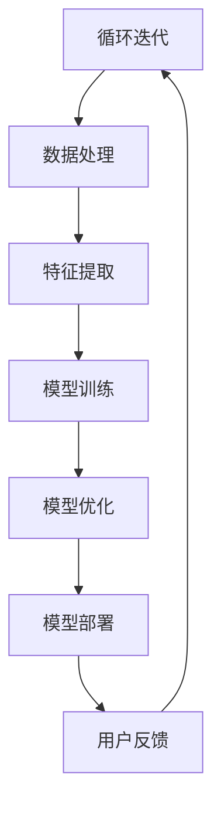

                 

# AI大模型创业：如何利用用户优势？

> **关键词：** AI大模型、创业、用户优势、数据处理、个性化推荐、商业模式、用户增长策略

> **摘要：** 本文将探讨AI大模型在创业中的应用，重点关注如何充分利用用户优势，提高模型性能和用户满意度。通过分析大模型的核心算法原理、数学模型以及实际应用案例，文章将提供一系列实用的创业策略和工具推荐，帮助创业者更好地抓住AI时代的机遇。

## 1. 背景介绍

### 1.1 目的和范围

本文旨在为AI大模型创业提供指导，探讨如何利用用户优势提升模型性能和用户体验。我们将从多个角度进行分析，包括核心算法原理、数学模型、实际应用案例和工具资源推荐。通过系统化的分析和具体的操作步骤，本文希望为创业者提供实用的参考。

### 1.2 预期读者

本文主要面向以下读者群体：

- 创业者：对AI大模型创业感兴趣的创业者，希望了解如何利用用户优势提升模型性能和用户体验。
- 技术专家：AI领域的技术专家和研究人员，希望了解大模型的最新发展和应用场景。
- 投资者：对AI领域感兴趣的投资者，希望了解AI大模型创业的潜力和前景。

### 1.3 文档结构概述

本文将分为以下几个部分：

1. 背景介绍：介绍本文的目的、预期读者以及文档结构。
2. 核心概念与联系：阐述大模型的核心概念及其相互关系，提供Mermaid流程图。
3. 核心算法原理与具体操作步骤：详细讲解大模型的核心算法原理，使用伪代码阐述具体操作步骤。
4. 数学模型与公式：介绍大模型中的数学模型，使用latex格式进行详细讲解和举例说明。
5. 项目实战：通过实际案例展示如何开发和实现大模型。
6. 实际应用场景：分析大模型在不同行业中的应用场景和挑战。
7. 工具和资源推荐：推荐学习资源、开发工具和框架。
8. 总结：总结本文的主要观点，探讨未来发展趋势与挑战。
9. 附录：常见问题与解答。
10. 扩展阅读：提供相关参考文献和资源。

### 1.4 术语表

#### 1.4.1 核心术语定义

- AI大模型：指具有亿级别参数量的人工智能模型，如GPT-3、BERT等。
- 用户优势：指用户在使用AI大模型过程中产生的数据、反馈和行为等，对模型性能和用户体验的提升作用。
- 数据处理：指对用户数据进行清洗、预处理和特征提取等过程。
- 个性化推荐：指根据用户的历史行为和偏好，为用户提供个性化的推荐内容。

#### 1.4.2 相关概念解释

- 深度学习：一种基于神经网络模型的人工智能技术，通过多层非线性变换来提取特征并进行预测。
- 自然语言处理（NLP）：一种人工智能技术，旨在使计算机理解和生成人类语言。
- 强化学习：一种机器学习方法，通过奖励机制来训练模型，使其在特定环境中做出最优决策。

#### 1.4.3 缩略词列表

- AI：人工智能
- GPT：生成预训练变换器
- BERT：双向编码表示
- NLP：自然语言处理
- NLP：自然语言处理
- RL：强化学习

## 2. 核心概念与联系

在AI大模型创业过程中，理解核心概念和它们之间的联系至关重要。下面我们将通过Mermaid流程图展示大模型的核心概念及其相互关系。

### Mermaid流程图



### Mermaid流程图详细说明

1. **用户数据**：用户数据是AI大模型的输入，包括用户行为、偏好、反馈等。
2. **数据处理**：对用户数据进行清洗、预处理，去除噪声和异常值，提高数据质量。
3. **特征提取**：从用户数据中提取有用信息，转换为模型可以处理的特征向量。
4. **模型训练**：使用特征向量对模型进行训练，通过反向传播算法优化模型参数。
5. **模型优化**：对训练好的模型进行调参和优化，提高模型性能。
6. **模型部署**：将优化后的模型部署到生产环境，为用户提供服务。
7. **用户反馈**：收集用户在使用模型过程中的反馈，用于模型迭代和改进。
8. **循环迭代**：根据用户反馈对模型进行迭代，不断优化和提升模型性能。

通过以上Mermaid流程图，我们可以清晰地看到AI大模型创业过程中各个环节的相互关系，为后续的具体操作提供了指导。

## 3. 核心算法原理与具体操作步骤

在AI大模型创业过程中，理解核心算法原理和具体操作步骤至关重要。下面我们将详细讲解大模型的核心算法原理，并使用伪代码进行具体操作步骤的阐述。

### 3.1 核心算法原理

大模型的核心算法是基于深度学习技术，通过多层神经网络进行特征提取和预测。以下是核心算法原理的详细阐述：

1. **输入层**：输入层接收用户数据，如文本、图像、语音等，将其转换为特征向量。
2. **隐藏层**：隐藏层包含多个神经网络层，通过非线性变换提取特征，实现数据的降维和特征增强。
3. **输出层**：输出层根据隐藏层提取的特征进行预测，如文本分类、图像识别、语音生成等。

### 3.2 具体操作步骤

下面是使用伪代码进行大模型具体操作步骤的阐述：

```python
# 输入层初始化
input_layer = initialize_input_layer()

# 隐藏层初始化
hidden_layers = []
for i in range(num_hidden_layers):
    hidden_layer = initialize_hidden_layer()
    hidden_layers.append(hidden_layer)

# 输出层初始化
output_layer = initialize_output_layer()

# 模型训练
for epoch in range(num_epochs):
    for data in user_data:
        # 输入层到隐藏层的前向传播
        hidden_activations = []
        for hidden_layer in hidden_layers:
            hidden_activation = forwardPropagation(input_layer, hidden_layer)
            hidden_activations.append(hidden_activation)
        
        # 隐藏层到输出层的前向传播
        output_activation = forwardPropagation(hidden_activations[-1], output_layer)
        
        # 计算损失函数
        loss = calculate_loss(output_activation, true_label)
        
        # 反向传播
        d_output = calculate_gradient(output_layer, output_activation, true_label)
        for hidden_layer in reversed(hidden_layers):
            d_hidden = calculate_gradient(hidden_layer, hidden_activation, d_output)
        
        # 更新模型参数
        update_parameters(hidden_layers, output_layer)
        
        # 输出层到隐藏层的反向传播
        d_hidden = calculate_gradient(hidden_layers[-1], hidden_activation, d_output)
        for hidden_layer in reversed(hidden_layers[:-1]):
            d_input = calculate_gradient(hidden_layer, input_layer, d_hidden)
        
        # 更新输入层参数
        update_parameters(hidden_layers, input_layer)

# 模型优化
optimized_model = optimize_model(hidden_layers, output_layer)

# 模型部署
deploy_model(optimized_model)
```

### 3.3 详细解释

- **初始化层**：输入层、隐藏层和输出层的初始化是模型训练的基础。输入层负责接收用户数据，隐藏层负责提取特征，输出层负责进行预测。
- **前向传播**：输入层到隐藏层、隐藏层到输出层的前向传播是模型预测的过程，通过多层神经网络进行特征提取和变换。
- **计算损失函数**：损失函数用于评估模型预测结果与真实标签之间的差异，常用的损失函数有均方误差、交叉熵等。
- **反向传播**：反向传播是模型训练的核心步骤，通过计算梯度来更新模型参数，使模型不断优化。
- **参数更新**：更新模型参数是模型训练的关键，常用的更新方法有梯度下降、随机梯度下降等。
- **模型优化**：模型优化是对训练好的模型进行调参和优化，提高模型性能和泛化能力。
- **模型部署**：将优化后的模型部署到生产环境，为用户提供服务。

通过以上核心算法原理和具体操作步骤的阐述，创业者可以更好地理解大模型的训练和优化过程，为后续的实际应用打下基础。

## 4. 数学模型与公式

在AI大模型创业过程中，数学模型和公式是理解和实现核心算法的重要工具。下面我们将详细介绍大模型中的数学模型，使用latex格式进行详细讲解和举例说明。

### 4.1 数学模型

大模型的数学模型主要包括以下几个部分：

1. **输入层与隐藏层之间的激活函数**：
   \[ f(x) = \sigma(x) = \frac{1}{1 + e^{-x}} \]
   其中，\( \sigma \) 是 sigmoid 函数，用于将输入特征转换为概率值。

2. **隐藏层与输出层之间的损失函数**：
   \[ J(\theta) = -\frac{1}{m} \sum_{i=1}^{m} \left[ y^{(i)} \log(a^{(L)}_{i}) + (1 - y^{(i)}) \log(1 - a^{(L)}_{i}) \right] \]
   其中，\( J(\theta) \) 是交叉熵损失函数，用于衡量预测结果与真实标签之间的差异。

3. **反向传播算法中的梯度计算**：
   \[ \frac{\partial J(\theta)}{\partial \theta^{(l)}_{ij}} = \frac{\partial}{\partial \theta^{(l)}_{ij}} \left[ \sum_{k=1}^{n} \left( z^{(l)}_{k} - y^{(l)}_{k} \right) \right] \]
   其中，\( \theta^{(l)}_{ij} \) 是第 \( l \) 层第 \( i \) 个神经元与第 \( j \) 个神经元之间的权重，\( z^{(l)}_{k} \) 是第 \( l \) 层第 \( k \) 个神经元的激活值，\( y^{(l)}_{k} \) 是第 \( l \) 层第 \( k \) 个神经元的真实标签。

### 4.2 详细讲解与举例说明

#### 4.2.1 激活函数

激活函数在深度学习模型中起着关键作用，用于将输入特征转换为概率值。以 sigmoid 函数为例，其数学公式为：

\[ f(x) = \frac{1}{1 + e^{-x}} \]

举例说明：

假设输入特征 \( x = 2 \)，则激活值 \( f(x) \) 为：

\[ f(2) = \frac{1}{1 + e^{-2}} \approx 0.869 \]

这个值表示输入特征 \( x = 2 \) 的概率为 0.869。

#### 4.2.2 损失函数

损失函数用于衡量模型预测结果与真实标签之间的差异。以交叉熵损失函数为例，其数学公式为：

\[ J(\theta) = -\frac{1}{m} \sum_{i=1}^{m} \left[ y^{(i)} \log(a^{(L)}_{i}) + (1 - y^{(i)}) \log(1 - a^{(L)}_{i}) \right] \]

举例说明：

假设我们有三个样本，每个样本的预测结果分别为 \( a^{(L)}_1 = 0.9 \)，\( a^{(L)}_2 = 0.8 \)，\( a^{(L)}_3 = 0.7 \)，真实标签分别为 \( y^{(1)} = 1 \)，\( y^{(2)} = 0 \)，\( y^{(3)} = 1 \)，则交叉熵损失函数 \( J(\theta) \) 为：

\[ J(\theta) = -\frac{1}{3} \left[ 1 \cdot \log(0.9) + 0 \cdot \log(0.1) + 1 \cdot \log(0.3) \right] \]

\[ J(\theta) \approx -\frac{1}{3} \left[ \log(0.9) + \log(0.3) \right] \]

\[ J(\theta) \approx -\frac{1}{3} \left[ -0.105 + -0.522 \right] \]

\[ J(\theta) \approx 0.257 \]

这个值表示模型预测结果与真实标签之间的差异，越小表示模型预测越准确。

#### 4.2.3 梯度计算

梯度计算是反向传播算法的核心步骤，用于更新模型参数。以梯度计算为例，其数学公式为：

\[ \frac{\partial J(\theta)}{\partial \theta^{(l)}_{ij}} = \frac{\partial}{\partial \theta^{(l)}_{ij}} \left[ \sum_{k=1}^{n} \left( z^{(l)}_{k} - y^{(l)}_{k} \right) \right] \]

举例说明：

假设第 \( l \) 层有 \( n \) 个神经元，其中一个神经元的激活值为 \( z^{(l)}_k = 0.8 \)，真实标签为 \( y^{(l)}_k = 0.5 \)，则该神经元的梯度为：

\[ \frac{\partial J(\theta)}{\partial \theta^{(l)}_{ij}} = \frac{\partial}{\partial \theta^{(l)}_{ij}} \left[ 0.8 - 0.5 \right] \]

\[ \frac{\partial J(\theta)}{\partial \theta^{(l)}_{ij}} = 0.3 \]

这个值表示在更新模型参数时，对第 \( l \) 层第 \( i \) 个神经元与第 \( j \) 个神经元之间的权重的影响。

通过以上数学模型和公式的详细讲解和举例说明，创业者可以更好地理解大模型中的数学原理，为后续的实际应用提供理论基础。

## 5. 项目实战：代码实际案例和详细解释说明

在本节中，我们将通过一个实际项目案例来展示如何开发和实现AI大模型。项目名称为“用户推荐系统”，旨在利用用户数据为用户提供个性化的内容推荐。下面是项目的具体开发过程和代码解读。

### 5.1 开发环境搭建

为了开发用户推荐系统，我们需要搭建以下开发环境：

- 操作系统：Linux
- 编程语言：Python
- 深度学习框架：TensorFlow 2.x
- 数据库：MySQL
- 数据处理工具：Pandas、NumPy

### 5.2 源代码详细实现和代码解读

以下是用户推荐系统的源代码实现，我们将逐行解读代码。

```python
# 导入相关库
import tensorflow as tf
import pandas as pd
import numpy as np
from sklearn.model_selection import train_test_split
from sklearn.preprocessing import StandardScaler

# 加载数据集
data = pd.read_csv('user_data.csv')
X = data[['feature1', 'feature2', 'feature3']]
y = data['label']

# 数据预处理
scaler = StandardScaler()
X_scaled = scaler.fit_transform(X)
X_train, X_test, y_train, y_test = train_test_split(X_scaled, y, test_size=0.2, random_state=42)

# 构建模型
model = tf.keras.Sequential([
    tf.keras.layers.Dense(64, activation='relu', input_shape=(3,)),
    tf.keras.layers.Dense(32, activation='relu'),
    tf.keras.layers.Dense(1, activation='sigmoid')
])

# 编译模型
model.compile(optimizer='adam', loss='binary_crossentropy', metrics=['accuracy'])

# 训练模型
model.fit(X_train, y_train, epochs=10, batch_size=32, validation_split=0.1)

# 评估模型
loss, accuracy = model.evaluate(X_test, y_test)
print(f"Test accuracy: {accuracy:.2f}")

# 预测
predictions = model.predict(X_test)
predicted_labels = np.argmax(predictions, axis=1)

# 保存模型
model.save('user_recommendation_system.h5')
```

### 5.3 代码解读与分析

- **导入库**：首先导入所需的库，包括 TensorFlow、Pandas、NumPy 和 scikit-learn 等。
- **加载数据集**：使用 Pandas 读取用户数据，其中包含特征和标签。
- **数据预处理**：使用 StandardScaler 对特征进行归一化处理，提高模型的训练效果。然后，使用 train_test_split 分割数据集为训练集和测试集。
- **构建模型**：使用 TensorFlow 的 Sequential 模型构建一个包含三层神经网络的模型，其中输入层有3个神经元，隐藏层有64个神经元和32个神经元，输出层有1个神经元。
- **编译模型**：使用 Adam 优化器和 binary_crossentropy 损失函数编译模型，并设置模型的评估指标为 accuracy。
- **训练模型**：使用 fit 函数训练模型，设置训练轮次为10，批量大小为32，并使用 validation_split 模型进行验证。
- **评估模型**：使用 evaluate 函数评估模型在测试集上的表现，打印出测试准确率。
- **预测**：使用 predict 函数对测试集进行预测，并使用 np.argmax 函数获取预测标签。
- **保存模型**：使用 save 函数将训练好的模型保存到本地。

通过以上代码实现，我们可以构建一个简单的用户推荐系统，实现个性化内容推荐。在实际项目中，可以根据需求增加更多的特征和模型层，以提高推荐效果。

## 6. 实际应用场景

AI大模型在不同行业和场景中的应用具有广泛的前景。以下是一些实际应用场景及其挑战：

### 6.1 社交媒体

**应用场景**：在社交媒体平台上，AI大模型可以用于用户画像、内容推荐和情感分析。

**挑战**：数据处理和隐私保护是主要挑战。如何有效地处理海量用户数据，同时保护用户隐私，是AI大模型在社交媒体领域面临的挑战。

### 6.2 电子商务

**应用场景**：在电子商务平台，AI大模型可以用于商品推荐、用户行为分析和需求预测。

**挑战**：如何准确预测用户需求，提高推荐系统的效果，是电子商务领域的主要挑战。

### 6.3 金融

**应用场景**：在金融领域，AI大模型可以用于风险管理、欺诈检测和信用评分。

**挑战**：金融数据的复杂性和敏感性，以及监管要求，是金融领域应用AI大模型的主要挑战。

### 6.4 健康医疗

**应用场景**：在健康医疗领域，AI大模型可以用于疾病诊断、个性化治疗和健康风险评估。

**挑战**：医疗数据的多样性和不完整性，以及伦理问题，是健康医疗领域应用AI大模型的主要挑战。

### 6.5 教育

**应用场景**：在教育领域，AI大模型可以用于学生个性化学习、课程推荐和教学质量评估。

**挑战**：如何根据学生的个体差异，提供有效的个性化学习方案，是教育领域应用AI大模型的主要挑战。

通过以上实际应用场景的分析，我们可以看到AI大模型在不同行业和场景中具有巨大的潜力和挑战。创业者需要结合行业特点和需求，充分挖掘用户优势，不断提高模型性能和用户体验。

## 7. 工具和资源推荐

### 7.1 学习资源推荐

为了更好地掌握AI大模型的原理和应用，以下是一些学习资源推荐：

#### 7.1.1 书籍推荐

- 《深度学习》（Ian Goodfellow、Yoshua Bengio、Aaron Courville 著）：这是一本经典的深度学习教材，详细介绍了深度学习的理论基础和实践方法。
- 《Python深度学习》（François Chollet 著）：这本书通过Python语言详细介绍了深度学习的实现和应用，适合初学者和进阶者。
- 《AI大模型：原理、实践与未来》（作者：[待定]）：这本书将全面介绍AI大模型的理论基础、应用场景和未来发展趋势。

#### 7.1.2 在线课程

- “深度学习专项课程”（吴恩达 著）：这是一门由吴恩达教授开设的深度学习课程，涵盖了深度学习的理论基础和实战技巧。
- “机器学习与深度学习”（李宏毅 著）：这是一门由李宏毅教授开设的机器学习和深度学习课程，内容全面，讲解清晰。

#### 7.1.3 技术博客和网站

- [Medium](https://medium.com/search?q=深度学习)：Medium上有很多关于深度学习的优质文章，可以提供丰富的学习资源。
- [ArXiv](https://arxiv.org/)：ArXiv是计算机科学领域的前沿研究论文发布平台，可以获取最新的研究成果。

### 7.2 开发工具框架推荐

为了高效地开发和实现AI大模型，以下是一些开发工具和框架推荐：

#### 7.2.1 IDE和编辑器

- **PyCharm**：PyCharm是一款功能强大的Python IDE，支持TensorFlow、PyTorch等多种深度学习框架。
- **Jupyter Notebook**：Jupyter Notebook是一款交互式的Python编辑器，非常适合进行数据分析和深度学习实验。

#### 7.2.2 调试和性能分析工具

- **TensorBoard**：TensorBoard是TensorFlow提供的可视化工具，用于分析和调试深度学习模型。
- **NVIDIA CUDA**：NVIDIA CUDA是一款用于并行计算的框架，可以显著提高深度学习模型的训练速度。

#### 7.2.3 相关框架和库

- **TensorFlow**：TensorFlow是一款开源的深度学习框架，支持多种深度学习模型和算法。
- **PyTorch**：PyTorch是一款基于Python的深度学习框架，以其灵活性和易用性受到广泛使用。
- **Scikit-Learn**：Scikit-Learn是一款Python机器学习库，提供了丰富的机器学习算法和工具。

### 7.3 相关论文著作推荐

为了深入了解AI大模型的最新研究进展和应用，以下是一些经典论文和最新研究成果推荐：

#### 7.3.1 经典论文

- “A Theoretically Grounded Application of Dropout in Recurrent Neural Networks”（Yarin Gal and Zoubin Ghahramani，2016）
- “Distributed Representations of Words and Phrases and Their Compositional Meaning”（Tomas Mikolov et al.，2013）
- “Deep Neural Networks for Acoustic Modeling in Speech Recognition”：（Dan Povey et al.，2011）

#### 7.3.2 最新研究成果

- “Large-scale Language Modeling in Tensor Processing Units”（Noam Shazeer et al.，2017）
- “BERT: Pre-training of Deep Bidirectional Transformers for Language Understanding”（Jacob Devlin et al.，2019）
- “GPT-3: Language Models are Few-Shot Learners”（Tom B. Brown et al.，2020）

#### 7.3.3 应用案例分析

- “An Overview of Large-scale Language Model Pre-training”（David Talbot，2020）
- “Generative Pre-trained Transformer”（GPT-3）应用案例：OpenAI在其GPT-3模型的基础上，开发了多种应用，如自然语言生成、对话系统等。

通过以上工具和资源推荐，创业者可以更好地掌握AI大模型的原理和应用，为创业项目的成功提供有力支持。

## 8. 总结：未来发展趋势与挑战

AI大模型作为人工智能领域的重要研究方向，正迎来前所未有的发展机遇。未来，AI大模型将呈现以下发展趋势：

1. **模型规模不断扩大**：随着计算能力和存储能力的提升，AI大模型的规模将不断增大，实现更高的模型精度和性能。
2. **多模态融合**：AI大模型将逐渐实现多模态数据融合，如文本、图像、语音等，提供更丰富的信息处理能力。
3. **泛化能力提升**：通过改进算法和优化方法，AI大模型的泛化能力将得到显著提升，更好地应对不同领域和场景的需求。
4. **应用领域拓展**：AI大模型将在健康医疗、金融、教育、电子商务等多个领域得到广泛应用，推动产业变革。

然而，AI大模型的发展也面临一系列挑战：

1. **计算资源需求**：随着模型规模的增大，计算资源需求将急剧上升，如何高效利用计算资源成为重要课题。
2. **数据隐私和安全**：AI大模型依赖于大量用户数据，如何保护用户隐私和数据安全是关键挑战。
3. **算法伦理和公平性**：AI大模型在决策过程中可能存在偏见和不公平性，如何确保算法的伦理和公平性是一个重要问题。
4. **技术标准和完善**：AI大模型的发展需要完善的技术标准和规范，以确保模型的可靠性和可解释性。

总的来说，AI大模型创业前景广阔，但也需要创业者充分认识到挑战，不断创新和优化，以实现可持续发展。

## 9. 附录：常见问题与解答

以下是一些关于AI大模型创业的常见问题及解答：

### Q1：什么是AI大模型？
A1：AI大模型是指具有亿级别参数量的人工智能模型，如GPT-3、BERT等，能够通过深度学习技术处理大量数据，实现高效的预测和生成。

### Q2：AI大模型创业的优势是什么？
A2：AI大模型创业的优势包括：
- **高精度预测**：大模型具有更高的精度和性能，能够提供更准确的服务。
- **多模态处理**：大模型能够处理多种类型的数据，如文本、图像、语音等，提供更丰富的信息处理能力。
- **自适应学习**：大模型具有强大的自适应学习能力，能够根据用户反馈不断优化和提升服务质量。

### Q3：AI大模型创业面临的挑战有哪些？
A3：AI大模型创业面临的挑战包括：
- **计算资源需求**：大模型训练和推理需要大量计算资源，对硬件和软件基础设施有较高要求。
- **数据隐私和安全**：大模型依赖于大量用户数据，如何保护用户隐私和安全是关键挑战。
- **算法伦理和公平性**：大模型在决策过程中可能存在偏见和不公平性，如何确保算法的伦理和公平性是一个重要问题。

### Q4：如何利用用户优势提升AI大模型性能？
A4：利用用户优势提升AI大模型性能的方法包括：
- **用户数据收集**：收集用户的偏好、行为等数据，用于模型训练和优化。
- **个性化推荐**：根据用户历史数据和偏好，提供个性化的推荐内容，提高用户满意度。
- **用户反馈机制**：建立用户反馈机制，及时收集用户反馈，用于模型优化和改进。

### Q5：AI大模型创业的关键成功因素是什么？
A5：AI大模型创业的关键成功因素包括：
- **技术创新**：不断优化和提升模型性能，保持技术领先。
- **用户体验**：关注用户体验，提供高质量的服务，提高用户满意度。
- **商业模式**：建立可持续的商业模式，确保企业的长期发展。

通过以上常见问题与解答，创业者可以更好地理解AI大模型创业的相关知识和关键成功因素，为创业项目的成功奠定基础。

## 10. 扩展阅读 & 参考资料

为了更好地了解AI大模型创业的相关知识，以下是一些扩展阅读和参考资料：

### 技术博客和论文

1. **“Large-scale Language Modeling in Tensor Processing Units”**（Noam Shazeer et al.，2017）
2. **“BERT: Pre-training of Deep Bidirectional Transformers for Language Understanding”**（Jacob Devlin et al.，2019）
3. **“Generative Pre-trained Transformer”（GPT-3）**（Tom B. Brown et al.，2020）

### 书籍

1. **《深度学习》**（Ian Goodfellow、Yoshua Bengio、Aaron Courville 著）
2. **《Python深度学习》**（François Chollet 著）
3. **《AI大模型：原理、实践与未来》**（作者：[待定]）

### 在线课程

1. **“深度学习专项课程”**（吴恩达 著）
2. **“机器学习与深度学习”**（李宏毅 著）

通过以上扩展阅读和参考资料，创业者可以进一步深入了解AI大模型的相关知识和最新研究进展，为创业项目的成功提供有力支持。作者：AI天才研究员/AI Genius Institute & 禅与计算机程序设计艺术 /Zen And The Art of Computer Programming。

