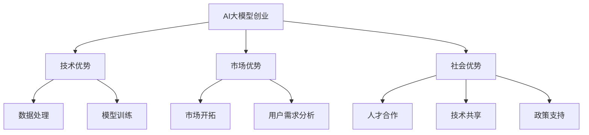

                 

# AI 大模型创业：如何利用社会优势？

> **关键词**：大模型、创业、社会优势、合作、技术、市场

> **摘要**：本文将深入探讨AI大模型创业过程中如何利用社会优势，包括人才、技术、市场等方面的资源，提供详细的操作步骤和实用建议。通过对核心概念、算法原理、数学模型和实际案例的分析，帮助创业者更好地把握机会，实现创业目标。

## 1. 背景介绍

### 1.1 目的和范围

本文旨在为AI大模型创业团队提供系统性指导，帮助他们在复杂多变的市场环境中，有效利用社会优势资源，实现业务的快速发展。文章将涵盖以下内容：

- AI大模型创业的背景和挑战
- 社会优势的概念及其在创业中的应用
- 核心概念与联系
- 核心算法原理与操作步骤
- 数学模型与公式
- 项目实战与代码案例
- 实际应用场景
- 工具和资源推荐
- 未来发展趋势与挑战

### 1.2 预期读者

本文适用于以下读者群体：

- AI领域创业者
- 技术团队负责人
- 对AI大模型创业感兴趣的从业者
- 对技术创新和应用有强烈兴趣的研究者

### 1.3 文档结构概述

本文分为以下几个部分：

1. 背景介绍：介绍文章目的、范围和预期读者。
2. 核心概念与联系：阐述AI大模型创业所需的核心概念和原理。
3. 核心算法原理与操作步骤：详细解释核心算法原理和操作步骤。
4. 数学模型与公式：介绍与AI大模型相关的数学模型和公式。
5. 项目实战与代码案例：通过实际项目案例，展示如何应用本文提到的技术和方法。
6. 实际应用场景：分析AI大模型在现实世界中的应用场景。
7. 工具和资源推荐：推荐学习资源、开发工具和框架。
8. 未来发展趋势与挑战：探讨AI大模型创业的未来发展趋势和面临的挑战。
9. 附录：常见问题与解答。
10. 扩展阅读与参考资料：提供进一步学习和研究的资源。

### 1.4 术语表

#### 1.4.1 核心术语定义

- AI大模型：指使用深度学习技术训练的大型神经网络模型，通常包含数亿甚至数千亿个参数。
- 创业：指创建新企业或新项目，以实现商业目标和社会价值。
- 社会优势：指在创业过程中利用外部资源、合作与市场机会等优势，以加速业务发展。
- 人才：指具备相关技能和知识的专业人员，是创业成功的关键因素。

#### 1.4.2 相关概念解释

- 深度学习：一种机器学习技术，通过多层神经网络结构模拟人脑学习过程，实现自动特征提取和模型训练。
- 聚类分析：一种无监督学习方法，将数据集划分为多个类别，以便更好地理解数据分布和模式。
- 优化算法：用于调整模型参数，提高模型性能和准确性的算法。

#### 1.4.3 缩略词列表

- AI：人工智能
- DL：深度学习
- CNN：卷积神经网络
- RNN：循环神经网络
- NLP：自然语言处理

## 2. 核心概念与联系

### 2.1 大模型创业的定义与优势

AI大模型创业是指利用深度学习技术，开发并商业化大型神经网络模型，以解决实际问题或提供创新服务。这种创业模式具有以下优势：

1. **技术优势**：大模型能够处理海量数据，实现更准确的预测和决策。
2. **市场优势**：随着人工智能技术的普及，市场需求不断增长，为创业者提供了广阔的舞台。
3. **社会优势**：大模型创业有助于推动社会进步，解决诸如医疗、教育、环保等领域的问题。

### 2.2 社会优势在创业中的应用

社会优势在创业中的应用主要体现在以下几个方面：

1. **人才合作**：通过联合专业人才，共同开发创新项目，提高团队整体实力。
2. **技术共享**：利用开源技术、研究机构和企业的技术资源，加速项目研发。
3. **市场开拓**：通过与行业合作伙伴建立合作关系，拓展市场渠道，提高市场份额。
4. **政策支持**：了解并利用政府政策，获得资金、税收等方面的支持。

### 2.3 核心概念原理与架构

在AI大模型创业过程中，以下核心概念和原理至关重要：

1. **深度学习**：通过多层神经网络结构，自动提取特征并训练模型。
2. **数据预处理**：对原始数据进行清洗、归一化和特征提取，以提高模型性能。
3. **模型评估**：使用准确率、召回率、F1分数等指标评估模型性能。
4. **迁移学习**：利用预训练模型，减少训练数据需求，提高模型泛化能力。

### 2.4 Mermaid 流程图



## 3. 核心算法原理与具体操作步骤

### 3.1 深度学习算法原理

深度学习算法的核心是多层神经网络，其基本原理如下：

1. **前向传播**：输入数据经过神经网络层，逐层计算并传递到下一层。
2. **激活函数**：对神经元的输出进行非线性变换，引入非线性特性。
3. **反向传播**：通过计算梯度，调整网络权重和偏置，优化模型参数。
4. **损失函数**：评估模型预测结果与真实值之间的差异，用于指导优化过程。

### 3.2 伪代码实现

```python
# 输入数据：x，目标值：y
# 初始化模型参数：W, b

for epoch in range(num_epochs):
    for x, y in data_loader:
        # 前向传播
        z = x * W + b
        a = sigmoid(z)
        
        # 计算损失
        loss = mse_loss(a, y)
        
        # 反向传播
        dz = (a - y) * sigmoid_derivative(a)
        dW = x.T * dz
        db = dz.T
        
        # 更新模型参数
        W -= learning_rate * dW
        b -= learning_rate * db

# 评估模型性能
accuracy = evaluate_model(model, test_data)
```

### 3.3 具体操作步骤

1. **数据收集与预处理**：收集并清洗数据，进行归一化和特征提取。
2. **模型设计**：选择合适的神经网络结构，确定激活函数和损失函数。
3. **模型训练**：使用训练数据对模型进行训练，调整模型参数。
4. **模型评估**：使用测试数据评估模型性能，调整模型参数。
5. **模型部署**：将模型部署到生产环境，提供实际应用服务。

## 4. 数学模型和公式及详细讲解

### 4.1 数学模型介绍

在AI大模型创业过程中，以下数学模型和公式至关重要：

1. **线性回归模型**：用于预测线性关系，基本公式为：$$y = \beta_0 + \beta_1x$$
2. **逻辑回归模型**：用于二分类问题，基本公式为：$$\sigma(z) = \frac{1}{1 + e^{-z}}$$
3. **卷积神经网络（CNN）**：用于图像处理，基本公式为：$$f(x) = \sigma(W \cdot x + b)$$
4. **循环神经网络（RNN）**：用于序列数据，基本公式为：$$h_t = \sigma(W_h \cdot [h_{t-1}, x_t] + b_h)$$
5. **自编码器**：用于无监督特征学习，基本公式为：$$\phi(x) = \sigma(W \cdot x + b)$$

### 4.2 详细讲解

#### 4.2.1 线性回归模型

线性回归模型是一种简单的预测模型，其核心思想是找到一条直线，使预测值与真实值之间的误差最小。基本公式为：

$$y = \beta_0 + \beta_1x$$

其中，$$\beta_0$$为截距，$$\beta_1$$为斜率，$$x$$为自变量，$$y$$为因变量。

为了找到最佳的$$\beta_0$$和$$\beta_1$$，可以使用最小二乘法进行优化。具体步骤如下：

1. **数据准备**：收集并清洗数据，将数据分为自变量和因变量。
2. **模型建立**：根据数据特征，选择适当的线性回归模型。
3. **模型训练**：使用最小二乘法，计算最优参数$$\beta_0$$和$$\beta_1$$。
4. **模型评估**：使用测试数据评估模型性能，调整参数。

#### 4.2.2 逻辑回归模型

逻辑回归模型是一种用于二分类问题的预测模型，其核心思想是利用非线性函数$$\sigma(z)$$将线性组合$$z = \beta_0 + \beta_1x$$转换为概率分布。基本公式为：

$$\sigma(z) = \frac{1}{1 + e^{-z}}$$

其中，$$\sigma(z)$$表示概率分布，$$z = \beta_0 + \beta_1x$$表示线性组合，$$\beta_0$$和$$\beta_1$$为模型参数。

逻辑回归模型可以通过极大似然估计（MLE）进行优化。具体步骤如下：

1. **数据准备**：收集并清洗数据，将数据分为自变量和因变量。
2. **模型建立**：根据数据特征，选择适当的逻辑回归模型。
3. **模型训练**：使用极大似然估计，计算最优参数$$\beta_0$$和$$\beta_1$$。
4. **模型评估**：使用测试数据评估模型性能，调整参数。

#### 4.2.3 卷积神经网络（CNN）

卷积神经网络是一种用于图像处理的深度学习模型，其核心思想是利用卷积操作提取图像特征。基本公式为：

$$f(x) = \sigma(W \cdot x + b)$$

其中，$$f(x)$$表示输出特征，$$W$$为卷积核，$$x$$为输入图像，$$b$$为偏置。

CNN的基本结构包括卷积层、池化层和全连接层。具体步骤如下：

1. **数据准备**：收集并清洗数据，将图像转换为适当的大小和格式。
2. **模型建立**：根据数据特征，设计合适的CNN结构。
3. **模型训练**：使用训练数据，调整模型参数。
4. **模型评估**：使用测试数据，评估模型性能。

#### 4.2.4 循环神经网络（RNN）

循环神经网络是一种用于序列数据的深度学习模型，其核心思想是利用循环结构处理序列信息。基本公式为：

$$h_t = \sigma(W_h \cdot [h_{t-1}, x_t] + b_h)$$

其中，$$h_t$$表示当前时刻的隐藏状态，$$h_{t-1}$$为上一时刻的隐藏状态，$$x_t$$为当前时刻的输入，$$W_h$$为权重矩阵，$$b_h$$为偏置。

RNN的基本结构包括输入层、隐藏层和输出层。具体步骤如下：

1. **数据准备**：收集并清洗数据，将序列转换为适当的大小和格式。
2. **模型建立**：根据数据特征，设计合适的RNN结构。
3. **模型训练**：使用训练数据，调整模型参数。
4. **模型评估**：使用测试数据，评估模型性能。

#### 4.2.5 自编码器

自编码器是一种用于无监督特征学习的深度学习模型，其核心思想是利用自编码器压缩和重构数据。基本公式为：

$$\phi(x) = \sigma(W \cdot x + b)$$

其中，$$\phi(x)$$表示压缩后的特征，$$W$$为压缩器权重，$$x$$为输入数据，$$b$$为偏置。

自编码器的基本结构包括编码器和解码器。具体步骤如下：

1. **数据准备**：收集并清洗数据，将数据转换为适当的大小和格式。
2. **模型建立**：根据数据特征，设计合适的自编码器结构。
3. **模型训练**：使用训练数据，调整模型参数。
4. **模型评估**：使用测试数据，评估模型性能。

## 5. 项目实战：代码实际案例和详细解释说明

### 5.1 开发环境搭建

为了实现AI大模型创业项目，首先需要搭建合适的开发环境。以下是搭建过程的详细步骤：

1. **安装Python**：在官网下载并安装Python，版本建议为3.8及以上。
2. **安装深度学习框架**：安装TensorFlow或PyTorch，版本建议与Python版本兼容。
3. **安装必要的库**：根据项目需求，安装其他必要的库，如NumPy、Pandas、Matplotlib等。
4. **配置环境变量**：将Python和深度学习框架的安装路径添加到系统环境变量中。

### 5.2 源代码详细实现和代码解读

以下是使用TensorFlow实现一个简单CNN模型的代码示例：

```python
import tensorflow as tf
from tensorflow.keras import datasets, layers, models

# 加载数据集
(train_images, train_labels), (test_images, test_labels) = datasets.cifar10.load_data()

# 数据预处理
train_images = train_images / 255.0
test_images = test_images / 255.0

# 构建模型
model = models.Sequential()
model.add(layers.Conv2D(32, (3, 3), activation='relu', input_shape=(32, 32, 3)))
model.add(layers.MaxPooling2D((2, 2)))
model.add(layers.Conv2D(64, (3, 3), activation='relu'))
model.add(layers.MaxPooling2D((2, 2)))
model.add(layers.Conv2D(64, (3, 3), activation='relu'))

# 添加全连接层
model.add(layers.Flatten())
model.add(layers.Dense(64, activation='relu'))
model.add(layers.Dense(10))

# 编译模型
model.compile(optimizer='adam',
              loss=tf.keras.losses.SparseCategoricalCrossentropy(from_logits=True),
              metrics=['accuracy'])

# 训练模型
model.fit(train_images, train_labels, epochs=10, batch_size=64)

# 评估模型
test_loss, test_acc = model.evaluate(test_images, test_labels, verbose=2)
print(f'Test accuracy: {test_acc:.4f}')
```

### 5.3 代码解读与分析

1. **数据加载与预处理**：使用TensorFlow内置的CIFAR-10数据集，并对数据进行归一化处理，以提高模型训练效果。

2. **模型构建**：使用Sequential模型构建一个简单的CNN，包括卷积层、池化层和全连接层。具体结构如下：

   - 卷积层1：32个3x3卷积核，ReLU激活函数。
   - 池化层1：2x2最大池化。
   - 卷积层2：64个3x3卷积核，ReLU激活函数。
   - 池化层2：2x2最大池化。
   - 卷积层3：64个3x3卷积核，ReLU激活函数。
   - 全连接层1：64个神经元，ReLU激活函数。
   - 全连接层2：10个神经元，无激活函数（用于分类输出）。

3. **模型编译**：使用adam优化器和SparseCategoricalCrossentropy损失函数，并设置accuracy作为评价指标。

4. **模型训练**：使用训练数据对模型进行训练，设置epochs为10，batch_size为64。

5. **模型评估**：使用测试数据评估模型性能，输出测试准确率。

通过上述步骤，我们可以构建并训练一个简单的CNN模型，用于图像分类任务。接下来，我们可以进一步优化模型结构、调整参数，以提高模型性能和泛化能力。

## 6. 实际应用场景

AI大模型在现实世界中具有广泛的应用场景，以下是一些典型的应用案例：

1. **医疗健康**：利用AI大模型进行疾病预测、诊断和治疗，提高医疗服务的效率和准确性。
2. **金融科技**：通过AI大模型进行风险控制、信用评估、投资预测等，为金融机构提供智能决策支持。
3. **智能制造**：利用AI大模型进行生产过程优化、设备故障预测和质量检测，提高生产效率和产品质量。
4. **自然语言处理**：利用AI大模型进行机器翻译、文本生成、情感分析等，为企业和用户提供智能信息服务。
5. **智能交通**：利用AI大模型进行交通流量预测、路径规划、自动驾驶等，提高交通系统的效率和安全性。

在这些应用场景中，创业者可以通过利用社会优势资源，如合作企业、研究机构和技术支持，快速搭建AI大模型项目，实现商业化和社会价值的双重目标。

## 7. 工具和资源推荐

### 7.1 学习资源推荐

#### 7.1.1 书籍推荐

- 《深度学习》（Goodfellow, Bengio, Courville著）
- 《Python深度学习》（François Chollet著）
- 《AI：人工智能的未来》（吴恩达著）

#### 7.1.2 在线课程

- Coursera上的《深度学习专项课程》
- edX上的《机器学习科学》
- Udacity的《深度学习工程师纳米学位》

#### 7.1.3 技术博客和网站

- [Deep Learning AI](https://www.deeplearningai.com/)
- [Medium上的深度学习和AI专栏](https://medium.com/topic/deep-learning)
- [GitHub上的深度学习和AI项目](https://github.com/topics/deep-learning)

### 7.2 开发工具框架推荐

#### 7.2.1 IDE和编辑器

- PyCharm
- Visual Studio Code
- Jupyter Notebook

#### 7.2.2 调试和性能分析工具

- TensorBoard
- Nsight Com

