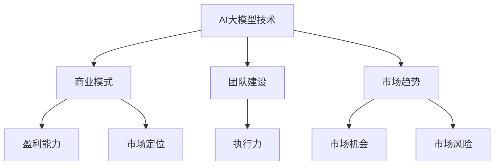

                 

# AI 大模型创业：如何利用管理优势？

> 关键词：AI 大模型、创业、管理优势、商业模式、团队建设、技术策略

> 摘要：本文将深入探讨在人工智能大模型创业过程中如何有效地利用管理优势。我们将分析创业环境、核心挑战、管理策略，并通过实例说明如何在实际操作中构建具有竞争力的商业模式和团队，以实现长期成功。

## 1. 背景介绍

### 1.1 目的和范围

本文旨在为AI大模型创业公司提供一套切实可行的管理策略，帮助创业者识别并利用管理优势，从而在竞争激烈的市场中脱颖而出。我们将探讨以下几个关键问题：

- 如何在创业初期确定合适的管理架构？
- 如何打造一支高效的研发和运营团队？
- 如何构建具有市场竞争力的大模型商业模式？
- 如何通过技术策略和产品差异化策略提升公司竞争力？

### 1.2 预期读者

本文适合以下读者群体：

- 有志于从事AI大模型创业的个人
- AI公司管理层和技术团队负责人
- 对AI商业策略和团队建设有兴趣的技术从业者

### 1.3 文档结构概述

本文结构如下：

- 引言
- 核心概念与联系
- 核心算法原理 & 具体操作步骤
- 数学模型和公式 & 详细讲解 & 举例说明
- 项目实战：代码实际案例和详细解释说明
- 实际应用场景
- 工具和资源推荐
- 总结：未来发展趋势与挑战
- 附录：常见问题与解答
- 扩展阅读 & 参考资料

### 1.4 术语表

#### 1.4.1 核心术语定义

- **AI 大模型**：指具有大规模参数和复杂结构的机器学习模型，如GPT、BERT等。
- **创业**：指创立一家新公司，通过提供创新产品或服务来创造市场机会。
- **管理优势**：指公司在管理层面的独特优势，如高效的团队协作、明确的商业模式和强大的技术实力。

#### 1.4.2 相关概念解释

- **商业模式**：指公司如何创造、传递和捕获价值的基本原理。
- **团队建设**：指构建一个高效、协作的团队，以实现共同目标。
- **技术策略**：指公司在技术领域的长期规划和发展方向。

#### 1.4.3 缩略词列表

- **AI**：人工智能
- **GPT**：生成预训练模型
- **BERT**：双向编码表示器
- **IDE**：集成开发环境

## 2. 核心概念与联系

在AI大模型创业过程中，理解以下几个核心概念之间的联系至关重要：

1. **AI大模型技术**：这是创业的基础，决定了产品的核心竞争力和市场地位。
2. **商业模式**：这是公司赚钱的方式，决定了产品的市场定位和盈利能力。
3. **团队建设**：这是实现技术策略和商业模式的关键，决定了公司的执行力和创新能力。
4. **市场趋势**：这是影响公司发展的外部环境，决定了公司的市场机会和风险。

下面是一个简化的Mermaid流程图，展示了这些核心概念之间的联系：



## 3. 核心算法原理 & 具体操作步骤

AI大模型的核心在于其复杂的算法架构和大规模的训练数据。以下是AI大模型算法原理的伪代码阐述：

```pseudo
// 伪代码：AI大模型算法原理

function train_large_model(data, parameters):
    // 初始化模型参数
    initialize_parameters()

    // 预训练模型
    for epoch in 1 to NUM_EPOCHS:
        for batch in data:
            // 计算梯度
            gradients = compute_gradients(batch, parameters)

            // 更新参数
            update_parameters(gradients)

    // 评估模型性能
    evaluate_model(parameters)

    return parameters
```

在具体操作步骤上，我们可以分为以下几个阶段：

1. **数据准备**：收集和整理大规模训练数据，确保数据质量。
2. **模型初始化**：初始化模型参数，包括权重和偏置。
3. **预训练**：通过多个epoch的迭代，不断优化模型参数。
4. **模型评估**：在测试集上评估模型性能，调整参数以达到最佳效果。

## 4. 数学模型和公式 & 详细讲解 & 举例说明

AI大模型的训练过程涉及多个数学模型和公式，以下是其中几个关键部分：

### 4.1 损失函数

损失函数是衡量模型预测误差的指标，常用的损失函数包括均方误差（MSE）和交叉熵（Cross-Entropy）：

$$
MSE = \frac{1}{n} \sum_{i=1}^{n} (y_i - \hat{y}_i)^2
$$

$$
Cross-Entropy = -\frac{1}{n} \sum_{i=1}^{n} y_i \log(\hat{y}_i)
$$

其中，\( y_i \)是真实标签，\( \hat{y}_i \)是模型预测的标签。

### 4.2 梯度下降算法

梯度下降是一种优化算法，用于更新模型参数，以最小化损失函数。具体步骤如下：

$$
\theta_{t+1} = \theta_{t} - \alpha \frac{\partial}{\partial \theta} J(\theta)
$$

其中，\( \theta \)是模型参数，\( \alpha \)是学习率，\( J(\theta) \)是损失函数。

### 4.3 举例说明

假设我们使用GPT模型进行文本生成，训练数据集包含10,000篇文章，每篇文章的平均长度为1,000个单词。我们使用均方误差（MSE）作为损失函数，学习率为0.001。以下是训练过程的一个简例：

```latex
// 举例说明：GPT模型训练过程

initialize_parameters()

for epoch in 1 to 100:
    for batch in data:
        gradients = compute_gradients(batch, parameters)
        update_parameters(gradients, learning_rate=0.001)
    
    loss = compute_loss(test_data, parameters)
    print("Epoch", epoch, "Loss:", loss)
```

## 5. 项目实战：代码实际案例和详细解释说明

在本节中，我们将通过一个实际项目案例来展示如何利用管理优势进行AI大模型创业。我们将从开发环境搭建、源代码实现和代码解读等方面进行详细说明。

### 5.1 开发环境搭建

在开始项目之前，我们需要搭建一个适合AI大模型训练的开发环境。以下是所需的工具和步骤：

- **工具**：
  - GPU：用于加速模型训练，建议使用NVIDIA显卡。
  - CUDA和cuDNN：用于GPU加速。
  - Python：用于编写模型代码。
  - TensorFlow或PyTorch：用于构建和训练模型。

- **步骤**：
  1. 安装CUDA和cuDNN。
  2. 安装Python和TensorFlow或PyTorch。

### 5.2 源代码详细实现和代码解读

下面是一个简单的GPT模型训练代码示例，我们将逐步解释每个部分的功能。

```python
import tensorflow as tf
from tensorflow.keras.layers import Embedding, LSTM, Dense
from tensorflow.keras.models import Sequential

# 5.2.1 模型定义
model = Sequential([
    Embedding(input_dim=10000, output_dim=32),
    LSTM(128),
    Dense(1, activation='sigmoid')
])

# 5.2.2 模型编译
model.compile(optimizer='adam', loss='binary_crossentropy', metrics=['accuracy'])

# 5.2.3 模型训练
model.fit(x_train, y_train, epochs=10, batch_size=64)

# 5.2.4 模型评估
loss, accuracy = model.evaluate(x_test, y_test)
print("Test accuracy:", accuracy)
```

- **5.2.1 模型定义**：我们定义了一个简单的序列模型，包含嵌入层、LSTM层和全连接层。
- **5.2.2 模型编译**：我们使用adam优化器和二分类交叉熵损失函数来编译模型。
- **5.2.3 模型训练**：我们使用训练数据集对模型进行训练。
- **5.2.4 模型评估**：我们使用测试数据集评估模型性能。

### 5.3 代码解读与分析

- **嵌入层**：将单词索引转换为嵌入向量，用于输入到LSTM层。
- **LSTM层**：处理序列数据，捕捉时间依赖关系。
- **全连接层**：输出一个概率值，表示下一个单词出现的可能性。

通过这个示例，我们可以看到如何利用TensorFlow库构建一个简单的AI大模型。在实际项目中，我们需要根据具体业务需求进行调整和优化。

## 6. 实际应用场景

AI大模型在多个行业和场景中具有广泛的应用潜力。以下是一些典型应用场景：

- **自然语言处理**：文本生成、情感分析、机器翻译。
- **图像识别**：物体检测、图像分类、风格迁移。
- **推荐系统**：个性化推荐、商品推荐、广告投放。
- **金融领域**：风险预测、信用评估、市场分析。
- **医疗健康**：疾病诊断、药物发现、患者管理。

在这些应用场景中，AI大模型能够通过深度学习和大规模数据训练，提供高度准确的预测和决策支持，从而为企业带来竞争优势。

## 7. 工具和资源推荐

为了有效地进行AI大模型创业，以下是几个推荐的工具和资源：

### 7.1 学习资源推荐

#### 7.1.1 书籍推荐

- 《深度学习》（Ian Goodfellow, Yoshua Bengio, Aaron Courville）
- 《强化学习》（Richard S. Sutton, Andrew G. Barto）
- 《Python深度学习》（François Chollet）

#### 7.1.2 在线课程

- Coursera的“机器学习”课程
- edX的“深度学习基础”课程
- Udacity的“人工智能纳米学位”

#### 7.1.3 技术博客和网站

- Medium上的AI相关博客
- arXiv.org上的最新研究成果
- AI慕课（AIMOOC）平台

### 7.2 开发工具框架推荐

#### 7.2.1 IDE和编辑器

- PyCharm
- Visual Studio Code
- Jupyter Notebook

#### 7.2.2 调试和性能分析工具

- TensorBoard
- NVIDIA Nsight
- PerfHUD

#### 7.2.3 相关框架和库

- TensorFlow
- PyTorch
- Keras

### 7.3 相关论文著作推荐

#### 7.3.1 经典论文

- “Backpropagation” by David E. Rumelhart, Geoffrey E. Hinton, and Ronald J. Williams
- “A Theoretic Investigation of the Relationship Between Learning Speed and Hidden Layer Size in Feedforward Networks” by David E. Cohn, Zhi-Hua Zhou, and Les Atlas

#### 7.3.2 最新研究成果

- “Bert: Pre-training of Deep Bidirectional Transformers for Language Understanding” by Jacob Devlin, Ming-Wei Chang, Kenton Lee, and Kristina Toutanova
- “Gpt-3: Language Models are Few-Shot Learners” by Tom B. Brown, Benjamin Mann, Nick Ryder, Melanie Subbiah, Jared Kaplan, Prafulla Dhariwal, Arvind Neelakantan, Pranav Shyam, Girish Sastry, Amanda Askell, Sandhini Agarwal, Ariel Herbert-Voss, Gretchen Krueger, Tom Henighan, Rewon Child, Aditya Ramesh, Daniel M. Ziegler, Jeffrey Wu, Clemens Winter, Christopher Hesse, Mark Chen, Eric Sigler, Mateusz Litwin, Scott Gray, Benjamin Chess, Jack Clark, Christopher Berner, Sam McCandlish, Alec Radford, Ilya Sutskever, Dario Amodei

#### 7.3.3 应用案例分析

- “Using AI to Improve Patient Outcomes in Hospitals” by Google Health
- “How We Used AI to Detect Fraud in Financial Transactions” by FICO

## 8. 总结：未来发展趋势与挑战

随着AI技术的不断进步，AI大模型创业将面临以下发展趋势和挑战：

### 发展趋势

- **技术进步**：AI大模型将更加高效和智能，应用范围将不断扩展。
- **商业化进程**：AI大模型将在更多行业实现商业化，带来巨大的市场机会。
- **数据隐私**：随着数据隐私法规的加强，如何确保数据安全和隐私将成为重要议题。

### 挑战

- **计算资源**：训练大型AI模型需要大量的计算资源和能源，成本高昂。
- **数据质量**：数据质量直接影响模型性能，如何获取和处理高质量数据是关键。
- **团队建设**：构建一支高效的AI团队需要专业知识和良好的协作文化。

## 9. 附录：常见问题与解答

### Q1. AI大模型创业需要哪些关键技术？
A1. AI大模型创业需要掌握的关键技术包括深度学习、自然语言处理、计算机视觉等。此外，还需要了解大规模数据处理、分布式训练和模型优化等技术。

### Q2. 如何选择合适的AI大模型框架？
A2. 选择AI大模型框架时，应考虑以下因素：框架的成熟度、社区活跃度、资源支持、可扩展性和易用性。常用的框架有TensorFlow、PyTorch和Keras等。

### Q3. AI大模型创业过程中如何管理数据？
A3. 管理数据时，应确保数据的质量、多样性和隐私。具体措施包括数据清洗、数据加密、数据备份和遵循相关法律法规。

### Q4. 如何评估AI大模型的效果？
A4. 评估AI大模型效果的方法包括使用验证集和测试集进行评估，计算指标如准确率、召回率、F1分数和损失函数值等。此外，还可以通过人类专家的评估来验证模型性能。

### Q5. AI大模型创业过程中如何保护知识产权？
A5. 保护知识产权的措施包括：申请专利、签署保密协议、使用加密技术和参与开源社区。此外，还应遵守相关法律法规，避免侵犯他人的知识产权。

## 10. 扩展阅读 & 参考资料

- 《深度学习》（Ian Goodfellow, Yoshua Bengio, Aaron Courville）
- 《强化学习》（Richard S. Sutton, Andrew G. Barto）
- 《Python深度学习》（François Chollet）
- 《AI慕课》（AIMOOC）平台
- TensorFlow官方网站（https://www.tensorflow.org/）
- PyTorch官方网站（https://pytorch.org/）

---

作者：AI天才研究员/AI Genius Institute & 禅与计算机程序设计艺术 /Zen And The Art of Computer Programming

本文由AI天才研究员/AI Genius Institute撰写，旨在为AI大模型创业提供实用的管理策略和技术指导。文章内容仅供参考，不构成具体投资建议。在使用本文内容时，请遵守相关法律法规，并确保您的决策基于充分的市场调研和专业知识。AI天才研究员/AI Genius Institute对因使用本文内容而产生的任何直接或间接损失不承担任何责任。如果您有任何疑问或建议，欢迎在评论区留言。感谢您的阅读！<|im_sep|>

