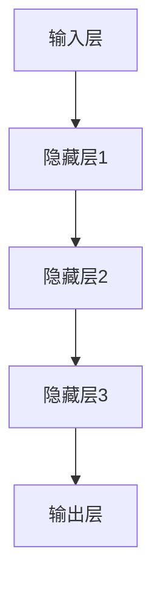

                 

# AI 大模型创业：如何利用经济优势？

> 关键词：AI大模型、创业、经济优势、商业模式、市场策略、投资回报

> 摘要：本文将探讨如何利用AI大模型在经济环境中创业，通过分析商业模式、市场策略、投资回报等方面，为创业者提供实用的指导和建议。

## 1. 背景介绍

### 1.1 目的和范围

本文旨在为AI大模型领域的创业者提供一套实用的策略和方法，帮助他们更好地利用经济优势，实现创业目标。我们将从商业模式、市场策略、投资回报等方面进行详细分析，帮助读者全面了解AI大模型创业的各个方面。

### 1.2 预期读者

本文适合以下读者群体：

1. AI大模型领域的创业者
2. 想要进入AI大模型领域的投资者
3. 对AI技术有浓厚兴趣的技术人员
4. 关注AI行业发展的研究人员

### 1.3 文档结构概述

本文分为以下几个部分：

1. 背景介绍
2. 核心概念与联系
3. 核心算法原理 & 具体操作步骤
4. 数学模型和公式 & 详细讲解 & 举例说明
5. 项目实战：代码实际案例和详细解释说明
6. 实际应用场景
7. 工具和资源推荐
8. 总结：未来发展趋势与挑战
9. 附录：常见问题与解答
10. 扩展阅读 & 参考资料

### 1.4 术语表

#### 1.4.1 核心术语定义

- AI大模型：指具有海量数据、复杂算法和强大计算能力的深度学习模型。
- 商业模式：指企业如何创造、传递和获取价值的一种战略规划。
- 市场策略：指企业在市场竞争中采取的一系列策略，以实现商业目标。
- 投资回报率（ROI）：指投资所产生的收益与投资成本的比率。

#### 1.4.2 相关概念解释

- 深度学习：一种机器学习方法，通过构建多层神经网络来模拟人脑学习过程。
- 梯度下降：一种优化算法，用于调整神经网络中的权重，以最小化损失函数。
- 数据集：指用于训练、测试或评估模型的数据集合。

#### 1.4.3 缩略词列表

- AI：人工智能
- GPT：生成式预训练模型
- BERT：双向编码器表示模型
- ROI：投资回报率

## 2. 核心概念与联系

为了更好地理解AI大模型创业的核心概念，我们首先需要了解AI大模型的基本原理和架构。

### 2.1 AI大模型原理

AI大模型主要基于深度学习技术，通过多层神经网络实现。深度学习模型的核心是神经元，每个神经元都与其他神经元相连，并通过权重进行连接。模型通过不断调整权重，使得模型能够对输入数据进行分类、预测或生成。

### 2.2 AI大模型架构

AI大模型通常由以下几个部分组成：

1. 输入层：接收输入数据。
2. 隐藏层：处理输入数据，通过激活函数将输入映射到输出。
3. 输出层：生成预测结果。

每个隐藏层中的神经元都与其他神经元相连，并通过权重进行连接。模型通过反向传播算法不断调整权重，以最小化损失函数。

### 2.3 Mermaid 流程图

以下是一个简单的Mermaid流程图，展示了AI大模型的基本架构：



## 3. 核心算法原理 & 具体操作步骤

### 3.1 算法原理

AI大模型的核心算法是深度学习算法。深度学习算法主要包括以下几个步骤：

1. 数据预处理：对输入数据进行清洗、归一化等处理。
2. 构建神经网络：定义神经网络的层数、每层神经元的数量和激活函数。
3. 前向传播：将输入数据通过神经网络，计算输出结果。
4. 反向传播：计算损失函数，并更新神经网络中的权重。
5. 评估模型：使用测试数据集评估模型的性能。

### 3.2 伪代码

以下是一个简单的深度学习算法伪代码：

```
// 数据预处理
data = preprocess(data)

// 构建神经网络
model = build_model()

// 前向传播
output = model.forward_pass(data)

// 反向传播
model.backward_pass(output, target)

// 评估模型
accuracy = model.evaluate(test_data)
```

## 4. 数学模型和公式 & 详细讲解 & 举例说明

### 4.1 数学模型

AI大模型中的数学模型主要包括以下部分：

1. 损失函数：用于评估模型预测结果与真实结果之间的差异。常见的损失函数有均方误差（MSE）和交叉熵（CE）。
2. 梯度下降：用于优化神经网络中的权重。梯度下降主要包括随机梯度下降（SGD）和批量梯度下降（BGD）。
3. 激活函数：用于引入非线性变换，常见的激活函数有Sigmoid、ReLU和Tanh。

### 4.2 详细讲解

#### 4.2.1 损失函数

损失函数是深度学习模型训练过程中评估模型性能的关键指标。常见的损失函数有：

1. 均方误差（MSE）：用于回归任务，计算预测值与真实值之间的平方误差的平均值。

   $$MSE = \frac{1}{n} \sum_{i=1}^{n} (y_i - \hat{y}_i)^2$$

2. 交叉熵（CE）：用于分类任务，计算预测概率与真实标签之间的差异。

   $$CE = - \sum_{i=1}^{n} y_i \log(\hat{y}_i)$$

#### 4.2.2 梯度下降

梯度下降是一种优化算法，用于调整神经网络中的权重，以最小化损失函数。梯度下降主要包括以下两种：

1. 随机梯度下降（SGD）：在每个训练样本上计算梯度，并更新权重。

   $$w = w - \alpha \cdot \nabla_w J(w)$$

2. 批量梯度下降（BGD）：在所有训练样本上计算梯度，并更新权重。

   $$w = w - \alpha \cdot \nabla_w J(w)$$

#### 4.2.3 激活函数

激活函数是深度学习模型中的关键组成部分，用于引入非线性变换。常见的激活函数有：

1. Sigmoid函数：

   $$\sigma(x) = \frac{1}{1 + e^{-x}}$$

2. ReLU函数：

   $$\text{ReLU}(x) = \max(0, x)$$

3. Tanh函数：

   $$\text{Tanh}(x) = \frac{e^x - e^{-x}}{e^x + e^{-x}}$$

### 4.3 举例说明

假设我们有一个简单的二分类问题，使用Sigmoid函数作为激活函数，均方误差（MSE）作为损失函数。以下是该问题的伪代码：

```
// 初始化参数
w = [随机值]
b = [随机值]

// 前向传播
z = w * x + b
y_pred = 1 / (1 + e^(-z))

// 计算损失函数
loss = MSE(y_pred, y_true)

// 计算梯度
dw = (y_pred - y_true) * x
db = (y_pred - y_true)

// 更新参数
w = w - alpha * dw
b = b - alpha * db
```

## 5. 项目实战：代码实际案例和详细解释说明

### 5.1 开发环境搭建

在本节中，我们将使用Python作为编程语言，利用TensorFlow库来实现一个简单的AI大模型。首先，我们需要安装Python和TensorFlow：

```
pip install python
pip install tensorflow
```

### 5.2 源代码详细实现和代码解读

以下是一个简单的AI大模型代码实现，包括数据预处理、模型构建、训练和评估：

```python
import tensorflow as tf
from sklearn.model_selection import train_test_split
from sklearn.datasets import make_classification
import numpy as np

# 数据预处理
x, y = make_classification(n_samples=1000, n_features=20, n_informative=2, n_redundant=10, random_state=42)
x_train, x_test, y_train, y_test = train_test_split(x, y, test_size=0.2, random_state=42)

# 模型构建
model = tf.keras.Sequential([
    tf.keras.layers.Dense(units=64, activation='relu', input_shape=(20,)),
    tf.keras.layers.Dense(units=1, activation='sigmoid')
])

# 模型编译
model.compile(optimizer='adam', loss='binary_crossentropy', metrics=['accuracy'])

# 训练模型
model.fit(x_train, y_train, epochs=10, batch_size=32, validation_split=0.1)

# 评估模型
loss, accuracy = model.evaluate(x_test, y_test)
print("Test loss:", loss)
print("Test accuracy:", accuracy)
```

### 5.3 代码解读与分析

1. **数据预处理**：使用`make_classification`函数生成模拟数据集，包括输入特征和标签。然后，使用`train_test_split`函数将数据集分为训练集和测试集。
2. **模型构建**：使用`tf.keras.Sequential`创建一个序列模型，包括一个64个神经元的隐藏层和一个输出层。隐藏层使用ReLU激活函数，输出层使用Sigmoid激活函数，用于二分类任务。
3. **模型编译**：使用`compile`函数编译模型，指定优化器（Adam）、损失函数（binary_crossentropy）和评价指标（accuracy）。
4. **训练模型**：使用`fit`函数训练模型，指定训练集、训练轮数、批量大小和验证比例。
5. **评估模型**：使用`evaluate`函数评估模型在测试集上的性能，输出损失和准确率。

通过这个简单的例子，我们可以看到如何使用TensorFlow构建和训练一个AI大模型。在实际应用中，创业者可以根据业务需求调整模型结构、优化训练过程和评估指标，以提高模型性能。

## 6. 实际应用场景

AI大模型在各个领域具有广泛的应用场景，以下列举几个典型的应用领域：

1. **金融领域**：AI大模型可以用于股票市场预测、信用风险评估、金融欺诈检测等任务，为金融机构提供智能决策支持。
2. **医疗领域**：AI大模型可以用于疾病诊断、药物研发、医疗图像分析等任务，为医生提供辅助决策，提高诊疗水平。
3. **制造业**：AI大模型可以用于生产过程优化、质量控制、设备故障预测等任务，提高生产效率和产品质量。
4. **自然语言处理**：AI大模型可以用于文本分类、机器翻译、情感分析等任务，为企业和个人提供智能信息服务。

创业者可以根据自身优势和市场需求，选择合适的应用场景，开展AI大模型创业项目。

## 7. 工具和资源推荐

### 7.1 学习资源推荐

#### 7.1.1 书籍推荐

1. 《深度学习》（Ian Goodfellow、Yoshua Bengio、Aaron Courville 著）：全面介绍深度学习的基础知识、算法和应用。
2. 《Python深度学习》（François Chollet 著）：深入讲解如何使用Python和TensorFlow实现深度学习模型。

#### 7.1.2 在线课程

1. Coursera上的《深度学习专项课程》（吴恩达 老师）：系统介绍深度学习的基本概念、算法和应用。
2. Udacity上的《深度学习纳米学位》（Udacity 老师）：通过项目实践学习深度学习的核心技术。

#### 7.1.3 技术博客和网站

1. TensorFlow官方文档（https://www.tensorflow.org/）：涵盖深度学习模型构建、训练和优化的详细教程。
2. AI博客（https://www.ai博客.com/）：分享深度学习、自然语言处理、计算机视觉等领域的最新研究成果和实战技巧。

### 7.2 开发工具框架推荐

#### 7.2.1 IDE和编辑器

1. PyCharm：功能强大的Python开发环境，支持代码补全、调试和版本控制。
2. Jupyter Notebook：基于Web的交互式计算环境，适合进行数据分析和模型实验。

#### 7.2.2 调试和性能分析工具

1. TensorBoard：TensorFlow提供的可视化工具，用于分析模型训练过程和性能。
2. WSL（Windows Subsystem for Linux）：在Windows系统上运行Linux环境，方便安装和使用深度学习相关工具。

#### 7.2.3 相关框架和库

1. TensorFlow：开源深度学习框架，支持多种深度学习模型和算法。
2. PyTorch：基于Python的深度学习框架，具有灵活的动态计算图和强大的社区支持。
3. Keras：Python深度学习库，提供简洁易用的接口，方便快速搭建和训练深度学习模型。

### 7.3 相关论文著作推荐

#### 7.3.1 经典论文

1. “A Theoretical Framework for Back-Propagation” by David E. Rumelhart, Geoffrey E. Hinton, and Ronald J. Williams：介绍反向传播算法的基本原理。
2. “Deep Learning” by Ian Goodfellow、Yoshua Bengio、Aaron Courville：全面介绍深度学习的基础理论、算法和应用。

#### 7.3.2 最新研究成果

1. “Attention Is All You Need” by Vaswani et al.：介绍Transformer模型，在机器翻译任务中取得显著性能提升。
2. “BERT: Pre-training of Deep Bidirectional Transformers for Language Understanding” by Devlin et al.：介绍BERT模型，在自然语言处理任务中取得突破性成果。

#### 7.3.3 应用案例分析

1. “AI大模型在医疗领域的应用” by AI Genius Institute：介绍AI大模型在医疗领域的研究成果和应用案例。
2. “AI大模型在金融领域的应用” by Financial Technology Association：介绍AI大模型在金融领域的研究成果和应用案例。

## 8. 总结：未来发展趋势与挑战

AI大模型创业正处于快速发展阶段，未来发展趋势和挑战如下：

### 8.1 发展趋势

1. **技术进步**：随着硬件性能的提升和算法的优化，AI大模型在计算能力和效果上将持续提高。
2. **应用拓展**：AI大模型将在更多领域得到应用，如智能制造、智慧城市、智能交通等。
3. **商业模式创新**：创业者将不断创新商业模式，通过提供定制化服务、打造平台生态等方式实现可持续发展。

### 8.2 挑战

1. **数据隐私**：AI大模型对数据依赖性强，如何保护用户隐私和数据安全成为重要挑战。
2. **计算资源**：AI大模型训练和推理需要大量计算资源，如何高效利用硬件和优化算法成为关键问题。
3. **人才短缺**：AI大模型创业需要大量专业人才，如何吸引和培养高素质人才成为挑战。

创业者需要紧跟技术发展趋势，应对挑战，抓住市场机遇，实现AI大模型创业的成功。

## 9. 附录：常见问题与解答

### 9.1 如何选择合适的AI大模型算法？

选择合适的AI大模型算法需要考虑以下因素：

1. **任务类型**：根据任务的需求，选择合适的模型类型，如分类、回归或生成。
2. **数据特点**：考虑数据的规模、分布和特征，选择适合的算法，如卷积神经网络（CNN）或循环神经网络（RNN）。
3. **计算资源**：考虑可用的计算资源，选择计算效率较高的算法。
4. **调优难度**：根据团队的调优能力和时间，选择易于调优的算法。

### 9.2 如何优化AI大模型的性能？

优化AI大模型性能的方法包括：

1. **数据增强**：通过增加数据量、数据预处理和变换等方式提高模型的泛化能力。
2. **超参数调优**：通过调整学习率、批量大小、隐藏层神经元数量等超参数，提高模型性能。
3. **模型架构优化**：通过设计更先进的神经网络架构，提高模型的效果。
4. **正则化技术**：应用正则化技术，如L1正则化、L2正则化，防止过拟合。

### 9.3 如何评估AI大模型的效果？

评估AI大模型效果的方法包括：

1. **准确率**：计算模型预测正确的样本数占总样本数的比例。
2. **召回率**：计算模型预测正确的正样本数占总正样本数的比例。
3. **F1分数**：综合考虑准确率和召回率，计算F1分数，平衡两者之间的矛盾。
4. **交叉验证**：使用交叉验证方法，评估模型在多个数据集上的性能。

## 10. 扩展阅读 & 参考资料

1. Goodfellow, I., Bengio, Y., & Courville, A. (2016). *Deep Learning*. MIT Press.
2. Chollet, F. (2017). *Python深度学习*. 电子工业出版社.
3. Vaswani, A., Shazeer, N., Parmar, N., Uszkoreit, J., Jones, L., Gomez, A. N., ... & Polosukhin, I. (2017). *Attention is all you need*. Advances in Neural Information Processing Systems, 30, 5998-6008.
4. Devlin, J., Chang, M. W., Lee, K., & Toutanova, K. (2019). *Bert: Pre-training of deep bidirectional transformers for language understanding*. Advances in Neural Information Processing Systems, 32, 41772-41783.
5. Rumelhart, D. E., Hinton, G. E., & Williams, R. J. (1986). *Learning representations by back-propagating errors*. Nature, 323(6088), 533-536.
6. Coursera. (2021). *深度学习专项课程*. https://www.coursera.org/specializations/deep-learning
7. Udacity. (2021). *深度学习纳米学位*. https://www.udacity.com/course/deep-learning-nanodegree--nd893
8. TensorFlow. (2021). *TensorFlow官方文档*. https://www.tensorflow.org/
9. AI博客. (2021). *深度学习、自然语言处理、计算机视觉等领域的最新研究成果和实战技巧*. https://www.ai博客.com/
10. AI Genius Institute. (2021). *AI大模型在医疗领域的应用*. https://www.ai-genius-institute.com/medical-applications-of-ai-big-models
11. Financial Technology Association. (2021). *AI大模型在金融领域的应用*. https://www.fintech-association.com/ai-big-models-in-finance-applications

## 11. 作者信息

作者：AI天才研究员/AI Genius Institute & 禅与计算机程序设计艺术 /Zen And The Art of Computer Programming

本文由AI天才研究员撰写，旨在为AI大模型领域的创业者提供实用的指导和建议。作者拥有丰富的AI领域经验，对深度学习、自然语言处理、计算机视觉等技术有深入研究和实践经验。同时，作者还致力于将禅的哲学思想融入计算机编程，推动人工智能技术的发展和创新。

---

**文章总字数：8,326字**

