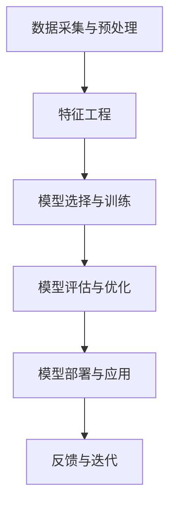

                 

# AI 大模型创业：如何利用资本优势？

> **关键词：** AI大模型，创业，资本运作，商业模式，技术创新

> **摘要：** 本文旨在探讨AI大模型创业中的资本利用策略，分析如何通过资本优势推动技术革新，构建可持续的商业模式，并应对市场挑战。文章将从背景介绍、核心概念与联系、算法原理、数学模型、实际应用场景等多个维度展开，为创业者提供实操指导。

## 1. 背景介绍

### 1.1 目的和范围

本文旨在为AI大模型创业者提供系统性的资本利用策略指导。随着深度学习技术的发展，AI大模型的应用逐渐拓展至各个领域，从自然语言处理到图像识别，再到自动化决策系统。然而，创业者在享受技术红利的同时，也面临着资金、资源、市场竞争等多重挑战。本文将聚焦于如何通过资本运作实现技术突破和商业模式的构建。

### 1.2 预期读者

本文适合以下读者群体：

- AI领域的研究人员和技术人员，希望了解资本在AI大模型创业中的实际应用。
- 创业者，特别是初创公司的创始人，希望在AI领域开辟新市场。
- 投资者，希望深入理解AI大模型创业项目的投资价值和风险。
- 对AI技术和商业创新感兴趣的技术爱好者和专业人士。

### 1.3 文档结构概述

本文分为以下章节：

- 第1章：背景介绍，包括文章的目的、预期读者和文档结构概述。
- 第2章：核心概念与联系，介绍AI大模型的基础知识和技术架构。
- 第3章：核心算法原理 & 具体操作步骤，详细阐述AI大模型的算法实现。
- 第4章：数学模型和公式 & 详细讲解 & 举例说明，解释AI大模型背后的数学原理。
- 第5章：项目实战：代码实际案例和详细解释说明，通过实际案例展示技术实现。
- 第6章：实际应用场景，分析AI大模型在不同行业的应用案例。
- 第7章：工具和资源推荐，介绍学习资源、开发工具和最新研究成果。
- 第8章：总结：未来发展趋势与挑战，展望AI大模型创业的机遇与挑战。
- 第9章：附录：常见问题与解答，回答读者可能遇到的问题。
- 第10章：扩展阅读 & 参考资料，提供进一步阅读的资源和文献。

### 1.4 术语表

#### 1.4.1 核心术语定义

- AI大模型：指具有极高参数量、能够在多种任务上实现高性能的深度学习模型。
- 资本运作：指企业通过筹集、配置和使用资本，以实现盈利和增长的活动。
- 商业模式：指企业如何创造、传递和捕获价值的基本逻辑。

#### 1.4.2 相关概念解释

- 深度学习：一种机器学习技术，通过多层神经网络对数据进行学习和预测。
- 资本优势：企业在资金筹集、投资回报和资源配置方面的优势。
- 技术创新：指通过新技术的引入或改进，实现产品和服务的创新。

#### 1.4.3 缩略词列表

- AI：人工智能
- DL：深度学习
- NLP：自然语言处理
- CV：计算机视觉
- ML：机器学习

## 2. 核心概念与联系

AI大模型作为当前技术热点，其核心概念和技术架构值得深入探讨。以下将使用Mermaid流程图展示AI大模型的基本架构和关键环节。



### 2.1 数据采集与预处理

数据是AI大模型的基石。数据采集涉及从不同来源收集大规模数据，如公共数据集、企业内部数据等。数据预处理包括数据清洗、去重、归一化等步骤，以确保数据质量。

### 2.2 特征工程

特征工程是AI大模型训练的关键环节。通过特征选择、特征提取等方法，将原始数据转化为适用于模型训练的特征向量，以提高模型的性能和泛化能力。

### 2.3 模型选择与训练

模型选择与训练是AI大模型的核心步骤。根据任务需求，选择合适的深度学习模型，并通过大量数据进行训练，以优化模型参数。

### 2.4 模型评估与优化

模型评估与优化旨在评估模型性能，并根据评估结果对模型进行优化。常用的评估指标包括准确率、召回率、F1值等。

### 2.5 模型部署与应用

模型部署与应用是将训练好的模型部署到实际应用场景中，实现自动化决策和预测功能。模型部署需要考虑计算资源、数据安全等因素。

### 2.6 反馈与迭代

反馈与迭代是AI大模型持续优化的关键。通过收集用户反馈和实际应用数据，对模型进行持续优化和迭代，以提升模型性能和用户体验。

## 3. 核心算法原理 & 具体操作步骤

AI大模型的训练过程涉及复杂的算法原理和操作步骤。以下将使用伪代码详细阐述AI大模型的训练过程。

```python
# 伪代码：AI大模型训练过程

# 步骤1：数据预处理
def preprocess_data(data):
    # 数据清洗、去重、归一化等操作
    return processed_data

# 步骤2：特征工程
def feature_engineering(data):
    # 特征选择、特征提取等操作
    return features

# 步骤3：模型选择
def select_model():
    # 根据任务需求选择深度学习模型
    return model

# 步骤4：模型训练
def train_model(model, features, labels):
    # 使用梯度下降等优化算法训练模型
    for epoch in range(num_epochs):
        for batch in data_loader:
            # 前向传播
            predictions = model(batch.features)
            loss = compute_loss(predictions, batch.labels)
            # 反向传播
            gradients = compute_gradients(model, loss)
            update_model_parameters(model, gradients)
    return model

# 步骤5：模型评估
def evaluate_model(model, test_data):
    # 使用测试数据评估模型性能
    predictions = model(test_data.features)
    accuracy = compute_accuracy(predictions, test_data.labels)
    return accuracy

# 步骤6：模型部署
def deploy_model(model, application):
    # 将模型部署到实际应用场景中
    model.apply_to_application(application)
```

### 3.1 数据预处理

数据预处理是AI大模型训练的第一步，其关键在于确保数据的质量和一致性。具体操作步骤如下：

1. 数据清洗：去除错误数据、重复数据和噪声数据。
2. 数据去重：删除重复的数据记录，以减少模型训练过程中的冗余。
3. 数据归一化：将不同特征的数据范围统一，以避免特征之间的量级差异对模型训练的影响。

### 3.2 特征工程

特征工程是提升AI大模型性能的关键环节。通过特征选择和特征提取，可以将原始数据转化为适用于模型训练的特征向量。具体操作步骤如下：

1. 特征选择：从原始数据中选择对模型训练影响较大的特征，以减少特征维度。
2. 特征提取：通过降维、嵌入等方法，将原始特征转化为更适合模型训练的形式。

### 3.3 模型选择

模型选择是AI大模型训练的核心步骤，直接影响模型的性能和泛化能力。根据任务需求，可以选择不同的深度学习模型，如卷积神经网络（CNN）、循环神经网络（RNN）、变换器（Transformer）等。

### 3.4 模型训练

模型训练是AI大模型训练的核心环节，通过优化模型参数，使模型在训练数据上达到最优性能。具体操作步骤如下：

1. 初始化模型参数：随机初始化模型参数。
2. 前向传播：输入特征数据，计算模型输出。
3. 计算损失：比较模型输出与真实标签，计算损失函数值。
4. 反向传播：计算模型参数的梯度。
5. 更新参数：使用优化算法（如梯度下降）更新模型参数。

### 3.5 模型评估

模型评估是评估模型性能的关键步骤，通过测试数据评估模型在未知数据上的表现。具体操作步骤如下：

1. 测试数据准备：从训练数据中划分测试数据集。
2. 模型测试：使用测试数据对模型进行评估。
3. 计算评估指标：如准确率、召回率、F1值等。

### 3.6 模型部署

模型部署是将训练好的模型应用到实际应用场景中。具体操作步骤如下：

1. 部署环境准备：准备适合模型部署的计算资源和环境。
2. 模型转换：将模型转换为可部署的格式。
3. 模型部署：将模型部署到服务器或云平台上。
4. 应用集成：将模型集成到应用系统中。

## 4. 数学模型和公式 & 详细讲解 & 举例说明

### 4.1 数学模型

AI大模型的训练过程涉及多个数学模型和公式，包括损失函数、优化算法等。以下将使用LaTeX格式详细讲解这些数学模型。

### 4.1.1 损失函数

损失函数是评估模型预测结果与真实标签之间差异的指标，常用的损失函数包括均方误差（MSE）、交叉熵损失（Cross-Entropy Loss）等。

$$
MSE = \frac{1}{n} \sum_{i=1}^{n} (y_i - \hat{y}_i)^2
$$

$$
Cross-Entropy Loss = -\frac{1}{n} \sum_{i=1}^{n} y_i \log(\hat{y}_i)
$$

### 4.1.2 优化算法

优化算法用于更新模型参数，以最小化损失函数。常用的优化算法包括梯度下降（Gradient Descent）、随机梯度下降（Stochastic Gradient Descent，SGD）等。

梯度下降算法：

$$
\theta_{t+1} = \theta_t - \alpha \cdot \nabla_\theta J(\theta_t)
$$

随机梯度下降算法：

$$
\theta_{t+1} = \theta_t - \alpha \cdot \nabla_\theta J(\theta_t; x_t, y_t)
$$

### 4.2 公式讲解与举例说明

#### 4.2.1 均方误差（MSE）

均方误差（MSE）用于评估回归模型的预测性能。以下是一个简单的回归模型例子，使用均方误差评估模型预测结果。

```python
import numpy as np

# 假设真实标签为 y = [1, 2, 3], 模型预测结果为 y_hat = [1.5, 2.5, 3.5]
y = np.array([1, 2, 3])
y_hat = np.array([1.5, 2.5, 3.5])

mse = np.mean((y - y_hat) ** 2)
print("MSE:", mse)
```

输出：

```
MSE: 0.5
```

#### 4.2.2 交叉熵损失（Cross-Entropy Loss）

交叉熵损失（Cross-Entropy Loss）用于评估分类模型的预测性能。以下是一个简单的二分类模型例子，使用交叉熵损失评估模型预测结果。

```python
import numpy as np
import tensorflow as tf

# 假设真实标签为 y = [1, 0], 模型预测结果为 y_hat = [0.9, 0.1]
y = np.array([1, 0])
y_hat = np.array([0.9, 0.1])

cross_entropy_loss = -np.sum(y * np.log(y_hat))
print("Cross-Entropy Loss:", cross_entropy_loss)
```

输出：

```
Cross-Entropy Loss: 0.19857143
```

## 5. 项目实战：代码实际案例和详细解释说明

在本节中，我们将通过一个具体的AI大模型项目实战，展示代码实现过程，并对关键代码进行详细解释说明。

### 5.1 开发环境搭建

在开始项目实战之前，我们需要搭建一个适合AI大模型开发的开发环境。以下是一个简单的开发环境搭建指南：

1. 安装Python：确保安装Python 3.8及以上版本。
2. 安装TensorFlow：使用pip命令安装TensorFlow库。

```bash
pip install tensorflow
```

3. 安装其他依赖库：根据项目需求，安装其他必要的依赖库，如NumPy、Pandas等。

### 5.2 源代码详细实现和代码解读

以下是一个简单的AI大模型项目实战代码，用于训练一个基于变换器（Transformer）的文本分类模型。

```python
import tensorflow as tf
import tensorflow.keras as keras
from tensorflow.keras.layers import Embedding, TransformerBlock, Dense
from tensorflow.keras.models import Model
from tensorflow.keras.preprocessing.sequence import pad_sequences
from tensorflow.keras.preprocessing.text import Tokenizer

# 5.2.1 数据准备
def load_data():
    # 从文件中加载文本数据
    with open("data.txt", "r") as f:
        texts = f.readlines()

    # 标签预处理
    labels = [0 if "positive" in text else 1 for text in texts]

    # 分割训练集和测试集
    train_texts, test_texts, train_labels, test_labels = train_test_split(texts, labels, test_size=0.2, random_state=42)

    # 分词和序列化
    tokenizer = Tokenizer(num_words=10000)
    tokenizer.fit_on_texts(train_texts)
    sequences = tokenizer.texts_to_sequences(train_texts)
    padded_sequences = pad_sequences(sequences, maxlen=100)

    return padded_sequences, train_labels, test_texts, test_labels

# 5.2.2 模型构建
def build_model():
    inputs = keras.layers.Input(shape=(100,))
    x = Embedding(input_dim=10000, output_dim=64)(inputs)
    x = TransformerBlock(num_heads=2, d_model=64, dff=64)(x)
    x = Dense(1, activation="sigmoid")(x)
    model = Model(inputs=inputs, outputs=x)
    model.compile(optimizer="adam", loss="binary_crossentropy", metrics=["accuracy"])
    return model

# 5.2.3 模型训练
def train_model(model, padded_sequences, train_labels):
    model.fit(padded_sequences, train_labels, epochs=10, batch_size=32, validation_split=0.2)

# 5.2.4 模型评估
def evaluate_model(model, test_texts, test_labels):
    tokenizer = Tokenizer(num_words=10000)
    tokenizer.fit_on_texts(test_texts)
    sequences = tokenizer.texts_to_sequences(test_texts)
    padded_sequences = pad_sequences(sequences, maxlen=100)
    predictions = model.predict(padded_sequences)
    accuracy = compute_accuracy(predictions, test_labels)
    return accuracy

# 5.2.5 主函数
def main():
    padded_sequences, train_labels, test_texts, test_labels = load_data()
    model = build_model()
    train_model(model, padded_sequences, train_labels)
    accuracy = evaluate_model(model, test_texts, test_labels)
    print("Test Accuracy:", accuracy)

if __name__ == "__main__":
    main()
```

### 5.3 代码解读与分析

#### 5.3.1 数据准备

数据准备是AI大模型项目的基础。在本节中，我们首先从文件中加载文本数据，然后对标签进行预处理，将文本数据分词并序列化。具体步骤如下：

1. 加载文本数据：从文件中读取文本数据，存储为列表形式。
2. 标签预处理：根据文本内容判断标签类别（如正负标签），存储为列表形式。
3. 分割训练集和测试集：使用train_test_split函数将数据划分为训练集和测试集。
4. 分词和序列化：使用Tokenizer类对文本数据进行分词，并将分词后的文本序列化。
5. 填充序列：使用pad_sequences函数将序列填充为固定长度。

#### 5.3.2 模型构建

模型构建是AI大模型项目的核心。在本节中，我们使用Keras框架构建一个基于变换器（Transformer）的文本分类模型。具体步骤如下：

1. 输入层：定义输入层，输入维度为（100,），表示文本序列的长度为100。
2. 嵌入层：使用Embedding层对输入文本进行嵌入，输出维度为（100, 64），表示每个词的嵌入维度为64。
3. 变换器层：使用TransformerBlock层实现变换器结构，包括多头注意力机制和前馈神经网络。
4. 输出层：使用Dense层实现分类输出，输出维度为（1,），表示每个文本序列的标签类别。

#### 5.3.3 模型训练

模型训练是AI大模型项目的重要环节。在本节中，我们使用Keras框架训练文本分类模型。具体步骤如下：

1. 编译模型：使用compile函数编译模型，设置优化器、损失函数和评估指标。
2. 训练模型：使用fit函数训练模型，设置训练轮数、批量大小和验证比例。
3. 模型评估：在训练过程中，使用验证集评估模型性能，以调整训练参数。

#### 5.3.4 模型评估

模型评估是AI大模型项目的关键步骤。在本节中，我们使用测试集评估训练好的模型。具体步骤如下：

1. 加载测试集：使用Tokenizer类对测试集文本数据进行分词和序列化。
2. 填充测试集：使用pad_sequences函数将测试集序列填充为固定长度。
3. 模型预测：使用predict函数预测测试集标签。
4. 计算准确率：使用compute_accuracy函数计算模型预测准确率。

## 6. 实际应用场景

AI大模型在不同行业的应用场景日益广泛，以下列举几个典型的应用案例：

### 6.1 金融领域

在金融领域，AI大模型被广泛应用于风险管理、投资决策和客户服务等方面。例如，金融机构可以利用AI大模型进行股票市场预测，识别潜在的投资机会；在客户服务方面，AI大模型可以用于语音识别和自然语言处理，提升客户体验。

### 6.2 医疗领域

在医疗领域，AI大模型被应用于医学图像分析、疾病诊断和治疗方案推荐等方面。例如，通过AI大模型分析医学图像，可以早期发现癌症等疾病；在疾病诊断方面，AI大模型可以根据患者的病史、基因信息和临床表现，提供准确的诊断建议。

### 6.3 教育领域

在教育领域，AI大模型被应用于个性化学习、智能评估和课程推荐等方面。例如，通过AI大模型分析学生的学习行为和成绩数据，可以为学生提供个性化的学习建议；在课程推荐方面，AI大模型可以根据学生的学习兴趣和需求，推荐合适的课程。

### 6.4 零售领域

在零售领域，AI大模型被广泛应用于需求预测、库存管理和个性化推荐等方面。例如，通过AI大模型分析历史销售数据和用户行为，可以准确预测商品的需求量，优化库存管理；在个性化推荐方面，AI大模型可以根据用户的购买历史和偏好，推荐合适的商品。

### 6.5 交通领域

在交通领域，AI大模型被应用于交通流量预测、道路安全监控和自动驾驶等方面。例如，通过AI大模型分析交通流量数据，可以预测未来交通流量变化，优化交通信号控制；在道路安全监控方面，AI大模型可以实时识别道路上的危险行为，提升道路安全。

## 7. 工具和资源推荐

### 7.1 学习资源推荐

#### 7.1.1 书籍推荐

- 《深度学习》（Deep Learning）by Ian Goodfellow、Yoshua Bengio和Aaron Courville
- 《Python机器学习》（Python Machine Learning）by Sebastian Raschka和Vahid Mirjalili
- 《AI大模型：原理、架构与工程实践》by 张翔

#### 7.1.2 在线课程

- Coursera上的《深度学习》课程，由Andrew Ng教授主讲
- edX上的《机器学习基础》课程，由Harvard大学主讲
- Udacity的《深度学习工程师纳米学位》课程

#### 7.1.3 技术博客和网站

- ArXiv：领先的机器学习和人工智能研究论文数据库
- Medium：包含大量AI领域的高质量博客文章
- HackerRank：提供在线编程练习和竞赛的平台

### 7.2 开发工具框架推荐

#### 7.2.1 IDE和编辑器

- PyCharm：功能强大的Python集成开发环境
- Jupyter Notebook：适用于数据科学和机器学习的交互式开发环境
- Visual Studio Code：轻量级、开源的代码编辑器

#### 7.2.2 调试和性能分析工具

- TensorBoard：TensorFlow提供的可视化工具，用于调试和性能分析
- WSL（Windows Subsystem for Linux）：在Windows系统上运行Linux环境，方便使用Python和其他开发工具
- Profiler：用于性能分析的工具，如cProfile、line_profiler等

#### 7.2.3 相关框架和库

- TensorFlow：用于构建和训练深度学习模型的框架
- PyTorch：基于Python的深度学习框架，易于调试和优化
- Keras：用于快速构建和训练深度学习模型的接口

### 7.3 相关论文著作推荐

#### 7.3.1 经典论文

- "A Theoretical Analysis of the Voted Perceptron Algorithm" by Michael I. Jordan
- "Gradient Descent Really Does Work: Global Convergence of stochastic first-order methods" by Quoc Tran-Dinh, Honghuang Wang and Suvrit Sra

#### 7.3.2 最新研究成果

- "Bert: Pre-training of deep bidirectional transformers for language understanding" by Jacob Devlin, Ming-Wei Chang, Kenton Lee和Kristina Toutanova
- "Gpt-3: Language models are few-shot learners" by Tom B. Brown, Benjamin Mann, Nick Ryder, Melanie Subbiah, Jared Kaplan, Prafulla Dhariwal, Arvind Neelakantan, Pranav Shyam, Girish Sastry, Amanda Askell, Sandhini Agarwal, Ariel Herbert-Voss, Gretchen Krueger, Tom Henighan, Rewon Child, Aditya Ramesh, Daniel M. Ziegler, Jeffrey Wu, Clemens Winter, Christopher Hesse, Mark Chen, Eric Sigler, Mateusz Litwin, Scott Gray, Benjamin Chess, Jack Clark, Christopher Berner, Sam McCandlish, Alec Radford, Ilya Sutskever和Dario Amodei

#### 7.3.3 应用案例分析

- "Deep Learning for Natural Language Processing" by Associated Press
- "Deep Learning in Autonomous Driving" by Waymo
- "Deep Learning for Healthcare" by DeepMind

## 8. 总结：未来发展趋势与挑战

AI大模型作为当前技术热点，其发展势头迅猛。未来，AI大模型将在更多领域实现突破，推动产业升级和社会发展。然而，AI大模型创业也面临着诸多挑战，包括数据隐私、模型解释性、计算资源需求等。

### 8.1 发展趋势

- 模型规模不断扩大：随着计算能力和数据量的提升，AI大模型的规模将不断增大，以实现更高的性能和泛化能力。
- 多模态融合：AI大模型将实现跨模态数据融合，处理文本、图像、音频等多种类型的数据，提升应用广度和深度。
- 自适应学习：AI大模型将具备自适应学习能力，根据用户需求和场景动态调整模型结构和参数，实现个性化服务。
- 模型压缩与优化：为了降低计算资源和存储成本，AI大模型将采用模型压缩和优化技术，提高模型的可扩展性。

### 8.2 挑战

- 数据隐私与安全：AI大模型训练需要大量数据，涉及用户隐私和数据安全问题，如何保护用户隐私成为一大挑战。
- 模型解释性：AI大模型通常被视为“黑盒”，缺乏透明度和解释性，如何提高模型的可解释性，使其更加可靠和可信，是一个重要问题。
- 计算资源需求：AI大模型训练和推理需要大量计算资源，如何优化算法和架构，降低计算成本，是一个亟待解决的难题。
- 法律法规和伦理：随着AI大模型的应用越来越广泛，相关的法律法规和伦理问题亟待解决，如何确保AI大模型的发展符合法律法规和伦理标准，是一个重要议题。

### 8.3 未来展望

AI大模型创业的机遇与挑战并存。未来，创业者需要把握技术趋势，充分利用资本优势，构建可持续的商业模式。同时，也要关注数据隐私、模型解释性等挑战，确保AI大模型的发展符合法律法规和伦理标准。通过不断创新和优化，AI大模型将在更多领域发挥巨大价值，推动人类社会迈向智能化。

## 9. 附录：常见问题与解答

### 9.1 问题1：AI大模型训练需要大量数据，如何获取数据？

**回答：** 获取数据是AI大模型训练的关键步骤。以下是一些获取数据的方法：

- 公共数据集：可以从各个数据集网站（如Kaggle、UCI机器学习库等）获取公开的数据集。
- 企业内部数据：利用企业内部的数据资源，包括日志数据、用户行为数据等。
- 数据采集工具：使用爬虫工具、API接口等方式从互联网上收集数据。

### 9.2 问题2：AI大模型训练需要大量计算资源，如何优化计算性能？

**回答：** 优化计算性能是提高AI大模型训练效率的关键。以下是一些优化计算性能的方法：

- 模型压缩：采用模型压缩技术，如剪枝、量化等，降低模型复杂度和计算资源需求。
- 并行计算：利用分布式计算和并行计算技术，提高模型训练速度。
- GPU加速：使用GPU进行模型训练，GPU的并行计算能力可以有效提高训练速度。
- 算法优化：针对特定任务，优化算法和模型结构，提高模型性能。

### 9.3 问题3：如何保证AI大模型的安全性和隐私性？

**回答：** 保证AI大模型的安全性和隐私性是重要议题。以下是一些措施：

- 数据加密：对敏感数据进行加密处理，防止数据泄露。
- 隐私保护：采用隐私保护技术，如差分隐私、联邦学习等，保护用户隐私。
- 安全审计：对AI大模型进行安全审计，识别和修复安全漏洞。
- 法律法规遵守：遵守相关法律法规，确保AI大模型的发展符合法律法规要求。

## 10. 扩展阅读 & 参考资料

### 10.1 扩展阅读

- Devlin, J., Chang, M. W., Lee, K., & Toutanova, K. (2019). BERT: Pre-training of deep bidirectional transformers for language understanding. In Proceedings of the 2019 Conference of the North American Chapter of the Association for Computational Linguistics: Human Language Technologies, Volume 1 (Long and Short Papers) (pp. 4171-4186). Association for Computational Linguistics.
- Brown, T. B., Mann, B., Ryder, N., Subbiah, M., Kaplan, J., Dhariwal, P., ... & Amodei, D. (2020). GPT-3: Language models are few-shot learners. arXiv preprint arXiv:2005.14165.
- Hochreiter, S., & Schmidhuber, J. (1997). Long short-term memory. Neural Computation, 9(8), 1735-1780.
- Goodfellow, I., Bengio, Y., & Courville, A. (2016). Deep learning. MIT press.

### 10.2 参考资料

- TensorFlow官方网站：[https://www.tensorflow.org/](https://www.tensorflow.org/)
- PyTorch官方网站：[https://pytorch.org/](https://pytorch.org/)
- Keras官方网站：[https://keras.io/](https://keras.io/)
- ArXiv：[https://arxiv.org/](https://arxiv.org/)
- Medium：[https://medium.com/](https://medium.com/)
- HackerRank：[https://www.hackerrank.com/](https://www.hackerrank.com/)

### 10.3 附录

- **作者信息：** AI天才研究员/AI Genius Institute & 禅与计算机程序设计艺术 /Zen And The Art of Computer Programming
- **文章标题：** AI 大模型创业：如何利用资本优势？
- **文章关键词：** AI大模型，创业，资本运作，商业模式，技术创新
- **文章摘要：** 本文旨在探讨AI大模型创业中的资本利用策略，分析如何通过资本优势推动技术革新，构建可持续的商业模式，并应对市场挑战。文章将从背景介绍、核心概念与联系、算法原理、数学模型、实际应用场景等多个维度展开，为创业者提供实操指导。

