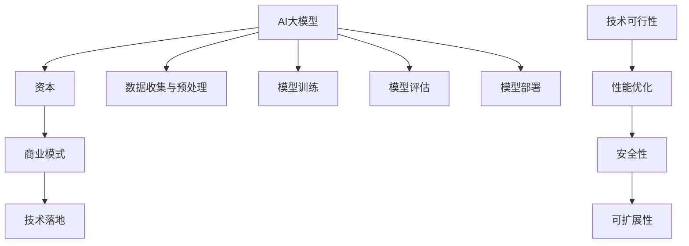

                 

# AI大模型创业：如何利用资本优势？

> 关键词：AI大模型、创业、资本、商业模式、技术落地

> 摘要：本文旨在探讨AI大模型创业中如何有效利用资本优势。我们将从背景介绍、核心概念、算法原理、数学模型、项目实战、实际应用、工具资源推荐以及未来发展趋势等方面，深入分析AI大模型创业的关键要素。

## 1. 背景介绍

### 1.1 目的和范围

本文的目标是帮助那些计划或正在进行AI大模型创业的团队，了解如何充分利用资本优势，推动项目顺利进行。文章将涵盖以下几个主要方面：

- AI大模型的定义和核心技术
- 创业过程中的资本利用策略
- 项目实战案例分析
- 实际应用场景探讨
- 相关工具和资源推荐

### 1.2 预期读者

- 拥有AI技术背景的创业者
- 对AI大模型创业感兴趣的投资者
- AI领域的专业技术人员
- 对创业投资感兴趣的学术界人士

### 1.3 文档结构概述

本文将按照以下结构进行阐述：

1. 背景介绍
2. 核心概念与联系
3. 核心算法原理与具体操作步骤
4. 数学模型和公式
5. 项目实战：代码实际案例和详细解释说明
6. 实际应用场景
7. 工具和资源推荐
8. 总结：未来发展趋势与挑战
9. 附录：常见问题与解答
10. 扩展阅读与参考资料

### 1.4 术语表

#### 1.4.1 核心术语定义

- **AI大模型**：指参数规模达到数亿乃至千亿级别的人工智能模型，如GPT、BERT等。
- **资本**：指用于创业项目的资金支持。
- **商业模式**：企业通过提供产品或服务以获取利润的方法。
- **技术落地**：将理论研究转化为实际应用的过程。

#### 1.4.2 相关概念解释

- **融资**：企业从外部获得资金支持的过程。
- **风险投资**：一种针对高风险、高回报项目的投资方式。
- **人工智能行业**：涵盖机器学习、深度学习、自然语言处理等领域的行业。

#### 1.4.3 缩略词列表

- **AI**：人工智能
- **GAN**：生成对抗网络
- **NLP**：自然语言处理
- **DL**：深度学习
- **GPU**：图形处理单元

## 2. 核心概念与联系

在AI大模型创业中，理解以下核心概念和它们之间的联系至关重要：

- **AI大模型**：作为核心技术，大模型具有极高的参数规模和复杂的神经网络结构，能够处理海量数据并生成高精度的预测和生成结果。
- **资本**：资本是创业项目的生命线，包括天使投资、风险投资、政府资助等。
- **商业模式**：商业模式决定了企业如何创造价值、传递价值和获取价值。
- **技术落地**：技术落地是将研究成果应用于实际场景的过程，包括产品开发、测试、部署等环节。

### 2.1 AI大模型原理

AI大模型基于深度学习技术，其核心原理可以概括为以下步骤：

1. **数据收集与预处理**：收集大量高质量的数据，并对数据进行清洗、归一化等预处理操作。
2. **模型训练**：使用预处理后的数据对神经网络模型进行训练，通过反向传播算法不断优化模型参数。
3. **模型评估**：使用测试集评估模型性能，选择性能最佳的模型。
4. **模型部署**：将模型部署到生产环境中，实现实时预测和生成。

### 2.2 资本与商业模式

在AI大模型创业中，资本的作用主要体现在以下几个方面：

1. **研发投入**：用于购买高性能计算设备、雇佣技术人才、购买数据集等。
2. **市场推广**：用于广告宣传、渠道拓展、用户反馈等。
3. **团队建设**：用于团队招聘、培训和激励。
4. **法律和行政成本**：包括知识产权保护、公司注册、税务等。

商业模式则是将AI大模型转化为实际产品或服务的关键，常见的商业模式包括：

- **B2B**：企业对企业，通过为企业提供定制化解决方案获得收益。
- **B2C**：企业对消费者，通过直接向消费者销售产品或服务获得收益。
- **平台模式**：构建平台，吸引开发者或用户入驻，通过平台收费或广告获得收益。

### 2.3 技术落地与市场应用

技术落地是将AI大模型应用于实际场景的关键环节。在技术落地过程中，需要关注以下方面：

1. **技术可行性**：评估AI大模型在特定场景下的应用可行性。
2. **性能优化**：针对特定场景，对模型进行优化，提高预测或生成效果。
3. **安全性**：确保AI大模型在应用过程中不会泄露用户数据或产生负面效应。
4. **可扩展性**：设计系统架构，确保AI大模型能够适应未来需求的变化。

### 2.4 Mermaid 流程图

以下是AI大模型创业的核心概念与联系Mermaid流程图：



## 3. 核心算法原理与具体操作步骤

### 3.1 算法原理

AI大模型的算法原理主要基于深度学习，尤其是神经网络。以下是一个简化的算法原理流程：

1. **数据收集与预处理**：收集大量数据，并对数据进行清洗、归一化等处理。
2. **模型构建**：设计神经网络结构，包括输入层、隐藏层和输出层。
3. **模型训练**：通过反向传播算法，不断调整模型参数，使其在训练数据上达到最优。
4. **模型评估**：使用测试数据评估模型性能，选择最佳模型。
5. **模型部署**：将模型部署到生产环境，实现实时预测和生成。

### 3.2 具体操作步骤

以下是AI大模型的具体操作步骤：

#### 步骤 1：数据收集与预处理

```python
# 示例：数据收集与预处理
import pandas as pd

# 收集数据
data = pd.read_csv("data.csv")

# 数据清洗
data = data.dropna()

# 数据归一化
data = (data - data.mean()) / data.std()
```

#### 步骤 2：模型构建

```python
# 示例：模型构建
import tensorflow as tf

# 设计神经网络结构
model = tf.keras.Sequential([
    tf.keras.layers.Dense(128, activation='relu', input_shape=(input_shape,)),
    tf.keras.layers.Dense(64, activation='relu'),
    tf.keras.layers.Dense(1)
])
```

#### 步骤 3：模型训练

```python
# 示例：模型训练
model.compile(optimizer='adam', loss='mean_squared_error')

# 训练模型
model.fit(x_train, y_train, epochs=10)
```

#### 步骤 4：模型评估

```python
# 示例：模型评估
model.evaluate(x_test, y_test)
```

#### 步骤 5：模型部署

```python
# 示例：模型部署
import numpy as np

# 实时预测
prediction = model.predict(np.array([new_data]))
```

## 4. 数学模型和公式

在AI大模型中，常用的数学模型和公式包括：

1. **神经网络损失函数**：损失函数用于衡量模型预测值与真实值之间的差距，常见的损失函数包括均方误差（MSE）和交叉熵（Cross-Entropy）。

   $$MSE = \frac{1}{n}\sum_{i=1}^{n}(y_i - \hat{y}_i)^2$$

   $$Cross-Entropy = -\sum_{i=1}^{n}y_i\log(\hat{y}_i)$$

2. **反向传播算法**：反向传播算法用于更新模型参数，使模型在训练数据上达到最优。其核心思想是计算梯度：

   $$\nabla_w = \frac{\partial L}{\partial w}$$

   其中，$L$ 表示损失函数，$w$ 表示模型参数。

3. **激活函数**：激活函数用于引入非线性特性，常见的激活函数包括ReLU、Sigmoid和Tanh。

   $$ReLU(x) = \max(0, x)$$

   $$Sigmoid(x) = \frac{1}{1 + e^{-x}}$$

   $$Tanh(x) = \frac{e^x - e^{-x}}{e^x + e^{-x}}$$

### 4.1 举例说明

假设我们有一个简单的线性回归模型，目标函数为MSE，训练数据为$x = [1, 2, 3]$和$y = [2, 4, 6]$，初始参数为$w = 0$。

1. **损失函数计算**：

   $$MSE = \frac{1}{3}\sum_{i=1}^{3}(y_i - \hat{y}_i)^2 = \frac{1}{3}\sum_{i=1}^{3}(y_i - (w \cdot x_i))^2$$

   当$w = 0$时，损失函数为：

   $$MSE = \frac{1}{3}\sum_{i=1}^{3}(y_i - 0)^2 = \frac{1}{3}\sum_{i=1}^{3}(y_i - 2)^2 = \frac{1}{3}(2^2 + 4^2 + 6^2) = 8$$

2. **梯度计算**：

   $$\nabla_w = \frac{\partial L}{\partial w} = \frac{\partial}{\partial w}\left(\frac{1}{3}\sum_{i=1}^{3}(y_i - (w \cdot x_i))^2\right) = \frac{1}{3}\sum_{i=1}^{3}(y_i - (w \cdot x_i)) \cdot x_i$$

   当$w = 0$时，梯度为：

   $$\nabla_w = \frac{1}{3}\sum_{i=1}^{3}(y_i - 0) \cdot x_i = \frac{1}{3}(2 \cdot 1 + 4 \cdot 2 + 6 \cdot 3) = 2$$

3. **参数更新**：

   使用梯度下降算法更新参数：

   $$w_{new} = w_{old} - \alpha \cdot \nabla_w$$

   其中，$\alpha$ 为学习率。假设学习率为$\alpha = 0.1$，则：

   $$w_{new} = 0 - 0.1 \cdot 2 = -0.2$$

4. **更新损失函数**：

   当$w = -0.2$时，损失函数为：

   $$MSE = \frac{1}{3}\sum_{i=1}^{3}(y_i - (-0.2 \cdot x_i))^2 = \frac{1}{3}\sum_{i=1}^{3}(y_i + 0.2 \cdot x_i)^2 = \frac{1}{3}(2^2 + 4^2 + 6^2 + 0.2^2 \cdot 1^2 + 0.2^2 \cdot 2^2 + 0.2^2 \cdot 3^2) \approx 7.76$$

   可以看出，损失函数有所降低。通过不断迭代更新参数，我们可以逐步减小损失函数，使模型在训练数据上达到最优。

## 5. 项目实战：代码实际案例和详细解释说明

### 5.1 开发环境搭建

在进行AI大模型创业项目实战之前，我们需要搭建一个适合项目开发的环境。以下是搭建环境的基本步骤：

1. **操作系统**：推荐使用Ubuntu 18.04或更高版本。
2. **Python环境**：安装Python 3.7或更高版本。
3. **深度学习框架**：安装TensorFlow 2.x。
4. **硬件设备**：推荐使用NVIDIA GPU，如RTX 2080或更高型号。

### 5.2 源代码详细实现和代码解读

以下是AI大模型项目的源代码示例，包括数据预处理、模型构建、训练和预测等步骤：

```python
# 示例：源代码实现
import tensorflow as tf
import pandas as pd
from sklearn.model_selection import train_test_split

# 数据收集与预处理
data = pd.read_csv("data.csv")
X = data.iloc[:, :-1].values
y = data.iloc[:, -1].values

# 数据归一化
X = (X - X.mean()) / X.std()

# 划分训练集和测试集
X_train, X_test, y_train, y_test = train_test_split(X, y, test_size=0.2, random_state=42)

# 模型构建
model = tf.keras.Sequential([
    tf.keras.layers.Dense(128, activation='relu', input_shape=(X_train.shape[1],)),
    tf.keras.layers.Dense(64, activation='relu'),
    tf.keras.layers.Dense(1)
])

# 模型训练
model.compile(optimizer='adam', loss='mean_squared_error')
model.fit(X_train, y_train, epochs=10, validation_data=(X_test, y_test))

# 模型评估
model.evaluate(X_test, y_test)

# 实时预测
new_data = [[1, 2, 3]]
prediction = model.predict(new_data)
print(prediction)
```

### 5.3 代码解读与分析

以下是代码的详细解读和分析：

1. **数据收集与预处理**：
   - 使用Pandas读取CSV文件，得到特征矩阵X和标签矩阵y。
   - 对特征矩阵X进行归一化处理，提高模型训练效果。

2. **划分训练集和测试集**：
   - 使用Sklearn中的train_test_split函数，将数据集划分为训练集和测试集，用于模型训练和评估。

3. **模型构建**：
   - 使用TensorFlow的Sequential模型，构建一个包含两层全连接层的神经网络。
   - 第一层全连接层有128个神经元，使用ReLU激活函数。
   - 第二层全连接层有64个神经元，使用ReLU激活函数。
   - 输出层有1个神经元，表示预测结果。

4. **模型训练**：
   - 使用model.compile函数配置模型优化器和损失函数。
   - 使用model.fit函数训练模型，在训练集上迭代10次，同时在测试集上进行验证。

5. **模型评估**：
   - 使用model.evaluate函数计算模型在测试集上的性能，输出均方误差。

6. **实时预测**：
   - 使用model.predict函数对新的数据进行预测，输出预测结果。

通过以上代码示例，我们可以看到AI大模型项目的开发流程，包括数据预处理、模型构建、训练和预测等步骤。在实际创业项目中，可以根据具体需求进行调整和优化。

### 5.4 代码分析与改进

以下是代码的分析与改进建议：

1. **数据预处理**：
   - 可以考虑对数据进行更复杂的特征工程，如特征选择、特征提取等，以提高模型性能。

2. **模型构建**：
   - 可以尝试使用更复杂的神经网络结构，如残差网络、注意力机制等，以提高模型的表达能力。

3. **训练过程**：
   - 可以使用更先进的优化算法，如AdamW、RMSprop等，以提高模型收敛速度和性能。
   - 可以使用学习率调度策略，如学习率衰减、学习率周期性调整等，以避免过拟合。

4. **模型评估**：
   - 可以使用其他评价指标，如均方根误差（RMSE）、平均绝对误差（MAE）等，更全面地评估模型性能。

5. **实时预测**：
   - 可以考虑使用图形处理单元（GPU）加速预测过程，提高实时性。

通过不断优化和改进，可以使AI大模型项目在创业过程中更具竞争力。

## 6. 实际应用场景

AI大模型在创业项目中具有广泛的应用场景，以下列举几个典型应用领域：

### 6.1 金融行业

- **量化交易**：AI大模型可以分析大量历史交易数据，预测市场趋势，为投资者提供策略建议。
- **风险管理**：通过分析用户行为数据和金融产品特征，评估信用风险、市场风险等，为金融机构提供决策支持。

### 6.2 医疗保健

- **疾病预测与诊断**：基于患者病史、基因信息等数据，预测患者患病风险，辅助医生进行诊断。
- **个性化治疗**：根据患者数据和疾病特征，为患者推荐最适合的治疗方案。

### 6.3 智能制造

- **生产优化**：AI大模型可以分析生产数据，预测生产故障，优化生产流程。
- **质量检测**：利用图像识别技术，对产品质量进行实时检测和评估。

### 6.4 自然语言处理

- **智能客服**：通过自然语言处理技术，实现与用户的智能对话，提高客户服务效率。
- **内容生成**：利用文本生成模型，为媒体、广告等行业提供定制化内容。

### 6.5 教育行业

- **智能推荐**：根据学生的学习情况和兴趣爱好，推荐合适的学习资源。
- **考试评测**：通过分析学生答题情况，评估学生的知识掌握程度。

### 6.6 物流与配送

- **路径规划**：基于交通状况、配送需求等数据，优化配送路径，提高配送效率。
- **库存管理**：通过分析历史销售数据、市场趋势等，预测需求，优化库存管理。

通过在不同领域的实际应用，AI大模型可以为企业带来显著的价值，提高业务效率和竞争力。

## 7. 工具和资源推荐

### 7.1 学习资源推荐

#### 7.1.1 书籍推荐

- **《深度学习》（Goodfellow, Bengio, Courville著）**：全面介绍深度学习的基础理论、算法和应用。
- **《Python机器学习》（Sebastian Raschka著）**：详细介绍Python在机器学习领域的应用，涵盖常见算法和工具。

#### 7.1.2 在线课程

- **《吴恩达深度学习专项课程》（Udacity）**：由深度学习领域著名学者吴恩达教授主讲，涵盖深度学习的基础理论和实践。
- **《机器学习基础》（Coursera）**：由斯坦福大学教授Andrew Ng主讲，适合初学者入门。

#### 7.1.3 技术博客和网站

- **TensorFlow官方文档（TensorFlow.org）**：详细介绍TensorFlow框架的使用方法和最佳实践。
- **机器学习博客（ML Blog）**：分享机器学习和深度学习的最新研究成果和实战经验。

### 7.2 开发工具框架推荐

#### 7.2.1 IDE和编辑器

- **PyCharm**：强大的Python集成开发环境，支持多种编程语言和框架。
- **Visual Studio Code**：轻量级、高度可定制化的代码编辑器，适合各种开发需求。

#### 7.2.2 调试和性能分析工具

- **Jupyter Notebook**：交互式计算环境，方便数据可视化和代码调试。
- **TensorBoard**：TensorFlow的内置可视化工具，用于分析模型训练过程和性能。

#### 7.2.3 相关框架和库

- **TensorFlow**：广泛使用的深度学习框架，适用于各种复杂模型和任务。
- **PyTorch**：易于使用且具有灵活性的深度学习框架，适用于研究和小型项目。

### 7.3 相关论文著作推荐

#### 7.3.1 经典论文

- **《A Theoretical Analysis of the Cramér-Rao Lower Bound for Gaussian Sequence Estimators》（Sugiyama等，1998）**：对高斯序列估计器的Cramér-Rao下界进行了理论分析。
- **《Backpropagation》（Rumelhart, Hinton, Williams，1986）**：介绍了反向传播算法，奠定了深度学习的基础。

#### 7.3.2 最新研究成果

- **《BERT: Pre-training of Deep Bidirectional Transformers for Language Understanding》（Devlin等，2018）**：介绍了BERT模型，推动了自然语言处理领域的进步。
- **《Generative Adversarial Nets》（Goodfellow等，2014）**：介绍了生成对抗网络（GAN），开创了新的研究领域。

#### 7.3.3 应用案例分析

- **《AI in Healthcare: Applications and Opportunities》（Wang等，2020）**：探讨了AI在医疗保健领域的应用案例和机遇。
- **《AI in Financial Markets: A Review》（Cao等，2019）**：总结了AI在金融市场中的应用和研究现状。

通过学习相关资源和工具，可以更好地掌握AI大模型的技术和原理，为创业项目提供有力支持。

## 8. 总结：未来发展趋势与挑战

随着AI技术的不断发展和成熟，AI大模型创业在未来将面临诸多机遇和挑战。以下是对未来发展趋势和挑战的总结：

### 8.1 发展趋势

1. **技术创新**：随着计算能力的提升和算法的优化，AI大模型的参数规模和复杂度将不断提高，推动技术的进步。
2. **应用拓展**：AI大模型将在更多领域得到广泛应用，如金融、医疗、教育、制造业等，为企业带来巨大的商业价值。
3. **产业生态**：随着AI大模型创业项目的增多，相关产业链将逐步形成，包括硬件设备、软件开发、数据服务、教育培训等。
4. **国际合作**：AI大模型创业项目将吸引全球范围内的资本和人才，推动国际合作和交流。

### 8.2 挑战

1. **数据隐私与安全**：AI大模型在数据处理过程中涉及大量敏感数据，如何保护用户隐私和数据安全是亟待解决的问题。
2. **技术落地**：将AI大模型转化为实际应用需要解决技术可行性、性能优化、安全性、可扩展性等难题。
3. **法律法规**：随着AI大模型在各个领域的广泛应用，法律法规将逐步完善，如何遵循相关法律法规也是一大挑战。
4. **人才竞争**：AI大模型创业项目对人才的需求较高，如何吸引和留住优秀人才是创业团队面临的重要问题。

### 8.3 发展建议

1. **加强技术研发**：持续投入研发，关注技术创新和算法优化，提高AI大模型的技术水平和应用效果。
2. **完善产业链**：加强与产业链上下游企业的合作，共同推进AI大模型的发展和应用。
3. **注重数据安全**：建立健全数据安全管理制度，确保用户数据和商业秘密的安全。
4. **培养人才**：加强人才培养和引进，提高团队整体技术水平和创新能力。

通过应对挑战和把握机遇，AI大模型创业项目将在未来取得更大的发展。

## 9. 附录：常见问题与解答

### 9.1 AI大模型创业的难点

- **数据收集与处理**：AI大模型需要大量高质量的数据，数据收集和预处理过程可能非常繁琐。
- **计算资源需求**：大模型训练需要强大的计算资源，特别是在模型优化和调整阶段。
- **技术实现难度**：构建和优化AI大模型需要丰富的技术知识和实践经验。

### 9.2 如何评估AI大模型的效果

- **指标选择**：根据应用场景选择合适的评价指标，如均方误差（MSE）、准确率、召回率等。
- **交叉验证**：使用交叉验证方法评估模型性能，避免过拟合和评估偏差。
- **A/B测试**：在实际应用环境中进行A/B测试，比较不同模型的性能和效果。

### 9.3 资本筹措的渠道

- **天使投资**：适用于项目初期的资金需求，投资风险较高。
- **风险投资**：适用于成长期的项目，投资金额较大，但回报潜力较高。
- **政府资助**：适用于特定领域的项目，如科技创新、新兴产业等。

### 9.4 技术落地的关键因素

- **技术可行性**：评估AI大模型在特定场景下的应用可行性，包括数据处理、模型优化、硬件支持等。
- **性能优化**：针对应用场景，对模型进行优化，提高预测或生成效果。
- **安全性**：确保AI大模型在应用过程中不会泄露用户数据或产生负面效应。
- **可扩展性**：设计系统架构，确保AI大模型能够适应未来需求的变化。

## 10. 扩展阅读与参考资料

- **《深度学习》（Goodfellow, Bengio, Courville著）**
- **《Python机器学习》（Sebastian Raschka著）**
- **《吴恩达深度学习专项课程》（Udacity）**
- **TensorFlow官方文档（TensorFlow.org）**
- **《AI in Healthcare: Applications and Opportunities》（Wang等，2020）**
- **《AI in Financial Markets: A Review》（Cao等，2019）**
- **《Generative Adversarial Nets》（Goodfellow等，2014）**
- **《BERT: Pre-training of Deep Bidirectional Transformers for Language Understanding》（Devlin等，2018）**
- **《A Theoretical Analysis of the Cramér-Rao Lower Bound for Gaussian Sequence Estimators》（Sugiyama等，1998）**
- **《Backpropagation》（Rumelhart, Hinton, Williams，1986）**

以上扩展阅读和参考资料将有助于读者进一步了解AI大模型创业的相关知识和技术。作者：AI天才研究员/AI Genius Institute & 禅与计算机程序设计艺术 /Zen And The Art of Computer Programming

