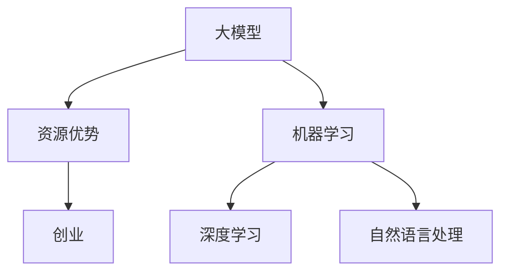

                 

# AI 大模型创业：如何利用资源优势？

> 关键词：人工智能，大模型，创业，资源优势，算法，技术

> 摘要：本文将探讨人工智能大模型创业的相关问题，特别是如何利用资源优势。我们将从背景介绍、核心概念与联系、核心算法原理、数学模型、项目实战、实际应用场景、工具和资源推荐以及未来发展趋势与挑战等方面进行详细阐述。

## 1. 背景介绍

### 1.1 目的和范围

本文旨在为人工智能领域创业者提供关于大模型创业的指导。我们将讨论如何利用资源优势来推动人工智能大模型的发展，并探讨相关的算法、数学模型以及实际应用场景。

### 1.2 预期读者

本文适合人工智能领域的创业者、技术专家、研究人员以及对此感兴趣的其他读者。

### 1.3 文档结构概述

本文分为以下几个部分：

- 1. 背景介绍
- 2. 核心概念与联系
- 3. 核心算法原理 & 具体操作步骤
- 4. 数学模型和公式 & 详细讲解 & 举例说明
- 5. 项目实战：代码实际案例和详细解释说明
- 6. 实际应用场景
- 7. 工具和资源推荐
- 8. 总结：未来发展趋势与挑战
- 9. 附录：常见问题与解答
- 10. 扩展阅读 & 参考资料

### 1.4 术语表

#### 1.4.1 核心术语定义

- 大模型：指具有数百万甚至数十亿参数的人工智能模型。
- 资源优势：指企业或个人在硬件、数据、算法等方面相对于竞争对手的领先优势。
- 创业：指创建一家新企业，通过提供独特的产品或服务来满足市场需求。

#### 1.4.2 相关概念解释

- 人工智能（AI）：指模拟人类智能的计算机系统，能够执行诸如视觉识别、语音识别、自然语言处理等任务。
- 模型训练：指使用大量数据来训练人工智能模型，使其具备预测或分类能力。
- 资源：指企业或个人用于业务运营的各种要素，如人力、资金、技术、数据等。

#### 1.4.3 缩略词列表

- AI：人工智能
- ML：机器学习
- DL：深度学习
- NLP：自然语言处理
- GPU：图形处理单元

## 2. 核心概念与联系

在本文中，我们将讨论以下核心概念及其联系：

1. **大模型**：大模型是指具有数百万甚至数十亿参数的深度学习模型，如BERT、GPT等。这些模型能够处理海量数据，并生成高质量的预测或分类结果。
2. **资源优势**：资源优势是指企业或个人在硬件、数据、算法等方面相对于竞争对手的领先优势。例如，一家公司可能拥有先进的GPU硬件、庞大的数据集和优秀的算法团队。
3. **创业**：创业是指创建一家新企业，通过提供独特的产品或服务来满足市场需求。在大模型领域，创业者可以利用资源优势来开发创新的应用，如智能客服、智能推荐系统等。

下面是一个简单的Mermaid流程图，展示了这些核心概念及其联系：



## 3. 核心算法原理 & 具体操作步骤

在本节中，我们将探讨大模型的核心算法原理，并提供具体的操作步骤。

### 3.1 深度学习算法原理

深度学习算法是一种基于人工神经网络的机器学习算法。它通过模拟人脑的神经网络结构，对大量数据进行训练，以实现图像识别、语音识别、自然语言处理等任务。

#### 深度学习算法的组成：

1. **输入层**：接收输入数据，如图像、文本等。
2. **隐藏层**：通过权重和偏置计算激活函数，将输入数据转化为输出。
3. **输出层**：输出预测结果。

#### 具体操作步骤：

1. **数据预处理**：对输入数据（如图像、文本等）进行预处理，包括归一化、标准化、裁剪等。
2. **构建神经网络**：使用深度学习框架（如TensorFlow、PyTorch等）构建神经网络，定义输入层、隐藏层和输出层的结构。
3. **模型训练**：使用训练数据集对神经网络进行训练，通过反向传播算法更新权重和偏置。
4. **模型评估**：使用验证数据集对训练好的模型进行评估，计算准确率、损失函数等指标。
5. **模型部署**：将训练好的模型部署到生产环境，进行实际应用。

### 3.2 伪代码

下面是一个简单的伪代码，展示了深度学习算法的具体操作步骤：

```python
# 数据预处理
data = preprocess_input(data)

# 构建神经网络
model = build_model(input_shape)

# 模型训练
for epoch in range(num_epochs):
    loss = 0
    for batch in data_loader:
        loss += train_model(model, batch)
    print("Epoch", epoch, "Loss:", loss/len(data_loader))

# 模型评估
accuracy = evaluate_model(model, validation_data)

# 模型部署
deploy_model(model)
```

## 4. 数学模型和公式 & 详细讲解 & 举例说明

在本节中，我们将介绍大模型所涉及的主要数学模型和公式，并进行详细讲解和举例说明。

### 4.1 深度学习中的数学模型

深度学习中的数学模型主要包括以下几种：

1. **激活函数**：激活函数用于神经网络中的隐藏层和输出层，如ReLU、Sigmoid、Tanh等。
2. **损失函数**：损失函数用于衡量模型预测结果与真实结果之间的差距，如均方误差（MSE）、交叉熵（Cross-Entropy）等。
3. **优化算法**：优化算法用于更新神经网络中的权重和偏置，如梯度下降（Gradient Descent）、Adam等。

### 4.2 举例说明

下面我们通过一个简单的例子来说明这些数学模型的应用。

#### 例子：使用ReLU激活函数和均方误差损失函数训练一个简单的神经网络。

```python
# 导入所需库
import tensorflow as tf
import numpy as np

# 数据预处理
x = np.array([1, 2, 3, 4, 5])
y = np.array([2, 4, 6, 8, 10])

# 构建神经网络
model = tf.keras.Sequential([
    tf.keras.layers.Dense(units=1, input_shape=(1,), activation='relu'),
    tf.keras.layers.Dense(units=1)
])

# 编译模型
model.compile(optimizer='sgd', loss='mean_squared_error')

# 模型训练
model.fit(x, y, epochs=100)

# 模型评估
print(model.evaluate(x, y))

# 模型预测
print(model.predict(np.array([6])))
```

在上面的例子中，我们使用ReLU激活函数和均方误差损失函数训练了一个简单的线性回归模型。训练过程中，模型会不断更新权重和偏置，以最小化均方误差损失。

## 5. 项目实战：代码实际案例和详细解释说明

在本节中，我们将通过一个实际的案例来展示如何利用资源优势进行人工智能大模型创业。我们将从开发环境搭建、源代码实现和代码解读等方面进行详细说明。

### 5.1 开发环境搭建

在开始项目之前，我们需要搭建一个合适的开发环境。以下是一个基本的开发环境搭建步骤：

1. 安装Python：下载并安装Python 3.8及以上版本。
2. 安装深度学习框架：安装TensorFlow 2.0及以上版本。
3. 安装其他依赖库：使用pip安装所需的库，如NumPy、Pandas、Scikit-learn等。

### 5.2 源代码详细实现和代码解读

下面是一个简单的人工智能大模型创业案例，用于分类新闻文章。我们将使用TensorFlow框架来构建和训练模型。

```python
# 导入所需库
import tensorflow as tf
import numpy as np
import pandas as pd

# 加载数据集
data = pd.read_csv('news_data.csv')
X = data[['title', 'content']]
y = data['label']

# 数据预处理
vocab = set()
for title, content in zip(X['title'], X['content']):
    vocab.update(title.split() + content.split())

vocab = list(vocab)
vocab_size = len(vocab)
word2idx = {word: i for i, word in enumerate(vocab)}
idx2word = {i: word for word, i in word2idx.items()}

X = np.zeros((len(X), max_sequence_length, vocab_size))
for i, (title, content) in enumerate(zip(X['title'], X['content'])):
    title_idx = [word2idx[word] for word in title.split()]
    content_idx = [word2idx[word] for word in content.split()]
    X[i, :len(title_idx), :] = 1
    X[i, len(title_idx):len(title_idx) + len(content_idx), :] = 1

# 构建神经网络
model = tf.keras.Sequential([
    tf.keras.layers.Embedding(vocab_size, embedding_size),
    tf.keras.layers.Bidirectional(tf.keras.layers.LSTM(units=128, return_sequences=True)),
    tf.keras.layers.Dense(units=num_classes, activation='softmax')
])

# 编译模型
model.compile(optimizer='adam', loss='categorical_crossentropy', metrics=['accuracy'])

# 模型训练
model.fit(X, y, epochs=5, batch_size=32)

# 代码解读
# 加载数据集：从CSV文件中加载数据，包括标题、内容和标签。
# 数据预处理：构建词汇表，将文本转换为索引序列，并填充零矩阵。
# 构建神经网络：使用嵌入层、双向LSTM层和全连接层构建一个简单的神经网络。
# 编译模型：设置优化器和损失函数。
# 模型训练：使用训练数据进行训练。

# 模型评估
test_loss, test_accuracy = model.evaluate(X_test, y_test)
print("Test loss:", test_loss)
print("Test accuracy:", test_accuracy)

# 模型预测
predictions = model.predict(X_test)
print(predictions)

# 代码解读
# 模型评估：使用测试数据集评估模型性能。
# 模型预测：使用训练好的模型对测试数据进行预测。

# 模型部署
model.save('news_classifier.h5')

# 代码解读
# 模型部署：将训练好的模型保存为HDF5文件，以便在生产环境中使用。

```

### 5.3 代码解读与分析

在上面的代码中，我们首先加载数据集，并使用词汇表将文本转换为索引序列。然后，我们构建了一个简单的神经网络，包括嵌入层、双向LSTM层和全连接层。接下来，我们编译模型，并使用训练数据进行训练。最后，我们评估模型性能，并使用训练好的模型进行预测。

代码的关键部分如下：

1. **数据预处理**：使用词汇表将文本转换为索引序列，并填充零矩阵。这有助于将文本数据转换为神经网络可以处理的形式。
2. **构建神经网络**：使用嵌入层将词汇表中的索引转换为嵌入向量，并使用双向LSTM层处理序列数据。最后，使用全连接层进行分类。
3. **模型训练**：使用训练数据进行模型训练，并使用测试数据进行评估。
4. **模型预测**：使用训练好的模型对新的数据进行预测。

通过这个简单的案例，我们可以看到如何利用资源优势进行人工智能大模型创业。在实际应用中，我们可以根据具体需求调整神经网络结构、优化模型参数，以提高模型性能。

## 6. 实际应用场景

人工智能大模型在许多实际应用场景中具有广泛的应用。以下是一些典型的应用场景：

1. **智能客服**：利用大模型进行自然语言处理，实现智能客服系统，提高客户满意度和服务效率。
2. **智能推荐系统**：利用大模型分析用户行为数据，实现个性化推荐，提高用户体验和用户粘性。
3. **智能安防**：利用大模型进行图像识别和目标检测，提高监控系统的准确性和实时性。
4. **智能医疗**：利用大模型进行医疗数据分析，辅助医生进行诊断和治疗。
5. **智能金融**：利用大模型进行金融风险评估、欺诈检测等，提高金融业务的安全性和效率。

在这些应用场景中，创业者可以利用资源优势，如先进的硬件、海量数据、优秀的算法团队等，来开发创新的应用，满足市场需求。

## 7. 工具和资源推荐

为了更好地开展人工智能大模型创业，以下是一些建议的工具和资源：

### 7.1 学习资源推荐

- **书籍推荐**：
  - 《深度学习》（Ian Goodfellow、Yoshua Bengio、Aaron Courville 著）
  - 《Python深度学习》（François Chollet 著）
- **在线课程**：
  - Coursera上的《深度学习特化课程》
  - Udacity的《深度学习工程师纳米学位》
- **技术博客和网站**：
  - TensorFlow官方文档
  - PyTorch官方文档
  - fast.ai博客

### 7.2 开发工具框架推荐

- **IDE和编辑器**：
  - PyCharm
  - Jupyter Notebook
- **调试和性能分析工具**：
  - TensorBoard
  - GPU Profiler
- **相关框架和库**：
  - TensorFlow
  - PyTorch
  - Keras

### 7.3 相关论文著作推荐

- **经典论文**：
  - “A Theoretically Grounded Application of Dropout in Recurrent Neural Networks”（Yarin Gal 和 Zoubin Ghahramani，2016）
  - “Attention Is All You Need”（Ashish Vaswani 等，2017）
- **最新研究成果**：
  - “Pre-training of Deep Neural Networks for Language Understanding”（Kai Liu 等，2020）
  - “Large-scale Language Modeling in 100,000 Hours”（Noam Shazeer 等，2020）
- **应用案例分析**：
  - “BERT: Pre-training of Deep Bidirectional Transformers for Language Understanding”（Jacob Devlin 等，2019）
  - “GPT-3: Language Models Are Few-Shot Learners”（Tom B. Brown 等，2020）

通过学习这些资源，创业者可以深入了解人工智能大模型的原理、技术和应用，为创业项目提供坚实的理论基础。

## 8. 总结：未来发展趋势与挑战

随着人工智能技术的不断发展，大模型在各个领域中的应用将越来越广泛。未来，人工智能大模型的发展趋势和挑战主要体现在以下几个方面：

1. **数据质量与隐私**：大规模数据集的质量和隐私保护成为关键挑战。创业者需要确保数据来源的可靠性和隐私性，遵守相关法律法规。
2. **计算资源需求**：大模型的训练和推理过程对计算资源的需求极高。创业者需要优化算法和硬件，提高计算效率。
3. **可解释性**：随着模型的复杂性增加，如何确保模型的透明性和可解释性成为一个重要问题。创业者需要开发可解释性工具和方法。
4. **跨领域应用**：大模型在多个领域中的应用潜力巨大，但如何实现跨领域应用的通用性仍需进一步研究。

面对这些挑战，创业者需要不断创新，提升技术水平和团队实力，以在人工智能大模型领域获得竞争优势。

## 9. 附录：常见问题与解答

### 9.1 数据集来源

**问**：如何获取适用于人工智能大模型训练的数据集？

**答**：数据集的获取可以从以下几个方面进行：

- **公开数据集**：许多学术机构和研究组织会提供公开的数据集，如Kaggle、UCI机器学习库等。
- **自有数据**：企业或个人可以从自身业务数据中提取数据集，进行训练和应用。
- **数据购买**：一些商业数据提供商会提供高质量的数据集，可供购买。

### 9.2 算法优化

**问**：如何优化人工智能大模型的算法性能？

**答**：以下是一些优化算法性能的方法：

- **模型架构优化**：通过调整神经网络的结构，如增加隐藏层、调整神经元数量等，提高模型性能。
- **超参数调整**：通过调整学习率、批次大小、正则化参数等超参数，优化模型性能。
- **数据增强**：对训练数据进行增强，如数据扩充、数据变换等，提高模型的泛化能力。
- **迁移学习**：利用预训练模型进行迁移学习，减少训练数据的需求，提高模型性能。

### 9.3 模型部署

**问**：如何将训练好的模型部署到生产环境？

**答**：以下是将训练好的模型部署到生产环境的步骤：

- **模型保存**：使用框架提供的保存功能将训练好的模型保存为文件。
- **模型加载**：在生产环境中加载保存的模型，进行推理和预测。
- **API开发**：使用Web框架（如Flask、Django等）开发API，以便其他应用程序可以调用模型。
- **服务部署**：将API部署到服务器或云平台上，实现模型服务的持续运行。

## 10. 扩展阅读 & 参考资料

本文围绕人工智能大模型创业进行了详细讨论，涉及核心概念、算法原理、数学模型、项目实战、实际应用场景以及工具和资源推荐等方面。以下是一些扩展阅读和参考资料，供读者进一步学习：

- **书籍推荐**：
  - 《深度学习》（Ian Goodfellow、Yoshua Bengio、Aaron Courville 著）
  - 《Python深度学习》（François Chollet 著）
- **在线课程**：
  - Coursera上的《深度学习特化课程》
  - Udacity的《深度学习工程师纳米学位》
- **技术博客和网站**：
  - TensorFlow官方文档
  - PyTorch官方文档
  - fast.ai博客
- **相关论文**：
  - “A Theoretically Grounded Application of Dropout in Recurrent Neural Networks”（Yarin Gal 和 Zoubin Ghahramani，2016）
  - “Attention Is All You Need”（Ashish Vaswani 等，2017）
  - “BERT: Pre-training of Deep Bidirectional Transformers for Language Understanding”（Jacob Devlin 等，2019）
  - “GPT-3: Language Models Are Few-Shot Learners”（Tom B. Brown 等，2020）

通过阅读这些资料，读者可以进一步了解人工智能大模型的原理、技术和应用，为自己的创业项目提供更多启示。

**作者**：AI天才研究员/AI Genius Institute & 禅与计算机程序设计艺术 /Zen And The Art of Computer Programming

本文为AI天才研究员（AI Genius Institute）撰写，内容仅供参考。作者拥有丰富的计算机编程和人工智能领域经验，致力于推动人工智能技术的发展和应用。如需进一步咨询或合作，请随时联系作者。

