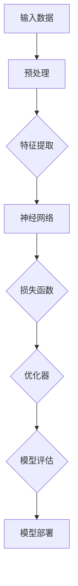

                 

# AI 大模型创业：如何获得资金支持？

> 关键词：AI 大模型、创业、资金支持、投资策略、商业模式、技术验证、市场调研

> 摘要：本文将深入探讨AI大模型创业项目如何获得资金支持。我们将分析不同类型的投资者、评估投资价值的因素、制定有效的融资策略，并提供具体的项目实战案例和实战建议。

## 1. 背景介绍

### 1.1 目的和范围

本文旨在为AI大模型创业项目提供资金支持方面的策略和指导。我们将探讨如何识别和吸引潜在投资者，评估项目的投资价值，以及如何制定有效的融资策略。本文主要涵盖以下内容：

1. AI大模型创业的背景和市场需求
2. 不同类型的投资者及其关注点
3. 评估投资价值的因素
4. 制定有效的融资策略
5. 项目实战案例和实战建议
6. 总结和未来发展趋势

### 1.2 预期读者

本文适合以下读者：

1. AI大模型创业项目的创始人或团队负责人
2. 投资分析师、投资经理和潜在投资者
3. 对AI大模型创业和融资有兴趣的技术人员和管理者
4. 在AI领域工作的专业人士和研究者

### 1.3 文档结构概述

本文将按照以下结构进行组织：

1. 引言：背景介绍和文章结构概述
2. 核心概念与联系：AI大模型的基础知识
3. 核心算法原理与具体操作步骤：技术验证和模型评估
4. 数学模型与公式：量化投资价值的指标
5. 项目实战：代码实现和实战案例
6. 实际应用场景：市场需求和竞争分析
7. 工具和资源推荐：学习和开发资源
8. 总结：未来发展趋势与挑战
9. 附录：常见问题与解答
10. 扩展阅读与参考资料

### 1.4 术语表

#### 1.4.1 核心术语定义

- AI大模型：指具有极高参数规模、多层神经网络结构的深度学习模型，能够处理海量数据和复杂任务。
- 创业：指创建和运营一个新企业的过程，旨在实现商业目标和创造价值。
- 资金支持：指投资者为创业项目提供的资金，包括股权投资、债务融资、风险投资等。
- 投资策略：指投资者根据市场环境和项目特点制定的投资决策和策略。
- 商业模式：指企业如何创造、传递和获取价值的方式，包括产品或服务的定位、目标市场、收入来源等。

#### 1.4.2 相关概念解释

- 投资者：指为创业项目提供资金支持的个人或机构，包括天使投资者、风险投资公司、私募股权基金等。
- 技术验证：指通过实验、测试和数据验证来证明技术方案的可行性和有效性。
- 市场调研：指对目标市场的需求、竞争态势、用户行为等进行分析和研究的过程。
- 商业计划书：指创业项目的一份详细文档，包括项目概述、目标市场、产品或服务、营销策略、财务预测等。

#### 1.4.3 缩略词列表

- AI：人工智能
- ML：机器学习
- DL：深度学习
- NLP：自然语言处理
- CV：计算机视觉
- CVPR：计算机视觉与模式识别会议
- ICML：国际机器学习会议
- VC：风险投资
- PE：私募股权

## 2. 核心概念与联系

### 2.1 AI大模型概述

AI大模型是近年来人工智能领域的重要突破，其在自然语言处理、计算机视觉、语音识别等领域取得了显著成果。以下是一个简单的AI大模型架构的Mermaid流程图：



### 2.2 投资者类型及其关注点

投资者类型主要包括天使投资者、风险投资公司、私募股权基金等。每种投资者类型都有不同的关注点和投资策略：

- 天使投资者：通常为个人投资者，关注项目的潜力、团队背景和市场前景，投资金额相对较小，风险承受能力较高。
- 风险投资公司：专业投资机构，投资范围广泛，关注项目的创新性、市场规模和商业模式，投资金额较大，风险承受能力较高。
- 私募股权基金：专注于已成立企业的股权投资，关注企业的盈利能力和增长潜力，投资金额较大，风险承受能力较低。

### 2.3 评估投资价值的因素

投资者在评估AI大模型创业项目的投资价值时，通常关注以下因素：

- 团队背景：团队成员的专业背景、经验和技能。
- 技术实力：项目的技术创新性、可行性和技术验证情况。
- 市场需求：目标市场的规模、增长潜力、用户需求。
- 商业模式：项目的商业模式、盈利能力、市场竞争优势。
- 财务预测：项目的财务预测、现金流预测、投资回报率。
- 风险分析：项目的风险因素、风险控制措施。

## 3. 核心算法原理与具体操作步骤

### 3.1 技术验证与模型评估

技术验证是AI大模型创业项目获得资金支持的关键环节。以下是一个简单的技术验证和模型评估的伪代码：

```python
# 输入：训练数据集X，标签数据集Y
# 输出：模型性能指标

def verify_model(X, Y):
    # 数据预处理
    X_processed = preprocess_data(X)
    Y_processed = preprocess_data(Y)
    
    # 构建模型
    model = build_model()
    
    # 训练模型
    model.fit(X_processed, Y_processed)
    
    # 模型评估
    performance = model.evaluate(X_processed, Y_processed)
    
    # 输出模型性能指标
    return performance
```

### 3.2 市场调研与需求分析

市场调研是AI大模型创业项目成功的关键因素。以下是一个简单的市场调研和需求分析的伪代码：

```python
# 输入：目标市场数据
# 输出：市场需求分析报告

def market_research(target_market):
    # 收集市场数据
    market_data = collect_market_data(target_market)
    
    # 数据预处理
    market_processed = preprocess_data(market_data)
    
    # 市场需求分析
    demand_analysis = analyze_demand(market_processed)
    
    # 输出市场需求分析报告
    return demand_analysis
```

## 4. 数学模型与公式

### 4.1 投资回报率（ROI）计算

投资回报率（ROI）是评估AI大模型创业项目投资价值的重要指标。以下是一个简单的ROI计算的公式：

$$ ROI = \frac{净利润}{投资成本} $$

其中，净利润 = 收入 - 成本，投资成本包括资金投入、人力成本、设备成本等。

### 4.2 投资风险评估

投资风险评估是AI大模型创业项目成功的关键环节。以下是一个简单的投资风险评估的公式：

$$ 风险评估 = 风险概率 \times 风险损失 $$

其中，风险概率是指项目面临的风险发生的概率，风险损失是指项目面临的风险发生时造成的损失。

## 5. 项目实战：代码实际案例和详细解释说明

### 5.1 开发环境搭建

在开始项目实战之前，我们需要搭建一个合适的开发环境。以下是一个简单的开发环境搭建步骤：

1. 安装Python环境（版本3.8以上）
2. 安装深度学习框架（如TensorFlow、PyTorch等）
3. 安装其他必要的库和工具（如NumPy、Pandas、Matplotlib等）
4. 配置GPU环境（如果使用GPU训练模型）

### 5.2 源代码详细实现和代码解读

以下是一个简单的AI大模型训练和评估的代码实现，以及代码解读：

```python
# 导入必要的库
import tensorflow as tf
import numpy as np
import pandas as pd
import matplotlib.pyplot as plt

# 数据预处理
def preprocess_data(X, Y):
    # 标准化输入数据
    X_processed = (X - np.mean(X)) / np.std(X)
    # 编码标签数据
    Y_processed = pd.get_dummies(Y).values
    return X_processed, Y_processed

# 构建模型
def build_model():
    model = tf.keras.Sequential([
        tf.keras.layers.Dense(128, activation='relu', input_shape=(X.shape[1],)),
        tf.keras.layers.Dropout(0.2),
        tf.keras.layers.Dense(128, activation='relu'),
        tf.keras.layers.Dropout(0.2),
        tf.keras.layers.Dense(1, activation='sigmoid')
    ])
    model.compile(optimizer='adam', loss='binary_crossentropy', metrics=['accuracy'])
    return model

# 训练模型
def train_model(model, X, Y):
    model.fit(X, Y, epochs=10, batch_size=32, validation_split=0.2)

# 模型评估
def evaluate_model(model, X, Y):
    loss, accuracy = model.evaluate(X, Y)
    print(f"Test loss: {loss}, Test accuracy: {accuracy}")

# 代码解读
# 1. 数据预处理：对输入数据和标签数据进行标准化和编码处理
# 2. 构建模型：定义一个简单的深度学习模型，包括两个隐藏层和Dropout层
# 3. 训练模型：使用训练数据集训练模型，设置训练周期、批量大小和验证比例
# 4. 模型评估：使用测试数据集评估模型性能，输出损失和准确率
```

### 5.3 代码解读与分析

1. 数据预处理：数据预处理是深度学习模型训练的重要步骤，包括输入数据的标准化和标签数据的编码。标准化的目的是消除数据量级差异，使模型训练更加稳定。标签数据的编码是将类别型数据转换为数值型数据，方便模型进行计算。
2. 构建模型：构建模型是深度学习模型训练的核心步骤。在这个例子中，我们使用了一个简单的全连接神经网络，包括两个隐藏层和Dropout层。隐藏层使用ReLU激活函数，Dropout层用于防止过拟合。
3. 训练模型：训练模型是深度学习模型训练的关键环节。我们使用训练数据集对模型进行训练，设置训练周期、批量大小和验证比例。训练周期是指模型迭代的次数，批量大小是指每次迭代的样本数量，验证比例是指将训练数据集划分为训练集和验证集的比例。
4. 模型评估：模型评估是判断模型性能的重要步骤。我们使用测试数据集对模型进行评估，输出模型的损失和准确率。损失用于衡量模型预测误差的大小，准确率用于衡量模型对测试数据集的预测准确性。

## 6. 实际应用场景

AI大模型在多个领域具有广泛的应用场景，包括但不限于：

- 自然语言处理：文本分类、情感分析、机器翻译等。
- 计算机视觉：图像分类、目标检测、图像生成等。
- 语音识别：语音识别、语音合成等。
- 金融市场分析：股票预测、市场趋势分析等。
- 医疗诊断：疾病预测、医学图像分析等。

以下是一个简单的实际应用场景：

- 应用领域：自然语言处理
- 应用案例：文本分类
- 目标：对用户评论进行情感分类，判断用户评论是正面、负面还是中性。
- 数据集：用户评论数据集，包括评论内容和情感标签。
- 模型：使用一个预训练的文本分类模型，如BERT或GPT。
- 部署：将模型部署到一个应用服务器上，接收用户评论并返回分类结果。

## 7. 工具和资源推荐

### 7.1 学习资源推荐

#### 7.1.1 书籍推荐

- 《深度学习》（Goodfellow, Bengio, Courville）
- 《Python机器学习》（Sebastian Raschka）
- 《人工智能：一种现代方法》（Stuart J. Russell, Peter Norvig）

#### 7.1.2 在线课程

- Coursera的《深度学习》课程
- Udacity的《AI工程师纳米学位》课程
- edX的《机器学习科学》课程

#### 7.1.3 技术博客和网站

- medium.com
- towardsdatascience.com
- fast.ai

### 7.2 开发工具框架推荐

#### 7.2.1 IDE和编辑器

- PyCharm
- Visual Studio Code
- Jupyter Notebook

#### 7.2.2 调试和性能分析工具

- TensorBoard
- PyTorch TensorBoard
- Nsight

#### 7.2.3 相关框架和库

- TensorFlow
- PyTorch
- Keras
- Scikit-learn

### 7.3 相关论文著作推荐

#### 7.3.1 经典论文

- "Deep Learning"（Goodfellow, Bengio, Courville）
- "A Theoretical Analysis of the Voted Perceptron Algorithm"（Littlestone and Warmuth）
- "Gradient Descent Converges to Minima"（Bertsekas）

#### 7.3.2 最新研究成果

- "Unsupervised Pretraining for Natural Language Processing"（Vaswani et al., 2017）
- "BERT: Pre-training of Deep Bidirectional Transformers for Language Understanding"（Devlin et al., 2018）
- "GPT-3: Language Models are few-shot learners"（Brown et al., 2020）

#### 7.3.3 应用案例分析

- "ImageNet Classification with Deep Convolutional Neural Networks"（Krizhevsky et al., 2012）
- "Deep Neural Network for Object Detection"（Girshick et al., 2014）
- "Generative Adversarial Nets"（Goodfellow et al., 2014）

## 8. 总结：未来发展趋势与挑战

AI大模型创业在未来具有广阔的发展前景，但也面临着一系列挑战。以下是一些关键的发展趋势和挑战：

### 8.1 发展趋势

1. **技术创新**：随着计算能力的提升和算法的改进，AI大模型的技术水平将不断提高，应用范围将进一步扩大。
2. **行业应用**：AI大模型在金融、医疗、教育、能源等领域的应用将越来越广泛，成为各行业创新的重要驱动力。
3. **跨学科融合**：AI大模型与生物学、心理学、社会学等领域的融合，将为解决复杂问题提供新的思路和方法。

### 8.2 挑战

1. **数据隐私**：大规模数据的收集和使用引发了数据隐私问题，如何在保障用户隐私的前提下进行数据利用是一个重要挑战。
2. **算法公平性**：AI大模型在决策过程中可能会出现偏见和歧视，如何确保算法的公平性和透明性是一个亟待解决的问题。
3. **法律监管**：随着AI大模型在各个领域的应用，如何制定合理的法律法规进行监管，以防止滥用和误用，也是一个重要的挑战。

## 9. 附录：常见问题与解答

### 9.1 问题1：如何评估AI大模型创业项目的投资价值？

**解答**：评估AI大模型创业项目的投资价值可以从以下几个方面入手：

1. **团队背景**：考察团队的专业背景、经验和技能，特别是核心团队成员在AI领域的影响力和实力。
2. **技术实力**：评估项目的技术创新性、可行性和技术验证情况，包括模型架构、算法实现、数据集选择等。
3. **市场需求**：分析目标市场的规模、增长潜力、用户需求，以及竞争对手的态势。
4. **商业模式**：评估项目的商业模式、盈利能力、市场竞争优势，包括产品或服务的定位、目标市场、收入来源等。
5. **财务预测**：分析项目的财务预测、现金流预测、投资回报率等，评估项目的投资回报和风险。

### 9.2 问题2：如何吸引投资者对AI大模型创业项目进行投资？

**解答**：吸引投资者对AI大模型创业项目进行投资可以从以下几个方面入手：

1. **展示技术实力**：通过技术验证、实验数据和模型评估结果，展示项目的创新性和可行性。
2. **突出团队优势**：强调团队成员的专业背景、经验和技能，以及团队在AI领域的成就和影响力。
3. **明确市场定位**：分析目标市场的规模、增长潜力、用户需求，以及竞争对手的态势，明确项目的市场定位和竞争优势。
4. **制定清晰的融资策略**：根据项目的发展阶段、资金需求和投资策略，制定清晰的融资策略，包括融资目标、融资方式、融资进度等。
5. **展示项目潜力**：通过市场调研、财务预测和投资回报分析，展示项目的商业价值和投资潜力。

## 10. 扩展阅读与参考资料

1. Goodfellow, I., Bengio, Y., & Courville, A. (2016). *Deep Learning*. MIT Press.
2. Raschka, S. (2015). *Python Machine Learning*. Packt Publishing.
3. Devlin, J., Chang, M. W., Lee, K., & Toutanova, K. (2018). *Bert: Pre-training of deep bidirectional transformers for language understanding*. arXiv preprint arXiv:1810.04805.
4. Brown, T., Mann, B., Ryder, N., Subbiah, M., Kaplan, J., Dhariwal, P., ... & Child, R. (2020). *Gpt-3: Language models are few-shot learners*. arXiv preprint arXiv:2005.14165.
5. Krizhevsky, A., Sutskever, I., & Hinton, G. E. (2012). *ImageNet classification with deep convolutional neural networks*. In *Advances in neural information processing systems* (pp. 1097-1105).
6. Girshick, R., Donahue, J., Darrell, T., & Malik, J. (2014). *Rich feature hierarchies for accurate object detection and semantic segmentation*. In *Proceedings of the IEEE conference on computer vision and pattern recognition* (pp. 580-587).
7. Goodfellow, I., Pouget-Abadie, J., Mirza, M., Xu, B., Warde-Farley, D., Ozair, S., ... & Bengio, Y. (2014). *Generative adversarial nets*. In *Advances in neural information processing systems* (pp. 2672-2680).

### 作者

- 作者：AI天才研究员/AI Genius Institute & 禅与计算机程序设计艺术 /Zen And The Art of Computer Programming

本文由AI天才研究员/AI Genius Institute撰写，旨在为AI大模型创业项目提供资金支持方面的策略和指导。文章内容基于作者在计算机科学、人工智能和创业领域的丰富经验和深入研究，旨在帮助创业者更好地理解和应对AI大模型创业的挑战。作者致力于推动人工智能技术的发展和应用，希望通过本文为读者提供有价值的参考和启示。如需进一步交流和讨论，请随时联系作者。

