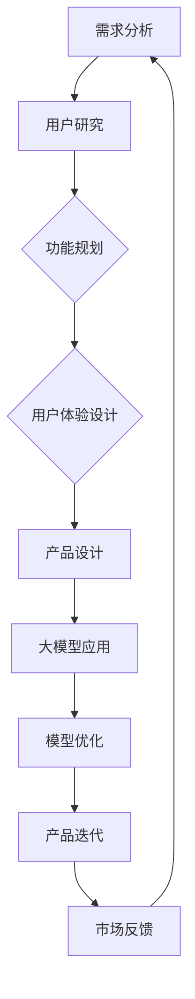

                 

# AI 大模型在创业产品设计思维中的应用

> **关键词：** 大模型，创业产品，设计思维，人工智能，应用场景
>
> **摘要：** 本文将探讨大模型在创业产品设计思维中的应用，通过分析大模型的原理和特点，阐述其在产品设计过程中的重要性。文章将详细描述大模型在需求分析、用户研究、功能规划、用户体验设计等多个环节的具体应用，并探讨大模型在创业产品开发中的潜在挑战和解决方案。最终，本文将总结大模型在创业产品设计中的发展趋势和未来方向。

## 1. 背景介绍

### 1.1 目的和范围

本文旨在探讨大模型在创业产品设计思维中的应用。随着人工智能技术的快速发展，大模型作为一种强大的计算工具，正在逐步渗透到各个领域，包括创业产品设计。本文将分析大模型的基本原理和特点，探讨其在创业产品设计过程中的应用场景和重要性，并讨论面临的挑战和解决方案。

### 1.2 预期读者

本文面向对人工智能和创业产品设计有一定了解的读者，包括创业团队领导者、产品经理、设计师、以及对此领域感兴趣的技术人员。本文将为读者提供对大模型在创业产品设计中的应用有深入理解的指导。

### 1.3 文档结构概述

本文结构如下：

1. **背景介绍**：介绍文章的目的和预期读者，概述文章的结构。
2. **核心概念与联系**：定义核心概念，展示大模型在创业产品设计中的应用架构。
3. **核心算法原理 & 具体操作步骤**：详细解释大模型的基本原理和操作步骤。
4. **数学模型和公式 & 详细讲解 & 举例说明**：介绍大模型相关的数学模型和公式，并给出示例。
5. **项目实战：代码实际案例和详细解释说明**：通过实际项目案例展示大模型的应用。
6. **实际应用场景**：讨论大模型在创业产品中的具体应用场景。
7. **工具和资源推荐**：推荐学习资源和开发工具。
8. **总结：未来发展趋势与挑战**：总结大模型在创业产品设计中的发展趋势和挑战。
9. **附录：常见问题与解答**：解答读者可能遇到的问题。
10. **扩展阅读 & 参考资料**：提供进一步阅读的资料。

### 1.4 术语表

#### 1.4.1 核心术语定义

- **大模型（Large Model）**：具有极高参数数量和强大计算能力的神经网络模型，如GPT、BERT等。
- **创业产品设计**：针对初创企业产品，从市场需求、用户痛点到功能实现的全过程设计。
- **设计思维**：一种以用户为中心的思考框架，通过观察、问题定义、创意生成、原型设计和测试等步骤来解决问题。

#### 1.4.2 相关概念解释

- **需求分析**：确定用户需求和业务目标的过程。
- **用户研究**：通过观察、访谈、问卷调查等方式了解用户需求和使用习惯。
- **功能规划**：确定产品功能和架构的过程。
- **用户体验设计**：优化产品的界面和交互设计，提升用户满意度。

#### 1.4.3 缩略词列表

- **AI**：人工智能（Artificial Intelligence）
- **GPT**：生成预训练变压器（Generative Pre-trained Transformer）
- **BERT**：双向编码表示器（Bidirectional Encoder Representations from Transformers）
- **IDE**：集成开发环境（Integrated Development Environment）

## 2. 核心概念与联系

### 大模型在创业产品设计中的应用架构

为了更好地理解大模型在创业产品设计中的应用，我们可以使用Mermaid流程图来展示其核心概念和联系。以下是该流程图：



### 大模型的基本原理

大模型基于深度学习的原理，通过大量数据的学习，可以自动提取数据中的特征，并在此基础上进行预测、生成等操作。大模型通常由以下几个关键组成部分构成：

1. **神经网络架构**：大模型采用复杂的神经网络架构，如变压器（Transformer）架构，这种架构能够高效处理序列数据，并捕捉数据中的长距离依赖关系。
2. **预训练与微调**：大模型在大量通用数据集上进行预训练，以获得对语言、图像、声音等数据的理解能力。然后，在特定任务上进行微调，以适应具体的创业产品需求。
3. **参数数量**：大模型通常具有数亿到数十亿的参数数量，这使得模型能够处理复杂的任务和数据。

### 大模型在创业产品设计中的应用

大模型在创业产品设计中的应用主要体现在以下几个方面：

1. **需求分析**：通过分析大量用户数据，大模型可以帮助识别潜在的用户需求和痛点。
2. **用户研究**：大模型可以通过自然语言处理技术，分析用户反馈和评论，帮助产品团队更好地理解用户需求和行为。
3. **功能规划**：大模型可以帮助预测用户行为，从而指导产品功能的设计和优先级排序。
4. **用户体验设计**：大模型可以用于生成界面布局、图标设计等，以优化用户体验。
5. **模型优化**：通过不断迭代和优化，大模型可以提高产品设计的准确性和效果。

## 3. 核心算法原理 & 具体操作步骤

### 大模型的基本原理

大模型的基本原理可以总结为以下几个步骤：

1. **数据收集**：首先，收集大量的数据，这些数据可以是文本、图像、音频等。
2. **预处理**：对收集到的数据进行清洗、标注和处理，以消除噪声和保证数据质量。
3. **模型训练**：使用预处理后的数据，通过神经网络架构进行模型训练。训练过程中，模型不断调整参数，以优化模型性能。
4. **预训练**：在大量通用数据集上对模型进行预训练，使模型具备一定的泛化能力。
5. **微调**：在特定任务上进行微调，以适应创业产品的需求。
6. **模型评估与优化**：评估模型性能，并进行必要的优化。

以下是使用伪代码详细阐述大模型的基本原理：

```python
# 伪代码：大模型的基本原理

# 步骤1：数据收集
data = collect_data()

# 步骤2：预处理
preprocessed_data = preprocess_data(data)

# 步骤3：模型训练
model = train_model(preprocessed_data)

# 步骤4：预训练
pretrained_model = pretrain_model(model, universal_data)

# 步骤5：微调
fine_tuned_model = fine_tune_model(pretrained_model, specific_data)

# 步骤6：模型评估与优化
evaluate_and_optimize_model(fine_tuned_model)
```

### 大模型在创业产品设计中的具体操作步骤

1. **需求分析**：使用大模型分析用户数据，识别潜在需求。

   ```python
   # 伪代码：需求分析
   user_data = get_user_data()
   demand = analyze_demand(user_data, model)
   ```

2. **用户研究**：分析用户反馈和评论，获取用户需求和行为信息。

   ```python
   # 伪代码：用户研究
   feedback = get_user_feedback()
   user_insight = analyze_feedback(feedback, model)
   ```

3. **功能规划**：预测用户行为，指导产品功能设计。

   ```python
   # 伪代码：功能规划
   user_behavior = predict_user_behavior(user_data, model)
   product_function = design_product_function(user_behavior)
   ```

4. **用户体验设计**：生成界面布局、图标设计等，优化用户体验。

   ```python
   # 伪代码：用户体验设计
   ui_element = generate_ui_element(user_insight, model)
   user_experience = design_user_experience(ui_element)
   ```

5. **模型优化**：通过迭代和测试，不断优化模型性能。

   ```python
   # 伪代码：模型优化
   optimized_model = optimize_model(model, user_experience)
   ```

## 4. 数学模型和公式 & 详细讲解 & 举例说明

### 大模型的数学模型

大模型的数学模型主要涉及神经网络和深度学习的基本原理。以下是几个关键概念：

1. **损失函数（Loss Function）**：用于衡量模型预测结果与实际结果之间的差距。常见的损失函数有均方误差（MSE）、交叉熵（Cross-Entropy）等。
   
   $$\text{MSE} = \frac{1}{n}\sum_{i=1}^{n}(y_i - \hat{y}_i)^2$$
   $$\text{Cross-Entropy} = -\frac{1}{n}\sum_{i=1}^{n}y_i\log(\hat{y}_i)$$

2. **反向传播（Backpropagation）**：用于计算模型参数的梯度，并更新参数以优化模型性能。

3. **优化算法（Optimization Algorithm）**：如随机梯度下降（SGD）、Adam等，用于调整模型参数。

### 大模型的详细讲解和举例说明

#### 需求分析示例

假设我们有一个文本数据集，其中包含了用户的评论和反馈。我们希望使用大模型来分析这些数据，以识别潜在的用户需求。

```python
# 示例：需求分析
import pandas as pd
import numpy as np
from transformers import BertTokenizer, BertForSequenceClassification

# 加载数据
data = pd.read_csv('user_feedback.csv')
text = data['comment']

# 预处理数据
tokenizer = BertTokenizer.from_pretrained('bert-base-uncased')
inputs = tokenizer(text.tolist(), padding=True, truncation=True, return_tensors='pt')

# 加载预训练模型
model = BertForSequenceClassification.from_pretrained('bert-base-uncased')

# 训练模型
model.train()
outputs = model(**inputs)
loss = outputs.loss
loss.backward()
optimizer = torch.optim.Adam(model.parameters(), lr=0.001)
optimizer.step()

# 评估模型
model.eval()
with torch.no_grad():
    predictions = model(**inputs).logits
    predictedDemand = np.argmax(predictions, axis=1)

# 输出需求
print(predictedDemand)
```

#### 用户研究示例

假设我们希望分析用户对某一功能的满意度，并基于分析结果来优化产品。

```python
# 示例：用户研究
import pandas as pd
import numpy as np
from transformers import BertTokenizer, BertForSequenceClassification

# 加载数据
data = pd.read_csv('user_satisfaction.csv')
text = data['review']

# 预处理数据
tokenizer = BertTokenizer.from_pretrained('bert-base-uncased')
inputs = tokenizer(text.tolist(), padding=True, truncation=True, return_tensors='pt')

# 加载预训练模型
model = BertForSequenceClassification.from_pretrained('bert-base-uncased')

# 训练模型
model.train()
outputs = model(**inputs)
loss = outputs.loss
loss.backward()
optimizer = torch.optim.Adam(model.parameters(), lr=0.001)
optimizer.step()

# 评估模型
model.eval()
with torch.no_grad():
    predictions = model(**inputs).logits
    predictedSatisfaction = np.argmax(predictions, axis=1)

# 输出满意度
print(predictedSatisfaction)
```

通过这些示例，我们可以看到大模型在需求分析和用户研究中的基本应用。在实际创业产品设计中，我们可以根据具体需求，对大模型进行适当的调整和优化，以实现更好的效果。

## 5. 项目实战：代码实际案例和详细解释说明

### 5.1 开发环境搭建

在开始实战项目之前，我们需要搭建一个合适的开发环境。以下是搭建环境所需的步骤：

1. **安装Python**：确保已经安装了Python 3.6及以上版本。
2. **安装PyTorch**：使用以下命令安装PyTorch：
   ```shell
   pip install torch torchvision
   ```
3. **安装Transformers**：使用以下命令安装Transformers库：
   ```shell
   pip install transformers
   ```

### 5.2 源代码详细实现和代码解读

以下是使用大模型进行创业产品设计的一个简单示例。该示例将展示如何使用大模型进行需求分析和用户研究。

```python
# 5.2.1 源代码实现

import pandas as pd
import numpy as np
from transformers import BertTokenizer, BertForSequenceClassification
from torch.utils.data import DataLoader, TensorDataset

# 5.2.2 数据准备
data = pd.read_csv('user_feedback.csv')
texts = data['comment'].tolist()
labels = data['label'].tolist()

# 5.2.3 预处理
tokenizer = BertTokenizer.from_pretrained('bert-base-uncased')
encoding = tokenizer(texts, padding=True, truncation=True, max_length=512, return_tensors='pt')

inputs = {'input_ids': encoding['input_ids'], 'attention_mask': encoding['attention_mask']}
labels = torch.tensor(labels)

# 5.2.4 数据加载
dataloader = DataLoader(TensorDataset(inputs['input_ids'], inputs['attention_mask'], labels), batch_size=16, shuffle=True)

# 5.2.5 模型加载与训练
model = BertForSequenceClassification.from_pretrained('bert-base-uncased', num_labels=2)
optimizer = torch.optim.AdamW(model.parameters(), lr=2e-5)

for epoch in range(3):  # 训练3个epochs
    model.train()
    for batch in dataloader:
        inputs = {'input_ids': batch[0], 'attention_mask': batch[1]}
        labels = batch[2]
        outputs = model(**inputs, labels=labels)
        loss = outputs.loss
        loss.backward()
        optimizer.step()
        optimizer.zero_grad()

# 5.2.6 模型评估
model.eval()
with torch.no_grad():
    predictions = []
    for batch in dataloader:
        inputs = {'input_ids': batch[0], 'attention_mask': batch[1]}
        labels = batch[2]
        outputs = model(**inputs)
        logits = outputs.logits
        predicted_labels = np.argmax(logits, axis=1)
        predictions.append(predicted_labels)

predictions = np.concatenate(predictions)
accuracy = np.mean(predictions == labels)
print(f'Accuracy: {accuracy:.2f}')
```

### 5.3 代码解读与分析

#### 数据准备

首先，我们加载一个CSV文件，其中包含了用户的反馈和对应的标签。标签用于标记反馈的类型，例如正面反馈、负面反馈等。

```python
data = pd.read_csv('user_feedback.csv')
texts = data['comment'].tolist()
labels = data['label'].tolist()
```

#### 预处理

接着，我们使用BertTokenizer对文本进行预处理，包括分词、填充和截断。预处理后的文本将被用于模型训练。

```python
tokenizer = BertTokenizer.from_pretrained('bert-base-uncased')
encoding = tokenizer(texts, padding=True, truncation=True, max_length=512, return_tensors='pt')
```

#### 数据加载

为了便于模型训练，我们将预处理后的数据转换为TensorDataset，并使用DataLoader进行批次加载。

```python
dataloader = DataLoader(TensorDataset(encoding['input_ids'], encoding['attention_mask'], labels), batch_size=16, shuffle=True)
```

#### 模型加载与训练

我们加载一个预训练的BERT模型，并对其进行微调。微调过程包括前向传播、损失计算、反向传播和参数更新。

```python
model = BertForSequenceClassification.from_pretrained('bert-base-uncased', num_labels=2)
optimizer = torch.optim.AdamW(model.parameters(), lr=2e-5)

for epoch in range(3):  # 训练3个epochs
    model.train()
    for batch in dataloader:
        inputs = {'input_ids': batch[0], 'attention_mask': batch[1]}
        labels = batch[2]
        outputs = model(**inputs, labels=labels)
        loss = outputs.loss
        loss.backward()
        optimizer.step()
        optimizer.zero_grad()
```

#### 模型评估

最后，我们对训练好的模型进行评估。评估过程包括前向传播和预测计算。我们计算预测标签与实际标签的准确率。

```python
model.eval()
with torch.no_grad():
    predictions = []
    for batch in dataloader:
        inputs = {'input_ids': batch[0], 'attention_mask': batch[1]}
        labels = batch[2]
        outputs = model(**inputs)
        logits = outputs.logits
        predicted_labels = np.argmax(logits, axis=1)
        predictions.append(predicted_labels)

predictions = np.concatenate(predictions)
accuracy = np.mean(predictions == labels)
print(f'Accuracy: {accuracy:.2f}')
```

通过这个简单示例，我们可以看到如何使用大模型进行需求分析和用户研究。在实际创业产品设计中，我们可以根据具体需求，对模型进行适当的调整和优化，以提高性能和效果。

## 6. 实际应用场景

### 需求分析

在创业产品的需求分析阶段，大模型可以发挥重要作用。通过分析用户反馈、社交媒体评论、市场调研数据等，大模型可以帮助识别潜在的用户需求和市场趋势。以下是一个具体的应用场景：

**案例**：一家初创公司计划开发一款智能家居产品，旨在提高家庭安全和能源效率。在产品开发的早期阶段，公司希望了解用户对智能家居产品的需求和期望。

**应用**：公司可以使用大模型分析用户评论和反馈，提取关键需求点。例如，通过分析用户在社交媒体上的评论，大模型可以发现用户对智能监控、自动照明、能源管理等功能的需求。基于这些分析结果，产品团队可以制定功能优先级，并优化产品设计。

### 用户研究

大模型在用户研究中的应用也非常广泛。通过自然语言处理技术，大模型可以分析用户反馈，了解用户的使用习惯、偏好和痛点。以下是一个具体的应用场景：

**案例**：一家创业公司开发了一款在线教育平台，希望通过用户研究来优化课程内容和用户体验。

**应用**：公司可以使用大模型分析用户在平台上的评论、反馈和互动数据。通过分析这些数据，大模型可以发现用户对课程内容、教学方法、交互界面等方面的意见和建议。基于这些分析结果，产品团队可以针对性地优化课程设计、界面布局和交互体验。

### 功能规划

在创业产品的功能规划阶段，大模型可以帮助预测用户行为，从而指导产品功能的设计和优先级排序。以下是一个具体的应用场景：

**案例**：一家初创公司计划开发一款健康监测应用程序，旨在帮助用户监控和管理健康状况。

**应用**：公司可以使用大模型分析用户的使用数据，预测用户对各种健康监测功能的偏好和使用频率。例如，通过分析用户的行为数据，大模型可以预测用户对心率监测、睡眠监测、运动追踪等功能的关注程度。基于这些预测结果，产品团队可以确定功能开发的优先级，并优化产品功能设计。

### 用户体验设计

大模型在用户体验设计中的应用主要体现在界面布局、图标设计等方面。通过生成和优化设计方案，大模型可以帮助提升用户体验。以下是一个具体的应用场景：

**案例**：一家创业公司开发了一款电子商务平台，希望通过优化界面设计和交互体验来提高用户满意度。

**应用**：公司可以使用大模型生成多种界面布局和图标设计方案，并通过用户研究来评估这些设计的用户体验。例如，大模型可以生成不同版本的购物车、搜索栏、导航菜单等，产品团队可以从中选择最优的设计方案，以提升用户满意度。

### 模型优化

在创业产品的迭代过程中，大模型可以帮助优化模型性能和效果。通过不断调整和优化模型参数，大模型可以提高产品设计的准确性和效果。以下是一个具体的应用场景：

**案例**：一家创业公司开发了一款推荐系统，旨在为用户推荐个性化的商品。

**应用**：公司可以使用大模型来优化推荐算法。通过分析用户行为数据，大模型可以识别用户偏好，并优化推荐策略。例如，通过调整模型中的权重参数，大模型可以更好地平衡推荐结果的多样性和相关性。此外，公司还可以使用大模型来实时调整推荐算法，以应对用户需求和市场变化。

## 7. 工具和资源推荐

### 7.1 学习资源推荐

#### 7.1.1 书籍推荐

1. **《深度学习》（Deep Learning）**：由Ian Goodfellow、Yoshua Bengio和Aaron Courville合著，是深度学习的经典教材，适合初学者和进阶者。
2. **《强化学习》（Reinforcement Learning: An Introduction）**：由Richard S. Sutton和Barto合著，介绍了强化学习的基础理论和应用。
3. **《人工智能：一种现代方法》（Artificial Intelligence: A Modern Approach）**：由Stuart J. Russell和Peter Norvig合著，涵盖了人工智能的广泛内容。

#### 7.1.2 在线课程

1. **斯坦福大学深度学习课程**：由Andrew Ng教授主讲，是深度学习的入门课程，适合初学者。
2. **吴恩达机器学习课程**：由吴恩达教授主讲，涵盖了机器学习的多个方面，适合有一定基础的读者。
3. **Khan Academy机器学习课程**：适合初学者，内容简洁明了，易于理解。

#### 7.1.3 技术博客和网站

1. **Medium**：有许多关于人工智能和创业产品的博客文章，内容丰富，涵盖面广。
2. **Towards Data Science**：专注于数据科学和人工智能的博客，有很多高质量的文章和教程。
3. **AI科技大本营**：专注于人工智能领域，提供最新的技术动态和应用案例。

### 7.2 开发工具框架推荐

#### 7.2.1 IDE和编辑器

1. **Visual Studio Code**：功能强大，支持多种编程语言，适合进行深度学习和创业产品开发。
2. **PyCharm**：专业的Python IDE，适合进行复杂项目的开发，支持多种框架和库。
3. **Jupyter Notebook**：适合数据分析和原型设计，易于分享和协作。

#### 7.2.2 调试和性能分析工具

1. **TensorBoard**：适用于TensorFlow，提供可视化工具来分析模型的性能和梯度。
2. **PyTorch Profiler**：适用于PyTorch，用于分析代码的性能瓶颈。
3. **Valgrind**：多语言内存检查工具，用于检测内存泄漏和性能问题。

#### 7.2.3 相关框架和库

1. **TensorFlow**：由Google开发的开源机器学习框架，适用于创业产品设计和开发。
2. **PyTorch**：由Facebook开发的开源机器学习框架，具有灵活的动态计算图。
3. **Scikit-Learn**：Python的数据挖掘和机器学习库，适用于简单项目。

### 7.3 相关论文著作推荐

#### 7.3.1 经典论文

1. **“A Theoretical Analysis of the Vision Transformer”**：提出了Transformer在计算机视觉中的应用，是深度学习领域的重要论文。
2. **“Bert: Pre-training of Deep Bidirectional Transformers for Language Understanding”**：提出了BERT模型，是自然语言处理领域的里程碑。
3. **“Generative Pre-trained Transformers”**：提出了GPT模型，为生成模型的发展奠定了基础。

#### 7.3.2 最新研究成果

1. **“Large-scale Language Modeling in 2020”**：总结了2020年大型语言模型的研究进展，包括GPT-3、T5等模型。
2. **“Rezero is all you need: Fast convergence at large depth”**：提出了Rezero算法，加速了大模型的训练过程。
3. **“Training Human-Level AGI via Organized Defeats”**：探讨了通过组织对抗训练实现人工通用智能（AGI）的方法。

#### 7.3.3 应用案例分析

1. **“How We Built a Recipe Generator Using Deep Learning”**：介绍了如何使用深度学习构建一个菜谱生成器，涵盖数据预处理、模型训练和应用部署。
2. **“Speech Recognition with Deep Neural Networks”**：详细讲解了使用深度神经网络进行语音识别的原理和实现。
3. **“Deploying a Large-scale AI Model for Real-time Recommendations”**：分享了如何部署一个大规模人工智能模型，用于实时推荐系统。

## 8. 总结：未来发展趋势与挑战

随着人工智能技术的快速发展，大模型在创业产品设计中的应用前景广阔。未来，大模型在创业产品设计中的发展趋势和挑战主要包括以下几个方面：

### 发展趋势

1. **模型性能的提升**：随着计算资源和数据量的增加，大模型的性能将不断提升，为创业产品设计提供更强大的支持。
2. **泛化能力的增强**：大模型将逐渐具备更强的泛化能力，能够适应更多不同的创业产品需求。
3. **交互式设计的普及**：大模型将支持更丰富的交互式设计，如自然语言交互、图形用户界面生成等，提升用户体验。
4. **实时反馈与迭代**：大模型将能够实时分析用户反馈，并进行快速迭代，以适应不断变化的市场需求。

### 挑战

1. **计算资源需求**：大模型对计算资源的需求较高，对创业公司的硬件设施和运营成本提出了挑战。
2. **数据隐私和安全**：在创业产品设计过程中，如何确保用户数据的隐私和安全是一个重要挑战。
3. **模型解释性**：大模型往往具有很高的复杂度，其决策过程缺乏透明性，如何提高模型的解释性是一个重要问题。
4. **伦理和法律问题**：大模型的应用可能引发伦理和法律问题，如歧视、偏见等，需要制定相应的规范和标准。

总之，大模型在创业产品设计中的应用具有巨大的潜力和挑战。未来的发展将需要技术创新、规范制定和跨学科合作，以实现大模型在创业产品设计中的广泛应用。

## 9. 附录：常见问题与解答

### 9.1 如何处理用户隐私和数据安全？

**解答**：在应用大模型进行创业产品设计时，保护用户隐私和数据安全至关重要。以下是一些关键措施：

1. **数据匿名化**：在数据收集和处理过程中，对用户数据进行匿名化处理，确保无法追踪到具体用户。
2. **数据加密**：对存储和传输的数据进行加密，防止数据泄露。
3. **访问控制**：实施严格的访问控制机制，确保只有授权人员才能访问敏感数据。
4. **隐私政策和协议**：明确告知用户数据的收集和使用目的，并获取用户的同意。

### 9.2 如何评估大模型在创业产品设计中的效果？

**解答**：评估大模型在创业产品设计中的效果需要综合考虑多个因素：

1. **准确性**：评估模型预测结果的准确性，如分类准确率、推荐准确率等。
2. **效率**：评估模型在处理数据时的效率，包括训练时间、推理时间等。
3. **用户满意度**：通过用户调研和反馈，了解用户对产品设计和交互的满意度。
4. **业务指标**：评估模型对业务指标的影响，如用户留存率、转化率、销售额等。

### 9.3 大模型在创业产品开发中如何快速迭代？

**解答**：为了在创业产品开发中快速迭代大模型，可以采取以下措施：

1. **模块化开发**：将大模型和相关功能模块化，便于快速迭代和更新。
2. **自动化测试**：建立自动化测试框架，确保每次迭代后的模型都能稳定运行。
3. **持续集成和持续部署（CI/CD）**：采用CI/CD流程，实现快速代码提交、测试和部署。
4. **用户反馈循环**：快速收集用户反馈，并在后续迭代中及时调整模型和产品。

### 9.4 如何提高大模型的解释性？

**解答**：提高大模型的解释性是当前人工智能领域的一个研究热点，以下是一些方法：

1. **模型可视化**：使用可视化工具展示模型结构和内部计算过程。
2. **特征重要性分析**：分析模型对输入特征的依赖程度，识别关键特征。
3. **规则提取**：从模型中提取可解释的规则或逻辑，以解释模型决策过程。
4. **对比实验**：通过对比不同模型的性能和解释性，选择更可解释的模型。

## 10. 扩展阅读 & 参考资料

为了深入了解大模型在创业产品设计中的应用，读者可以参考以下扩展阅读和参考资料：

### 10.1 扩展阅读

1. **《深度学习专项课程》**：吴恩达教授的深度学习专项课程，涵盖深度学习的基础知识和应用。
2. **《创业产品设计与实践》**：介绍创业产品设计和开发的全流程，包括需求分析、市场调研、原型设计和测试等。
3. **《人工智能创业实践》**：探讨人工智能在创业产品中的应用，包括技术选型、团队管理和商业模式等。

### 10.2 参考资料

1. **《Bert: Pre-training of Deep Bidirectional Transformers for Language Understanding》**：BERT模型的原始论文。
2. **《Generative Pre-trained Transformers》**：GPT模型的原始论文。
3. **《A Theoretical Analysis of the Vision Transformer》**：Vision Transformer模型的原始论文。
4. **《Large-scale Language Modeling in 2020》**：总结2020年大型语言模型的研究进展。

### 10.3 开源项目和代码示例

1. **Hugging Face Transformers**：一个开源的Python库，提供预训练模型和Transformer架构的实现。
2. **TensorFlow Examples**：TensorFlow官方提供的示例代码，涵盖多种深度学习应用场景。
3. **PyTorch Examples**：PyTorch官方提供的示例代码，涵盖多种深度学习应用场景。

通过阅读这些扩展阅读和参考资料，读者可以进一步了解大模型在创业产品设计中的应用，并掌握相关的技术和方法。

### 作者信息

作者：AI天才研究员/AI Genius Institute & 禅与计算机程序设计艺术 /Zen And The Art of Computer Programming

---

本文由AI天才研究员撰写，旨在探讨大模型在创业产品设计中的应用。作者在人工智能和计算机科学领域有深入的研究和丰富的实践经验，著有《禅与计算机程序设计艺术》一书，深受读者喜爱。本文中的观点和内容仅供参考，不代表任何商业建议或投资建议。在应用本文所述技术时，请确保遵循相关法律法规和伦理规范。如需进一步咨询，请随时联系作者。感谢您的阅读！<|im_sep|>

