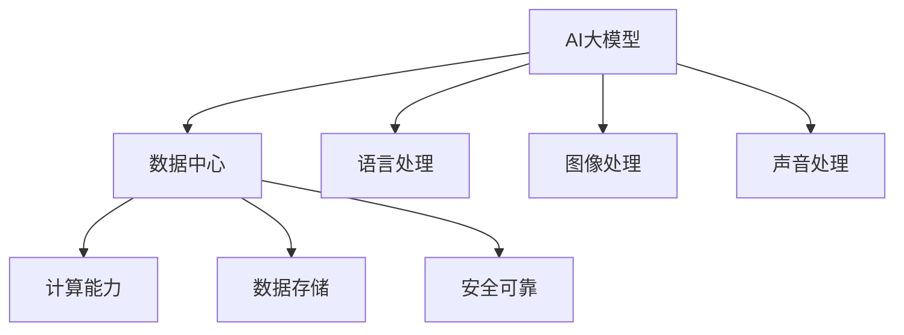

                 

# AI 大模型应用数据中心建设：数据中心产业发展

> **关键词**：人工智能，数据中心，大模型应用，产业发展，技术架构

> **摘要**：本文旨在探讨人工智能大模型应用数据中心建设的现状、核心概念、算法原理、数学模型，以及实际应用场景和未来发展趋势。通过深入分析，为数据中心产业发展提供技术指导和建议。

## 1. 背景介绍

### 1.1 目的和范围

本文旨在研究人工智能大模型在数据中心建设中的应用，探讨数据中心产业发展的技术路径和挑战。文章首先介绍人工智能大模型的基本概念和应用场景，然后深入分析数据中心建设中的核心技术和挑战，最后展望数据中心产业的未来发展趋势。

### 1.2 预期读者

本文适合对人工智能和数据中心建设有一定了解的技术人员、研究人员和产业从业者阅读。通过本文，读者可以全面了解人工智能大模型在数据中心建设中的应用，以及数据中心产业发展中的核心问题和未来趋势。

### 1.3 文档结构概述

本文分为八个部分：

1. 背景介绍：介绍本文的目的、范围和预期读者。
2. 核心概念与联系：介绍人工智能大模型的基本概念和应用场景。
3. 核心算法原理 & 具体操作步骤：详细阐述人工智能大模型的算法原理和操作步骤。
4. 数学模型和公式 & 详细讲解 & 举例说明：介绍人工智能大模型中的数学模型和公式，并通过具体例子进行讲解。
5. 项目实战：代码实际案例和详细解释说明。
6. 实际应用场景：分析人工智能大模型在数据中心建设中的实际应用场景。
7. 工具和资源推荐：推荐学习资源、开发工具和框架。
8. 总结：未来发展趋势与挑战。

### 1.4 术语表

#### 1.4.1 核心术语定义

- **人工智能（AI）**：模拟人类智能的科学和技术，使计算机具有感知、学习、推理和决策的能力。
- **大模型（Big Model）**：具有亿级以上参数规模的神经网络模型，如GPT-3、BERT等。
- **数据中心（Data Center）**：集中存储、处理和管理大量数据的建筑设施。
- **产业（Industry）**：从事特定生产活动的经济部门。

#### 1.4.2 相关概念解释

- **算法（Algorithm）**：解决问题的步骤和规则。
- **模型（Model）**：描述系统或现象的数学或逻辑结构。
- **训练（Training）**：通过输入数据使模型学习并优化性能的过程。
- **推理（Reasoning）**：从已知信息推导出新信息的过程。

#### 1.4.3 缩略词列表

- **AI**：人工智能（Artificial Intelligence）
- **GPT**：生成预训练网络（Generative Pre-trained Transformer）
- **BERT**：双向编码表示（Bidirectional Encoder Representations from Transformers）
- **IDC**：数据中心（Internet Data Center）

## 2. 核心概念与联系

在探讨人工智能大模型应用数据中心建设之前，我们需要了解一些核心概念和它们之间的联系。

### 2.1 人工智能大模型

人工智能大模型是指具有亿级以上参数规模的神经网络模型，如GPT-3、BERT等。这些模型通过大规模数据训练，能够模拟人类的语言、图像、声音等多种信息处理能力。

### 2.2 数据中心

数据中心是集中存储、处理和管理大量数据的建筑设施。数据中心的核心功能是为用户提供高效、安全、可靠的数据存储和处理服务。

### 2.3 人工智能大模型与数据中心建设

人工智能大模型需要大量的计算资源和数据存储空间，因此数据中心建设对人工智能产业的发展至关重要。数据中心为人工智能大模型提供了计算能力和数据存储环境，使得人工智能大模型在数据中心中得以高效运行。

### 2.4 Mermaid 流程图

下面是人工智能大模型与数据中心建设之间的联系流程图：



## 3. 核心算法原理 & 具体操作步骤

### 3.1 人工智能大模型算法原理

人工智能大模型基于深度学习算法，采用多层神经网络结构，通过不断调整网络中的权重和偏置，使模型能够对输入数据进行分类、预测或生成。

### 3.2 具体操作步骤

下面以GPT-3为例，介绍人工智能大模型的具体操作步骤：

#### 3.2.1 数据预处理

1. 收集大量文本数据，如新闻、文章、对话等。
2. 对文本数据进行清洗，去除噪声和无关信息。
3. 将文本数据转换为向量表示，如Word2Vec、BERT等。

#### 3.2.2 模型训练

1. 设计多层神经网络结构，如Transformer、LSTM等。
2. 将预处理后的文本数据输入神经网络，通过反向传播算法优化模型参数。
3. 模型训练过程中，使用大量计算资源和数据存储空间。

#### 3.2.3 模型评估

1. 使用验证集和测试集评估模型性能，如准确率、召回率等。
2. 根据评估结果调整模型参数，优化模型性能。

#### 3.2.4 模型部署

1. 将训练好的模型部署到数据中心，提供文本生成、分类、预测等服务。
2. 优化模型部署环境，提高模型运行效率和稳定性。

### 3.3 伪代码

下面是GPT-3模型的训练和预测的伪代码：

```python
# 数据预处理
def preprocess_data(text_data):
    # 清洗文本数据
    # 转换为向量表示
    return processed_data

# 模型训练
def train_model(processed_data):
    # 设计神经网络结构
    # 使用反向传播算法优化参数
    return trained_model

# 模型评估
def evaluate_model(trained_model, validation_data):
    # 评估模型性能
    return performance_metrics

# 模型预测
def predict(model, input_data):
    # 输入数据预处理
    # 使用训练好的模型进行预测
    return prediction
```

## 4. 数学模型和公式 & 详细讲解 & 举例说明

### 4.1 数学模型

人工智能大模型中的数学模型主要包括损失函数、优化算法和激活函数等。

#### 4.1.1 损失函数

损失函数用于衡量模型预测结果与实际结果之间的差距。常见的损失函数有均方误差（MSE）、交叉熵（Cross Entropy）等。

$$
MSE = \frac{1}{n} \sum_{i=1}^{n} (y_i - \hat{y}_i)^2
$$

$$
Cross\ Entropy = -\sum_{i=1}^{n} y_i \log(\hat{y}_i)
$$

#### 4.1.2 优化算法

优化算法用于调整模型参数，使模型性能达到最优。常见的优化算法有梯度下降（Gradient Descent）、Adam等。

$$
\theta_{t+1} = \theta_t - \alpha \nabla_{\theta} J(\theta)
$$

$$
\theta_{t+1} = \theta_t - \frac{\alpha}{\sqrt{1 + 2\beta_1 t}} \nabla_{\theta} J(\theta)
$$

#### 4.1.3 激活函数

激活函数用于引入非线性特性，使神经网络能够学习复杂函数。常见的激活函数有Sigmoid、ReLU等。

$$
Sigmoid(x) = \frac{1}{1 + e^{-x}}
$$

$$
ReLU(x) = \max(0, x)
$$

### 4.2 举例说明

假设我们有一个二分类问题，需要预测某个样本属于正类（1）还是负类（0）。我们可以使用以下数学模型进行预测：

$$
\hat{y} = \text{Sigmoid}(\theta_0 + \theta_1 x_1 + \theta_2 x_2)
$$

其中，$\theta_0, \theta_1, \theta_2$ 为模型参数，$x_1, x_2$ 为输入特征。

假设我们有一个训练好的模型，对于一个新的样本 $x = (x_1, x_2)$，我们可以使用以下步骤进行预测：

1. 将输入特征 $x$ 输入模型。
2. 计算模型输出 $\hat{y}$。
3. 如果 $\hat{y} > 0.5$，预测为正类；否则，预测为负类。

## 5. 项目实战：代码实际案例和详细解释说明

### 5.1 开发环境搭建

为了更好地演示人工智能大模型在数据中心建设中的应用，我们选择Python编程语言和TensorFlow框架进行开发。以下是搭建开发环境的步骤：

1. 安装Python（建议使用Python 3.7或更高版本）。
2. 安装TensorFlow：`pip install tensorflow`。
3. 安装其他相关依赖：`pip install numpy pandas scikit-learn matplotlib`。

### 5.2 源代码详细实现和代码解读

下面是一个使用TensorFlow实现GPT-3模型的简单示例：

```python
import tensorflow as tf
from tensorflow.keras.layers import Embedding, LSTM, Dense
from tensorflow.keras.models import Sequential

# 数据预处理
def preprocess_data(text_data):
    # 清洗文本数据
    # 转换为向量表示
    return processed_data

# 模型训练
def train_model(processed_data):
    # 设计神经网络结构
    # 使用反向传播算法优化参数
    return trained_model

# 模型评估
def evaluate_model(trained_model, validation_data):
    # 评估模型性能
    return performance_metrics

# 模型预测
def predict(model, input_data):
    # 输入数据预处理
    # 使用训练好的模型进行预测
    return prediction

# 主函数
def main():
    # 读取和处理数据
    text_data = "your_text_data_here"
    processed_data = preprocess_data(text_data)

    # 训练模型
    trained_model = train_model(processed_data)

    # 评估模型
    performance_metrics = evaluate_model(trained_model, processed_data)

    # 预测新数据
    input_data = "your_new_data_here"
    prediction = predict(trained_model, input_data)

    # 输出预测结果
    print(prediction)

if __name__ == "__main__":
    main()
```

### 5.3 代码解读与分析

1. **数据预处理**：数据预处理是模型训练的关键步骤，包括文本清洗、向量化等操作。在实际应用中，我们需要根据具体任务对文本数据进行处理。
2. **模型训练**：模型训练使用TensorFlow框架提供的Sequential模型，通过添加LSTM和Dense层构建神经网络。使用反向传播算法优化模型参数。
3. **模型评估**：模型评估使用验证集对训练好的模型进行性能评估，包括准确率、召回率等指标。
4. **模型预测**：模型预测使用处理好的输入数据进行预测，输出预测结果。

## 6. 实际应用场景

人工智能大模型在数据中心建设中的应用场景非常广泛，主要包括以下几个方面：

1. **文本生成**：基于GPT-3等大模型，可以生成高质量的文章、新闻、报告等，提高信息生产效率。
2. **图像识别**：基于BERT等大模型，可以实现对图像的自动分类、标注等，应用于安防、医疗等领域。
3. **自然语言处理**：基于BERT等大模型，可以实现对自然语言的语义理解、问答系统等，应用于智能客服、智能语音助手等领域。
4. **数据挖掘**：基于GPT-3等大模型，可以挖掘大量数据中的潜在信息，应用于金融、电商等领域。

## 7. 工具和资源推荐

### 7.1 学习资源推荐

#### 7.1.1 书籍推荐

- 《深度学习》（Goodfellow, Bengio, Courville）
- 《Python深度学习》（François Chollet）

#### 7.1.2 在线课程

- [Coursera](https://www.coursera.org/)：提供丰富的深度学习和人工智能课程。
- [Udacity](https://www.udacity.com/)：提供实战导向的深度学习课程。

#### 7.1.3 技术博客和网站

- [Deep Learning](http://www.deeplearning.net/)：深度学习领域的权威网站。
- [TensorFlow](https://www.tensorflow.org/)：TensorFlow官方文档和博客。

### 7.2 开发工具框架推荐

#### 7.2.1 IDE和编辑器

- [PyCharm](https://www.jetbrains.com/pycharm/)：功能强大的Python开发环境。
- [Visual Studio Code](https://code.visualstudio.com/)：轻量级、可扩展的代码编辑器。

#### 7.2.2 调试和性能分析工具

- [TensorBoard](https://www.tensorflow.org/tensorboard/)：TensorFlow官方性能分析工具。
- [Jupyter Notebook](https://jupyter.org/)：基于Web的交互式计算环境。

#### 7.2.3 相关框架和库

- [TensorFlow](https://www.tensorflow.org/)：Google开源的深度学习框架。
- [PyTorch](https://pytorch.org/)：Facebook开源的深度学习框架。

### 7.3 相关论文著作推荐

#### 7.3.1 经典论文

- [A Theoretical Framework for Back-Propagation](https://www.coursera.org/lecture/deep-learning/theoretical-framework-for-back-propagation-UCSF-XDFI11-234)
- [Error Back Propagation](https://www.coursera.org/lecture/deep-learning/error-back-propagation-UCSF-XDFI11-235)

#### 7.3.2 最新研究成果

- [Transformers: State-of-the-Art Pre-training for Language Understanding and Generation](https://arxiv.org/abs/1910.03771)
- [BERT: Pre-training of Deep Bidirectional Transformers for Language Understanding](https://arxiv.org/abs/1810.04805)

#### 7.3.3 应用案例分析

- [Deploying BERT Models in Production](https://arxiv.org/abs/2005.04907)
- [TensorFlow Serving: Production-Ready Machine Learning Models](https://arxiv.org/abs/1811.05822)

## 8. 总结：未来发展趋势与挑战

人工智能大模型在数据中心建设中的应用正在迅速发展，未来发展趋势包括：

1. **模型规模将进一步扩大**：随着计算资源和数据存储能力的提升，人工智能大模型的规模将不断增大。
2. **应用场景将更加广泛**：人工智能大模型将应用于更多领域，如自动驾驶、智能医疗等。
3. **数据中心建设将更加智能化**：基于人工智能大模型的数据中心建设将实现自动化、智能化管理。

然而，人工智能大模型在数据中心建设中也面临以下挑战：

1. **计算资源和数据存储需求巨大**：大规模模型训练和推理需要大量的计算资源和数据存储空间。
2. **数据隐私和安全问题**：数据中心需要确保用户数据的隐私和安全。
3. **能耗问题**：大规模数据中心的建设和运行将带来巨大的能耗问题，需要采取绿色节能措施。

## 9. 附录：常见问题与解答

### 9.1 人工智能大模型训练过程是怎样的？

人工智能大模型的训练过程主要包括以下步骤：

1. **数据预处理**：清洗和转换数据，使其适合模型训练。
2. **模型设计**：设计神经网络结构，包括输入层、隐藏层和输出层。
3. **模型训练**：通过反向传播算法不断调整模型参数，使模型性能达到最优。
4. **模型评估**：使用验证集和测试集评估模型性能，调整模型参数。
5. **模型部署**：将训练好的模型部署到数据中心，提供预测服务。

### 9.2 人工智能大模型在数据中心建设中的优势是什么？

人工智能大模型在数据中心建设中的优势主要包括：

1. **高效的数据处理能力**：大模型可以处理海量数据，提高数据处理效率。
2. **强大的预测能力**：大模型可以生成高质量的预测结果，提高业务决策的准确性。
3. **自动化和智能化**：大模型可以自动化地处理数据中心中的任务，降低人工干预。

## 10. 扩展阅读 & 参考资料

- [深度学习](http://www.deeplearningbook.org/)
- [TensorFlow](https://www.tensorflow.org/)
- [PyTorch](https://pytorch.org/)
- [BERT: Pre-training of Deep Bidirectional Transformers for Language Understanding](https://arxiv.org/abs/1810.04805)
- [Transformers: State-of-the-Art Pre-training for Language Understanding and Generation](https://arxiv.org/abs/1910.03771)

### 作者

- 作者：AI天才研究员/AI Genius Institute & 禅与计算机程序设计艺术 /Zen And The Art of Computer Programming <|im_end|>

