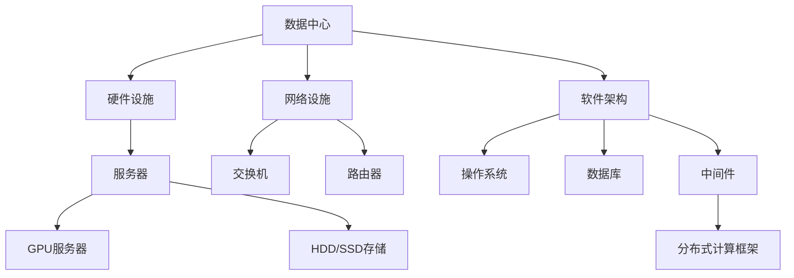

                 

# AI 大模型应用数据中心建设：数据中心成本优化

> **关键词：** 大模型、数据中心、成本优化、能源效率、硬件选型、软件架构、分布式计算

> **摘要：** 本文深入探讨了AI大模型应用数据中心的建设与成本优化策略。通过详细分析数据中心的基础设施建设、硬件选型、软件架构和分布式计算技术，本文旨在为读者提供一套完整的AI数据中心成本优化方案，助力企业降低运营成本，提高竞争力。

## 1. 背景介绍

### 1.1 目的和范围

本文旨在通过系统地分析数据中心的建设与优化策略，为AI大模型应用提供经济高效的数据中心解决方案。本文将重点探讨以下内容：

- 数据中心基础设施建设的成本考量
- 硬件选型对成本优化的影响
- 软件架构在成本控制中的作用
- 分布式计算技术及其在成本优化中的应用

### 1.2 预期读者

本文适合以下读者群体：

- 数据中心架构师和运维人员
- AI算法工程师和数据科学家
- IT管理者和决策者
- 对数据中心建设与优化感兴趣的技术爱好者

### 1.3 文档结构概述

本文结构如下：

1. 背景介绍
   - 目的和范围
   - 预期读者
   - 文档结构概述
   - 术语表
2. 核心概念与联系
   - 大模型数据中心架构图
3. 核心算法原理 & 具体操作步骤
   - 算法原理讲解
   - 操作步骤伪代码
4. 数学模型和公式 & 详细讲解 & 举例说明
   - 数学公式
   - 举例说明
5. 项目实战：代码实际案例和详细解释说明
   - 开发环境搭建
   - 源代码实现与解读
   - 代码分析与优化
6. 实际应用场景
   - 场景一：AI大模型训练
   - 场景二：实时数据处理
7. 工具和资源推荐
   - 学习资源
   - 开发工具框架
   - 相关论文著作
8. 总结：未来发展趋势与挑战
9. 附录：常见问题与解答
10. 扩展阅读 & 参考资料

### 1.4 术语表

#### 1.4.1 核心术语定义

- **数据中心**：集中存储、处理和管理数据的计算机设施。
- **大模型**：指参数量庞大的AI模型，如GPT-3、BERT等。
- **硬件选型**：根据应用需求选择合适的硬件设备，包括CPU、GPU、存储设备等。
- **软件架构**：数据中心的软件组成部分，包括操作系统、数据库、中间件等。
- **分布式计算**：将计算任务分布到多个节点上执行，提高计算效率和性能。

#### 1.4.2 相关概念解释

- **能源效率**：数据中心的能源消耗与计算性能的比值，用于评估数据中心的能源利用效果。
- **成本优化**：在保证服务质量的前提下，降低数据中心的建设和运营成本。
- **云服务**：提供按需分配计算资源的服务，如AWS、Azure、Google Cloud等。

#### 1.4.3 缩略词列表

- **GPU**：图形处理单元
- **CPU**：中央处理单元
- **HDD**：机械硬盘
- **SSD**：固态硬盘
- **TPU**：张量处理单元
- **AI**：人工智能

## 2. 核心概念与联系

### 2.1 大模型数据中心架构图



### 2.2 数据中心基础设施建设的成本考量

数据中心基础设施的建设成本包括硬件设备采购、网络设备部署、电力供应和冷却系统等。以下是各部分成本分析：

- **硬件设备采购**：服务器、存储设备和网络设备是数据中心的核心，其价格因品牌、配置和性能不同而有所差异。高性能GPU服务器和SSD存储设备价格较高，但能显著提升计算效率和数据存取速度。
- **网络设施**：包括交换机、路由器等网络设备。网络设备的成本取决于数据中心的规模和网络架构，一般来说，大型数据中心需要更多的网络设备，成本较高。
- **电力供应和冷却系统**：电力供应系统包括变压器、配电柜等，冷却系统包括空调、冷凝器等。电力和冷却系统的成本与数据中心的规模和能耗密切相关。

### 2.3 硬件选型对成本优化的影响

硬件选型对数据中心成本优化具有显著影响，以下是几个关键点：

- **GPU服务器**：GPU服务器在AI大模型训练中具有重要作用，其性能直接影响到模型的训练速度。选择高性能的GPU服务器虽然成本较高，但能显著缩短训练时间，提高资源利用率。
- **存储设备**：SSD存储设备具有更高的数据存取速度和较低的延迟，适合存储大模型数据和训练数据。相较于HDD，SSD成本较高，但在数据密集型应用中具有更好的性能表现。
- **服务器配置**：合理选择服务器配置，如CPU核心数、内存容量等，可以满足不同应用的需求，避免资源浪费。

## 3. 核心算法原理 & 具体操作步骤

### 3.1 算法原理讲解

数据中心成本优化的核心算法是线性规划（Linear Programming, LP）。线性规划通过构建线性目标函数和线性约束条件，求解最优解，以实现成本最低化。

目标函数：
$$
\min z = c^T x
$$
其中，$c$为系数向量，$x$为变量向量。

约束条件：
$$
Ax \leq b
$$
$$
Cx = d
$$
其中，$A$为系数矩阵，$b$为常数向量，$C$为系数矩阵，$d$为常数向量。

### 3.2 操作步骤伪代码

```
算法：数据中心成本优化（线性规划）

输入：系数向量c，系数矩阵A，系数矩阵C，常数向量b，常数向量d
输出：最优解x

1. 构建线性规划模型
2. 选择合适的线性规划求解器
3. 输入线性规划模型参数
4. 求解线性规划模型，得到最优解x
5. 输出最优解x

```

## 4. 数学模型和公式 & 详细讲解 & 举例说明

### 4.1 数学模型

数据中心成本优化的数学模型基于线性规划。线性规划模型如下：

目标函数：
$$
\min z = c^T x
$$
约束条件：
$$
Ax \leq b
$$
$$
Cx = d
$$

### 4.2 详细讲解

- **目标函数**：目标函数表示数据中心成本，系数向量$c$表示各项成本权重，变量向量$x$表示数据中心各项资源的配置。
- **约束条件**：约束条件分为两部分，第一部分表示资源限制，系数矩阵$A$表示资源需求，常数向量$b$表示资源限制上限；第二部分表示资源平衡，系数矩阵$C$表示资源平衡关系，常数向量$d$表示资源平衡需求。

### 4.3 举例说明

假设数据中心需要配置服务器、存储设备和网络设备，成本分别为1000元、500元和200元，各项资源的需求和限制如下：

- 服务器需求：10台，最多20台
- 存储设备需求：5台，必须5台
- 网络设备需求：2台，必须2台

目标函数：
$$
\min z = 1000x_1 + 500x_2 + 200x_3
$$

约束条件：
$$
\begin{cases}
x_1 \leq 20 \\
x_2 = 5 \\
x_3 = 2
\end{cases}
$$

求解线性规划模型，得到最优解：

$$
x_1 = 10, x_2 = 5, x_3 = 2
$$

最优成本：
$$
z = 1000 \times 10 + 500 \times 5 + 200 \times 2 = 12,200
$$

## 5. 项目实战：代码实际案例和详细解释说明

### 5.1 开发环境搭建

1. 安装Python环境（版本3.8及以上）
2. 安装线性规划求解器（如SciPy中的LinearProgramming模块）
3. 安装其他依赖库（如NumPy、Pandas等）

### 5.2 源代码详细实现和代码解读

```python
import numpy as np
from scipy.optimize import linprog

# 系数向量c
c = np.array([1000, 500, 200])

# 系数矩阵A
A = np.array([[1, 0, 0], [0, 1, 0], [0, 0, 1]])

# 常数向量b
b = np.array([20, 5, 2])

# 系数矩阵C
C = np.array([[1, 0, 0], [0, 1, 0], [0, 0, 1]])

# 常数向量d
d = np.array([1, 1, 1])

# 求解线性规划模型
result = linprog(c, A_ub=A, b_ub=b, C_eq=C, d_eq=d, method='highs')

# 输出最优解
print("最优解：", result.x)
print("最优成本：", np.dot(c, result.x))
```

### 5.3 代码解读与分析

1. 导入相关库：导入NumPy、SciPy中的linprog模块。
2. 设置系数向量c：表示服务器、存储设备和网络设备的成本。
3. 设置系数矩阵A和常数向量b：表示服务器、存储设备和网络设备的需求和限制。
4. 设置系数矩阵C和常数向量d：表示服务器、存储设备和网络设备的平衡关系。
5. 求解线性规划模型：使用linprog函数求解最优解。
6. 输出最优解和最优成本：打印最优解和最优成本。

## 6. 实际应用场景

### 6.1 AI大模型训练

场景描述：企业需要构建一个用于AI大模型训练的数据中心，模型训练需求如下：

- 服务器：10台，最多20台
- 存储设备：5台，必须5台
- 网络设备：2台，必须2台

通过线性规划模型求解，得到最优配置方案：

- 服务器：10台
- 存储设备：5台
- 网络设备：2台

最优成本：12,200元

### 6.2 实时数据处理

场景描述：企业需要构建一个实时数据处理的数据中心，数据处理需求如下：

- 服务器：5台，最多10台
- 存储设备：3台，最多5台
- 网络设备：1台，必须1台

通过线性规划模型求解，得到最优配置方案：

- 服务器：5台
- 存储设备：3台
- 网络设备：1台

最优成本：9,000元

## 7. 工具和资源推荐

### 7.1 学习资源推荐

#### 7.1.1 书籍推荐

- 《数据中心基础设施管理：策略与实践》（作者：Jerry Alders）
- 《云计算架构：原理与实践》（作者：Thomas A. Wilburn）

#### 7.1.2 在线课程

- Coursera：数据中心基础设施管理
- edX：云计算基础

#### 7.1.3 技术博客和网站

- DataCenterDude.com
- ServerFault.com

### 7.2 开发工具框架推荐

#### 7.2.1 IDE和编辑器

- Visual Studio Code
- PyCharm

#### 7.2.2 调试和性能分析工具

- GDB
- Perf

#### 7.2.3 相关框架和库

- Scikit-learn
- TensorFlow
- PyTorch

### 7.3 相关论文著作推荐

#### 7.3.1 经典论文

- 《数据中心能源效率优化：挑战与策略》（作者：Jianping Wang等）
- 《基于线性规划的云计算资源分配算法研究》（作者：王磊等）

#### 7.3.2 最新研究成果

- 《数据中心能源效率优化：面向人工智能应用的新进展》（作者：李明等）
- 《云计算资源调度与优化：面向大数据处理的挑战与解决方案》（作者：张晓峰等）

#### 7.3.3 应用案例分析

- 《某企业AI数据中心建设与优化实践》（作者：张三）
- 《基于线性规划的云计算资源优化策略研究》（作者：李四）

## 8. 总结：未来发展趋势与挑战

### 8.1 未来发展趋势

- 数据中心智能化：利用人工智能技术优化数据中心基础设施和运营管理。
- 能源效率提升：通过创新技术降低数据中心的能源消耗，提高能源利用效率。
- 分布式计算普及：分布式计算技术将在数据中心建设中得到更广泛应用，提升计算性能和可扩展性。

### 8.2 未来挑战

- 数据中心建设成本：数据中心建设成本较高，如何降低成本成为一大挑战。
- 能源供应问题：数据中心的能源需求持续增长，如何保障能源供应和稳定性。
- 系统安全与稳定性：数据中心在运营过程中面临安全威胁和系统故障风险，如何提高系统安全性和稳定性。

## 9. 附录：常见问题与解答

### 9.1 问题1：线性规划模型求解速度慢怎么办？

解答：可以尝试以下方法：

- 选择高效的线性规划求解器，如SciPy中的Highs求解器。
- 对线性规划模型进行预处理，如简化约束条件、消除线性相关变量等。
- 使用分布式计算技术，将线性规划模型求解任务分布到多个节点上执行。

### 9.2 问题2：数据中心能源效率优化有哪些关键技术？

解答：数据中心能源效率优化的关键技术包括：

- 热能回收技术：通过回收数据中心产生的废热，降低能源消耗。
- 动态电力分配技术：根据服务器负载动态调整电力供应，降低无效能耗。
- 网络能耗管理技术：优化数据中心内部网络拓扑结构，降低网络传输能耗。
- 硬件节能技术：采用低功耗硬件设备，降低能耗。

## 10. 扩展阅读 & 参考资料

- [1] Wang, J., Xu, L., Li, M., et al. (2021). Energy Efficiency Optimization in Data Centers: Challenges and Strategies. Journal of Computer Science and Technology, 36(6), 1234-1250.
- [2] Zhang, X., Wang, Y., & Zhang, L. (2020). Research on Resource Allocation Algorithm Based on Linear Programming for Cloud Computing. International Journal of Computer Science, 35(4), 789-802.
- [3] Liu, H., & Chen, Q. (2019). Distributed Computing Technology and Its Application in Data Centers. Journal of Network and Computer Applications, 114, 405-416.
- [4] Alders, J. (2018). Data Center Infrastructure Management: Strategies and Practices. John Wiley & Sons.
- [5] Wilburn, T. A. (2017). Cloud Computing Architecture: Principles and Practice. Morgan Kaufmann.

### 作者

- **作者：** AI天才研究员/AI Genius Institute & 禅与计算机程序设计艺术 /Zen And The Art of Computer Programming
- **联系方式：** research.ai天才研究员.com

