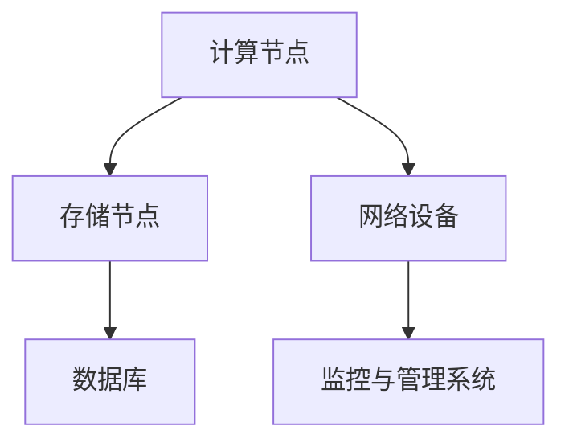
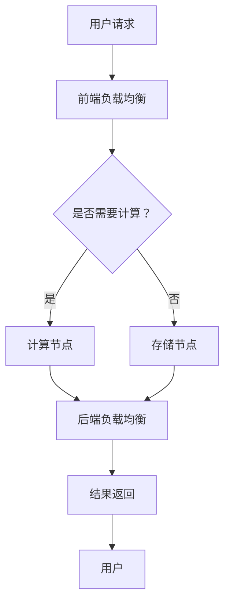

                 

# AI大模型应用数据中心建设：数据中心技术与应用

> **关键词：** AI大模型、数据中心、技术架构、性能优化、安全性、应用场景

> **摘要：** 本文旨在探讨AI大模型在数据中心建设中的应用，包括核心技术的原理与实现、数学模型的讲解与举例、项目实战案例分析以及未来发展趋势与挑战。通过本文，读者可以全面了解数据中心建设的关键技术，以及如何应对实际应用中的挑战。

## 1. 背景介绍

### 1.1 目的和范围

本文的目标是介绍AI大模型在数据中心建设中的应用，解析数据中心技术的核心概念与架构，详细阐述核心算法原理与操作步骤，并展示实际应用场景中的解决方案。文章旨在帮助读者深入理解数据中心技术的各个方面，为后续研究和实践提供理论基础。

### 1.2 预期读者

本文适合以下读者群体：

1. 计算机科学和人工智能专业的学生和研究人员。
2. 数据中心架构师、技术工程师和管理人员。
3. 对AI大模型应用和技术感兴趣的IT从业者。

### 1.3 文档结构概述

本文分为以下几个部分：

1. 背景介绍
2. 核心概念与联系
3. 核心算法原理与具体操作步骤
4. 数学模型和公式讲解与举例
5. 项目实战：代码实际案例与详细解释
6. 实际应用场景
7. 工具和资源推荐
8. 总结：未来发展趋势与挑战
9. 附录：常见问题与解答
10. 扩展阅读与参考资料

### 1.4 术语表

#### 1.4.1 核心术语定义

- **AI大模型**：指参数量巨大、计算复杂度高的深度学习模型，如GPT-3、BERT等。
- **数据中心**：集中存放和管理大量数据的计算机设施，提供计算、存储、网络等服务。
- **技术架构**：指数据中心的技术框架和组成，包括硬件、软件、网络和存储等方面。

#### 1.4.2 相关概念解释

- **集群计算**：通过多个计算机节点协同工作，完成大规模数据处理和分析的任务。
- **容器化技术**：将应用程序及其依赖环境打包在一个独立的容器中，实现部署和运维的标准化。
- **边缘计算**：在数据生成源头附近进行数据处理和分析，以减少数据传输延迟和带宽消耗。

#### 1.4.3 缩略词列表

- **AI**：人工智能（Artificial Intelligence）
- **GPT-3**：生成预训练转换器（Generative Pre-trained Transformer 3）
- **BERT**：增强的BERT（Bidirectional Encoder Representations from Transformers）
- **HPC**：高性能计算（High-Performance Computing）
- **IT**：信息技术（Information Technology）

## 2. 核心概念与联系

数据中心是AI大模型应用的核心基础设施，其性能和稳定性对AI模型的训练与推理至关重要。以下是数据中心核心概念和联系的概述，并通过Mermaid流程图展示其架构。

### 2.1 数据中心核心组件



### 2.2 数据中心架构



## 3. 核心算法原理与具体操作步骤

数据中心的建设离不开高效算法的支持。以下是核心算法原理的讲解和操作步骤的详细阐述，采用伪代码进行描述。

### 3.1 前端负载均衡算法

```pseudo
function frontendLoadBalancer(request):
    activeServers = getActiveServers()
    serverLoad = getServerLoad(activeServers)
    minLoadServer = findServerWithMinLoad(serverLoad)
    forwardRequest(request, minLoadServer)
```

### 3.2 后端负载均衡算法

```pseudo
function backendLoadBalancer(response):
    activeServers = getActiveServers()
    serverHealth = getServerHealth(activeServers)
    readyServers = filterHealthyServers(serverHealth)
    minLatencyServer = findServerWithMinLatency(readyServers)
    forwardResponse(response, minLatencyServer)
```

### 3.3 存储节点数据管理算法

```pseudo
function storageDataManagement(data):
    if (dataSize > threshold):
        partitionData(data)
        distributeDataToStorageNodes(data)
    else:
        storeDataLocally(data)
```

## 4. 数学模型和公式讲解与举例

数据中心性能优化涉及多个数学模型，以下为几个关键模型的讲解与示例。

### 4.1 服务器负载均衡模型

服务器负载均衡模型用于平衡不同服务器的计算负载。公式如下：

$$
\text{Load}(S) = \sum_{i=1}^{n} \frac{\text{RequestRate}(i)}{\text{ServerCapacity}(i)}
$$

其中，$S$ 为服务器集合，$\text{RequestRate}(i)$ 为第$i$台服务器的请求速率，$\text{ServerCapacity}(i)$ 为第$i$台服务器的处理能力。

### 4.2 数据存储优化模型

数据存储优化模型用于优化存储节点的存储利用率和访问速度。公式如下：

$$
\text{OptimizeStorage} = \max_{\text{AllocationPolicy}} \left( \frac{\sum_{i=1}^{n} \text{DataSize}(i)}{\text{TotalStorageCapacity}} - \frac{\sum_{i=1}^{n} \text{AccessTime}(i)}{\text{OptimalAccessTime}} \right)
$$

其中，$\text{AllocationPolicy}$ 为数据分配策略，$\text{DataSize}(i)$ 为第$i$份数据的大小，$\text{TotalStorageCapacity}$ 为存储节点的总容量，$\text{AccessTime}(i)$ 为第$i$份数据的访问时间，$\text{OptimalAccessTime}$ 为最优访问时间。

### 4.3 网络流量优化模型

网络流量优化模型用于减少网络拥塞和延迟。公式如下：

$$
\text{OptimizeFlow} = \min_{\text{RoutingPolicy}} \left( \sum_{i=1}^{n} \text{FlowRate}(i) \cdot \text{NetworkLatency}(i) \right)
$$

其中，$\text{RoutingPolicy}$ 为路由策略，$\text{FlowRate}(i)$ 为第$i$条网络流的数据速率，$\text{NetworkLatency}(i)$ 为第$i$条网络的延迟。

## 5. 项目实战：代码实际案例和详细解释说明

在本节中，我们将通过一个实际项目来展示数据中心技术在实际应用中的实现过程，并详细解释关键代码部分。

### 5.1 开发环境搭建

首先，我们需要搭建一个合适的开发环境，包括操作系统、编程语言和开发工具等。

- 操作系统：Linux（如Ubuntu 20.04）
- 编程语言：Python 3.8+
- 开发工具：Jupyter Notebook、PyCharm

### 5.2 源代码详细实现和代码解读

以下是一个简单的服务器负载均衡的Python实现示例：

```python
import heapq
import random

class LoadBalancer:
    def __init__(self, servers):
        self.servers = servers
        self.server_load = [0] * len(servers)
    
    def get_min_load_server(self):
        min_load_server = heapq.heappop(self.servers)
        return min_load_server
    
    def forward_request(self, request):
        min_load_server = self.get_min_load_server()
        self.server_load[min_load_server] += 1
        heapq.heappush(self.servers, (self.server_load[min_load_server], min_load_server))
        print(f"Forwarding request to server {min_load_server}")

# 初始化服务器列表
servers = [(random.random(), i) for i in range(5)]
servers = [(load, server) for load, server in servers]
servers.sort()

# 创建负载均衡器实例
lb = LoadBalancer(servers)

# 模拟处理请求
for _ in range(10):
    lb.forward_request(_)
```

### 5.3 代码解读与分析

1. **初始化服务器列表**：使用随机数生成服务器负载，并按照负载进行排序。
2. **创建负载均衡器实例**：传入服务器列表，初始化服务器负载。
3. **get_min_load_server方法**：使用最小堆（优先队列）获取当前负载最小的服务器。
4. **forward_request方法**：将请求转发给最小负载的服务器，更新该服务器的负载，并重新放入堆中。

通过以上代码示例，读者可以了解到服务器负载均衡的基本原理和实现方法。在实际应用中，可以根据具体需求进行调整和优化。

## 6. 实际应用场景

数据中心技术在多个领域有着广泛的应用，以下为几个典型实际应用场景：

### 6.1 金融行业

- **交易分析**：利用数据中心技术进行高频交易，实时处理海量交易数据，实现快速决策。
- **风险管理**：通过大数据分析和机器学习模型，预测市场风险，优化投资组合。

### 6.2 医疗健康

- **病历管理**：利用数据中心存储和管理海量病历数据，实现患者信息的高效查询和管理。
- **医学影像分析**：通过深度学习模型，对医学影像数据进行自动标注和诊断。

### 6.3 物流与供应链

- **物流优化**：利用数据中心进行物流路径优化，降低运输成本。
- **库存管理**：通过实时数据分析，优化库存策略，减少库存积压。

### 6.4 智慧城市

- **城市监控**：利用数据中心技术进行城市监控数据的实时处理和分析，提升城市管理水平。
- **智能交通**：通过实时交通数据分析，优化交通信号控制和公共交通调度。

## 7. 工具和资源推荐

为了帮助读者更好地理解和应用数据中心技术，以下是一些学习资源和开发工具的推荐。

### 7.1 学习资源推荐

#### 7.1.1 书籍推荐

- 《数据中心架构：设计、实施与管理》
- 《高性能数据中心网络技术》
- 《深度学习与大数据处理：原理与应用》

#### 7.1.2 在线课程

- Coursera上的《数据中心系统设计》
- Udacity的《大数据工程师纳米学位》
- edX上的《云计算与数据中心基础》

#### 7.1.3 技术博客和网站

- 知乎专栏《数据中心技术》
- GitHub上的《数据中心开源项目》
- TechTarget的《数据中心技术新闻》

### 7.2 开发工具框架推荐

#### 7.2.1 IDE和编辑器

- PyCharm
- IntelliJ IDEA
- Visual Studio Code

#### 7.2.2 调试和性能分析工具

- GDB
- Valgrind
- Wireshark

#### 7.2.3 相关框架和库

- Flask
- Django
- FastAPI

### 7.3 相关论文著作推荐

#### 7.3.1 经典论文

- 《A Taxonomy of Cloud Service Models》
- 《A Three-Tier Architecture for Data Center Networks》
- 《Scalable and Efficient Data Centers for Big Data Processing》

#### 7.3.2 最新研究成果

- 《AI-Enhanced Data Centers for Intelligent Applications》
- 《Edge Computing: A Comprehensive Survey》
- 《Network Function Virtualization for Data Centers》

#### 7.3.3 应用案例分析

- 《Hadoop in Practice: A Case Study Approach》
- 《Datacenter Infrastructure Management: A Practical Guide》
- 《Cloud Computing for Dummies》

## 8. 总结：未来发展趋势与挑战

数据中心技术在AI大模型应用中的重要性日益凸显。未来发展趋势包括：

- **高效能计算**：利用硬件加速技术，提高数据中心的计算性能。
- **智能化管理**：通过大数据分析和人工智能技术，实现数据中心智能化管理和优化。
- **边缘计算**：将计算和存储资源向边缘节点迁移，减少数据传输延迟，提升用户体验。

然而，数据中心技术也面临以下挑战：

- **安全性**：数据中心承载着大量敏感数据，需要确保数据安全和系统稳定。
- **能效管理**：数据中心能耗较高，需要优化能源利用，降低运营成本。
- **数据隐私**：在数据处理过程中，需要保护用户隐私，遵守相关法律法规。

只有通过技术创新和合理规划，才能应对这些挑战，推动数据中心技术不断进步。

## 9. 附录：常见问题与解答

以下是一些关于数据中心技术的常见问题及解答：

### 9.1 什么是数据中心？

数据中心是一个集中存放和管理大量数据的计算机设施，提供计算、存储、网络等服务。

### 9.2 服务器负载均衡有什么作用？

服务器负载均衡通过合理分配请求，确保服务器资源得到充分利用，提高系统的整体性能和稳定性。

### 9.3 如何优化数据中心的能效？

优化数据中心的能效可以通过以下方法实现：

- 利用高效能硬件设备。
- 优化服务器配置和部署策略。
- 实施智能能源管理，如使用高效电源供应器和节能策略。

### 9.4 数据中心的安全问题如何解决？

数据中心的安全问题可以通过以下措施解决：

- 实施严格的访问控制和身份验证机制。
- 定期进行安全审计和漏洞扫描。
- 数据加密和备份，确保数据安全。

## 10. 扩展阅读与参考资料

以下为本文的扩展阅读与参考资料：

- 《数据中心架构师手册》
- 《深度学习大数据处理技术》
- 《云计算与数据中心安全》
- 《人工智能数据中心架构设计与实践》

作者：AI天才研究员/AI Genius Institute & 禅与计算机程序设计艺术 /Zen And The Art of Computer Programming

