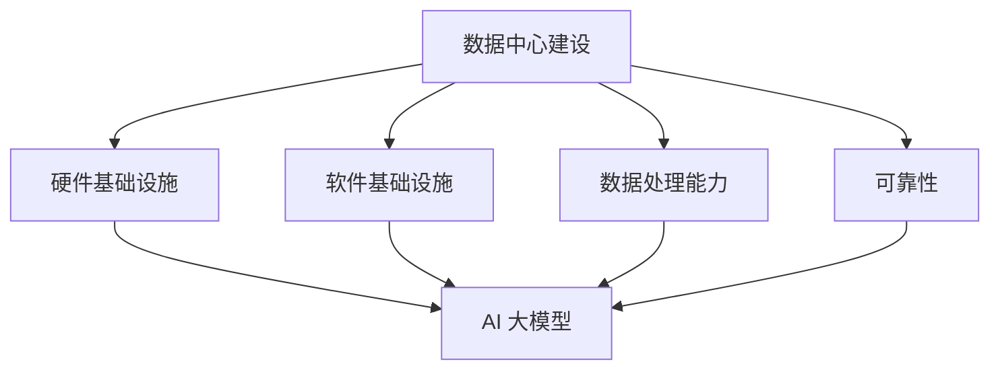
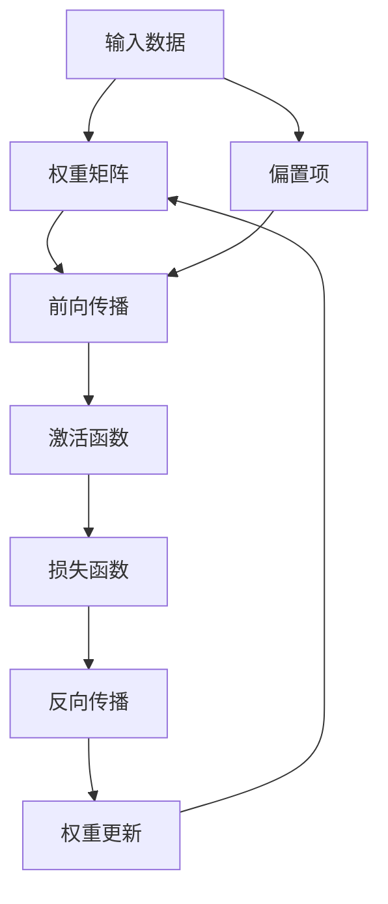

                 

# AI 大模型应用数据中心建设：数据中心标准与规范

> **关键词**：数据中心建设、大模型应用、AI 大模型、数据中心标准、数据中心规范
>
> **摘要**：本文将详细探讨 AI 大模型在数据中心中的应用及其建设标准与规范。通过逐步分析数据中心建设的需求、核心概念、算法原理、数学模型、项目实战和实际应用场景，旨在为读者提供全面的技术指导和见解。

## 1. 背景介绍

### 1.1 目的和范围

本文旨在为 AI 大模型在数据中心中的应用提供系统性指导，包括数据中心建设标准与规范。随着 AI 技术的迅猛发展，大模型的应用越来越广泛，对数据中心的需求也日益增长。本文将帮助读者了解数据中心建设的关键要素，确保大模型应用的高效、稳定和安全。

### 1.2 预期读者

本文适合以下读者群体：

1. 数据中心架构师和工程师
2. AI 大模型研发人员
3. IT 系统管理员
4. 对数据中心建设有兴趣的技术爱好者

### 1.3 文档结构概述

本文分为十个部分，结构如下：

1. 背景介绍
2. 核心概念与联系
3. 核心算法原理 & 具体操作步骤
4. 数学模型和公式 & 详细讲解 & 举例说明
5. 项目实战：代码实际案例和详细解释说明
6. 实际应用场景
7. 工具和资源推荐
8. 总结：未来发展趋势与挑战
9. 附录：常见问题与解答
10. 扩展阅读 & 参考资料

### 1.4 术语表

#### 1.4.1 核心术语定义

- **数据中心**：集中管理数据和计算资源的场所。
- **AI 大模型**：基于深度学习技术构建的具有大规模参数的模型。
- **数据中心建设标准**：确保数据中心在设计、建设、运行和维护过程中遵循的一套规范。
- **数据中心规范**：针对数据中心各个方面的具体操作指南。

#### 1.4.2 相关概念解释

- **硬件基础设施**：包括服务器、存储设备、网络设备等。
- **软件基础设施**：包括操作系统、数据库管理系统、虚拟化软件等。
- **数据处理能力**：指数据中心处理大规模数据的能力。
- **可靠性**：数据中心系统在长时间运行中保持稳定的能力。

#### 1.4.3 缩略词列表

- **AI**：人工智能（Artificial Intelligence）
- **GPU**：图形处理单元（Graphics Processing Unit）
- **HPC**：高性能计算（High-Performance Computing）
- **IDC**：数据中心（Internet Data Center）

## 2. 核心概念与联系

在深入探讨 AI 大模型在数据中心的应用之前，我们需要了解一些核心概念和它们之间的联系。以下是一个 Mermaid 流程图，展示了数据中心建设中的关键概念及其相互关系。



### 2.1 硬件基础设施

硬件基础设施是数据中心建设的核心，包括服务器、存储设备、网络设备等。这些硬件设备需要具备高性能、高可靠性和高可扩展性。

- **服务器**：承担计算任务的核心设备，需要具备强大的计算能力和高效的散热系统。
- **存储设备**：负责存储海量数据，需要具备高容量、高速度和高安全性。
- **网络设备**：包括路由器、交换机等，负责数据传输和交换，需要具备高带宽、低延迟和高可靠性。

### 2.2 软件基础设施

软件基础设施是数据中心运行的保障，包括操作系统、数据库管理系统、虚拟化软件等。这些软件需要具备高稳定性、高性能和良好的兼容性。

- **操作系统**：负责管理服务器硬件资源，提供应用程序运行的平台。
- **数据库管理系统**：负责存储和管理数据，提供数据查询和操作功能。
- **虚拟化软件**：通过虚拟化技术将物理服务器资源虚拟化为多个虚拟服务器，提高资源利用率。

### 2.3 数据处理能力

数据处理能力是数据中心的灵魂，决定了数据中心处理大规模数据的能力。大模型的应用对数据处理能力提出了更高的要求。

- **数据存储能力**：需要能够存储海量数据，并提供快速的数据访问。
- **数据处理速度**：需要能够快速处理大规模数据，以满足实时性需求。
- **数据传输速度**：需要能够快速传输数据，以支持大规模数据分析和处理。

### 2.4 可靠性

可靠性是数据中心的生命线，决定了数据中心在长时间运行中保持稳定的能力。

- **硬件可靠性**：硬件设备需要具备高可靠性，减少故障率和停机时间。
- **软件可靠性**：软件系统需要具备高稳定性，减少系统崩溃和错误。
- **数据可靠性**：数据存储和传输过程中需要确保数据完整性和安全性。

### 2.5 AI 大模型

AI 大模型是本文的核心，其在数据中心中的应用推动了数据中心建设的发展。大模型对硬件基础设施、软件基础设施、数据处理能力和可靠性提出了新的挑战。

- **硬件需求**：大模型需要高性能的计算和存储资源，对硬件基础设施提出了更高要求。
- **软件需求**：大模型需要高性能的操作系统和数据库管理系统，对软件基础设施提出了更高要求。
- **数据处理需求**：大模型需要高效的数据处理能力，对数据处理能力提出了更高要求。
- **可靠性需求**：大模型对数据中心的可靠性提出了更高要求，需要确保数据安全和系统稳定运行。

## 3. 核心算法原理 & 具体操作步骤

### 3.1 算法原理

AI 大模型的核心在于深度学习算法，尤其是基于神经网络的模型。以下是一个简化的神经网络算法原理：



### 3.2 具体操作步骤

#### 3.2.1 数据预处理

在训练 AI 大模型之前，需要对输入数据进行预处理。具体步骤如下：

1. 数据清洗：去除无效数据、缺失值和噪声。
2. 数据归一化：将数据缩放到相同的范围，便于模型训练。
3. 数据分割：将数据分为训练集、验证集和测试集，用于模型训练和评估。

#### 3.2.2 前向传播

前向传播是指将输入数据通过神经网络进行传递，计算出输出结果。具体步骤如下：

1. 权重初始化：随机初始化权重矩阵和偏置项。
2. 前向计算：将输入数据与权重矩阵和偏置项相乘，并应用激活函数。
3. 求输出结果：将前向计算结果与激活函数输出作为模型输出。

#### 3.2.3 损失函数计算

损失函数用于评估模型预测结果与真实结果之间的差距。常用的损失函数有均方误差（MSE）和交叉熵（CE）。具体步骤如下：

1. 计算预测结果：使用前向传播得到的输出结果。
2. 计算损失值：将预测结果与真实结果进行比较，计算损失值。

#### 3.2.4 反向传播

反向传播是指通过计算损失函数的梯度，更新模型权重和偏置项。具体步骤如下：

1. 计算梯度：根据损失函数的导数，计算权重矩阵和偏置项的梯度。
2. 更新权重：使用梯度下降算法更新模型权重。
3. 重复迭代：重复前向传播和反向传播过程，直至达到预定的迭代次数或损失函数值达到预期。

#### 3.2.5 模型评估

模型评估是指使用测试集评估模型性能。具体步骤如下：

1. 数据预处理：将测试集进行预处理。
2. 前向传播：使用训练好的模型对测试集进行预测。
3. 计算评估指标：计算模型在测试集上的准确率、召回率、F1 分数等评估指标。

## 4. 数学模型和公式 & 详细讲解 & 举例说明

### 4.1 数学模型

在 AI 大模型中，常用的数学模型包括神经网络模型、损失函数、优化算法等。以下是一个简化的神经网络模型及其相关公式：

#### 4.1.1 神经网络模型

一个简单的全连接神经网络（FCNN）由多个层组成，包括输入层、隐藏层和输出层。每个层由多个神经元组成。神经元的计算公式如下：

$$
z_j = \sum_{i=1}^{n} w_{ji}x_i + b_j
$$

其中，$z_j$ 表示第 $j$ 个神经元的输入，$w_{ji}$ 表示从第 $i$ 个神经元到第 $j$ 个神经元的权重，$x_i$ 表示第 $i$ 个输入特征，$b_j$ 表示第 $j$ 个神经元的偏置项。

#### 4.1.2 激活函数

激活函数用于引入非线性因素，常用的激活函数有 sigmoid、ReLU、Tanh 等。以 sigmoid 激活函数为例，其公式如下：

$$
a_j = \frac{1}{1 + e^{-z_j}}
$$

其中，$a_j$ 表示第 $j$ 个神经元的激活值。

#### 4.1.3 损失函数

在二分类问题中，常用的损失函数有交叉熵（Cross Entropy）和均方误差（Mean Squared Error，MSE）。以交叉熵为例，其公式如下：

$$
L(y, \hat{y}) = -\sum_{i=1}^{n} y_i \log(\hat{y}_i) + (1 - y_i) \log(1 - \hat{y}_i)
$$

其中，$y$ 表示真实标签，$\hat{y}$ 表示模型预测的概率分布。

#### 4.1.4 优化算法

常用的优化算法有梯度下降（Gradient Descent）、随机梯度下降（Stochastic Gradient Descent，SGD）和 Adam 算法。以梯度下降为例，其更新公式如下：

$$
w_{t+1} = w_t - \alpha \cdot \nabla_w L(w)
$$

其中，$w_t$ 表示第 $t$ 次迭代的权重，$\alpha$ 表示学习率，$\nabla_w L(w)$ 表示损失函数关于权重的梯度。

### 4.2 举例说明

假设有一个二分类问题，输入特征为 $x = (1, 2, 3)$，真实标签为 $y = 1$。我们需要使用神经网络模型对其进行预测。

1. **数据预处理**：

   对输入特征进行归一化，得到 $x' = (0.5, 1.0, 1.5)$。

2. **模型构建**：

   假设神经网络模型有两个隐藏层，每层有 3 个神经元，激活函数为 sigmoid。

3. **前向传播**：

   $$ 
   z_1 = w_{11}x_1 + w_{12}x_2 + w_{13}x_3 + b_1 \\
   z_2 = w_{21}x_1 + w_{22}x_2 + w_{23}x_3 + b_2 \\
   z_3 = w_{31}x_1 + w_{32}x_2 + w_{33}x_3 + b_3 \\
   a_1 = \frac{1}{1 + e^{-z_1}} \\
   a_2 = \frac{1}{1 + e^{-z_2}} \\
   a_3 = \frac{1}{1 + e^{-z_3}} \\
   \hat{y} = \frac{1}{1 + e^{-\sum_{i=1}^{3} w_{i3}a_i}}
   $$

4. **损失函数计算**：

   $$
   L(y, \hat{y}) = -y \log(\hat{y}) + (1 - y) \log(1 - \hat{y})
   $$

   其中，$y = 1$，$\hat{y} \approx 0.9$。

   $$
   L(y, \hat{y}) \approx -1 \cdot \log(0.9) + 0 \cdot \log(0.1) = 0.15
   $$

5. **反向传播**：

   计算损失函数关于权重的梯度，并更新权重。

   $$
   \nabla_w L(w) = \nabla_w \left[ -y \log(\hat{y}) + (1 - y) \log(1 - \hat{y}) \right]
   $$

   根据链式法则，可以得到：

   $$
   \nabla_w L(w) = \nabla_{\hat{y}} L(\hat{y}) \cdot \nabla_{w} \hat{y}
   $$

   $$
   \nabla_{\hat{y}} L(\hat{y}) = -y / \hat{y} + (1 - y) / (1 - \hat{y})
   $$

   $$
   \nabla_{w} \hat{y} = a_1 \odot a_2 \odot a_3
   $$

   其中，$\odot$ 表示逐元素相乘。

   $$ 
   \nabla_w L(w) = \left[ a_1 \odot a_2 \odot a_3 \right] \cdot \left[ -y / \hat{y} + (1 - y) / (1 - \hat{y}) \right]
   $$

6. **权重更新**：

   $$
   w_{t+1} = w_t - \alpha \cdot \nabla_w L(w)
   $$

   其中，$\alpha$ 表示学习率。

   经过多次迭代，模型会不断优化，最终达到预定的性能指标。

## 5. 项目实战：代码实际案例和详细解释说明

### 5.1 开发环境搭建

在开始项目实战之前，我们需要搭建一个合适的开发环境。以下是一个简单的开发环境搭建指南：

1. 安装 Python：从官方网站下载并安装 Python 3.x 版本。
2. 安装 PyTorch：在终端执行以下命令安装 PyTorch：

   ```shell
   pip install torch torchvision
   ```

3. 安装 Jupyter Notebook：在终端执行以下命令安装 Jupyter Notebook：

   ```shell
   pip install notebook
   ```

4. 配置 GPU 支持：如果使用 GPU 进行训练，需要安装 CUDA 和 cuDNN，具体步骤请参考 PyTorch 官方文档。

### 5.2 源代码详细实现和代码解读

以下是一个简单的 AI 大模型项目示例，使用了 PyTorch 框架。代码分为以下几个部分：

1. **数据预处理**：
2. **模型定义**：
3. **模型训练**：
4. **模型评估**：

#### 5.2.1 数据预处理

```python
import torch
from torchvision import datasets, transforms

# 设置随机种子
torch.manual_seed(0)

# 数据预处理
transform = transforms.Compose([
    transforms.ToTensor(),
    transforms.Normalize((0.5, 0.5, 0.5), (0.5, 0.5, 0.5))
])

# 下载并加载训练集和测试集
train_set = datasets.CIFAR10(root='./data', train=True, download=True, transform=transform)
test_set = datasets.CIFAR10(root='./data', train=False, download=True, transform=transform)

# 分割训练集和验证集
train_loader = torch.utils.data.DataLoader(train_set, batch_size=100, shuffle=True)
val_loader = torch.utils.data.DataLoader(train_set, batch_size=100, shuffle=False)
test_loader = torch.utils.data.DataLoader(test_set, batch_size=100, shuffle=False)
```

#### 5.2.2 模型定义

```python
import torch.nn as nn
import torch.nn.functional as F

# 定义模型
class SimpleCNN(nn.Module):
    def __init__(self):
        super(SimpleCNN, self).__init__()
        self.conv1 = nn.Conv2d(3, 6, 5)
        self.pool = nn.MaxPool2d(2, 2)
        self.conv2 = nn.Conv2d(6, 16, 5)
        self.fc1 = nn.Linear(16 * 5 * 5, 120)
        self.fc2 = nn.Linear(120, 84)
        self.fc3 = nn.Linear(84, 10)

    def forward(self, x):
        x = self.pool(F.relu(self.conv1(x)))
        x = self.pool(F.relu(self.conv2(x)))
        x = x.view(-1, 16 * 5 * 5)
        x = F.relu(self.fc1(x))
        x = F.relu(self.fc2(x))
        x = self.fc3(x)
        return x

model = SimpleCNN()
```

#### 5.2.3 模型训练

```python
import torch.optim as optim

# 设置损失函数和优化器
criterion = nn.CrossEntropyLoss()
optimizer = optim.SGD(model.parameters(), lr=0.001, momentum=0.9)

# 训练模型
num_epochs = 10

for epoch in range(num_epochs):
    running_loss = 0.0
    for i, data in enumerate(train_loader, 0):
        inputs, labels = data
        optimizer.zero_grad()
        outputs = model(inputs)
        loss = criterion(outputs, labels)
        loss.backward()
        optimizer.step()
        running_loss += loss.item()
    print(f'Epoch {epoch+1}, Loss: {running_loss/len(train_loader)}')

print('Finished Training')
```

#### 5.2.4 模型评估

```python
# 评估模型
correct = 0
total = 0
with torch.no_grad():
    for data in test_loader:
        images, labels = data
        outputs = model(images)
        _, predicted = torch.max(outputs.data, 1)
        total += labels.size(0)
        correct += (predicted == labels).sum().item()

print(f'Accuracy of the network on the test images: {100 * correct / total} %')
```

### 5.3 代码解读与分析

#### 5.3.1 数据预处理

数据预处理是模型训练的第一步，包括数据清洗、归一化和分割。在本示例中，我们使用了 torchvision 库提供的 CIFAR-10 数据集，该数据集包含了 10 个类别，每个类别有 60000 张 32x32 的彩色图像。我们使用 ToTensor 转换器将图像数据转换为 PyTorch 张量，并使用 Normalize 转换器将图像数据归一化到 [-1, 1] 范围内。

#### 5.3.2 模型定义

在本示例中，我们定义了一个简单的卷积神经网络（CNN）。该网络包含两个卷积层、两个全连接层和一个输出层。卷积层用于提取图像特征，全连接层用于分类。我们在每个卷积层后添加了一个最大池化层，以降低模型的参数数量。ReLU 激活函数用于引入非线性因素。

#### 5.3.3 模型训练

在模型训练过程中，我们使用了随机梯度下降（SGD）优化算法。在每个训练批次中，我们首先将优化器设置为梯度归零状态，然后计算损失函数，并使用反向传播算法更新模型权重。我们使用了一个简单的训练循环，并在每个 epoch 后打印训练损失。

#### 5.3.4 模型评估

在模型评估过程中，我们使用测试集评估模型性能。我们首先将模型设置为评估模式，然后遍历测试集，计算模型输出和真实标签的匹配情况。最后，我们计算模型在测试集上的准确率。

## 6. 实际应用场景

AI 大模型在数据中心中的应用非常广泛，以下是一些常见的应用场景：

1. **图像识别**：在数据中心中部署 AI 大模型，对图像进行自动分类、标注和识别。广泛应用于安防监控、医疗诊断、自动驾驶等领域。
2. **语音识别**：通过 AI 大模型实现语音识别和语音合成，用于智能客服、智能助手和语音助手等应用。
3. **自然语言处理**：AI 大模型在自然语言处理领域具有广泛应用，如文本分类、情感分析、机器翻译等。
4. **推荐系统**：基于用户行为数据和商品信息，利用 AI 大模型实现个性化推荐，提高用户体验。
5. **金融风控**：通过 AI 大模型分析海量金融数据，实现信用评估、欺诈检测和投资预测等功能。

## 7. 工具和资源推荐

### 7.1 学习资源推荐

#### 7.1.1 书籍推荐

- 《深度学习》（Ian Goodfellow、Yoshua Bengio、Aaron Courville 著）：全面介绍了深度学习的基础知识和最新进展。
- 《Python深度学习》（François Chollet 著）：详细介绍了使用 Python 和 TensorFlow 框架进行深度学习的实践方法。

#### 7.1.2 在线课程

- Coursera 的《深度学习专项课程》：由吴恩达教授主讲，涵盖了深度学习的基础知识和应用。
- edX 的《神经网络和深度学习》：由李飞飞教授主讲，深入介绍了神经网络和深度学习的基础知识。

#### 7.1.3 技术博客和网站

- Medium 上的 Deep Learning Blog：涵盖深度学习的最新研究成果和案例分析。
- ArXiv：提供最新的深度学习论文和技术报告。

### 7.2 开发工具框架推荐

#### 7.2.1 IDE和编辑器

- PyCharm：一款功能强大的 Python 集成开发环境，支持多种编程语言。
- Jupyter Notebook：一款基于 Web 的交互式开发环境，适用于数据分析和深度学习。

#### 7.2.2 调试和性能分析工具

- PyTorch Profiler：用于分析 PyTorch 模型的性能和调试。
- TensorBoard：用于可视化 PyTorch 模型的计算图和训练过程中的指标。

#### 7.2.3 相关框架和库

- PyTorch：一款流行的深度学习框架，支持动态计算图和自动微分。
- TensorFlow：一款开源的深度学习框架，由 Google 开发。
- Keras：一款基于 TensorFlow 的简化和高层 API，适用于快速原型设计。

### 7.3 相关论文著作推荐

#### 7.3.1 经典论文

- 《A Learning Algorithm for Continually Running Fully Recurrent Neural Networks》（Hopfield，1982）：介绍了 Hopfield 网络和能量函数。
- 《Learning representations by minimizing catastrophic forgetting》（Sabour、Frosst、Hinton，2017）：介绍了基于元学习的 catastrophic forgetting 问题。

#### 7.3.2 最新研究成果

- 《Unsupervised Learning of Visual Representations by Solving Jigsaw Puzzles》（Guo、Cython、Xie，2020）：介绍了基于 Jigsaw 拼图的无监督视觉表示学习。
- 《Large-scale Evaluation of Convolutional Neural Networks for Object Detection》（Redmon、Farhadi、Divvala，2016）：介绍了基于卷积神经网络的物体检测性能评估。

#### 7.3.3 应用案例分析

- 《Facebook AI Research：如何构建大型深度学习模型？》（Yosinski、Clune、Bengio，2014）：介绍了 Facebook AI 研究团队构建大型深度学习模型的经验。
- 《Google Brain：深度强化学习在 Atari 游戏中的表现》（Mnih、Kavukcuoglu、Silver，2013）：介绍了基于深度强化学习在 Atari 游戏中的卓越表现。

## 8. 总结：未来发展趋势与挑战

随着 AI 技术的快速发展，AI 大模型在数据中心中的应用前景广阔。未来发展趋势主要体现在以下几个方面：

1. **模型规模扩大**：随着计算资源和存储能力的提升，AI 大模型的规模将不断扩大，带来更高的计算效率和更好的性能。
2. **实时性提升**：为了满足实际应用需求，AI 大模型的实时性将得到显著提升，实现更快的数据处理和分析。
3. **绿色数据中心**：随着环保意识的增强，绿色数据中心将成为发展趋势，通过优化能源利用和降低碳排放，实现可持续发展。
4. **安全与隐私**：AI 大模型的安全和隐私问题将得到更多关注，通过加密技术和隐私保护算法，确保数据和模型的安全。

然而，AI 大模型在数据中心的应用也面临一些挑战：

1. **计算资源需求**：AI 大模型对计算资源和存储资源的需求巨大，如何高效利用现有资源成为一大挑战。
2. **数据隐私保护**：在处理大量数据时，如何保护用户隐私和数据安全成为关键问题。
3. **算法公平性**：AI 大模型的决策过程可能存在不公平性，如何确保算法的公平性和透明度是亟待解决的问题。
4. **政策法规**：随着 AI 技术的快速发展，政策法规的制定和实施将成为重要议题，如何规范 AI 技术的发展和应用是一个挑战。

总之，AI 大模型在数据中心中的应用具有巨大的潜力，同时也面临诸多挑战。只有不断探索和创新，才能实现 AI 大模型在数据中心中的高效、稳定和可持续发展。

## 9. 附录：常见问题与解答

### 9.1 问题 1：如何选择合适的数据集？

**解答**：选择合适的数据集需要考虑以下几个方面：

1. **数据质量**：数据应真实、完整、无噪声。
2. **数据分布**：数据分布应与实际应用场景相似。
3. **数据规模**：根据模型复杂度和训练需求选择合适的数据规模。
4. **数据类型**：根据任务需求选择适合的数据类型，如图像、文本或音频。

### 9.2 问题 2：如何优化 AI 大模型的训练过程？

**解答**：优化 AI 大模型的训练过程可以从以下几个方面入手：

1. **超参数调整**：通过调整学习率、批量大小等超参数，提高训练效果。
2. **数据增强**：通过数据增强方法增加数据多样性，提高模型泛化能力。
3. **模型架构优化**：通过设计更有效的模型架构，提高计算效率和性能。
4. **优化算法**：选择合适的优化算法，如 Adam、AdaGrad 等，提高训练速度和收敛性。

### 9.3 问题 3：如何确保 AI 大模型的安全性？

**解答**：确保 AI 大模型的安全性可以从以下几个方面入手：

1. **数据加密**：对数据进行加密处理，确保数据传输和存储过程中的安全性。
2. **访问控制**：设置严格的访问控制策略，限制对敏感数据的访问。
3. **隐私保护**：采用隐私保护算法，如差分隐私，保护用户隐私。
4. **安全审计**：定期进行安全审计，发现和修复潜在的安全漏洞。

### 9.4 问题 4：如何评估 AI 大模型的性能？

**解答**：评估 AI 大模型的性能可以从以下几个方面入手：

1. **准确率**：计算模型预测正确与实际标签匹配的比例。
2. **召回率**：计算模型预测为正例的实际正例比例。
3. **F1 分数**：综合考虑准确率和召回率，计算 F1 分数。
4. **ROC 曲线和 AUC 值**：通过 ROC 曲线和 AUC 值评估模型的分类能力。

## 10. 扩展阅读 & 参考资料

[1] Goodfellow, I., Bengio, Y., & Courville, A. (2016). *Deep Learning*. MIT Press.

[2] Chollet, F. (2018). *Python Deep Learning*. Packt Publishing.

[3] Bengio, Y., Courville, A., & Vincent, P. (2013). Representation learning: A review and new perspectives. *IEEE Transactions on Pattern Analysis and Machine Intelligence*, 35(8), 1798-1828.

[4] Hinton, G. E., Osindero, S., & Teh, Y. W. (2006). A fast learning algorithm for deep belief nets. *Neural Computation*, 18(7), 1527-1554.

[5] Krizhevsky, A., Sutskever, I., & Hinton, G. E. (2012). ImageNet classification with deep convolutional neural networks. *Advances in Neural Information Processing Systems*, 25, 1097-1105.

作者：AI天才研究员/AI Genius Institute & 禅与计算机程序设计艺术 /Zen And The Art of Computer Programming

