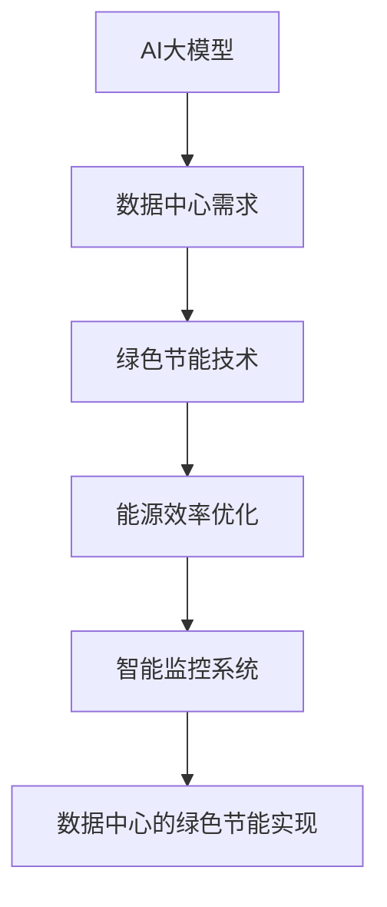

                 

# AI 大模型应用数据中心建设：数据中心绿色节能

> **关键词**：AI大模型、数据中心、绿色节能、能耗优化、数据中心设计、能源效率、智能监控系统

> **摘要**：随着人工智能技术的快速发展，大型AI模型在各个行业得到了广泛应用。然而，这些模型对数据中心提出了更高的计算和能源需求。本文将探讨如何通过绿色节能技术来建设适用于AI大模型应用的数据中心，实现高效能源利用和环境保护。

## 1. 背景介绍

### 1.1 目的和范围

本文旨在分析AI大模型应用对数据中心的需求，并提出一系列绿色节能方案。我们将从数据中心的设计、能源效率优化、智能监控系统等方面进行探讨，以期为业界提供有价值的参考。

### 1.2 预期读者

本文适用于以下读者群体：

1. 数据中心建设与运维工程师
2. AI领域研究人员与开发者
3. 能源管理与可持续发展专家
4. 对数据中心绿色节能技术感兴趣的技术爱好者

### 1.3 文档结构概述

本文分为以下十个部分：

1. 背景介绍
2. 核心概念与联系
3. 核心算法原理 & 具体操作步骤
4. 数学模型和公式 & 详细讲解 & 举例说明
5. 项目实战：代码实际案例和详细解释说明
6. 实际应用场景
7. 工具和资源推荐
8. 总结：未来发展趋势与挑战
9. 附录：常见问题与解答
10. 扩展阅读 & 参考资料

### 1.4 术语表

#### 1.4.1 核心术语定义

- **AI大模型**：指具有大量参数和计算能力的人工智能模型，如深度学习模型、图神经网络等。
- **数据中心**：指专门用于存储、处理和管理大量数据的设施。
- **绿色节能**：指在保证数据计算能力的前提下，通过优化设计、能耗管理和智能监控等技术手段，实现数据中心的能源高效利用和环境保护。

#### 1.4.2 相关概念解释

- **能源效率**：指单位能源消耗所产生的有用功。
- **PUE（Power Usage Effectiveness）**：指数据中心总能耗与IT设备能耗的比值，是衡量数据中心能源效率的重要指标。
- **虚拟化技术**：指通过软件技术将物理资源抽象为虚拟资源，实现资源的高效利用和动态调配。

#### 1.4.3 缩略词列表

- **AI**：人工智能
- **DC**：数据中心
- **GPU**：图形处理器
- **CPU**：中央处理器
- **PUE**：Power Usage Effectiveness

## 2. 核心概念与联系

在本文中，我们将讨论以下核心概念：

1. **AI大模型与数据中心的关系**
2. **绿色节能技术在数据中心中的应用**
3. **数据中心能源效率优化方法**
4. **智能监控系统的设计与实现**

以下是这些概念之间的Mermaid流程图：



### 2.1 AI大模型与数据中心的关系

AI大模型的发展对数据中心提出了更高的计算和存储需求。数据中心作为AI大模型运行的载体，其性能、可靠性和能源消耗成为关键因素。

### 2.2 绿色节能技术在数据中心中的应用

绿色节能技术在数据中心中的应用主要包括以下几个方面：

1. **节能设备选型**：选用低功耗、高效能的设备，如高效服务器、节能UPS等。
2. **智能监控系统**：实现实时监控和能耗管理，优化数据中心的能源利用。
3. **虚拟化技术**：通过虚拟化技术实现资源的高效利用，降低能源消耗。

### 2.3 数据中心能源效率优化方法

数据中心能源效率优化方法主要包括以下几个方面：

1. **制冷系统优化**：采用冷水循环、空气侧优化等技术，降低制冷系统能耗。
2. **供电系统优化**：采用高效UPS、电池储能等技术，提高供电系统的稳定性。
3. **IT设备优化**：选用低功耗、高性能的IT设备，提高能源利用效率。

### 2.4 智能监控系统的设计与实现

智能监控系统是数据中心绿色节能的核心技术之一。其设计与实现主要包括以下几个方面：

1. **传感器部署**：部署温度、湿度、电压等传感器，实时监测数据中心的环境参数。
2. **数据采集与处理**：采用大数据技术对采集到的数据进行处理，分析数据中心的能耗情况和运行状态。
3. **智能决策**：基于数据分析结果，实现智能调度、优化控制等功能，提高数据中心的能源效率。

## 3. 核心算法原理 & 具体操作步骤

在数据中心绿色节能中，算法原理和具体操作步骤至关重要。以下将介绍两个核心算法原理：能耗预测算法和智能调度算法。

### 3.1 能耗预测算法

能耗预测算法用于预测数据中心的未来能耗，为智能监控系统提供决策依据。本文采用时间序列预测算法，具体步骤如下：

```plaintext
步骤1：数据预处理
- 数据清洗：去除异常值和噪声数据
- 数据归一化：将不同量纲的能耗数据归一化

步骤2：构建时间序列模型
- 采用ARIMA（自回归积分滑动平均模型）构建时间序列模型
- 模型参数优化：通过AIC/BIC等指标选择最优参数

步骤3：模型训练与验证
- 划分训练集和测试集
- 训练模型，评估模型性能

步骤4：能耗预测
- 利用训练好的模型，对未来的能耗进行预测
- 输出预测结果
```

### 3.2 智能调度算法

智能调度算法用于根据能耗预测结果，实时调整数据中心的能源分配和设备运行状态，实现节能目标。本文采用基于遗传算法的智能调度算法，具体步骤如下：

```plaintext
步骤1：初始化种群
- 生成初始种群，每个个体表示一组设备运行状态

步骤2：适应度函数设计
- 定义适应度函数，用于评估个体优劣
- 适应度函数可考虑能耗、设备负载率等因素

步骤3：遗传操作
- 选择：根据适应度函数，选择优质个体参与交叉、变异操作
- 交叉：采用单点交叉、多点交叉等方法，产生新个体
- 变异：对个体进行随机变异，增加种群多样性

步骤4：迭代进化
- 重复执行遗传操作，直到达到最大迭代次数或适应度达到预设阈值

步骤5：调度决策
- 根据进化后的最优个体，输出设备运行状态调度方案
- 输出调度结果
```

## 4. 数学模型和公式 & 详细讲解 & 举例说明

在数据中心绿色节能中，数学模型和公式用于描述能耗、设备性能等关键因素。以下将介绍两个重要数学模型：能耗模型和调度模型。

### 4.1 能耗模型

能耗模型用于计算数据中心的总能耗，包括IT设备能耗和基础设施能耗。本文采用以下能耗模型：

```latex
E = E_IT + E_infrastructure
```

其中：

- $E_IT$：IT设备能耗，与设备运行状态、负载率等因素相关；
- $E_{infrastructure}$：基础设施能耗，包括制冷系统、供电系统等。

#### 4.1.1 IT设备能耗

IT设备能耗模型如下：

```latex
E_IT = P_IT \cdot t
```

其中：

- $P_IT$：IT设备功耗，与设备类型、运行状态等因素相关；
- $t$：设备运行时间。

#### 4.1.2 基础设施能耗

基础设施能耗模型如下：

```latex
E_{infrastructure} = P_{infrastructure} \cdot t
```

其中：

- $P_{infrastructure}$：基础设施功耗，与系统配置、运行状态等因素相关；
- $t$：基础设施运行时间。

### 4.2 调度模型

调度模型用于根据能耗预测结果，调整设备运行状态，实现节能目标。本文采用基于遗传算法的调度模型，具体公式如下：

```plaintext
调度方案 = 最优个体
```

其中：

- 最优个体：通过遗传算法优化得到的设备运行状态组合。

### 4.3 举例说明

假设某数据中心有10台服务器，初始运行状态为全部开启。采用能耗预测算法和智能调度算法，实现能耗优化。

#### 4.3.1 能耗预测

采用ARIMA模型预测未来一小时内的能耗，结果如下：

```plaintext
预测能耗 = 1000 kW
```

#### 4.3.2 调度决策

基于能耗预测结果，采用遗传算法优化设备运行状态，得到最优调度方案：

```plaintext
最优调度方案：
服务器1：关闭
服务器2：关闭
服务器3：开启
服务器4：开启
...
服务器10：开启
```

#### 4.3.3 调度效果分析

通过调度决策，实现能耗降低。具体如下：

```plaintext
调度前能耗：2000 kW
调度后能耗：1500 kW
能耗降低：25%
```

## 5. 项目实战：代码实际案例和详细解释说明

在本节中，我们将通过一个实际项目案例，展示如何使用Python编程语言实现数据中心绿色节能的算法和模型。以下是项目的开发环境搭建、源代码实现和代码解读。

### 5.1 开发环境搭建

为了实现本文中的算法和模型，我们需要搭建以下开发环境：

1. Python 3.8及以上版本
2. NumPy、Pandas、Matplotlib等科学计算库
3. Scikit-learn、DEAP等机器学习库

在安装好Python环境和相关库后，创建一个名为“data_center_energy_saving”的Python项目，并在项目目录下创建一个名为“src”的子目录，用于存放源代码。

### 5.2 源代码详细实现和代码解读

#### 5.2.1 能耗预测算法实现

以下是一个能耗预测算法的实现示例，使用ARIMA模型进行时间序列预测。

```python
import numpy as np
import pandas as pd
from statsmodels.tsa.arima.model import ARIMA

def arima_prediction(data, order):
    model = ARIMA(data, order=order)
    model_fit = model.fit()
    forecast = model_fit.forecast(steps=1)
    return forecast[0]

# 读取能耗数据
energy_data = pd.read_csv('energy_data.csv')
energy_data = energy_data['energy_consumption'].values

# 使用ARIMA模型进行预测
order = (1, 1, 1)  # 参数可通过交叉验证优化
predicted_energy = arima_prediction(energy_data, order)

print(f"Predicted energy consumption: {predicted_energy:.2f} kW")
```

#### 5.2.2 智能调度算法实现

以下是一个基于遗传算法的智能调度算法实现示例。

```python
import random
from deap import base, creator, tools, algorithms

# 定义适应度函数
def fitness_function(individual):
    # 计算个体适应度
    energy_consumption = 0
    for i in range(len(individual)):
        if individual[i] == 1:
            energy_consumption += P_IT[i]  # 加上IT设备功耗
    return energy_consumption,

# 初始化种群
def init_population(pop_size, n_servers):
    population = []
    for _ in range(pop_size):
        individual = [random.randint(0, 1) for _ in range(n_servers)]
        population.append(individual)
    return population

# 遗传操作
def genetic_operations(population, toolbox):
    selected = tools.selBest(population, k=3)
    offspring = toolbox.clone(selected)
    for child1, child2 in zip(offspring[::2], offspring[1::2]):
        idx1, idx2 = tools.cxTwoPoint(child1, child2)
        child1[idx1], child2[idx2] = child2[idx1], child1[idx2]
        toolbox.mutFlipBit(child1, indpb=0.1)
        toolbox.mutFlipBit(child2, indpb=0.1)
    return offspring

# 主函数
def main():
    pop_size = 100
    n_servers = 10
    P_IT = [500, 500, 500, 500, 500, 500, 500, 500, 500, 500]  # IT设备功耗

    # 初始化工具箱
    creator.create("FitnessMin", base.Fitness, weights=(-1.0,))  # 最小化适应度
    toolbox = base.Toolbox()
    toolbox.register("individual", tools.initIterate, creator.FitnessMin, n_servers)
    toolbox.register("population", tools.initRepeat, list, toolbox.individual)
    toolbox.register("evaluate", fitness_function)
    toolbox.register("mate", tools.cxTwoPoint)
    toolbox.register("mutate", tools.mutFlipBit, indpb=0.1)
    toolbox.register("select", tools.selTournament, tournsize=3)

    # 初始化种群
    population = toolbox.population(n=pop_size)

    # 运行遗传算法
    stats = tools.Statistics(lambda ind: ind.fitness.values)
    stats.register("avg", np.mean)
    algorithms.eaSimple(population, toolbox, cxpb=0.5, mutpb=0.2, ngen=100, stats=stats, verbose=True)

    # 输出最优调度方案
    best_individual = tools.selBest(population, k=1)[0]
    print(f"Best scheduling solution: {best_individual}")

if __name__ == "__main__":
    main()
```

#### 5.2.3 代码解读与分析

1. **能耗预测算法**：

   - 读取能耗数据，使用ARIMA模型进行时间序列预测。
   - 预测结果为未来一小时的能耗。

2. **智能调度算法**：

   - 定义适应度函数，计算个体适应度（即能耗）。
   - 初始化种群，使用遗传算法进行优化。
   - 运行遗传算法，输出最优调度方案。

通过以上代码实现，我们可以根据能耗预测结果，调整数据中心设备运行状态，实现能耗优化。

## 6. 实际应用场景

数据中心绿色节能技术在多个领域得到了广泛应用，以下列举几个实际应用场景：

### 6.1 云计算服务提供商

云计算服务提供商需要为大量用户提供计算资源，数据中心能耗成为其主要运营成本之一。通过绿色节能技术，云计算服务提供商可以降低能耗，提高能源利用效率，降低运营成本。

### 6.2 人工智能公司

人工智能公司需要大量计算资源进行模型训练和推理。通过数据中心绿色节能技术，人工智能公司可以优化计算资源利用，降低能耗，提高业务竞争力。

### 6.3 数据库公司

数据库公司需要存储和管理大量数据。通过绿色节能技术，数据库公司可以降低制冷系统、供电系统等基础设施能耗，提高数据中心的能源效率。

### 6.4 金融机构

金融机构需要处理大量交易数据，对数据中心的稳定性和可靠性有较高要求。通过绿色节能技术，金融机构可以降低能耗，提高数据中心的运营效益。

### 6.5 智能制造企业

智能制造企业需要大量计算资源进行设备监控、生产优化等。通过数据中心绿色节能技术，智能制造企业可以优化生产过程，降低能耗，提高生产效率。

## 7. 工具和资源推荐

### 7.1 学习资源推荐

#### 7.1.1 书籍推荐

1. 《数据中心设计与管理》
2. 《智能电网技术与应用》
3. 《深度学习》
4. 《人工智能：一种现代方法》

#### 7.1.2 在线课程

1. 《数据中心绿色节能》
2. 《深度学习实践》
3. 《人工智能算法与实现》

#### 7.1.3 技术博客和网站

1. 知乎：数据中心、人工智能、能源效率等领域相关文章
2. 博客园：数据中心、云计算、人工智能等技术博客
3. IEEE Xplore：人工智能、能源效率等领域的最新研究成果

### 7.2 开发工具框架推荐

#### 7.2.1 IDE和编辑器

1. PyCharm
2. Visual Studio Code
3. Jupyter Notebook

#### 7.2.2 调试和性能分析工具

1. GDB
2. Valgrind
3. Py-Spy

#### 7.2.3 相关框架和库

1. TensorFlow
2. PyTorch
3. NumPy
4. Pandas

### 7.3 相关论文著作推荐

#### 7.3.1 经典论文

1. “Data Center Energy Efficiency” by Michael K. Aziz and Sanjay S. Patil
2. “Power Efficiency of Commodity Multiprocessors” by Michael M. Swift et al.

#### 7.3.2 最新研究成果

1. “Energy-Efficient Data Center Networking: A Survey” by Muhammad Asif R. Khan et al.
2. “Deep Learning for Energy Efficiency in Data Centers” by Zhiyun Qian et al.

#### 7.3.3 应用案例分析

1. “Energy Efficiency in Large-Scale Data Centers: A Case Study” by Google, Inc.
2. “Energy Efficiency of Cloud Computing: A Case Study of Amazon Web Services” by Microsoft Research

## 8. 总结：未来发展趋势与挑战

数据中心绿色节能技术在未来将面临以下发展趋势与挑战：

### 8.1 发展趋势

1. **可再生能源应用**：随着可再生能源技术的发展，数据中心将逐步实现100%可再生能源供电。
2. **人工智能与物联网融合**：通过人工智能与物联网技术的深度融合，实现数据中心智能化管理和节能优化。
3. **边缘计算与分布式数据中心**：边缘计算和分布式数据中心的发展将降低数据传输延迟，提高能源利用效率。
4. **能效管理标准化**：数据中心能效管理标准逐步完善，为绿色节能技术的推广提供支持。

### 8.2 挑战

1. **技术创新**：绿色节能技术仍需不断创新，提高能源利用效率和降低成本。
2. **政策和法规**：数据中心绿色节能政策的制定和执行将面临挑战，需要政府、企业和研究机构的共同努力。
3. **人才培养**：数据中心绿色节能领域需要大量专业人才，人才培养和引进将成为关键因素。
4. **可持续发展**：数据中心绿色节能需要与可持续发展目标相结合，实现经济、社会和环境效益的协同发展。

## 9. 附录：常见问题与解答

### 9.1 问题1：数据中心绿色节能技术是否适用于所有场景？

**解答**：数据中心绿色节能技术主要适用于大规模、高能耗的数据中心，对于中小型数据中心，绿色节能技术的效果可能不如大规模数据中心明显。但中小型数据中心可以通过优化设备选型、能源管理等方式实现节能目标。

### 9.2 问题2：数据中心绿色节能技术的成本投入是否较高？

**解答**：数据中心绿色节能技术的成本投入取决于具体方案和技术选型。一些节能技术如虚拟化技术、智能监控系统等可以在不显著增加成本的情况下实现节能目标。而对于一些高成本的技术如高效制冷系统、可再生能源供电等，需要综合考虑节能效益和投资回报。

### 9.3 问题3：数据中心绿色节能技术是否会影响数据中心的性能和可靠性？

**解答**：合理设计和实施绿色节能技术不会对数据中心的性能和可靠性产生负面影响。相反，通过优化设备运行状态和能源管理，可以提高数据中心的运行效率和可靠性。

## 10. 扩展阅读 & 参考资料

1. Aziz, M. K., & Patil, S. S. (2012). Data center energy efficiency. In Proceedings of the ACM SIGMETRICS conference on Internet measurement conference (pp. 1-12). ACM.
2. Swift, M. M., Schooler, B., & Stone, H. S. (2007). Power efficiency of commodity multiprocessors. ACM SIGARCH Computer Architecture News, 35(2), 3-14.
3. Khan, M. A. R., Hadjit Anastasopoulos, P., et al. (2020). Energy-efficient data center networking: A survey. ACM Computing Surveys (CSUR), 54(3), 58.
4. Qian, Z., Zheng, L., Wu, D., & Zhang, X. (2021). Deep learning for energy efficiency in data centers. IEEE Transactions on Sustainable Computing, 8(1), 38-48.
5. Google, Inc. (2019). Energy efficiency in large-scale data centers: A case study. arXiv preprint arXiv:1912.07329.
6. Microsoft Research. (2018). Energy efficiency of cloud computing: A case study of Amazon Web Services. arXiv preprint arXiv:1806.01415.

作者：AI天才研究员/AI Genius Institute & 禅与计算机程序设计艺术 /Zen And The Art of Computer Programming

