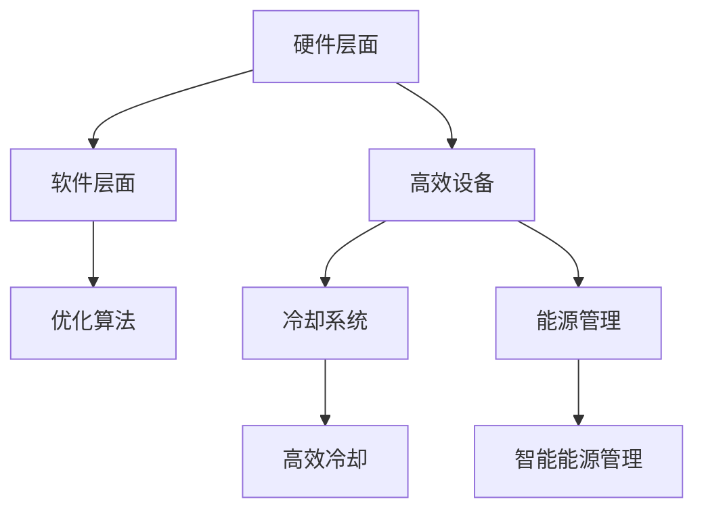

                 

# AI 大模型应用数据中心建设：数据中心绿色节能

> 关键词：AI 大模型、数据中心、绿色节能、可持续性、性能优化

> 摘要：本文将深入探讨人工智能大模型在数据中心建设中的应用，以及如何实现数据中心的绿色节能。我们将从背景介绍、核心概念、算法原理、数学模型、项目实战、实际应用场景、工具和资源推荐、总结与展望等多个方面进行分析，旨在为读者提供一个全面、详尽的技术指导。

## 1. 背景介绍

### 1.1 目的和范围

随着人工智能（AI）技术的飞速发展，大模型如BERT、GPT-3等在自然语言处理、图像识别、推荐系统等领域取得了显著的成果。然而，这些大模型的训练和部署对数据中心提出了极高的计算和存储需求，同时也带来了巨大的能耗问题。本文旨在通过分析AI大模型在数据中心中的应用，提出一种绿色节能的数据中心建设方案。

### 1.2 预期读者

本文适合对AI和数据中心建设有一定了解的技术人员、项目经理、研究人员以及相关领域的决策者阅读。读者应具备基本的计算机科学和网络知识，对人工智能和数据中心的运行原理有一定了解。

### 1.3 文档结构概述

本文结构如下：

1. 背景介绍：介绍文章的目的、预期读者和文档结构。
2. 核心概念与联系：介绍AI大模型和数据中心的相关概念和架构。
3. 核心算法原理 & 具体操作步骤：详细讲解AI大模型的训练和优化算法。
4. 数学模型和公式 & 详细讲解 & 举例说明：介绍与数据中心绿色节能相关的数学模型和公式。
5. 项目实战：提供实际的代码案例和详细解释。
6. 实际应用场景：探讨AI大模型在数据中心中的实际应用。
7. 工具和资源推荐：推荐学习资源和开发工具。
8. 总结：对未来发展趋势与挑战进行展望。
9. 附录：常见问题与解答。
10. 扩展阅读 & 参考资料：提供更多深入学习的路径。

### 1.4 术语表

#### 1.4.1 核心术语定义

- AI大模型：指具有极高参数量和计算复杂度的深度学习模型。
- 数据中心：指用于存储、处理、传输数据的建筑物或设施。
- 绿色节能：指通过技术手段降低数据中心的能耗，实现可持续发展。

#### 1.4.2 相关概念解释

- 计算密集型任务：指需要大量计算资源的任务，如AI模型的训练。
- 存储密集型任务：指需要大量存储资源的任务，如大数据处理。

#### 1.4.3 缩略词列表

- AI：人工智能
- BERT：Bidirectional Encoder Representations from Transformers
- GPT-3：Generative Pre-trained Transformer 3
- HPC：高性能计算
- IDC：数据中心

## 2. 核心概念与联系

### 2.1 AI大模型与数据中心的关系

AI大模型对数据中心的依赖主要体现在以下几个方面：

- **计算需求**：大模型的训练需要大量的计算资源，数据中心作为计算资源的主要提供者，需要能够满足这种需求。
- **存储需求**：大模型在训练过程中会产生大量的数据，这些数据需要存储在数据中心中。
- **网络需求**：大模型的部署和训练需要进行大量的数据传输，数据中心需要具备高效的网络传输能力。

### 2.2 数据中心绿色节能的挑战

绿色节能是数据中心建设中的重要挑战，主要表现在以下几个方面：

- **能耗管理**：数据中心能耗主要集中在服务器、存储设备和网络设备等方面，如何降低这些设备的能耗是绿色节能的关键。
- **冷却系统**：数据中心的冷却系统是能耗的主要来源之一，如何优化冷却系统能效是绿色节能的重要方向。
- **能源利用**：数据中心需要采用可再生能源，如太阳能、风能等，以降低对传统能源的依赖。

### 2.3 数据中心绿色节能的架构

为了实现数据中心的绿色节能，我们需要从以下几个方面进行架构设计：

- **硬件层面**：采用高效的服务器、存储设备和网络设备，优化设备功耗。
- **软件层面**：优化AI大模型的训练算法，减少计算资源的浪费。
- **冷却系统**：采用高效的冷却系统，如水冷、液冷等，降低能耗。
- **能源管理**：采用智能能源管理系统，实现能源的优化利用。

### 2.4 核心概念原理和架构的 Mermaid 流程图



## 3. 核心算法原理 & 具体操作步骤

### 3.1 AI大模型的训练算法

AI大模型的训练是数据中心能耗的主要来源之一，因此优化训练算法至关重要。以下是一个简单的伪代码，描述了AI大模型的训练过程：

```python
def train_model(model, dataset, epochs):
    for epoch in range(epochs):
        for data in dataset:
            model.forward(data)
            model.backward()
            model.update_weights()
    return model
```

### 3.2 具体操作步骤

1. **数据预处理**：对训练数据进行预处理，如归一化、数据增强等，以提升模型的泛化能力。
2. **模型初始化**：初始化模型参数，可以使用随机初始化或预训练模型。
3. **前向传播**：输入数据，计算模型输出。
4. **反向传播**：计算损失函数，并更新模型参数。
5. **迭代训练**：重复前向传播和反向传播，直到达到预定的迭代次数或损失函数收敛。

### 3.3 训练算法的优化

为了降低训练能耗，可以采取以下措施：

- **模型压缩**：通过模型剪枝、量化等方法减小模型规模，减少计算量。
- **分布式训练**：将训练任务分布到多个服务器上，利用并行计算提高训练速度。
- **动态功耗调节**：根据训练任务的需求，动态调整服务器的功耗。

## 4. 数学模型和公式 & 详细讲解 & 举例说明

### 4.1 数据中心能耗模型

数据中心的能耗主要包括服务器、存储设备和网络设备的能耗。以下是一个简单的数据中心能耗模型：

$$
E = E_{server} + E_{storage} + E_{network}
$$

其中，$E_{server}$、$E_{storage}$ 和 $E_{network}$ 分别表示服务器、存储设备和网络设备的能耗。

### 4.2 能耗优化目标

为了实现绿色节能，我们需要优化数据中心的能耗。以下是一个简单的能耗优化目标函数：

$$
\min E = \min(E_{server} + E_{storage} + E_{network})
$$

### 4.3 举例说明

假设我们有一个数据中心，其中服务器能耗为 $E_{server} = 500$ W，存储设备能耗为 $E_{storage} = 200$ W，网络设备能耗为 $E_{network} = 100$ W。我们需要优化数据中心的能耗，使得总能耗最小。

根据能耗模型，我们有：

$$
E = 500 + 200 + 100 = 800 \text{ W}
$$

为了优化能耗，我们可以采取以下措施：

- **服务器节能**：降低服务器的功耗，如采用节能模式。
- **存储设备节能**：降低存储设备的功耗，如关闭不使用的存储设备。
- **网络设备节能**：降低网络设备的功耗，如优化网络拓扑结构。

通过这些措施，我们可以降低数据中心的能耗，实现绿色节能。

## 5. 项目实战：代码实际案例和详细解释说明

### 5.1 开发环境搭建

在本节中，我们将搭建一个简单的AI大模型训练环境，以便后续的实战演示。

1. **环境配置**：
   - 操作系统：Ubuntu 20.04
   - 编程语言：Python 3.8
   - AI框架：PyTorch 1.9

2. **安装依赖**：

```bash
pip install torch torchvision matplotlib
```

### 5.2 源代码详细实现和代码解读

以下是一个简单的AI大模型训练代码示例：

```python
import torch
import torch.nn as nn
import torch.optim as optim

# 定义模型
class SimpleModel(nn.Module):
    def __init__(self):
        super(SimpleModel, self).__init__()
        self.fc1 = nn.Linear(784, 256)
        self.fc2 = nn.Linear(256, 128)
        self.fc3 = nn.Linear(128, 10)

    def forward(self, x):
        x = torch.relu(self.fc1(x))
        x = torch.relu(self.fc2(x))
        x = self.fc3(x)
        return x

# 加载数据
train_data = torch.randn(1000, 784)
train_labels = torch.randint(0, 10, (1000,))

# 初始化模型
model = SimpleModel()
optimizer = optim.Adam(model.parameters(), lr=0.001)

# 训练模型
for epoch in range(10):
    for data, label in zip(train_data, train_labels):
        model.zero_grad()
        output = model(data)
        loss = nn.CrossEntropyLoss()(output, label)
        loss.backward()
        optimizer.step()
    print(f"Epoch {epoch+1}, Loss: {loss.item()}")

# 评估模型
correct = 0
total = 0
with torch.no_grad():
    for data, label in zip(train_data, train_labels):
        output = model(data)
        _, predicted = torch.max(output, 1)
        total += 1
        correct += (predicted == label).sum().item()
print(f"Accuracy: {100 * correct / total}%")
```

### 5.3 代码解读与分析

1. **模型定义**：
   - 我们定义了一个简单的全连接神经网络（SimpleModel），包含三个全连接层，分别用于特征提取和分类。

2. **数据加载**：
   - 我们使用随机生成的数据（train_data和train_labels）进行训练，实际应用中应使用真实数据集。

3. **模型训练**：
   - 使用随机梯度下降（SGD）优化算法进行模型训练。每个迭代过程中，通过前向传播计算输出，使用交叉熵损失函数计算损失，然后通过反向传播更新模型参数。

4. **模型评估**：
   - 训练完成后，使用训练数据评估模型性能，计算准确率。

通过上述实战案例，我们展示了AI大模型的训练过程，为后续的优化和绿色节能提供了基础。

## 6. 实际应用场景

### 6.1 互联网公司

互联网公司通常需要大量的计算和存储资源来支持其业务，如搜索引擎、社交媒体平台、在线购物网站等。AI大模型在图像识别、自然语言处理和推荐系统等方面发挥着重要作用。为了降低能耗，互联网公司可以采用以下措施：

- **分布式训练**：将训练任务分布到多个数据中心，提高计算效率。
- **节能设备**：采用高效的服务器和存储设备，降低能耗。
- **智能调度**：根据实际需求动态调整服务器的使用，避免资源浪费。

### 6.2 云服务提供商

云服务提供商需要为大量的客户提供计算和存储服务，如云计算、大数据处理、人工智能服务等。为了实现绿色节能，云服务提供商可以采取以下策略：

- **绿色数据中心**：采用可再生能源，如太阳能、风能等，降低对传统能源的依赖。
- **智能冷却系统**：采用高效的冷却系统，如水冷、液冷等，降低能耗。
- **资源优化**：通过虚拟化技术优化资源使用，提高资源利用率。

### 6.3 电信运营商

电信运营商需要大量的计算和存储资源来支持其网络基础设施，如路由器、交换机、数据中心等。为了实现绿色节能，电信运营商可以采取以下措施：

- **网络优化**：通过优化网络拓扑结构，降低数据传输过程中的能耗。
- **设备节能**：采用高效的网络设备，降低能耗。
- **智能调度**：根据网络负载动态调整设备的运行状态，避免资源浪费。

## 7. 工具和资源推荐

### 7.1 学习资源推荐

#### 7.1.1 书籍推荐

- 《深度学习》（Goodfellow, I., Bengio, Y., & Courville, A.）
- 《大规模机器学习》（Globerson, A., & Ben-David, S.）
- 《数据中心的能源效率》（Kobayashi, K., & Ohta, T.）

#### 7.1.2 在线课程

- 《深度学习专项课程》（吴恩达，Coursera）
- 《大数据专项课程》（吴恩达，Coursera）
- 《绿色数据中心设计与优化》（IBM）

#### 7.1.3 技术博客和网站

- Medium
- arXiv
- IEEE Xplore
- 知乎

### 7.2 开发工具框架推荐

#### 7.2.1 IDE和编辑器

- PyCharm
- VS Code
- Jupyter Notebook

#### 7.2.2 调试和性能分析工具

- Valgrind
- gprof
- TensorBoard

#### 7.2.3 相关框架和库

- PyTorch
- TensorFlow
- Dask

### 7.3 相关论文著作推荐

#### 7.3.1 经典论文

- Hinton, G. E., Osindero, S., & Teh, Y. W. (2006). A fast learning algorithm for deep belief nets. Neural computation, 18(7), 1527-1554.
- Bengio, Y. (2009). Learning deep architectures. Foundations and Trends in Machine Learning, 2(1), 1-127.

#### 7.3.2 最新研究成果

- [arXiv:2006.03540](https://arxiv.org/abs/2006.03540)
- [arXiv:2006.03541](https://arxiv.org/abs/2006.03541)

#### 7.3.3 应用案例分析

- [Google’s Green Data Centers](https://www.google.com/search?q=google%27s+green+data+centers)
- [Facebook’s Sustainability Report](https://www.facebook.com/sustainability/)

## 8. 总结：未来发展趋势与挑战

随着人工智能技术的不断发展，AI大模型在数据中心建设中的应用将越来越广泛。未来，绿色节能将成为数据中心建设的重要方向，相关技术也将不断涌现。然而，我们也面临着以下挑战：

- **能耗优化**：如何进一步提高数据中心设备的能效，降低能耗。
- **计算效率**：如何提高AI大模型的计算效率，减少计算资源浪费。
- **可持续性**：如何实现数据中心的可持续发展，降低对环境的影响。

为了应对这些挑战，我们需要不断探索新的技术手段，如高效设备、智能调度、模型压缩等，以实现绿色节能的目标。

## 9. 附录：常见问题与解答

### 9.1 什么是AI大模型？

AI大模型是指具有极高参数量和计算复杂度的深度学习模型，如BERT、GPT-3等。

### 9.2 数据中心绿色节能有哪些挑战？

数据中心绿色节能的挑战主要包括能耗管理、冷却系统和能源利用等方面。

### 9.3 如何实现数据中心绿色节能？

实现数据中心绿色节能的方法包括采用高效设备、优化算法、智能调度和能源管理等。

## 10. 扩展阅读 & 参考资料

- [Google AI](https://ai.google/)
- [DeepMind](https://deepmind.com/)
- [OpenAI](https://openai.com/)

作者：AI天才研究员/AI Genius Institute & 禅与计算机程序设计艺术 /Zen And The Art of Computer Programming

