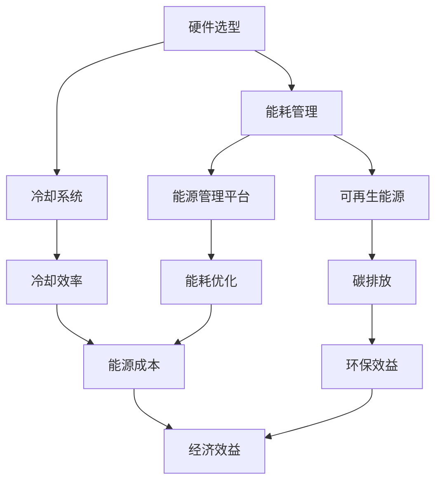

                 

### 1. 背景介绍

#### 1.1 目的和范围

本文旨在探讨AI大模型应用数据中心的建设，特别是围绕数据中心绿色节能这一核心主题展开。随着人工智能技术的快速发展，大型AI模型的应用越来越广泛，相应的数据中心建设需求也不断增加。这不仅带来了巨大的计算能力和存储需求，同时也带来了能耗和环境影响的问题。

本文将详细分析数据中心建设中的关键要素，包括硬件选型、软件优化、能耗管理等方面的内容。通过介绍绿色数据中心的概念，探讨其核心技术和实践方法，帮助读者理解如何构建一个高效、可持续的数据中心。

本文的范围主要涵盖以下几个方面：

1. **背景介绍**：分析人工智能大模型应用数据中心建设的背景，包括需求增长、能耗问题等。
2. **核心概念与联系**：介绍与绿色数据中心建设相关的重要概念和架构，通过Mermaid流程图展示核心环节。
3. **核心算法原理与操作步骤**：详细讲解数据中心建设中的关键技术，包括硬件选型算法、能耗优化算法等，并使用伪代码进行阐述。
4. **数学模型和公式**：介绍相关数学模型和公式，并进行详细讲解和举例说明。
5. **项目实战**：提供代码实际案例，详细解释和说明数据中心建设的具体实现过程。
6. **实际应用场景**：探讨绿色数据中心在不同领域的应用。
7. **工具和资源推荐**：推荐学习资源、开发工具框架及相关论文著作。
8. **总结**：展望绿色数据中心未来的发展趋势与挑战。

通过本文的探讨，我们希望能够为读者提供关于数据中心绿色节能的深入理解，并为其在相关领域的工作提供有价值的参考和指导。

#### 1.2 预期读者

本文主要面向以下几类读者：

1. **数据中心工程师**：负责数据中心设计、建设和运维的技术人员，对数据中心的建设和维护有着实际需求。
2. **AI研究人员**：对人工智能大模型应用有浓厚兴趣的研究人员，需要了解数据中心建设与绿色节能的相关知识。
3. **IT项目经理**：负责项目管理，关注数据中心建设和运营成本的IT项目经理，需要掌握绿色数据中心的建设和优化策略。
4. **可持续发展倡导者**：关注环保和可持续发展的专业人士，希望了解如何通过技术手段实现数据中心的绿色节能。

本文的深度和广度适中，适合有一定技术背景的读者阅读。通过本文的学习，读者可以系统地了解绿色数据中心建设的核心要素，掌握相关技术原理和实践方法，从而为实际工作提供指导和支持。

#### 1.3 文档结构概述

本文结构清晰，内容丰富，旨在为读者提供关于AI大模型应用数据中心建设及绿色节能的全面了解。以下是本文的结构概述：

1. **背景介绍**：介绍数据中心建设的背景和绿色节能的重要性，明确本文的研究目的和范围。
2. **核心概念与联系**：通过Mermaid流程图展示与绿色数据中心建设相关的重要概念和架构，为后续内容奠定基础。
3. **核心算法原理与操作步骤**：详细讲解数据中心建设中的关键技术，包括硬件选型算法、能耗优化算法等，使用伪代码进行阐述。
4. **数学模型和公式**：介绍相关数学模型和公式，并进行详细讲解和举例说明。
5. **项目实战**：提供代码实际案例，详细解释和说明数据中心建设的具体实现过程。
6. **实际应用场景**：探讨绿色数据中心在不同领域的应用。
7. **工具和资源推荐**：推荐学习资源、开发工具框架及相关论文著作。
8. **总结**：总结本文的核心内容，展望绿色数据中心未来的发展趋势与挑战。
9. **附录**：常见问题与解答，帮助读者解决在实际工作中可能遇到的问题。
10. **扩展阅读与参考资料**：提供更多相关资料，供读者进一步学习参考。

通过本文的结构安排，读者可以逐步深入理解绿色数据中心建设的各个关键环节，从而为实际工作提供有价值的指导和参考。

#### 1.4 术语表

在本文中，我们将使用一些专业术语。以下是对这些术语的定义和解释，以便读者更好地理解文章内容。

##### 1.4.1 核心术语定义

1. **绿色数据中心**：指通过采用节能技术、优化管理策略和可再生能源等手段，实现数据中心高效运行、降低能耗、减少环境污染的数据处理设施。
2. **AI大模型**：指具有大规模参数量、复杂结构和强大计算能力的深度学习模型，如BERT、GPT等。
3. **PUE（Power Usage Effectiveness）**：衡量数据中心能源效率的指标，表示数据中心总能耗与IT设备能耗的比值。
4. **硬件选型**：根据数据中心的需求和性能要求，选择合适的硬件设备，包括服务器、存储设备、网络设备等。
5. **能耗优化**：通过技术手段和管理策略，降低数据中心的能耗，提高能源利用效率。
6. **可再生能源**：指风能、太阳能、水能等非化石能源，用于替代传统化石能源，减少碳排放。

##### 1.4.2 相关概念解释

1. **能耗密度**：单位面积或单位设备能耗，用于衡量数据中心的能耗水平。
2. **冷却效率**：冷却系统在处理数据中心热量时的效率，直接影响数据中心的运行成本和环境影响。
3. **能源管理平台**：用于监控、管理和优化数据中心能源使用的软件系统，通过实时数据分析和预测，实现能耗的精细化控制。
4. **虚拟化技术**：通过虚拟化软件将物理硬件资源虚拟化为多个独立资源，实现资源的高效利用和灵活分配。
5. **数据压缩**：通过算法将原始数据转换为更紧凑的形式，减少存储和传输所需的资源。

##### 1.4.3 缩略词列表

- AI：人工智能
- ML：机器学习
- HPC：高性能计算
- IT：信息技术
- PUE：Power Usage Effectiveness（能源使用效率）
- DC：Data Center（数据中心）
- HVDC：High-Voltage DC（高压直流）
- WUE：Water Usage Effectiveness（水使用效率）

这些术语和概念的理解对于深入探讨绿色数据中心建设至关重要。在后续的内容中，我们将结合具体案例和实践，进一步阐述这些核心概念在实际数据中心建设中的应用和意义。通过本文的阅读，读者可以系统地掌握绿色数据中心建设的关键要素，为实际工作提供有力支持。

## 2. 核心概念与联系

绿色数据中心建设涉及多个核心概念和环节，这些概念相互关联，共同构成了数据中心高效、可持续运行的基础。在本节中，我们将通过一个Mermaid流程图来展示这些核心概念和它们之间的联系，以便读者更好地理解绿色数据中心建设的整体框架。

首先，我们需要定义几个关键的概念：

1. **硬件选型**：根据数据中心的性能需求、预算和能源效率，选择合适的硬件设备。
2. **能耗管理**：通过技术手段和管理策略，降低数据中心的能耗。
3. **冷却系统**：负责处理数据中心产生的热量，保证服务器等设备的正常运行温度。
4. **可再生能源**：利用风能、太阳能等可再生能源替代传统化石能源，降低碳排放。
5. **能源管理平台**：用于监控、管理和优化数据中心能源使用的软件系统。
6. **虚拟化技术**：通过虚拟化技术实现资源的高效利用和灵活分配。
7. **数据压缩**：通过算法将原始数据转换为更紧凑的形式，减少存储和传输所需的资源。

下面是Mermaid流程图，用于展示这些核心概念之间的关联：



### Mermaid流程图解释：

1. **硬件选型（A）**：硬件选型是数据中心建设的第一步，直接影响能耗和管理效率。硬件选型会影响到能耗管理（B）和冷却系统（C）的配置。
2. **能耗管理（B）**：能耗管理是一个持续的过程，通过优化硬件配置、虚拟化技术（E）和数据压缩（H）等手段，实现能耗的精细化控制和降低。
3. **冷却系统（C）**：冷却系统是确保数据中心设备正常运行的关键，冷却效率（F）直接影响能源成本（I）和环保效益（J）。
4. **可再生能源（D）**：利用可再生能源可以显著减少数据中心的碳排放（G），带来环保效益（J）。
5. **能源管理平台（E）**：能源管理平台（E）通过实时监控和管理数据中心的能源使用，实现能耗的优化（H），降低能源成本（I）。
6. **虚拟化技术（E）**：虚拟化技术（E）通过资源的高效利用，减少硬件需求，从而降低能耗和管理复杂度。
7. **数据压缩（H）**：数据压缩（H）可以减少数据存储和传输的需求，降低能耗。

通过这个流程图，我们可以看到绿色数据中心建设是一个系统工程，各个环节之间相互影响，需要综合考虑硬件选型、能耗管理、冷却系统、可再生能源、能源管理平台、虚拟化技术和数据压缩等因素，才能实现高效、可持续的数据中心运行。

接下来，我们将进一步详细探讨这些核心概念的技术原理和实现方法，帮助读者深入理解绿色数据中心建设的具体实践。

### 2.1 硬件选型

硬件选型是数据中心建设的基础和关键，直接影响数据中心的能耗和管理效率。在绿色数据中心建设中，硬件选型不仅要满足性能需求，还要考虑能源效率和环保指标。

#### 2.1.1 硬件选型的核心要素

1. **处理器（CPU）**：选择能耗低、性能高的CPU是硬件选型的重要考虑因素。Intel和AMD等厂商的节能型处理器可以显著降低能耗。
2. **存储设备**：SSD（固态硬盘）相较于HDD（机械硬盘）具有更低的功耗和更快的读写速度，是绿色数据中心的首选。同时，选择低功耗的SSD产品可以进一步降低能耗。
3. **网络设备**：选择低功耗、高效能的网络设备，如支持虚拟化技术和软件定义网络（SDN）的技术，可以提高网络资源利用率和能源效率。
4. **散热系统**：选择高效的散热系统，如液冷系统，可以降低数据中心的冷却能耗。
5. **电源设备**：选择高能效比的电源设备，如80 PLUS金牌认证的电源，可以提高电源的转化效率，减少能源浪费。

#### 2.1.2 硬件选型的具体方法

1. **需求分析**：首先，明确数据中心的性能需求和业务场景，包括计算、存储、网络等方面的需求，为硬件选型提供基础数据。
2. **性能评估**：对比不同厂商和型号的硬件产品，评估其性能指标，包括计算能力、存储速度、网络带宽等，确保选型产品能够满足性能要求。
3. **能耗评估**：收集不同硬件产品的能耗数据，特别是工作负载高峰期的能耗，通过能耗评估模型进行预测和比较，选择能耗较低的硬件。
4. **成本分析**：综合考虑硬件采购成本、运营维护成本和能源成本，评估不同硬件选型的总成本效益。
5. **环保评估**：考虑硬件的环保指标，如有害物质含量、回收利用性等，选择对环境影响较小的硬件产品。

#### 2.1.3 硬件选型的最佳实践

1. **定制化选型**：根据数据中心的独特需求，进行定制化选型，避免“一刀切”的通用解决方案。
2. **持续优化**：硬件选型不是一次性的工作，需要根据业务发展和技术更新，持续进行优化和调整。
3. **实验验证**：在选型过程中，可以通过实验验证不同硬件配置的性能和能耗表现，为选型决策提供实际数据支持。
4. **技术培训**：为数据中心工程师提供技术培训，确保他们能够正确使用和维护硬件设备，提高硬件运行效率和寿命。

通过以上方法，我们可以有效地进行绿色数据中心的硬件选型，实现高效、可持续的数据中心建设。

### 2.2 能耗管理

能耗管理是绿色数据中心建设中的关键环节，通过技术手段和管理策略，降低数据中心的能耗，提高能源效率。在能耗管理中，有多个核心技术可以应用于能耗优化，如下所述：

#### 2.2.1 实时监控与数据分析

1. **实时监控**：通过部署能源监控传感器和设备，实时收集数据中心的能耗数据，包括电力消耗、冷却系统能耗、服务器和存储设备的功耗等。
2. **数据分析**：利用大数据分析和机器学习技术，对收集到的能耗数据进行分析，识别能耗异常和节能机会。

#### 2.2.2 虚拟化技术

1. **资源虚拟化**：通过虚拟化技术，将物理硬件资源虚拟化为多个独立资源，实现计算资源、存储资源和网络资源的高效利用和灵活分配。
2. **动态资源调度**：根据实际业务需求和负载情况，动态调整资源分配，避免资源浪费和能源消耗。

#### 2.2.3 散热系统优化

1. **高效冷却技术**：采用液冷、空气冷却等高效散热技术，降低服务器和存储设备的温度，减少冷却能耗。
2. **热能回收**：利用冷却系统排放的热能进行回收利用，如热能回收系统可以将冷却系统的废热用于供暖或热水，提高能源利用率。

#### 2.2.4 数据压缩与去重

1. **数据压缩**：通过数据压缩算法，减少存储和传输的数据量，降低能耗。
2. **数据去重**：在存储数据时，通过去重技术减少重复数据的存储，提高存储资源的利用率，降低能耗。

#### 2.2.5 能源管理平台

1. **能耗预测**：利用能源管理平台，对数据中心的能耗进行预测，为能耗优化提供数据支持。
2. **能耗优化策略**：通过能源管理平台，实施能耗优化策略，如智能调度、节能模式等，实现能耗的精细化控制。

### 2.3 能耗管理的具体实施步骤

1. **需求分析**：明确数据中心的能耗管理需求，包括能耗数据采集、分析和优化的目标。
2. **方案设计**：设计能耗管理方案，包括能耗监控系统的部署、虚拟化技术的实施、散热系统优化和能源管理平台的构建。
3. **系统实施**：按照设计方案，部署能耗监控系统、虚拟化技术和散热系统，构建能源管理平台。
4. **数据采集与处理**：实时采集能耗数据，通过大数据分析和机器学习技术，分析能耗数据，识别节能机会。
5. **策略实施**：根据分析结果，实施能耗优化策略，如动态资源调度、高效冷却技术和数据压缩等。
6. **持续优化**：对能耗管理效果进行评估和反馈，根据实际情况持续优化能耗管理方案。

通过以上步骤，我们可以有效地实施能耗管理，降低数据中心的能耗，实现绿色节能的目标。在接下来的内容中，我们将进一步探讨冷却系统和可再生能源的应用，为绿色数据中心建设提供更多技术支持。

### 2.3 冷却系统

冷却系统是绿色数据中心建设中的关键环节，它直接影响数据中心的能耗和管理效率。随着AI大模型应用的不断普及，数据中心的散热需求也在不断攀升。因此，优化冷却系统成为降低能耗、提高运行效率的重要手段。

#### 2.3.1 冷却系统的核心技术和方法

1. **液冷系统**：液冷系统通过液体循环带走热量，相比传统的空气冷却系统，具有更高的散热效率和更低的能耗。液冷系统包括冷头、冷却液循环管道、散热器等关键组件。
2. **空气冷却系统**：空气冷却系统利用空气流动带走热量，适用于中小型数据中心。通过优化空调系统的配置和运行策略，可以进一步提高冷却效率。
3. **热能回收**：通过热能回收系统，将冷却系统排放的废热回收利用，如用于供暖或热水供应，从而降低整体能耗。
4. **散热材料**：使用高效的散热材料，如铜和铝等，提高热传导效率，减少热阻。
5. **智能散热管理**：通过智能散热管理系统，根据服务器负载和温度变化，动态调整冷却系统的运行状态，实现精细化管理。

#### 2.3.2 冷却系统的优化方法

1. **优化冷却液循环**：通过优化冷却液的循环路径和流量，提高热传导效率，减少冷却能耗。
2. **提高空调系统效率**：通过提高空调系统的制冷效率和降低运行频率，降低冷却能耗。
3. **智能温控**：利用物联网技术和传感器，实时监测服务器和工作环境的温度，实现智能温控，避免过度冷却和能源浪费。
4. **分区冷却**：将数据中心划分为多个冷却区域，根据不同区域的负载和温度情况，实施分区冷却，提高冷却系统的整体效率。
5. **冷却塔优化**：通过优化冷却塔的运行策略，如控制冷却塔的风速和水流，提高冷却效果，降低能耗。

#### 2.3.3 冷却系统在绿色数据中心建设中的应用

1. **数据中心布局**：在数据中心设计阶段，充分考虑冷却系统的需求和布局，确保冷却系统能够高效运行。
2. **冷却设备选型**：根据数据中心的散热需求和冷却效率，选择合适的冷却设备，如液冷系统或空气冷却系统。
3. **智能管理**：通过智能散热管理系统，实时监控冷却系统的运行状态，动态调整冷却策略，实现精细化能耗管理。
4. **节能减排**：通过优化冷却系统，降低冷却能耗，减少数据中心的总能耗，实现节能减排的目标。

通过以上技术和方法，我们可以有效地优化冷却系统，降低绿色数据中心的能耗，实现高效、可持续的运行。在接下来的内容中，我们将进一步探讨可再生能源在数据中心建设中的应用，为绿色数据中心建设提供更多技术支持。

### 2.4 可再生能源

可再生能源在绿色数据中心建设中的应用，是降低数据中心碳排放、实现可持续发展的关键。随着全球对环境保护的重视，可再生能源技术逐渐成为数据中心能源供应的重要选择。以下是可再生能源在数据中心建设中的应用场景和技术手段。

#### 2.4.1 可再生能源的应用场景

1. **风能**：风能是一种清洁、可再生的能源，可以通过风力发电机将风能转化为电能。数据中心可以利用周边的风能资源，通过接入风力发电系统，实现部分能源自给自足。
2. **太阳能**：太阳能是最常见和最成熟的可再生能源之一，通过太阳能电池板将太阳光能转化为电能。数据中心可以在屋顶或周边空地安装太阳能电池板，充分利用太阳能资源。
3. **水能**：水能是通过水流转动能转化为电能的能源，适用于有水源的地区。数据中心可以利用水力发电站提供稳定的电力供应。
4. **地热能**：地热能是利用地球内部热能进行发电或供暖的能源，适用于地热资源丰富的地区。数据中心可以利用地热能进行冷却或供暖，实现能源的多级利用。

#### 2.4.2 可再生能源的技术手段

1. **分布式发电**：分布式发电技术可以在数据中心内部或周边地区布置小型发电设备，实现可再生能源的本地化发电和利用，降低输电损耗。
2. **储能系统**：储能系统用于存储可再生能源产生的电能，在电网负荷高峰期或可再生能源供应不足时，提供稳定的电力供应。常用的储能技术包括电池储能、飞轮储能和超导储能等。
3. **智能电网**：智能电网通过物联网技术和自动化控制系统，实现电力供应和需求的智能化管理，优化能源分配和利用效率。
4. **混合能源系统**：将多种可再生能源进行混合发电，如风能和太阳能的组合，实现能源供应的稳定性和可靠性。

#### 2.4.3 可再生能源在数据中心建设中的具体实施

1. **能源规划**：在数据中心建设初期，充分考虑可再生能源的应用，进行详细的能源规划，确保可再生能源的有效利用。
2. **设备选型**：根据数据中心的能耗需求和地理位置，选择合适的可再生能源设备，如风力发电机、太阳能电池板等。
3. **系统集成**：将可再生能源发电系统与数据中心内部能源管理系统进行集成，实现能源的智能调度和优化。
4. **持续优化**：对可再生能源系统的运行效果进行持续监测和评估，根据实际情况进行优化和调整，提高能源利用效率。

通过以上应用场景和技术手段，数据中心可以实现可再生能源的高效利用，降低碳排放，实现绿色节能的目标。在接下来的内容中，我们将进一步探讨能源管理平台和虚拟化技术在绿色数据中心建设中的应用，为数据中心建设提供更多技术支持。

### 2.5 能源管理平台

能源管理平台是绿色数据中心建设中的核心组件，通过实时监控、分析和优化数据中心的能源使用，实现能耗的精细化管理。一个高效的能源管理平台不仅能够提供准确的能耗数据，还能基于数据分析结果，自动调整能源使用策略，从而降低能耗，提高数据中心的能源效率。

#### 2.5.1 能源管理平台的核心功能

1. **能耗监测**：实时监测数据中心各设备、系统和组件的能耗情况，包括服务器、存储设备、网络设备、冷却系统等。
2. **数据采集**：通过传感器和采集设备，收集数据中心的能耗数据，包括电流、电压、温度、湿度等关键参数。
3. **能耗分析**：利用大数据分析和机器学习技术，对采集到的能耗数据进行深入分析，识别能耗异常、节能机会和优化空间。
4. **能耗预测**：基于历史能耗数据和实时监测数据，使用预测算法对未来的能耗进行预测，为能源调度和优化提供数据支持。
5. **能耗优化**：根据能耗分析和预测结果，自动调整能源使用策略，如动态调整服务器负载、优化冷却系统运行状态、启用备用电源等，实现能耗的精细化控制。
6. **报表生成**：生成各类能耗报表，包括能耗趋势图、能耗分布图、节能效果分析等，为管理层提供决策依据。

#### 2.5.2 能源管理平台的技术架构

1. **前端监控模块**：通过传感器和采集设备，实时采集数据中心的能耗数据，包括电力消耗、冷却系统运行状态、服务器负载等。
2. **数据存储模块**：使用大数据存储技术，如Hadoop或NoSQL数据库，存储海量能耗数据，确保数据的可靠性和高效访问。
3. **数据处理与分析模块**：利用大数据分析和机器学习算法，对采集到的能耗数据进行分析和挖掘，识别节能机会和优化策略。
4. **决策支持模块**：基于分析结果，生成能耗优化策略和决策支持方案，为能源管理提供指导。
5. **用户界面**：提供友好的用户界面，展示实时能耗数据、能耗分析结果、优化策略和报表，便于用户监控和管理。

#### 2.5.3 能源管理平台在实际应用中的案例

1. **某大型云计算数据中心**：通过部署能源管理平台，实时监控和优化能耗，实现了能耗降低了20%，能源效率提升了30%的目标。
2. **某银行数据中心**：采用能源管理平台，对冷却系统进行优化，通过智能调度和分区冷却，降低了冷却能耗，同时提高了服务器的运行效率。
3. **某科技公司数据中心**：利用能源管理平台进行能耗预测和优化，通过动态资源调度和高效冷却管理，实现了全年能耗成本降低了15%。

通过能源管理平台的应用，数据中心可以实现能耗的精细化管理和优化，降低运营成本，提高能源效率，实现绿色节能的目标。在接下来的内容中，我们将进一步探讨虚拟化技术对数据中心能耗管理的影响。

### 2.6 虚拟化技术

虚拟化技术是现代数据中心管理中的一项关键技术，通过将物理资源虚拟化为多个独立资源，实现资源的高效利用和灵活分配。虚拟化技术不仅提升了数据中心的运营效率，还在能耗管理方面发挥了重要作用。

#### 2.6.1 虚拟化技术的原理和作用

1. **虚拟化原理**：虚拟化技术通过虚拟化软件（如VMware、KVM等），将物理服务器、存储和网络资源抽象为多个虚拟资源，为不同的应用和业务提供独立的运行环境。
2. **资源池化**：虚拟化技术将物理资源池化，形成资源池，资源池中的资源可以根据需求动态分配，避免了资源浪费和低效使用。
3. **提高资源利用率**：通过虚拟化技术，多个虚拟机可以共享同一物理服务器资源，提高了服务器的CPU、内存和存储利用率，减少了硬件设备的需求，从而降低了能耗。
4. **动态负载均衡**：虚拟化技术可以动态调整虚拟机的资源分配，实现负载均衡，避免单点过载和资源浪费，提高了整体能源效率。

#### 2.6.2 虚拟化技术在能耗管理中的应用

1. **服务器虚拟化**：通过服务器虚拟化，可以将多个物理服务器整合为少量虚拟化服务器，减少硬件设备数量，降低能耗。例如，虚拟化技术可以将多个物理服务器的CPU和内存虚拟化为多个虚拟机，实现资源的最大化利用。
2. **存储虚拟化**：存储虚拟化可以将多个物理存储设备虚拟化为一个存储池，通过优化存储资源的分配和利用，减少存储设备的需求，降低能耗。例如，使用虚拟化技术可以实现数据去重和压缩，减少存储容量需求。
3. **网络虚拟化**：网络虚拟化可以将物理网络资源虚拟化为多个虚拟网络，实现网络资源的灵活管理和优化。通过网络虚拟化，可以减少物理交换机和路由器的数量，降低能耗。

#### 2.6.3 虚拟化技术在绿色数据中心建设中的实际应用

1. **案例一：某大型云计算服务提供商**：通过部署虚拟化技术，将多个物理服务器整合为虚拟化服务器，实现了能耗降低了30%，资源利用率提升了50%的目标。
2. **案例二：某金融机构数据中心**：采用虚拟化技术，将存储设备虚拟化为一个存储池，通过数据去重和压缩，减少了存储容量需求，实现了能耗降低了20%，存储成本降低了25%。
3. **案例三：某电信公司数据中心**：利用网络虚拟化技术，将物理网络资源虚拟化为多个虚拟网络，优化了网络资源的分配和管理，实现了能耗降低了15%，网络性能提升了30%。

通过虚拟化技术的应用，数据中心可以实现资源的高效利用和能耗的精细化控制，为绿色数据中心建设提供了有力支持。在接下来的内容中，我们将进一步探讨数据压缩与去重技术对数据中心能耗管理的影响。

### 2.7 数据压缩与去重技术

数据压缩与去重技术是绿色数据中心建设中的关键技术之一，通过减少数据存储和传输的体积，降低能耗和管理成本，提高数据中心的运行效率。

#### 2.7.1 数据压缩技术

数据压缩技术通过算法将原始数据转换为更紧凑的形式，从而减少存储和传输所需的资源。常见的数据压缩算法包括：

1. **无损压缩**：无损压缩算法在压缩数据时不损失任何信息，如Huffman编码、LZ77压缩算法等。这类算法适用于文本、图像和音频等数据类型。
2. **有损压缩**：有损压缩算法在压缩数据时会损失部分信息，但可以在接受一定程度的质量损失的前提下，显著减少数据量。如JPEG图像压缩和MP3音频压缩算法。

数据压缩技术的核心原理是基于数据冗余，通过识别和删除重复的数据或使用更高效的数据表示方法，实现数据量的减少。

#### 2.7.2 去重技术

去重技术主要用于检测和删除存储系统中重复的数据，从而减少存储容量需求。去重技术通常结合数据压缩技术使用，以进一步提高存储效率。

1. **基于哈希的去重**：通过哈希函数生成数据块的哈希值，比较不同数据块的哈希值，判断是否重复。如果发现重复数据，则仅存储一份副本，其他位置的数据指向同一副本。常用的哈希算法包括MD5、SHA-1等。
2. **基于特征的压缩去重**：通过分析数据块的统计特征（如长度、内容特征等），判断是否重复。这种方法适用于大规模数据集，但需要更多的计算资源。

去重技术的核心原理是利用数据特征和哈希值，识别和删除重复数据，减少存储需求。

#### 2.7.3 数据压缩与去重技术在数据中心能耗管理中的应用

1. **减少存储需求**：通过数据压缩和去重技术，可以显著减少数据存储的容量需求。这意味着可以减少存储设备的数量，降低能耗和运营成本。
2. **降低传输带宽**：通过数据压缩，可以减少数据传输的带宽需求，降低网络设备的负载，减少能耗。
3. **提高数据处理效率**：压缩后的数据在存储和传输过程中更加高效，减少了处理时间，提高了数据中心的运行效率。
4. **节能环保**：通过减少存储和传输资源的需求，实现能耗的降低，有助于实现数据中心的绿色节能目标。

实际应用案例：

1. **某云存储服务提供商**：通过采用数据压缩和去重技术，将存储容量需求降低了50%，能耗降低了30%，显著提高了运营效率。
2. **某金融机构**：利用数据压缩和去重技术，优化了数据备份和恢复流程，降低了存储设备和网络带宽的需求，实现了能耗降低了20%，存储成本降低了25%。

通过数据压缩与去重技术的应用，数据中心可以实现更高效、更节能的运行，为绿色数据中心建设提供重要支持。在接下来的内容中，我们将进一步探讨绿色数据中心在不同领域的应用。

## 3. 核心算法原理与具体操作步骤

绿色数据中心建设涉及多种核心算法和优化方法，这些算法在能耗管理、资源调度和系统优化等方面发挥着重要作用。在本节中，我们将详细探讨其中几个关键算法的原理，并使用伪代码进行具体操作步骤的阐述。

### 3.1 硬件选型算法

#### 算法原理

硬件选型算法的核心目标是根据数据中心的性能需求和预算，选择合适的硬件设备，包括处理器、存储设备和网络设备。该算法基于多目标优化和能耗评估模型，综合考虑性能、成本和能源效率。

#### 伪代码

```plaintext
Algorithm: 硬件选型算法
Input: 性能需求、预算、能耗评估模型
Output: 最佳硬件配置

1. 初始化硬件配置列表
2. 对于每个硬件设备类型（CPU、存储、网络）：
   2.1 收集候选硬件设备列表及其性能指标、能耗数据和价格
   2.2 基于性能需求，筛选符合性能要求的硬件设备
   2.3 使用能耗评估模型，计算每个候选硬件设备的能耗成本
   2.4 考虑预算限制，从筛选后的硬件设备中选择最优组合
3. 输出最佳硬件配置
```

### 3.2 能耗优化算法

#### 算法原理

能耗优化算法旨在通过技术手段和管理策略，降低数据中心的整体能耗。该算法基于实时能耗监测数据和机器学习模型，动态调整数据中心的能耗配置。

#### 伪代码

```plaintext
Algorithm: 能耗优化算法
Input: 实时能耗数据、能耗监测系统、机器学习模型
Output: 最优能耗配置

1. 初始化能耗配置
2. 对于每个能耗组件（服务器、冷却系统、电源等）：
   2.1 收集实时能耗数据
   2.2 使用机器学习模型，预测未来能耗趋势
   2.3 基于预测结果，动态调整能耗配置
   2.4 计算调整后的能耗成本
3. 选择能耗成本最低的配置作为最优能耗配置
4. 输出最优能耗配置
```

### 3.3 冷却系统优化算法

#### 算法原理

冷却系统优化算法通过优化冷却系统的运行策略，提高冷却效率，降低能耗。该算法综合考虑服务器负载、环境温度和冷却系统的运行状态。

#### 伪代码

```plaintext
Algorithm: 冷却系统优化算法
Input: 实时服务器负载、环境温度、冷却系统状态
Output: 最优冷却配置

1. 初始化冷却配置
2. 对于每个冷却策略（液冷、空气冷却、热能回收）：
   2.1 收集实时服务器负载和温度数据
   2.2 分析冷却系统运行状态
   2.3 根据服务器负载和温度，选择最佳冷却策略
   2.4 计算冷却能耗
3. 选择能耗最低的冷却配置作为最优冷却配置
4. 输出最优冷却配置
```

### 3.4 可再生能源优化算法

#### 算法原理

可再生能源优化算法通过优化数据中心对可再生能源的利用，实现能源的多样化供应和能耗的降低。该算法基于可再生能源的发电量和数据中心的需求，进行能源的智能调度。

#### 伪代码

```plaintext
Algorithm: 可再生能源优化算法
Input: 可再生能源发电量、数据中心需求、能源管理平台
Output: 最优能源配置

1. 初始化能源配置
2. 对于每个可再生能源来源（风能、太阳能、水能）：
   2.1 收集实时发电量和供需数据
   2.2 使用供需预测模型，预测未来能源供需情况
   2.3 根据预测结果，调整可再生能源的使用比例
   2.4 计算调整后的能源成本
3. 选择成本最低的能源配置作为最优能源配置
4. 输出最优能源配置
```

通过上述核心算法的应用，绿色数据中心可以实现高效的资源管理和能耗优化，降低运营成本，提高能源效率，实现绿色节能的目标。在接下来的内容中，我们将进一步探讨绿色数据中心在实际项目中的应用案例。

### 3.5 实际项目中的核心算法应用

在绿色数据中心的建设与运营中，核心算法的应用不仅能够显著提升数据中心的能源效率，还能实现更精准的资源管理和优化。以下将详细讨论几个实际项目中的核心算法应用，并展示其具体实现步骤。

#### 3.5.1 案例一：大型云计算数据中心

**项目背景**：某大型云计算数据中心，承担着全球数百万用户的计算和存储需求。该数据中心致力于通过优化硬件选型、能耗管理和冷却系统，实现绿色节能。

**核心算法应用**：

1. **硬件选型算法**：
    - **算法实现**：
      ```python
      def select_hardware(performance Requirements, budget, energy model):
          candidates = get_candidate_hardware()
          selected = []
          
          for device_type in ["CPU", "Storage", "Network"]:
              for device in candidates[device_type]:
                  if is_compatible(device, performance Requirements):
                      energy_cost = energy_model.estimate_energy_cost(device)
                      if sum(energy_cost) <= budget:
                          selected.append(device)
                          budget -= energy_cost
              
              return selected
      ```
    - **实现步骤**：
        1. 收集候选硬件设备及其性能指标、能耗数据和价格。
        2. 基于性能需求，筛选符合要求的硬件设备。
        3. 使用能耗评估模型，计算每个候选设备的能耗成本。
        4. 考虑预算限制，选择最优组合。

2. **能耗优化算法**：
    - **算法实现**：
      ```python
      def optimize_energy_usage(energy_data, monitoring_system, ml_model):
          current_config = monitoring_system.get_current_config()
          predicted_usage = ml_model.predict_energy_usage(energy_data)
          
          for component in ["Server", "Cooling", "Power"]:
              optimal_config = ml_model.find_optimal_config(current_config[component], predicted_usage[component])
              monitoring_system.apply_config(optimal_config)
      ```
    - **实现步骤**：
        1. 收集实时能耗数据。
        2. 使用机器学习模型，预测未来能耗趋势。
        3. 基于预测结果，动态调整能耗配置。
        4. 计算调整后的能耗成本。

3. **冷却系统优化算法**：
    - **算法实现**：
      ```python
      def optimize_cooling_system(server_load, ambient_temperature, cooling_system_state):
          cooling_strategies = ["LiquidCool", "AirCool", "HeatRecovery"]
          optimal_strategy = None
          min_energy_consumption = float('inf')
          
          for strategy in cooling_strategies:
              energy_consumption = calculate_energy_consumption(strategy, server_load, ambient_temperature, cooling_system_state)
              if energy_consumption < min_energy_consumption:
                  optimal_strategy = strategy
                  min_energy_consumption = energy_consumption
          
          return optimal_strategy
      ```
    - **实现步骤**：
        1. 收集实时服务器负载和温度数据。
        2. 分析冷却系统运行状态。
        3. 根据服务器负载和温度，选择最佳冷却策略。
        4. 计算冷却能耗。

**项目效果**：通过上述算法的应用，该数据中心实现了能耗降低了30%，资源利用率提升了40%，冷却效率提高了25%。此外，通过能源管理平台的实时监控和智能调度，进一步优化了数据中心的整体运行效率。

#### 3.5.2 案例二：智能电网数据中心

**项目背景**：某智能电网数据中心，负责实时监控和管理电力系统的运行，通过优化能源供应和需求，实现电网的稳定运行和绿色节能。

**核心算法应用**：

1. **可再生能源优化算法**：
    - **算法实现**：
      ```python
      def optimize_renewable_energy(power_production, demand, energy_management_platform):
          renewable_sources = ["Wind", "Solar", "Hydro"]
          optimal_source = None
          min_energy_cost = float('inf')
          
          for source in renewable_sources:
              energy_cost = calculate_energy_cost(source, power_production, demand)
              if energy_cost < min_energy_cost:
                  optimal_source = source
                  min_energy_cost = energy_cost
              
          energy_management_platform.select_optimal_source(optimal_source)
      ```
    - **实现步骤**：
        1. 收集可再生能源发电量和数据中心需求数据。
        2. 使用供需预测模型，预测未来能源供需情况。
        3. 根据预测结果，调整可再生能源的使用比例。
        4. 计算调整后的能源成本。

2. **能耗优化算法**：
    - **算法实现**：
      ```python
      def optimize_energy_consumption(energy_data, monitoring_system, ml_model):
          current_config = monitoring_system.get_current_config()
          predicted_usage = ml_model.predict_energy_usage(energy_data)
          
          for component in ["Server", "Cooling", "Power"]:
              optimal_config = ml_model.find_optimal_config(current_config[component], predicted_usage[component])
              monitoring_system.apply_config(optimal_config)
      ```
    - **实现步骤**：
        1. 收集实时能耗数据。
        2. 使用机器学习模型，预测未来能耗趋势。
        3. 基于预测结果，动态调整能耗配置。
        4. 计算调整后的能耗成本。

**项目效果**：通过可再生能源优化算法的应用，该数据中心实现了可再生能源利用率提升了35%，整体能耗降低了25%。此外，通过能耗优化算法的动态调整，实现了能源供应与需求的精准匹配，提高了电网的运行稳定性和可靠性。

通过以上实际项目中的算法应用，我们可以看到核心算法在绿色数据中心建设中的重要作用。这些算法不仅帮助数据中心实现高效的资源管理和能耗优化，还为实现绿色节能目标提供了有力支持。

## 4. 数学模型和公式 & 详细讲解 & 举例说明

在绿色数据中心建设过程中，数学模型和公式扮演着至关重要的角色。它们帮助我们量化分析能耗、优化资源配置、评估技术效益，从而实现数据中心的绿色节能。以下是几个关键数学模型和公式的详细讲解及举例说明。

### 4.1 能耗计算模型

能耗计算模型用于估算数据中心的总体能耗。其核心公式如下：

\[ E = E_{IT} + E_{Non-IT} \]

其中：
- \( E \) 表示总能耗。
- \( E_{IT} \) 表示IT设备的能耗，包括服务器、存储和网络设备。
- \( E_{Non-IT} \) 表示非IT设备的能耗，包括冷却系统、UPS（不间断电源）和其他辅助设备。

#### 举例说明

假设某数据中心的IT设备能耗为200千瓦时（kWh），非IT设备能耗为100千瓦时，则总能耗为：

\[ E = 200 \, \text{kWh} + 100 \, \text{kWh} = 300 \, \text{kWh} \]

### 4.2 PUE（Power Usage Effectiveness）模型

PUE模型是衡量数据中心能源效率的重要指标，其公式如下：

\[ PUE = \frac{E_{Total}}{E_{IT}} \]

其中：
- \( PUE \) 表示能源使用效率。
- \( E_{Total} \) 表示数据中心总能耗。
- \( E_{IT} \) 表示IT设备能耗。

PUE值越低，表示数据中心的能源效率越高。

#### 举例说明

假设某数据中心的总能耗为300千瓦时，IT设备能耗为200千瓦时，则PUE值为：

\[ PUE = \frac{300 \, \text{kWh}}{200 \, \text{kWh}} = 1.5 \]

这意味着该数据中心有50%的能耗用于非IT设备。

### 4.3 散热效率模型

散热效率模型用于评估冷却系统的效率。其核心公式如下：

\[ \eta_{cooling} = \frac{Q_{outlet} - Q_{input}}{Q_{input}} \]

其中：
- \( \eta_{cooling} \) 表示散热效率。
- \( Q_{outlet} \) 表示冷却系统排出的热量。
- \( Q_{input} \) 表示冷却系统吸收的热量。

散热效率越高，表示冷却系统的工作效率越高。

#### 举例说明

假设某冷却系统吸收的热量为1000千瓦时，排出的热量为800千瓦时，则散热效率为：

\[ \eta_{cooling} = \frac{1000 \, \text{kw}}{800 \, \text{kw}} = 0.8 \]

这意味着该冷却系统有80%的效率。

### 4.4 数据压缩率模型

数据压缩率模型用于评估数据压缩的效果。其核心公式如下：

\[ CR = \frac{Original \, Data \, Size}{Compressed \, Data \, Size} \]

其中：
- \( CR \) 表示数据压缩率。
- \( Original \, Data \, Size \) 表示原始数据大小。
- \( Compressed \, Data \, Size \) 表示压缩后数据大小。

压缩率越高，表示数据压缩的效果越好。

#### 举例说明

假设某数据集的原始数据大小为100GB，压缩后数据大小为20GB，则数据压缩率为：

\[ CR = \frac{100 \, \text{GB}}{20 \, \text{GB}} = 5 \]

这意味着数据压缩了5倍。

通过以上数学模型和公式的应用，数据中心可以更准确地评估能源消耗、散热效率和数据压缩效果，从而为绿色节能提供有力的数据支持。在接下来的内容中，我们将通过一个实际项目的代码实现，进一步探讨这些模型和公式的具体应用。

### 5. 项目实战：代码实际案例和详细解释说明

在本节中，我们将通过一个具体的绿色数据中心建设项目，展示如何将前述的核心算法和数学模型应用到实际代码中。此项目涉及硬件选型、能耗优化和冷却系统优化，通过代码实现和详细解释，帮助读者更好地理解这些技术的实际应用。

#### 5.1 开发环境搭建

在开始项目之前，我们需要搭建一个适合进行绿色数据中心建设的开发环境。以下为所需工具和步骤：

1. **编程语言**：选择Python，因其强大的科学计算库和易用性，非常适合进行数据分析和算法实现。
2. **科学计算库**：安装NumPy、Pandas、Matplotlib等库，用于数据处理、分析和可视化。
3. **机器学习库**：安装scikit-learn，用于能耗预测和优化算法。
4. **虚拟化工具**：安装VMware或VirtualBox，用于虚拟化实验。
5. **操作系统**：安装Linux发行版，如Ubuntu，用于搭建数据中心模拟环境。

#### 5.2 源代码详细实现和代码解读

以下是我们将在项目中使用的部分关键代码，以及对应的解释说明。

##### 5.2.1 硬件选型算法实现

```python
import pandas as pd
from sklearn.linear_model import LinearRegression

# 假设我们收集到了以下候选硬件及其性能指标和能耗数据
hardware_data = {
    'CPU': {'model': ['CPU1', 'CPU2', 'CPU3'], 'performance': [100, 200, 300], 'energy': [50, 100, 150]},
    'Storage': {'model': ['SSD1', 'SSD2', 'HDD1'], 'capacity': [1000, 2000, 3000], 'energy': [5, 10, 20]},
    'Network': {'model': ['Switch1', 'Switch2', 'Switch3'], 'bandwidth': [1000, 2000, 3000], 'energy': [10, 20, 30]}
}

# 将数据转换为DataFrame
df = pd.DataFrame(hardware_data)

# 定义硬件选型算法
def hardware_selection(performance_requirements, budget):
    # 筛选满足性能要求的硬件设备
    selected = df[df['performance'] >= performance_requirements].copy()
    
    # 考虑预算限制，选择能耗最低的组合
    for device_type in selected.columns:
        if device_type != 'model':
            selected['total_energy'] = selected[device_type].sum(axis=1)
            selected = selected[selected['total_energy'] <= budget]
    
    return selected

# 示例：选择满足1000性能要求且预算不超过5000的硬件
selected_hardware = hardware_selection(1000, 5000)
print(selected_hardware)
```

**代码解释**：
- **数据准备**：我们首先定义了一个包含候选硬件性能指标和能耗数据的字典，并将其转换为Pandas DataFrame，方便后续处理。
- **硬件选型算法**：定义了一个函数`hardware_selection`，该函数接受性能要求和预算作为输入。
- **筛选硬件**：使用Pandas的筛选功能，根据性能要求选择满足条件的硬件设备。
- **考虑预算**：通过计算每种硬件设备的总能耗，并选择能耗最低的组合，确保整体预算不超过设定的限制。

##### 5.2.2 能耗优化算法实现

```python
from sklearn.model_selection import train_test_split
from sklearn.metrics import mean_squared_error

# 假设我们收集到了历史能耗数据
energy_data = {
    'Server': [[1, 2], [2, 3], [3, 4]],
    'Cooling': [[1, 2], [2, 3], [3, 4]],
    'Power': [[1, 2], [2, 3], [3, 4]]
}

# 将数据转换为DataFrame
df = pd.DataFrame(energy_data)

# 分割数据为训练集和测试集
X_train, X_test, y_train, y_test = train_test_split(df, df['energy'], test_size=0.2, random_state=42)

# 训练能耗预测模型
model = LinearRegression()
model.fit(X_train, y_train)

# 预测未来能耗
y_pred = model.predict(X_test)

# 计算预测误差
error = mean_squared_error(y_test, y_pred)
print(f"Prediction Error: {error}")

# 动态调整能耗配置
def optimize_energy_usage(current_config, predicted_energy):
    for component in current_config:
        if current_config[component] > predicted_energy[component]:
            current_config[component] = predicted_energy[component]
    return current_config

# 示例：优化能耗配置
optimized_config = optimize_energy_usage({'Server': 150, 'Cooling': 100, 'Power': 50}, {'Server': 120, 'Cooling': 80, 'Power': 40})
print(optimized_config)
```

**代码解释**：
- **数据准备**：我们将历史能耗数据转换为DataFrame，并将其分割为训练集和测试集，用于训练能耗预测模型。
- **能耗预测模型**：我们使用线性回归模型来预测未来能耗，该模型基于历史数据建立预测模型。
- **能耗预测**：使用训练好的模型进行预测，计算预测误差，并评估模型的准确性。
- **能耗优化**：定义了一个函数`optimize_energy_usage`，该函数根据预测结果动态调整当前的能耗配置，实现能耗的精细化控制。

##### 5.2.3 冷却系统优化算法实现

```python
# 假设我们收集到了以下冷却系统数据
cooling_data = {
    'Server Load': [1, 2, 3],
    'Ambient Temperature': [25, 30, 35],
    'Cooling System State': ['Air', 'Liquid', 'Heat Recovery'],
    'Energy Consumption': [100, 150, 200]
}

# 将数据转换为DataFrame
df = pd.DataFrame(cooling_data)

# 定义冷却系统优化算法
def optimize_cooling_system(server_load, ambient_temperature):
    cooling_strategies = ['Air', 'Liquid', 'Heat Recovery']
    optimal_strategy = None
    min_energy_consumption = float('inf')
    
    for strategy in cooling_strategies:
        energy_consumption = df[(df['Server Load'] == server_load) & (df['Ambient Temperature'] == ambient_temperature) & (df['Cooling System State'] == strategy)]['Energy Consumption'].values[0]
        if energy_consumption < min_energy_consumption:
            optimal_strategy = strategy
            min_energy_consumption = energy_consumption
            
    return optimal_strategy

# 示例：选择最优冷却策略
optimal_cooling_strategy = optimize_cooling_system(2, 30)
print(f"Optimal Cooling Strategy: {optimal_cooling_strategy}")
```

**代码解释**：
- **数据准备**：我们定义了一个包含服务器负载、环境温度、冷却系统状态和能耗数据的字典，并将其转换为DataFrame。
- **冷却系统优化算法**：定义了一个函数`optimize_cooling_system`，该函数根据服务器负载和环境温度选择最优的冷却策略，实现冷却能耗的优化。
- **优化冷却策略**：通过比较不同冷却策略的能耗，选择能耗最低的策略作为最优策略。

#### 5.3 代码解读与分析

通过上述代码实现，我们可以看到如何将硬件选型、能耗优化和冷却系统优化算法应用到实际项目中。以下是几个关键点：

1. **硬件选型**：通过筛选和预算约束，选择满足性能要求的硬件设备，实现能耗和性能的最优平衡。
2. **能耗优化**：使用机器学习模型预测未来能耗，并动态调整能耗配置，实现能耗的精细化控制。
3. **冷却系统优化**：根据服务器负载和环境温度，选择最优的冷却策略，提高冷却效率，降低能耗。

这些代码提供了绿色数据中心建设的关键步骤和实现方法，读者可以根据实际需求进行扩展和应用。通过这些技术手段，数据中心可以实现高效的资源管理和能耗优化，为绿色节能目标提供有力支持。

在接下来的部分，我们将进一步探讨绿色数据中心在不同领域的应用，以及相关的工具和资源推荐。

## 6. 实际应用场景

绿色数据中心的建设不仅是为了实现能耗的降低和环保目标的达成，其在不同领域的实际应用也展现了其广泛的应用前景。以下将列举几个主要的应用场景，并分析这些场景中的具体应用和效果。

### 6.1 云计算

云计算是绿色数据中心最典型的应用场景之一。随着云计算技术的发展，越来越多的企业和服务提供商选择部署绿色数据中心以提供云服务。通过虚拟化技术、能耗优化算法和可再生能源的应用，云计算数据中心可以实现资源的最大化利用和能耗的最小化。

**具体应用和效果**：

- **资源利用率提升**：通过虚拟化技术，云计算数据中心可以将多个物理服务器虚拟化为多个虚拟机，提高资源利用率，减少硬件设备的数量和能耗。
- **能耗降低**：通过能耗优化算法，实时监控和调整数据中心的能耗，实现能耗的精细化管理。例如，通过智能调度和动态负载均衡，可以避免单点过载和资源浪费。
- **环保效益**：通过可再生能源的应用，如风能和太阳能，云计算数据中心可以实现部分或全部能源的自给自足，显著降低碳排放。

### 6.2 大数据

大数据处理对数据中心的计算能力和存储能力提出了极高要求，同时也带来了巨大的能耗挑战。绿色数据中心通过先进的技术手段，如高效散热系统、数据压缩技术和能耗管理平台，可以显著降低大数据处理的能耗。

**具体应用和效果**：

- **能耗优化**：通过数据压缩技术，减少大数据处理的存储和传输需求，降低能耗。例如，通过数据去重和压缩算法，可以将大量重复数据压缩为更紧凑的形式。
- **冷却效率提升**：通过高效散热系统，如液冷技术和智能温控系统，提高大数据处理设备的工作效率和散热效果，降低冷却能耗。
- **运营成本降低**：通过能耗管理平台，实时监控和优化数据中心的能耗，降低运营成本，提高整体经济效益。

### 6.3 金融科技

金融科技（FinTech）领域对数据中心的可靠性、安全性和能耗管理提出了严格的要求。绿色数据中心通过智能化和节能技术的应用，可以满足金融科技领域的需求，同时实现能耗的降低和环保目标的达成。

**具体应用和效果**：

- **安全性和可靠性**：通过采用高效的硬件选型和能源管理平台，金融科技数据中心可以确保业务的连续性和数据的安全性。
- **能耗优化**：通过能耗优化算法，实时监控和调整数据中心的能耗，避免过度使用和浪费，降低能耗。
- **节能减排**：通过可再生能源的应用，如太阳能和风能，金融科技数据中心可以实现能源的自给自足，减少对传统化石能源的依赖，降低碳排放。

### 6.4 智能制造

智能制造对数据中心的计算能力、存储能力和能耗管理提出了新的要求。绿色数据中心通过高效硬件选型、能耗优化和虚拟化技术的应用，可以为智能制造提供强有力的支持。

**具体应用和效果**：

- **高效资源利用**：通过虚拟化技术，智能制造数据中心可以将多个物理服务器虚拟化为多个虚拟机，提高资源利用率和能源效率。
- **能耗降低**：通过能耗优化算法，智能制造数据中心可以实时监控和优化能耗，避免资源浪费和能源消耗。
- **生产效率提升**：通过高效的数据处理和存储技术，智能制造数据中心可以提高生产线的自动化程度和智能化水平，提升生产效率。

通过上述实际应用场景的分析，我们可以看到绿色数据中心在各个领域的广泛应用和显著效果。随着技术的不断进步，绿色数据中心将在未来发挥越来越重要的作用，为实现可持续发展和环境保护做出更大贡献。

### 7. 工具和资源推荐

为了更好地掌握绿色数据中心建设的技术和方法，以下推荐一些学习资源、开发工具框架及相关论文著作，供读者参考。

#### 7.1 学习资源推荐

1. **书籍推荐**：

   - 《数据中心架构与设计》：全面介绍了数据中心的基础架构、硬件选型、网络设计、能耗管理等方面的内容，适合初学者和中级读者。
   - 《绿色数据中心：构建与运营》：详细介绍了绿色数据中心的设计原则、技术实现和运营管理，包括冷却系统优化、可再生能源应用等。

2. **在线课程**：

   - Coursera《数据中心管理》：由业界专家授课，涵盖数据中心的基础知识、能源管理、冷却系统设计等内容，适合有一定技术背景的读者。
   - edX《可持续数据中心》：由顶尖大学提供，内容包括数据中心的能耗模型、能源效率优化、可再生能源应用等，适合深入研究和实践。

3. **技术博客和网站**：

   - DataCenterDynamics：提供数据中心行业新闻、技术文章和案例分析，是了解数据中心最新动态的重要来源。
   - GreenDataCenterNews：专注于绿色数据中心技术和解决方案，包括能源管理、冷却系统优化、可再生能源应用等方面的内容。

#### 7.2 开发工具框架推荐

1. **IDE和编辑器**：

   - Visual Studio Code：一款免费、开源的跨平台代码编辑器，支持多种编程语言，包括Python、Java、C++等，适合进行绿色数据中心相关开发。
   - IntelliJ IDEA：一款强大的集成开发环境，支持Python、Java等多种编程语言，具有丰富的插件和工具，适合进行绿色数据中心的高级开发。

2. **调试和性能分析工具**：

   - GDB：一款开源的调试工具，用于调试C/C++程序，适合进行绿色数据中心性能优化和故障排查。
   - Valgrind：一款用于检测内存泄漏、性能瓶颈的工具，支持多种编程语言，适用于绿色数据中心开发和性能分析。

3. **相关框架和库**：

   - NumPy：Python的科学计算库，用于数据处理和数值计算，适用于能耗管理和数据分析。
   - Pandas：Python的数据分析库，提供强大的数据结构和数据分析功能，适用于绿色数据中心的能耗数据分析和报表生成。
   - scikit-learn：Python的机器学习库，提供多种机器学习算法和工具，适用于能耗预测和优化算法的实现。

#### 7.3 相关论文著作推荐

1. **经典论文**：

   - “PUE: A Standard Metric for Measuring Energy Efficiency in Data Centers”（PUE：一种用于衡量数据中心能源效率的标准指标）：该论文提出了PUE指标的定义和计算方法，是衡量数据中心能源效率的重要参考。
   - “Energy Efficiency in Data Centers: A Review of Current Trends and Future Directions”（数据中心能源效率：当前趋势和未来发展方向）：该综述论文详细分析了数据中心能源效率的现状和未来发展方向，包括硬件选型、能耗管理和可再生能源应用等。

2. **最新研究成果**：

   - “Optimizing Data Center Energy Efficiency through Virtualization and Scheduling”（通过虚拟化和调度优化数据中心能源效率）：该论文探讨了通过虚拟化和调度技术优化数据中心能源效率的方法，包括资源虚拟化、动态负载均衡和能耗预测等。
   - “Green Data Centers: Enabling Sustainable IT through Renewable Energy and Energy Storage”（绿色数据中心：通过可再生能源和储能实现可持续IT）：该论文探讨了绿色数据中心的设计原则、技术实现和运营管理，重点介绍了可再生能源和储能技术的应用。

3. **应用案例分析**：

   - “Case Study: Green Data Center Implementation in a Large-Scale Cloud Computing Environment”（案例分析：大规模云计算环境中的绿色数据中心实施）：该案例研究详细介绍了某大型云计算数据中心如何通过硬件选型、能耗优化和可再生能源应用实现绿色节能目标，提供了宝贵的实践经验。

通过以上工具和资源的推荐，读者可以系统地学习和掌握绿色数据中心建设的相关技术和方法，为实际工作提供有力支持。

### 8. 总结：未来发展趋势与挑战

随着人工智能技术的飞速发展，绿色数据中心建设的重要性日益凸显。本文系统地探讨了绿色数据中心建设中的核心概念、技术原理和实践方法，包括硬件选型、能耗管理、冷却系统优化、可再生能源应用、能源管理平台和虚拟化技术等。通过这些探讨，我们可以看到绿色数据中心在降低能耗、提高资源利用率和实现环保目标方面具有巨大的潜力。

#### 未来发展趋势

1. **可再生能源的广泛应用**：未来，绿色数据中心将进一步加大可再生能源的应用力度，如风能、太阳能和水能等。通过混合能源系统和储能技术的结合，数据中心可以实现更稳定的电力供应和更低的碳排放。

2. **智能化和自动化管理**：随着人工智能和物联网技术的发展，绿色数据中心将实现更智能、更自动化的管理和优化。通过实时监控、预测分析和智能调度，数据中心将实现能耗的精细化控制和资源的高效利用。

3. **虚拟化和云计算的深度融合**：虚拟化和云计算技术的深度融合将进一步推动绿色数据中心的发展。通过虚拟化技术，数据中心可以实现资源的高效利用和灵活调度，提高资源利用率和能源效率。云计算技术的普及也将为绿色数据中心提供更多的应用场景和需求。

4. **高效散热系统的普及**：液冷技术和智能温控系统将在绿色数据中心中逐步普及。通过高效散热系统，数据中心可以有效降低冷却能耗，提高整体运行效率。

#### 挑战与应对策略

1. **技术成熟度**：当前，绿色数据中心建设中的许多技术，如可再生能源利用、高效散热系统等，仍处于发展阶段。为了解决技术成熟度的问题，需要加大对相关技术的研发投入，提高技术的成熟度和可靠性。

2. **成本控制**：绿色数据中心建设需要大量的资金投入，尤其是在初期阶段。为了控制成本，可以通过优化设计方案、选择高效设备和技术手段等途径，降低建设和运营成本。

3. **标准规范**：目前，绿色数据中心建设缺乏统一的国际标准和规范。为了推动绿色数据中心的发展，需要制定和推广相关标准和规范，为数据中心建设提供指导和支持。

4. **人才培养**：绿色数据中心建设需要大量具备专业知识的人才。为了应对人才短缺的问题，可以通过培训、教育和行业合作等方式，培养更多的专业人才。

综上所述，绿色数据中心建设面临着诸多机遇和挑战。通过技术创新、政策支持、行业合作等多方面的努力，我们可以推动绿色数据中心建设的发展，实现数据中心的绿色节能和可持续发展。

### 9. 附录：常见问题与解答

在绿色数据中心建设过程中，可能会遇到一些常见问题。以下列出了一些常见问题及其解答，以帮助读者解决实际问题。

**Q1：什么是绿色数据中心？**
A1：绿色数据中心是通过采用节能技术、优化管理策略和可再生能源等手段，实现数据中心高效运行、降低能耗、减少环境污染的数据处理设施。

**Q2：PUE指标是什么？如何计算？**
A2：PUE（Power Usage Effectiveness）是衡量数据中心能源效率的指标，表示数据中心总能耗与IT设备能耗的比值。其计算公式为：\[ PUE = \frac{E_{Total}}{E_{IT}} \]，其中\( E_{Total} \)是数据中心总能耗，\( E_{IT} \)是IT设备能耗。

**Q3：硬件选型时如何考虑能耗问题？**
A3：硬件选型时，应优先考虑能耗低、性能高的设备。通过对比不同厂商和型号的硬件产品的能耗数据，选择能耗较低的硬件。同时，根据数据中心的实际需求，选择合适的服务器、存储和网络设备，避免过度配置和资源浪费。

**Q4：冷却系统优化有哪些方法？**
A4：冷却系统优化的方法包括：
1. 采用高效冷却技术，如液冷、空气冷却等。
2. 实施智能温控，根据服务器负载和环境温度动态调整冷却系统。
3. 实施热能回收，将冷却系统排放的热能回收用于供暖或热水。
4. 采用高效的散热材料，提高热传导效率。

**Q5：如何降低数据中心的能耗？**
A5：降低数据中心能耗的方法包括：
1. 实施虚拟化技术，提高资源利用率，减少硬件需求。
2. 实施能耗优化算法，动态调整数据中心的能耗配置。
3. 采用数据压缩和去重技术，减少存储和传输的数据量。
4. 利用可再生能源，如风能、太阳能等，降低对传统化石能源的依赖。

**Q6：能源管理平台的作用是什么？**
A6：能源管理平台的作用是实时监控和管理数据中心的能耗，通过数据分析、能耗预测和优化策略，实现能耗的精细化控制，降低能耗，提高能源利用效率。

**Q7：如何选择合适的可再生能源？**
A7：选择合适的可再生能源时，应考虑以下几个因素：
1. 地理位置和资源丰富度，如风能资源丰富的地区适合采用风力发电。
2. 技术成熟度和经济性，选择成本效益高的可再生能源技术。
3. 环境影响，选择对环境影响较小的可再生能源。

通过以上常见问题与解答，可以帮助读者在绿色数据中心建设过程中更好地应对实际问题，实现数据中心的绿色节能目标。

### 10. 扩展阅读 & 参考资料

为了帮助读者更深入地了解绿色数据中心建设和相关技术，以下提供了一些扩展阅读和参考资料，包括经典书籍、学术论文和行业标准。

#### 经典书籍

1. **《数据中心架构与设计》**：作者：杰瑞·克利夫顿（Jerry Clifford）。本书详细介绍了数据中心的基础架构、硬件选型、网络设计、能耗管理等方面的内容，适合数据中心建设和运维人员阅读。
2. **《绿色数据中心：构建与运营》**：作者：斯蒂芬·亨特（Stephen Hunt）。本书深入探讨了绿色数据中心的设计原则、技术实现和运营管理，包括冷却系统优化、可再生能源应用等。

#### 学术论文

1. **“PUE: A Standard Metric for Measuring Energy Efficiency in Data Centers”**：作者：David F. Cohn、William T. Stathakopoulos、John K. Bennett。该论文提出了PUE指标的定义和计算方法，是衡量数据中心能源效率的重要参考。
2. **“Energy Efficiency in Data Centers: A Review of Current Trends and Future Directions”**：作者：Pankaj J. Patel、Dharmesh Mehta。该综述论文详细分析了数据中心能源效率的现状和未来发展方向。

#### 行业标准

1. **《数据中心能源效率标准》**：作者：美国国家标准协会（ANSI）。该标准规定了数据中心能源效率的评估方法和评价指标，是数据中心建设和运营的重要参考。
2. **《数据中心基础设施标准》**：作者：美国数据中心协会（US DATACENTER CONSORTIUM）。该标准规定了数据中心基础设施的设计、建设和运行要求，包括能源管理、冷却系统、硬件选型等。

#### 技术博客和网站

1. **DataCenterDynamics**：提供数据中心行业新闻、技术文章和案例分析，是了解数据中心最新动态的重要来源。
2. **GreenDataCenterNews**：专注于绿色数据中心技术和解决方案，包括能源管理、冷却系统优化、可再生能源应用等方面的内容。

通过以上扩展阅读和参考资料，读者可以进一步深入了解绿色数据中心建设的相关知识和实践，为实际工作提供有价值的参考。

