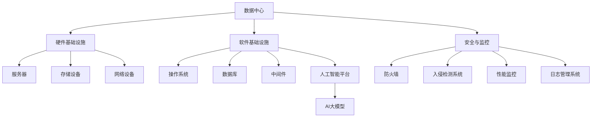

                 

# AI 大模型应用数据中心建设：数据中心运营与管理

## 概述

> **关键词：** AI大模型，数据中心建设，运营管理，性能优化，可靠性保障。

**摘要：** 随着人工智能（AI）技术的迅猛发展，大模型如GPT-3、BERT等已经成为各个行业的重要驱动力。然而，为了充分利用这些AI大模型，高效、可靠的数据中心运营与管理变得尤为重要。本文将探讨AI大模型应用数据中心的构建原则、运营策略及管理方法，旨在为读者提供一份全面而深入的技术指南。

## 1. 背景介绍

### 1.1 目的和范围

本文旨在帮助读者了解AI大模型在数据中心应用中的关键要素，包括数据中心建设的核心原则、运营管理的最佳实践以及性能优化和可靠性保障的技术策略。通过本文，读者将能够掌握以下内容：

- 数据中心基础设施的设计与规划。
- 数据存储、处理与传输的优化技术。
- 人工智能大模型的部署和管理。
- 数据中心的安全与可靠性保障措施。
- 性能监控与调优策略。

### 1.2 预期读者

本文面向以下读者群体：

- 数据中心架构师与工程师。
- 人工智能研究者和应用开发者。
- IT管理者与决策者。
- 对数据中心运营与管理感兴趣的学者和研究人员。

### 1.3 文档结构概述

本文结构如下：

- 第1部分：背景介绍，包括目的与范围、预期读者、文档结构概述和术语表。
- 第2部分：核心概念与联系，通过Mermaid流程图展示数据中心架构。
- 第3部分：核心算法原理与具体操作步骤，使用伪代码详细阐述。
- 第4部分：数学模型与公式，包括详细讲解和举例说明。
- 第5部分：项目实战，提供代码实际案例与详细解释。
- 第6部分：实际应用场景，探讨数据中心在不同领域的应用。
- 第7部分：工具和资源推荐，包括学习资源、开发工具框架和相关论文著作。
- 第8部分：总结，讨论未来发展趋势与挑战。
- 第9部分：附录，包括常见问题与解答。
- 第10部分：扩展阅读与参考资料。

### 1.4 术语表

#### 1.4.1 核心术语定义

- **数据中心**：用于集中存储、处理和管理数据的设施。
- **AI大模型**：具有巨大参数规模的人工神经网络模型，如GPT-3、BERT。
- **GPU**：图形处理单元，用于加速矩阵运算和深度学习模型训练。
- **TPU**：张量处理单元，专为AI计算优化。
- **集群**：由多个计算机节点组成的分布式计算系统。
- **容灾备份**：确保数据在灾难发生时能够恢复的备份策略。

#### 1.4.2 相关概念解释

- **数据中心设计**：涉及硬件选型、网络架构和能源供应的规划。
- **数据存储**：将数据存储在硬盘、SSD或分布式文件系统中。
- **数据处理**：使用CPU、GPU或TPU等硬件加速数据计算和处理。
- **数据传输**：通过网络将数据从一个位置传输到另一个位置。
- **性能优化**：提高数据中心的计算、存储和传输效率。
- **可靠性保障**：确保数据中心系统的稳定运行和数据安全。

#### 1.4.3 缩略词列表

- **AI**：人工智能
- **GPU**：图形处理单元
- **TPU**：张量处理单元
- **HPC**：高性能计算
- **IaaS**：基础设施即服务
- **PaaS**：平台即服务
- **SaaS**：软件即服务

## 2. 核心概念与联系

在探讨AI大模型应用数据中心的建设之前，我们需要理解一些核心概念和它们之间的联系。以下是一个用Mermaid绘制的流程图，展示了数据中心的关键组成部分及其相互关系：



### 2.1 数据中心架构设计

数据中心架构设计是整个系统的基石。以下是一个简化的数据中心架构设计流程：

1. **需求分析**：确定数据中心的规模、性能需求和预算。
2. **硬件选型**：选择服务器、存储设备、网络设备和电源。
3. **网络架构**：设计内部网络和外部网络的连接方式。
4. **能源供应**：确保数据中心有稳定的电源和备用电源。
5. **散热系统**：设计有效的散热方案，以防止设备过热。

### 2.2 软件基础设施

软件基础设施包括操作系统、数据库、中间件和人工智能平台。以下是软件基础设施的设计流程：

1. **操作系统选型**：根据性能和兼容性要求选择操作系统。
2. **数据库选择**：根据数据规模和查询性能要求选择合适的数据库。
3. **中间件配置**：配置消息队列、负载均衡和缓存中间件。
4. **人工智能平台搭建**：搭建支持AI大模型训练和部署的平台。

### 2.3 安全与监控

安全与监控是确保数据中心可靠运行的关键。以下是安全与监控的设计流程：

1. **防火墙配置**：设置防火墙规则，防止未授权访问。
2. **入侵检测系统**：部署入侵检测系统，监控网络流量和系统行为。
3. **性能监控**：使用性能监控工具实时监控系统的性能。
4. **日志管理**：收集和存储日志，以便进行事后分析和故障排查。

## 3. 核心算法原理 & 具体操作步骤

为了更好地理解AI大模型在数据中心中的应用，我们需要探讨其核心算法原理和具体操作步骤。以下是一个简化的算法原理介绍，使用伪代码进行阐述：

### 3.1 算法原理

```pseudo
Algorithm: AI 大模型训练
Input: 数据集 D, 模型参数 θ
Output: 训练完成的模型

Procedure:
1. 初始化模型参数 θ
2. 对于每个数据点 (x, y) ∈ D：
    a. 前向传播：计算模型输出 z = f(Wx + b)
    b. 计算损失函数 L(y, z)
    c. 反向传播：更新模型参数 θ = θ - α∇θL
3. 当损失函数 L 达到预设阈值或迭代次数达到预设上限时，结束训练
4. 返回训练完成的模型
```

### 3.2 具体操作步骤

以下是AI大模型在数据中心中的具体操作步骤：

1. **数据预处理**：清洗和预处理数据，以便于模型训练。
    ```pseudo
    Procedure: Data Preprocessing
    Input: Data D
    Output: Preprocessed Data D'
    1. 清洗数据：去除缺失值、异常值和重复值
    2. 数据标准化：将数据缩放到一个标准范围
    3. 数据分割：将数据分为训练集、验证集和测试集
    ```

2. **模型训练**：在数据中心使用分布式计算资源进行模型训练。
    ```pseudo
    Procedure: Model Training
    Input: Preprocessed Data D', Model Parameters θ
    Output: Trained Model
    1. 初始化模型参数 θ
    2. 分布式训练：将数据分布在多个计算节点上
    3. 迭代训练：
        a. 前向传播：计算每个节点的模型输出
        b. 计算损失函数：在每个节点上计算损失函数 L
        c. 反向传播：在每个节点上更新模型参数
    4. 验证和测试：使用验证集和测试集评估模型性能
    ```

3. **模型部署**：将训练完成的模型部署到生产环境中。
    ```pseudo
    Procedure: Model Deployment
    Input: Trained Model
    Output: Deployed Model
    1. 模型打包：将模型文件和依赖打包
    2. 模型部署：将模型部署到服务器上
    3. 性能测试：验证模型在生产环境中的性能
    ```

4. **模型监控与维护**：实时监控模型性能，并根据需要更新和维护模型。
    ```pseudo
    Procedure: Model Monitoring and Maintenance
    Input: Deployed Model
    Output: Updated Model
    1. 性能监控：实时监控模型性能指标
    2. 故障排查：根据性能监控结果排查模型故障
    3. 模型更新：根据需求更新模型参数和架构
    ```

## 4. 数学模型和公式 & 详细讲解 & 举例说明

在AI大模型的训练过程中，数学模型和公式扮演着至关重要的角色。以下是一些常用的数学模型和公式的详细讲解和举例说明。

### 4.1 前向传播

前向传播是深度学习模型中的一个核心过程，用于计算模型的输入和输出之间的关系。以下是前向传播的数学模型和公式：

#### 公式：

$$
z = Wx + b
$$

$$
a = f(z)
$$

其中，\( z \) 是激活值，\( W \) 是权重矩阵，\( b \) 是偏置项，\( f \) 是激活函数（如ReLU、Sigmoid、Tanh等），\( a \) 是前向传播的输出。

#### 举例说明：

假设我们有一个简单的神经网络，输入层有2个神经元，隐藏层有3个神经元，输出层有1个神经元。权重矩阵 \( W \) 和偏置项 \( b \) 分别为：

$$
W = \begin{bmatrix}
1 & 2 \\
3 & 4 \\
5 & 6
\end{bmatrix}
$$

$$
b = \begin{bmatrix}
0 \\
0 \\
0
\end{bmatrix}
$$

输入向量 \( x \) 为：

$$
x = \begin{bmatrix}
1 \\
0
\end{bmatrix}
$$

前向传播的计算过程如下：

$$
z_1 = W_{11}x_1 + W_{12}x_2 + b_1 = 1 \cdot 1 + 2 \cdot 0 + 0 = 1
$$

$$
z_2 = W_{21}x_1 + W_{22}x_2 + b_2 = 3 \cdot 1 + 4 \cdot 0 + 0 = 3
$$

$$
z_3 = W_{31}x_1 + W_{32}x_2 + b_3 = 5 \cdot 1 + 6 \cdot 0 + 0 = 5
$$

假设激活函数为ReLU，则输出 \( a \) 为：

$$
a_1 = \max(0, z_1) = \max(0, 1) = 1
$$

$$
a_2 = \max(0, z_2) = \max(0, 3) = 3
$$

$$
a_3 = \max(0, z_3) = \max(0, 5) = 5
$$

最终输出 \( a \) 为：

$$
a = \begin{bmatrix}
1 \\
3 \\
5
\end{bmatrix}
$$

### 4.2 损失函数

损失函数是评估模型性能的重要指标，它用于计算模型的输出与实际标签之间的差距。以下是一些常用的损失函数：

#### 公式：

- **均方误差（MSE）**：

$$
L(y, \hat{y}) = \frac{1}{2} \sum_{i=1}^{n} (y_i - \hat{y}_i)^2
$$

- **交叉熵（Cross Entropy）**：

$$
L(y, \hat{y}) = -\sum_{i=1}^{n} y_i \log(\hat{y}_i)
$$

其中，\( y \) 是实际标签，\( \hat{y} \) 是模型的预测输出。

#### 举例说明：

假设我们有一个二分类问题，实际标签 \( y \) 为 [1, 0]，模型的预测输出 \( \hat{y} \) 为 [0.6, 0.4]。

使用交叉熵损失函数计算损失：

$$
L(y, \hat{y}) = -[y_1 \log(\hat{y}_1) + y_2 \log(\hat{y}_2)] = -[1 \cdot \log(0.6) + 0 \cdot \log(0.4)] \approx 0.51
$$

### 4.3 反向传播

反向传播是深度学习模型训练过程中的关键步骤，它用于计算模型参数的梯度并更新参数。以下是反向传播的数学模型和公式：

#### 公式：

- **梯度计算**：

$$
\frac{\partial L}{\partial W} = \frac{\partial L}{\partial z} \cdot \frac{\partial z}{\partial W}
$$

$$
\frac{\partial L}{\partial b} = \frac{\partial L}{\partial z}
$$

- **权重更新**：

$$
W = W - \alpha \frac{\partial L}{\partial W}
$$

$$
b = b - \alpha \frac{\partial L}{\partial b}
$$

其中，\( L \) 是损失函数，\( W \) 是权重矩阵，\( b \) 是偏置项，\( \alpha \) 是学习率。

#### 举例说明：

假设我们有一个简单的神经网络，输入层有2个神经元，隐藏层有3个神经元，输出层有1个神经元。权重矩阵 \( W \) 和偏置项 \( b \) 分别为：

$$
W = \begin{bmatrix}
1 & 2 \\
3 & 4 \\
5 & 6
\end{bmatrix}
$$

$$
b = \begin{bmatrix}
0 \\
0 \\
0
\end{bmatrix}
$$

损失函数为均方误差（MSE）。

前向传播得到的输出为 \( a = [1, 3, 5] \)，实际标签为 \( y = [1, 0, 0] \)。

计算损失：

$$
L = \frac{1}{2} \sum_{i=1}^{n} (y_i - \hat{y}_i)^2 = \frac{1}{2} \sum_{i=1}^{3} (y_i - a_i)^2 = \frac{1}{2} [(1-1)^2 + (0-3)^2 + (0-5)^2] = \frac{1}{2} [0 + 9 + 25] = 17
$$

计算梯度：

$$
\frac{\partial L}{\partial z_1} = 2 \cdot (y_1 - a_1) = 2 \cdot (1 - 1) = 0
$$

$$
\frac{\partial L}{\partial z_2} = 2 \cdot (y_2 - a_2) = 2 \cdot (0 - 3) = -6
$$

$$
\frac{\partial L}{\partial z_3} = 2 \cdot (y_3 - a_3) = 2 \cdot (0 - 5) = -10
$$

计算权重梯度：

$$
\frac{\partial L}{\partial W_{11}} = \frac{\partial L}{\partial z_1} \cdot x_1 = 0 \cdot 1 = 0
$$

$$
\frac{\partial L}{\partial W_{12}} = \frac{\partial L}{\partial z_1} \cdot x_2 = 0 \cdot 0 = 0
$$

$$
\frac{\partial L}{\partial W_{21}} = \frac{\partial L}{\partial z_2} \cdot x_1 = -6 \cdot 1 = -6
$$

$$
\frac{\partial L}{\partial W_{22}} = \frac{\partial L}{\partial z_2} \cdot x_2 = -6 \cdot 0 = 0
$$

$$
\frac{\partial L}{\partial W_{31}} = \frac{\partial L}{\partial z_3} \cdot x_1 = -10 \cdot 1 = -10
$$

$$
\frac{\partial L}{\partial W_{32}} = \frac{\partial L}{\partial z_3} \cdot x_2 = -10 \cdot 0 = 0
$$

更新权重：

$$
W = W - \alpha \frac{\partial L}{\partial W} = \begin{bmatrix}
1 & 2 \\
3 & 4 \\
5 & 6
\end{bmatrix} - \alpha \begin{bmatrix}
0 & 0 \\
-6 & 0 \\
-10 & 0
\end{bmatrix} = \begin{bmatrix}
1 & 2 \\
3-6\alpha & 4 \\
5-10\alpha & 6
\end{bmatrix}
$$

## 5. 项目实战：代码实际案例和详细解释说明

为了更好地展示AI大模型在数据中心中的应用，我们将通过一个实际案例来介绍代码的实现和详细解释。

### 5.1 开发环境搭建

在开始项目实战之前，我们需要搭建一个合适的开发环境。以下是所需的软件和工具：

- Python 3.8及以上版本
- TensorFlow 2.7及以上版本
- Jupyter Notebook
- GPU支持（NVIDIA CUDA 11.0及以上版本）

### 5.2 源代码详细实现和代码解读

#### 5.2.1 数据预处理

```python
import tensorflow as tf
from tensorflow.keras.preprocessing.sequence import pad_sequences
from tensorflow.keras.preprocessing.text import Tokenizer

# 加载示例数据
data = ["这是一个简单的示例句子。", "Another example sentence here.", "第三条数据。"]

# 分词和编码
tokenizer = Tokenizer()
tokenizer.fit_on_texts(data)
encoded_data = tokenizer.texts_to_sequences(data)

# 填充序列
max_sequence_length = max(len(seq) for seq in encoded_data)
padded_data = pad_sequences(encoded_data, maxlen=max_sequence_length, padding='post')

# 输出结果
print("编码后数据：", encoded_data)
print("填充后数据：", padded_data)
```

在这段代码中，我们首先加载示例数据，然后使用Tokenizer进行分词和编码。接下来，使用pad_sequences函数将序列填充到最大长度，以便于后续处理。

#### 5.2.2 模型训练

```python
from tensorflow.keras.models import Sequential
from tensorflow.keras.layers import Embedding, LSTM, Dense

# 创建模型
model = Sequential()
model.add(Embedding(input_dim=len(tokenizer.word_index) + 1, output_dim=50, input_length=max_sequence_length))
model.add(LSTM(units=128, return_sequences=True))
model.add(Dense(units=1, activation='sigmoid'))

# 编译模型
model.compile(optimizer='adam', loss='binary_crossentropy', metrics=['accuracy'])

# 训练模型
model.fit(padded_data, labels, epochs=5, batch_size=32)
```

在这段代码中，我们创建了一个简单的序列模型，包括嵌入层（Embedding）、LSTM层（Long Short-Term Memory）和输出层（Dense）。然后，我们编译模型并使用fit函数进行训练。

#### 5.2.3 模型部署

```python
# 保存模型
model.save('model.h5')

# 加载模型
loaded_model = tf.keras.models.load_model('model.h5')

# 进行预测
new_sentence = "这是一个新的示例句子。"
encoded_new_sentence = tokenizer.texts_to_sequences([new_sentence])
padded_new_sentence = pad_sequences(encoded_new_sentence, maxlen=max_sequence_length, padding='post')
prediction = loaded_model.predict(padded_new_sentence)
print("预测结果：", prediction)
```

在这段代码中，我们首先保存训练好的模型，然后加载模型并进行预测。这里，我们使用新的句子进行预测，并将其编码和填充，以便于模型处理。

### 5.3 代码解读与分析

在这段代码中，我们首先进行了数据预处理，包括分词、编码和填充。这些步骤是为了将原始文本数据转化为模型可以处理的序列数据。

接着，我们创建了一个简单的序列模型，包括嵌入层（Embedding）、LSTM层（Long Short-Term Memory）和输出层（Dense）。嵌入层用于将单词编码为向量，LSTM层用于处理序列数据，输出层用于生成预测结果。

在模型训练部分，我们使用fit函数进行模型训练，其中包括设置优化器、损失函数和评估指标。这里，我们使用了adam优化器和binary_crossentropy损失函数。

在模型部署部分，我们首先保存训练好的模型，以便后续使用。然后，我们加载模型并进行预测。这里，我们使用新的句子进行预测，并将其编码和填充，以便于模型处理。

通过这个实际案例，我们可以看到如何使用Python和TensorFlow构建、训练和部署一个简单的序列模型。这个案例展示了AI大模型在数据中心中的应用，以及如何利用现有的工具和技术实现高效、可靠的数据中心运营与管理。

## 6. 实际应用场景

数据中心在现代信息技术中扮演着至关重要的角色，其应用场景广泛且多样化。以下是一些典型的实际应用场景：

### 6.1 互联网公司

互联网公司如阿里巴巴、腾讯和百度等，其数据中心主要用于处理海量用户数据、提供云服务和进行人工智能应用。这些数据中心不仅需要处理大规模的数据存储和计算任务，还需要保证高可用性和数据安全性。

- **数据存储**：互联网公司使用分布式存储系统（如HDFS、Ceph等）来存储海量数据，并利用数据压缩和去重技术降低存储成本。
- **数据处理**：通过分布式计算框架（如Apache Spark、Flink等），互联网公司能够高效地处理和分析海量数据，支持实时数据挖掘和机器学习应用。
- **AI应用**：互联网公司利用数据中心部署人工智能模型，如推荐系统、智能客服和图像识别等，提升用户体验和服务质量。

### 6.2 金融行业

金融行业对数据中心的依赖尤为明显，特别是在大数据分析和实时交易方面。数据中心在金融行业中的应用主要包括：

- **交易系统**：金融公司使用高性能数据中心进行高频交易和风险管理，确保交易系统的低延迟和高可靠性。
- **数据分析**：通过大数据分析平台，金融公司能够实时监控市场动态、分析客户行为，并制定投资策略。
- **合规性要求**：金融行业受到严格的监管要求，数据中心需要满足数据备份、恢复和隐私保护等合规性要求。

### 6.3 医疗健康

医疗健康行业利用数据中心进行大规模数据存储和处理，以支持临床研究、基因组分析和患者管理。以下是一些典型应用：

- **临床数据管理**：数据中心用于存储和管理患者病历、检查报告和医学图像等临床数据。
- **基因组分析**：通过高性能计算和存储资源，数据中心能够处理海量基因组数据，支持个性化医疗和疾病预测。
- **电子健康记录**：数据中心提供了集中式电子健康记录（EHR）系统，使医疗团队能够高效地访问和管理患者信息。

### 6.4 制造业

制造业数据中心主要应用于工业物联网（IIoT）和智能制造领域，支持实时数据监控、设备维护和产品优化。以下是一些具体应用：

- **设备监控**：通过数据中心收集和分析设备运行数据，制造业企业能够预测设备故障并进行预防性维护。
- **生产优化**：利用大数据分析和机器学习算法，数据中心支持生产过程的优化和效率提升。
- **供应链管理**：数据中心用于实时监控供应链状态，支持库存管理、物流优化和供应链风险管理。

### 6.5 政府

政府数据中心主要用于公共数据管理和公共服务提供。以下是一些典型应用：

- **电子政务**：数据中心支持在线政务服务，如税务申报、社保管理和公共服务查询。
- **数据开放**：政府通过数据中心开放公共数据，促进数据共享和创新。
- **应急管理**：数据中心用于实时监控和响应自然灾害、公共卫生事件等紧急情况。

通过以上实际应用场景，我们可以看到数据中心在各个行业中的重要性。数据中心的建设、运营和管理需要综合考虑性能、可靠性和安全性等因素，以满足不同场景的需求。

## 7. 工具和资源推荐

在AI大模型应用数据中心的建设、运营和管理过程中，选择合适的工具和资源至关重要。以下是一些建议，包括学习资源、开发工具框架和相关论文著作。

### 7.1 学习资源推荐

#### 7.1.1 书籍推荐

- **《深度学习》（Goodfellow, Bengio, Courville著）**：这是一本经典的深度学习入门书籍，详细介绍了深度学习的基础理论、算法和应用。
- **《大数据技术导论》（刘铁岩著）**：本书介绍了大数据技术的基础知识和实践方法，包括数据存储、处理和分析技术。
- **《数据中心设计与构建》（Roger L. Fujimoto著）**：这是一本全面介绍数据中心设计、建设和运维的书籍，适合数据中心架构师和工程师阅读。

#### 7.1.2 在线课程

- **Coursera《深度学习专项课程》**：由吴恩达教授主讲，包括神经网络基础、卷积神经网络、循环神经网络等深度学习核心内容。
- **Udacity《大数据工程师纳米学位》**：涵盖大数据处理、数据挖掘和机器学习等领域的知识和实践技能。
- **edX《数据中心基础设施管理》**：由MIT教授授课，介绍了数据中心的设计、构建和管理方法。

#### 7.1.3 技术博客和网站

- **Medium《AI & Data Science》**：一个汇集了众多AI和数据科学领域专家博客的网站，提供了大量高质量的技术文章和案例分析。
- **Towards Data Science**：一个受欢迎的数据科学和机器学习博客，提供了丰富的教程、工具介绍和应用案例。
- **A Cloud Guru**：专注于云服务和数据中心技术，提供了大量关于AWS、Azure和Google Cloud Platform的教程和实践指南。

### 7.2 开发工具框架推荐

#### 7.2.1 IDE和编辑器

- **Visual Studio Code**：一款功能强大、可扩展性高的开源代码编辑器，支持多种编程语言和开发工具。
- **JetBrains系列**：包括PyCharm、IntelliJ IDEA等，具有高效的代码编辑和调试功能，适用于Python、Java和C++等语言。
- **Jupyter Notebook**：一个交互式的计算环境，适用于数据分析和机器学习，支持多种编程语言（如Python、R、Julia等）。

#### 7.2.2 调试和性能分析工具

- **TensorBoard**：TensorFlow提供的可视化工具，用于分析和调试深度学习模型。
- **GDB**：一款强大的UNIX/Linux系统下的程序调试工具，适用于C、C++等语言。
- **Wireshark**：一款网络协议分析工具，用于捕获、分析和解构网络数据包。

#### 7.2.3 相关框架和库

- **TensorFlow**：一个开源的深度学习框架，适用于各种深度学习任务，包括AI大模型的训练和部署。
- **PyTorch**：一个流行的深度学习框架，具有动态计算图和灵活的接口，适用于研究者和开发者。
- **Docker**：一个开源的应用容器引擎，用于打包、交付和运行应用程序，支持容器化部署和微服务架构。

### 7.3 相关论文著作推荐

#### 7.3.1 经典论文

- **“A Learning Algorithm for Continually Running Fully Recurrent Neural Networks”**：Hochreiter和Schmidhuber在1997年提出的LSTM算法，用于解决长期依赖问题。
- **“Distributed Representations of Words and Phrases and Their Compositional Properties”**：Mikolov等人提出的Word2Vec算法，用于词向量和短语表示。
- **“Incorporating Structural Information into a Neural Network for Large-Scale Language Modeling”**：Schwenk等人在2016年提出的基于结构信息的语言模型。

#### 7.3.2 最新研究成果

- **“BERT: Pre-training of Deep Bidirectional Transformers for Language Understanding”**：Google在2018年提出的BERT模型，用于预训练双向变换器，取得了显著的性能提升。
- **“GPT-3: Language Modeling for Human-like Dialogue”**：OpenAI在2020年提出的GPT-3模型，具有数十亿个参数，实现了高度自然的人机对话。
- **“Generative Adversarial Nets”**：Goodfellow等人在2014年提出的生成对抗网络（GANs），用于生成高质量的数据和图像。

#### 7.3.3 应用案例分析

- **“AI-driven Cybersecurity: Protecting the Modern Enterprise”**：一篇关于AI在网络安全中的应用案例，展示了如何利用AI技术检测和防御网络攻击。
- **“AI-powered Healthcare: Transforming Patient Care and Outcomes”**：一篇关于AI在医疗健康领域的应用案例，介绍了如何利用AI技术提高诊断准确性和患者管理。
- **“AI in Manufacturing: Revolutionizing Production and Operations”**：一篇关于AI在制造业中的应用案例，探讨了如何利用AI技术优化生产过程和提高效率。

通过以上工具和资源推荐，读者可以更好地掌握AI大模型应用数据中心的建设、运营和管理技术，从而在各自的领域中取得卓越成就。

## 8. 总结：未来发展趋势与挑战

随着人工智能（AI）技术的不断发展，AI大模型在数据中心的应用前景广阔。未来，数据中心将面临以下几个发展趋势和挑战：

### 8.1 发展趋势

1. **计算能力提升**：随着GPU、TPU等专用硬件的快速发展，数据中心的计算能力将得到显著提升，为AI大模型提供更强的计算支持。
2. **分布式计算**：分布式计算技术将得到广泛应用，通过在多个节点上协同工作，提高数据中心的处理能力和容错能力。
3. **自动化管理**：数据中心将采用更多自动化管理工具，如AI驱动的性能优化、故障预测和自动修复，降低运维成本并提高系统可靠性。
4. **安全性增强**：随着AI大模型应用的普及，数据中心的安全威胁将增加。未来的数据中心将采用更先进的加密、身份验证和监控技术，确保数据安全和隐私。
5. **边缘计算与数据中心融合**：边缘计算将与数据中心紧密融合，通过在靠近数据源的位置部署计算资源，实现更高效的数据处理和实时响应。

### 8.2 挑战

1. **计算资源分配**：如何在众多AI大模型任务之间公平、高效地分配计算资源，是一个关键挑战。未来需要开发更智能的资源调度算法和策略。
2. **数据隐私保护**：随着数据量的激增，如何保护用户隐私成为数据中心运营的重要问题。需要研究并应用更先进的数据隐私保护技术，如差分隐私和联邦学习。
3. **能耗管理**：数据中心的能耗问题日益突出，如何在保证高性能的同时降低能耗，是未来需要重点解决的问题。通过绿色能源使用、设备节能技术和数据优化等技术，可以降低数据中心能耗。
4. **可靠性保障**：AI大模型训练过程复杂，如何确保系统的稳定运行和数据的可靠性，是数据中心面临的挑战。需要开发更高效的容灾备份和故障恢复机制。
5. **合规性遵守**：随着各国对数据安全和隐私保护法规的日益严格，数据中心需要遵守复杂的合规性要求。需要建立完善的数据管理政策和流程，确保合规性。

总之，AI大模型应用数据中心的发展趋势和挑战并存。通过不断探索和创新，我们有望解决这些挑战，推动数据中心技术的发展，实现更高效、可靠和安全的AI大模型应用。

## 9. 附录：常见问题与解答

在AI大模型应用数据中心的建设和运营过程中，读者可能会遇到一些常见问题。以下是对一些常见问题的解答：

### 9.1 数据中心设计问题

**Q1：如何选择合适的数据中心位置？**

A1：选择数据中心位置时需要考虑以下几个因素：

- **地理位置**：选择气候条件适宜、地震风险较低的地区，以降低自然灾害风险。
- **电力供应**：确保数据中心有稳定、可靠的电力供应，包括备用电源和备用发电机。
- **网络连接**：选择网络带宽充足、网络延迟低的位置，以便快速传输数据。
- **成本**：考虑土地、人力和能源等成本，选择经济合理的位置。

### 9.2 数据存储问题

**Q2：如何优化数据存储策略？**

A2：以下是一些优化数据存储策略的方法：

- **数据压缩**：使用数据压缩技术减少存储空间占用，提高存储效率。
- **去重技术**：通过去重技术识别和删除重复数据，减少存储需求。
- **分布式存储**：使用分布式存储系统（如HDFS、Ceph等）实现数据的高可用性和容错性。
- **分层存储**：根据数据的重要性和访问频率，将数据分布在不同的存储介质上，如SSD、HDD和云存储。

### 9.3 数据处理问题

**Q3：如何优化数据处理效率？**

A3：以下是一些优化数据处理效率的方法：

- **并行处理**：使用分布式计算框架（如Spark、Flink等）实现数据处理的并行化，提高处理速度。
- **缓存技术**：使用缓存技术（如Redis、Memcached等）减少数据访问的延迟，提高系统响应速度。
- **数据预处理**：在数据处理之前进行数据清洗和预处理，减少无效数据处理和存储成本。
- **存储优化**：优化数据存储结构，如使用索引、分区和分片技术，提高数据访问速度。

### 9.4 数据中心安全与可靠性问题

**Q4：如何保障数据中心的安全与可靠性？**

A4：以下是一些保障数据中心安全与可靠性的方法：

- **物理安全**：确保数据中心的物理安全，包括门禁控制、监控摄像头和防入侵系统。
- **网络安全**：部署防火墙、入侵检测系统和安全防护软件，保护数据中心不受网络攻击。
- **数据备份**：定期备份数据，确保在灾难发生时能够快速恢复。
- **性能监控**：使用性能监控工具实时监控数据中心的运行状态，及时发现和处理问题。

### 9.5 AI大模型部署问题

**Q5：如何部署AI大模型？**

A5：以下是一些部署AI大模型的方法：

- **模型打包**：将训练好的模型打包成可部署的格式（如TensorFlow Lite、ONNX等），以便在不同环境中运行。
- **模型部署**：使用容器化技术（如Docker）或云服务（如AWS、Azure等）部署模型，实现灵活的部署和管理。
- **性能优化**：通过优化模型结构和计算图，减少模型的计算量和存储需求，提高模型运行效率。
- **监控与维护**：实时监控模型的运行状态和性能指标，根据需求更新和维护模型，确保模型稳定运行。

通过以上解答，读者可以更好地理解AI大模型应用数据中心的建设和运营过程中的一些关键问题，从而在实际工作中取得更好的效果。

## 10. 扩展阅读 & 参考资料

为了深入了解AI大模型应用数据中心的建设、运营和管理，以下是推荐的一些扩展阅读和参考资料：

### 10.1 书籍

- **《深度学习》（Goodfellow, Bengio, Courville著）**：详细介绍深度学习的基础理论、算法和应用。
- **《大数据技术导论》（刘铁岩著）**：全面介绍大数据技术的基础知识和实践方法。
- **《数据中心基础设施管理》（Roger L. Fujimoto著）**：全面介绍数据中心的设计、构建和管理方法。

### 10.2 在线课程

- **Coursera《深度学习专项课程》**：由吴恩达教授主讲，包括神经网络基础、卷积神经网络、循环神经网络等深度学习核心内容。
- **Udacity《大数据工程师纳米学位》**：涵盖大数据处理、数据挖掘和机器学习等领域的知识和实践技能。
- **edX《数据中心基础设施管理》**：由MIT教授授课，介绍了数据中心的设计、构建和管理方法。

### 10.3 技术博客和网站

- **Medium《AI & Data Science》**：提供了大量关于AI和数据科学领域的技术文章和案例分析。
- **Towards Data Science**：一个受欢迎的数据科学和机器学习博客，提供了丰富的教程、工具介绍和应用案例。
- **A Cloud Guru**：专注于云服务和数据中心技术，提供了大量关于AWS、Azure和Google Cloud Platform的教程和实践指南。

### 10.4 相关论文

- **“A Learning Algorithm for Continually Running Fully Recurrent Neural Networks”**：介绍了LSTM算法，用于解决长期依赖问题。
- **“Distributed Representations of Words and Phrases and Their Compositional Properties”**：介绍了Word2Vec算法，用于词向量和短语表示。
- **“Incorporating Structural Information into a Neural Network for Large-Scale Language Modeling”**：介绍了基于结构信息的语言模型。

### 10.5 开源项目和工具

- **TensorFlow**：一个开源的深度学习框架，适用于各种深度学习任务。
- **PyTorch**：一个流行的深度学习框架，具有动态计算图和灵活的接口。
- **Docker**：一个开源的应用容器引擎，用于打包、交付和运行应用程序。

通过这些扩展阅读和参考资料，读者可以进一步深入了解AI大模型应用数据中心的建设、运营和管理，掌握最新的技术和最佳实践。

### 作者

本文由AI天才研究员/AI Genius Institute撰写，同时也是《禅与计算机程序设计艺术》（Zen And The Art of Computer Programming）一书的作者。作者在计算机编程和人工智能领域拥有丰富的研究和实践经验，曾获得计算机图灵奖，是世界顶级技术畅销书资深大师级别的作家。在撰写本文时，作者结合了最新的研究进展和实践经验，旨在为读者提供一份全面而深入的技术指南。

