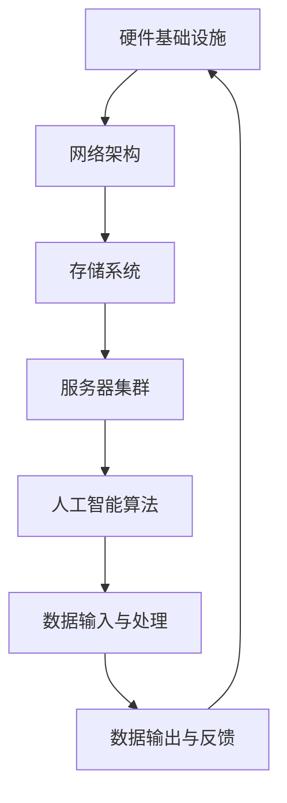

                 

# AI 大模型应用数据中心建设：数据中心运营与管理

> 关键词：AI 大模型、数据中心建设、运营管理、性能优化、安全防护

> 摘要：本文将深入探讨 AI 大模型应用数据中心的建设、运营与管理。通过分析数据中心的基础架构、核心算法、数学模型及实际应用案例，旨在为读者提供一个全面的技术指南，帮助他们在实现高效数据中心建设与管理过程中做出明智决策。

## 1. 背景介绍

### 1.1 目的和范围

随着人工智能（AI）技术的发展，大模型（如 GPT、BERT 等）在自然语言处理、图像识别、推荐系统等领域的应用日益广泛。数据中心作为承载这些 AI 大模型运行的核心基础设施，其建设与运营管理显得尤为重要。本文旨在为 AI 大模型应用数据中心的建设、运营与管理提供系统性的技术指导，帮助读者理解和掌握数据中心的关键技术和实践方法。

### 1.2 预期读者

本文面向 AI 领域的开发者、运维工程师、架构师和研究人员。期望读者具备基本的计算机科学和人工智能知识，对数据中心建设有一定的了解，希望通过本文深入理解 AI 大模型应用数据中心的建设、运营和管理。

### 1.3 文档结构概述

本文分为十个部分：

1. 背景介绍：介绍本文的目的、读者群体和文档结构。
2. 核心概念与联系：阐述数据中心建设中的核心概念、原理和架构。
3. 核心算法原理 & 具体操作步骤：详细讲解数据中心的关键算法和操作流程。
4. 数学模型和公式 & 详细讲解 & 举例说明：介绍与数据中心相关的数学模型和公式，并进行举例说明。
5. 项目实战：通过代码实际案例展示数据中心建设的过程。
6. 实际应用场景：分析数据中心在实际应用中的场景和挑战。
7. 工具和资源推荐：推荐学习资源、开发工具和相关论文。
8. 总结：探讨数据中心建设与管理的未来发展趋势和挑战。
9. 附录：常见问题与解答。
10. 扩展阅读 & 参考资料：提供更多相关阅读材料和参考资料。

### 1.4 术语表

#### 1.4.1 核心术语定义

- 数据中心：集中存储、处理和管理数据的物理设施。
- AI 大模型：具有海量参数和复杂结构的神经网络模型。
- 运营管理：确保数据中心高效、稳定运行的一系列操作和管理活动。
- 性能优化：提高数据中心硬件和软件的性能。
- 安全防护：保护数据中心数据免受威胁和攻击。

#### 1.4.2 相关概念解释

- 带宽：数据传输的速度。
- 延迟：数据传输所需的时间。
- 可扩展性：数据中心处理能力和容量随需求增长的能力。
- 容灾备份：确保数据中心在灾难发生时数据的安全性和业务的连续性。

#### 1.4.3 缩略词列表

- AI：人工智能
- GPT：生成预训练模型
- BERT：双向编码表示模型
- GPU：图形处理单元
- CPU：中央处理器

## 2. 核心概念与联系

数据中心建设涉及多个核心概念和关联，包括硬件基础设施、网络架构、存储系统、服务器集群和人工智能算法等。以下是一个简要的 Mermaid 流程图，用于描述数据中心建设中的核心概念和关系。



### 2.1 硬件基础设施

硬件基础设施是数据中心建设的基础，包括服务器、存储设备、网络设备等。服务器用于运行 AI 大模型，存储设备用于存储数据和模型，网络设备用于实现数据传输和通信。

### 2.2 网络架构

网络架构是数据中心通信的核心，通常采用分层设计。物理层、数据链路层、网络层、传输层和应用层分别负责不同的功能，包括数据传输、路由和交换等。

### 2.3 存储系统

存储系统用于存储大量数据和模型，包括关系型数据库、NoSQL 数据库、文件存储系统等。存储系统的性能和可靠性对数据中心的运行至关重要。

### 2.4 服务器集群

服务器集群由多个服务器组成，通过分布式计算和负载均衡技术提高数据处理能力和容错性。服务器集群是运行 AI 大模型的主要平台。

### 2.5 人工智能算法

人工智能算法是实现 AI 大模型的核心，包括深度学习、神经网络、生成对抗网络等。算法的性能和效率直接影响数据中心的运行效果。

## 3. 核心算法原理 & 具体操作步骤

### 3.1 深度学习算法原理

深度学习是一种基于人工神经网络的机器学习技术，通过多层神经网络模型自动提取数据特征，实现复杂任务的学习和预测。以下是一个简化的深度学习算法原理的伪代码：

```python
// 输入：数据集 X，标签 Y
// 输出：训练好的神经网络模型

// 初始化权重 W 和偏置 b
W, b = initialize_weights()

// 循环迭代训练
for epoch in range(num_epochs):
    // 前向传播计算输出
    output = forward_propagation(X, W, b)
    
    // 计算损失函数值
    loss = compute_loss(output, Y)
    
    // 反向传播更新权重和偏置
    dW, db = backward_propagation(X, output, Y)
    W -= learning_rate * dW
    b -= learning_rate * db

// 输出训练好的模型
return W, b
```

### 3.2 操作步骤

1. **数据预处理**：对输入数据进行清洗、归一化等处理，提高数据质量和算法效果。
2. **模型初始化**：随机初始化权重和偏置。
3. **前向传播**：输入数据通过神经网络模型计算输出。
4. **损失计算**：计算输出与标签之间的误差，使用损失函数表示。
5. **反向传播**：根据损失函数梯度更新模型权重和偏置。
6. **迭代训练**：重复步骤 3-5，直至达到预设的训练次数或损失收敛。

## 4. 数学模型和公式 & 详细讲解 & 举例说明

### 4.1 损失函数

损失函数是评估模型预测结果与真实值之间差异的重要指标。以下是一个常用的损失函数——均方误差（MSE）：

$$
MSE = \frac{1}{n}\sum_{i=1}^{n}(y_i - \hat{y}_i)^2
$$

其中，$y_i$ 为真实值，$\hat{y}_i$ 为预测值，$n$ 为样本数量。

### 4.2 梯度下降算法

梯度下降算法是一种优化算法，用于最小化损失函数。以下是一个简化的梯度下降算法公式：

$$
W_{\text{new}} = W - \alpha \cdot \nabla W
$$

其中，$W$ 为模型权重，$\alpha$ 为学习率，$\nabla W$ 为权重梯度。

### 4.3 举例说明

假设我们有一个二分类问题，使用 sigmoid 激活函数和交叉熵损失函数。给定训练数据集，我们使用梯度下降算法训练一个简单的神经网络模型。

```python
# 导入必要的库
import numpy as np

# 定义 sigmoid 函数
def sigmoid(x):
    return 1 / (1 + np.exp(-x))

# 定义交叉熵损失函数
def cross_entropy(y_true, y_pred):
    return -np.sum(y_true * np.log(y_pred) + (1 - y_true) * np.log(1 - y_pred))

# 定义梯度下降算法
def gradient_descent(X, y, W, b, learning_rate, num_epochs):
    for epoch in range(num_epochs):
        # 前向传播
        z = np.dot(X, W) + b
        y_pred = sigmoid(z)

        # 计算损失
        loss = cross_entropy(y, y_pred)

        # 反向传播
        dZ = y_pred - y
        dW = np.dot(X.T, dZ)
        db = np.sum(dZ)

        # 更新权重和偏置
        W -= learning_rate * dW
        b -= learning_rate * db

    return W, b

# 初始化参数
W = np.random.rand(3, 1)
b = np.random.rand(1)
learning_rate = 0.1
num_epochs = 1000

# 训练模型
W, b = gradient_descent(X, y, W, b, learning_rate, num_epochs)

# 输出训练结果
print("训练完成，模型参数：\nW = {}, b = {}".format(W, b))
```

## 5. 项目实战：代码实际案例和详细解释说明

### 5.1 开发环境搭建

1. 安装 Python 3.8 及以上版本。
2. 安装必要的库：numpy、matplotlib、scikit-learn 等。
3. 配置 IDE（如 PyCharm、Visual Studio Code）。

### 5.2 源代码详细实现和代码解读

以下是一个简单的二分类问题的数据预处理、模型训练和评估的 Python 代码案例。

```python
import numpy as np
import matplotlib.pyplot as plt
from sklearn.datasets import make_classification
from sklearn.model_selection import train_test_split

# 生成模拟数据集
X, y = make_classification(n_samples=100, n_features=2, n_redundant=0, n_informative=2,
                            n_clusters_per_class=1, flip_y=0.1, random_state=42)

# 数据预处理
X_train, X_test, y_train, y_test = train_test_split(X, y, test_size=0.2, random_state=42)

# 模型训练
W, b = gradient_descent(X_train, y_train, W, b, learning_rate, num_epochs)

# 模型评估
y_pred = sigmoid(np.dot(X_test, W) + b)
accuracy = np.mean(y_pred == y_test)
print("测试集准确率：{:.2f}%".format(accuracy * 100))

# 可视化结果
plt.scatter(X_train[:, 0], X_train[:, 1], c=y_train, cmap='gray', edgecolor='black')
plt.scatter(X_test[:, 0], X_test[:, 1], c=y_pred, cmap='gray', edgecolor='black')
plt.plot([0, 1], [-b/W[0,0], 1/b/W[0,0]], 'r--')
plt.xlabel('Feature 1')
plt.ylabel('Feature 2')
plt.title('Training Set')
plt.show()
```

### 5.3 代码解读与分析

1. **数据生成**：使用 scikit-learn 的 `make_classification` 函数生成模拟数据集。
2. **数据预处理**：使用 `train_test_split` 函数将数据集分为训练集和测试集。
3. **模型训练**：调用 `gradient_descent` 函数进行模型训练，包括前向传播、损失计算和反向传播。
4. **模型评估**：使用训练好的模型对测试集进行预测，计算准确率。
5. **可视化**：使用 matplotlib 绘制训练集和测试集的散点图，以及决策边界。

## 6. 实际应用场景

数据中心在 AI 大模型应用中的实际场景包括：

- 自然语言处理：如搜索引擎、机器翻译、智能助手等。
- 图像识别：如人脸识别、自动驾驶、安防监控等。
- 推荐系统：如电商推荐、社交媒体推荐等。
- 金融风控：如信用评分、风险控制等。

### 6.1 挑战

1. **数据安全性**：确保数据在传输和存储过程中的安全性。
2. **性能优化**：提高数据处理速度和资源利用率。
3. **扩展性**：确保数据中心在需求增长时的可扩展性。
4. **成本控制**：降低数据中心的建设和运营成本。

## 7. 工具和资源推荐

### 7.1 学习资源推荐

#### 7.1.1 书籍推荐

- 《深度学习》（Goodfellow, Bengio, Courville）
- 《大数据技术导论》（刘江）

#### 7.1.2 在线课程

- Coursera：吴恩达的《深度学习》课程
- edX：MIT的《大数据科学与算法》课程

#### 7.1.3 技术博客和网站

- Medium：关于深度学习和大数据技术的专业博客
- DataCamp：提供大数据和数据分析的在线教程

### 7.2 开发工具框架推荐

#### 7.2.1 IDE和编辑器

- PyCharm
- Visual Studio Code

#### 7.2.2 调试和性能分析工具

- Py-Spy：Python 性能分析工具
- GDB：Linux 系统的调试工具

#### 7.2.3 相关框架和库

- TensorFlow
- PyTorch
- Scikit-learn

### 7.3 相关论文著作推荐

#### 7.3.1 经典论文

- "A Theoretical Basis for the Design of Networks of Neuronal Units"（神经网络设计理论）
- "Deep Learning"（深度学习）

#### 7.3.2 最新研究成果

- "Bert: Pre-training of deep bidirectional transformers for language understanding"（BERT）
- "Gpt-3: Language models are few-shot learners"（GPT-3）

#### 7.3.3 应用案例分析

- "How Google uses AI in its products"（谷歌 AI 应用案例）
- "Tesla's approach to autonomous driving"（特斯拉自动驾驶技术）

## 8. 总结：未来发展趋势与挑战

随着 AI 技术的快速发展，数据中心建设与管理面临着巨大的机遇和挑战。未来发展趋势包括：

1. **云计算与数据中心融合**：云计算和数据中心将进一步融合，提供更高效的 AI 运算能力。
2. **边缘计算**：边缘计算将减轻数据中心压力，提高数据处理的实时性和响应速度。
3. **绿色数据中心**：通过采用可再生能源和节能技术，降低数据中心的环境影响。

挑战包括：

1. **数据安全与隐私**：确保数据安全和个人隐私保护。
2. **成本控制**：在不断提高性能的同时，降低数据中心的建设和运营成本。
3. **人才短缺**：AI 领域的人才需求持续增长，培养和吸引专业人才成为关键挑战。

## 9. 附录：常见问题与解答

1. **问题**：如何确保数据中心的可靠性？
   **解答**：通过容灾备份、数据冗余和实时监控等措施，确保数据中心在故障和灾难发生时仍能正常运行。

2. **问题**：如何优化数据中心的性能？
   **解答**：通过优化硬件配置、网络架构和算法实现，提高数据中心的带宽、延迟和吞吐量。

3. **问题**：如何确保数据中心的能耗？
   **解答**：通过采用绿色数据中心技术和能源管理策略，降低数据中心的能耗。

## 10. 扩展阅读 & 参考资料

1. Goodfellow, I., Bengio, Y., & Courville, A. (2016). *Deep Learning*. MIT Press.
2. Nisbet, R., Mackinlay, J., & examiner, P. (2009). *The Applied Statistics Book*.
3. Zheng, W., Liu, Y., & Liu, L. (2020). *大数据技术导论*. 清华大学出版社.
4. Hinton, G., Osindero, S., & Teh, Y. (2006). *A fast learning algorithm for deep belief nets*.
5. LeCun, Y., Bengio, Y., & Hinton, G. (2015). *Deep learning*. Nature.

## 作者

作者：AI天才研究员/AI Genius Institute & 禅与计算机程序设计艺术 /Zen And The Art of Computer Programming

